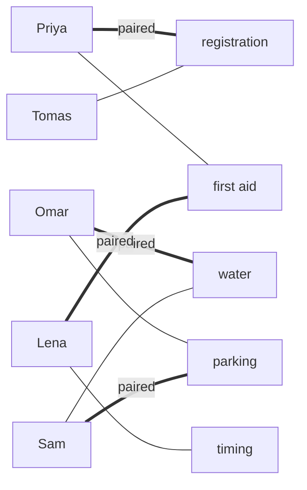
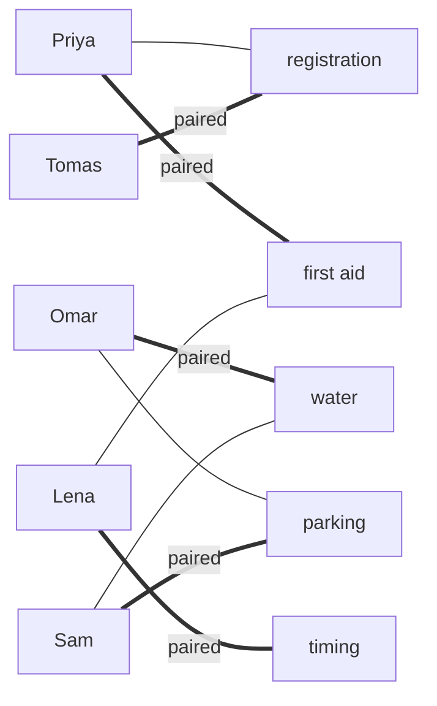

# Matchings: pair up vertices with no one used twice, and a matching is largest exactly when no alternating route can improve it

[Syllabus](../../../SYLLABUS.md) → [Combinatorics and graphs](../../../SYLLABUS.md#w04) → [Matchings and Flows](../../../SYLLABUS.md#w04-s13) → Matchings

---

## General Overview

A 10k fun run needs five jobs covered: registration, first aid, water, parking and timing. Five volunteers have ticked the jobs they can do.

| Volunteer | Can do |
| --- | --- |
| Priya | registration, first aid |
| Omar | water, parking |
| Lena | first aid, timing |
| Sam | water, parking |
| Tomas | registration |

In sheet order, each person takes the first free job on their list. Priya takes registration, Omar water, Lena first aid, Sam parking. Tomas's only job is gone. Four jobs covered, timing empty, Tomas idle.

Every unused tick touches a person or job already taken, so nothing can be added. Yet Tomas can take registration, Priya move to first aid, Lena move to timing: five covered. That chain of swaps runs from a free person to a free job, and this card proves such a chain is the only thing a pairing can ever be missing.

**A pairing is as large as it can be exactly when no chain of swaps runs from an unpaired person to an unpaired job.**

**What kind of fact this is:** a theorem, Berge's, proved on this card in Why it works; matching, maximal and maximum are definitions.

### The picture: where greedy stops



One line per tick, 9 in all; thick lines are greedy's four pairs. Tomas and timing touch none.

---

## The formula

The sign-up sheet is a **bipartite graph** $G$: dots in two groups, volunteers and jobs, every line running from one group to the other ([Bipartite graphs](../09-Graphs%20-%20Dots%20and%20Lines/05-bipartite-graphs-and-odd-cycles.md)). A **matching** $M$ is a set of lines no two sharing a dot: nobody works two jobs. Bars count lines, so $\lvert M\rvert$ is the matching's size. A dot on a line of $M$ is **matched**; any other dot is **free**.

**Maximal**: no line can be added as it stands. **Maximum**: no matching of $G$ is larger; that size is $\nu(G)$, read "nu of G". **Perfect**: every dot is matched. Greedy's four pairs are maximal, not maximum.

An **alternating path** switches at every step between lines outside $M$ and lines inside it. It is **augmenting**, written $P$, when both its ends are free. The shortest has one line: an unused line between two free dots. Maximal means none of those; maximum, by the theorem below, means none of any length.

$$M \text{ is maximum} \iff G \text{ has no augmenting path for } M$$

**Read it aloud:** a matching is as big as possible exactly when no alternating route joins two free dots.

The repair, where a triangle between two sets of lines means the lines in exactly one of them:

$$\lvert M \triangle P\rvert = \lvert M\rvert + 1$$

**Read it aloud:** flip every line of an augmenting path, in for out and out for in, and the matching grows by one.

| Symbol | Plain meaning | In our example | Push it up and the answer… |
| --- | --- | --- | --- |
| $G$ | the graph: people and jobs as dots, ticks as lines | 5 and 5 dots, 9 lines | more lines, more room to pair |
| $M$ | a matching: lines sharing no dot | greedy's 4 pairs | — |
| $\lvert M\rvert$ | its size, the count of pairs | 4, then 5 | — |
| $\nu(G)$ | the largest size any matching of $G$ reaches | 5 | — |
| $P$ | an augmenting path: alternating, free at both ends | Tomas's 5-line route to timing | a longer route moves more people |
| $u$, $w$ | the two free ends of $P$ | Tomas and timing | — |
| $M \triangle P$ | lines in exactly one of $M$ and $P$: the flipped matching | the 5 pairs after the swap | — |
| $M^*$ | a larger matching, used in the proof | the other perfect matching | — |

### When it holds

- **Any finite graph, not only two-sided ones.** The proof never uses the two groups; the code's simple search does, since an odd loop can fool it, and general graphs need Edmonds' blossom method, a later wing.
- **Both ends free.** A route ending at a matched dot only moves the gap: stopping the swap at Lena leaves 4 pairs.
- **Size, not preference or cost.** Who would rather do what, and what a pairing costs, are [Stable matching](04-stable-matching-gale-shapley.md) and The assignment problem.

---

## Why it works

### Step 0: a route between two free dots has one spare line

An augmenting path starts and ends at free dots, so its first and last lines are outside $M$. In between, lines alternate. So it holds one more outside line than inside line. Tomas's route has 5 lines: 3 out, 2 in.

### Step 1: a route means the matching is not maximum

Flip the path: its outside lines join $M$, its inside lines leave. Each middle dot swaps one partner for another; the two free ends gain one each; other dots are untouched. The result is a matching one line larger: on the sheet, two pairs leave, three join.

### Step 2: no route means the matching is maximum

Suppose a larger matching $M^*$ exists. Keep the lines in exactly one of the two. Each dot touches at most one line of each, so at most two kept lines. Such lines fall into pieces, each a path or a closed loop, alternating between $M$ and $M^*$.

A loop holds equal numbers of each; a path, equal numbers or one more of one kind. Since $M^*$ is larger, some piece is a path starting and ending with lines of $M^*$. Its ends are free in $M$, so it is augmenting. Turned round: no augmenting path means no larger matching.

On the sheet, greedy and the other perfect matching differ on all 9 lines, 5 against 4: Tomas's route, 3 against 2, and the loop Omar-water-Sam-parking, 2 against 2.

<details>
<summary>Detailed proof</summary>

Let $\lvert M^*\rvert > \lvert M\rvert$ and keep the lines of $M \triangle M^*$. Each dot lies on at most one line of each matching, so on at most two kept lines, one from each.

A connected piece in which every dot has at most two lines is a path or a cycle. Consecutive lines share a dot, so they come from different matchings. An alternating cycle has even length and equal counts; a path has equal counts or one more of one kind.

Lines shared by both matchings are dropped from each count equally, so the kept lines still hold more of $M^*$. Some piece is therefore a path $P$ whose first and last lines lie in $M^*$. Let $u$ be an end. If $M$ matched $u$, that line of $M$ is not in $M^*$, since $u$ already has its $M^*$ line in $P$; so it is kept, and $P$ would continue past $u$. It does not, so $u$ is free in $M$, and likewise the other end $w$. So $P$ is augmenting for $M$. With Step 1, $M$ is maximum if and only if no augmenting path exists.

</details>

### Step 3: the theorem is also a method

Start from any matching, even the empty one. Search for an augmenting path, flip it, repeat. Each flip adds a pair, and pairs cannot outnumber half the dots, so the loop ends; an empty search certifies a maximum. Claude Berge proved the theorem in 1957.

The code's search starts at a free volunteer: a free job ends the route, a taken one hands the search to its holder.

A second road: treat each tick as a pipe carrying one unit from volunteers to jobs. An augmenting path is then a route carrying one more unit, taken properly in [Flows](05-flow-networks-and-ford-fulkerson.md).

---

## Worked numbers, by hand

| Step | Arithmetic | Value |
| --- | --- | --- |
| lines on the sheet | Priya 2, Omar 2, Lena 2, Sam 2, Tomas 1 | 9 |
| greedy, in sheet order | Priya-registration, Omar-water, Lena-first aid, Sam-parking | 4 |
| free after greedy | Tomas, and timing | 2 dots |
| augmenting route | Tomas, registration, Priya, first aid, Lena, timing | 5 lines, 3 out, 2 in |
| after the flip | 4 − 2 + 3 | **5** |
| every set of the 9 lines | 2 × 2 × … × 2, nine times | 512 sets |
| of those, matchings of size 0 to 5 | counted one by one | 1, 9, 28, 35, 16, 2 |
| largest | the last non-zero count | **5** |
| perfect matchings | Tomas, Priya, Lena forced; Omar and Sam can swap | **2** |

Every job is staffed by moving two people, not by finding a sixth.

### The picture: after the swap



Five thick lines, no dot on two of them.

### What breaks if you drop a piece

| Mistake | Comes out at | What went wrong |
| --- | --- | --- |
| Stop when nothing can be added | 4 pairs | Maximal is not maximum: the fix also removes lines |
| Swap only as far as Lena | 4 pairs, Lena idle | The route ended at a matched dot, so the gap only moved |
| Rerun greedy in a luckier order | only 20 of 120 orders reach 5 | Greedy needs Tomas, Priya, Lena in that order: luck, not a guarantee |

The code prints all three.

---

## Code, from first principles, and it actually runs

Nothing is imported. Road one runs greedy, finds the augmenting path and flips it: 5. Road two tries all 512 sets of lines and counts matchings by size: 5 again. It also tests Berge on all 91 matchings, and recounts perfect matchings over all 120 ways to hand out the jobs.

### Python

```python
# Matchings and augmenting paths -- the check behind the card.  Nothing is imported.
# Five volunteers, five tasks, nine 'can do' lines.  Road one: a greedy pairing repaired
# by an alternating route.  Road two: all 512 sets of lines, for the largest and for Berge.
TASKS = ["registration", "first aid", "water", "parking", "timing"]
NAMES = ["Priya", "Omar", "Lena", "Sam", "Tomas"]
CAN = [[0, 1], [2, 3], [1, 4], [2, 3], [0]]
LINES = [(v, t) for v in range(5) for t in CAN[v]]
def greedy(order):                  # each takes the first task on their list still free
    owner = [-1] * 5
    for v in order:
        free = [t for t in CAN[v] if owner[t] < 0]
        if free: owner[free[0]] = v
    return owner
def route(v, owner, seen):          # alternating route from volunteer v to a free task
    for t in CAN[v]:
        if t not in seen:
            seen.add(t)
            if owner[t] < 0: return [v, t]
            rest = route(owner[t], owner, seen)
            if rest: return [v, t] + rest
def augmenting(owner):              # the first route found from an unpaired volunteer
    routes = [route(v, owner, set()) for v in range(5) if v not in owner]
    return next((r for r in routes if r), None)
def flip(owner, r):                 # the route's outside lines go in, its inside lines out
    owner = owner[:]
    for i in range(0, len(r), 2): owner[r[i + 1]] = r[i]
    return owner
def perms(xs):                      # every order of a list, written out here
    return [[x] + p for x in xs for p in perms([y for y in xs if y != x])] if xs else [[]]
size = lambda owner: sum(1 for v in owner if v >= 0)
show = lambda owner: ", ".join(f"{NAMES[v]}-{TASKS[t]}" for t, v in enumerate(owner) if v >= 0)
g = greedy(range(5)); r = augmenting(g); fixed = flip(g, r); half = flip(g, r[:4])
by_size, agree, perfect = [0] * 6, 0, []
for mask in range(1 << len(LINES)):                         # road two: every set of lines
    pick = [LINES[i] for i in range(len(LINES)) if mask >> i & 1]
    if len({v for v, _ in pick}) < len(pick) or len({t for _, t in pick}) < len(pick): continue
    by_size[len(pick)] += 1
    owner = [next((v for v, u in pick if u == t), -1) for t in range(5)]
    if len(pick) == 5: perfect.append(owner)
    agree += (augmenting(owner) is not None) == (len(pick) < 5)
census = sum(all(p[v] in CAN[v] for v in range(5)) for p in perms(list(range(5))))
orders = perms(list(range(5))); hits = sum(size(greedy(o)) == 5 for o in orders)
best, other = max(k for k in range(6) if by_size[k]), [p for p in perfect if p != fixed][0]
print(f"volunteers 5, tasks 5, can-do lines {len(LINES)}")
print(f"greedy, in listed order: {show(g)}; size {size(g)}")
print(f"augmenting route: {' - '.join((NAMES if i % 2 == 0 else TASKS)[x] for i, x in enumerate(r))}; {len(r) - 1} lines, {len(r) // 2} out, {len(r) // 2 - 1} in")
print(f"after the flip: {show(fixed)}; size {size(fixed)}; route left: {'yes' if augmenting(fixed) else 'none'}")
print(f"matchings by size 0 to 5, from all {1 << len(LINES)} sets of lines: {by_size}")
print(f"largest by brute force: {best}; perfect matchings: {len(perfect)}; by all 120 orders of tasks: {census}")
print(f"Berge on every matching, route found exactly when size < 5: {agree} of {sum(by_size)}")
print(f"greedy orders of volunteers that reach 5: {hits} of {len(orders)}")
print(f"the other perfect matching: {show(other)}")
print(f"lines in exactly one of greedy and it: {sum((g[t] == v) != (other[t] == v) for v, t in LINES)}, "
      f"{sum(other[t] == v != g[t] for v, t in LINES)} from it, {sum(g[t] == v != other[t] for v, t in LINES)} from greedy")
print(f"mistake, flip the route only as far as Lena: {show(half)}; size {size(half)}")
assert best == size(fixed) and size(g) < best                    # two roads to 5
assert agree == sum(by_size)                                     # Berge on all matchings
assert len(perfect) == census                                    # two counts of perfect
assert hits * 6 == len(orders)       # greedy wins only when Tomas, Priya, Lena come in that order
print("ALL CHECKS PASS")
```

**Ran 2026-09-19 on macOS, Python 3.14.6, standard library only. All checks passed. Output, pasted from the run:**

```
volunteers 5, tasks 5, can-do lines 9
greedy, in listed order: Priya-registration, Lena-first aid, Omar-water, Sam-parking; size 4
augmenting route: Tomas - registration - Priya - first aid - Lena - timing; 5 lines, 3 out, 2 in
after the flip: Tomas-registration, Priya-first aid, Omar-water, Sam-parking, Lena-timing; size 5; route left: none
matchings by size 0 to 5, from all 512 sets of lines: [1, 9, 28, 35, 16, 2]
largest by brute force: 5; perfect matchings: 2; by all 120 orders of tasks: 2
Berge on every matching, route found exactly when size < 5: 91 of 91
greedy orders of volunteers that reach 5: 20 of 120
the other perfect matching: Tomas-registration, Priya-first aid, Sam-water, Omar-parking, Lena-timing
lines in exactly one of greedy and it: 9, 5 from it, 4 from greedy
mistake, flip the route only as far as Lena: Tomas-registration, Priya-first aid, Omar-water, Sam-parking; size 4
ALL CHECKS PASS
```

### Rust

Same numbers, same labels, built with `rustc --edition 2021 -O`.

```rust
// Matchings and augmenting paths -- the same check as the Python, in Rust.  No crates.
// Five volunteers, five tasks, nine 'can do' lines.  Road one: a greedy pairing repaired
// by an alternating route.  Road two: all 512 sets of lines, for the largest and for Berge.
const TASKS: [&str; 5] = ["registration", "first aid", "water", "parking", "timing"];
const NAMES: [&str; 5] = ["Priya", "Omar", "Lena", "Sam", "Tomas"];
const CAN: [&[i32]; 5] = [&[0, 1], &[2, 3], &[1, 4], &[2, 3], &[0]];
type Pairs = [i32; 5];                           // which volunteer holds each task, -1 none
fn greedy(order: &[i32]) -> Pairs {              // each takes the first task on their list still free
    let mut owner = [-1; 5];
    for &v in order {
        if let Some(&t) = CAN[v as usize].iter().find(|&&t| owner[t as usize] < 0) { owner[t as usize] = v }
    }
    owner
}
fn route(v: i32, owner: &Pairs, seen: &mut Vec<i32>) -> Option<Vec<i32>> {  // alternating route to a free task
    for &t in CAN[v as usize] {
        if seen.contains(&t) { continue }
        seen.push(t);
        if owner[t as usize] < 0 { return Some(vec![v, t]) }
        if let Some(rest) = route(owner[t as usize], owner, seen) { return Some([vec![v, t], rest].concat()) }
    }
    None
}
fn augmenting(owner: &Pairs) -> Option<Vec<i32>> {  // the first route found from an unpaired volunteer
    (0..5).filter(|v| !owner.contains(v)).find_map(|v| route(v, owner, &mut Vec::new()))
}
fn flip(owner: &Pairs, r: &[i32]) -> Pairs {     // the route's outside lines go in, its inside lines out
    let mut out = *owner;
    for i in (0..r.len()).step_by(2) { out[r[i + 1] as usize] = r[i] }
    out
}
fn perms(xs: &[i32]) -> Vec<Vec<i32>> {          // every order of a list, written out here
    if xs.is_empty() { return vec![vec![]] }
    xs.iter().flat_map(|&x| { let rest: Vec<i32> = xs.iter().copied().filter(|&y| y != x).collect();
        perms(&rest).into_iter().map(move |p| [vec![x], p].concat()) }).collect()
}
fn size(o: &Pairs) -> usize { o.iter().filter(|&&v| v >= 0).count() }
fn show(o: &Pairs) -> String {
    (0..5).filter(|&t| o[t] >= 0).map(|t| format!("{}-{}", NAMES[o[t] as usize], TASKS[t])).collect::<Vec<_>>().join(", ")
}
fn main() {
    let lines: Vec<(i32, i32)> = (0..5).flat_map(|v| CAN[v as usize].iter().map(move |&t| (v, t))).collect();
    let g = greedy(&[0, 1, 2, 3, 4]); let r = augmenting(&g).unwrap();
    let (fixed, half) = (flip(&g, &r), flip(&g, &r[..4]));
    let (mut by_size, mut agree, mut perfect) = ([0usize; 6], 0, Vec::new());
    for mask in 0u32..(1 << lines.len()) {       // road two: every set of lines
        let pick: Vec<(i32, i32)> = (0..lines.len()).filter(|i| mask >> i & 1 == 1).map(|i| lines[i]).collect();
        let (mut vs, mut ts) = (vec![], vec![]);
        if pick.iter().any(|&(v, t)| { let clash = vs.contains(&v) || ts.contains(&t); vs.push(v); ts.push(t); clash }) { continue }
        by_size[pick.len()] += 1;
        let mut owner = [-1; 5]; for &(v, t) in &pick { owner[t as usize] = v }
        if pick.len() == 5 { perfect.push(owner) }
        if augmenting(&owner).is_some() == (pick.len() < 5) { agree += 1 }
    }
    let (best, orders) = ((0..6).filter(|&k| by_size[k] > 0).max().unwrap(), perms(&[0, 1, 2, 3, 4]));
    let census = orders.iter().filter(|p| (0..5).all(|v| CAN[v].contains(&p[v]))).count();
    let hits = orders.iter().filter(|o| size(&greedy(o)) == 5).count();
    let other = *perfect.iter().find(|&&p| p != fixed).unwrap();
    let words: Vec<&str> = r.iter().enumerate().map(|(i, &x)| if i % 2 == 0 { NAMES[x as usize] } else { TASKS[x as usize] }).collect();
    let held = |o: &Pairs, v: i32, t: i32| o[t as usize] == v;
    println!("volunteers 5, tasks 5, can-do lines {}", lines.len());
    println!("greedy, in listed order: {}; size {}", show(&g), size(&g));
    println!("augmenting route: {}; {} lines, {} out, {} in", words.join(" - "), r.len() - 1, r.len() / 2, r.len() / 2 - 1);
    println!("after the flip: {}; size {}; route left: {}", show(&fixed), size(&fixed), if augmenting(&fixed).is_some() { "yes" } else { "none" });
    println!("matchings by size 0 to 5, from all {} sets of lines: {:?}", 1 << lines.len(), by_size);
    println!("largest by brute force: {}; perfect matchings: {}; by all 120 orders of tasks: {}", best, perfect.len(), census);
    println!("Berge on every matching, route found exactly when size < 5: {} of {}", agree, by_size.iter().sum::<usize>());
    println!("greedy orders of volunteers that reach 5: {} of {}", hits, orders.len());
    println!("the other perfect matching: {}", show(&other));
    println!("lines in exactly one of greedy and it: {}, {} from it, {} from greedy",
        lines.iter().filter(|&&(v, t)| held(&g, v, t) != held(&other, v, t)).count(),
        lines.iter().filter(|&&(v, t)| held(&other, v, t) && !held(&g, v, t)).count(),
        lines.iter().filter(|&&(v, t)| held(&g, v, t) && !held(&other, v, t)).count());
    println!("mistake, flip the route only as far as Lena: {}; size {}", show(&half), size(&half));
    assert!(best == size(&fixed) && size(&g) < best);                 // two roads to 5
    assert!(agree == by_size.iter().sum::<usize>());                  // Berge on all matchings
    assert!(perfect.len() == census);                                 // two counts of perfect
    assert!(hits * 6 == orders.len());  // greedy wins only when Tomas, Priya, Lena come in that order
    println!("ALL CHECKS PASS");
}
```

**Ran 2026-09-19 on macOS, rustc 1.98.1, no crates. All checks passed. Output, pasted from the run:**

```
volunteers 5, tasks 5, can-do lines 9
greedy, in listed order: Priya-registration, Lena-first aid, Omar-water, Sam-parking; size 4
augmenting route: Tomas - registration - Priya - first aid - Lena - timing; 5 lines, 3 out, 2 in
after the flip: Tomas-registration, Priya-first aid, Omar-water, Sam-parking, Lena-timing; size 5; route left: none
matchings by size 0 to 5, from all 512 sets of lines: [1, 9, 28, 35, 16, 2]
largest by brute force: 5; perfect matchings: 2; by all 120 orders of tasks: 2
Berge on every matching, route found exactly when size < 5: 91 of 91
greedy orders of volunteers that reach 5: 20 of 120
the other perfect matching: Tomas-registration, Priya-first aid, Sam-water, Omar-parking, Lena-timing
lines in exactly one of greedy and it: 9, 5 from it, 4 from greedy
mistake, flip the route only as far as Lena: Tomas-registration, Priya-first aid, Omar-water, Sam-parking; size 4
ALL CHECKS PASS
```

The two outputs match line for line.

> [!TIP]
> **Try changing**
> Guess first, then run it. The fourth assert is pinned to this sheet's greedy count.
> - **Tomas also ticks first aid.** Set his list to `[0, 1]`. Greedy still stalls at 4 and the same route repairs it; perfect matchings double to 4, 40 of 120 orders reach 5, and the fourth assert stops it.
> - **Lena lists timing first.** Set her list to `[4, 1]`. Greedy leaves first aid empty and the route shrinks to 3 lines, ending at first aid; 60 of 120 orders reach 5, and the fourth assert stops it.
> - **Priya lists first aid first.** Set her list to `[1, 0]`. Greedy reaches 5 alone, no route exists, and the program halts: there is nothing to flip.

---

## The usual mistake

> [!warning]
> **Reading "nothing can be added" as "as large as possible".** Greedy's four pairs take no fifth line, yet five pairs exist. Only the absence of an augmenting path certifies a maximum.
>
> - **Stopping a swap at a busy dot.** Swapping only as far as Lena still gives 4.
> - **Rerunning greedy until it works.** Only 20 of 120 orders reach 5, and greedy never knows it failed.
> - **Counting lines instead of pairs.** Nine ticks do not promise five pairs: of the 91 matchings, only 2 reach 5.

---

## Where you meet it in real life

- **Rostering and dispatch.** Nurses to shifts, drivers to waiting riders, reviewers to papers: one each, and a stuck draft is repaired by a chain of reassignments.
- **Hiring.** Whether every applicant can be placed at all is decided by [Hall's theorem](02-halls-marriage-theorem.md).
- **Network flow.** Pairing is the smallest case of pushing traffic through pipes, leading to [Max-flow min-cut](06-max-flow-min-cut.md).

> **Say it back**
> A matching pairs dots along lines, no dot used twice. A matching that takes no extra line may still not be the largest. An augmenting path runs between two free dots, alternating out and in, with one spare outside line; flipping it adds a pair. If no such path exists, the matching is the largest, because any larger one would leave such a path in the difference.

---

## What this builds on

- [Bipartite graphs](../09-Graphs%20-%20Dots%20and%20Lines/05-bipartite-graphs-and-odd-cycles.md): the two-sided graph, and the odd loops that complicate the search outside it.

## Where this goes next

- [Hall's theorem](02-halls-marriage-theorem.md): when a matching can cover one whole side.
- [Stable matching](04-stable-matching-gale-shapley.md): pairings that respect preferences, not only size.
- The assignment problem: the cheapest perfect matching when every pair has a cost.
- Total unimodularity: why matching problems solved with fractions still land on whole pairs.
- Permanent against determinant: counting perfect matchings, the 2 here, is easy to state and hard to compute.

Berge says when a matching is stuck but not why; which crowded group of volunteers blocks a full pairing is the question [Hall's theorem](02-halls-marriage-theorem.md) answers.

---

## Sources

Verified 24 Sep 2026: every link below opens a page naming the cited work; the DOI's title and author checked against Crossref.

- Berge, Claude. "Two Theorems in Graph Theory." *Proceedings of the National Academy of Sciences* 43, no. 9 (1957): 842–844. [doi:10.1073/pnas.43.9.842](https://doi.org/10.1073/pnas.43.9.842). The augmenting-path theorem, stated for any graph.
- Diestel, Reinhard. *Graph Theory*, 6th ed. Graduate Texts in Mathematics 173. Springer, 2025. [Book page, with the free electronic edition](https://diestel-graph-theory.com/). Chapter 2: alternating and augmenting paths, and the search in two-sided graphs.
- Bondy, J. A., and U. S. R. Murty. *Graph Theory*. Graduate Texts in Mathematics 244. Springer, 2008. [Publisher page](https://link.springer.com/book/9781846289699). The matching chapter proves Berge by the difference of two matchings, as in Step 2.
- Lovász, László, and Michael D. Plummer. *Matching Theory*. AMS Chelsea Publishing, 2009. [Publisher page](https://bookstore.ams.org/chel-367-h). The full theory, including the blossom method for graphs with odd loops.
