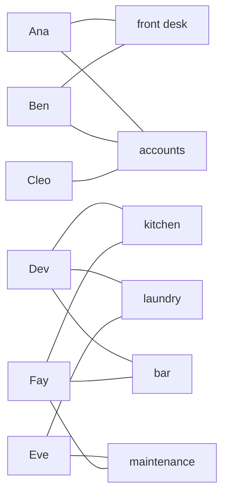
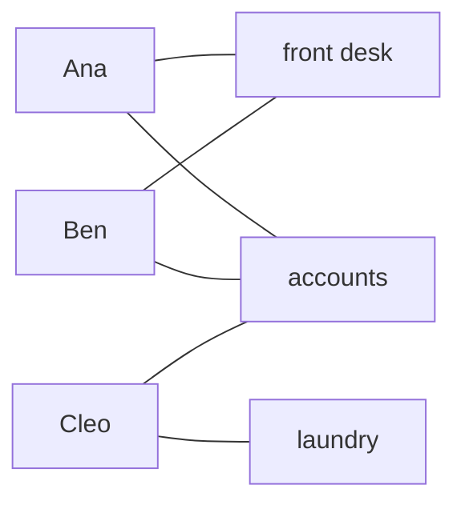

# Hall's theorem: everyone on the left can be matched exactly when no group of them shares too few options

[Syllabus](../../../SYLLABUS.md) → [Combinatorics and graphs](../../../SYLLABUS.md#w04) → [Matchings and Flows](../../../SYLLABUS.md#w04-s13) → Hall's theorem

---

## General Overview

A small hotel is hiring. Six applicants, Ana, Ben, Cleo, Dev, Eve and Fay, and six posts: front desk, kitchen, laundry, bar, maintenance, accounts. Each applicant is qualified for some posts. One person per post, one post per person. Can all six be placed?

Everyone qualifies for something, yet it cannot be done. Ana, Ben and Cleo are qualified only for front desk and accounts: three people, two posts. One of them is always left out. Five placements is the ceiling.

Philip Hall proved in 1935 that crowding is the only thing that can go wrong. If no group is squeezed into fewer posts than it has members, a full placement exists, and the proof builds one.

**A full placement exists exactly when every group of applicants is between them qualified for at least as many posts as the group has members.**

**What kind of fact this is:** a theorem, proved on this card in Why it works.

### The picture: where the hiring jams



Applicants on the left, posts on the right, one line per qualification: 13 lines. Ana, Ben and Cleo touch two posts between them; Dev, Eve and Fay reach four. One crowded group stops the whole placement.

---

## The formula

The hiring is a **bipartite graph**: dots in two groups, every line running across, none inside a group ([Matchings](01-matchings-and-augmenting-paths.md)). Call it $G$, the applicants $A$, the posts $B$. A **matching** is a set of lines, no two sharing an applicant or a post. It **covers** $A$ when every applicant is on one of its lines: a full placement.

Write $S$ for any group of applicants and $N(S)$ for the posts it reaches, every post at least one member is qualified for ($N$ for neighbours). Bars count members: $\lvert S\rvert$ applicants, $\lvert N(S)\rvert$ posts.

$$\lvert N(S)\rvert \;\ge\; \lvert S\rvert \qquad \text{for every group } S \text{ of applicants}$$

**Read it aloud:** no group of applicants is qualified, between them, for fewer posts than the group has members.

That is **Hall's condition**. The theorem: a matching covering $A$ exists exactly when it holds.

| Symbol | Plain meaning | In our example | Push it up and the answer… |
| --- | --- | --- | --- |
| $G$ | the bipartite graph | 6 applicants, 6 posts, 13 lines | more lines, more room |
| $A$ | the side to be covered | the six applicants | more ways to crowd |
| $B$ | the other side | the six posts | easier to place |
| $S$, $T$ | any group of applicants; $\lvert S\rvert$ counts its members | Ana, Ben, Cleo, so 3 | — |
| $N(S)$ | the posts that group reaches; $\lvert N(S)\rvert$ counts them | front desk and accounts, so 2 | — |
| $a$, $b$ | one applicant and one post she qualifies for | Cleo, accounts | — |
| $\nu(G)$ | the largest matching's size, read "nu of G" | 5 before the repair, 6 after | — |
| $d$ | the defect: the worst group's members minus its posts | 1 before the repair, 0 after | fewer placed |

One helper formula. The **defect** is the worst crowding: the most by which any group, the empty one included, outnumbers its posts. It is never below 0.

$$\nu(G) \;=\; \lvert A\rvert - \max_S \bigl(\lvert S\rvert - \lvert N(S)\rvert\bigr)$$

**Read it aloud:** the most applicants that can be placed is all of them minus the worst crowding. The hotel's defect is 1, so 5 can start. Hall's condition is defect 0.

### When it holds

- **Finitely many applicants.** The induction must reach the bottom. With infinitely many, the condition can hold and placement still fail: one applicant qualified for posts 1, 2, 3, …, and applicant 1 for post 1 alone, applicant 2 for post 2 alone, and so on.
- **Two sides, lines only across.** If lines may join two applicants, the condition is not enough; a different test (Tutte's) takes over.
- **One side covered, not both.** With more posts than applicants, some posts stay empty.
- **Existence, not a best choice.** Whether anyone would swap, and what a placement costs, are separate questions ([Stable matching](04-stable-matching-gale-shapley.md), The assignment problem).

---

## Why it works

### Step 0: one obstruction is obvious, and the theorem says it is the only one

A crowded group plainly blocks a placement. What needs proving is that nothing else can: no subtler tangle, no unlucky order of hiring. The proof builds a placement from the condition alone.

### Step 1: any full placement forces the condition

Take a full placement and any group $S$. Its members hold $\lvert S\rvert$ different posts, since no post is shared, and each of those posts is one its holder is qualified for, so each lies in $N(S)$. Hence $\lvert N(S)\rvert \ge \lvert S\rvert$.

So Ana, Ben and Cleo, reaching two posts, prove without any search that the hotel cannot place all six.

### Step 2: the condition is enough, by working down to a smaller hiring

The other direction is an induction on the number of applicants ([Strong induction and the least element](../../01-Foundations/06-Proof/05-strong-induction-and-well-ordering.md)): assume the theorem for every hiring with fewer applicants. With no applicants there is nothing to place.

Call a group **tight** when it reaches exactly as many posts as it has members, as Ana and Ben do. Two cases.

**Case 1, room to spare everywhere.** Every non-empty group short of all of $A$ reaches more posts than it has members. Place any applicant $a$ in any post $b$ she is qualified for, and delete both. Each remaining group loses at most that one post, and it had one to spare. The condition survives, and the induction places the rest.

**Case 2, some tight group.** Let $S$ be tight, neither empty nor all of $A$. A group inside $S$ reaches the same posts as before, so the condition holds for $S$ alone, and the induction places $S$ into all of $N(S)$. Delete $S$ and $N(S)$, and take any group $T$ of the applicants left. The induction places them too, once $T$ still reaches at least $\lvert T\rvert$ posts.

<details>
<summary>Detailed proof of the last step</summary>

Every post reached by $S$ or $T$ in the original hiring lies either in $N(S)$ or among the posts $T$ reaches after the deletion, and those two sets share nothing. So $\lvert N(S)\rvert$ plus $T$'s new reach is at least $\lvert N(S \cup T)\rvert$, which is at least $\lvert S\rvert + \lvert T\rvert$ by Hall's condition on the group $S \cup T$ (the members of $S$ and of $T$ together). Cancelling $\lvert N(S)\rvert = \lvert S\rvert$ leaves $T$'s new reach at least $\lvert T\rvert$. Together the two placements cover $A$.

</details>

### Step 3: when it fails, the worst group counts who is left out

Say the worst group beats its reach by $d$, the defect. At least $d$ applicants go unplaced, since that group has $d$ more members than posts. The count is exact: add $d$ spare posts everyone is qualified for. Every non-empty group's reach grows by $d$, so everyone is placed; at most $d$ sit in spare posts, so at least $\lvert A\rvert - d$ hold real ones. The bounds meet: at the hotel, 5 exactly.

Another road: treat the hiring as a network with a pipe along every line. A full placement is a flow of $\lvert A\rvert$ units, and a crowded group is a cheap place to cut the network: [Max-flow min-cut](06-max-flow-min-cut.md).

---

## Worked numbers, by hand

| Step | Arithmetic | Value |
| --- | --- | --- |
| the qualification lines | Ana 2, Ben 2, Cleo 1, Dev 3, Eve 2, Fay 3 | 13 |
| groups to check | each applicant in or out: 2 × 2 × 2 × 2 × 2 × 2 | 64 |
| the group Ana, Ben, Cleo | posts reached: front desk, accounts | 2 |
| its gap | 3 members − 2 posts | **1** |
| largest placement | 6 applicants − gap 1 | **5** |
| Cleo trains on the laundry: one new line | that group now reaches front desk, accounts, laundry | 3 |
| worst gap after the repair | the largest gap over all 64 groups | **0** |
| full placements after the repair | counted one at a time | **4** |

Five start and one cannot; one extra qualification gives a full staff, four different ways.

### The picture: one line repairs it



The crowded corner after Cleo's laundry training: three applicants, three posts. The other three keep their lines.

### What breaks if you drop a piece

| Mistake | Comes out at | What went wrong |
| --- | --- | --- |
| Checking applicants one at a time | 6 of 6 pass, yet only 5 are placed | Nobody is stuck alone; the trio is stuck together |
| Counting the trio's lines, not the posts they reach | 5 lines for 3 members, so it looks comfortable | Ana's two lines and Ben's two land on the same two posts |
| Deleting the accounts post after the repair | 5 placed, gap back to 1 | Ana and Ben are squeezed onto front desk alone |

---

## Code, from first principles, and it actually runs

Nothing is imported. Both hirings are settled three ways that share no arithmetic: Hall's condition on all 64 groups; an augmenting-path search that never mentions Hall; and a census of complete placements. A third hiring, the repaired one minus accounts, tests the defect count.

### Python

```python
# Hall's theorem -- the check behind the card.  Nothing is imported.  Six
# applicants and six jobs at a small hotel; a line joins an applicant to a job
# she is qualified for.  Three roads: Hall's condition over all 64 groups, an
# augmenting-path search that never mentions Hall, and a census of placements.
JOBS = ["front desk", "kitchen", "laundry", "bar", "maintenance", "accounts"]
NAMES = ["Ana", "Ben", "Cleo", "Dev", "Eve", "Fay"]
BLOCKED = [[0, 5], [0, 5], [5], [1, 2, 3], [2, 4], [3, 4, 1]]
REPAIRED = [[0, 5], [0, 5], [5, 2], [1, 2, 3], [2, 4], [3, 4, 1]]
NO_ACCOUNTS = [[j for j in a if j != 5] for a in REPAIRED]

def worst_gap(adj):                        # road one: Hall's count on every group
    gap, who = 0, ()
    for mask in range(1 << len(adj)):
        group = tuple(i for i in range(len(adj)) if mask >> i & 1)
        short = len(group) - len({j for i in group for j in adj[i]})
        if short > gap: gap, who = short, group
    return gap, who

def augment(adj, i, taken, seen):          # road two: the alternating-path search
    for j in adj[i]:
        if not seen[j]:
            seen[j] = True
            if taken[j] < 0 or augment(adj, taken[j], taken, seen):
                taken[j] = i
                return True
    return False

def hold(adj):                             # which applicant holds each job, -1 none
    taken = [-1] * len(JOBS)
    for i in range(len(adj)): augment(adj, i, taken, [False] * len(JOBS))
    return taken

def census(adj, i=0, used=()):             # road three: count complete placements
    if i == len(adj): return 1
    return sum(census(adj, i + 1, used + (j,)) for j in adj[i] if j not in used)
def size(taken): return sum(1 for i in taken if i >= 0)    # jobs that ended up filled

n, (gap_b, trio) = len(NAMES), worst_gap(BLOCKED)
gap_r, gap_c = worst_gap(REPAIRED)[0], worst_gap(NO_ACCOUNTS)[0]
held_b, held_r, held_c = hold(BLOCKED), hold(REPAIRED), hold(NO_ACCOUNTS)
full_b, full_r = census(BLOCKED), census(REPAIRED)
left_out = ", ".join(NAMES[i] for i in range(n) if i not in held_b)
trio_names, trio_lines = ", ".join(NAMES[i] for i in trio), sum(len(BLOCKED[i]) for i in trio)
trio_reach, singles = len({j for i in trio for j in BLOCKED[i]}), sum(1 for a in BLOCKED if a)
pairs = " ".join(f"{NAMES[i]}-{JOBS[j]}" for j, i in sorted(enumerate(held_r), key=lambda p: p[1]))
print(f"applicants {n}, jobs {len(JOBS)}; qualification lines: blocked {sum(len(a) for a in BLOCKED)}, repaired {sum(len(a) for a in REPAIRED)}")
print(f"blocked : worst group of all {1 << n} is {trio_names} -- {len(trio)} applicants, {trio_reach} jobs, gap {gap_b}")
print(f"blocked : augmenting paths place {size(held_b)}; Hall's count {n} - {gap_b} = {n - gap_b}; left out {left_out}")
print(f"repaired: worst gap over all {1 << n} groups is {gap_r}")
print(f"repaired: augmenting paths place {size(held_r)}; Hall's count {n} - {gap_r} = {n - gap_r}")
print(f"repaired: {pairs}")
print(f"complete placements by census: blocked {full_b}, repaired {full_r}")
print(f"mistake 1, one applicant at a time: {singles} of {n} applicants pass, yet only {size(held_b)} are placed")
print(f"mistake 2, the trio's lines counted, not the jobs they reach: {trio_lines} lines, {trio_reach} jobs")
print(f"mistake 3, accounts post deleted from the repaired graph: gap {gap_c}, {size(held_c)} placed")
assert size(held_b) == n - gap_b and size(held_r) == n - gap_r
assert (full_b > 0) == (size(held_b) == n) and (full_r > 0) == (size(held_r) == n)
assert full_r == 4 and size(held_c) == n - gap_c
assert trio == (0, 1, 2) and trio_reach == 2 and singles == n
print("ALL CHECKS PASS")
```

**Ran 2026-09-23 on macOS, Python 3.14.6, standard library only. All checks passed. Output, pasted from the run:**

```
applicants 6, jobs 6; qualification lines: blocked 13, repaired 14
blocked : worst group of all 64 is Ana, Ben, Cleo -- 3 applicants, 2 jobs, gap 1
blocked : augmenting paths place 5; Hall's count 6 - 1 = 5; left out Cleo
repaired: worst gap over all 64 groups is 0
repaired: augmenting paths place 6; Hall's count 6 - 0 = 6
repaired: Ana-accounts Ben-front desk Cleo-laundry Dev-kitchen Eve-maintenance Fay-bar
complete placements by census: blocked 0, repaired 4
mistake 1, one applicant at a time: 6 of 6 applicants pass, yet only 5 are placed
mistake 2, the trio's lines counted, not the jobs they reach: 5 lines, 2 jobs
mistake 3, accounts post deleted from the repaired graph: gap 1, 5 placed
ALL CHECKS PASS
```

### Rust

Same numbers, same labels, built with `rustc --edition 2021 -O`. Groups and filled posts are kept as bits.

```rust
// Hall's theorem -- the same check as halls_marriage_theorem_check.py, in Rust.
// No crates.  Six applicants and six jobs at a small hotel; a line joins an
// applicant to a job she is qualified for.  Three roads: Hall's condition over
// all 64 groups, an augmenting-path search that never mentions Hall, and a
// census of placements.  Groups and used jobs are kept as bits here.
const JOBS: [&str; 6] = ["front desk", "kitchen", "laundry", "bar", "maintenance", "accounts"];
const NAMES: [&str; 6] = ["Ana", "Ben", "Cleo", "Dev", "Eve", "Fay"];

fn worst_gap(adj: &[Vec<usize>]) -> (i32, Vec<usize>) {   // road one: Hall's count
    let (mut gap, mut who) = (0i32, Vec::new());
    for mask in 0..(1u32 << adj.len()) {
        let group: Vec<usize> = (0..adj.len()).filter(|i| mask >> i & 1 == 1).collect();
        let mut reach = 0u32;
        for &i in &group { for &j in &adj[i] { reach |= 1 << j } }
        let short = group.len() as i32 - reach.count_ones() as i32;
        if short > gap { gap = short; who = group }
    }
    (gap, who)
}
fn augment(adj: &[Vec<usize>], i: usize, taken: &mut [i32], seen: &mut [bool]) -> bool {
    for &j in &adj[i] {                                  // road two: alternating paths
        if !seen[j] {
            seen[j] = true;
            if taken[j] < 0 || augment(adj, taken[j] as usize, taken, seen) {
                taken[j] = i as i32;
                return true;
            }
        }
    }
    false
}
fn hold(adj: &[Vec<usize>]) -> Vec<i32> {                // who holds each job, -1 none
    let mut taken = vec![-1i32; JOBS.len()];
    for i in 0..adj.len() { augment(adj, i, &mut taken, &mut vec![false; JOBS.len()]); }
    taken
}
fn census(adj: &[Vec<usize>], i: usize, used: u32) -> u64 {   // road three: placements
    if i == adj.len() { return 1 }
    let mut total = 0;
    for &j in &adj[i] { if used >> j & 1 == 0 { total += census(adj, i + 1, used | 1 << j) } }
    total
}
fn size(taken: &[i32]) -> usize { taken.iter().filter(|&&i| i >= 0).count() }
fn lines(adj: &[Vec<usize>]) -> usize { adj.iter().map(|a| a.len()).sum() }

fn main() {
    let blocked: Vec<Vec<usize>> = vec![vec![0, 5], vec![0, 5], vec![5], vec![1, 2, 3], vec![2, 4], vec![3, 4, 1]];
    let repaired: Vec<Vec<usize>> = vec![vec![0, 5], vec![0, 5], vec![5, 2], vec![1, 2, 3], vec![2, 4], vec![3, 4, 1]];
    let no_accounts: Vec<Vec<usize>> = repaired.iter().map(|a| a.iter().copied().filter(|&j| j != 5).collect()).collect();
    let n = NAMES.len();
    let (gap_b, trio) = worst_gap(&blocked);
    let (gap_r, gap_c) = (worst_gap(&repaired).0, worst_gap(&no_accounts).0);
    let (held_b, held_r, held_c) = (hold(&blocked), hold(&repaired), hold(&no_accounts));
    let (full_b, full_r) = (census(&blocked, 0, 0), census(&repaired, 0, 0));
    let left_out: Vec<&str> = (0..n).filter(|i| !held_b.contains(&(*i as i32))).map(|i| NAMES[i]).collect();
    let trio_names: Vec<&str> = trio.iter().map(|&i| NAMES[i]).collect();
    let trio_lines: usize = trio.iter().map(|&i| blocked[i].len()).sum();
    let mut reach = 0u32;
    for &i in &trio { for &j in &blocked[i] { reach |= 1 << j } }
    let (trio_reach, singles) = (reach.count_ones(), blocked.iter().filter(|a| !a.is_empty()).count());
    let mut order: Vec<(usize, i32)> = held_r.iter().copied().enumerate().collect();
    order.sort_by_key(|p| p.1);
    let pairs: Vec<String> = order.iter().map(|&(j, i)| format!("{}-{}", NAMES[i as usize], JOBS[j])).collect();
    println!("applicants {}, jobs {}; qualification lines: blocked {}, repaired {}", n, JOBS.len(), lines(&blocked), lines(&repaired));
    println!("blocked : worst group of all {} is {} -- {} applicants, {} jobs, gap {}", 1 << n, trio_names.join(", "), trio.len(), trio_reach, gap_b);
    println!("blocked : augmenting paths place {}; Hall's count {} - {} = {}; left out {}", size(&held_b), n, gap_b, n as i32 - gap_b, left_out.join(", "));
    println!("repaired: worst gap over all {} groups is {}", 1 << n, gap_r);
    println!("repaired: augmenting paths place {}; Hall's count {} - {} = {}", size(&held_r), n, gap_r, n as i32 - gap_r);
    println!("repaired: {}", pairs.join(" "));
    println!("complete placements by census: blocked {}, repaired {}", full_b, full_r);
    println!("mistake 1, one applicant at a time: {} of {} applicants pass, yet only {} are placed", singles, n, size(&held_b));
    println!("mistake 2, the trio's lines counted, not the jobs they reach: {} lines, {} jobs", trio_lines, trio_reach);
    println!("mistake 3, accounts post deleted from the repaired graph: gap {}, {} placed", gap_c, size(&held_c));
    assert!(size(&held_b) as i32 == n as i32 - gap_b && size(&held_r) as i32 == n as i32 - gap_r);
    assert!((full_b > 0) == (size(&held_b) == n) && (full_r > 0) == (size(&held_r) == n));
    assert!(full_r == 4 && size(&held_c) as i32 == n as i32 - gap_c);
    assert!(trio == vec![0, 1, 2] && trio_reach == 2 && singles == n);
    println!("ALL CHECKS PASS");
}
```

**Ran 2026-09-23 on macOS, rustc 1.98.1, no crates. All checks passed. Output, pasted from the run:**

```
applicants 6, jobs 6; qualification lines: blocked 13, repaired 14
blocked : worst group of all 64 is Ana, Ben, Cleo -- 3 applicants, 2 jobs, gap 1
blocked : augmenting paths place 5; Hall's count 6 - 1 = 5; left out Cleo
repaired: worst gap over all 64 groups is 0
repaired: augmenting paths place 6; Hall's count 6 - 0 = 6
repaired: Ana-accounts Ben-front desk Cleo-laundry Dev-kitchen Eve-maintenance Fay-bar
complete placements by census: blocked 0, repaired 4
mistake 1, one applicant at a time: 6 of 6 applicants pass, yet only 5 are placed
mistake 2, the trio's lines counted, not the jobs they reach: 5 lines, 2 jobs
mistake 3, accounts post deleted from the repaired graph: gap 1, 5 placed
ALL CHECKS PASS
```

The two outputs match line for line.

> [!TIP]
> **Try changing**
> Guess first, then run it. Each change makes an assert stop the program.
> - **Repair the blocked hiring too.** Change the third list in `BLOCKED` to `[5, 2]`. The worst gap becomes 0, and the last assert stops it.
> - **First choices only.** In `augment`, change `for j in adj[i]` to `for j in adj[i][:1]`. The repaired hiring places 5 while Hall's count says 6: the first assert.
> - **Let two applicants share a post.** In `census`, drop `if j not in used`. The blocked hiring now shows placements: the second assert.

---

## The usual mistake

> [!warning]
> **Checking one applicant at a time.** All 6 pass that test, and the placement still stops at 5. The obstruction is a group, not a person. Counting a group's lines instead of its posts hides it too: the trio has 5 lines and 2 posts.
>
> - **Checking only the whole side.** All six reach all six posts. The crowded group has three members, so only a scan across every size finds it.
> - **Taking it for a pairing everyone accepts.** The theorem gives existence, nothing more ([Stable matching](04-stable-matching-gale-shapley.md)).

---

## Where you meet it in real life

- **Rosters and timetables.** Staff qualified for some shifts, rooms licensed for some classes: the condition says whether a full roster exists.
- **Filling a grid.** Adding a row to a Latin square filled in row by row (a grid where no symbol repeats in a row or column) means giving each column a symbol it may still take. Hall's condition always holds there, so a grid of complete rows can always be finished.
- **The even case is free.** If every applicant qualifies for the same number of posts, and every post has that many qualified applicants, the condition holds unchecked: a group's lines all land in its reach, and each post there takes only that many.

> **Say it back**
> A full placement gives every applicant a post nobody else takes. It exists exactly when no group reaches fewer posts than it has members. One direction is counting: a placement gives each group its own posts. The other is a construction: either every group has a post to spare, so one pair is settled and set aside, or some group is exactly full and is settled inside its own posts. When the condition fails, the worst crowding counts who is left out: 1 at the hotel.

---

## What this builds on

- [Matchings](01-matchings-and-augmenting-paths.md): matchings, and the search the code's second road uses.
- [Strong induction and the least element](../../01-Foundations/06-Proof/05-strong-induction-and-well-ordering.md): why Step 2 may lean on any smaller hiring.

## Where this goes next

- [Konig's theorem](03-konigs-theorem-and-vertex-cover.md): the same fact as the fewest dots touching every line.
- [Max-flow min-cut](06-max-flow-min-cut.md): the crowded group as the cheapest cut of a network.
- The assignment problem: from "a placement exists" to "the cheapest one".

Checking the condition meant listing all 64 groups, a count that doubles with each applicant; finding the crowded group without that list is [Konig's theorem](03-konigs-theorem-and-vertex-cover.md).

---

## Sources

Verified 23 Sep 2026: every link below resolves to the publisher's page.

- Hall, P. "On Representatives of Subsets." *Journal of the London Mathematical Society* s1-10, no. 1 (1935): 26–30. [doi:10.1112/jlms/s1-10.37.26](https://doi.org/10.1112/jlms/s1-10.37.26). The original, stated for a family of sets (pick one member from each set, all different) rather than a graph.
- Diestel, Reinhard. *Graph Theory*, 6th ed. Graduate Texts in Mathematics 173. Springer, 2025. [Book page, with the free electronic edition](https://diestel-graph-theory.com/). Section 2.1: Hall's theorem, three proofs.
- van Lint, J. H., and R. M. Wilson. *A Course in Combinatorics*, 2nd ed. Cambridge University Press, 2001. [Publisher page](https://www.cambridge.org/core/books/course-in-combinatorics/84B89574496561D5E3A960863B85E4B7). Chapter 5: Hall's own set form.
- Bondy, J. A., and U. S. R. Murty. *Graph Theory*. Graduate Texts in Mathematics 244. Springer, 2008. [doi:10.1007/978-1-84628-970-5](https://doi.org/10.1007/978-1-84628-970-5). Chapter 16, matchings: Hall's theorem and its consequences.
