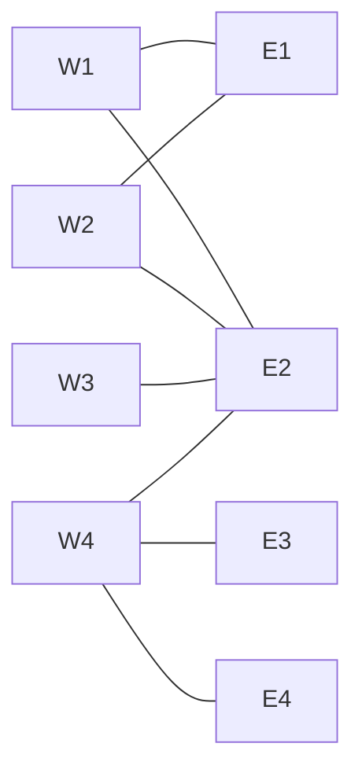
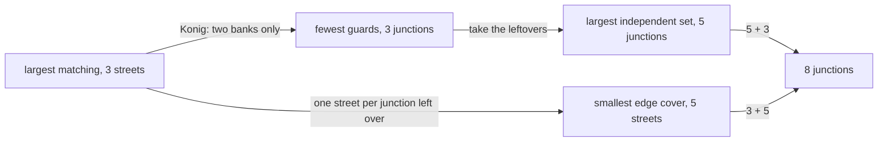

# Konig's theorem: in a two-sided graph the largest matching equals the smallest set of vertices touching every edge

[Syllabus](../../../SYLLABUS.md) → [Combinatorics and graphs](../README.md) → [Matchings and Flows](../README.md#s13) → Konig's theorem

---

## General Overview

A town sits on both banks of a river: four junctions on the west bank, W1 to W4, and four on the east, E1 to E4. Eight streets join them, each a bridge from west to east.

Guards at junctions must watch every street from at least one end. How few will do?

Three, at W4, E1 and E2: every street meets one of them. Two never do. The streets W1-E2, W2-E1 and W4-E3 share no junction, so each needs its own guard.

The two arguments meet at three. A set of streets no two of which share a junction is a **matching**. A set of junctions meeting every street is a **vertex cover**, or **cover** for short.

Dénes Kőnig proved in 1931 that they always meet in a **bipartite** graph: one whose dots split into two sides with every line crossing between them, as the river forces here ([Bipartite graphs](../09-Graphs%20-%20Dots%20and%20Lines/05-bipartite-graphs-and-odd-cycles.md)).

**In a bipartite graph the largest matching and the smallest vertex cover have the same size, so a matching is a receipt proving no cover can be cheaper.**

**What kind of fact this is:** a theorem, proved on this card in Why it works; matching, cover, independent set and edge cover are definitions.

### The picture: eight junctions, eight streets



West bank left, east bank right. W1, W2 and W3 crowd onto E1 and E2, which holds the matching to three streets.

---

## The formula

A graph $G$ is a set of dots and a set of joined pairs ([Graphs](../09-Graphs%20-%20Dots%20and%20Lines/01-graphs-vertices-and-edges.md)): here junctions and streets. $n$ counts the junctions: 8. Four counts matter:

- $\nu$ ("nu"), the **matching number**: the most streets with no two sharing a junction.
- $\tau$ ("tau"), the **cover number**: the fewest junctions meeting every street.
- $\alpha$ ("alpha"), the **independence number**: the most junctions with no street between any two. Such a set is an **independent set**.
- $\rho$ ("rho"), the **edge-cover number**: the fewest streets reaching every junction. Such a set is an **edge cover**.

In every graph, two-sided or not:

$$\nu(G) \le \tau(G)$$

**Read it aloud:** the fewest guards is never less than the most streets sharing no junction.

Kőnig closes the gap on two sides:

$$\nu(G) = \tau(G) \qquad \text{when } G \text{ is bipartite}$$

**Read it aloud:** on a two-sided plan, the largest matching and the smallest cover are the same size.

Tibor Gallai's identities pair the counts:

$$\alpha(G) + \tau(G) = n, \qquad \nu(G) + \rho(G) = n$$

**Read it aloud:** the junctions a smallest cover leaves out form a largest independent set; and a largest matching and a smallest edge cover sum to the number of junctions.

Here $5 + 3 = 8$ and $3 + 5 = 8$. With Kőnig's $\nu = \tau$, they force $\alpha = \rho$: both 5.

| Symbol | Plain meaning | In our example | Push it up and the answer… |
| --- | --- | --- | --- |
| $G$ | the plan as a graph | 8 junctions, 8 streets | — |
| $n$ | how many junctions | 8 | $\alpha + \tau$ and $\nu + \rho$ rise with it |
| $\nu$ | matching number | 3 | on two sides, so does $\tau$ |
| $\tau$ | cover number | 3 | $\alpha$ falls by as much |
| $\alpha$ | independence number | 5 | $\tau$ falls by as much |
| $\rho$ | edge-cover number | 5 | $\nu$ falls by as much |
| $S$, $N(S)$ | a set of west junctions; the east junctions its streets reach; bars count members | W1, W2, W3; E1, E2 | a bigger shortfall, a smaller matching |
| $M$, $Z$ | a largest matching; all its alternating walks reach (Step 2) | 3 streets; W1, W2, W3, E1, E2 | — |

### When it holds

- **Two sides, every street crossing.** A ring of three junctions has matching 1 but needs 2 guards; every odd ring fails so. Some other graphs reach equality by luck.
- **Guards counted, not priced.** If guards cost different amounts, the cheapest bill is Jenő Egerváry's weighted version, also 1931.
- **No junction without a street.** No edge cover reaches a junction with no street, so $\nu + \rho = n$ fails there. $\alpha + \tau = n$ survives.
- **Finitely many junctions.** The walk in Step 2 must stop; infinite plans need other arguments.

---

## Why it works

### Step 0: each matched street needs a guard of its own

Take any matching and any cover, in any graph. The cover meets every matched street, and no guard serves two of them, since they share no junction. So the cover has at least as many junctions as the matching has streets: $\nu \le \tau$. No sides were used; the reverse direction needs them.

### Step 1: the junctions a cover leaves out are independent

A street between two left-out junctions would have neither end guarded, so there is none: the leftovers are independent. Backwards too: if the leftovers have no street inside, every street has an end in the chosen set, so it is a cover. A smaller cover means a larger independent set, and $\alpha + \tau = n$: here $5 + 3 = 8$.

### Step 2: from a largest matching to a cover of the same size

Take a largest matching $M$: W1-E2, W2-E1, W4-E3, with W3 unmatched. From each unmatched west junction, walk **alternating**: out along a street not in $M$, back along one in $M$. From W3: to E2, back to its partner W1, out to E1, back to W2, then stop, since E2 is already reached. Call everything reached $Z$: W1, W2, W3, E1, E2.

Guard the west junctions the walk missed and the east junctions it reached:

$$\text{guards} \;=\; (\text{west}\setminus Z)\;\cup\;(\text{east}\cap Z)$$

That is W4, E1 and E2, the opening's guards. A street they missed would let the walk go one step further, so they meet every street. They hold one end of each street of $M$, so there are $\nu$ of them. So $\tau \le \nu$, and with Step 0, $\nu = \tau$.

<details>
<summary>Detailed proof: the guards meet every street, and there are exactly ν of them</summary>

**Every street is met.** A missed street has its west end in $Z$ and its east end outside. If it is in $M$, the walk reached its west end by stepping back along it, from its east end, which is then in $Z$. If not, the walk can step out along it, putting the east end in $Z$. Either way, a contradiction.

**Every guard is matched.** Unmatched west junctions are starting points, so they lie in $Z$ and get no guard. An unmatched east junction in $Z$ would end an alternating walk; swapping used and unused streets along it would give a bigger matching ([Matchings](01-matchings-and-augmenting-paths.md)), contradicting $M$ being largest.

**No street of $M$ is guarded at both ends.** That needs its east end in $Z$ and its west end outside, but the walk always steps from a matched east junction back to its partner. So the guards are one end of each street of $M$: exactly $\nu$.

</details>

### Step 3: the same guards, from Hall's shortfall

A second road starts from the obstruction. For a set $S$ of west junctions, $\lvert S\rvert - \lvert N(S)\rvert$ is its **shortfall** (Hall's defect). The worst shortfall is exactly how many west junctions go unmatched ([Hall's theorem](02-halls-marriage-theorem.md)). Here the worst set is W1, W2, W3, reaching only E1 and E2: shortfall 1, so $\nu = 4 - 1 = 3$ for the 4 west junctions.

Guard $N(S)$ and every west junction outside $S$:

$$\text{guards} \;=\; N(S)\;\cup\;(\text{west}\setminus S)$$

A street from inside $S$ lands in $N(S)$; every other street starts outside $S$. So this is a cover, with 4 minus the shortfall junctions: E1, E2 and W4 again, and no matching grown.

### Step 4: the streets that reach every junction

A largest matching reaches $2\nu$ junctions with $\nu$ streets: 6 with 3. Give each of the other $n - 2\nu$ junctions one of its streets: $n - \nu$ streets reach everything, so $\rho \le n - \nu$. Here $3 + 2 = 5$.

<details>
<summary>Detailed proof: why an edge cover cannot beat n − ν</summary>

In a smallest edge cover, every street has an end no other street of the cover reaches, or it could be dropped. So each piece of the cover is a **star**: a centre with streets out to ends touching nothing else. A star has one street fewer than junctions, so $\rho$ streets over $n$ junctions make $n - \rho$ stars. One street per star is a matching: $\nu \ge n - \rho$. With the body, $\nu + \rho = n$.

</details>



A third road treats the plan as a network carrying one unit per street, where the smallest cover is the cheapest cut ([Max-flow min-cut](06-max-flow-min-cut.md)).

---

## Worked numbers, by hand

| Step | Arithmetic | Value |
| --- | --- | --- |
| the plan | 4 west + 4 east | n = 8 |
| a matching, so every cover has at least 3 | W1-E2, W2-E1, W4-E3 | matching 3 |
| a cover of that size | W4, E1, E2 | **3** |
| Hall's worst west set | W1, W2, W3 reach only E1, E2 | shortfall 1 |
| the matching, from the shortfall | 4 − 1 | **3** |
| the junctions left over | 8 − 3 | independent set 5 |
| Gallai | 5 + 3 and 3 + 5 | **8** |

Three guards is not merely the best found; the three separate streets prove nothing smaller exists.

### What breaks if you drop a piece

| Mistake | Comes out at | What went wrong |
| --- | --- | --- |
| Both ends of each matched street guarded | 6 guards | One end per street is enough |
| One whole bank guarded | 4 guards | A cover, not a smallest one |
| Streets reaching every junction counted | 5 streets | That is $\rho$, a different job |
| Kőnig applied to a ring of three | matching 1, guards 2 | Not two-sided |

---

## Code, from first principles, and it actually runs

Nothing is imported. Road one tries all 256 sets of junctions and all 256 sets of streets. Road two grows a matching by alternating walks and reads the guards off it. Road three builds guards from Hall's worst west set. The asserts compare the roads.

### Python

```python
# Konig's theorem -- the check behind the card.  Nothing is imported.  The town plan: eight
# junctions, four on the west bank (W1-W4) and four on the east (E1-E4), joined by eight
# streets, each one a bridge.  A triangle of streets is the second case, where equality fails.
NAMES = ["W1", "W2", "W3", "W4", "E1", "E2", "E3", "E4"]
WESTM, EASTM = 0b1111, 0b11110000                  # the two banks, one bit per junction
ST = [(0, 4), (0, 5), (1, 4), (1, 5), (2, 5), (3, 5), (3, 6), (3, 7)]
TRI = [(0, 1), (1, 2), (0, 2)]                     # three junctions in a ring, so no two banks
show = lambda m: ", ".join(NAMES[i] for i in range(8) if m >> i & 1)
def brute(n, st):                                  # ROAD ONE: every set of junctions, every set of streets
    pc, touch = int.bit_count, lambda p: {x for i, (u, v) in enumerate(st) if p >> i & 1 for x in (u, v)}
    cov = [m for m in range(1 << n) if all(m >> u & 1 or m >> v & 1 for u, v in st)]
    tau = min(map(pc, cov))
    alpha = max(pc(m) for m in range(1 << n) if all(not (m >> u & 1 and m >> v & 1) for u, v in st))
    nu = max(pc(p) for p in range(1 << len(st)) if len(touch(p)) == 2 * pc(p))
    rho = min(pc(p) for p in range(1 << len(st)) if len(touch(p)) == n)
    return nu, tau, alpha, rho, [m for m in cov if pc(m) == tau]
def grow(a, mate, seen, nbr):                      # one alternating walk out of a west junction
    for b in nbr[a]:
        if b in seen: continue
        seen.add(b)
        if b not in mate or grow(mate[b], mate, seen, nbr): mate[b] = a; return True
    return False
def built(st):                                     # ROAD TWO: grow a matching, then read the guards off it
    nbr, mate = {a: [b for u, b in st if u == a] for a in range(4)}, {}   # mate: east -> west partner
    for a in range(4): grow(a, mate, set(), nbr)
    stack = [a for a in range(4) if a not in mate.values()]               # west junctions left unmatched
    z = set(stack)                                                       # all an alternating walk reaches
    while stack:
        for b in nbr[stack.pop()]:
            if b in z: continue
            z.add(b)
            if b in mate and mate[b] not in z: z.add(mate[b]); stack.append(mate[b])
    cover = sum(1 << x for x in range(8) if (x not in z if x < 4 else x in z))
    return sorted((a, b) for b, a in mate.items()), cover
def hall(st):                                      # ROAD THREE: the west set Hall's test fails worst on
    nbrs = lambda m: {b for u, b in st if m >> u & 1}
    bad = max(range(16), key=lambda m: int.bit_count(m) - len(nbrs(m)))
    gap, side = int.bit_count(bad) - len(nbrs(bad)), sum(1 << b for b in nbrs(bad))
    return gap, bad, side, side + sum(1 << a for a in range(4) if not bad >> a & 1)
(nu, tau, alpha, rho, mins), (pairs, cover), (gap, bad, side, hcover) = brute(8, ST), built(ST), hall(ST)
t_nu, t_tau = brute(3, TRI)[:2]
print(f"plan: {len(NAMES)} junctions, west {show(WESTM)} and east {show(EASTM)}; {len(ST)} streets, each a bridge")
print(f"road one, all {1 << 8} sets of junctions: fewest guards tau = {tau}, largest independent set alpha = {alpha}")
print(f"road one, all {1 << len(ST)} sets of streets: largest matching nu = {nu}, smallest edge cover rho = {rho}")
print(f"road one, guard sets of size {tau}: {len(mins)}, namely {show(mins[0])}")
print("road two, matching grown by alternating walks: " + "; ".join(f"{NAMES[a]}-{NAMES[b]}" for a, b in pairs))
print(f"road two, guards read off that matching: {show(cover)}")
print(f"road three, worst west set for Hall's test: {show(bad)} reaching only {show(side)}; shortfall {gap}; guards from it: {show(hcover)}")
print(f"Konig: largest matching {nu} = fewest guards {tau}")
print(f"Gallai: alpha + tau = {alpha} + {tau} = {alpha + tau}, and nu + rho = {nu} + {rho} = {nu + rho}")
print(f"mistakes: both ends of each matched street {2 * nu} guards; one whole bank {int.bit_count(WESTM)} guards; an edge cover {rho} streets, not {tau}")
print(f"a triangle of streets: nu = {t_nu} but tau = {t_tau}, so Konig needs two banks")
assert nu == tau == len(pairs) == 3                  # Konig: brute force meets the alternating walk
assert cover == mins[0] and len(mins) == 1           # the built guard set is the only smallest one
assert hcover == cover and nu == 4 - gap             # Hall's shortfall names the same guards
assert alpha + tau == 8 and nu + rho == 8 and (t_nu, t_tau) == (1, 2)
print("ALL CHECKS PASS")
```

**Ran 2026-09-23 on macOS, Python 3.14.6, standard library only. All checks passed. Output, pasted from the run:**

```
plan: 8 junctions, west W1, W2, W3, W4 and east E1, E2, E3, E4; 8 streets, each a bridge
road one, all 256 sets of junctions: fewest guards tau = 3, largest independent set alpha = 5
road one, all 256 sets of streets: largest matching nu = 3, smallest edge cover rho = 5
road one, guard sets of size 3: 1, namely W4, E1, E2
road two, matching grown by alternating walks: W1-E2; W2-E1; W4-E3
road two, guards read off that matching: W4, E1, E2
road three, worst west set for Hall's test: W1, W2, W3 reaching only E1, E2; shortfall 1; guards from it: W4, E1, E2
Konig: largest matching 3 = fewest guards 3
Gallai: alpha + tau = 5 + 3 = 8, and nu + rho = 3 + 5 = 8
mistakes: both ends of each matched street 6 guards; one whole bank 4 guards; an edge cover 5 streets, not 3
a triangle of streets: nu = 1 but tau = 2, so Konig needs two banks
ALL CHECKS PASS
```

### Rust

Built with `rustc --edition 2021 -O`.

```rust
// Konig's theorem -- the same check as the Python, in Rust.  No crates.  The town plan: eight
// junctions, four on the west bank (W1-W4) and four on the east (E1-E4), joined by eight
// streets, each one a bridge.  A triangle of streets is the second case, where equality fails.
const NAMES: [&str; 8] = ["W1", "W2", "W3", "W4", "E1", "E2", "E3", "E4"];
const WESTM: u32 = 0b1111; const EASTM: u32 = 0b11110000;    // banks, one bit per junction
const ST: [(usize, usize); 8] = [(0, 4), (0, 5), (1, 4), (1, 5), (2, 5), (3, 5), (3, 6), (3, 7)];
const TRI: [(usize, usize); 3] = [(0, 1), (1, 2), (0, 2)];   // three junctions in a ring
fn show(m: u32) -> String { (0..8).filter(|i| m >> i & 1 == 1).map(|i| NAMES[i]).collect::<Vec<&str>>().join(", ") }
fn brute(n: usize, st: &[(usize, usize)]) -> (u32, u32, u32, u32, Vec<u32>) {
    let (mut nu, mut tau, mut alpha, mut rho) = (0u32, n as u32, 0u32, st.len() as u32 + 1);
    let mut mins: Vec<u32> = Vec::new();
    for m in 0..1u32 << n {                        // ROAD ONE, part one: every set of junctions
        let (k, cov) = (m.count_ones(), st.iter().all(|&(u, v)| m >> u & 1 == 1 || m >> v & 1 == 1));
        if cov && k < tau { tau = k; mins.clear() } if cov && k == tau { mins.push(m) }
        if st.iter().all(|&(u, v)| m >> u & 1 == 0 || m >> v & 1 == 0) && k > alpha { alpha = k }
    }
    for p in 0..1u32 << st.len() {                 // ROAD ONE, part two: every set of streets
        let (k, mut touch) = (p.count_ones(), 0u32);
        for (i, &(u, v)) in st.iter().enumerate() { if p >> i & 1 == 1 { touch |= 1 << u | 1 << v } }
        if touch.count_ones() == 2 * k && k > nu { nu = k } if touch.count_ones() == n as u32 && k < rho { rho = k }
    }
    (nu, tau, alpha, rho, mins)
}
fn grow(a: usize, mate: &mut [i32; 8], seen: &mut Vec<usize>, nbr: &[Vec<usize>]) -> bool {
    for &b in &nbr[a] {                            // one alternating walk out of a west junction
        if seen.contains(&b) { continue }
        seen.push(b);
        let w = mate[b];
        if w < 0 || grow(w as usize, mate, seen, nbr) { mate[b] = a as i32; return true }
    }
    false
}
fn built(st: &[(usize, usize)]) -> (Vec<(usize, usize)>, u32) {   // ROAD TWO: a matching, then guards
    let nbr: Vec<Vec<usize>> = (0..4).map(|a| st.iter().filter(|&&(u, _)| u == a).map(|&(_, b)| b).collect()).collect();
    let mut mate = [-1i32; 8];                     // mate: east junction -> west partner
    for a in 0..4 { grow(a, &mut mate, &mut Vec::new(), &nbr); }
    let mut pairs: Vec<(usize, usize)> = (4..8).filter(|&b| mate[b] >= 0).map(|b| (mate[b] as usize, b)).collect();
    pairs.sort();
    let mut stack: Vec<usize> = (0..4).filter(|&a| !pairs.iter().any(|&(w, _)| w == a)).collect();
    let mut z = stack.clone();                     // all an alternating walk reaches
    while let Some(a) = stack.pop() {
        for &b in &nbr[a] {
            if z.contains(&b) { continue }
            z.push(b);
            let w = mate[b] as usize;
            if mate[b] >= 0 && !z.contains(&w) { z.push(w); stack.push(w) }
        }
    }
    (pairs, (0..8).filter(|&x| if x < 4 { !z.contains(&x) } else { z.contains(&x) }).fold(0u32, |c, x| c | 1 << x))
}
fn hall(st: &[(usize, usize)]) -> (i32, u32, u32, u32) {   // ROAD THREE: Hall's worst set of west junctions
    let nbrs = |m: u32| st.iter().filter(|&&(u, _)| m >> u & 1 == 1).fold(0u32, |c, &(_, b)| c | 1 << b);
    let def = |m: u32| m.count_ones() as i32 - nbrs(m).count_ones() as i32;
    let mut bad = 0u32;                            // the west set with the biggest shortfall
    for m in 1..16u32 { if def(m) > def(bad) { bad = m } }
    (def(bad), bad, nbrs(bad), nbrs(bad) | (0..4).filter(|a| bad >> a & 1 == 0).fold(0, |c, a| c | 1 << a))
}
fn main() {
    let (nu, tau, alpha, rho, mins) = brute(8, &ST);
    let (pairs, cover) = built(&ST);
    let (gap, bad, side, hcover) = hall(&ST);
    let (t_nu, t_tau, ..) = brute(3, &TRI);
    let matched = pairs.iter().map(|&(a, b)| format!("{}-{}", NAMES[a], NAMES[b])).collect::<Vec<String>>().join("; ");
    println!("plan: {} junctions, west {} and east {}; {} streets, each a bridge", NAMES.len(), show(WESTM), show(EASTM), ST.len());
    println!("road one, all {} sets of junctions: fewest guards tau = {}, largest independent set alpha = {}", 1 << 8, tau, alpha);
    println!("road one, all {} sets of streets: largest matching nu = {}, smallest edge cover rho = {}", 1 << ST.len(), nu, rho);
    println!("road one, guard sets of size {}: {}, namely {}", tau, mins.len(), show(mins[0]));
    println!("road two, matching grown by alternating walks: {}", matched);
    println!("road two, guards read off that matching: {}", show(cover));
    println!("road three, worst west set for Hall's test: {} reaching only {}; shortfall {}; guards from it: {}", show(bad), show(side), gap, show(hcover));
    println!("Konig: largest matching {} = fewest guards {}", nu, tau);
    println!("Gallai: alpha + tau = {} + {} = {}, and nu + rho = {} + {} = {}", alpha, tau, alpha + tau, nu, rho, nu + rho);
    println!("mistakes: both ends of each matched street {} guards; one whole bank {} guards; an edge cover {} streets, not {}", 2 * nu, WESTM.count_ones(), rho, tau);
    println!("a triangle of streets: nu = {} but tau = {}, so Konig needs two banks", t_nu, t_tau);
    assert!(nu == tau && nu as usize == pairs.len() && nu == 3);   // Konig: brute force meets the walk
    assert!(cover == mins[0] && mins.len() == 1);        // the built guard set is the only smallest one
    assert!(hcover == cover && nu as i32 == 4 - gap);    // Hall's shortfall names the same guards
    assert!(alpha + tau == 8 && nu + rho == 8 && (t_nu, t_tau) == (1, 2));
    println!("ALL CHECKS PASS");
}
```

**Ran 2026-09-23 on macOS, rustc 1.98.1, no crates. All checks passed. Output, pasted from the run:**

```
plan: 8 junctions, west W1, W2, W3, W4 and east E1, E2, E3, E4; 8 streets, each a bridge
road one, all 256 sets of junctions: fewest guards tau = 3, largest independent set alpha = 5
road one, all 256 sets of streets: largest matching nu = 3, smallest edge cover rho = 5
road one, guard sets of size 3: 1, namely W4, E1, E2
road two, matching grown by alternating walks: W1-E2; W2-E1; W4-E3
road two, guards read off that matching: W4, E1, E2
road three, worst west set for Hall's test: W1, W2, W3 reaching only E1, E2; shortfall 1; guards from it: W4, E1, E2
Konig: largest matching 3 = fewest guards 3
Gallai: alpha + tau = 5 + 3 = 8, and nu + rho = 3 + 5 = 8
mistakes: both ends of each matched street 6 guards; one whole bank 4 guards; an edge cover 5 streets, not 3
a triangle of streets: nu = 1 but tau = 2, so Konig needs two banks
ALL CHECKS PASS
```

The two outputs match line for line.

> [!TIP]
> **Try changing**
> Guess first, then run. The asserts are pinned to this plan, so one will stop the program.
> - **Add a bridge W3-E3:** `(2, 6)` in `ST`. Do three guards still do? No: matching and guards both reach 4.
> - **Break the river:** put `(0, 1)`, a west-bank street, first in `ST`. Road one finds matching 3 against 4 guards.
> - **Move W3's bridge to E4:** `(2, 5)` becomes `(2, 7)`. The shortfall drops to 0, and 5 guard sets of size 4 tie.

---

## The usual mistake

> [!warning]
> **Believing the smallest cover is one whole side.** Each bank is a cover, since every street crosses. The west bank cannot even be shrunk, since each of its guards alone watches some street, yet it costs 4. The only 3-guard cover among the 256 sets is mixed: W4, E1, E2.
>
> - **Dropping the condition.** A ring of three: matching 1, guards 2.
> - **Guarding both ends of a largest matching.** That is a cover, and a common quick method, but it costs 6: twice the answer.
> - **Confusing what covers what.** Junctions meeting every street is $\tau$, 3. Streets reaching every junction is $\rho$, 5.

---

## Where you meet it in real life

- **Sensor placement.** A sensor at a pipe junction watches every pipe meeting it. The cheapest sensor set is a smallest cover.
- **Tables of zeros and ones.** Kőnig's own form: the fewest rows and columns crossing out every 1 equals the most 1s with no two in a row or column. The assignment methods of The assignment problem run on that reading.
- **Where the ease stops.** On a general graph no fast method for a smallest cover is known (Karp's list). Two sides make it easy.

> **Say it back**
> A matching is streets sharing no junction; a cover is junctions meeting every street. Each matched street needs its own guard, so covers are never smaller. On two sides, alternating walks from a largest matching give a cover of equal size: 3 here. A cover's leftovers are independent, so 5 + 3 = 8; a largest matching and a smallest edge cover also sum to 8.

---

## What this builds on

- [Hall's theorem](02-halls-marriage-theorem.md): the shortfall that fixes the matching number and hands Step 3 its cover.

## Where this goes next

- Karp's list: smallest vertex cover as one of Karp's original hard problems, once the two sides are gone.
- Parameterised complexity: how fast a small cover can still be found on a general graph, with the cover's size as the dial.

The river makes a smallest cover easy to find; later cards ask how hard it is without one.

---

## Sources

Verified 23 Sep 2026: every link below resolves to the publisher's page.

- Diestel, Reinhard. *Graph Theory*, 5th ed. Springer, 2017. [doi:10.1007/978-3-662-53622-3](https://doi.org/10.1007/978-3-662-53622-3). Theorem 2.1.1: Kőnig's theorem, proved with alternating paths.
- Bondy, J. A., and U. S. R. Murty. *Graph Theory*. Springer, 2008. [doi:10.1007/978-1-84628-970-5](https://doi.org/10.1007/978-1-84628-970-5). Covers, independent sets, matchings, edge covers.
- Schrijver, Alexander. "On the History of Combinatorial Optimization (till 1960)." [Full text, CWI](https://homepages.cwi.nl/~lex/files/histco.pdf). Dates Kőnig's and Egerváry's 1931 papers.
- Karp, Richard M. "Reducibility among Combinatorial Problems." In *Complexity of Computer Computations*, Springer, 1972. [doi:10.1007/978-1-4684-2001-2_9](https://doi.org/10.1007/978-1-4684-2001-2_9). Vertex cover among the first hard problems.
