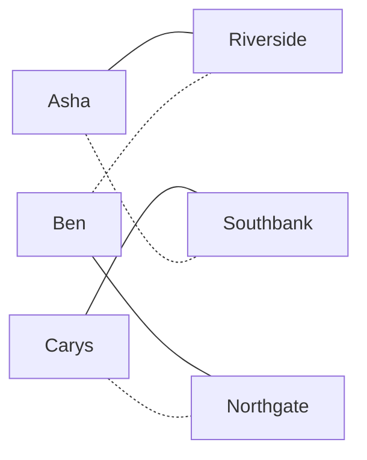

# Stable matching: pair two sides by preference so no two would both rather swap, and the proposers get their best stable deal

Combinatorics and graphs → Matchings and Flows → Deferred acceptance → Stable matching

---

## General Overview

Three junior doctors, Asha, Ben and Carys, need training posts. Three hospitals, Northgate, Riverside and Southbank, have one post each. Everyone ranks the other side.

| | first choice | second | third |
| --- | --- | --- | --- |
| Asha | Northgate | Riverside | Southbank |
| Ben | Northgate | Southbank | Riverside |
| Carys | Riverside | Southbank | Northgate |
| Northgate | Carys | Ben | Asha |
| Riverside | Ben | Asha | Carys |
| Southbank | Asha | Carys | Ben |

The danger in any placement is a doctor and a hospital who both prefer each other to what they were given: they strike a private deal, and the placement unravels.

David Gale and Lloyd Shapley showed in 1962 that a placement with no such pair always exists. Their procedure: one side proposes, the other holds its best offer so far without committing. Whichever side proposes does best.

**With strict rankings on both sides, a placement no doctor and hospital would both abandon always exists; propose-and-hold finds one, best for the proposers and worst for the other side.**

**What kind of fact this is:** a theorem, proved on this card in Why it works; the procedure that proves it is a method.

### The picture: the two stable placements



Solid lines: the doctors' proposing result. Dotted: the hospitals'. Each of the other four placements has a pair who would walk away.

---

## The formula

Notation in words first. A **matching** is a set of doctor–hospital pairs with nobody in two pairs ([matchings-and-augmenting-paths](01-matchings-and-augmenting-paths.md)); write it $M$, and $M(d)$ for doctor $d$'s hospital, $M(h)$ for hospital $h$'s doctor. Each ranking is a strict total order ([partial-and-total-orders](../../01-Foundations/08-Relations%20and%20Functions/07-partial-and-total-orders.md)): no ties. Write $h \succ_d h'$ for "doctor $d$ prefers hospital $h$ to hospital $h'$", and $\succeq$ for "prefers or is the same".

A doctor and a hospital not paired together form a **blocking pair** when each prefers the other to the partner they have. A matching is **stable** when it has none:

$$M \text{ is stable} \iff \text{no pair } (d, h) \text{ has } h \succ_d M(d) \text{ and } d \succ_h M(h)$$

**Read it aloud:** no doctor and hospital would both rather have each other than their partners.

The theorem is about **deferred acceptance**, the propose-and-hold procedure. With $n$ doctors and $n$ hospitals, call its result $M_D$ with doctors proposing, $M_H$ with hospitals proposing.

$$\text{proposals} \le n^2 - n + 1, \qquad M_D \text{ is stable}, \qquad M_D(d) \succeq_d M(d) \text{ and } M(h) \succeq_h M_D(h) \text{ for every stable } M$$

**Read it aloud:** it stops within n squared minus n plus one proposals, its result is stable, and against any stable placement every doctor does at least as well, every hospital at least as badly.

| Symbol | Plain meaning | In our example | Push it up and the answer… |
| --- | --- | --- | --- |
| $n$ | how many on each side | 3 | more proposals |
| $d$, $h$ | one doctor, one hospital | Asha, Riverside | — |
| $M$ | a matching: pairs sharing no doctor and no hospital | one of 3! = 6 | — |
| $M(d)$, $M(h)$ | the partner $M$ gives $d$ or $h$ | Asha's is Riverside under $M_D$ | — |
| $\succ_d$, $\succ_h$, $\succeq$ | "prefers", and "prefers or is the same", read off one ranking | Asha: Riverside over Southbank | — |
| $(d, h)$ | a blocking pair: both prefer each other to their partners | Ben and Northgate, in 2 of the 6 placements | — |
| $M_D$, $M_H$ | the doctors' and the hospitals' proposing results | solid and dotted lines in the picture | — |

### When it holds

- **Strict rankings.** Ties broken any way still give a stable result, but "best" holds only for the broken lists.
- **Two sides.** One pool pairing among itself, like roommates, can have no stable pairing: Gale and Shapley give four people whose rankings chase round a cycle.
- **Full lists, equal numbers.** Otherwise the result is still stable, with some people unplaced.
- **One post each.** A hospital with several posts holds its best several offers, and the proofs go through.
- **Singles only.** A couple who must be placed near each other can make every placement unstable.

---

## Why it works

### Step 0: holding is not committing

A hospital keeps its best offer so far and turns the rest away, but may drop the kept one later for someone better. So what a hospital holds only improves. A doctor turned away asks the next hospital on her list. So a doctor's prospects only fall. Every proof below runs on those two one-way movements.

### Step 1: it always ends

No doctor asks the same hospital twice: at most 3 × 3 = 9 proposals. Sharper: once asked, a hospital holds someone for good. A doctor reaching her last choice was turned away by the other $n - 1$ hospitals, which therefore hold the other $n - 1$ doctors, so the procedure ends when she is held. So only one doctor ever reaches her last choice. The others make at most $n - 1$ proposals each and she makes $n$: at most $(n - 1)^2 + n = n^2 - n + 1$, which is 7 here. Across all 46656 ways six people could rank each other, the code finds 7 reached, never passed.

### Step 2: everyone is placed

A doctor turned away by all $n$ hospitals would need them all holding other doctors, and there are only $n - 1$ others.

### Step 3: the result is stable

If a doctor prefers some hospital to her own, she asked it earlier and was turned away for someone it ranks higher; what it holds only improves. So it prefers its final doctor to her: no blocking pair. Asha prefers Northgate, which turned her away for Ben; Carys prefers Riverside, which dropped her for Asha; Ben has his first choice.

### Step 4: the proposers get their best stable partner

Call a hospital **achievable** for a doctor when some stable placement pairs them. No doctor is ever turned away by an achievable hospital, so each stops at her best achievable one. The proof takes the first such rejection: the doctor preferred to her would, with that hospital, block the stable placement that made it achievable.

<details>
<summary>Detailed proof</summary>

**Claim.** With doctors proposing, no doctor is rejected by a hospital achievable for her.

Take the first rejection, in time, of a doctor $d$ by a hospital $h$ achievable for her, through a stable $M$ with $M(d) = h$. Then $h$ keeps some $d'$ with $d' \succ_h d$. Let $h' = M(d')$, so $h' \ne h$. Having reached $h$, $d'$ was rejected by every hospital he ranks above $h$. If $h' \succ_{d'} h$, that includes $h'$, achievable for him through $M$: an earlier rejection of the same kind, impossible. So $h \succ_{d'} M(d')$, and with $d' \succ_h M(h)$ the pair $(d', h)$ blocks $M$. Contradiction.

**Doctors get their best.** Working down her list, never rejected by an achievable hospital, each doctor ends at her best achievable one: $M_D(d) \succeq_d M(d)$ for every stable $M$.

**Hospitals get their worst.** If $M_D(h) \succ_h M(h)$ for a stable $M$, put $d = M_D(h)$. Then $M(d) \ne h$, so $h \succ_d M(d)$ by the line above, and $(d, h)$ blocks $M$. So $M(h) \succeq_h M_D(h)$.

**Order does not matter.** Nothing used the order of proposals, so rounds or one at a time give the same $M_D$.

</details>

### Step 5: the other side gets its worst

If a stable placement gave some hospital a doctor it likes less than its $M_D$ partner, that partner, who by Step 4 likes the hospital more than any stable alternative, would block it.

Swap the roles: every hospital asks a different doctor, nobody is turned away, and it stops in one round. Each hospital has its first choice; by Steps 4 and 5 with the sides swapped, each doctor sits at her worst stable partner, here her last choice.

A second road needs no procedure: list all 3! = 6 placements and test the 3 × 3 = 9 pairs in each. Exactly 2 survive, the two above. [halls-marriage-theorem](02-halls-marriage-theorem.md) asks whether a full placement exists; here the question is which.

---

## Worked numbers, by hand

| Step | Arithmetic | Value |
| --- | --- | --- |
| round 1, doctors proposing | Asha and Ben ask Northgate, Carys asks Riverside; Northgate prefers Ben | Asha turned away |
| round 2 | Asha asks Riverside, which ranks her above Carys | Carys turned away |
| round 3 | Carys asks Southbank, which holds nobody | nobody turned away |
| proposals | 3 + 1 + 1 | **5**, within the ceiling 7 |
| doctors' ranks under $M_D$ | Asha 2nd, Ben 1st, Carys 2nd | hospitals each get their 2nd |
| hospitals proposing | three different first choices | **1 round, 3 proposals** |
| ranks under $M_H$ | doctors 3rd, 3rd, 3rd | hospitals 1st, 1st, 1st |
| every placement listed | 3! = 6, each tested pair by pair | **2 stable** |

Which side proposes decides whether doctors get second choices or last ones.

### What breaks if you drop a piece

| Mistake | Comes out at | What went wrong |
| --- | --- | --- |
| Accepting the first offer for good | Asha–Southbank, Ben–Northgate, Carys–Riverside; blocked by Asha and Riverside | Riverside locked in Carys before Asha asked |
| Maximising doctors' total happiness | rank sum 4: Asha–Northgate, Ben–Southbank, Carys–Riverside; blocked by Ben and Northgate | Ben and Northgate both prefer each other |
| Reading any unmet wish as instability | 2 doctors short of first choice under $M_D$, 0 blocking pairs | A wish counts only if returned |

The code prints all three.

---

## Code, from first principles, and it actually runs

Nothing is imported. Road one runs propose-and-hold from each side; road two tests all 6 placements for blocking pairs and reads off each doctor's best and worst. The asserts pin one to the other, here and across all 46656 ranking profiles.

### Python

```python
# Stable matching -- the check behind the card.  Nothing is imported.  Road one
# runs deferred acceptance, round by round, from either side.  Road two lists
# all 3! = 6 matchings and tests each for a blocking pair.
DOC, HOS = ["Asha", "Ben", "Carys"], ["Northgate", "Riverside", "Southbank"]
DP = [[0, 1, 2], [0, 2, 1], [1, 2, 0]]           # each doctor's list, best first
HP = [[2, 1, 0], [1, 0, 2], [0, 2, 1]]           # each hospital's list, best first
ALL = [[a, b, 3 - a - b] for a in range(3) for b in range(3) if a != b]   # m[d] = hospital
def accept(pp, rp, log=None, defer=True):        # pp propose to rp; returns proposer -> partner
    held, nxt, free, props, rounds = {}, [0] * 3, [0, 1, 2], 0, 0
    while free:
        rounds, offers = rounds + 1, {}
        for p in free:
            offers.setdefault(pp[p][nxt[p]], []).append(p); nxt[p] += 1; props += 1
        free = []
        for r, ps in offers.items():
            pool = ps + ([held[r]] if r in held else [])
            held[r] = held[r] if r in held and not defer else min(pool, key=rp[r].index)
            free += [p for p in pool if p != held[r]]
        if log is not None:
            log.append(f"round {rounds}: " + " ".join(f"{DOC[p]}->{HOS[r]}" for r, ps in offers.items()
                       for p in ps) + "; rejected: " + (" ".join(DOC[p] for p in sorted(free)) or "nobody"))
    return [r for p, r in sorted((p, r) for r, p in held.items())], props, rounds
def blocking(m, dp, hp):                          # pairs who both prefer each other to their partners
    return [(d, h) for d in range(3) for h in range(3)
            if dp[d].index(h) < dp[d].index(m[d]) and hp[h].index(d) < hp[h].index(m.index(h))]
def names(m): return " ".join(f"{DOC[d]}-{HOS[m[d]]}" for d in range(3))
def pairs(bs): return " ".join(f"({DOC[d]}, {HOS[h]})" for d, h in bs)
md, pd, rd = accept(DP, HP, log := [])
hm, ph, rh = accept(HP, DP); mh = [hm.index(d) for d in range(3)]   # hospital-proposing, turned round
stable = [m for m in ALL if not blocking(m, DP, HP)]
best = [min((m[d] for m in stable), key=DP[d].index) for d in range(3)]
worst = [max((m[d] for m in stable), key=DP[d].index) for d in range(3)]
rank = lambda m: ([DP[d].index(m[d]) + 1 for d in range(3)], [HP[h].index(m.index(h)) + 1 for h in range(3)])
print(f"doctors 3, hospitals 3; possible matchings 3! = {len(ALL)}")
print("\n".join(log))
print(f"doctor-proposing  : {names(md)}; proposals {pd}, rounds {rd}")
print(f"hospital-proposing: {names(mh)}; proposals {ph}, rounds {rh}")
for m in ALL:
    print(f"listing: {names(m)}  blocked by {pairs(blocking(m, DP, HP)) or 'nobody'}")
print(f"stable by listing: {len(stable)} of {len(ALL)}; best per doctor {names(best)}; worst {names(worst)}")
print(f"ranks, doctors then hospitals: doctor-proposing {rank(md)[0]} {rank(md)[1]}; hospital-proposing {rank(mh)[0]} {rank(mh)[1]}")
counts, most = [0, 0, 0], 0
for dp in [[a, b, c] for a in ALL for b in ALL for c in ALL]:
    for hp in [[a, b, c] for a in ALL for b in ALL for c in ALL]:
        m, p, _ = accept(dp, hp); most = max(most, p)
        st = [s for s in ALL if not blocking(s, dp, hp)]
        counts[0] += not blocking(m, dp, hp)
        counts[1] += all(min((s[d] for s in st), key=dp[d].index) == m[d] for d in range(3))
        counts[2] += all(max((s.index(h) for s in st), key=hp[h].index) == m.index(h) for h in range(3))
print(f"all {len(ALL) ** 6} profiles: stable {counts[0]}, doctors best {counts[1]}, hospitals worst {counts[2]}; most proposals {most}; bounds 3*3 = {3 * 3}, 3*3-3+1 = {3 * 3 - 3 + 1}")
ia = accept(DP, HP, defer=False)[0]
happy = min(ALL, key=lambda m: sum(rank(m)[0]))
print(f"mistake 1, accept for good: {names(ia)}; blocking {pairs(blocking(ia, DP, HP))}")
print(f"mistake 2, most doctor happiness: {names(happy)}, rank sum {sum(rank(happy)[0])}; blocking {pairs(blocking(happy, DP, HP))}")
print(f"mistake 3, doctors short of first choice under doctor-proposing: {sum(r > 1 for r in rank(md)[0])}; blocking pairs {len(blocking(md, DP, HP))}")
assert md == best                                 # doctor-proposing = each doctor's best, by listing
assert mh == worst                                # hospital-proposing = each doctor's worst, by listing
assert counts == [len(ALL) ** 6] * 3              # stable, doctor-best, hospital-worst in every profile
assert most == 3 * 3 - 3 + 1                      # the proposal bound is reached, never passed
print("ALL CHECKS PASS")
```

**Ran 2026-09-19 on macOS, Python 3.14.6, standard library only. All checks passed. Output, pasted from the run:**

```
doctors 3, hospitals 3; possible matchings 3! = 6
round 1: Asha->Northgate Ben->Northgate Carys->Riverside; rejected: Asha
round 2: Asha->Riverside; rejected: Carys
round 3: Carys->Southbank; rejected: nobody
doctor-proposing  : Asha-Riverside Ben-Northgate Carys-Southbank; proposals 5, rounds 3
hospital-proposing: Asha-Southbank Ben-Riverside Carys-Northgate; proposals 3, rounds 1
listing: Asha-Northgate Ben-Riverside Carys-Southbank  blocked by (Ben, Northgate)
listing: Asha-Northgate Ben-Southbank Carys-Riverside  blocked by (Ben, Northgate)
listing: Asha-Riverside Ben-Northgate Carys-Southbank  blocked by nobody
listing: Asha-Riverside Ben-Southbank Carys-Northgate  blocked by (Carys, Southbank)
listing: Asha-Southbank Ben-Northgate Carys-Riverside  blocked by (Asha, Riverside)
listing: Asha-Southbank Ben-Riverside Carys-Northgate  blocked by nobody
stable by listing: 2 of 6; best per doctor Asha-Riverside Ben-Northgate Carys-Southbank; worst Asha-Southbank Ben-Riverside Carys-Northgate
ranks, doctors then hospitals: doctor-proposing [2, 1, 2] [2, 2, 2]; hospital-proposing [3, 3, 3] [1, 1, 1]
all 46656 profiles: stable 46656, doctors best 46656, hospitals worst 46656; most proposals 7; bounds 3*3 = 9, 3*3-3+1 = 7
mistake 1, accept for good: Asha-Southbank Ben-Northgate Carys-Riverside; blocking (Asha, Riverside)
mistake 2, most doctor happiness: Asha-Northgate Ben-Southbank Carys-Riverside, rank sum 4; blocking (Ben, Northgate)
mistake 3, doctors short of first choice under doctor-proposing: 2; blocking pairs 0
ALL CHECKS PASS
```

### Rust

Same numbers, same labels, built with `rustc --edition 2021 -O`.

```rust
// Stable matching -- the same check as the Python, in Rust.  No crates.  Road
// one runs deferred acceptance, round by round, from either side.  Road two
// lists all 3! = 6 matchings and tests each for a blocking pair.
const DOC: [&str; 3] = ["Asha", "Ben", "Carys"]; const HOS: [&str; 3] = ["Northgate", "Riverside", "Southbank"];
type P = Vec<Vec<usize>>;
fn pos(list: &[usize], x: usize) -> usize { list.iter().position(|&y| y == x).unwrap() }
// pp propose to rp; returns (proposer -> partner, proposals, rounds)
fn accept(pp: &P, rp: &P, log: &mut Vec<String>, defer: bool) -> (Vec<usize>, usize, usize) {
    let (mut held, mut nxt, mut free, mut props, mut rounds) = (vec![None::<usize>; 3], vec![0; 3], vec![0, 1, 2], 0, 0);
    while !free.is_empty() {
        rounds += 1; let mut offers: Vec<(usize, Vec<usize>)> = Vec::new();
        for &p in &free {
            let r = pp[p][nxt[p]]; nxt[p] += 1; props += 1;
            match offers.iter_mut().find(|o| o.0 == r) { Some(o) => o.1.push(p), None => offers.push((r, vec![p])) }
        }
        free.clear(); for (r, ps) in &offers {
            let mut pool = ps.clone(); if let Some(h) = held[*r] { pool.push(h) }
            let keep = match held[*r] { Some(h) if !defer => h, _ => *pool.iter().min_by_key(|&&p| pos(&rp[*r], p)).unwrap() };
            held[*r] = Some(keep);
            free.extend(pool.iter().filter(|&&p| p != keep));
        }
        if log.capacity() > 0 {
            let moves: Vec<String> = offers.iter().flat_map(|(r, ps)| ps.iter().map(move |&p| format!("{}->{}", DOC[p], HOS[*r]))).collect();
            let mut rej = free.clone(); rej.sort(); let rejs: Vec<&str> = rej.iter().map(|&p| DOC[p]).collect();
            log.push(format!("round {}: {}; rejected: {}", rounds, moves.join(" "), if rejs.is_empty() { "nobody".to_string() } else { rejs.join(" ") }));
        }
    }
    let mut m = vec![0; 3]; for r in 0..3 { m[held[r].unwrap()] = r }
    (m, props, rounds)
}
fn blocking(m: &[usize], dp: &P, hp: &P) -> Vec<(usize, usize)> {   // pairs who both prefer each other
    let mut out = Vec::new(); for d in 0..3 { for h in 0..3 {
        if pos(&dp[d], h) < pos(&dp[d], m[d]) && pos(&hp[h], d) < pos(&hp[h], pos(m, h)) { out.push((d, h)) }
    } }
    out
}
fn names(m: &[usize]) -> String { (0..3).map(|d| format!("{}-{}", DOC[d], HOS[m[d]])).collect::<Vec<_>>().join(" ") }
fn pairs(bs: &[(usize, usize)]) -> String { bs.iter().map(|&(d, h)| format!("({}, {})", DOC[d], HOS[h])).collect::<Vec<_>>().join(" ") }
fn rank(m: &[usize], dp: &P, hp: &P) -> (Vec<usize>, Vec<usize>) {
    ((0..3).map(|d| pos(&dp[d], m[d]) + 1).collect(), (0..3).map(|h| pos(&hp[h], pos(m, h)) + 1).collect())
}
fn main() {
    let (dp, hp): (P, P) = (vec![vec![0, 1, 2], vec![0, 2, 1], vec![1, 2, 0]], vec![vec![2, 1, 0], vec![1, 0, 2], vec![0, 2, 1]]);
    let all: P = (0..3).flat_map(|a| (0..3).filter(move |&b| b != a).map(move |b| vec![a, b, 3 - a - b])).collect();
    let (mut log, mut none) = (Vec::with_capacity(8), Vec::new());
    let (md, pd, rd) = accept(&dp, &hp, &mut log, true);
    let (hm, ph, rh) = accept(&hp, &dp, &mut none, true);          // hospitals propose; turned round below
    let mh: Vec<usize> = (0..3).map(|d| pos(&hm, d)).collect();
    let stable: P = all.iter().filter(|m| blocking(m, &dp, &hp).is_empty()).cloned().collect();
    let best: Vec<usize> = (0..3).map(|d| stable.iter().map(|m| m[d]).min_by_key(|&h| pos(&dp[d], h)).unwrap()).collect();
    let worst: Vec<usize> = (0..3).map(|d| stable.iter().map(|m| m[d]).max_by_key(|&h| pos(&dp[d], h)).unwrap()).collect();
    println!("doctors 3, hospitals 3; possible matchings 3! = {}", all.len());
    for l in &log { println!("{}", l) }
    println!("doctor-proposing  : {}; proposals {}, rounds {}", names(&md), pd, rd);
    println!("hospital-proposing: {}; proposals {}, rounds {}", names(&mh), ph, rh);
    for m in &all { let b = pairs(&blocking(m, &dp, &hp)); println!("listing: {}  blocked by {}", names(m), if b.is_empty() { "nobody".to_string() } else { b }) }
    println!("stable by listing: {} of {}; best per doctor {}; worst {}", stable.len(), all.len(), names(&best), names(&worst));
    let (rd0, rd1, rh0, rh1) = (rank(&md, &dp, &hp).0, rank(&md, &dp, &hp).1, rank(&mh, &dp, &hp).0, rank(&mh, &dp, &hp).1);
    println!("ranks, doctors then hospitals: doctor-proposing {:?} {:?}; hospital-proposing {:?} {:?}", rd0, rd1, rh0, rh1);
    let (mut counts, mut most, mut profiles) = ([0usize; 3], 0, Vec::<P>::new());
    for a in &all { for b in &all { for c in &all { profiles.push(vec![a.clone(), b.clone(), c.clone()]) } } }
    for dq in &profiles { for hq in &profiles {
        let (m, p, _) = accept(dq, hq, &mut none, true); most = most.max(p);
        let st: Vec<&Vec<usize>> = all.iter().filter(|s| blocking(s, dq, hq).is_empty()).collect();
        counts[0] += blocking(&m, dq, hq).is_empty() as usize;
        counts[1] += (0..3).all(|d| st.iter().map(|s| s[d]).min_by_key(|&h| pos(&dq[d], h)).unwrap() == m[d]) as usize;
        counts[2] += (0..3).all(|h| st.iter().map(|s| pos(s, h)).max_by_key(|&d| pos(&hq[h], d)).unwrap() == pos(&m, h)) as usize;
    } }
    println!("all {} profiles: stable {}, doctors best {}, hospitals worst {}; most proposals {}; bounds 3*3 = {}, 3*3-3+1 = {}", all.len().pow(6), counts[0], counts[1], counts[2], most, 3 * 3, 3 * 3 - 3 + 1);
    let ia = accept(&dp, &hp, &mut none, false).0;
    let happy = all.iter().min_by_key(|m| rank(m, &dp, &hp).0.iter().sum::<usize>()).unwrap();
    println!("mistake 1, accept for good: {}; blocking {}", names(&ia), pairs(&blocking(&ia, &dp, &hp)));
    println!("mistake 2, most doctor happiness: {}, rank sum {}; blocking {}", names(happy), rank(happy, &dp, &hp).0.iter().sum::<usize>(), pairs(&blocking(happy, &dp, &hp)));
    println!("mistake 3, doctors short of first choice under doctor-proposing: {}; blocking pairs {}", rd0.iter().filter(|&&r| r > 1).count(), blocking(&md, &dp, &hp).len());
    assert!(md == best);                               // doctor-proposing = each doctor's best, by listing
    assert!(mh == worst);                              // hospital-proposing = each doctor's worst, by listing
    assert!(counts == [all.len().pow(6); 3]);          // stable, doctor-best, hospital-worst in every profile
    assert!(most == 3 * 3 - 3 + 1);                    // the proposal bound is reached, never passed
    println!("ALL CHECKS PASS");
}
```

**Ran 2026-09-19 on macOS, rustc 1.98.1, no crates. All checks passed. Output, pasted from the run:**

```
doctors 3, hospitals 3; possible matchings 3! = 6
round 1: Asha->Northgate Ben->Northgate Carys->Riverside; rejected: Asha
round 2: Asha->Riverside; rejected: Carys
round 3: Carys->Southbank; rejected: nobody
doctor-proposing  : Asha-Riverside Ben-Northgate Carys-Southbank; proposals 5, rounds 3
hospital-proposing: Asha-Southbank Ben-Riverside Carys-Northgate; proposals 3, rounds 1
listing: Asha-Northgate Ben-Riverside Carys-Southbank  blocked by (Ben, Northgate)
listing: Asha-Northgate Ben-Southbank Carys-Riverside  blocked by (Ben, Northgate)
listing: Asha-Riverside Ben-Northgate Carys-Southbank  blocked by nobody
listing: Asha-Riverside Ben-Southbank Carys-Northgate  blocked by (Carys, Southbank)
listing: Asha-Southbank Ben-Northgate Carys-Riverside  blocked by (Asha, Riverside)
listing: Asha-Southbank Ben-Riverside Carys-Northgate  blocked by nobody
stable by listing: 2 of 6; best per doctor Asha-Riverside Ben-Northgate Carys-Southbank; worst Asha-Southbank Ben-Riverside Carys-Northgate
ranks, doctors then hospitals: doctor-proposing [2, 1, 2] [2, 2, 2]; hospital-proposing [3, 3, 3] [1, 1, 1]
all 46656 profiles: stable 46656, doctors best 46656, hospitals worst 46656; most proposals 7; bounds 3*3 = 9, 3*3-3+1 = 7
mistake 1, accept for good: Asha-Southbank Ben-Northgate Carys-Riverside; blocking (Asha, Riverside)
mistake 2, most doctor happiness: Asha-Northgate Ben-Southbank Carys-Riverside, rank sum 4; blocking (Ben, Northgate)
mistake 3, doctors short of first choice under doctor-proposing: 2; blocking pairs 0
ALL CHECKS PASS
```

The two outputs match line for line.

> [!TIP]
> **Try changing**
> Guess first, then run it.
> - **Ben puts Southbank first.** Set Ben's list in `DP` to `[2, 0, 1]`. Every doctor gets a first choice, and a third stable placement appears between the ends: 3 of 6. The run passes.
> - **All hospitals agree.** Set every list in `HP` to `[0, 1, 2]`. Only 1 of 6 is stable, so best and worst coincide. The run passes.
> - **Accept for good.** Change `defer=True` to `defer=False` in `accept`. The doctors get mistake 1's placement; the first assert stops it.

---

## The usual mistake

> [!warning]
> **Taking the result as neutral.** Doctors proposing, the doctors get their 2nd, 1st and 2nd choices; hospitals proposing, their 3rd, 3rd and 3rd. Both are stable. Choosing who proposes chooses who wins.
>
> - **Committing instead of holding.** Mistake 1's placement is blocked by Asha and Riverside.
> - **Maximising total happiness.** The lowest doctor rank total, 4, is blocked by Ben and Northgate.
> - **Unmet wishes read as blocking.** Under $M_D$, 2 doctors miss their first choice and 0 pairs block.

---

## Where you meet it in real life

- **The residency match.** The US National Resident Matching Program runs deferred acceptance with multi-post hospitals and couples; its late-1990s redesign made applicants the proposers.
- **School places.** Boston and New York moved to student-proposing deferred acceptance in the 2000s. Boston's old system accepted first choices for good: mistake 1.
- **The 2012 economics prize.** Shapley and Alvin Roth shared it for stable allocations and market design.

> **Say it back**
> A placement is stable when no doctor and hospital would both rather have each other than their partners. Propose-and-hold finds one: proposers work down their lists, receivers hold their best offer so far. It ends, places everyone, and leaves no blocking pair. Each proposer gets the best partner any stable placement allows, each receiver the worst. Asha, Ben and Carys get Riverside, Northgate and Southbank when they propose, and their last choices when the hospitals do.

---

## What this builds on

- [matchings-and-augmenting-paths](01-matchings-and-augmenting-paths.md): what a matching is.
- [partial-and-total-orders](../../01-Foundations/08-Relations%20and%20Functions/07-partial-and-total-orders.md): a strict ranking is a total order.

## Where this goes next

- auctions-and-mechanism-design: rules under which nobody gains by misreporting.
- minimax-theorem-and-convex-duality: another existence theorem for two opposed sides.

This card assumed true rankings; whether anyone gains by lying about theirs is auctions-and-mechanism-design.

---

## Sources

Verified 24 Sep 2026: every link below resolves to the publisher's page naming the cited work.

- Gale, D., and L. S. Shapley. "College Admissions and the Stability of Marriage." *The American Mathematical Monthly* 69, no. 1 (1962): 9–15. [doi:10.1080/00029890.1962.11989827](https://doi.org/10.1080/00029890.1962.11989827). Existence, the procedure, the proposers' best, and the roommates counterexample.
- Gusfield, Dan, and Robert W. Irving. *The Stable Marriage Problem: Structure and Algorithms*. MIT Press, 1989. [Publisher page](https://mitpress.mit.edu/9780262515528/the-stable-marriage-problem/). Proposal counts, the other side's worst, and all stable placements between the two ends.
- Roth, Alvin E., and Elliott Peranson. "The Redesign of the Matching Market for American Physicians." *American Economic Review* 89, no. 4 (1999): 748–780. [doi:10.1257/aer.89.4.748](https://doi.org/10.1257/aer.89.4.748). The residency match, couples, and applicants proposing.
- The Nobel Prize. "The Sveriges Riksbank Prize in Economic Sciences in Memory of Alfred Nobel 2012." [Prize page](https://www.nobelprize.org/prizes/economic-sciences/2012/summary/). Roth and Shapley, for stable allocations and market design.
