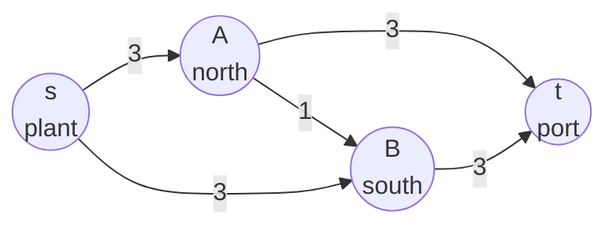
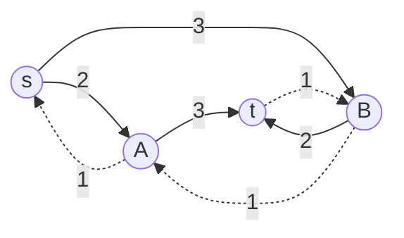

# Flows: pipes with capacities from a source to a sink, and pushing along leftover routes, including undoing an earlier choice

[Syllabus](../../../SYLLABUS.md) → [Combinatorics and graphs](../../../SYLLABUS.md#w04) → [Matchings and Flows](../../../SYLLABUS.md#w04-s13) → Flows

---

## General Overview

A bottling plant sends lorry-loads to a port each night through two depots. The plant can send 3 loads to each depot, and each depot can forward 3 to the port. A one-way link road from the north depot to the south depot takes 1 load.

Two routes run straight through, 3 loads each, so 6 arrive. Now start badly: send 1 load along the link road first. The south depot's road to the port is partly used up, and a method that can only add loads stalls at 5. A method allowed to cancel an earlier load still reaches 6.

The plant is the **source**, the port the **sink**, and each road's limit its **capacity**. A **flow** is a shipment plan: loads on each road, never over capacity, with every load that reaches a depot leaving it. Its **value** is the loads leaving the source. Below, the plant is s, the north depot A, the south depot B and the port t: the diamond.

**Ford-Fulkerson raises a flow's value by pushing loads along any route that still has room, where room includes cancelling loads already sent the other way.**

**What kind of fact this is:** a method, resting on two definitions, the flow and the cut. That it stops and can be certified is proved here; that its answer always equals the cheapest cut is the theorem on [Max-flow min-cut](06-max-flow-min-cut.md).

### The picture: four junctions, five one-way roads



Every label is a capacity in loads a night.

---

## The formula

Notation first, in words. The network is a directed graph with junction set $V$ and road set $E$. The road from $u$ to $v$ is $u \to v$; $c(u,v)$ is its capacity, 0 where no road runs, and $f(u,v)$ the loads the plan puts on it. The sign $\sum$ means "add up over every junction named underneath".

A flow obeys two rules. Nothing overflows:

$$0 \le f(u,v) \le c(u,v)$$

and at every junction $x$ other than the source and the sink, nothing is stranded:

$$\sum_u f(u,x) = \sum_u f(x,u)$$

**Read it aloud:** what arrives at a depot leaves it.

The **value**, written $\lvert f\rvert$, is the net count of loads leaving the source:

$$\lvert f\rvert = \sum_u f(s,u) - \sum_u f(u,s)$$

A **cut** splits the junctions into two sides: $S$ holds the source, $T$ holds the sink. Its **price** is the total capacity of the roads leaving $S$:

$$c(S,T) = \sum_{u \in S,\, v \in T} c(u,v)$$

Roads entering $S$ are not priced. Shutting the priced roads severs every route to the sink.

The **leftover**, or residual, is how much more a step from $u$ to $v$ can take: spare capacity, plus any load going the other way, which can be cancelled:

$$\text{leftover}(u,v) = \bigl(c(u,v) - f(u,v)\bigr) + f(v,u)$$

Where no road runs from $u$ to $v$, the leftover is $f(v,u)$ alone: a **backward stub**, permission to undo that many loads. An **augmenting route** runs from source to sink with leftover above 0 at every step. **Ford-Fulkerson: while an augmenting route exists, push its smallest leftover, the bottleneck, along it.** Always taking an augmenting route with the fewest roads is the Edmonds-Karp rule.

| Symbol | Plain meaning | In our example | Push it up and the answer… |
| --- | --- | --- | --- |
| $V$, $E$ | the junctions, the one-way roads | 4 junctions, 5 roads | more roads, more room to route |
| $s$, $t$ | source and sink | the plant and the port | — |
| $u$, $v$, $x$ | any junctions; $u \to v$ names a road | s → A, A → B | — |
| $c$ | capacity: the most a road carries | 3 outer, 1 on the cross | a wider road may raise the value, or may not |
| $f$ | the plan: loads on each road | 3, 3, 3, 3, 0 | capped by the capacities |
| $\sum$ | add up over the junctions named below it | loads into t: 3 + 3 | — |
| $\lvert f\rvert$ | the value: net loads leaving the source | 6 | — |
| $S$, $T$ | the two sides of a cut; $c(S,T)$ its price | {s} and {A,B,t}, priced 6 | a dearer cheapest cut allows more |

### When it holds

- **Whole-number capacities.** Then the method stops (Step 3). Fractions are scaled to whole numbers first.
- **Capacities on roads, not junctions.** A depot limited to 4 loads is split into an arrival half and a departure half, joined by a road of capacity 4.
- **One source and one sink.** Several plants are joined to one new source by wide roads; several ports likewise.
- **The route is chosen after every push.** Leftover changes with the plan.

---

## Why it works

### Step 0: room to push includes the right to undo

After 1 load on s → A → B → t, the road B → t has 2 spare, and a forward-only method ends at 5. But the load on A → B gives the stub B → A a leftover of 1. Pushing 1 along s → B → A → t adds a load on s → B, cancels the load on A → B and adds one on A → t: value 6, cross road empty.

### Step 1: a push keeps the plan legal and adds the bottleneck to the value

Add the bottleneck to $f$ on each forward step; subtract it from the cancelled load on each stub step. No road overfills, since the bottleneck is at most any step's spare capacity, and no load goes below 0, since it is at most any load cancelled. At a junction inside the route, the step in adds the bottleneck to net arrivals and the step out adds it to net departures, so nothing is stranded. The route leaves the source once and never returns, so the value rises by exactly the bottleneck.

### Step 2: no plan can beat any cut

For any split, the loads crossing out of $S$, less those crossing back in, equal the value (proof folded below). Outward loads are at most their capacities and inward loads at least 0, so

$$\lvert f\rvert \le c(S,T).$$

On the diamond the four splits price 6, 7, 6 and 6, so no plan ships more than 6. A plan whose value equals some split's price cannot be beaten.

<details>
<summary>Detailed proof: the net crossing equals the value</summary>

For each junction $x$ in $S$, take loads out of $x$ minus loads into $x$. Conservation makes this 0 except at the source, where it is $\lvert f\rvert$. So the sum over $S$ is $\lvert f\rvert$.

Collect the same sum road by road. A road inside $S$ counts once as output and once as input, and cancels. A road from $S$ to $T$ counts once, positively; a road from $T$ to $S$ once, negatively. So $\lvert f\rvert$ is the loads leaving $S$ minus those entering it.

</details>

### Step 3: the method stops

With whole-number capacities every push raises the value by at least 1, and Step 2 caps it at 6, the price of {s}. So at most six pushes happen before no augmenting route remains. Every load stays a whole number, and the method ends at a best plan (Step 4), so whole-number capacities always have a best plan in whole loads: the **integrality theorem**, which lets flows count matchings.

That bound grows with the capacities. The Edmonds-Karp rule bounds the pushes by the numbers of junctions and roads alone; that count is on Graph algorithms as code.

### Step 4: the diamond ends at 6, with its certificate beside it

Edmonds-Karp reaches 6 in two pushes; the cross-first run takes four, the last riding the stub B → A. Step 2 caps every plan at the cheapest split's 6, so 6 is the most this network can ship.

That pairing is not luck. When no augmenting route is left, let $S$ be the junctions still reachable from the source on leftover. Every road leaving $S$ is full and every road entering it empty, or its far end would be reachable, so that split's price equals the value. The theorem for every network is [Max-flow min-cut](06-max-flow-min-cut.md).

---

## Worked numbers, by hand

"min" means the smallest of the listed leftovers.

| Step | Arithmetic | Value |
| --- | --- | --- |
| push 1 on s-A-t | bottleneck min(3, 3) | 3 |
| push 2 on s-B-t | min(3, 3), added to 3 | **6** |
| cross first, push 1 on s-A-B-t | min(3, 1, 3) | 1 |
| push 2 on s-A-t | min(2, 3), added to 1 | 3 |
| push 3 on s-B-t | min(3, 2), added to 3 | 5 |
| push 4 on s-B-A-t, riding the stub | min(1, 1, 1), added to 5 | **6** |
| the four splits, priced | {s} 6, {s,A} 7, {s,B} 6, {s,A,B} 6 | cheapest **6** |

Six loads a night reach the port, by the same final plan both times: 3 on each outer road, 0 on the cross. Three splits price 6: three cheapest cuts.

### The picture: leftover after one load takes the cross road



Solid arrows are spare capacity; dashed arrows are backward stubs. The cross road has 0 spare, and the stub B → A in its place is what the fourth push rides.

### What breaks if you drop a piece

| Mistake | Comes out at | What went wrong |
| --- | --- | --- |
| The cross route first, with no backward stub | 5 | A load placed badly can never be taken back |
| The narrowest road read as the bottleneck | 1 | Shutting the cross road severs nothing |
| The split {s,A} read as the ceiling | 7 | Every split is a ceiling; only the cheapest pins the answer |

The code prints all three.

---

## Code, from first principles, and it actually runs

Nothing that solves the problem is imported. Three independent ways reach 6. Way one pushes along the shortest leftover route, from an empty plan and from a forced cross-road start. Way two tries all 4 × 4 × 4 × 4 × 2 = 512 whole-number plans and keeps the 25 that strand nothing. Way three prices the four splits.

### Python

```python
# Flows and Ford-Fulkerson -- the check behind the card.  The diamond: plant s, depots
# A and B, port t; 3 lorry-loads a night on each outer road, 1 on the cross A->B.  Three
# ways: push along shortest leftover routes, try every whole plan, price the four splits.
from itertools import product
CAP = {("s", "A"): 3, ("s", "B"): 3, ("A", "t"): 3, ("B", "t"): 3, ("A", "B"): 1}
ARCS, NODES = list(CAP), ["s", "A", "B", "t"]
SIDES = [("s",), ("s", "A"), ("s", "B"), ("s", "A", "B")]   # the four splits
def left(f, u, v, stubs=True):        # leftover on u->v: spare capacity, plus undoable
    if not stubs and (u, v) not in CAP: return 0
    return CAP.get((u, v), 0) - f.get((u, v), 0) + f.get((v, u), 0)
def netout(f, S):                     # loads leaving the side S, less loads entering it
    return sum(f.get(a, 0) * ((a[0] in S) - (a[1] in S)) for a in ARCS)
def price(S):                         # the price of a split: capacity of roads leaving S
    return sum(w for (u, v), w in CAP.items() if u in S and v not in S)
def shortest(f, stubs):               # the leftover route s to t with the fewest roads
    routes = [["s"]]
    while routes:
        p = routes.pop(0)
        if p[-1] == "t": return p
        routes += [p + [v] for v in NODES if v not in p and left(f, p[-1], v, stubs) > 0]
    return None
def run(forced=(), stubs=True, limit=9):    # way one: push until no route is left
    f, log, todo = {}, [], list(forced)
    while len(log) < limit:
        p = todo.pop(0) if todo else shortest(f, stubs)
        if p is None: break
        b = min(left(f, u, v, stubs) for u, v in zip(p, p[1:]))
        for u, v in zip(p, p[1:]):
            k = (u, v) if (u, v) in CAP else (v, u)     # a stub undoes the real road
            f[k] = f.get(k, 0) + (b if k == (u, v) else -b)
        log.append(("-".join(p), b, netout(f, SIDES[0])))
    return f, log
CROSS = [["s", "A", "B", "t"]]                   # the tempting first route
(f_ek, log_ek), (f_x, log_x) = run(), run(CROSS)
(f_1, _), (f_g, _) = run(CROSS, limit=1), run(CROSS, stubs=False)   # one push; no undoing
PLANS = [dict(zip(ARCS, v)) for v in product(*[range(CAP[a] + 1) for a in ARCS])]
LEGAL = [g for g in PLANS if all(netout(g, S) == netout(g, SIDES[0]) for S in SIDES)]
best = max(netout(g, SIDES[0]) for g in LEGAL)   # way two: a plan strands nothing at a depot
cuts = [("{" + ",".join(S) + "}", price(S)) for S in SIDES]   # exactly when the four splits
cheap = min(c for _, c in cuts)                               # all see the same net crossing
print("diamond capacities: " + ", ".join(f"{u}->{v} {w}" for (u, v), w in CAP.items()))
for title, log in (("shortest leftover route first", log_ek), ("the cross route first", log_x)):
    print("Ford-Fulkerson, " + title)
    for i, (p, b, v) in enumerate(log, 1):
        print(f"  push {i}  {p:<9} bottleneck {b}  value {v}" + ("   rides the backward stub B->A" if "B-A" in p else ""))
print("leftover after the cross route: " + ", ".join(f"{u}->{v} {left(f_1, u, v)}" for u, v in ARCS)
      + "; backward stubs " + ", ".join(f"{v}->{u} {left(f_1, v, u)}" for u, v in ARCS if left(f_1, v, u) > 0))
print("final loads: " + ", ".join(f"{u}->{v} {f_ek.get((u, v), 0)}" for u, v in ARCS)
      + "; from the cross-first run: " + ", ".join(str(f_x.get(a, 0)) for a in ARCS))
print(f"way two, {len(PLANS)} whole-number plans tried, {len(LEGAL)} strand nothing: largest value {best}")
print("way three, the four splits: " + ", ".join(f"{n} {c}" for n, c in cuts)
      + f"; cheapest {cheap}, and {sum(c == cheap for _, c in cuts)} splits price it")
print(f"mistake 1, no backward stub after the cross route: value {netout(f_g, SIDES[0])}, not {best}")
print(f"mistake 2, the cheapest single road read as the bottleneck: {min(CAP.values())}, not {best}")
print(f"mistake 3, the split {{s,A}} read as the ceiling: {price(SIDES[1])}, not {cheap}")
assert netout(f_ek, SIDES[0]) == best == cheap == 6          # three ways, one value
assert netout(f_x, SIDES[0]) == best and len(log_x) == 4 and f_x.get(("A", "B"), 0) == 0
assert netout(f_g, SIDES[0]) == 5 and log_x[3][0] == "s-B-A-t"
assert {a: f_ek.get(a, 0) for a in ARCS} in LEGAL and len(LEGAL) == 25 and sum(c == cheap for _, c in cuts) == 3
print("ALL CHECKS PASS")
```

**Ran 2026-09-23 on macOS, Python 3.14.6, standard library only. All checks passed. Output, pasted from the run:**

```
diamond capacities: s->A 3, s->B 3, A->t 3, B->t 3, A->B 1
Ford-Fulkerson, shortest leftover route first
  push 1  s-A-t     bottleneck 3  value 3
  push 2  s-B-t     bottleneck 3  value 6
Ford-Fulkerson, the cross route first
  push 1  s-A-B-t   bottleneck 1  value 1
  push 2  s-A-t     bottleneck 2  value 3
  push 3  s-B-t     bottleneck 2  value 5
  push 4  s-B-A-t   bottleneck 1  value 6   rides the backward stub B->A
leftover after the cross route: s->A 2, s->B 3, A->t 3, B->t 2, A->B 0; backward stubs A->s 1, t->B 1, B->A 1
final loads: s->A 3, s->B 3, A->t 3, B->t 3, A->B 0; from the cross-first run: 3, 3, 3, 3, 0
way two, 512 whole-number plans tried, 25 strand nothing: largest value 6
way three, the four splits: {s} 6, {s,A} 7, {s,B} 6, {s,A,B} 6; cheapest 6, and 3 splits price it
mistake 1, no backward stub after the cross route: value 5, not 6
mistake 2, the cheapest single road read as the bottleneck: 1, not 6
mistake 3, the split {s,A} read as the ceiling: 7, not 6
ALL CHECKS PASS
```

### Rust

Same numbers, same labels, built with `rustc --edition 2021 -O`.

```rust
// Flows and Ford-Fulkerson -- the Python check, in Rust, no crates.  The diamond s, A, B, t:
// 3 on each outer road, 1 on the cross A->B.  Three ways: shortest routes, every plan, splits.
const NAME: [&str; 4] = ["s", "A", "B", "t"];
const ARCS: [(usize, usize); 5] = [(0, 1), (0, 2), (1, 3), (2, 3), (1, 2)];
const CAP: [[i64; 4]; 4] = [[0, 3, 3, 0], [0, 0, 1, 3], [0, 0, 0, 3], [0, 0, 0, 0]];
const SIDES: [&[usize]; 4] = [&[0], &[0, 1], &[0, 2], &[0, 1, 2]];   // the four splits
type Log = Vec<(String, i64, i64)>;
fn left(f: &[[i64; 4]; 4], u: usize, v: usize, stubs: bool) -> i64 {  // spare, plus undoable
    if !stubs && CAP[u][v] == 0 { 0 } else { CAP[u][v] - f[u][v] + f[v][u] }
}
fn netout(f: &[[i64; 4]; 4], s: &[usize]) -> i64 {   // leaving the side, less entering it
    ARCS.iter().map(|&(u, v)| f[u][v] * (s.contains(&u) as i64 - s.contains(&v) as i64)).sum()
}
fn price(s: &[usize]) -> i64 {                 // the price of a split: roads leaving the side
    ARCS.iter().filter(|(u, v)| s.contains(u) && !s.contains(v)).map(|&(u, v)| CAP[u][v]).sum()
}
fn row(g: impl Fn(usize, usize) -> i64) -> String {           // one labelled number per road
    ARCS.iter().map(|&(u, v)| format!("{}->{} {}", NAME[u], NAME[v], g(u, v))).collect::<Vec<String>>().join(", ")
}
fn shortest(f: &[[i64; 4]; 4], stubs: bool) -> Option<Vec<usize>> {
    let mut routes = vec![vec![0usize]];       // the leftover route with the fewest roads wins
    while !routes.is_empty() {
        let p = routes.remove(0);
        let last = p[p.len() - 1];
        if last == 3 { return Some(p) }
        for v in 0..4 { if !p.contains(&v) && left(f, last, v, stubs) > 0 { routes.push([&p[..], &[v]].concat()) } }
    }
    None
}
fn run(forced: &[Vec<usize>], stubs: bool, limit: usize) -> ([[i64; 4]; 4], Log) {
    let (mut f, mut log, mut todo) = ([[0i64; 4]; 4], Log::new(), forced.to_vec());
    while log.len() < limit {                  // way one: push until no route is left
        let p = if todo.is_empty() { shortest(&f, stubs) } else { Some(todo.remove(0)) };
        let p = match p { Some(q) => q, None => break };
        let mut b = i64::MAX;
        for w in p.windows(2) { b = b.min(left(&f, w[0], w[1], stubs)) }
        for w in p.windows(2) { if CAP[w[0]][w[1]] > 0 { f[w[0]][w[1]] += b } else { f[w[1]][w[0]] -= b } }
        let names: Vec<&str> = p.iter().map(|&x| NAME[x]).collect();   // a stub undoes the road
        log.push((names.join("-"), b, netout(&f, SIDES[0])));
    }
    (f, log)
}
fn main() {
    let cross = vec![vec![0usize, 1, 2, 3]];                 // the tempting first route
    let ((f_ek, log_ek), (f_x, log_x)) = (run(&[], true, 9), run(&cross, true, 9));
    let ((f_1, _), (f_g, _)) = (run(&cross, true, 1), run(&cross, false, 9));  // one push; none
    let (mut best, mut plans, mut legal) = (0i64, 0, 0);   // way two: every whole plan; a plan
    for a in 0..=CAP[0][1] { for b in 0..=CAP[0][2] { for c in 0..=CAP[1][3] {   // keeps nothing
    for d in 0..=CAP[2][3] { for e in 0..=CAP[1][2] {   // at a depot exactly when splits agree
        plans += 1;  let mut g = [[0i64; 4]; 4];
        for (i, &(u, w)) in ARCS.iter().enumerate() { g[u][w] = [a, b, c, d, e][i] }
        if SIDES.iter().all(|s| netout(&g, s) == netout(&g, SIDES[0])) { legal += 1; best = best.max(netout(&g, SIDES[0])) }
    }}}}}
    let cuts: Vec<i64> = SIDES.iter().map(|s| price(s)).collect();  let cheap = *cuts.iter().min().unwrap();
    println!("diamond capacities: {}", row(|u, v| CAP[u][v]));
    for (title, log) in [("shortest leftover route first", &log_ek), ("the cross route first", &log_x)] {
        println!("Ford-Fulkerson, {}", title);
        for (i, (p, b, val)) in log.iter().enumerate() {
            println!("  push {}  {:<9} bottleneck {}  value {}{}", i + 1, p, b, val, if p.contains("B-A") { "   rides the backward stub B->A" } else { "" });
        }
    }
    let stubs: Vec<String> = ARCS.iter().filter(|&&(u, v)| left(&f_1, v, u, true) > 0)
        .map(|&(u, v)| format!("{}->{} {}", NAME[v], NAME[u], left(&f_1, v, u, true))).collect();
    println!("leftover after the cross route: {}; backward stubs {}", row(|u, v| left(&f_1, u, v, true)), stubs.join(", "));
    println!("final loads: {}; from the cross-first run: {}", row(|u, v| f_ek[u][v]),
             ARCS.iter().map(|&(u, v)| f_x[u][v].to_string()).collect::<Vec<String>>().join(", "));
    println!("way two, {} whole-number plans tried, {} strand nothing: largest value {}", plans, legal, best);
    let four: Vec<String> = SIDES.iter().zip(&cuts).map(|(s, c)| format!("{{{}}} {}",
        s.iter().map(|&x| NAME[x]).collect::<Vec<&str>>().join(","), c)).collect();
    println!("way three, the four splits: {}; cheapest {}, and {} splits price it", four.join(", "), cheap, cuts.iter().filter(|&&c| c == cheap).count());
    println!("mistake 1, no backward stub after the cross route: value {}, not {}", netout(&f_g, SIDES[0]), best);
    println!("mistake 2, the cheapest single road read as the bottleneck: {}, not {}", ARCS.iter().map(|&(u, v)| CAP[u][v]).min().unwrap(), best);
    println!("mistake 3, the split {{s,A}} read as the ceiling: {}, not {}", price(SIDES[1]), cheap);
    assert!(netout(&f_ek, SIDES[0]) == best && best == cheap && cheap == 6);   // three ways, one value
    assert!(netout(&f_x, SIDES[0]) == best && log_x.len() == 4 && f_x[1][2] == 0);
    assert!(netout(&f_g, SIDES[0]) == 5 && log_x[3].0 == "s-B-A-t");
    assert!(SIDES[1..].iter().all(|s| netout(&f_ek, s) == best) && ARCS.iter().all(|&(u, v)| 0 <= f_ek[u][v] && f_ek[u][v] <= CAP[u][v])
        && legal == 25 && cuts.iter().filter(|&&c| c == cheap).count() == 3);
    println!("ALL CHECKS PASS");
}
```

**Ran 2026-09-23 on macOS, rustc 1.98.1, no crates. All checks passed. Output, pasted from the run:**

```
diamond capacities: s->A 3, s->B 3, A->t 3, B->t 3, A->B 1
Ford-Fulkerson, shortest leftover route first
  push 1  s-A-t     bottleneck 3  value 3
  push 2  s-B-t     bottleneck 3  value 6
Ford-Fulkerson, the cross route first
  push 1  s-A-B-t   bottleneck 1  value 1
  push 2  s-A-t     bottleneck 2  value 3
  push 3  s-B-t     bottleneck 2  value 5
  push 4  s-B-A-t   bottleneck 1  value 6   rides the backward stub B->A
leftover after the cross route: s->A 2, s->B 3, A->t 3, B->t 2, A->B 0; backward stubs A->s 1, t->B 1, B->A 1
final loads: s->A 3, s->B 3, A->t 3, B->t 3, A->B 0; from the cross-first run: 3, 3, 3, 3, 0
way two, 512 whole-number plans tried, 25 strand nothing: largest value 6
way three, the four splits: {s} 6, {s,A} 7, {s,B} 6, {s,A,B} 6; cheapest 6, and 3 splits price it
mistake 1, no backward stub after the cross route: value 5, not 6
mistake 2, the cheapest single road read as the bottleneck: 1, not 6
mistake 3, the split {s,A} read as the ceiling: 7, not 6
ALL CHECKS PASS
```

The two outputs match line for line.

> [!TIP]
> **Try changing**
> Guess first, then run it. An assert stops the program when a number comes out wrong.
> - **Widen the cross road.** Set `("A", "B")` to 3. The value stays 6, but the cross-first run now needs two pushes, so the second assert stops it.
> - **Narrow one outer road.** Set `("s", "A")` to 1. Every way prints 4 and the first assert stops the run.
> - **Forbid undoing.** Change the default `stubs=True` to `stubs=False`. The cross-first run ends at 5; the second assert stops it.

---

## The usual mistake

> [!warning]
> **Reading the smallest capacity as the answer.** The cross road carries 1, and shutting it changes nothing: both outer routes still run. A ceiling comes from a split of the junctions, priced 6 here, never from one narrow road.
>
> - **Refusing to undo.** The cross route first, with no stubs, stalls at 5.
> - **Pricing the roads that enter $S$.** Only roads leaving $S$ count.

---

## Where you meet it in real life

- **Rail haulage.** Ford and Fulkerson's 1956 paper opens with a rail network between two cities and asks for the largest steady shipment.
- **Matching people to jobs.** Roads of capacity 1 run from a source to each applicant, from applicants to posts they fit, and from posts to a sink; the value counts filled posts, and an augmenting route is the alternating path of [Matchings](01-matchings-and-augmenting-paths.md).
- **Finding the bottleneck.** A road is worth widening only if it crosses every cheapest split. On the diamond no single road crosses all three, so widening any one road alone buys nothing.

> **Say it back**
> A flow never overfills a road or strands a load; its value is what leaves the source. A cut is priced by the roads leaving the source side, and no plan beats any price. Leftover is spare capacity plus any load going the other way. Ford-Fulkerson pushes the bottleneck along leftover routes until none is left; the fewest roads each time is Edmonds-Karp. On the diamond both starts end at 6, and a split priced 6 proves nothing better exists.

---

## What this builds on

- [Directed graphs](../09-Graphs%20-%20Dots%20and%20Lines/06-directed-graphs-and-topological-order.md): one-way arrows and the notation for them.
- [Connected or not](../09-Graphs%20-%20Dots%20and%20Lines/04-connectivity-and-breadth-first-search.md): the search that finds a route with the fewest steps, and the reachable set of Step 4.

## Where this goes next

- [Max-flow min-cut](06-max-flow-min-cut.md): the best plan and the cheapest split are always the same number.
- Graph algorithms as code: what the shortest-route rule costs, and faster methods.
- Network flows: the same problem as a linear program, with the cut as its dual.

A plan worth 6 sits beside a split priced 6. Whether the two must always meet is [Max-flow min-cut](06-max-flow-min-cut.md).

---

## Sources

Verified 23 Sep 2026: every link below resolves to the publisher's page, and each DOI to the paper named.

- Ford, L. R., Jr., and D. R. Fulkerson. "Maximal Flow Through a Network." *Canadian Journal of Mathematics* 8 (1956): 399–404. [doi:10.4153/CJM-1956-045-5](https://doi.org/10.4153/CJM-1956-045-5). The rail question; best plan equals cheapest cut.
- Ford, L. R., Jr., and D. R. Fulkerson. "A Simple Algorithm for Finding Maximal Network Flows and an Application to the Hitchcock Problem." *Canadian Journal of Mathematics* 9 (1957): 210–218. [doi:10.4153/CJM-1957-024-0](https://doi.org/10.4153/CJM-1957-024-0). The augmenting-route method.
- Edmonds, Jack, and Richard M. Karp. "Theoretical Improvements in Algorithmic Efficiency for Network Flow Problems." *Journal of the ACM* 19, no. 2 (1972): 248–264. [doi:10.1145/321694.321699](https://doi.org/10.1145/321694.321699). The shortest-route rule.
- Cormen, Thomas H., Charles E. Leiserson, Ronald L. Rivest, and Clifford Stein. *Introduction to Algorithms*, 4th ed. MIT Press, 2022. [Publisher page](https://mitpress.mit.edu/9780262046305/introduction-to-algorithms/). Residual networks in full.
- Diestel, Reinhard. *Graph Theory*, 6th ed. Springer, 2025. [Publisher page and electronic edition](https://diestel-graph-theory.com/). The flows chapter.
