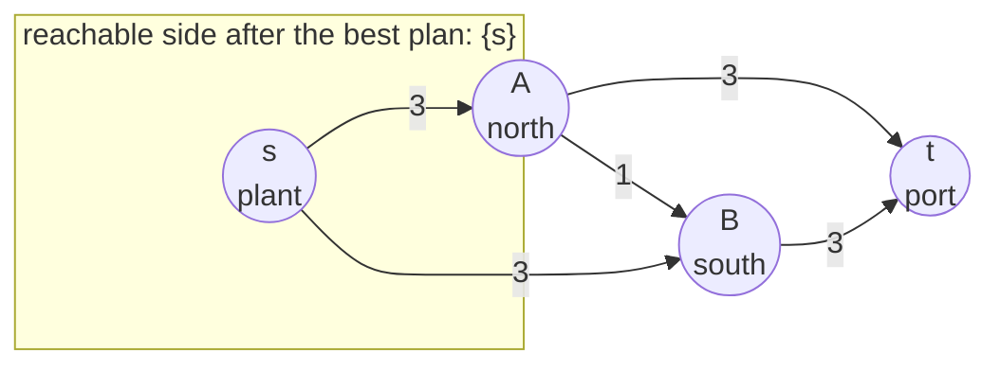
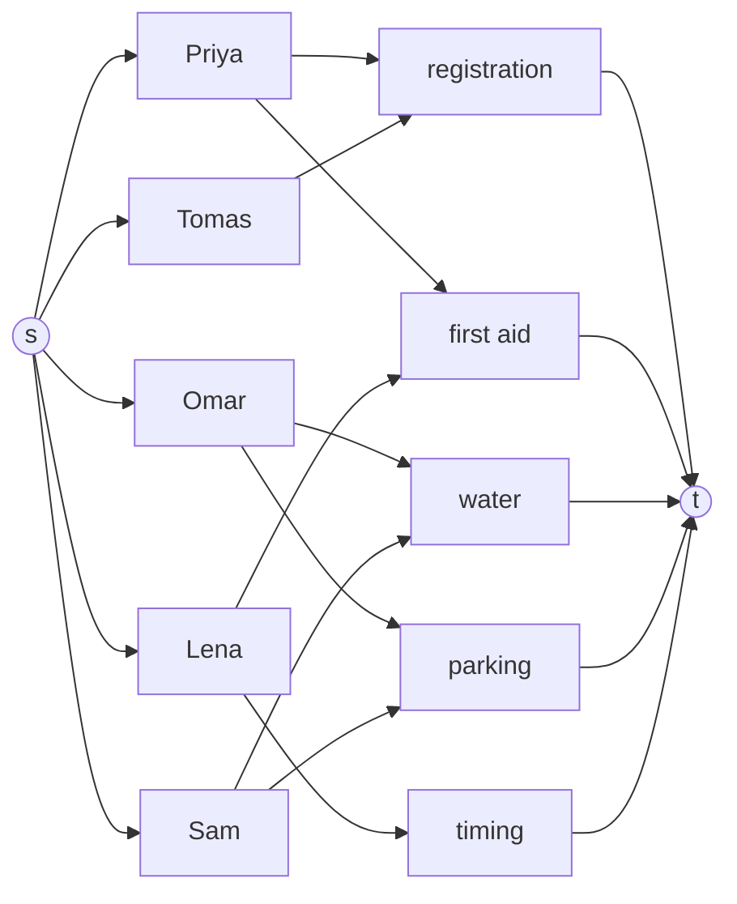

# Max-flow min-cut: the most you can push equals the cheapest way to sever the network, and matching is a flow

[Syllabus](../../../SYLLABUS.md) → [Combinatorics and graphs](../README.md) → [Matchings and Flows](../README.md#s13) → Max-flow min-cut

---

## General Overview

A bottling plant ships lorry-loads nightly to a port through a north and a south depot. The plant can send 3 loads to each depot, each depot can forward 3 to the port, and a link road from north to south takes 1. At most 6 loads a night reach the port. The cheapest way to cut the plant off from the port closes roads worth 6 loads: both roads out of the plant.

Ford and Fulkerson proved in 1956 that these two numbers always meet: no shipment plan beats any severing, and the best plan equals the cheapest one.

The same fact settles pairing. The fun run of [Matchings](01-matchings-and-augmenting-paths.md) has five volunteers, Priya, Omar, Lena, Sam and Tomas, for five tasks, one each. As a network with every road of capacity 1, the largest flow is the largest set of pairs, here 5. When a full pairing is impossible, the cheapest cut names a group that can do too few tasks between them: Hall's theorem again.

**The largest flow equals the cheapest cut, and when no augmenting route is left, the junctions still reachable from the source are one side of such a cut.**

**What kind of fact this is:** a theorem, proved on this card in Why it works.

### The picture: the diamond and its cheapest cuts



Labels are capacities in loads a night. The box marks the cut the method hands back.

---

## The formula

Notation from [Flows](05-flow-networks-and-ford-fulkerson.md): a flow puts $f(u,v)$ loads on the road from junction $u$ to junction $v$, at most its capacity $c(u,v)$, stranding nothing between source $s$ and sink $t$. Its value $\lvert f\rvert$ is the net count leaving $s$. A cut splits the junctions into a side $S$ holding $s$ and a side $T$ holding $t$; its price adds the capacities of roads leaving $S$.

$$\max_{f}\ \lvert f\rvert \;=\; \min_{(S,T)}\ c(S,T), \qquad c(S,T) = \sum_{u \in S,\ v \in T} c(u,v)$$

**Read it aloud:** the value of the best flow equals the price of the cheapest cut.

For pairing, roads of capacity 1 run from $s$ to each volunteer, from each volunteer to each task that volunteer can do, and from each task to $t$. With $P$ the volunteers, $X$ any group of them and $N(X)$ the tasks the group can do ([Hall's theorem](02-halls-marriage-theorem.md)), a cut whose source side holds exactly the volunteers in $X$ pays at least

$$c(S,T) \;\ge\; \lvert P\rvert - \lvert X\rvert + \lvert N(X)\rvert .$$

**Read it aloud:** a cut pays at least once per volunteer left outside, and once per task the inside group reaches.

| Symbol | Plain meaning | In our example | Push it up and the answer… |
| --- | --- | --- | --- |
| $s$, $t$ | source and sink | plant and port | — |
| $A$, $B$, $u$, $v$ | junctions: the depots, and any two | A → B is a road | — |
| $c(u,v)$ | a road's capacity | 3 outer, 1 cross | may raise the best flow |
| $f$, $\lvert f\rvert$ | a flow, and its value | best 6; 5 at the fun run | stops at the cheapest cut |
| $S$, $T$ | a cut's two sides; $c(S,T)$ its price | {s} and {A,B,t}, price 6 | — |
| $R$ | junctions reachable from $s$ on leftover once no augmenting route remains | {s} | — |
| $P$, $X$, $N(X)$, $j$ | volunteers, a group, the tasks it can do, one task | 5; Priya and Tomas; registration | more reach, fuller pairing |

### When it holds

- **Capacities at least 0.** Fractions and real numbers are fine; a negative capacity makes "flow" meaningless.
- **Pushing needs a rule on real capacities.** With whole numbers the method stops. With arbitrary reals a careless route choice can push forever; the fewest-roads rule (Edmonds-Karp) stops.
- **Whole-number flows need whole-number capacities.** Without them the pairing step fails.
- **Pairing as a flow needs two sides.** Every can-do line runs from a volunteer to a task; pairing within one group is a different problem.

---

## Why it works

### Step 0: two numbers that face each other

Each flow sits at or below each cut. So one flow and one cut with the same number settle both questions at once. The pushing method builds that pair.

### Step 1: no flow beats any cut

Junctions on the source side, except $s$, pass on what they receive, so the side's net output is $\lvert f\rvert$, and it leaves only by crossing to $T$:

$$\lvert f\rvert = \sum_{u \in S,\ v \in T} f(u,v) \;-\; \sum_{u \in T,\ v \in S} f(u,v) \;\le\; c(S,T).$$

The first sum is at most the price, road by road. The second counts loads coming back, never negative. On the diamond every plan is at most 6.

### Step 2: when the method stops, the reachable side is a cut priced at the flow

Push until no augmenting route is left. Let $R$ be the junctions still reachable from $s$ on leftover. The sink is outside $R$, or a route would exist, so $R$ and the rest form a cut.

Leftover on $u \to v$ is spare capacity plus any load on $v \to u$ that could be cancelled. A road leaving $R$ with room would make its far end reachable, so every road leaving $R$ is full. A road entering $R$ with a load would offer a stub back out, so every such road is empty. Step 1's sums become the full price and 0:

$$\lvert f\rvert = c(R,\ \text{rest}).$$

### Step 3: the two numbers are equal

With whole-number capacities the method stops, so Step 2's pair exists, and by Step 1 neither can be improved. On the diamond the pushes end at 6 with $R$ = {s}. Two other splits, {s,B} and {s,A,B}, also price 6: the value is one number, the cheapest cut need not be one set.

<details>
<summary>Detailed proof</summary>

**Tightness.** For $u$ in $R$ and $v$ outside it, leftover $(c(u,v) - f(u,v)) + f(v,u)$ is 0 with both brackets at least 0, so $f(u,v) = c(u,v)$ and $f(v,u) = 0$.

**Existence.** Whole-number capacities: each push adds at least 1 and the price of {s} caps the value, so pushing stops. Fractions: scale to whole numbers. Real capacities: the Edmonds-Karp rule stops (Graph algorithms as code).

**Hall's bound.** Let $X$ be the volunteers in $S$. Each volunteer outside $X$ gives a priced road from $s$. Each task $j$ reached by $X$ gives one more: its road to $t$ if $j$ is in $S$, a road from $X$ if not. The roads are distinct, which gives the bound in The formula.

</details>

### Step 4: whole numbers in, whole numbers out

Every push moves the smallest leftover on its route. With whole-number capacities every leftover is whole, so the method ends on a best flow with a whole number on every road.

### Step 5: a pairing is a flow of 0s and 1s

Every fun-run road has capacity 1, so a whole-number flow puts 0 or 1 on each. A volunteer receives at most 1, so takes at most one task; a task passes at most 1 to $t$, so has at most one volunteer. The roads carrying 1 between them form a matching (pairs sharing nobody) as large as the value, and any matching is such a flow. So the largest matching equals the best flow and the cheapest cut.

An augmenting route here is the alternating path of [Matchings](01-matchings-and-augmenting-paths.md). Greedy leaves Priya on registration, Lena on first aid and Tomas idle. The route s → Tomas → registration, back along the stub to Priya, on to first aid, back to Lena, then timing → t moves Priya and Lena along and gives Tomas registration.

### Step 6: when the pairing falls short, the cut names the crowded group

Suppose Priya cannot do first aid: she and Tomas both have only registration. The best flow is 4, and the reachable side is {s, Priya, Tomas, registration}. It pays for the roads from $s$ to Omar, Lena and Sam, and for registration → t: 4. Inside, $X$ = {Priya, Tomas} reaches $N(X)$ = {registration}, and the bound reads 5 − 2 + 1 = 4, met exactly.

If every group reaches at least as many tasks as it has members, every cut costs at least $\lvert P\rvert$ and everyone is placed: Hall's theorem.

---

## Worked numbers, by hand

| Step | Arithmetic | Value |
| --- | --- | --- |
| price of {s} | s→A 3 + s→B 3 | 6 |
| price of {s,A} | s→B 3 + A→B 1 + A→t 3 | 7 |
| price of {s,B} | s→A 3 + B→t 3 (A→B enters) | 6 |
| price of {s,A,B} | A→t 3 + B→t 3 | 6 |
| cheapest cut | smallest of 6, 7, 6, 6 | **6** |
| reachable side after pushing | roads out of s full | {s}, price 6 |
| fun run, greedy in list order | Tomas finds registration taken | 4 |
| one augmenting route | Priya and Lena move along | 5 |
| cheapest fun-run cut | five roads out of s, 1 each | **5** |
| Priya off first aid | 5 − 2 + 1 | **4** |

Six loads a night is the plant's ceiling, certified by two full roads. The fun run covers every task.

### The picture: the fun run as a flow



Every road has capacity 1: 19 in all. Remove Priya → first aid and the best flow drops to 4.

### What breaks if you drop a piece

| Mistake | Comes out at | What went wrong |
| --- | --- | --- |
| The cross road read as the cut | 1 | Closing A → B severs nothing |
| {s,B} priced with the road entering it | 7 | Only roads leaving the source side count |
| Greedy pairing read as the most | 4 | A first choice never revisited |

---

## Code, from first principles, and it actually runs

Nothing that solves the problem is imported. Road one pushes along fewest-road leftover routes and prices the reachable side. Road two prices every cut. Road three ignores the network: every set of pairs, every group.

### Python

```python
# Max-flow min-cut -- the check behind the card.  The diamond (plant s, depots A and B, port
# t; 3 loads on each outer road, 1 on the cross A->B), then five volunteers on five tasks as
# a flow with every road 1.  Road one: push along shortest leftover routes, read off the
# reachable side.  Road two: price every cut.  Road three: every pairing, every group.
def maxflow(cap, nodes):                     # road one; nodes run from s first to t last
    s, t, f = nodes[0], nodes[-1], {}
    left = lambda u, v: cap.get((u, v), 0) - f.get((u, v), 0) + f.get((v, u), 0)
    while True:
        prev, queue = {s: None}, [s]         # breadth-first: fewest roads first
        for u in queue:
            for v in nodes:
                if v not in prev and left(u, v) > 0: prev[v] = u; queue.append(v)
        if t not in prev: return sum(f.get((s, v), 0) for v in nodes), f, [v for v in nodes if v in prev]
        path, v = [], t
        while prev[v] is not None: path.append((prev[v], v)); v = prev[v]
        b = min(left(u, v) for u, v in path)
        for u, v in path:                    # cancel loads going the other way first
            undo = min(b, f.get((v, u), 0))
            f[(v, u)] = f.get((v, u), 0) - undo; f[(u, v)] = f.get((u, v), 0) + b - undo
def price(cap, S): return sum(c for (u, v), c in cap.items() if u in S and v not in S)
def cuts(cap, nodes):                        # road two: every split, s inside, t outside
    mid = nodes[1:-1]
    return [(S, price(cap, S)) for m in range(2 ** len(mid)) for S in [[nodes[0]] + [x for i, x in enumerate(mid) if m >> i & 1]]]
def side(S): return "{" + ",".join(S) + "}"
DIAMOND = {("s", "A"): 3, ("s", "B"): 3, ("A", "t"): 3, ("B", "t"): 3, ("A", "B"): 1}
dval, _, dR = maxflow(DIAMOND, ["s", "A", "B", "t"])
dcuts = cuts(DIAMOND, ["s", "A", "B", "t"]); dmin = min(c for _, c in dcuts)
print("diamond: " + ", ".join(f"{u}->{v} {c}" for (u, v), c in DIAMOND.items()))
print(f"diamond, road one: max flow {dval}; reachable side {side(dR)}, priced {price(DIAMOND, dR)}")
print("diamond, road two: " + ", ".join(f"{side(S)} {c}" for S, c in dcuts) + f"; cheapest {dmin}, priced by {sum(c == dmin for _, c in dcuts)} cuts")
TASKS = ["registration", "first aid", "water", "parking", "timing"]
CAN = {"Priya": ["registration", "first aid"], "Omar": ["water", "parking"], "Lena": ["first aid", "timing"], "Sam": ["water", "parking"], "Tomas": ["registration"]}
def volunteers(can, name):
    P, E = list(can), [(p, j) for p in can for j in can[p]]
    cap, N = {("s", p): 1 for p in P} | {e: 1 for e in E} | {(j, "t"): 1 for j in TASKS}, ["s"] + P + TASKS + ["t"]
    (val, f, R), cs = maxflow(cap, N), cuts(cap, N); low = min(c for _, c in cs)
    sizes = [bin(m).count("1") for m in range(2 ** len(E)) if len({x for i in range(len(E)) if m >> i & 1 for x in E[i]}) == 2 * bin(m).count("1")]
    groups = [[p for i, p in enumerate(P) if m >> i & 1] for m in range(2 ** len(P))]
    short = max(len(X) - len({j for p in X for j in can[p]}) for X in groups)   # worst crowding
    pairs = [(p, j) for p, j in E if f.get((p, j), 0) == 1]     # the roads the flow uses
    print(f"{name}: {len(cap)} roads of capacity 1; road one: max flow {val}, pairs " + ", ".join(f"{p}-{j}" for p, j in pairs))
    print(f"  reachable side {side(R)}, priced {price(cap, R)}")
    print(f"  road two: {len(cs)} cuts, cheapest {low}, priced by {sum(c == low for _, c in cs)} cuts")
    print(f"  road three: {len(sizes)} sets of pairings, largest {max(sizes)}; worst group short by {short}, so {len(P)} - {short} = {len(P) - short}")
    return val, low, max(sizes), len(P) - short, R, pairs
val, low, big, hall, R, pairs = volunteers(CAN, "volunteers")
BROKEN = dict(CAN, Priya=["registration"])
val2, low2, big2, hall2, R2, _ = volunteers(BROKEN, "Priya off first aid")
X = [p for p in CAN if p in R2]; NX = sorted({j for p in X for j in BROKEN[p]})
print(f"  volunteers on the reachable side {side(X)} reach {side(NX)}: {len(X)} people, {len(NX)} task")
used = set()                                 # greedy: each takes the first free task listed
for p in CAN: used |= set([j for j in CAN[p] if j not in used][:1])
print(f"mistake 1, the cross road read as the cut: {DIAMOND[('A', 'B')]}, not {dmin}")
print(f"mistake 2, {{s,B}} priced with the road entering it too: {price(DIAMOND, ['s', 'B']) + DIAMOND[('A', 'B')]}, not {dmin}")
print(f"mistake 3, greedy pairing in list order read as the most: {len(used)}, not {big}")
assert dval == dmin == price(DIAMOND, dR) == 6 and sum(c == dmin for _, c in dcuts) == 3   # flow meets cut
assert val == low == big == hall == 5 == len(pairs) and len({x for e in pairs for x in e}) == 2 * big > 2 * len(used)
assert val2 == low2 == big2 == hall2 == 4 and len(NX) < len(X)      # the cut names the crowded group
print("ALL CHECKS PASS")
```

**Ran 2026-09-24 on macOS, Python 3.14.6, standard library only. All checks passed. Output, pasted from the run:**

```
diamond: s->A 3, s->B 3, A->t 3, B->t 3, A->B 1
diamond, road one: max flow 6; reachable side {s}, priced 6
diamond, road two: {s} 6, {s,A} 7, {s,B} 6, {s,A,B} 6; cheapest 6, priced by 3 cuts
volunteers: 19 roads of capacity 1; road one: max flow 5, pairs Priya-first aid, Omar-water, Lena-timing, Sam-parking, Tomas-registration
  reachable side {s}, priced 5
  road two: 1024 cuts, cheapest 5, priced by 14 cuts
  road three: 91 sets of pairings, largest 5; worst group short by 0, so 5 - 0 = 5
Priya off first aid: 18 roads of capacity 1; road one: max flow 4, pairs Priya-registration, Omar-water, Lena-first aid, Sam-parking
  reachable side {s,Priya,Tomas,registration}, priced 4
  road two: 1024 cuts, cheapest 4, priced by 2 cuts
  road three: 63 sets of pairings, largest 4; worst group short by 1, so 5 - 1 = 4
  volunteers on the reachable side {Priya,Tomas} reach {registration}: 2 people, 1 task
mistake 1, the cross road read as the cut: 1, not 6
mistake 2, {s,B} priced with the road entering it too: 7, not 6
mistake 3, greedy pairing in list order read as the most: 4, not 5
ALL CHECKS PASS
```

### Rust

Same numbers, same labels, built with `rustc --edition 2021 -O`.

```rust
// Max-flow min-cut -- the same check as the Python, in Rust.  No crates.  The diamond (plant
// s, depots A and B, port t; 3 loads on each outer road, 1 on the cross A->B), then five
// volunteers on five tasks as a flow with every road 1.  Road one: shortest leftover routes
// and the reachable side.  Road two: price every cut.  Road three: every pairing, every group.
type Net = (Vec<&'static str>, Vec<(usize, usize, i64)>);   // junctions (s first, t last), roads
fn maxflow(n: &Net) -> (i64, Vec<Vec<i64>>, Vec<usize>) {    // road one: push until stuck
    let k = n.0.len(); let (mut cap, mut f) = (vec![vec![0i64; k]; k], vec![vec![0i64; k]; k]);
    for &(u, v, c) in &n.1 { cap[u][v] = c }
    let left = |f: &Vec<Vec<i64>>, u: usize, v: usize| cap[u][v] - f[u][v] + f[v][u];
    loop {
        let (mut prev, mut queue, mut i) = (vec![usize::MAX; k], vec![0usize], 0); prev[0] = 0;   // breadth-first
        while i < queue.len() {
            let u = queue[i]; i += 1;
            for v in 0..k { if prev[v] == usize::MAX && left(&f, u, v) > 0 { prev[v] = u; queue.push(v) } }
        }
        if prev[k - 1] == usize::MAX { return (f[0].iter().sum(), f, (0..k).filter(|&v| prev[v] != usize::MAX).collect()) }
        let (mut path, mut v) = (vec![], k - 1);
        while v != 0 { path.push((prev[v], v)); v = prev[v] }
        let b = path.iter().map(|&(u, v)| left(&f, u, v)).min().unwrap();
        for &(u, v) in &path { let undo = b.min(f[v][u]); f[v][u] -= undo; f[u][v] += b - undo }   // cancel first
    }
}
fn price(n: &Net, s: &[usize]) -> i64 { n.1.iter().filter(|r| s.contains(&r.0) && !s.contains(&r.1)).map(|r| r.2).sum() }
fn cuts(n: &Net) -> Vec<(Vec<usize>, i64)> {             // road two: every split, s in, t out
    let k = n.0.len();
    (0..1usize << (k - 2)).map(|m| { let s: Vec<usize> = std::iter::once(0).chain((1..k - 1).filter(|i| m >> (i - 1) & 1 == 1)).collect(); let p = price(n, &s); (s, p) }).collect()
}
fn side(names: &[&str]) -> String { format!("{{{}}}", names.join(",")) }
const TASKS: [&str; 5] = ["registration", "first aid", "water", "parking", "timing"];
fn volunteers(can: &[(&'static str, Vec<&'static str>)], name: &str) -> (i64, i64, i64, i64, Vec<&'static str>, Vec<(usize, usize)>) {
    let np = can.len();
    let mut names = vec!["s"]; names.extend(can.iter().map(|c| c.0)); names.extend(TASKS); names.push("t");
    let task = |j: &str| 1 + np + TASKS.iter().position(|&x| x == j).unwrap();
    let e: Vec<(usize, usize)> = can.iter().enumerate().flat_map(|(i, c)| c.1.iter().map(move |&j| (1 + i, j))).map(|(p, j)| (p, task(j))).collect();
    let mut roads: Vec<(usize, usize, i64)> = (1..=np).map(|p| (0, p, 1)).collect();
    roads.extend(e.iter().map(|&(p, j)| (p, j, 1))); roads.extend((0..5).map(|j| (1 + np + j, names.len() - 1, 1)));
    let net: Net = (names.clone(), roads);
    let (val, f, r) = maxflow(&net);
    let cs = cuts(&net); let low = cs.iter().map(|c| c.1).min().unwrap();
    let mut sizes = vec![]; for m in 0..1usize << e.len() {   // road three: every set of pairings
        let mut ends: Vec<usize> = (0..e.len()).filter(|i| m >> i & 1 == 1).flat_map(|i| [e[i].0, e[i].1]).collect();
        let size = m.count_ones() as usize; ends.sort(); ends.dedup();
        if ends.len() == 2 * size { sizes.push(size as i64) }
    }
    let big = *sizes.iter().max().unwrap();
    let short = (0..1usize << np).map(|m| {                  // worst crowding over every group
        let mut reach: Vec<&str> = (0..np).filter(|i| m >> i & 1 == 1).flat_map(|i| can[i].1.clone()).collect();
        reach.sort(); reach.dedup(); m.count_ones() as i64 - reach.len() as i64 }).max().unwrap();
    let pv: Vec<(usize, usize)> = e.iter().filter(|&&(p, j)| f[p][j] == 1).cloned().collect();   // roads the flow uses
    println!("{}: {} roads of capacity 1; road one: max flow {}, pairs {}", name, net.1.len(), val, pv.iter().map(|&(p, j)| format!("{}-{}", names[p], names[j])).collect::<Vec<String>>().join(", "));
    let rn: Vec<&'static str> = r.iter().map(|&i| names[i]).collect();
    println!("  reachable side {}, priced {}", side(&rn), price(&net, &r));
    println!("  road two: {} cuts, cheapest {}, priced by {} cuts", cs.len(), low, cs.iter().filter(|c| c.1 == low).count());
    println!("  road three: {} sets of pairings, largest {}; worst group short by {}, so {} - {} = {}", sizes.len(), big, short, np, short, np as i64 - short);
    (val, low, big, np as i64 - short, rn, pv)
}
fn main() {
    let d: Net = (vec!["s", "A", "B", "t"], vec![(0, 1, 3), (0, 2, 3), (1, 3, 3), (2, 3, 3), (1, 2, 1)]);
    let (dval, _, dr) = maxflow(&d);
    let dcuts = cuts(&d); let dmin = dcuts.iter().map(|c| c.1).min().unwrap(); let nm = |s: &[usize]| side(&s.iter().map(|&i| d.0[i]).collect::<Vec<&str>>());
    println!("diamond: {}", d.1.iter().map(|&(u, v, c)| format!("{}->{} {}", d.0[u], d.0[v], c)).collect::<Vec<String>>().join(", "));
    println!("diamond, road one: max flow {}; reachable side {}, priced {}", dval, nm(&dr), price(&d, &dr));
    println!("diamond, road two: {}; cheapest {}, priced by {} cuts", dcuts.iter().map(|(s, c)| format!("{} {}", nm(s), c)).collect::<Vec<String>>().join(", "), dmin, dcuts.iter().filter(|c| c.1 == dmin).count());
    let can = vec![("Priya", vec!["registration", "first aid"]), ("Omar", vec!["water", "parking"]), ("Lena", vec!["first aid", "timing"]), ("Sam", vec!["water", "parking"]), ("Tomas", vec!["registration"])];
    let (val, low, big, hall, _, pv) = volunteers(&can, "volunteers"); let mut broken = can.clone(); broken[0].1 = vec!["registration"];
    let (val2, low2, big2, hall2, r2, _) = volunteers(&broken, "Priya off first aid");
    let x: Vec<&str> = broken.iter().filter(|c| r2.contains(&c.0)).map(|c| c.0).collect();
    let mut nx: Vec<&str> = broken.iter().filter(|c| r2.contains(&c.0)).flat_map(|c| c.1.clone()).collect(); nx.sort(); nx.dedup();
    println!("  volunteers on the reachable side {} reach {}: {} people, {} task", side(&x), side(&nx), x.len(), nx.len());
    let mut used: Vec<&str> = vec![];                      // greedy: first free task listed
    for c in &can { if let Some(&j) = c.1.iter().find(|j| !used.contains(j)) { used.push(j) } }
    println!("mistake 1, the cross road read as the cut: {}, not {}", d.1[4].2, dmin);
    println!("mistake 2, {{s,B}} priced with the road entering it too: {}, not {}", price(&d, &[0, 2]) + d.1[4].2, dmin);
    println!("mistake 3, greedy pairing in list order read as the most: {}, not {}", used.len(), big);
    let mut ends: Vec<usize> = pv.iter().flat_map(|&(p, j)| [p, j]).collect(); ends.sort(); ends.dedup();
    assert!(dval == dmin && dmin == price(&d, &dr) && dval == 6 && dcuts.iter().filter(|c| c.1 == dmin).count() == 3);
    assert!(val == low && low == big && big == hall && hall == 5 && pv.len() as i64 == val && ends.len() as i64 == 2 * big && big > used.len() as i64);
    assert!(val2 == low2 && low2 == big2 && big2 == hall2 && hall2 == 4 && nx.len() < x.len());   // crowded group
    println!("ALL CHECKS PASS");
}
```

**Ran 2026-09-24 on macOS, rustc 1.98.1, no crates. All checks passed. Output, pasted from the run:**

```
diamond: s->A 3, s->B 3, A->t 3, B->t 3, A->B 1
diamond, road one: max flow 6; reachable side {s}, priced 6
diamond, road two: {s} 6, {s,A} 7, {s,B} 6, {s,A,B} 6; cheapest 6, priced by 3 cuts
volunteers: 19 roads of capacity 1; road one: max flow 5, pairs Priya-first aid, Omar-water, Lena-timing, Sam-parking, Tomas-registration
  reachable side {s}, priced 5
  road two: 1024 cuts, cheapest 5, priced by 14 cuts
  road three: 91 sets of pairings, largest 5; worst group short by 0, so 5 - 0 = 5
Priya off first aid: 18 roads of capacity 1; road one: max flow 4, pairs Priya-registration, Omar-water, Lena-first aid, Sam-parking
  reachable side {s,Priya,Tomas,registration}, priced 4
  road two: 1024 cuts, cheapest 4, priced by 2 cuts
  road three: 63 sets of pairings, largest 4; worst group short by 1, so 5 - 1 = 4
  volunteers on the reachable side {Priya,Tomas} reach {registration}: 2 people, 1 task
mistake 1, the cross road read as the cut: 1, not 6
mistake 2, {s,B} priced with the road entering it too: 7, not 6
mistake 3, greedy pairing in list order read as the most: 4, not 5
ALL CHECKS PASS
```

The two outputs match line for line.

> [!TIP]
> **Try changing**
> Guess first; an assert stops the run when a number comes out wrong.
> - **Give Tomas timing too.** Tomas's list becomes `["registration", "timing"]`. Greedy now reaches 5, and the second assert stops the run.
> - **Widen the cross road.** Set `("A", "B")` to 3. The best flow stays 6 and every assert passes; only {s,A} moves, to 9.
> - **Narrow one outer road.** Set `("s", "A")` to 2. Flow and cheapest cut both fall to 5, priced by 2 cuts; the first assert stops it.

---

## The usual mistake

> [!warning]
> **Treating the cheapest cut as one narrow road.** A cut splits all the junctions and pays for every road leaving the source side. Closing the diamond's cross road, capacity 1, severs nothing; the ceiling is 6.
>
> - **Pricing roads that enter the source side.** Counting A → B against {s,B} gives 7, not 6.
> - **"The" cheapest cut.** The value is unique; the cut is not. The diamond has 3, the fun-run network 14.
> - **Stopping at a greedy dead end.** Four pairs with Tomas left over looks finished; the route through Priya and Lena gives 5.

---

## Where you meet it in real life

- **Rail and pipelines.** The 1956 question was a rail network's largest steady shipment; the cheapest cut names the links worth widening.
- **Staffing.** Nurses to shifts, drivers to routes: a shortfall arrives with the crowded group causing it.
- **Image editing.** Separating a subject from its background is often a cheapest cut, one junction per pixel.
- **Guards on a town plan.** The cut of a pairing network gives the fewest guards of [Konig's theorem](03-konigs-theorem-and-vertex-cover.md).

> **Say it back**
> No flow beats any cut. When no augmenting route is left, the side still reachable from the source has every road out full and every road in empty, so its price equals the flow. The best flow therefore equals the cheapest cut: 6 on the diamond. With capacity 1 everywhere, a whole-number flow is a matching. When a full one is impossible, the cheapest cut holds a group reaching too few tasks: Hall's theorem.

---

## What this builds on

- [Flows](05-flow-networks-and-ford-fulkerson.md): flows, cuts, leftover and the pushing method.
- [Hall's theorem](02-halls-marriage-theorem.md): the condition on groups, proved there by induction.

## Where this goes next

- [How many cuts break a network](07-connectivity-and-mengers-theorem.md): unit capacities, so flows count separate routes and cuts count breaking links.
- Network flows: the cut as the dual of a linear program.

---

## Sources

Verified 24 Sep 2026: every link below resolves to the publisher's page.

- Ford, L. R., Jr., and D. R. Fulkerson. "Maximal Flow Through a Network." *Canadian Journal of Mathematics* 8 (1956): 399–404. [doi:10.4153/CJM-1956-045-5](https://doi.org/10.4153/CJM-1956-045-5). The theorem and its labelling proof.
- Elias, P., A. Feinstein, and C. E. Shannon. "A Note on the Maximum Flow Through a Network." *IRE Transactions on Information Theory* 2, no. 4 (1956): 117–119. [doi:10.1109/TIT.1956.1056816](https://doi.org/10.1109/TIT.1956.1056816). The same theorem, found independently.
- Cormen, Thomas H., Charles E. Leiserson, Ronald L. Rivest, and Clifford Stein. *Introduction to Algorithms*, 4th ed. MIT Press, 2022. [Publisher page](https://mitpress.mit.edu/9780262046305/introduction-to-algorithms/). The proof, and matching as a unit-capacity flow.
- Schrijver, Alexander. "On the History of the Transportation and Maximum Flow Problems." *Mathematical Programming* 91 (2002): 437–445. [doi:10.1007/s101070100259](https://doi.org/10.1007/s101070100259). The rail question behind the 1956 papers.
