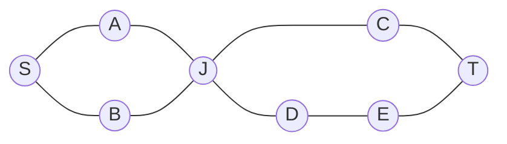
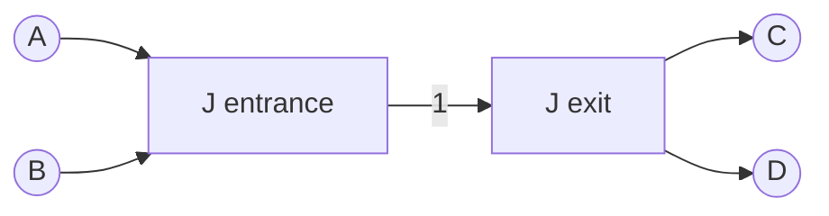

# How many cuts break a network: bridges, cut vertices, and Menger's theorem that separate routes equal the blocks needed

[Syllabus](../../../SYLLABUS.md) → [Combinatorics and graphs](../README.md) → [Matchings and Flows](../README.md#s13) → How many cuts break a network

---

## General Overview

A small railway runs between two termini, S in the west and T in the east: 8 stations, 9 lines. West of the junction J the track is a loop, S to J via A or via B. East of J it is a second loop, J to T via C, or via D and E.

How many trains can run from S to T at once, no two sharing a line? Two: S–A–J–C–T and S–B–J–D–E–T. How many lines must close before S and T are cut apart? Closing S–A and S–B does it, so two. The answers agree, and not by accident.

Stations tell a different story. Every route passes J, so closing J alone splits the network. A station whose loss splits a network is a **cut vertex**; a line whose loss splits it is a **bridge**. This railway has one cut vertex and no bridge. Close line C–T for a week and J–C, J–D, D–E and E–T become bridges, D and E cut vertices.

**The most routes from one station to another that share no line equals the fewest lines whose closure separates them; the same holds for stations, counting routes that share no station along the way.**

**What kind of fact this is:** a theorem, Menger's theorem, proved in Why it works from [Max-flow min-cut](06-max-flow-min-cut.md); bridge, cut vertex and the two connectivities are definitions.

### The picture: two loops meeting at one junction



Each line runs both ways. S and T are the termini; J is the junction every route must pass.

---

## The formula

Notation first, in words. A network is a graph $G$: stations are its vertex set $V$, lines its edge set $E$ ([Graphs](../09-Graphs%20-%20Dots%20and%20Lines/01-graphs-vertices-and-edges.md)). A **route** repeats no station. Routes are **line-disjoint** when they share no line, **station-disjoint** when they share no station but their ends. $c(G)$ counts the separate pieces of $G$ ([Connected or not](../09-Graphs%20-%20Dots%20and%20Lines/04-connectivity-and-breadth-first-search.md)); $G - e$ is $G$ with line $e$ removed.

The **line connectivity** $\lambda(S,T)$, read "lambda of S T", is the fewest lines whose closure leaves no route from $S$ to $T$. The **station connectivity** $\kappa(S,T)$, read "kappa", is the fewest stations, other than $S$ and $T$, whose closure does the same.

Menger's theorem, line form:

$$\text{most line-disjoint routes from } S \text{ to } T \;=\; \lambda(S,T)$$

**Read it aloud:** trains running at once on separate lines number as many as the lines that must close to stop them all.

Station form, for $S$ and $T$ not joined by a line:

$$\text{most station-disjoint routes from } S \text{ to } T \;=\; \kappa(S,T)$$

**Read it aloud:** routes sharing no station on the way number as many as the stations that must close.

A line $e$ is a **bridge** when $c(G - e) > c(G)$. That happens exactly when $e$ lies on no loop: a loop through $e$ is a detour round it. A station is a **cut vertex** when removing it, with its lines, adds a piece. For a whole network, the connectivities are the fewest lines, or stations, whose removal splits it: a bridge makes the first 1, a cut vertex the second.

| Symbol | Plain meaning | In our example | Push it up and the answer… |
| --- | --- | --- | --- |
| $G$, $V$, $E$ | network, stations, lines | 8 stations, 9 lines | more lines, more routes |
| $S$, $T$ | the stations kept apart | the termini | — |
| $e$, $G - e$ | one line; the network without it | C–T; C–T closed | — |
| $c(G)$ | number of separate pieces | 1 | — |
| $\lambda(S,T)$ | fewest lines parting $S$ from $T$ | 2 | more trains on separate lines |
| $\kappa(S,T)$ | fewest stations parting them | 1, station J | more station-disjoint routes |
| $k$ | a number of routes or closures | 2 | — |

### When it holds

- **Finite networks.** The proof peels routes one at a time; infinite networks need more care.
- **Station form needs the ends apart.** If a line joins $S$ to $T$, no set of stations separates them and $\kappa(S,T)$ is undefined.
- **Disjoint means disjoint.** Count all routes instead and get 4, though 2 closures stop them all.
- **One-way lines are fine.** The theorem then counts one-way routes and closures; the proof is unchanged.

---

## Why it works

### Step 0: routes are a flow, closures are a cut

Give every line a capacity of 1 in each direction and send a flow from $S$ to $T$ ([Flows](05-flow-networks-and-ford-fulkerson.md)). A train is one unit of flow, one per line.

### Step 1: closures can never be fewer than routes

Suppose $k$ routes share no line. A closed line lies on at most one of them, so fewer than $k$ closures leave a route open. On the railway, two separate routes force two closures.

### Step 2: routes and whole-number flows are the same thing

One unit along each of $k$ line-disjoint routes is a legal flow of value $k$.

The other way round, Ford-Fulkerson with whole-number capacities ends at a whole-number flow, so each line carries 0 or 1. From $S$, follow lines carrying a unit; every unit entering a station leaves it, so the walk reaches $T$. Remove that route's units and repeat. A flow of value $k$ peels into $k$ routes, no line used twice.

### Step 3: a cheapest cut is a smallest set of closures

A cut splits the stations into an $S$ side and a $T$ side; its price is the number of lines crossing. Closing them separates, so every price is at least $\lambda(S,T)$. Conversely, after any separating closures, put on the $S$ side every station $S$ still reaches. Every line leaving that side is closed, so that cut costs no more than the closures. The cheapest cut costs exactly $\lambda(S,T)$.

### Step 4: glue with max-flow min-cut

Most line-disjoint routes equal the largest flow (Step 2), which equals the cheapest cut ([Max-flow min-cut](06-max-flow-min-cut.md)), which equals $\lambda(S,T)$ (Step 3). That is the line form.

### Step 5: split each station to get the station form

Replace every station $x$ other than $S$ and $T$ by an entrance and an exit, joined by one one-way road of capacity 1. Lines arrive at the entrance and leave from the exit. Give each line capacity 8, the number of stations. Closing all six middle stations costs only 6, so no cheapest cut uses a line.



Every unit through $x$ uses its inside road, so routes share no station, and a cheapest cut is a set of inside roads: a set of stations. Steps 1 to 4 on this split network give the station form. J's inside road carries one unit, so the answer drops from 2 to 1.

<details>
<summary>Detailed proof: peeling a whole-number flow into routes</summary>

Take a flow of value $k$, each line carrying 0 or 1. If a line carries a unit both ways, zero both: each end's in-count and out-count drop together, and the value holds. From $S$, follow a line carrying a unit out. At any station but $T$ a unit came in, so one goes out; lines are finite, so the walk reaches $T$. If it revisits a station, cut out the loop and zero its units. What remains is a route; zero its units, and $S$ now sends $k - 1$ with every other station balanced. Repeat $k$ times. The routes share no line, since each line held at most one unit.

</details>

A second road needs no flows: try every set of lines, smallest first, until one separates. The code does exactly that.

---

## Worked numbers, by hand

| Step | Arithmetic | Value |
| --- | --- | --- |
| routes from S to T | west: via A or via B; east: via C, or via D and E | 4 routes |
| routes sharing no line | S–A–J–C–T and S–B–J–D–E–T | 2 |
| lines that separate | close S–A and S–B | **2**, so $\lambda(S,T)$ = 2 |
| pairs of lines that separate | one line off each west route, or one off each east route | 10 |
| routes sharing no station | every route passes J | 1 |
| stations that separate | close J | **1**, so $\kappa(S,T)$ = 1 |
| bridges | every line lies on a loop | none |
| cut vertices | removing J leaves a west piece and an east piece | J |
| C–T closed: line connectivity | 2 routes left, both via D and E | **1** |
| C–T closed: bridges | the east loop is a path, C hangs off J | J–C, J–D, D–E, E–T |
| C–T closed: cut vertices | each splits the path | D, E, J |

Two trains can run at once on separate lines, and two closures stop them; one station, J, carries every train.

### What breaks if you drop a piece

| Mistake | Comes out at | What went wrong |
| --- | --- | --- |
| Counting every route | 4 | The routes share lines, and all pass J |
| Station form without splitting | 2, not 1 | Two units pass through J: the line answer |
| "No bridge, so no weak station" | no bridge, yet J cuts | Station connectivity sits below line connectivity |

The code prints all three.

---

## Code, from first principles, and it actually runs

Nothing is imported. Road one is brute force over every set of closed lines, of closed stations, and every family of routes. Road two is max flow with capacity 1, stations split for the station form. Bridges and cut vertices come from counting pieces, and from whether any flow survives. A second case closes C–T.

### Python

```python
# Menger's theorem on an 8-station rail network -- the check behind the card.  Nothing imported.
# Road one: brute force over closed lines, closed stations and route families.  Road two: max flow.
NET = [("S", "A"), ("S", "B"), ("A", "J"), ("B", "J"), ("J", "C"), ("C", "T"), ("J", "D"), ("D", "E"), ("E", "T")]
def pieces(stations, lines):             # give both ends of each open line one label
    label = {x: x for x in stations}
    for u, v in (l for l in lines if l[0] in label and l[1] in label):
        old, new = label[u], label[v]
        label = {x: new if y == old else y for x, y in label.items()}
    return label
def flow(arcs, s, t):                    # push one unit at a time along a searched route
    cap, total = dict(arcs), 0
    while True:
        prev, todo = {s: None}, [s]
        for u in todo:
            for (a, b), c in cap.items():
                if a == u and c > 0 and b not in prev: prev[b] = a; todo.append(b)
        if t not in prev: return total
        b, total = t, total + 1
        while prev[b] is not None:
            a = prev[b]; cap[(a, b)] -= 1; cap[(b, a)] = cap.get((b, a), 0) + 1; b = a
def roads(lines, big=1, split=(), off=""):  # each open line becomes two one-way roads
    i, o = (lambda x: x + "i" if x in split else x), (lambda x: x + "o" if x in split else x)
    arcs = {(x + "i", x + "o"): 1 for x in split}  # a split station passes one unit
    for u, v in (l for l in lines if off not in l):
        arcs[(o(u), i(v))] = arcs[(o(v), i(u))] = big
    return arcs
def routes(lines, here, seen):           # every S-T route that repeats no station
    if here == "T": return [["T"]]
    nxt = sorted({b for a, b in lines if a == here} | {a for a, b in lines if b == here})
    return [[here] + r for x in nxt if x not in seen for r in routes(lines, x, seen | {x})]
def most_apart(rs, key):                 # the largest family of routes sharing no key
    fams = [[key(r) for i, r in enumerate(rs) if m >> i & 1] for m in range(1 << len(rs))]
    return max(len(f) for f in fams if len([k for r in f for k in r]) == len({k for r in f for k in r}))
on_lines, on_stations = (lambda r: [tuple(sorted(p)) for p in zip(r, r[1:])]), (lambda r: r[1:-1])
for name, lines in (("full network", NET), ("line C-T closed", [l for l in NET if l != ("C", "T")])):
    st = sorted({x for l in lines for x in l}); mid = [x for x in st if x not in "ST"]
    count = lambda xs, ls: len(set(pieces(xs, ls).values()))
    apart = lambda xs, ls: (lambda r: r["S"] != r["T"])(pieces(xs, ls))
    shut = ([l for i, l in enumerate(lines) if m >> i & 1] for m in range(1 << len(lines)))
    cuts = [len(c) for c in shut if apart(st, [l for l in lines if l not in c])]
    vk = min(len(c) for c in ([x for i, x in enumerate(mid) if m >> i & 1] for m in range(1 << len(mid)))
             if apart([x for x in st if x not in c], lines))
    lam, kap = flow(roads(lines), "S", "T"), flow(roads(lines, len(st), mid), "S", "T")
    br1 = ["-".join(l) for l in lines if count(st, [m for m in lines if m != l]) > count(st, lines)]
    br2 = [u + "-" + v for u, v in lines if flow(roads([l for l in lines if l != (u, v)]), u, v) == 0]
    cv1 = [x for x in st if count([y for y in st if y != x], lines) > count(st, lines)]
    nb = lambda x: [b for a, b in lines if a == x] + [a for a, b in lines if b == x]
    cv2 = [x for x in st if any(flow(roads(lines, off=x), a, b) == 0 for a in nb(x) for b in nb(x) if a < b)]
    rs = routes(lines, "S", {"S"}); ld, sd = most_apart(rs, on_lines), most_apart(rs, on_stations)
    print(f"{name}: {len(st)} stations, {len(lines)} lines, {len(rs)} S-T routes in all")
    print(f"  fewest lines to separate S from T: {min(cuts)} (brute force), {lam} (flow); {cuts.count(min(cuts))} such sets")
    print(f"  most line-disjoint routes: {ld} (brute force), {lam} (flow)")
    print(f"  fewest stations to separate: {vk} (brute force), {kap} (split flow); station-disjoint routes {sd}")
    print(f"  bridges: {', '.join(br1) or 'none'} (pieces); {', '.join(br2) or 'none'} (flow)")
    print(f"  cut vertices: {', '.join(cv1) or 'none'} (pieces); {', '.join(cv2) or 'none'} (flow)")
    assert min(cuts) == lam == ld          # Menger, line form: brute cut, flow, brute routes
    assert vk == kap == sd                 # Menger, station form: brute cut, split flow, brute routes
    assert br1 == br2 and cv1 == cv2       # weak spots: counting pieces against flow
print("ALL CHECKS PASS")
```

**Ran 2026-09-24 on macOS, Python 3.14.6, standard library only. All checks passed. Output, pasted from the run:**

```
full network: 8 stations, 9 lines, 4 S-T routes in all
  fewest lines to separate S from T: 2 (brute force), 2 (flow); 10 such sets
  most line-disjoint routes: 2 (brute force), 2 (flow)
  fewest stations to separate: 1 (brute force), 1 (split flow); station-disjoint routes 1
  bridges: none (pieces); none (flow)
  cut vertices: J (pieces); J (flow)
line C-T closed: 8 stations, 8 lines, 2 S-T routes in all
  fewest lines to separate S from T: 1 (brute force), 1 (flow); 3 such sets
  most line-disjoint routes: 1 (brute force), 1 (flow)
  fewest stations to separate: 1 (brute force), 1 (split flow); station-disjoint routes 1
  bridges: J-C, J-D, D-E, E-T (pieces); J-C, J-D, D-E, E-T (flow)
  cut vertices: D, E, J (pieces); D, E, J (flow)
ALL CHECKS PASS
```

### Rust

Same numbers, same labels, built with `rustc --edition 2021 -O`. It finds pieces by depth-first search rather than merging labels.

```rust
// Menger's theorem on an 8-station rail network -- the same check as the Python, in Rust.  No crates.
// Road one: brute force as in the Python.  Road two: max flow, each station an in-node and an out-node.
type L = (&'static str, &'static str);
const NET: [L; 9] = [("S", "A"), ("S", "B"), ("A", "J"), ("B", "J"), ("J", "C"), ("C", "T"), ("J", "D"), ("D", "E"), ("E", "T")];
fn at(st: &[&str], x: &str) -> Option<usize> { st.iter().position(|&y| y == x) }
fn label(st: &[&str], lines: &[L]) -> Vec<usize> {   // depth-first search: a piece number per station
    let mut lab = vec![usize::MAX; st.len()];
    for s in 0..st.len() {
        if lab[s] != usize::MAX { continue }
        let mut stack = vec![s]; lab[s] = s;
        while let Some(u) = stack.pop() {
            for (i, j) in lines.iter().filter_map(|&(a, b)| Some((at(st, a)?, at(st, b)?))) {
                for (p, q) in [(i, j), (j, i)] { if p == u && lab[q] == usize::MAX { lab[q] = s; stack.push(q) } }
            }
        }
    }
    lab
}
fn count(st: &[&str], lines: &[L]) -> usize { let mut l = label(st, lines); l.sort(); l.dedup(); l.len() }
fn apart(st: &[&str], lines: &[L]) -> bool { let l = label(st, lines); l[at(st, "S").unwrap()] != l[at(st, "T").unwrap()] }
fn flow(st: &[&str], lines: &[L], big: i32, split: &[&str], off: &str, s: &str, t: &str) -> i32 {
    let (n, p) = (2 * st.len(), |x: &str| at(st, x).unwrap());
    let mut cap = vec![vec![0i32; n]; n];
    for k in 0..st.len() { cap[2 * k][2 * k + 1] = if split.contains(&st[k]) { 1 } else { 1000 } }
    for &(a, b) in lines.iter().filter(|l| l.0 != off && l.1 != off) { cap[2 * p(a) + 1][2 * p(b)] = big; cap[2 * p(b) + 1][2 * p(a)] = big }
    let (src, snk, mut total) = (2 * p(s) + 1, 2 * p(t), 0);
    loop {
        let (mut prev, mut todo, mut h) = (vec![usize::MAX; n], vec![src], 0); prev[src] = src;
        while h < todo.len() {
            let u = todo[h]; h += 1;
            for v in 0..n { if cap[u][v] > 0 && prev[v] == usize::MAX { prev[v] = u; todo.push(v) } }
        }
        if prev[snk] == usize::MAX { return total }
        let mut v = snk; while v != src { let u = prev[v]; cap[u][v] -= 1; cap[v][u] += 1; v = u }
        total += 1;
    }
}
fn routes(lines: &[L], path: Vec<&'static str>, out: &mut Vec<Vec<&'static str>>) {   // every S-T route, no repeats
    let here = *path.last().unwrap();
    if here == "T" { out.push(path); return }
    for &(a, b) in lines { for (u, v) in [(a, b), (b, a)] { if u == here && !path.contains(&v) { let mut q = path.clone(); q.push(v); routes(lines, q, out) } } }
}
fn most_apart(keys: &[Vec<String>]) -> usize {         // the largest family of routes sharing no key
    (0..1usize << keys.len()).filter(|m| {
        let f: Vec<&String> = (0..keys.len()).filter(|i| m >> i & 1 == 1).flat_map(|i| keys[i].iter()).collect();
        f.iter().enumerate().all(|(i, k)| !f[..i].contains(k))
    }).map(|m| m.count_ones() as usize).max().unwrap()
}
fn main() {
    let closed: Vec<L> = NET.iter().copied().filter(|&l| l != ("C", "T")).collect();
    for (name, lines) in [("full network", NET.to_vec()), ("line C-T closed", closed)] {
        let mut st: Vec<&str> = lines.iter().flat_map(|&(a, b)| [a, b]).collect(); st.sort(); st.dedup();
        let mid: Vec<&str> = st.iter().copied().filter(|&x| x != "S" && x != "T").collect();
        let cuts: Vec<u32> = (0..1u32 << lines.len()).filter(|m| apart(&st, &(0..lines.len()).filter(|i| m >> i & 1 == 0).map(|i| lines[i]).collect::<Vec<L>>())).map(|m| m.count_ones()).collect();
        let k = *cuts.iter().min().unwrap();
        let vk = (0..1u32 << mid.len()).filter(|m| apart(&st.iter().copied().filter(|x| !(0..mid.len()).any(|i| m >> i & 1 == 1 && mid[i] == *x)).collect::<Vec<&str>>(), &lines)).map(|m| m.count_ones()).min().unwrap();
        let (lam, kap) = (flow(&st, &lines, 1, &[], "", "S", "T"), flow(&st, &lines, st.len() as i32, &mid, "", "S", "T"));
        let whole = count(&st, &lines);
        let br1: Vec<String> = lines.iter().filter(|&&l| count(&st, &lines.iter().copied().filter(|&m| m != l).collect::<Vec<L>>()) > whole).map(|l| format!("{}-{}", l.0, l.1)).collect();
        let br2: Vec<String> = lines.iter().filter(|&&l| flow(&st, &lines.iter().copied().filter(|&m| m != l).collect::<Vec<L>>(), 1, &[], "", l.0, l.1) == 0).map(|l| format!("{}-{}", l.0, l.1)).collect();
        let cv1: Vec<String> = st.iter().map(|x| x.to_string()).filter(|x| count(&st.iter().copied().filter(|&y| y != x.as_str()).collect::<Vec<&str>>(), &lines) > whole).collect();
        let nb = |x: &str| -> Vec<&str> { lines.iter().filter_map(|&(a, b)| if a == x { Some(b) } else if b == x { Some(a) } else { None }).collect() };
        let cv2: Vec<String> = st.iter().map(|x| x.to_string()).filter(|x| nb(x).iter().any(|&a| nb(x).iter().any(|&b| a < b && flow(&st, &lines, 1, &[], x.as_str(), a, b) == 0))).collect();
        let mut rs = Vec::new(); routes(&lines, vec!["S"], &mut rs);
        let on_lines: Vec<Vec<String>> = rs.iter().map(|r| r.windows(2).map(|w| if w[0] < w[1] { format!("{}{}", w[0], w[1]) } else { format!("{}{}", w[1], w[0]) }).collect()).collect();
        let on_stations: Vec<Vec<String>> = rs.iter().map(|r| r[1..r.len() - 1].iter().map(|s| s.to_string()).collect()).collect();
        let (ld, sd) = (most_apart(&on_lines), most_apart(&on_stations));
        let show = |v: &[String]| if v.is_empty() { "none".to_string() } else { v.join(", ") };
        println!("{}: {} stations, {} lines, {} S-T routes in all", name, st.len(), lines.len(), rs.len());
        println!("  fewest lines to separate S from T: {} (brute force), {} (flow); {} such sets", k, lam, cuts.iter().filter(|&&c| c == k).count());
        println!("  most line-disjoint routes: {} (brute force), {} (flow)", ld, lam);
        println!("  fewest stations to separate: {} (brute force), {} (split flow); station-disjoint routes {}", vk, kap, sd);
        println!("  bridges: {} (pieces); {} (flow)", show(&br1), show(&br2));
        println!("  cut vertices: {} (pieces); {} (flow)", show(&cv1), show(&cv2));
        assert!(k as i32 == lam && lam as usize == ld);     // Menger, line form: brute cut, flow, brute routes
        assert!(vk as i32 == kap && kap as usize == sd);    // Menger, station form: brute cut, split flow, brute routes
        assert!(br1 == br2 && cv1 == cv2);                  // weak spots: counting pieces against flow
    }
    println!("ALL CHECKS PASS");
}
```

**Ran 2026-09-24 on macOS, rustc 1.98.1, no crates. All checks passed. Output, pasted from the run:**

```
full network: 8 stations, 9 lines, 4 S-T routes in all
  fewest lines to separate S from T: 2 (brute force), 2 (flow); 10 such sets
  most line-disjoint routes: 2 (brute force), 2 (flow)
  fewest stations to separate: 1 (brute force), 1 (split flow); station-disjoint routes 1
  bridges: none (pieces); none (flow)
  cut vertices: J (pieces); J (flow)
line C-T closed: 8 stations, 8 lines, 2 S-T routes in all
  fewest lines to separate S from T: 1 (brute force), 1 (flow); 3 such sets
  most line-disjoint routes: 1 (brute force), 1 (flow)
  fewest stations to separate: 1 (brute force), 1 (split flow); station-disjoint routes 1
  bridges: J-C, J-D, D-E, E-T (pieces); J-C, J-D, D-E, E-T (flow)
  cut vertices: D, E, J (pieces); D, E, J (flow)
ALL CHECKS PASS
```

The two outputs match line for line.

> [!TIP]
> **Try changing**
> Guess first, then run it. Editing `NET` moves both roads together, so the asserts still pass.
> - **A bypass round J.** Add `("A", "C")`. Station connectivity rises to 2, since S–A–C–T avoids J, and no cut vertex remains. Line connectivity stays 2: S has two lines.
> - **Lose a west line.** Remove `("S", "B")`. S–A, A–J and B–J become bridges; A and J cut vertices.
> - **Break the split.** In the station-form call, replace `roads(lines, len(st), mid)` with `roads(lines)`. The flow reads 2, the brute force 1, and the second assert stops the run.

---

## The usual mistake

> [!warning]
> **Counting routes instead of disjoint routes.** Four routes run from S to T, but each west line carries two of them, and closing two lines stops all four. Menger counts the largest family sharing nothing, 2 here.
>
> - **Mixing the two forms.** Here lines give 2 and stations give 1.
> - **Forgetting to split.** A plain flow answers the station question with the line answer, 2 instead of 1.
> - **Reading "no bridge" as "robust".** No bridge here, yet losing J splits the railway.
> - **Counting the minimum sets.** 10 pairs of lines separate, but the connectivity is 2: the size of the smallest set.

---

## Where you meet it in real life

- **Rail and road resilience.** A bridge is a line with no diversion, a cut vertex a junction with none: single points of failure.
- **Computer networks.** Two station-disjoint paths between machines mean no single failed switch isolates them; Menger turns that into a count.
- **Matching.** Menger's station form on a two-sided network is König's theorem ([Konig's theorem](03-konigs-theorem-and-vertex-cover.md)), and through it Hall's condition ([Hall's theorem](02-halls-marriage-theorem.md)).

> **Say it back**
> A bridge is a line whose loss splits a network; a cut vertex is a station whose loss does. Menger: the most routes sharing no line equal the fewest lines that separate two stations. With capacity 1 per line this is max-flow min-cut, the flow peeled into routes. Split each station into entrance and exit and the same argument handles stations. On the railway: two routes and two lines, but one route and one station, J.

---

## What this builds on

- [Max-flow min-cut](06-max-flow-min-cut.md): the largest flow equals the cheapest cut; Menger is its capacity-1 case.

## Where this goes next

- Graph algorithms as code: finding every bridge and cut vertex of a large network in one sweep, Tarjan's method, instead of trying each line and station in turn.

Trying every line and station in turn finds the weak spots here, and that stops being affordable long before a national rail map.

---

## Sources

Verified 24 Sep 2026: each DOI checked against Crossref for title and author; the Diestel page names the sixth edition.

- Menger, Karl. "Zur allgemeinen Kurventheorie." *Fundamenta Mathematicae* 10 (1927): 96–115. [doi:10.4064/fm-10-1-96-115](https://doi.org/10.4064/fm-10-1-96-115). The original theorem.
- Whitney, Hassler. "Congruent Graphs and the Connectivity of Graphs." *American Journal of Mathematics* 54, no. 1 (1932): 150–168. [doi:10.2307/2371086](https://doi.org/10.2307/2371086). Station and line connectivity of a whole network, and how they compare.
- Diestel, Reinhard. *Graph Theory*, 6th ed. Springer, 2025. [Publisher page and electronic edition](https://diestel-graph-theory.com/). Blocks, cut vertices, and three proofs of Menger.
- Bondy, J. A., and U. S. R. Murty. *Graph Theory*. Graduate Texts in Mathematics 244. Springer, 2008. [doi:10.1007/978-1-84628-970-5](https://doi.org/10.1007/978-1-84628-970-5). Bridges, cut vertices, connectivity and network flows in one graduate text.
