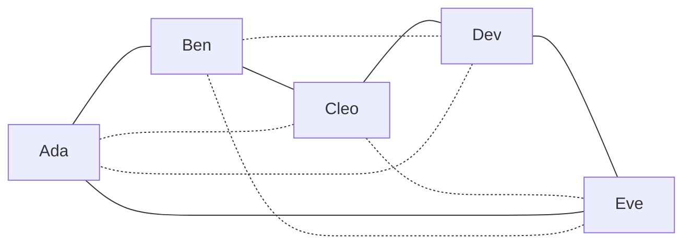
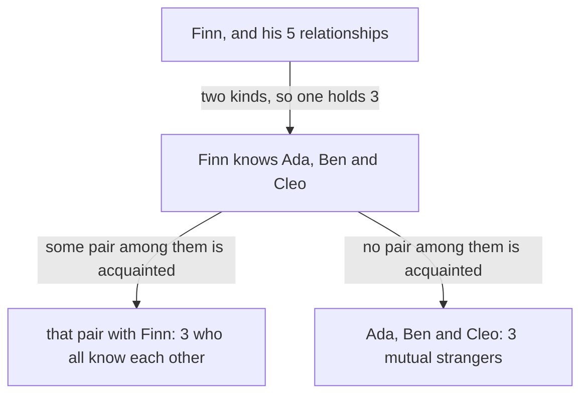

# Friends and strangers: among any six people, three all know each other or three are all strangers, and five is not enough

[Syllabus](../../../SYLLABUS.md) → [Combinatorics and graphs](../../../SYLLABUS.md#w04) → [Ramsey and Extremal, in Outline](../../../SYLLABUS.md#w04-s14) → Friends and strangers

---

## General Overview

Six guests arrive at a dinner party: Ada, Ben, Cleo, Dev, Eve and Finn. Any two of them have either met before or are strangers. That makes fifteen pairs, each settled one way or the other.

One thing is then unavoidable. Three of the six all know one another, or three are mutual strangers. The code below tries all 32768 ways to label the fifteen pairs and finds such a trio in every one.

Five guests can escape. Seat five at a round table where each knows only the two beside them. Every trio then holds both kinds of pair. A sixth guest closes that escape for good.

This is the smallest case of Ramsey theory: a large enough system cannot avoid some order. Frank Ramsey proved the general version in 1930, inside a paper on formal logic.

**Six guests force a trio who all know one another or a trio who are all strangers; five guests, seated in a ring of acquaintance, force nothing.**

**What kind of fact this is:** a theorem, proved on this card in Why it works.

### The picture: the five guests who escape



Solid lines are the five acquainted pairs, the sides of the table. Dotted lines are the five stranger pairs, and they close a ring of their own: Ada-Cleo-Eve-Ben-Dev. A ring of five holds no triangle, so neither kind gives a trio.

---

## The formula

Notation first, in words. A party where every pair is decided is the complete graph K(n): n dots, one line for every pair ([Graphs](../09-Graphs%20-%20Dots%20and%20Lines/01-graphs-vertices-and-edges.md)), each line labelled **acquainted** or **strangers**. Three guests whose three lines carry the same label are a trio **all alike** (graph theory says monochromatic triangle: a triangle of one colour). $R(3,3)$ is the fewest guests that force such a trio however the labels fall; the two 3s give the trio's size for each kind ([Ramsey numbers](02-ramsey-numbers.md) takes the notation further).

$$R(3,3) = 6$$

**Read it aloud:** six guests always hold three who all know each other or three who are all strangers, and five guests do not.

One equals sign, two claims. That six is enough rests on counting one guest's relationships:

$$\left\lceil \frac{6 - 1}{2} \right\rceil = 3$$

**Read it aloud:** one guest's five relationships come in two kinds, so one kind holds at least three of them.

That five is not enough needs one arrangement that escapes: the ring above. The search behind both claims covers 32768 labellings of C(6, 2) = 15 pairs, each with C(6, 3) = 20 trios.

| Symbol | Plain meaning | In our example | Push it up and the answer… |
| --- | --- | --- | --- |
| $R(3,3)$ | the fewest guests that force a trio all alike | 6 | — |
| $n$ | how many guests | 6 at dinner, 5 at the round table | past 6, still forced |
| $K(n)$ | n dots, every pair joined by a line | K(6), 15 lines | more lines to label |
| $C(n, 2)$ | n choose 2: pairs among n guests | 15 | more labellings |
| $C(n, 3)$ | n choose 3: trios to inspect | 20 | more trios |
| $\lceil x \rceil$ | round x up to a whole number | 2.5 rounds up to 3 | — |

### When it holds

- **Every pair decided, one label each.** Leave one pair undecided (Eve and Finn cannot agree whether they have met) and the guarantee goes: 12 of the 16384 labellings of the other 14 pairs hold no trio.
- **Two labels, not three.** A third label ("met once, cannot place the face") gives the guests more room, and six no longer force a trio. How many do is the general question of [Ramsey numbers](02-ramsey-numbers.md).
- **Either kind of trio counts.** Three mutual friends are not promised: two teams of three, acquainted across and strangers within, hold 0 trios of friends and 2 of strangers.
- **Three, not four.** Forcing four alike takes far more guests; the next card starts there.

---

## Why it works

### Step 0: the proof never reads the guest list

Fifteen pairs are too many to picture, and the theorem must cover all 32768 labellings. So the proof looks at one guest instead of the party.

Fix on Finn. Finn has five relationships, one with each other guest, each of two kinds. Two kinds of two account for only four, so one kind holds at least three ([Pigeonhole, extended](../04-Inclusion-Exclusion%20and%20Pigeonhole/05-pigeonhole-extended.md)). That single count drives the whole argument.

### Step 1: three guests who stand the same way to Finn

Say the fuller kind is acquainted, and name three guests Finn knows: Ada, Ben and Cleo. (If it is strangers, swap the two words throughout.) Three pairs among them remain to check: Ada-Ben, Ada-Cleo, Ben-Cleo.

### The picture: where the two cases come from



The two arrows are exhaustive: some pair is acquainted, or none is.

### Step 2: those three pairs settle it, whichever way they fall

- **Some pair among the three is acquainted.** Say Ada and Ben. Finn knows both, and they know each other: a trio all alike.
- **No pair among the three is acquainted.** Then Ada, Ben and Cleo are mutual strangers: a trio all alike again.

Nothing else can happen, so six guests always hold a trio: $R(3,3) \le 6$ (at most 6).

<details>
<summary>Detailed proof: the strangers case, and why extra guests cannot help</summary>

Fix any guest v. Split the other five into A, those v knows, and S, those v does not; one holds at least three. If A does, Step 2 applies as written. If S holds a, b and c, swap the words: any stranger pair among them makes three mutual strangers with v; otherwise all three pairs are acquainted, and a, b, c all know one another.

A party of seven or more contains six guests whose labels are already fixed, so the forced trio is still there. That is why $R(3,3) = 6$ settles every party of 6 or more at once.

</details>

### Step 3: five guests escape, and the ring shows how

At the round table of Ada, Ben, Cleo, Dev and Eve, the acquainted pairs are the five sides. The stranger pairs are the five diagonals, and they close a ring of five too: Ada-Cleo-Eve-Ben-Dev and back to Ada.

A trio all alike would be three lines of one kind closing a triangle. In a ring of five, the only way back to the start uses all five lines, so neither ring holds a triangle. Trio by trio: each of the 10 trios mixes sides and diagonals, and 0 are all alike.

So five guests force nothing: $R(3,3) > 5$. With Step 2, $R(3,3) = 6$.

The ring is the only escape. Of all 1024 labellings of five guests, 12 hold no trio. There are also exactly 12 ways to seat five guests in a ring: 120 orders, each ring counted 10 times (5 starting seats, 2 directions). The code confirms that each of the 12 escapes is one of these rings.

A second route counts instead of tracing cases. A. W. Goodman showed in 1959 that six guests hold at least two trios all alike; the search agrees, with the fewest 2, as in the two-teams labelling. Counting arguments carry Ramsey theory past the small cases ([Erdos's counting trick](03-probabilistic-method-by-counting.md)).

---

## Worked numbers, by hand

| Step | Arithmetic | Value |
| --- | --- | --- |
| pairs among six guests | 6 × 5 / 2, which is C(6, 2) | 15 |
| ways to label them | 2 multiplied in 15 times | 32768 |
| trios to inspect in each | C(6, 3) | 20 |
| Finn's relationships | 6 − 1 | 5 |
| the fuller kind | 5 shared over 2 kinds, rounded up | **3** |
| pairs inside that three | C(3, 2) | 3 |
| labellings of six with no trio | all 32768 searched | **0** |
| fewest trios all alike in one labelling | all 32768 searched | **2** |
| the five-guest ring | its 10 trios, counted | **0** all alike |
| labellings of five with no trio | all 1024 searched | **12** |
| the same 12 | 120 seatings / (5 starts × 2 directions) | **12** |

Six guests cannot avoid a trio all alike; five can, in 12 ways, each a ring.

### What breaks if you drop a piece

| Mistake | Comes out at | What went wrong |
| --- | --- | --- |
| Rounding 5 over 2 kinds down | 2 alike, not 3 | Two guests leave one pair, which cannot cover both cases |
| Taking five guests as enough | 12 of the 1024 labellings dodge a trio | At five guests each has only four relationships, which can split two and two |
| Insisting on three friends | 0 trios of friends | Two teams of three give only the 2 trios of strangers |

The code prints all three.

---

## Code, from first principles, and it actually runs

Nothing is imported. Each of the 32768 labellings of six guests is reached by two roads: a scan of all 20 trios for one all alike, and the card's proof, which reads one guest's five relationships and tests the three pairs inside the fuller kind. The proof's trio must be one the scan also holds. The five-guest count is doubled the same way: a search of all 1024 labellings against a count of ring seatings.

### Python

```python
# Friends and strangers -- the check behind the card.  Nothing is imported.  Six guests, every
# pair labelled acquainted (1) or strangers (0): all 32768 labellings are searched for a trio all
# alike, and the card's pigeonhole route must find one in each.  Then five guests in a ring.
NAMES = ["Ada", "Ben", "Cleo", "Dev", "Eve", "Finn"]
RING = [(0, 1), (1, 2), (2, 3), (3, 4), (0, 4)]        # five guests, each knows two

def pairs(n): return [(i, j) for i in range(n) for j in range(i + 1, n)]
def triples(n): return [(i, j, k) for (i, j) in pairs(n) for k in range(j + 1, n)]
def lab(col, idx, i, j): return (col >> idx[(min(i, j), max(i, j))]) & 1
def names(ps): return ", ".join(f"{NAMES[i]}-{NAMES[j]}" for (i, j) in ps)
def orders(xs): return [[x] + p for i, x in enumerate(xs) for p in orders(xs[:i] + xs[i + 1:])] or [[]]
def mono(col, idx, tris):                    # road one: scan every trio for one all alike
    return [t for t in tris if lab(col, idx, t[0], t[1])
            == lab(col, idx, t[0], t[2]) == lab(col, idx, t[1], t[2])]
def by_proof(col, idx, n):                   # road two: the card's pigeonhole route
    kinds = {w: [u for u in range(1, n) if lab(col, idx, 0, u) == w] for w in (0, 1)}
    if len(kinds[0]) < 3 and len(kinds[1]) < 3: return None
    a, b, c = kinds[w := 1 if len(kinds[1]) >= 3 else 0][:3]   # one kind holds three
    for (x, y) in ((a, b), (a, c), (b, c)):
        if lab(col, idx, x, y) == w: return tuple(sorted((0, x, y)))
    return (a, b, c)
def rings(n):                                # road two to the 12: every guest ring, as lines
    return {frozenset(frozenset((p[i], p[(i + 1) % n])) for i in range(n)) for p in orders(list(range(n)))}

P6, T6, P5, T5 = pairs(6), triples(6), pairs(5), triples(5)
I6, I5 = {p: t for t, p in enumerate(P6)}, {p: t for t, p in enumerate(P5)}
TX = [t for t in T6 if not (4 in t and 5 in t)]        # trios avoiding one dropped pair
counts, proved, agreed, dropped = [], 0, 0, 0
for col in range(1 << len(P6)):
    ms, w = mono(col, I6, T6), by_proof(col, I6, 6)
    counts.append(len(ms)); proved += w is not None; agreed += w in ms
    if not lab(col, I6, 4, 5) and not mono(col, I6, TX): dropped += 1
ring, free5 = sum(1 << I5[p] for p in RING), [c for c in range(1 << len(P5)) if not mono(c, I5, T5)]
blind = sum(by_proof(c, I5, 5) is None for c in free5)
teams = sum(1 << I6[(i, j)] for (i, j) in P6 if (i < 3) != (j < 3))
tmono = mono(teams, I6, T6)
friends = len([t for t in tmono if lab(teams, I6, t[0], t[1]) == 1])
hold, forced, R5 = sum(1 for c in counts if c), -(-5 // 2), rings(5)
esc, rings5, all6, all5 = sum(frozenset(frozenset(p) for p in P5 if lab(c, I5, *p)) in R5 for c in free5), len(R5), 1 << len(P6), 1 << len(P5)

print(f"six guests {', '.join(NAMES)}: pairs C(6,2) = {len(P6)}, labellings 2^{len(P6)} = {all6}, trios C(6,3) = {len(T6)}\n"
      f"one guest faces {len(NAMES) - 1} others; 5 relationships into 2 kinds, rounded up: {forced} alike; pairs among those three: {len(pairs(3))}")
print(f"all {all6} labellings searched: {hold} hold a trio all alike, {all6 - hold} do not\n"
      f"trios all alike in one labelling: fewest {min(counts)}, most {max(counts)}")
print(f"the pigeonhole route finds a trio in {proved} of {all6} labellings, and the search holds it every time: {agreed}")
print(f"five guests {', '.join(NAMES[:5])} in a ring, each knowing only the two beside them\n"
      f"acquainted: {names(RING)}\nstrangers: {names([p for p in P5 if p not in RING])}")
print(f"the {len(T5)} trios of five guests: {len(mono(ring, I5, T5))} all alike -- every trio mixes the two kinds\n"
      f"all {all5} labellings of five guests: {len(free5)} hold no trio at all\n"
      f"the same {len(free5)}, by counting five-guest rings: {len(orders(list(range(5))))} orders / (5 starts x 2 directions) = {rings5}; escapes that are rings: {esc}")
print(f"the route on five guests: among those {len(free5)}, no kind holds three, so it reports nothing {blind} times")
print(f"mistake 1, 5 into 2 kinds rounded down: {5 // 2}, not {forced}\n"
      f"mistake 2, five guests taken as enough: {len(free5)} of the {all5} labellings dodge a trio\n"
      f"mistake 3, two teams of three, every cross pair acquainted: {friends} trios of friends, {len(tmono) - friends} of strangers")
print(f"one pair left undecided: {dropped} of the {1 << (len(P6) - 1)} labellings of the other {len(P6) - 1} pairs hold no trio")
assert hold == all6 and min(counts) == 2 and max(counts) == len(T6)
assert proved == agreed == all6
assert len(free5) == rings5 == esc == 12 and blind == len(free5) and not mono(ring, I5, T5)
assert friends == 0 and len(tmono) == 2 and dropped == 12
print("ALL CHECKS PASS")
```

**Ran 2026-09-23 on macOS, Python 3.14.6, standard library only. All checks passed. Output, pasted from the run:**

```
six guests Ada, Ben, Cleo, Dev, Eve, Finn: pairs C(6,2) = 15, labellings 2^15 = 32768, trios C(6,3) = 20
one guest faces 5 others; 5 relationships into 2 kinds, rounded up: 3 alike; pairs among those three: 3
all 32768 labellings searched: 32768 hold a trio all alike, 0 do not
trios all alike in one labelling: fewest 2, most 20
the pigeonhole route finds a trio in 32768 of 32768 labellings, and the search holds it every time: 32768
five guests Ada, Ben, Cleo, Dev, Eve in a ring, each knowing only the two beside them
acquainted: Ada-Ben, Ben-Cleo, Cleo-Dev, Dev-Eve, Ada-Eve
strangers: Ada-Cleo, Ada-Dev, Ben-Dev, Ben-Eve, Cleo-Eve
the 10 trios of five guests: 0 all alike -- every trio mixes the two kinds
all 1024 labellings of five guests: 12 hold no trio at all
the same 12, by counting five-guest rings: 120 orders / (5 starts x 2 directions) = 12; escapes that are rings: 12
the route on five guests: among those 12, no kind holds three, so it reports nothing 12 times
mistake 1, 5 into 2 kinds rounded down: 2, not 3
mistake 2, five guests taken as enough: 12 of the 1024 labellings dodge a trio
mistake 3, two teams of three, every cross pair acquainted: 0 trios of friends, 2 of strangers
one pair left undecided: 12 of the 16384 labellings of the other 14 pairs hold no trio
ALL CHECKS PASS
```

### Rust

Same numbers, same labels, built with `rustc --edition 2021 -O`.

```rust
// Friends and strangers -- the same check as the Python, in Rust.  No crates.  Six guests, every
// pair labelled acquainted (1) or strangers (0): all 32768 labellings are searched for a trio all
// alike, and the card's pigeonhole route must find one in each.  Then five guests in a ring.
const NAMES: [&str; 6] = ["Ada", "Ben", "Cleo", "Dev", "Eve", "Finn"];
const RING: [(usize, usize); 5] = [(0, 1), (1, 2), (2, 3), (3, 4), (0, 4)];  // each knows two

fn pairs(n: usize) -> Vec<(usize, usize)> { (0..n).flat_map(|i| (i + 1..n).map(move |j| (i, j))).collect() }
fn triples(n: usize) -> Vec<(usize, usize, usize)> { pairs(n).into_iter().flat_map(|(i, j)| (j + 1..n).map(move |k| (i, j, k))).collect() }
fn lab(col: u32, t: &[Vec<usize>], i: usize, j: usize) -> u32 { (col >> t[i][j]) & 1 }
fn names(ps: &[(usize, usize)]) -> String { ps.iter().map(|&(i, j)| format!("{}-{}", NAMES[i], NAMES[j])).collect::<Vec<String>>().join(", ") }
fn table(n: usize) -> Vec<Vec<usize>> {          // where each pair's label sits among the bits
    let mut t = vec![vec![0usize; n]; n];
    for (b, &(i, j)) in pairs(n).iter().enumerate() { t[i][j] = b; t[j][i] = b }
    t
}
fn orders(xs: &[usize]) -> Vec<Vec<usize>> {     // every arrangement of a list, written out here
    if xs.is_empty() { return vec![vec![]] }
    (0..xs.len()).flat_map(|i| {
        let mut rest = xs.to_vec(); let x = rest.remove(i);
        orders(&rest).into_iter().map(move |mut p| { p.insert(0, x); p }).collect::<Vec<Vec<usize>>>()
    }).collect()
}
fn mono(col: u32, t: &[Vec<usize>], tris: &[(usize, usize, usize)]) -> Vec<(usize, usize, usize)> {
    tris.iter().cloned().filter(|&(i, j, k)| lab(col, t, i, j) == lab(col, t, i, k) && lab(col, t, i, k) == lab(col, t, j, k)).collect()   // road one: every trio
}
fn by_proof(col: u32, t: &[Vec<usize>], n: usize) -> Option<(usize, usize, usize)> {
    let kinds: Vec<Vec<usize>> = (0u32..2)       // road two: the card's pigeonhole route
        .map(|w| (1..n).filter(|&u| lab(col, t, 0, u) == w).collect()).collect();
    if kinds[0].len() < 3 && kinds[1].len() < 3 { return None }
    let w = if kinds[1].len() >= 3 { 1usize } else { 0usize };   // one kind holds three of the five
    let (a, b, c) = (kinds[w][0], kinds[w][1], kinds[w][2]);
    for &(x, y) in [(a, b), (a, c), (b, c)].iter() {
        if lab(col, t, x, y) == w as u32 { let mut v = vec![0, x, y]; v.sort(); return Some((v[0], v[1], v[2])) }
    }
    Some((a, b, c))
}
fn rings(n: usize) -> Vec<Vec<(usize, usize)>> {                    // road two to the 12: every guest ring, as lines
    let mut all: Vec<Vec<(usize, usize)>> = orders(&(0..n).collect::<Vec<usize>>()).iter().map(|p| {
        let mut e: Vec<(usize, usize)> = (0..n).map(|i| (p[i].min(p[(i + 1) % n]), p[i].max(p[(i + 1) % n]))).collect();
        e.sort(); e
    }).collect();
    all.sort(); all.dedup(); all
}

fn main() {
    let (p6, t6, p5, t5) = (pairs(6), triples(6), pairs(5), triples(5));
    let (i6, i5) = (table(6), table(5));
    let tx: Vec<(usize, usize, usize)> = t6.iter().cloned().filter(|&(i, j, k)| !([i, j, k].contains(&4) && [i, j, k].contains(&5))).collect();   // trios avoiding one dropped pair
    let (all6, all5) = (1u32 << p6.len(), 1u32 << p5.len());
    let (mut counts, mut proved, mut agreed, mut dropped) = (Vec::new(), 0usize, 0usize, 0usize);
    for col in 0..all6 {
        let (ms, w) = (mono(col, &i6, &t6), by_proof(col, &i6, 6));
        counts.push(ms.len()); if w.is_some() { proved += 1 }
        if let Some(tr) = w { if ms.contains(&tr) { agreed += 1 } }
        if lab(col, &i6, 4, 5) == 0 && mono(col, &i6, &tx).is_empty() { dropped += 1 }
    }
    let ring: u32 = RING.iter().map(|&(i, j)| 1u32 << i5[i][j]).sum();
    let free5: Vec<u32> = (0..all5).filter(|&c| mono(c, &i5, &t5).is_empty()).collect();
    let blind = free5.iter().filter(|&&c| by_proof(c, &i5, 5).is_none()).count();
    let teams: u32 = p6.iter().filter(|&&(i, j)| (i < 3) != (j < 3)).map(|&(i, j)| 1u32 << i6[i][j]).sum();
    let tmono = mono(teams, &i6, &t6);
    let friends = tmono.iter().filter(|&&(i, j, _)| lab(teams, &i6, i, j) == 1).count();
    let (hold, forced, fewest, most) = (counts.iter().filter(|&&c| c > 0).count(), (5 + 2 - 1) / 2, *counts.iter().min().unwrap(), *counts.iter().max().unwrap());
    let strangers: Vec<(usize, usize)> = p5.iter().cloned().filter(|p| !RING.contains(p)).collect();
    let (orders5, r5) = (orders(&(0..5).collect::<Vec<usize>>()).len(), rings(5));
    let (rings5, esc) = (r5.len(), free5.iter().filter(|&&c| r5.contains(&p5.iter().cloned().filter(|&(i, j)| lab(c, &i5, i, j) == 1).collect::<Vec<(usize, usize)>>())).count());
    println!("six guests {}: pairs C(6,2) = {}, labellings 2^{} = {}, trios C(6,3) = {}\none guest faces {} others; 5 relationships into 2 kinds, rounded up: {} alike; pairs among those three: {}", NAMES.join(", "), p6.len(), p6.len(), all6, t6.len(), NAMES.len() - 1, forced, pairs(3).len());
    println!("all {} labellings searched: {} hold a trio all alike, {} do not\ntrios all alike in one labelling: fewest {}, most {}", all6, hold, all6 as usize - hold, fewest, most);
    println!("the pigeonhole route finds a trio in {} of {} labellings, and the search holds it every time: {}", proved, all6, agreed);
    println!("five guests {} in a ring, each knowing only the two beside them\nacquainted: {}\nstrangers: {}", NAMES[..5].join(", "), names(&RING), names(&strangers));
    println!("the {} trios of five guests: {} all alike -- every trio mixes the two kinds\nall {} labellings of five guests: {} hold no trio at all\nthe same {}, by counting five-guest rings: {} orders / (5 starts x 2 directions) = {}; escapes that are rings: {}", t5.len(), mono(ring, &i5, &t5).len(), all5, free5.len(), free5.len(), orders5, rings5, esc);
    println!("the route on five guests: among those {}, no kind holds three, so it reports nothing {} times", free5.len(), blind);
    println!("mistake 1, 5 into 2 kinds rounded down: {}, not {}\nmistake 2, five guests taken as enough: {} of the {} labellings dodge a trio\nmistake 3, two teams of three, every cross pair acquainted: {} trios of friends, {} of strangers", 5 / 2, forced, free5.len(), all5, friends, tmono.len() - friends);
    println!("one pair left undecided: {} of the {} labellings of the other {} pairs hold no trio", dropped, 1u32 << (p6.len() - 1), p6.len() - 1);
    assert!(hold == all6 as usize && fewest == 2 && most == t6.len());
    assert!(proved == agreed && agreed == all6 as usize);
    assert!(free5.len() == rings5 && rings5 == esc && esc == 12 && blind == free5.len() && mono(ring, &i5, &t5).is_empty());
    assert!(friends == 0 && tmono.len() == 2 && dropped == 12);
    println!("ALL CHECKS PASS");
}
```

**Ran 2026-09-23 on macOS, rustc 1.98.1, no crates. All checks passed. Output, pasted from the run:**

```
six guests Ada, Ben, Cleo, Dev, Eve, Finn: pairs C(6,2) = 15, labellings 2^15 = 32768, trios C(6,3) = 20
one guest faces 5 others; 5 relationships into 2 kinds, rounded up: 3 alike; pairs among those three: 3
all 32768 labellings searched: 32768 hold a trio all alike, 0 do not
trios all alike in one labelling: fewest 2, most 20
the pigeonhole route finds a trio in 32768 of 32768 labellings, and the search holds it every time: 32768
five guests Ada, Ben, Cleo, Dev, Eve in a ring, each knowing only the two beside them
acquainted: Ada-Ben, Ben-Cleo, Cleo-Dev, Dev-Eve, Ada-Eve
strangers: Ada-Cleo, Ada-Dev, Ben-Dev, Ben-Eve, Cleo-Eve
the 10 trios of five guests: 0 all alike -- every trio mixes the two kinds
all 1024 labellings of five guests: 12 hold no trio at all
the same 12, by counting five-guest rings: 120 orders / (5 starts x 2 directions) = 12; escapes that are rings: 12
the route on five guests: among those 12, no kind holds three, so it reports nothing 12 times
mistake 1, 5 into 2 kinds rounded down: 2, not 3
mistake 2, five guests taken as enough: 12 of the 1024 labellings dodge a trio
mistake 3, two teams of three, every cross pair acquainted: 0 trios of friends, 2 of strangers
one pair left undecided: 12 of the 16384 labellings of the other 14 pairs hold no trio
ALL CHECKS PASS
```

The two outputs match line for line.

> [!TIP]
> **Try changing**
> Guess first, then run it.
> - **Break the ring.** In `RING`, swap `(0, 4)` for `(0, 2)`. Ada, Ben and Cleo now all know one another, and the third assert stops it.
> - **Let the proof skip a pair.** In `by_proof`, drop `(b, c)` from the pairs tested. The route sometimes returns a trio the scan does not hold, and the second assert stops it.
> - **Follow the other kind first.** Make the route prefer strangers whenever they hold three. It finds different trios, but every line and assert is unchanged: the kind followed does not matter.
> - **Teams of two and four.** Change `(i < 3) != (j < 3)` to `(i < 2) != (j < 2)`. The team of four holds 4 stranger trios, not 2, and the fourth assert stops it.

---

## The usual mistake

> [!warning]
> **Reading the theorem as being about friends.** It promises a trio all alike, and the party chooses the kind. The two-teams party holds 0 trios of friends and 2 of strangers. An argument that needs the friendly kind is wrong.
>
> - **Stopping at Finn's three.** Finn knowing Ada, Ben and Cleo is not yet a trio all alike. The three pairs among them still decide it, and a route that skips one returns a wrong trio (the second experiment above).
> - **Expecting exactly one trio.** Six guests force at least 2; a party where everyone knows everyone holds all 20.

---

## Where you meet it in real life

- **Any relation with two labels.** Six chemicals, each pair reacting or not. Six papers, each pair sharing an author or not. The proof never mentions people, so each forces a trio all alike.
- **Guarantees that survive adversaries.** A network designer who wants six machines with no three mutually fast links and no three mutually slow ones cannot have it: the search over all 32768 labellings says no design exists.
- **Reading too much into a small pattern.** Three mutual acquaintances among six people are not evidence of anything: they were forced before anyone looked. The same holds for small patterns in large data sets.
- **Where the small cases end.** Bigger trios need far more guests: [Ramsey numbers](02-ramsey-numbers.md). Related forcings: two labels on a sequence give [Erdos-Szekeres](04-erdos-szekeres.md), and counting lines gives [Mantel and Turan](05-mantel-and-turan.md).

> **Say it back**
> Label every pair of six people acquainted or strangers. Fix one guest: five relationships in two kinds, so one kind holds at least three. If a pair among those three is of the same kind, that pair and the fixed guest are a trio all alike; if none is, the three are a trio of the other kind. Five guests escape: seat them in a ring where each knows only the two beside them, and both kinds of pair form rings of five, which hold no triangle.

---

## What this builds on

- [Pigeonhole, extended](../04-Inclusion-Exclusion%20and%20Pigeonhole/05-pigeonhole-extended.md): five relationships over two kinds force a kind holding three, the count Step 0 runs on.
- [Graphs](../09-Graphs%20-%20Dots%20and%20Lines/01-graphs-vertices-and-edges.md): dots and lines, the complete graph K(6) with its 15 lines, and the ring of five.
- [Pigeonhole](../../01-Foundations/08-Relations%20and%20Functions/08-pigeonhole-principle.md): the plain form of the count, and the habit of choosing what the boxes are.

## Where this goes next

- [Ramsey numbers](02-ramsey-numbers.md): the same question for trios of any two sizes, what is known about those numbers, and why so little is.

Exhaustive search does not survive a bigger party: the labellings number 2 multiplied in C(n, 2) times. The next card needs arguments that never list them.

---

## Sources

Verified 23 Sep 2026: every link below resolves to the publisher's page.

- Ramsey, F. P. "On a Problem of Formal Logic." *Proceedings of the London Mathematical Society* s2-30 (1930): 264–286. [doi:10.1112/plms/s2-30.1.264](https://doi.org/10.1112/plms/s2-30.1.264). The founding paper; this card is the smallest case of its Theorem B.
- Goodman, A. W. "On Sets of Acquaintances and Strangers at any Party." *The American Mathematical Monthly* 66, no. 9 (1959): 778–783. [doi:10.1080/00029890.1959.11989408](https://doi.org/10.1080/00029890.1959.11989408). Counts the trios all alike: the source of the fewest-2 figure.
- Radziszowski, Stanisław. "Small Ramsey Numbers." *Electronic Journal of Combinatorics*, Dynamic Survey DS1. [Survey page](https://www.combinatorics.org/ojs/index.php/eljc/article/view/DS1). The table of known values, opening with this card's 6.
- Diestel, Reinhard. "Ramsey Theory for Graphs," chapter 9 of *Graph Theory*, 5th ed. Springer, 2017. [Chapter page](https://link.springer.com/chapter/10.1007/978-3-662-53622-3_9). The textbook treatment in graph language.
