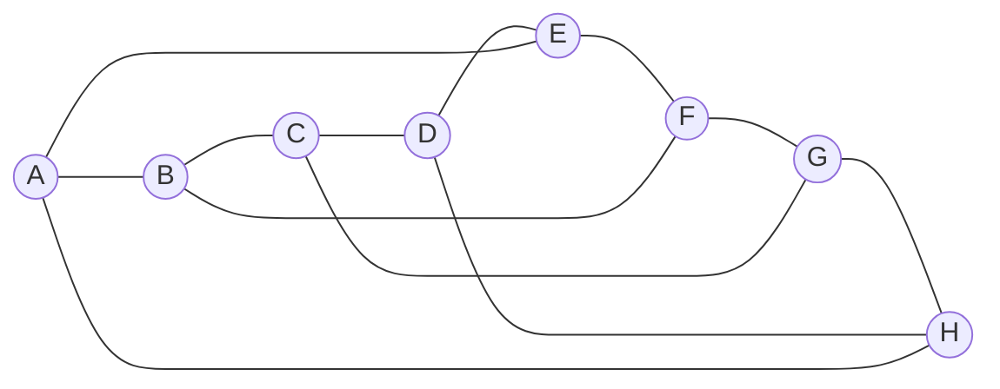
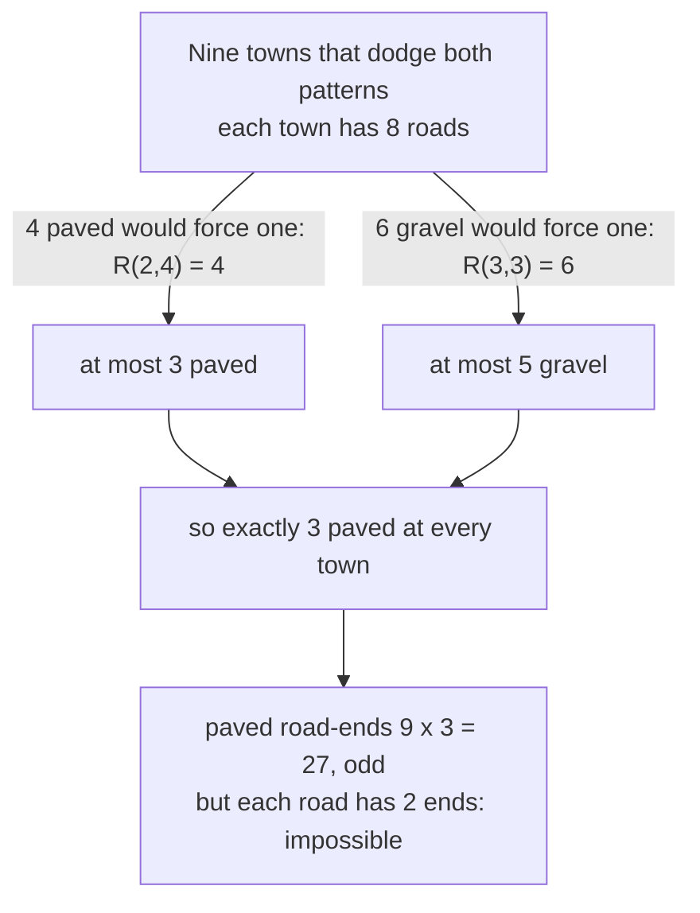

# Ramsey numbers: the size at which a pattern is forced, known exactly for only a handful of cases

[Syllabus](../../../SYLLABUS.md) → [Combinatorics and graphs](../../../SYLLABUS.md#w04) → [Ramsey and Extremal, in Outline](../../../SYLLABUS.md#w04-s14) → Ramsey numbers

---

## General Overview

Nine towns, A to I, sit in one county. Every pair of towns is joined by one direct road: 36 roads. Each road is either paved or gravel, and the county has 68719476736 ways to decide which.

Whatever the county decides, three towns are joined to each other entirely by paved roads, or four entirely by gravel: a **paved trio** or a **gravel foursome**. Eight towns can escape both, or **dodge**; the picture below shows how.

So nine is the threshold for "a paved trio or a gravel foursome". Such thresholds are **Ramsey numbers**, after Frank Ramsey, who proved in 1930 that one always exists. The six-guest party of [Friends and strangers](01-friends-and-strangers.md) is the smallest case.

**Each threshold is at most the sum of the two just below it, so every threshold exists; pinning one down exactly also needs an example that dodges, and only a handful are known.**

**What kind of fact this is:** a theorem, proved on this card in Why it works; the larger values in the table rest on published proofs and computer searches, and the code rechecks R(3,4) and the floors for R(3,5) and R(4,4).

### The picture: eight towns that dodge both patterns



Lines are the 12 paved roads: a ring of eight, plus a road from each town straight across to its opposite. Every road not drawn is gravel, and every town has 3 paved roads. Of the 56 trios and 70 foursomes, the code finds 0 paved trios and 0 gravel foursomes.

---

## The formula

Notation first, in words. $R(s,t)$, read "R of s and t", is the fewest towns that force either $s$ towns all joined by paved roads or $t$ towns all joined by gravel, however the roads are surfaced. $C(n, k)$ is "n choose k", the number of ways to pick k things from n ([Pascal's rule](../03-Binomial%20Coefficients%20and%20Identities/01-pascals-rule-and-the-triangle.md)).

$$R(s,t) \le R(s-1,\,t) + R(s,\,t-1)$$

**Read it aloud:** the threshold is at most the threshold with one fewer paved town plus the one with one fewer gravel town.

Unrolled to the bottom, it becomes one count:

$$R(s,t) \le C(s+t-2,\ s-1)$$

**Read it aloud:** the threshold is at most the number of ways to choose s − 1 things from s + t − 2.

For the county: $R(3,4) \le R(2,4) + R(3,3) = 4 + 6 = 10$, and $C(5, 2) = 10$ too. A parity step cuts 10 to 9.

| Symbol | Plain meaning | In our example | Push it up and the answer… |
| --- | --- | --- | --- |
| $R(s,t)$ | fewest towns forcing s all-paved or t all-gravel | $R(3,4) = 9$ | — |
| $s$ | size of the all-paved group demanded | 3, a paved trio | rises |
| $t$ | size of the all-gravel group demanded | 4, a gravel foursome | rises |
| $n$ | number of towns in the county | 8 dodge, 9 cannot | from R(s,t) on, the pattern is certain |
| $C(n, k)$ | n choose k: ways to pick k from n | C(9, 2) = 36 roads | — |
| $p$ | paved roads at one town | exactly 3, if nine towns were to dodge | — |

### When it holds

- **Every road surfaced, one of two ways.** An undecided road serves neither pattern, and the count no longer applies.
- **The recursion is a ceiling, not a value.** It is exact for $R(3,5)$ and $R(4,4)$, but gives 32 for $R(4,5)$, whose true value is 25.
- **The parity step needs both feeders even.** 4 and 6 are, so 10 drops to 9. For $R(4,4)$ the feeders are 9 and 9: no drop.
- **More than two surfaces.** The same split still works, with bigger ceilings.

---

## Why it works

### Step 0: stand at one town and split its roads

Pick one town and sort its roads by surface. The two piles add up to all its roads, so one pile is large, and a large pile hands the problem down to a smaller threshold.

### Step 1: the ceiling R(3,4) ≤ 10

Take ten towns. Town A has 9 roads. Suppose 4 are paved. $R(2,4) = 4$ says those four towns hold a paved road or are a gravel foursome. A paved road between two of them, with their paved roads to A, makes a paved trio.

Otherwise at most 3 are paved, so 6 are gravel. $R(3,3) = 6$ says those six hold a paved trio or a gravel trio, and a gravel trio plus A is a gravel foursome.

### Step 2: the parity step cuts 10 to 9

Suppose nine towns dodge both patterns. Each town has 8 roads. By Step 1, 4 paved or 6 gravel at one town would force a pattern, so each town has at most 3 paved and at most 5 gravel. These add to 8, so every town has exactly $p = 3$ paved.

Count paved road-ends town by town: 9 × 3 = 27. Every road has 2 ends, so the count must be even. It is odd, so no such county exists: $R(3,4) \le 9$.



### Step 3: eight towns dodge, so R(3,4) = 9

The first picture's county dodges, so eight towns are not enough: $R(3,4) = 9$. The code's search, building every dodging county town by town, agrees: 17640 dodging surfacings of eight named towns, 0 of nine.

### Step 4: the general recursion and the binomial ceiling

Steps 1 and 2 used nothing special about 3 and 4, so the recursion holds for every $s$ and $t$.

<details>
<summary>Detailed proof: the recursion, the parity step, and the binomial ceiling</summary>

Let a = R(s−1, t) and b = R(s, t−1), and take a + b towns. A town v has a + b − 1 roads, so at least a are paved or at least b are gravel.

**At least a paved.** Those towns hold s − 1 all-paved, which v joins by paved roads to make s, or t all-gravel.

**At least b gravel.** Those towns hold s all-paved, or t − 1 all-gravel, which v joins by gravel to make t.

**Parity.** Let a and b be even, and suppose a + b − 1 towns dodge. Each town has a + b − 2 roads, at most a − 1 paved and at most b − 1 gravel, so exactly a − 1 paved: odd. An odd number of towns with odd paved counts gives an odd total of paved ends, but each road has two. So R(s, t) ≤ a + b − 1.

**Binomial ceiling.** R(2, t) = t = C(t, 1): t towns hold a paved road or are all gravel, and t − 1 all-gravel towns dodge. Pascal's rule C(s+t−3, s−2) + C(s+t−3, s−1) = C(s+t−2, s−1) then carries the ceiling up, by induction on s + t; the base R(s, 2) = s = C(s, s−1) works the same way.

</details>

The binomial ceiling is finite, so every Ramsey number exists. That is Ramsey's theorem in outline: however large the demanded pattern, some finite county forces it. Ramsey's 1930 version allows any number of surfaces, and labels groups of any fixed size rather than pairs; the proof is the same split, nested.

### Step 5: why the table stays so short

An exact value needs a ceiling and a dodging county one town short. For $R(4,4) = 18$ that county is 17 towns round a clock face, a road paved when the gap between its towns, counted round the clock, is 1, 2, 4, 8, 9, 13, 15 or 16, the remainders of perfect squares divided by 17; none of its 2380 foursomes is one surface. For $R(3,5) = 14$, a 13-town clock with paved gaps 1, 5, 8 and 12 does the same.

Past that, search fails. For $R(5,5)$ the recursion gives 50 and the binomial 70. Geoffrey Exoo found a dodging county one town short of 43 in 1989; Vigleik Angeltveit and Brendan McKay proved the ceiling 46 by computer, posted in 2024. The value lies from 43 to 46.

Floors can also come from counting bad surfacings, without building a county ([Erdos's counting trick](03-probabilistic-method-by-counting.md)).

---

## Worked numbers, by hand

| Step | Arithmetic | Value |
| --- | --- | --- |
| roads among nine towns | C(9, 2) | 36 |
| ceiling from the recursion | R(2,4) + R(3,3) = 4 + 6 | 10 |
| at one of nine towns | 4 − 1 paved, 6 − 1 gravel | 3 and 5 |
| paved road-ends | 9 × 3 | 27, odd |
| ceiling after parity | 10 − 1 | 9 |
| the eight-town county | 56 trios and 70 foursomes checked | 0 bad |
| **R(3,4)** | ceiling meets floor | **9** |

| s, t | 3,3 | 3,4 | 3,5 | 4,4 | 4,5 | 5,5 |
| --- | --- | --- | --- | --- | --- | --- |
| known R(s,t) | 6 | 9 | 14 | 18 | 25 | 43 to 46 |
| binomial ceiling C(s+t−2, s−1) | 6 | 10 | 15 | 20 | 35 | 70 |
| recursion on known values | 6 | 10 | 14 | 18 | 32 | 50 |

The second table shows how fast exact knowledge runs out.

### What breaks if you drop a piece

| Mistake | Comes out at | What went wrong |
| --- | --- | --- |
| Skipping the parity step | R(3,4) ≤ 10 | True, but leaves 9 or 10 open |
| Binomial ceiling read as the value | R(5,5) = 70 | The truth is 43 to 46 |
| Looking only for paved trios | 0 in an all-gravel county of 9 | The county picks the pattern |

---

## Code, from first principles, and it actually runs

Nothing is imported. Road one is the proof: feeders, recursion, parity. Road two is a search that adds one town at a time, keeping every county that still dodges. On six towns the search is checked against brute force over all 32768 surfacings. Ceilings come from factorials and from the recursion.

### Python

```python
# Ramsey numbers -- the check behind the card.  Nothing is imported.  Towns, every pair joined by one
# road, paved or gravel.  A county is a list of bitmasks: bit j of paved[i] is set when road i-j is paved.
# R(3,4) = 9 is reached twice: by the recursion with its parity step, and by searching every county.
T, PAIRS = "ABCDEFGHI", [(3, 3), (3, 4), (3, 5), (4, 4), (4, 5), (5, 5)]
def cliques(adj, m, k, lo=0):                # k-sets inside the set m with every road among them in adj
    return 1 if k == 0 else sum(cliques(adj, adj[v] & m, k - 1, v + 1) for v in range(lo, len(adj)) if m >> v & 1)
def other(adj): return [((1 << len(adj)) - 1) ^ a ^ (1 << i) for i, a in enumerate(adj)]
def dodges(adj, s, t): return not cliques(adj, (1 << len(adj)) - 1, s) and not cliques(other(adj), (1 << len(adj)) - 1, t)
def sweep(s, t, top):                        # road two: add one town at a time, keep every county that dodges
    level, counts = [[]], {}                 # S: the towns the new town reaches by paved road
    for n in range(1, top + 1):
        level = [[a | (S >> i & 1) << len(adj) for i, a in enumerate(adj)] + [S] for adj in level for S in range(1 << len(adj))
                 if not cliques(adj, S, s - 1) and not cliques(other(adj), ((1 << len(adj)) - 1) & ~S, t - 1)]
        counts[n] = len(level)
    return counts
def labelled(col, n=6):                      # six towns, road number b paved when bit b of col is set
    P = [(i, j) for i in range(n) for j in range(i + 1, n)]
    return [sum(1 << (x ^ y ^ i) for b, (x, y) in enumerate(P) if i in (x, y) and col >> b & 1) for i in range(n)]
def county(n, gaps): return [sum(1 << j for j in range(n) if (j - i) % n in gaps) for i in range(n)]
def fact(n): return 1 if n < 2 else n * fact(n - 1)
def binom(n, k): return fact(n) // (fact(k) * fact(n - k))    # n choose k from factorials
def rec(s, t): return t if s == 2 else s if t == 2 else rec(s - 1, t) + rec(s, t - 1)
def known(s, t): return {(2, t): t, (s, 2): s, (3, 3): 6, (3, 4): 9, (4, 3): 9, (3, 5): 14, (5, 3): 14,
                         (4, 4): 18, (4, 5): 25, (5, 4): 25}.get((s, t))
e33, e24, e34 = sweep(3, 3, 6), sweep(2, 4, 4), sweep(3, 4, 9)
r33, r24, r34 = (min(n for n in e if e[n] == 0) for e in (e33, e24, e34))   # first size with no escape
brute6 = sum(dodges(labelled(col), 3, 4) for col in range(1 << 15))   # road three: all 15 roads of six towns
paved = 8 - (r33 - 1); ends = 9 * paved     # at most R(3,3) - 1 gravel of 8; paved road-ends, town by town
ring, paley, c13 = county(8, {1, 4, 7}), county(17, {x * x % 17 for x in range(1, 17)}), county(13, {1, 5, 8, 12})
roads = [T[i] + "-" + T[j] for i in range(8) for j in range(i + 1, 8) if ring[i] >> j & 1]
chain = [known(s - 1, t) + known(s, t - 1) for s, t in PAIRS]
print(f"nine towns {T}: roads C(9,2) = {binom(9, 2)}, ways to surface them 2^36 = {2 ** 36}")
print(f"search, no paved trio or gravel trio: 5 towns {e33[5]}, 6 towns {e33[6]}, so R(3,3) = {r33}")
print(f"search, no paved road or gravel foursome: 3 towns {e24[3]}, 4 towns {e24[4]}, so R(2,4) = {r24}")
print(f"recursion: R(3,4) <= R(2,4) + R(3,3) = {r24} + {r33} = {r24 + r33}")
print(f"nine towns, 8 roads each: paved at most {r24 - 1}, gravel at most {r33 - 1}, so paved exactly {paved}")
print(f"paved road-ends 9 x {paved} = {ends}, odd, but every road has 2 ends: no such county, R(3,4) <= 9")
print("search, no paved trio or gravel foursome: " + ", ".join(f"{n} towns {e34[n]}" for n in range(6, 10)))
print(f"six towns by brute force over all {2 ** 15} labellings: {brute6} dodge")
print(f"the 8-town escape, paved: {', '.join(roads)}")
print(f"  paved trios {cliques(ring, 255, 3)} of {binom(8, 3)}, gravel foursomes {cliques(other(ring), 255, 4)} "
      f"of {binom(8, 4)}, paved roads per town {[bin(a).count('1') for a in ring]}, so R(3,4) = 9")
print("s,t            " + "".join(f"{s},{t}".rjust(8) for s, t in PAIRS))
print("known R(s,t)   " + "".join(str(known(s, t) or "43..46").rjust(8) for s, t in PAIRS))
print("C(s+t-2, s-1)  " + "".join(str(binom(s + t - 2, s - 1)).rjust(8) for s, t in PAIRS))
print("by recursion   " + "".join(str(rec(s, t)).rjust(8) for s, t in PAIRS))
print("chained known  " + "".join(str(c).rjust(8) for c in chain))
print(f"17 towns, paved when the gap is a square mod 17: one-colour foursomes {cliques(paley, (1 << 17) - 1, 4)}"
      f" + {cliques(other(paley), (1 << 17) - 1, 4)} of {binom(17, 4)}, so R(4,4) > 17")
print(f"13 towns, paved at gaps 1, 5, 8, 12: paved trios {cliques(c13, (1 << 13) - 1, 3)}, gravel five-sets "
      f"{cliques(other(c13), (1 << 13) - 1, 5)} of {binom(13, 5)}, so R(3,5) > 13")
print(f"mistake 1, parity step skipped: R(3,4) <= {r24 + r33}; mistake 2, ceiling read as the value: R(5,5) = "
      f"{binom(8, 4)}; mistake 3, only paved trios counted: an all-gravel county of 9 has {cliques([0] * 9, 511, 3)}")
assert e34[9] == 0 and ends % 2 == 1         # the search and the parity step agree: nine towns never dodge
assert brute6 == e34[6]                      # one-town-at-a-time search against labelling every road
assert all(binom(s + t - 2, s - 1) == rec(s, t) for s, t in PAIRS)
assert dodges(ring, 3, 4) and dodges(paley, 4, 4) and dodges(c13, 3, 5) and \
    (len(ring) + 1, len(c13) + 1, len(paley) + 1) == (r34, rec(2, 5) + r34, r34 + r34)   # floors meet ceilings
print("ALL CHECKS PASS")
```

**Ran 2026-09-19 on macOS, Python 3.14.6, standard library only. All checks passed. Output, pasted from the run:**

```
nine towns ABCDEFGHI: roads C(9,2) = 36, ways to surface them 2^36 = 68719476736
search, no paved trio or gravel trio: 5 towns 12, 6 towns 0, so R(3,3) = 6
search, no paved road or gravel foursome: 3 towns 1, 4 towns 0, so R(2,4) = 4
recursion: R(3,4) <= R(2,4) + R(3,3) = 4 + 6 = 10
nine towns, 8 roads each: paved at most 3, gravel at most 5, so paved exactly 3
paved road-ends 9 x 3 = 27, odd, but every road has 2 ends: no such county, R(3,4) <= 9
search, no paved trio or gravel foursome: 6 towns 2812, 7 towns 13842, 8 towns 17640, 9 towns 0
six towns by brute force over all 32768 labellings: 2812 dodge
the 8-town escape, paved: A-B, A-E, A-H, B-C, B-F, C-D, C-G, D-E, D-H, E-F, F-G, G-H
  paved trios 0 of 56, gravel foursomes 0 of 70, paved roads per town [3, 3, 3, 3, 3, 3, 3, 3], so R(3,4) = 9
s,t                 3,3     3,4     3,5     4,4     4,5     5,5
known R(s,t)          6       9      14      18      25  43..46
C(s+t-2, s-1)         6      10      15      20      35      70
by recursion          6      10      15      20      35      70
chained known         6      10      14      18      32      50
17 towns, paved when the gap is a square mod 17: one-colour foursomes 0 + 0 of 2380, so R(4,4) > 17
13 towns, paved at gaps 1, 5, 8, 12: paved trios 0, gravel five-sets 0 of 1287, so R(3,5) > 13
mistake 1, parity step skipped: R(3,4) <= 10; mistake 2, ceiling read as the value: R(5,5) = 70; mistake 3, only paved trios counted: an all-gravel county of 9 has 0
ALL CHECKS PASS
```

### Rust

Same numbers, same labels, built with `rustc --edition 2021 -O`.

```rust
// Ramsey numbers -- the same check as the Python, in Rust.  No crates.  Towns, every pair joined by one
// road, paved or gravel.  A county is a list of bitmasks: bit j of paved[i] is set when road i-j is paved.
// R(3,4) = 9 is reached twice: by the recursion with its parity step, and by searching every county.
const T: &str = "ABCDEFGHI";
const PAIRS: [(u64, u64); 6] = [(3, 3), (3, 4), (3, 5), (4, 4), (4, 5), (5, 5)];
fn cliques(adj: &[u32], m: u32, k: u32, lo: usize) -> u64 {  // k-sets inside m, every road among them in adj
    if k == 0 { return 1 }
    (lo..adj.len()).filter(|&v| m >> v & 1 == 1).map(|v| cliques(adj, adj[v] & m, k - 1, v + 1)).sum()
}
fn full(n: usize) -> u32 { ((1u64 << n) - 1) as u32 }
fn other(adj: &[u32]) -> Vec<u32> { adj.iter().enumerate().map(|(i, &a)| full(adj.len()) ^ a ^ (1 << i)).collect() }
fn dodges(adj: &[u32], s: u32, t: u32) -> bool { cliques(adj, full(adj.len()), s, 0) == 0 && cliques(&other(adj), full(adj.len()), t, 0) == 0 }
fn sweep(s: u32, t: u32, top: usize) -> Vec<usize> {  // road two: add one town at a time, keep every county that dodges
    let (mut level, mut counts): (Vec<Vec<u32>>, Vec<usize>) = (vec![vec![]], vec![0]);
    for _ in 1..=top {                          // sm: the towns the new town reaches by paved road
        level = level.iter().flat_map(|adj| (0..1u32 << adj.len())
            .filter(move |&sm| cliques(adj, sm, s - 1, 0) == 0 && cliques(&other(adj), full(adj.len()) & !sm, t - 1, 0) == 0)
            .map(move |sm| { let mut nx: Vec<u32> = adj.iter().enumerate().map(|(i, &a)| a | (sm >> i & 1) << adj.len()).collect(); nx.push(sm); nx }))
            .collect();
        counts.push(level.len());
    }
    counts
}
fn labelled(col: u32) -> Vec<u32> {           // six towns, road number b paved when bit b of col is set
    let (mut adj, mut b) = (vec![0u32; 6], 0);
    for i in 0..6 { for j in i + 1..6 { if col >> b & 1 == 1 { adj[i] |= 1 << j; adj[j] |= 1 << i } b += 1 } }
    adj
}
fn county(n: usize, gaps: &[usize]) -> Vec<u32> {
    (0..n).map(|i| (0..n).filter(|&j| gaps.contains(&((j + n - i) % n))).map(|j| 1u32 << j).sum()).collect()
}
fn binom(n: u64, k: u64) -> u64 {             // n choose k from factorials
    let fact = |x: u64| (1..=x).product::<u64>();
    fact(n) / (fact(k) * fact(n - k))
}
fn rec(s: u64, t: u64) -> u64 { if s == 2 { t } else if t == 2 { s } else { rec(s - 1, t) + rec(s, t - 1) } }
fn known(s: u64, t: u64) -> Option<u64> {
    if s == 2 { return Some(t) } if t == 2 { return Some(s) }
    match (s.min(t), s.max(t)) { (3, 3) => Some(6), (3, 4) => Some(9), (3, 5) => Some(14), (4, 4) => Some(18), (4, 5) => Some(25), _ => None }
}
fn row(label: &str, cells: Vec<String>) { println!("{}{}", label, cells.iter().map(|c| format!("{:>8}", c)).collect::<String>()) }
fn main() {
    let (e33, e24, e34) = (sweep(3, 3, 6), sweep(2, 4, 4), sweep(3, 4, 9));
    let first_zero = |e: &Vec<usize>| (1..e.len()).find(|&n| e[n] == 0).unwrap() as u64;
    let (r33, r24, r34) = (first_zero(&e33), first_zero(&e24), first_zero(&e34));
    let brute6 = (0..1u32 << 15).filter(|&col| dodges(&labelled(col), 3, 4)).count();   // road three
    let (paved, ends) = (8 - (r33 - 1), 9 * (8 - (r33 - 1)));   // at most R(3,3) - 1 gravel of 8; paved road-ends
    let (ring, paley, c13) = (county(8, &[1, 4, 7]), county(17, &(1..17).map(|x| x * x % 17).collect::<Vec<usize>>()), county(13, &[1, 5, 8, 12]));
    let tb = T.as_bytes();
    let roads: Vec<String> = (0..8).flat_map(|i| (i + 1..8).map(move |j| (i, j))).filter(|&(i, j)| ring[i] >> j & 1 == 1)
        .map(|(i, j)| format!("{}-{}", tb[i] as char, tb[j] as char)).collect();
    let chain: Vec<u64> = PAIRS.iter().map(|&(s, t)| known(s - 1, t).unwrap() + known(s, t - 1).unwrap()).collect();
    println!("nine towns {}: roads C(9,2) = {}, ways to surface them 2^36 = {}", T, binom(9, 2), 1u64 << 36);
    println!("search, no paved trio or gravel trio: 5 towns {}, 6 towns {}, so R(3,3) = {}", e33[5], e33[6], r33);
    println!("search, no paved road or gravel foursome: 3 towns {}, 4 towns {}, so R(2,4) = {}", e24[3], e24[4], r24);
    println!("recursion: R(3,4) <= R(2,4) + R(3,3) = {} + {} = {}", r24, r33, r24 + r33);
    println!("nine towns, 8 roads each: paved at most {}, gravel at most {}, so paved exactly {}", r24 - 1, r33 - 1, paved);
    println!("paved road-ends 9 x {} = {}, odd, but every road has 2 ends: no such county, R(3,4) <= 9", paved, ends);
    println!("search, no paved trio or gravel foursome: {}", (6..10).map(|n| format!("{} towns {}", n, e34[n])).collect::<Vec<_>>().join(", "));
    println!("six towns by brute force over all {} labellings: {} dodge", 1u32 << 15, brute6);
    println!("the 8-town escape, paved: {}", roads.join(", "));
    println!("  paved trios {} of {}, gravel foursomes {} of {}, paved roads per town {:?}, so R(3,4) = 9",
             cliques(&ring, 255, 3, 0), binom(8, 3), cliques(&other(&ring), 255, 4, 0), binom(8, 4), ring.iter().map(|a| a.count_ones()).collect::<Vec<u32>>());
    row("s,t            ", PAIRS.iter().map(|&(s, t)| format!("{},{}", s, t)).collect());
    row("known R(s,t)   ", PAIRS.iter().map(|&(s, t)| known(s, t).map_or("43..46".to_string(), |v| v.to_string())).collect());
    row("C(s+t-2, s-1)  ", PAIRS.iter().map(|&(s, t)| binom(s + t - 2, s - 1).to_string()).collect());
    row("by recursion   ", PAIRS.iter().map(|&(s, t)| rec(s, t).to_string()).collect());
    row("chained known  ", chain.iter().map(|c| c.to_string()).collect());
    println!("17 towns, paved when the gap is a square mod 17: one-colour foursomes {} + {} of {}, so R(4,4) > 17",
             cliques(&paley, full(17), 4, 0), cliques(&other(&paley), full(17), 4, 0), binom(17, 4));
    println!("13 towns, paved at gaps 1, 5, 8, 12: paved trios {}, gravel five-sets {} of {}, so R(3,5) > 13",
             cliques(&c13, full(13), 3, 0), cliques(&other(&c13), full(13), 5, 0), binom(13, 5));
    println!("mistake 1, parity step skipped: R(3,4) <= {}; mistake 2, ceiling read as the value: R(5,5) = {}; mistake 3, only paved trios counted: an all-gravel county of 9 has {}",
             r24 + r33, binom(8, 4), cliques(&[0u32; 9], 511, 3, 0));
    assert!(e34[9] == 0 && ends % 2 == 1);     // the search and the parity step agree: nine towns never dodge
    assert!(brute6 == e34[6]);                 // one-town-at-a-time search against labelling every road
    assert!(PAIRS.iter().all(|&(s, t)| binom(s + t - 2, s - 1) == rec(s, t)));
    assert!(dodges(&ring, 3, 4) && dodges(&paley, 4, 4) && dodges(&c13, 3, 5) && (ring.len() as u64 + 1, c13.len() as u64 + 1, paley.len() as u64 + 1) == (r34, rec(2, 5) + r34, r34 + r34));
    println!("ALL CHECKS PASS");
}
```

**Ran 2026-09-19 on macOS, rustc 1.98.1, no crates. All checks passed. Output, pasted from the run:**

```
nine towns ABCDEFGHI: roads C(9,2) = 36, ways to surface them 2^36 = 68719476736
search, no paved trio or gravel trio: 5 towns 12, 6 towns 0, so R(3,3) = 6
search, no paved road or gravel foursome: 3 towns 1, 4 towns 0, so R(2,4) = 4
recursion: R(3,4) <= R(2,4) + R(3,3) = 4 + 6 = 10
nine towns, 8 roads each: paved at most 3, gravel at most 5, so paved exactly 3
paved road-ends 9 x 3 = 27, odd, but every road has 2 ends: no such county, R(3,4) <= 9
search, no paved trio or gravel foursome: 6 towns 2812, 7 towns 13842, 8 towns 17640, 9 towns 0
six towns by brute force over all 32768 labellings: 2812 dodge
the 8-town escape, paved: A-B, A-E, A-H, B-C, B-F, C-D, C-G, D-E, D-H, E-F, F-G, G-H
  paved trios 0 of 56, gravel foursomes 0 of 70, paved roads per town [3, 3, 3, 3, 3, 3, 3, 3], so R(3,4) = 9
s,t                 3,3     3,4     3,5     4,4     4,5     5,5
known R(s,t)          6       9      14      18      25  43..46
C(s+t-2, s-1)         6      10      15      20      35      70
by recursion          6      10      15      20      35      70
chained known         6      10      14      18      32      50
17 towns, paved when the gap is a square mod 17: one-colour foursomes 0 + 0 of 2380, so R(4,4) > 17
13 towns, paved at gaps 1, 5, 8, 12: paved trios 0, gravel five-sets 0 of 1287, so R(3,5) > 13
mistake 1, parity step skipped: R(3,4) <= 10; mistake 2, ceiling read as the value: R(5,5) = 70; mistake 3, only paved trios counted: an all-gravel county of 9 has 0
ALL CHECKS PASS
```

The two outputs match line for line.

> [!TIP]
> **Try changing**
> Guess first, then run it.
> - **A plain ring.** Change the gaps `{1, 4, 7}` to `{1, 7}`. Towns A, C, E, G become a gravel foursome, and the fourth assert stops it.
> - **Break the parity.** Change `paved = 8 - (r33 - 1)` to `paved = 8 - r33`. The road-end count turns even and the first assert stops it.
> - **Wrong base.** In `rec`, return `t + 1` when `s == 2`. The factorial road disagrees and the third assert stops it.

---

## The usual mistake

> [!warning]
> **Treating a ceiling as the answer.** The recursion and the binomial are safe but usually too big: 10 for $R(3,4)$, 70 for $R(5,5)$. A value is known only when a ceiling meets a dodging county one town short. For $R(5,5)$ they have not met.
>
> - **Demanding one pattern.** The promise is paved trio or gravel foursome, the county's choice. An all-gravel county of 9 has 0 paved trios.
> - **Parity where it does not apply.** $R(4,4) \le 9 + 9$: both feeders odd, no cut. The 18 stands, and is exact.

---

## Where you meet it in real life

- **Computer search at its limit.** Small Ramsey numbers are a standard hard test for search. Nine towns already allow 68719476736 surfacings; the code copes only by dropping failures early.
- **Forced order in sequences and number patterns.** [Erdos-Szekeres](04-erdos-szekeres.md) forces a rising or falling run in any long list; [Mantel and Turan](05-mantel-and-turan.md) asks how many roads force a trio when only one surface counts.

> **Say it back**
> R(s,t) is the fewest towns that force s towns joined all by paved roads or t all by gravel. Splitting one town's roads shows R(s,t) is at most R(s−1,t) plus R(s,t−1), which runs down to C(s+t−2, s−1). For three and four that gives 10; parity cuts it to 9, and a dodging eight-town county shows 9 is exact. Every Ramsey number exists, but R(5,5) is only known to lie from 43 to 46.

---

## What this builds on

- [Friends and strangers](01-friends-and-strangers.md): R(3,3) = 6, the feeder used in Step 1.
- [Pascal's rule](../03-Binomial%20Coefficients%20and%20Identities/01-pascals-rule-and-the-triangle.md): the rule that turns the recursion into C(s+t−2, s−1).

## Where this goes next

- [Erdos's counting trick](03-probabilistic-method-by-counting.md): floors for R(k,k) by counting bad surfacings.
- [The probabilistic method](../../09-Probability%20and%20statistics/14-Random%20Graphs%20and%20the%20Probabilistic%20Method/03-probabilistic-method.md): the same idea with chance made precise.
- Long progressions: forced patterns among whole numbers.

Here floors come only from finding a county; how to prove a dodging county exists without finding one is the next card's question.

---

## Sources

Verified 2026-09-24: every link below opens a page naming the cited work.

- Ramsey, F. P. "On a Problem of Formal Logic." *Proceedings of the London Mathematical Society* s2-30 (1930). [Publisher page](https://londmathsoc.onlinelibrary.wiley.com/doi/10.1112/plms/s2-30.1.264). The theorem, proved for a question in logic.
- Greenwood, R. E., and A. M. Gleason. "Combinatorial Relations and Chromatic Graphs." *Canadian Journal of Mathematics* 7 (1955). [Publisher page](https://www.cambridge.org/core/journals/canadian-journal-of-mathematics/article/combinatorial-relations-and-chromatic-graphs/BF0DEBC881488344266BCD77CBBCD86B). The first exact values: R(3,4) = 9, R(3,5) = 14, R(4,4) = 18.
- Radziszowski, S. "Small Ramsey Numbers." *Electronic Journal of Combinatorics*, Dynamic Survey DS1, version of 24 April 2026. [Journal page](https://www.combinatorics.org/ojs/index.php/eljc/article/view/DS1). Every known value and bound, including Exoo's 43.
- Angeltveit, V., and B. D. McKay. "R(5,5) ≤ 46." [arXiv:2409.15709](https://arxiv.org/abs/2409.15709). The current ceiling for R(5,5).
