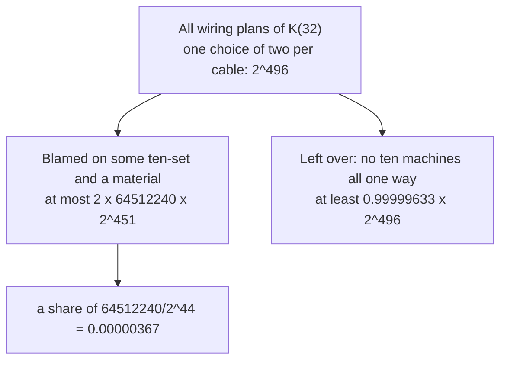

# Erdos's counting trick: if the bad colourings are fewer than all colourings, a good one exists, so R(k,k) grows at least like 2^(k/2)

[Syllabus](../../../SYLLABUS.md) → [Combinatorics and graphs](../README.md) → [Ramsey and Extremal, in Outline](../README.md#s14) → Erdos's counting trick

---

## General Overview

A server hall holds 32 machines. Every pair is joined by one cable, copper or fibre. There are 496 pairs, so 496 cables, each settled by a choice of two. That gives 2^496 wiring plans, a number of 150 digits.

Call a plan **bad** if some ten machines have all 45 cables among them in one material. Call it **good** otherwise. Is there a good plan?

Paul Erdos, in 1947, counted instead of searching. Every bad plan has a ten-set and a material to blame. Fix the blame and the 45 cables inside the ten-set are forced; the other 451 are free. With 64512240 ten-sets and two materials, the bad plans number at most 2 x 64512240 x 2^451, a share of at most 0.00000367. The rest are good. Not one has been named.

In graph language the machines are dots, the cables edges, the materials two colours, and the hall the complete graph K(32). A clique is a set of dots all joined to each other. The same count for any clique size k gives R(k,k) > 2^(k/2) ([Ramsey numbers](02-ramsey-numbers.md)): each step up in k multiplies the guaranteed hall size by the square root of 2, so the guarantee grows exponentially.

**Count the bad cases, even roughly from above; if the count falls short of all cases, a good case exists, though the count shows none.**

**What kind of fact this is:** a theorem, proved on this card in Why it works.

### The picture: all plans, split by an over-count



The left branch is an over-count; nothing in the picture points at one plan.

---

## The formula

Notation first, in words. C(n, k), read "n choose k", counts the ways to pick k things from n, order ignored. K(n) is n dots with every pair joined. R(k,k) is the smallest n at which every two-colouring of K(n) holds a one-colour K(k). And k!, read "k factorial", is 1 x 2 x ... x k.

$$\text{bad colourings of } K(n) \;\le\; 2 \times C(n,k) \times 2^{\,C(n,2) - C(k,2)}$$

**Read it aloud:** pick the colour, pick the k dots, and let every edge outside those k dots fall as it likes.

All colourings number $2^{C(n,2)}$, one choice of two per edge. Divide through:

$$\text{bad share} \;\le\; C(n,k)\;2^{\,1 - C(k,2)}, \qquad\text{and if this is under 1, then } R(k,k) > n.$$

**Read it aloud:** the k-sets, doubled for two colours, halved for each edge a k-set forces; below 1, a good colouring is left.

With $n$ at 2^(k/2) the test collapses to one fraction:

$$\text{bad share} \;\le\; \frac{2^{\,1 + k/2}}{k!}$$

**Read it aloud:** two to the power one plus half the clique size, over the clique size's factorial.

| Symbol | Plain meaning | In our example | Push it up and the answer… |
| --- | --- | --- | --- |
| $n$ | dots, or machines | 32 | more k-sets, so a larger bad share |
| $k$ | size of the one-colour clique to avoid | 10 | more edges forced, so a far smaller bad share |
| $K(n)$ | the complete graph: n dots, every pair joined | K(32), 496 edges | — |
| $C(n,k)$ | k-sets among n things, order ignored | C(32,10) = 64512240 | — |
| $C(k,2)$ | edges inside one k-set | 45 | — |
| $2^{C(n,2)}$ | all colourings | 2^496 | — |
| $k!$ | 1 x 2 x ... x k | 10! = 3628800 | the loose share falls fast |
| $R(k,k)$ | smallest n forcing a one-colour K(k) | more than 32 | — |

### When it holds

- **An over-count, never an under-count.** Every bad colouring must be blamed at least once. Drop the factor 2 and K(4) is allowed 1 bad plan where listing finds 2.
- **The test runs one way.** A share over 1 proves nothing: K(5) with k = 3 gets a bound of 2560 bad plans out of 1024, yet 12 good ones exist.
- **k at least 3 for the clean fraction.** At k = 3, the top 2^(5/2) squared is 2^5 = 32, just under (3!)^2 = 36. At k = 2 the fraction is 2, over 1.

---

## Why it works

### Step 0: a count below the total leaves something out

A count of bad plans under the total forces a good plan to exist. The count may be sloppy, if sloppy upwards.

### Step 1: count every plan

Each of the 496 cables is settled on its own, two ways: 2^496 plans.

### Step 2: over-count the bad plans by blame

In a bad plan, pick one ten-set joined all one way, and its material: the plan's **witness**. A fixed witness forces 45 cables and frees 451, so 2^451 plans carry it. There are 2 x 64512240 witnesses, so at most 2 x 64512240 x 2^451 bad plans.

A plan with two offending ten-sets is counted twice. That is allowed. Adding the sizes of overlapping collections always gives at least the size of their union, which is the union bound ([Stopping the sieve early](../04-Inclusion-Exclusion%20and%20Pigeonhole/04-union-bound-and-bonferroni.md)).

### Step 3: divide by the total

The 2^451 and the factor 2 cancel all but 44 of the 496 twos below:

$$\frac{2 \times 64512240 \times 2^{451}}{2^{496}} \;=\; \frac{64512240}{2^{44}} \;=\; 0.00000367$$

So a good plan exists, and R(10,10) > 32.

### Step 4: why the threshold is 2^(k/2)

Now let $n$ and $k$ vary. The k-set count C(n, k) grows with $n$; the shrink factor $2^{\,1-C(k,2)}$ ignores $n$. The cheap bound C(n, k) ≤ n^k / k! ([The middle of the row](../03-Binomial%20Coefficients%20and%20Identities/07-central-binomial-and-bounds.md)) shows the balance. At $n$ = 2^(k/2), n^k = 2^(k^2/2) almost exactly cancels the shrink factor, leaving $2^{\,1+k/2}/k!$, under 1 from k = 3 on. So R(k,k) > 2^(k/2). At k = 10 it reads 0.00001764: looser than the exact 0.00000367, as a cheaper bound should be.

<details>
<summary>Detailed proof, for every clique size at once</summary>

Let $k$ be 3 or more and $n$ the whole part of 2^(k/2). Steps 1 to 3, with $n$ and $k$ for 32 and 10, bound the bad share by $C(n,k)\,2^{\,1-C(k,2)}$. Using C(n, k) ≤ n^k / k! and n^k ≤ 2^(k^2/2):
$$C(n,k)\,2^{\,1-C(k,2)} \;\le\; \frac{2^{\,k^2/2}}{k!} \times 2^{\,1 - k^2/2 + k/2} \;=\; \frac{2^{\,1+k/2}}{k!}.$$

This is under 1 when $2^{\,1+k/2} < k!$, which squared reads 2^(k+2) < (k!)^2. At k = 3 that is 32 < 36. Raising k by one doubles the left side and multiplies the right by (k + 1)^2, which is larger, so the inequality holds from k = 3 on. Some colouring of K(n) has no one-colour K(k), and R(k,k) > n. ∎

</details>

The argument is often told with a coin flipped for each edge; with a chance read as favourable plans over possible plans, that is this count divided by the total. The version with averages is [The probabilistic method](../../09-Probability%20and%20statistics/14-Random%20Graphs%20and%20the%20Probabilistic%20Method/03-probabilistic-method.md).

---

## Worked numbers, by hand

| Step | Arithmetic | Value |
| --- | --- | --- |
| pairs among 32 machines | C(32,2) | 496 |
| all wiring plans | two choices per cable | 2^496 |
| ten-sets | C(32,10) | 64512240 |
| cables inside one ten-set | C(10,2) | 45 |
| cables a witness leaves free | 496 − 45 | 451 |
| bad share, at most | 2 x 64512240 x 2^451 / 2^496 = 64512240 / 2^44 | **0.00000367** |
| the loose form | 2^6 / 10! = 64 / 3628800 | 0.00001764 |
| good plans, at least | 0.99999633 x 2^496 | **more than none** |

So 32 machines can be wired with no ten joined all one way: R(10,10) > 32.

The exact test reaches further than the clean threshold. It clears every hall up to 100 machines, where the share is 0.9840, and fails at 101, where it is 1.0921. So the same count gives R(10,10) > 100.

### The argument, small enough to list

| Hall | Clique | Plans | Bad, by listing | Bound | Verdict |
| --- | --- | --- | --- | --- | --- |
| K(4) | 4 | 64 | 2 | 2 | exact: all-copper and all-fibre |
| K(5) | 4 | 1024 | 132 | 160 | an over-count, still under 1024: 892 good |
| K(5) | 3 | 1024 | 1012 | 2560 | bound over the total, so silent |

In the last row the count proves nothing, yet 12 good plans exist: a five-machine ring in one material, the other five cables forming a second ring in the other. Rings on five labelled machines number 5!/(5 x 2) = 12.

### What breaks if you drop a piece

| Mistake | Comes out at | What went wrong |
| --- | --- | --- |
| Blame ordered lists of ten machines | 234102016512000/2^44 = 13.31 | Each ten-set is named 10! times; the division by 10! in C(32,10) is what brings the share under 1 |
| Count one material only | 0.00000183; on K(4), 1 allowed where 2 exist | Plans with an all-fibre ten-set go uncounted, so the bound is false |
| Push the hall to 101 machines | share 1.0921 | Past the crossing the k-set count beats the fixed shrink, and nothing follows |

---

## Code, from first principles, and it actually runs

Nothing is imported. Two roads that share no arithmetic reach the ten-set count: a falling product over a factorial, and Pascal's rule. Then brute force re-runs the argument: every plan of K(4) and K(5) is searched for a one-colour clique and set against the bound. Last, the exact test runs at the whole part of 2^(k/2) for k from 3 to 16.

### Python

```python
# Erdos's counting trick -- the check behind the card.  Nothing is imported.  A
# server hall of 32 machines, every pair joined by copper or by fibre.  The plans
# with ten machines joined all one way are over-counted by formula, then the same
# argument is re-run by listing every plan of K(4) and K(5).
K, N = 10, 32

def falling(n, k):                        # n x (n-1) x ... x (n-k+1); falling(k, k) is k!
    out = 1
    for i in range(k): out *= n - i
    return out
def choose(n, k): return falling(n, k) // falling(k, k)       # road one to C(n, k)
def pascal(n, k):                         # road two to C(n, k): Pascal's rule, row by row
    row = [1]
    for _ in range(n): row = [1] + [row[i] + row[i + 1] for i in range(len(row) - 1)] + [1]
    return row[k]
def bound(n, k, colours=2):               # witnesses x plans per witness: the over-count
    return colours * choose(n, k) * 2 ** (choose(n, 2) - choose(k, 2))
def share(n, k): return 2 * choose(n, k) / 2 ** choose(k, 2)  # the over-count over all plans
def bad_by_listing(n, k):                 # every plan of K(n), searched for a one-type k-set
    pairs = [(i, j) for i in range(n) for j in range(i + 1, n)]
    sets = [s for s in range(1 << n) if bin(s).count("1") == k]
    masks = [sum(1 << e for e, (i, j) in enumerate(pairs) if s >> i & 1 and s >> j & 1) for s in sets]
    bad = sum(1 for c in range(1 << len(pairs)) if any(c & m in (0, m) for m in masks))
    return bad, 1 << len(pairs)
def root(k):                              # the whole part of 2^(k/2), by counting up
    n = 1
    while (n + 1) * (n + 1) <= 1 << k: n += 1
    return n
def yn(claim): return "yes" if claim else "no"

cn2, ck2 = choose(N, 2), choose(K, 2)
c_fall, c_pas = choose(N, K), pascal(N, K)
exact, loose = share(N, K), 2 ** (1 + K // 2) / falling(K, K)
top = N
while share(top + 1, K) < 1: top += 1   # the largest hall the exact test still clears
(b44, a44), (b54, a54), (b53, a53) = bad_by_listing(4, 4), bad_by_listing(5, 4), bad_by_listing(5, 3)
ks = range(3, 17)

print(f"k = {K}, n = {N}: {cn2} pairs, {ck2} inside a ten-set, 2^{cn2} plans, a number of {len(str(2 ** cn2))} digits")
print(f"ten-sets C({N},{K}) = {c_fall} by falling product, {c_pas} by Pascal's rule")
print(f"bad plans at most 2 x {c_fall} x 2^{cn2 - ck2}, a share of {c_fall}/2^{ck2 - 1} = {exact:.8f}")
print(f"loose form 2^{1 + K // 2}/{K}! = {2 ** (1 + K // 2)}/{falling(K, K)} = {loose:.8f}")
print(f"loose form under 1 from k = 3 on: 2^5 = {2 ** 5} < (3!)^2 = {falling(3, 3) ** 2}")
print(f"good plans at least {1 - exact:.8f} x 2^{cn2}, so one exists: {yn(exact < 1)}")
print(f"largest hall the exact test clears at k = {K}: {top} (share {share(top, K):.4f}); {top + 1} gives {share(top + 1, K):.4f}")
print(f"listed, k = 4 on K(4): {a44} plans, {b44} bad, bound {bound(4, 4)}")
print(f"listed, k = 4 on K(5): {a54} plans, {b54} bad, bound {bound(5, 4)}, so {a54 - b54} good")
print(f"listed, k = 3 on K(5): {a53} plans, {b53} bad, {a53 - b53} good = 5!/(5 x 2); bound {bound(5, 3)}, over the total")
print(f"n = whole part of 2^(k/2), k = 3 to 16: {[root(k) for k in ks]}")
print(f"exact test passes at every one of them: {yn(all(bound(root(k), k) < 2 ** choose(root(k), 2) for k in ks))}")
print(f"mistake, ordered lists of ten: {falling(N, K)}/2^{ck2 - 1} = {falling(N, K) / 2 ** (ck2 - 1):.2f}")
print(f"mistake, one colour only: {exact / 2:.8f}; on K(4) it allows {bound(4, 4, 1)} bad plan, listing finds {b44}")
assert c_fall == c_pas                                   # two roads to the ten-sets
assert b44 == bound(4, 4) and b54 <= bound(5, 4) and a53 - b53 == falling(5, 5) // 10  # listing
assert exact <= loose < 1                                # the exact share sits under the loose form
assert all(root(k) ** 2 <= 1 << k < (root(k) + 1) ** 2 and bound(root(k), k) < 2 ** choose(root(k), 2) for k in ks)
print("ALL CHECKS PASS")
```

**Ran 2026-09-24 on macOS, Python 3.14.6, standard library only. All checks passed. Output, pasted from the run:**

```
k = 10, n = 32: 496 pairs, 45 inside a ten-set, 2^496 plans, a number of 150 digits
ten-sets C(32,10) = 64512240 by falling product, 64512240 by Pascal's rule
bad plans at most 2 x 64512240 x 2^451, a share of 64512240/2^44 = 0.00000367
loose form 2^6/10! = 64/3628800 = 0.00001764
loose form under 1 from k = 3 on: 2^5 = 32 < (3!)^2 = 36
good plans at least 0.99999633 x 2^496, so one exists: yes
largest hall the exact test clears at k = 10: 100 (share 0.9840); 101 gives 1.0921
listed, k = 4 on K(4): 64 plans, 2 bad, bound 2
listed, k = 4 on K(5): 1024 plans, 132 bad, bound 160, so 892 good
listed, k = 3 on K(5): 1024 plans, 1012 bad, 12 good = 5!/(5 x 2); bound 2560, over the total
n = whole part of 2^(k/2), k = 3 to 16: [2, 4, 5, 8, 11, 16, 22, 32, 45, 64, 90, 128, 181, 256]
exact test passes at every one of them: yes
mistake, ordered lists of ten: 234102016512000/2^44 = 13.31
mistake, one colour only: 0.00000183; on K(4) it allows 1 bad plan, listing finds 2
ALL CHECKS PASS
```

### Rust

Same numbers, same labels, built with `rustc --edition 2021 -O`. Counts are 128-bit whole numbers; shares are floating-point divisions.

```rust
// Erdos's counting trick -- the same check as the Python, in Rust, std only, no
// crates.  A server hall of 32 machines, every pair joined by copper or by fibre.
// The plans with ten machines joined all one way are over-counted by formula, then
// the same argument is re-run by listing every plan of K(4) and K(5).
const K: u32 = 10;
const N: u32 = 32;

// n x (n-1) x ... x (n-k+1), so falling(k, k) is k!
fn falling(n: u128, k: u32) -> u128 { (0..k as u128).fold(1, |out, i| out * (n - i)) }
fn choose(n: u128, k: u32) -> u128 {      // road one to C(n, k): multiply and divide in step
    (0..k as u128).fold(1, |c, i| c * (n - i) / (i + 1))
}
fn pascal(n: u32, k: u32) -> u128 {       // road two to C(n, k): Pascal's rule, row by row
    let mut row = vec![1u128];
    for _ in 0..n {
        let mut next = vec![1u128];
        for i in 0..row.len() - 1 { next.push(row[i] + row[i + 1]) }
        next.push(1);
        row = next;
    }
    row[k as usize]
}
fn bound(n: u32, k: u32, colours: u128) -> u128 {    // witnesses x plans per witness
    colours * choose(n as u128, k) << (choose(n as u128, 2) - choose(k as u128, 2))
}
fn share(n: u32, k: u32) -> f64 {         // the over-count over all plans
    2.0 * choose(n as u128, k) as f64 / 2f64.powi(choose(k as u128, 2) as i32)
}
fn bad_by_listing(n: u32, k: u32) -> (u64, u64) {    // every plan of K(n), searched for a one-type k-set
    let mut pairs = Vec::new();
    for i in 0..n { for j in i + 1..n { pairs.push((i, j)) } }
    let masks: Vec<u64> = (0u32..1 << n).filter(|s| s.count_ones() == k).map(|s| {
        pairs.iter().enumerate().filter(|(_, &(i, j))| s >> i & 1 == 1 && s >> j & 1 == 1)
            .fold(0u64, |m, (e, _)| m | 1 << e)
    }).collect();
    let all = 1u64 << pairs.len();
    ((0..all).filter(|c| masks.iter().any(|&m| c & m == 0 || c & m == m)).count() as u64, all)
}
fn root(k: u32) -> u128 {                 // the whole part of 2^(k/2), by halving an interval
    let (mut lo, mut hi) = (1u128, 1u128 << k);
    while hi - lo > 1 { let mid = (lo + hi) / 2; if mid * mid <= 1 << k { lo = mid } else { hi = mid } }
    lo
}
fn yn(claim: bool) -> &'static str { if claim { "yes" } else { "no" } }

fn main() {
    let (cn2, ck2) = (choose(N as u128, 2) as u32, choose(K as u128, 2) as u32);
    let (c_fall, c_pas) = (choose(N as u128, K), pascal(N, K));
    let exact = share(N, K);
    let loose = 2f64.powi(1 + K as i32 / 2) / falling(K as u128, K) as f64;
    let mut top = N;
    while share(top + 1, K) < 1.0 { top += 1 }        // the largest hall the exact test still clears
    let ((b44, a44), (b54, a54), (b53, a53)) = (bad_by_listing(4, 4), bad_by_listing(5, 4), bad_by_listing(5, 3));
    let passes = (3..17).all(|k| 2 * choose(root(k), k) < 1u128 << choose(k as u128, 2));
    let digits = (cn2 as f64 * 2f64.log10()).floor() as u32 + 1;
    let ordered = falling(N as u128, K);

    println!("k = {}, n = {}: {} pairs, {} inside a ten-set, 2^{} plans, a number of {} digits", K, N, cn2, ck2, cn2, digits);
    println!("ten-sets C({},{}) = {} by falling product, {} by Pascal's rule", N, K, c_fall, c_pas);
    println!("bad plans at most 2 x {} x 2^{}, a share of {}/2^{} = {:.8}", c_fall, cn2 - ck2, c_fall, ck2 - 1, exact);
    println!("loose form 2^{}/{}! = {}/{} = {:.8}", 1 + K / 2, K, 1u32 << (1 + K / 2), falling(K as u128, K), loose);
    println!("loose form under 1 from k = 3 on: 2^5 = {} < (3!)^2 = {}", 1u32 << 5, falling(3, 3).pow(2));
    println!("good plans at least {:.8} x 2^{}, so one exists: {}", 1.0 - exact, cn2, yn(exact < 1.0));
    println!("largest hall the exact test clears at k = {}: {} (share {:.4}); {} gives {:.4}", K, top, share(top, K), top + 1, share(top + 1, K));
    println!("listed, k = 4 on K(4): {} plans, {} bad, bound {}", a44, b44, bound(4, 4, 2));
    println!("listed, k = 4 on K(5): {} plans, {} bad, bound {}, so {} good", a54, b54, bound(5, 4, 2), a54 - b54);
    println!("listed, k = 3 on K(5): {} plans, {} bad, {} good = 5!/(5 x 2); bound {}, over the total", a53, b53, a53 - b53, bound(5, 3, 2));
    println!("n = whole part of 2^(k/2), k = 3 to 16: {:?}", (3..17).map(root).collect::<Vec<u128>>());
    println!("exact test passes at every one of them: {}", yn(passes));
    println!("mistake, ordered lists of ten: {}/2^{} = {:.2}", ordered, ck2 - 1, ordered as f64 / 2f64.powi(ck2 as i32 - 1));
    println!("mistake, one colour only: {:.8}; on K(4) it allows {} bad plan, listing finds {}", exact / 2.0, bound(4, 4, 1), b44);
    assert!(c_fall == c_pas);                                         // two roads to the ten-sets
    assert!(b44 as u128 == bound(4, 4, 2) && b54 as u128 <= bound(5, 4, 2) && a53 - b53 == (falling(5, 5) / 10) as u64);
    assert!(exact <= loose && loose < 1.0);                           // the exact share sits under the loose form
    assert!(passes && (3..17).all(|k| root(k) * root(k) <= 1 << k && 1u128 << k < (root(k) + 1) * (root(k) + 1)));
    println!("ALL CHECKS PASS");
}
```

**Ran 2026-09-24 on macOS, rustc 1.98.1, no crates. All checks passed. Output, pasted from the run:**

```
k = 10, n = 32: 496 pairs, 45 inside a ten-set, 2^496 plans, a number of 150 digits
ten-sets C(32,10) = 64512240 by falling product, 64512240 by Pascal's rule
bad plans at most 2 x 64512240 x 2^451, a share of 64512240/2^44 = 0.00000367
loose form 2^6/10! = 64/3628800 = 0.00001764
loose form under 1 from k = 3 on: 2^5 = 32 < (3!)^2 = 36
good plans at least 0.99999633 x 2^496, so one exists: yes
largest hall the exact test clears at k = 10: 100 (share 0.9840); 101 gives 1.0921
listed, k = 4 on K(4): 64 plans, 2 bad, bound 2
listed, k = 4 on K(5): 1024 plans, 132 bad, bound 160, so 892 good
listed, k = 3 on K(5): 1024 plans, 1012 bad, 12 good = 5!/(5 x 2); bound 2560, over the total
n = whole part of 2^(k/2), k = 3 to 16: [2, 4, 5, 8, 11, 16, 22, 32, 45, 64, 90, 128, 181, 256]
exact test passes at every one of them: yes
mistake, ordered lists of ten: 234102016512000/2^44 = 13.31
mistake, one colour only: 0.00000183; on K(4) it allows 1 bad plan, listing finds 2
ALL CHECKS PASS
```

The two outputs match line for line.

> [!TIP]
> **Try changing**
> - **Remove one colour.** Guess first: does the bound still cover K(4)? Set the default `colours` in `bound` to 1. It allows 1 bad plan where listing finds 2; the second assert stops the run.
> - **Forget the order is ignored.** Guess first: does the share stay small? Replace `choose(n, k)` inside `share` with `falling(n, k)`. The share prints above 13, "so one exists" reads no, and the third assert stops the run.
> - **Search one material only.** Guess first: which assert notices? Change `c & m in (0, m)` to `c & m == m`. K(4) shows 1 bad plan, and the second assert stops the run.

---

## The usual mistake

> [!warning]
> **Reading the count as a construction.** The argument shows good plans vastly outnumber bad ones and hands over none; checking even one plan means inspecting 64512240 ten-sets. Existence and construction are separate results, and this card proves only the first.
>
> - **Taking 2^(k/2) as the true crossing.** It is where the algebra comes out clean; the exact test at k = 10 clears 100 machines.

---

## Where you meet it in real life

- **Lower bounds on Ramsey numbers.** Still the standard one: Joel Spencer's 1975 paper improved only the constant in front of 2^(k/2). Upper bounds sit near 4^k ([Ramsey numbers](02-ramsey-numbers.md)); a 2023 proof first pushed that base below 4. The gap between the bases is a famous open problem.
- **Error-correcting codes.** The Gilbert-Varshamov bound is this argument on strings of bits: count the failing codes, find them fewer than all.

> **Say it back**
> 32 machines with two cable materials have 2^496 wiring plans. A plan is bad if ten machines are joined all one way. Blaming each bad plan on a ten-set and a material over-counts them at a share of 0.00000367. Less than all, so a good plan exists, though none is shown. With 2^(k/2) dots the share is at most 2^(1+k/2)/k!, under 1 from k = 3, so R(k,k) > 2^(k/2).

---

## What this builds on

- [Ramsey numbers](02-ramsey-numbers.md): what R(k,k) means, and why a lower bound on it is one colouring that avoids the clique.
- [The middle of the row](../03-Binomial%20Coefficients%20and%20Identities/07-central-binomial-and-bounds.md): the cheap bound C(n, k) ≤ n^k / k! that turns the exact test into the clean fraction.
- [Stopping the sieve early](../04-Inclusion-Exclusion%20and%20Pigeonhole/04-union-bound-and-bonferroni.md): why adding overlapping counts gives an upper bound, the licence to over-count.

## Where this goes next

- [The probabilistic method](../../09-Probability%20and%20statistics/14-Random%20Graphs%20and%20the%20Probabilistic%20Method/03-probabilistic-method.md): the same argument with chance and averages, where the count becomes an expected number of bad cliques and reaches results this form cannot.

---

## Sources

Verified 24 Sep 2026: each DOI checked against Crossref for title and first author; the other pages name the cited work.

- Erdos, P. "Some remarks on the theory of graphs." *Bulletin of the American Mathematical Society* 53 (1947): 292–294. [doi:10.1090/S0002-9904-1947-08785-1](https://doi.org/10.1090/S0002-9904-1947-08785-1). The original argument.
- Alon, Noga, and Joel H. Spencer. *The Probabilistic Method*, 4th ed. Wiley, 2016. [Publisher page](https://www.wiley.com/en-us/The+Probabilistic+Method%2C+4th+Edition-p-9781119061953). Its opening chapter is this argument.
- Spencer, Joel. "Ramsey's theorem — a new lower bound." *Journal of Combinatorial Theory, Series A* 18, no. 1 (1975): 108–115. [doi:10.1016/0097-3165(75)90071-0](https://doi.org/10.1016/0097-3165(75)90071-0). Improves the constant in front of 2^(k/2).
- Campos, Marcelo, Simon Griffiths, Robert Morris, and Julian Sahasrabudhe. "An exponential improvement for diagonal Ramsey." arXiv:2303.09521 (2023). [Paper page](https://arxiv.org/abs/2303.09521). The upper-bound side, first below 4^k.
