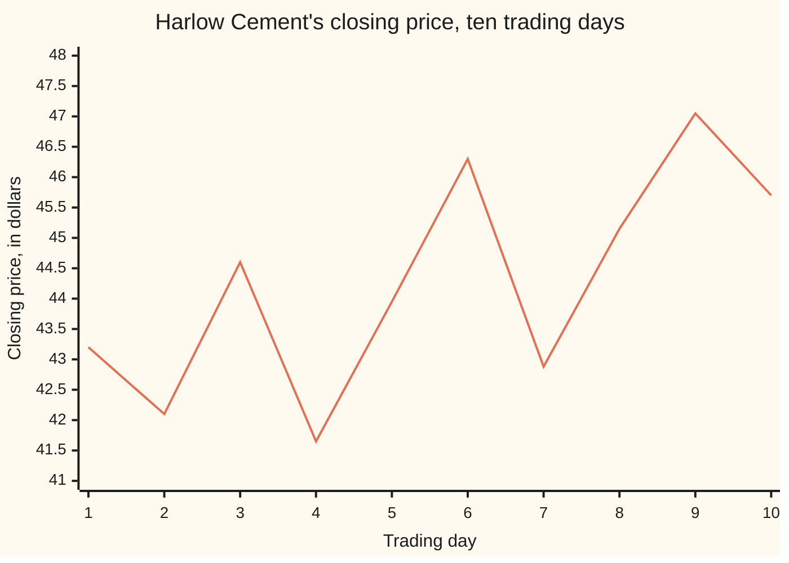
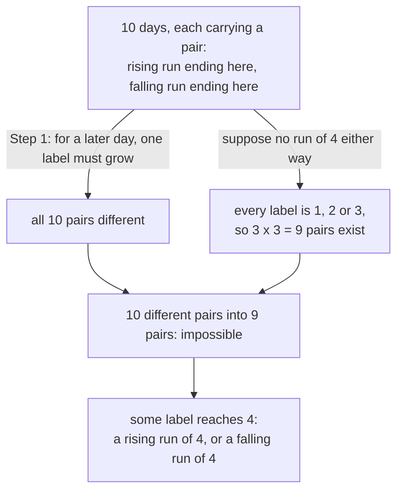

# Erdos-Szekeres: any long enough list of numbers has a long rising run or a long falling run, by labelling and pigeonhole

[Syllabus](../../../SYLLABUS.md) → [Combinatorics and graphs](../../../SYLLABUS.md#w04) → [Ramsey and Extremal, in Outline](../../../SYLLABUS.md#w04-s14) → Erdos-Szekeres

---

## General Overview

Harlow Cement closed at these prices, in dollars, over ten trading days: 43.20, 42.10, 44.60, 41.65, 43.95, 46.30, 42.88, 45.15, 47.05, 45.70. Ten different numbers, no obvious pattern.

Pick four days whose prices climb, keeping date order but skipping any days between. Days 1, 3, 6 and 9 do it: 43.20, 44.60, 46.30, 47.05. Terms taken from a list in their original order, with gaps allowed, form a **subsequence**. Four that climb make a **rising run** of four; four that drop make a **falling run**.

This was not luck. Any ten different numbers, in any order, hold a rising run of four or a falling run of four. Nine numbers need not, and Step 4 below shows nine that hold neither. The reason is a count of labels, not a search.

Paul Erdős and George Szekeres proved it in 1935, as a lemma about convex polygons.

**Ten different numbers in any order hold four that rise or four that fall, because each number carries a pair of run lengths as its label and only nine pairs avoid both.**

**What kind of fact this is:** a theorem, proved on this card in Why it works.

### The picture: ten closes, with nothing to see



The line is the close. Nothing in it marks out days 1, 3, 6 and 9; the theorem promises the run without pointing at it.

---

## The formula

A subscript, a small marker written low and to the right of a letter, picks out one place in the list: $x_i$ is the number in position i. Write $n$ for how many numbers the list holds, $A$ for the length of its longest rising run and $B$ for its longest falling run.

$$A \times B \ \ge\ n$$

**Read it aloud:** the longest climb times the longest slide is at least the length of the list.

For Harlow Cement, 4 × 3 = 12, at least 10. Ask for a rising run of $r$ terms or a falling run of $s$ terms. A list with neither has length at most (r − 1)(s − 1), by the inequality, so

$$n = (r-1)(s-1) + 1$$

is the shortest length that forces a run. With r = s = 4 that is 3 × 3 + 1 = 10.

| Symbol | Plain meaning | In our example | Push it up and the answer… |
| --- | --- | --- | --- |
| $n$ | how many numbers the list holds | 10 closes | longer runs are forced |
| $x_i$, $x_j$ | the number in position i, or j | 43.20 on day 1 | — |
| $r$, $s$ | the rising and falling run lengths asked for | 4 and 4 | a longer list is needed |
| $a_i$, $a_j$ | longest rising run ending at a position | 4 on day 9 | — |
| $b_i$, $b_j$ | longest falling run ending at a position | 3 on day 4 | — |
| $A$, $B$ | longest rising and falling run anywhere | 4 and 3 | the product bound loosens |

### When it holds

- **All numbers different.** Equal numbers grow neither label. Ten days alternating 44.00 and 43.00 have longest rising and falling runs of 2. Allow ties by asking for a never-falling run and the promise returns: the longest is 5.
- **Order kept.** A run keeps the list's order. Sorting the list destroys the question.
- **Gaps allowed.** Read "run" as days in a row and the theorem is false: a list that zigzags never has a consecutive run longer than 2.
- **One side, not both.** Harlow Cement's longest fall is 3; the rising side delivers.

---

## Why it works

### Step 0: label every position with two run lengths

Give position i two labels: $a_i$, the longest rising run that **ends** at position i, and $b_i$, the longest falling run ending there. Both look only backwards.

Day 1 has nothing before it: labels 1 and 1. Day 2, at 42.10, is below 43.20, so it ends a fall of two: labels 1 and 2. Day 3, at 44.60, is above both: labels 2 and 1.

### Step 1: no two positions share a pair of labels

Take an earlier position i and a later position j. Their numbers differ, so one of two things holds. If $x_j$ is larger, any rising run ending at i extends to j, so $a_j$ is at least $a_i$ + 1. If $x_j$ is smaller, the same argument gives $b_j$ at least $b_i$ + 1. One label strictly grows, so the pairs differ. Ten days, ten different pairs.

### Step 2: count the pairs a list without a run of four may use

Suppose no rising run of four and no falling run of four. Every label is then 1, 2 or 3, which allows 3 × 3 = 9 pairs. Ten different pairs cannot fit into nine boxes ([Pigeonhole, extended](../04-Inclusion-Exclusion%20and%20Pigeonhole/05-pigeonhole-extended.md)). So some label reaches 4.



The two arrows from the top box are the argument's two halves; they meet at the impossible box.

### Step 3: read the run off the labels

Day 9 carries rising label 4, so an earlier, lower day carries 3: day 6 at 46.30. Before it, a lower day carries 2: day 3 at 44.60. Then day 1 at 43.20. The run is days 1, 3, 6, 9. The same walk down the falling labels gives days 1, 2, 4 at 43.20 > 42.10 > 41.65: three, not four.

### Step 4: nine numbers are not enough

Nine prices: 45.90, 44.30, 43.10, 48.70, 47.20, 46.40, 51.50, 50.10, 49.30. Three falling blocks of three, each block wholly above the one before.

A rising run takes at most one number per block, so it stops at 3. A falling run cannot cross into a higher block, so it stops at 3. The nine label pairs fill the 3 × 3 grid exactly once. A tenth number has no box left.

<details>
<summary>Detailed proof: any two lengths</summary>

Take $n$ different numbers, labelled as in Step 0. By Step 1 the $n$ label pairs are all different. Each $a_i$ lies in 1 up to $A$ and each $b_i$ in 1 up to $B$, so there are at most $A \times B$ pairs, and $n$ is at most $A \times B$. With no rising run of $r$ and no falling run of $s$, $A \times B$ is at most (r − 1)(s − 1), so a list one longer holds a run. Step 4, with r − 1 falling blocks of s − 1 numbers, shows no shorter list is forced.

</details>

<details>
<summary>The same theorem as chains and antichains: Dilworth</summary>

Day i sits below day j when i is earlier **and** its price is lower ([Orders](../../01-Foundations/08-Relations%20and%20Functions/07-partial-and-total-orders.md)). A **chain**, a set whose members all compare, is a rising run. An **antichain**, a set in which no two compare, is a falling run: later days are lower.

Days sharing a rising label never compare, by Step 1, so the labels cut the days into $A$ antichains of at most $B$ days each. So $n$ is at most $A \times B$ (Mirsky's theorem). Dilworth's theorem (1950) is the mirror: $B$ chains of at most $A$ days each.

</details>

The tip is a second route: count antichains instead of boxes.

---

## Worked numbers, by hand

| Day | Close | Rising label $a_i$ | Falling label $b_i$ |
| --- | --- | --- | --- |
| 1 | 43.20 | 1 | 1 |
| 2 | 42.10 | 1 | 2 |
| 3 | 44.60 | 2 | 1 |
| 4 | 41.65 | 1 | 3 |
| 5 | 43.95 | 2 | 2 |
| 6 | 46.30 | 3 | 1 |
| 7 | 42.88 | 2 | 3 |
| 8 | 45.15 | 3 | 2 |
| 9 | 47.05 | **4** | 1 |
| 10 | 45.70 | **4** | 2 |

Eight pairs sit inside the 3 × 3 grid. Days 9 and 10 break out.

| Step | Arithmetic | Value |
| --- | --- | --- |
| pairs allowed without a run of four | 3 × 3 | 9 |
| pairs needed, all different | one per day | 10 |
| longest rising run | largest $a_i$ | **4** |
| longest falling run | largest $b_i$ | **3** |
| product bound | 4 × 3 | **12**, at least 10 |

The four days are 1, 3, 6 and 9. Calling them a four-day uptrend describes arithmetic, not the market.

### What breaks if you drop a piece

| Mistake | Comes out at | What went wrong |
| --- | --- | --- |
| Runs read as days in a row | 3 rising, 2 falling | consecutive runs are not forced |
| Nine days instead of ten | 3 rising, 3 falling | nine pairs are exactly enough for nine days |
| Prices repeat: 44.00, 43.00 alternating | 2 rising, 2 falling | equal prices grow neither label |

---

## Code, from first principles, and it actually runs

Nothing is imported. Road one is the labels of Step 0. Road two ignores labels and tries all 1,024 sets of days, keeping the longest that rises and the longest that falls. The nine-day list of Step 4 runs through both roads, and the three mistakes are computed too.

### Python

```python
# Erdos-Szekeres -- the check behind the card.  Nothing is imported.  Ten daily
# closing prices of Harlow Cement, all different.  Each day carries two labels:
# the longest strictly rising run of days ending there, and the longest strictly
# falling one.  Road two ignores the labels and tries every set of days instead.
PRICES = [43.20, 42.10, 44.60, 41.65, 43.95, 46.30, 42.88, 45.15, 47.05, 45.70]
NINE = [45.90, 44.30, 43.10, 48.70, 47.20, 46.40, 51.50, 50.10, 49.30]
TIED, R, N = [44.00, 43.00] * 5, 4, 10
UP, DOWN, NEVER_DOWN = (lambda u, v: u < v), (lambda u, v: u > v), (lambda u, v: u <= v)
def labels(p, ok):                  # road one: look back from each day in turn
    out = []
    for j, x in enumerate(p): out.append(max([out[i] + 1 for i in range(j) if ok(p[i], x)] + [1]))
    return out
def longest(p, ok):                 # road two: try all 2^n sets of days, labels unused
    sets = ([i for i in range(len(p)) if m >> i & 1] for m in range(1 << len(p)))
    return max(len(d) for d in sets if all(ok(p[i], p[j]) for i, j in zip(d, d[1:])))
def trace(p, lab, ok):              # walk back from the first day holding the top label
    k = max(lab); j = lab.index(k); run = [j]
    while k > 1:
        j = next(i for i in range(j) if lab[i] == k - 1 and ok(p[i], p[j])); run.append(j); k -= 1
    return run[::-1]
def streak(p, ok):                  # the wrong reading: days in a row only
    runs = [1]
    for i in range(1, len(p)): runs.append(runs[-1] + 1 if ok(p[i - 1], p[i]) else 1)
    return max(runs)
def show(p, run, sign):
    return "days " + ", ".join(str(i + 1) for i in run) + " at " + f" {sign} ".join(f"{p[i]:.2f}" for i in run)
def row(name, values):
    return f"{name:<16}" + "".join(f"{v:>6}" for v in values)
a, b = labels(PRICES, UP), labels(PRICES, DOWN)
na, nb = labels(NINE, UP), labels(NINE, DOWN)
grid = sorted(zip(na, nb)) == [(i, j) for i in (1, 2, 3) for j in (1, 2, 3)]
run_up, run_down = trace(PRICES, a, UP), trace(PRICES, b, DOWN)
brute = (longest(PRICES, UP), longest(PRICES, DOWN), longest(NINE, UP), longest(NINE, DOWN))
print("ten closing prices, day 1 to day 10: " + " ".join(f"{x:.2f}" for x in PRICES))
print(row("day", range(1, N + 1)))
print(row("rising label a", a))
print(row("falling label b", b))
print(f"all {N} label pairs different: {'yes' if len(set(zip(a, b))) == N else 'no'}")
print(f"longest rising run: labels {max(a)}, every set of days tried {brute[0]}")
print(f"longest falling run: labels {max(b)}, every set of days tried {brute[1]}")
print(f"{max(a)} x {max(b)} = {max(a) * max(b)}, and that is at least the {N} days")
print(f"the rising run of {max(a)}: " + show(PRICES, run_up, "<"))
print(f"the falling run of {max(b)}: " + show(PRICES, run_down, ">"))
print(f"boxes if no label passed 3: 3 x 3 = 9, one fewer than the {N} days")
print("nine days, " + " ".join(f"{x:.2f}" for x in NINE) +
      f": longest rising {brute[2]}, longest falling {brute[3]}")
print(f"its nine label pairs fill the 3 x 3 grid once each: {'yes' if grid else 'no'}")
print(f"mistake 1, runs read as days in a row: longest rising {streak(PRICES, UP)}, longest falling {streak(PRICES, DOWN)}")
print(f"mistake 2, nine days instead of ten: longest rising {max(na)}, one short of {R}")
print(f"mistake 3, only 44.00 and 43.00, alternating: longest rising {longest(TIED, UP)}, "
      f"longest falling {longest(TIED, DOWN)}, longest never-falling {longest(TIED, NEVER_DOWN)}")
assert (max(a), max(b)) == (brute[0], brute[1]) == (4, 3)
assert len(set(zip(a, b))) == N and max(a) * max(b) >= N
assert len(run_up) == R and all(PRICES[i] < PRICES[j] for i, j in zip(run_up, run_up[1:])) and streak(PRICES, UP) < R
assert (max(na), max(nb)) == (brute[2], brute[3]) == (3, 3) and grid
print("ALL CHECKS PASS")
```

**Ran 2026-09-19 on macOS, Python 3.14.6, standard library only. All checks passed. Output, pasted from the run:**

```
ten closing prices, day 1 to day 10: 43.20 42.10 44.60 41.65 43.95 46.30 42.88 45.15 47.05 45.70
day                  1     2     3     4     5     6     7     8     9    10
rising label a       1     1     2     1     2     3     2     3     4     4
falling label b      1     2     1     3     2     1     3     2     1     2
all 10 label pairs different: yes
longest rising run: labels 4, every set of days tried 4
longest falling run: labels 3, every set of days tried 3
4 x 3 = 12, and that is at least the 10 days
the rising run of 4: days 1, 3, 6, 9 at 43.20 < 44.60 < 46.30 < 47.05
the falling run of 3: days 1, 2, 4 at 43.20 > 42.10 > 41.65
boxes if no label passed 3: 3 x 3 = 9, one fewer than the 10 days
nine days, 45.90 44.30 43.10 48.70 47.20 46.40 51.50 50.10 49.30: longest rising 3, longest falling 3
its nine label pairs fill the 3 x 3 grid once each: yes
mistake 1, runs read as days in a row: longest rising 3, longest falling 2
mistake 2, nine days instead of ten: longest rising 3, one short of 4
mistake 3, only 44.00 and 43.00, alternating: longest rising 2, longest falling 2, longest never-falling 5
ALL CHECKS PASS
```

### Rust

Same numbers, same labels, built with `rustc --edition 2021 -O`.

```rust
// Erdos-Szekeres -- the same check as erdos_szekeres_check.py, in Rust.  No crates.  Ten daily
// closing prices of Harlow Cement, all different.  Each day carries two labels: the longest
// strictly rising run of days ending there, and the longest strictly falling one.  Road two
// ignores the labels and tries every set of days instead.
const PRICES: [f64; 10] = [43.20, 42.10, 44.60, 41.65, 43.95, 46.30, 42.88, 45.15, 47.05, 45.70];
const NINE: [f64; 9] = [45.90, 44.30, 43.10, 48.70, 47.20, 46.40, 51.50, 50.10, 49.30];
const R: usize = 4; const N: usize = 10;
fn up(u: f64, v: f64) -> bool { u < v }
fn down(u: f64, v: f64) -> bool { u > v }
fn never_down(u: f64, v: f64) -> bool { u <= v }
fn labels(p: &[f64], ok: fn(f64, f64) -> bool) -> Vec<usize> {   // road one: look back from each day
    let mut out: Vec<usize> = Vec::new();
    for j in 0..p.len() { let v = (0..j).filter(|&i| ok(p[i], p[j])).map(|i| out[i] + 1).max().unwrap_or(1); out.push(v) }
    out
}
fn longest(p: &[f64], ok: fn(f64, f64) -> bool) -> usize {       // road two: all 2^n sets of days
    (0u32..(1u32 << p.len())).map(|m| (0..p.len()).filter(|i| m >> i & 1 == 1).collect::<Vec<usize>>())
        .filter(|d| d.windows(2).all(|w| ok(p[w[0]], p[w[1]]))).map(|d| d.len()).max().unwrap()
}
fn trace(p: &[f64], lab: &[usize], ok: fn(f64, f64) -> bool) -> Vec<usize> {
    let mut k = *lab.iter().max().unwrap();
    let mut j = lab.iter().position(|&v| v == k).unwrap();
    let mut run = vec![j];
    while k > 1 { j = (0..j).find(|&i| lab[i] == k - 1 && ok(p[i], p[j])).unwrap(); run.push(j); k -= 1 }
    run.reverse(); run
}
fn streak(p: &[f64], ok: fn(f64, f64) -> bool) -> usize {        // the wrong reading: days in a row
    let mut runs = vec![1usize];
    for i in 1..p.len() { runs.push(if ok(p[i - 1], p[i]) { runs[i - 1] + 1 } else { 1 }) }
    *runs.iter().max().unwrap()
}
fn show(p: &[f64], run: &[usize], sign: &str) -> String {
    let days: Vec<String> = run.iter().map(|i| (i + 1).to_string()).collect();
    let vals: Vec<String> = run.iter().map(|&i| format!("{:.2}", p[i])).collect();
    format!("days {} at {}", days.join(", "), vals.join(&format!(" {} ", sign)))
}
fn row(name: &str, v: &[usize]) -> String {
    format!("{:<16}{}", name, v.iter().map(|x| format!("{:>6}", x)).collect::<Vec<String>>().join(""))
}
fn prices(p: &[f64]) -> String { p.iter().map(|x| format!("{:.2}", x)).collect::<Vec<String>>().join(" ") }
fn yn(claim: bool) -> &'static str { if claim { "yes" } else { "no" } }
fn main() {
    let tied: Vec<f64> = (0..5).flat_map(|_| [44.00_f64, 43.00]).collect();
    let (a, b) = (labels(&PRICES, up), labels(&PRICES, down));
    let (na, nb) = (labels(&NINE, up), labels(&NINE, down));
    let mut np: Vec<(usize, usize)> = na.iter().zip(&nb).map(|(&x, &y)| (x, y)).collect();
    np.sort();
    let grid = np == (1..=3).flat_map(|i| (1..=3).map(move |j| (i, j))).collect::<Vec<(usize, usize)>>();
    let mut seen: Vec<(usize, usize)> = a.iter().zip(&b).map(|(&x, &y)| (x, y)).collect();
    seen.sort(); seen.dedup();
    let (ta, tb, tna, tnb) = (*a.iter().max().unwrap(), *b.iter().max().unwrap(),
                              *na.iter().max().unwrap(), *nb.iter().max().unwrap());
    let (run_up, run_down) = (trace(&PRICES, &a, up), trace(&PRICES, &b, down));
    let brute = [longest(&PRICES, up), longest(&PRICES, down), longest(&NINE, up), longest(&NINE, down)];
    println!("ten closing prices, day 1 to day 10: {}", prices(&PRICES));
    println!("{}", row("day", &(1..=N).collect::<Vec<usize>>()));
    println!("{}", row("rising label a", &a));
    println!("{}", row("falling label b", &b));
    println!("all {} label pairs different: {}", N, yn(seen.len() == N));
    println!("longest rising run: labels {}, every set of days tried {}", ta, brute[0]);
    println!("longest falling run: labels {}, every set of days tried {}", tb, brute[1]);
    println!("{} x {} = {}, and that is at least the {} days", ta, tb, ta * tb, N);
    println!("the rising run of {}: {}", ta, show(&PRICES, &run_up, "<"));
    println!("the falling run of {}: {}", tb, show(&PRICES, &run_down, ">"));
    println!("boxes if no label passed 3: 3 x 3 = 9, one fewer than the {} days", N);
    println!("nine days, {}: longest rising {}, longest falling {}", prices(&NINE), brute[2], brute[3]);
    println!("its nine label pairs fill the 3 x 3 grid once each: {}", yn(grid));
    println!("mistake 1, runs read as days in a row: longest rising {}, longest falling {}",
             streak(&PRICES, up), streak(&PRICES, down));
    println!("mistake 2, nine days instead of ten: longest rising {}, one short of {}", tna, R);
    println!("mistake 3, only 44.00 and 43.00, alternating: longest rising {}, longest falling {}, longest never-falling {}",
             longest(&tied, up), longest(&tied, down), longest(&tied, never_down));
    assert!((ta, tb) == (brute[0], brute[1]) && (ta, tb) == (4, 3));
    assert!(seen.len() == N && ta * tb >= N);
    assert!(run_up.len() == R && run_up.windows(2).all(|w| PRICES[w[0]] < PRICES[w[1]]) && streak(&PRICES, up) < R);
    assert!((tna, tnb) == (brute[2], brute[3]) && (tna, tnb) == (3, 3) && grid);
    println!("ALL CHECKS PASS");
}
```

**Ran 2026-09-19 on macOS, rustc 1.98.1, no crates. All checks passed. Output, pasted from the run:**

```
ten closing prices, day 1 to day 10: 43.20 42.10 44.60 41.65 43.95 46.30 42.88 45.15 47.05 45.70
day                  1     2     3     4     5     6     7     8     9    10
rising label a       1     1     2     1     2     3     2     3     4     4
falling label b      1     2     1     3     2     1     3     2     1     2
all 10 label pairs different: yes
longest rising run: labels 4, every set of days tried 4
longest falling run: labels 3, every set of days tried 3
4 x 3 = 12, and that is at least the 10 days
the rising run of 4: days 1, 3, 6, 9 at 43.20 < 44.60 < 46.30 < 47.05
the falling run of 3: days 1, 2, 4 at 43.20 > 42.10 > 41.65
boxes if no label passed 3: 3 x 3 = 9, one fewer than the 10 days
nine days, 45.90 44.30 43.10 48.70 47.20 46.40 51.50 50.10 49.30: longest rising 3, longest falling 3
its nine label pairs fill the 3 x 3 grid once each: yes
mistake 1, runs read as days in a row: longest rising 3, longest falling 2
mistake 2, nine days instead of ten: longest rising 3, one short of 4
mistake 3, only 44.00 and 43.00, alternating: longest rising 2, longest falling 2, longest never-falling 5
ALL CHECKS PASS
```

The two outputs match line for line.

> [!TIP]
> **Try changing**
> Guess first, then run it. The asserts are pinned to the Harlow Cement closes, so one will stop the program.
> - **Set `PRICES = NINE`.** Longest rising 3, longest falling 3; the first assert stops it. That is Step 4.
> - **Set `PRICES = TIED`.** Longest rising 2, longest falling 2, on ten days. Step 1 needed the prices different.
> - **Reverse the list.** Rising runs become falling runs: longest rising 3, longest falling 4.

---

## The usual mistake

> [!warning]
> **Hearing "run" as "days in a row".** Harlow Cement's longest stretch of consecutive rising days is 3, and of falling days 2, yet the rising run of 4 is there, on days 1, 3, 6 and 9. The consecutive version is false: a zigzag of any length has no consecutive run past 2.
>
> - **Expecting both sides.** The promise is four rising **or** four falling. Here the fall stops at 3.
> - **Reading the count as a location.** The count says a run exists; the labels find it, in Step 3.
> - **Treating ten as a safety margin.** It is exact: three falling blocks of three reach only 3 and 3.
> - **Dropping "all different".** With repeats the promise fails at 2 and 2.

---

## Where you meet it in real life

- **Reading a trend off a price chart.** Any ten different closes contain a four-day climb or a four-day slide, so four rising days prove nothing.
- **Patience sorting.** Deal the numbers in order onto piles, each on the leftmost pile whose top is larger, starting a new pile when none is. The number of piles equals $A$, the longest rising run.
- **The shelf's other forced structures.** Colour every pair among enough people red or blue and a one-colour group appears ([Friends and strangers](01-friends-and-strangers.md)), with most thresholds unknown ([Ramsey numbers](02-ramsey-numbers.md)). Erdos-Szekeres is a rare member whose threshold is exact. Too many edges forcing a triangle is [Mantel and Turan](05-mantel-and-turan.md).

> **Say it back**
> Label each number with the longest rising and falling runs ending there. A later number beats an earlier one on one label, so no two share a pair. Without a run of four either way, every label is 1, 2 or 3: nine pairs for ten numbers, impossible. So ten different numbers hold four that rise or four that fall. Nine, in three falling blocks of three, do not.

---

## What this builds on

- [Pigeonhole, extended](../04-Inclusion-Exclusion%20and%20Pigeonhole/05-pigeonhole-extended.md): the box count that finishes Step 2.
- [Orders](../../01-Foundations/08-Relations%20and%20Functions/07-partial-and-total-orders.md): comparable pairs and chains, for the Dilworth tip.

## Where this goes next

- Erdos problems: more of Erdős's questions, many with no exact threshold known.
- The unit-distance problem: another Erdős question about points in the plane, still open.

The lemma was built to force a convex polygon out of enough scattered points, and exactly how many points that takes is still open; the frontier cards pick up Erdős's questions about points in the plane.

---

## Sources

Verified 23 Sep 2026: every link below resolves to the publisher's page.

- Erdős, P., and G. Szekeres. "A combinatorial problem in geometry." *Compositio Mathematica* 2 (1935): 463–470. [Journal page, with the scan](https://www.numdam.org/item/CM_1935__2__463_0/). The original.
- Seidenberg, A. "A Simple Proof of a Theorem of Erdös and Szekeres." *Journal of the London Mathematical Society* s1-34 (1959): 352. [doi:10.1112/jlms/s1-34.3.352](https://doi.org/10.1112/jlms/s1-34.3.352). The proof this card follows.
- Dilworth, R. P. "A Decomposition Theorem for Partially Ordered Sets." *Annals of Mathematics* 51, no. 1 (1950): 161–166. [doi:10.2307/1969503](https://doi.org/10.2307/1969503). The chains-and-antichains reading.
- Aigner, Martin, and Günter M. Ziegler. "Pigeon-hole and double counting." In *Proofs from THE BOOK*, 6th ed. Springer, 2018, 195–205. [doi:10.1007/978-3-662-57265-8_28](https://doi.org/10.1007/978-3-662-57265-8_28). This proof among the classic pigeonhole arguments.
