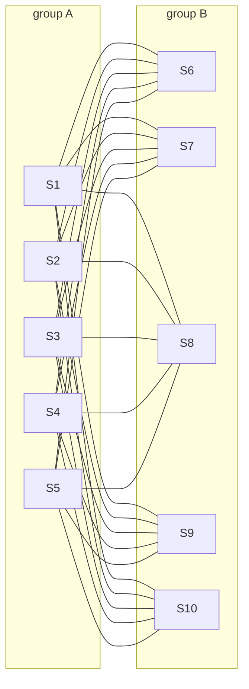
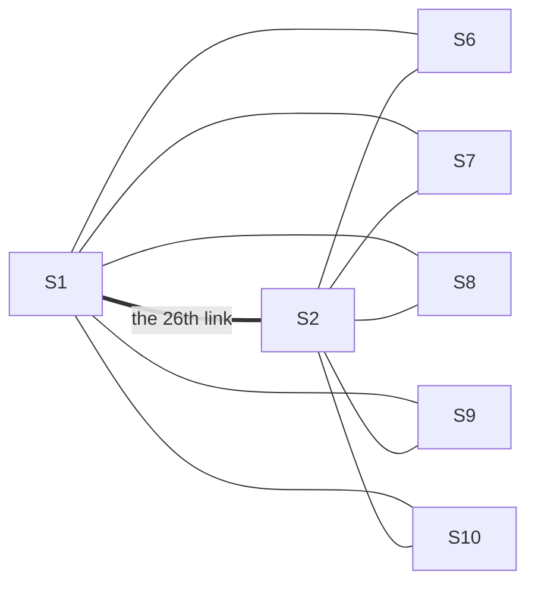

# Mantel and Turan: more than n^2/4 edges force a triangle, and the balanced multipartite graph is the most you can have without a clique

Combinatorics and graphs → Ramsey and Extremal, in Outline → The densest network with no clique → Mantel and Turan

---

## General Overview

Ten servers sit in a rack, S1 to S10. Any two can be joined by a direct cable, a link: 45 pairs, so at most 45 links. One design rule: no three servers all linked to each other, a closed trio.

Split the servers into two groups of five and link each to all five in the other group: 5 × 5 = 25 links. Any three servers include two from one group, unlinked, so no trio closes. A 26th link must join two servers in one group, both already linked to the other five: five closed trios at once.

No wiring does better. Willem Mantel proved in 1907 that 26 links on 10 servers always close a trio. Paul Turán extended it in 1941: to avoid four servers all linked, split into three groups as evenly as possible.

**A network on n points with no triangle has at most n^2/4 links, rounded down, reached only by two groups as equal as possible, fully cross-linked; to avoid r + 1 points all linked, for any whole number r, the most links come from r groups as equal as possible, fully cross-linked.**

**What kind of fact this is:** a theorem, proved on this card in Why it works, Turán's half in a folded callout.

### The picture: the 25 links, two groups of five



Every line crosses between the groups, so no trio closes.

---

## The formula

Notation first, in words. The rack is a graph: servers are vertices, links are edges, and $\lvert E\rvert$ counts the links. $K(r+1)$ names r + 1 points all linked to each other, a **clique**; $K(3)$ is the closed trio, a triangle. $K(a, b)$ names groups of a and b points with every cross pair linked. $T(n, r)$, the **Turán graph**, is n points in r groups whose sizes differ by at most one, cross pairs linked. $\lfloor x \rfloor$ rounds x down.

Mantel's theorem, for a network with no triangle:

$$\lvert E\rvert \le \left\lfloor \frac{n^2}{4} \right\rfloor$$

**Read it aloud:** a network on n points with no closed trio has at most n squared over four links, rounded down.

Turán's theorem, for a network with no $K(r+1)$:

$$\lvert E\rvert \le \text{links of } T(n, r) \le \left(1 - \frac{1}{r}\right)\frac{n^2}{2}$$

**Read it aloud:** with no r + 1 points all linked, the links are at most those of the evenly split r-group network, at most 1 − 1/r of n squared over two.

Mantel is Turán with r = 2: for 10 servers $T(10, 2)$ is $K(5, 5)$.

| Symbol | Plain meaning | In our example | Push it up and the answer… |
| --- | --- | --- | --- |
| $n$ | points (servers) | 10 | cap grows as n squared |
| $\lvert E\rvert$ | links | 25 at the cap | past it, a clique |
| $\deg(v)$, $u$, $v$ | links at v; u, v a link's ends | 5 each | — |
| $C(n, 2)$ | n choose 2: all pairs | 45 | — |
| $\sum$ | add up over what is written beneath | ten degrees squared: 250 | — |
| $K(a, b)$ | two groups, cross pairs linked | $K(5, 5)$, 25 links | uneven: fewer |
| $K(r+1)$ | r + 1 all linked: a clique | $K(3)$, a triangle | easier to avoid |
| $T(n, r)$, $r$ | Turán graph: r near-equal groups | $T(10, 3)$: 4, 3, 3 | more links |
| $\lfloor x \rfloor$ | round x down | 20.25 becomes 20 | — |

The links of $T(n, r)$ are all pairs minus the pairs inside each group: for groups of 4, 3 and 3, 45 − 6 − 3 − 3 = 33.

### When it holds

- **Plain links.** At most one per pair, none from a server to itself. Allow repeated cables and the count has no ceiling, since repeats close no trio.
- **A full clique is forbidden.** Forbid a ring of four instead and the cap is a different, much smaller count from a harder theory.
- **The cap is a best case.** A star, one hub and nine leaves, has 9 links; each of its 36 missing links closes a trio.

---

## Why it works

### Step 0: a link's two ends share no neighbour

Take a link, say S1–S6, in a network with no triangle. A server linked to both would close a trio, so their neighbours are different servers, at most n in all: $\deg(u) + \deg(v) \le n$ for every link u–v, where $\deg(v)$ counts v's links. In the two-group network, 5 + 5 = 10 = n.

### Step 1: add that inequality over every link

Add this over all links. Server v sits on $\deg(v)$ links and brings $\deg(v)$ to each, so it contributes $\deg(v)$ squared:

$$\sum_{\text{links } uv} \big(\deg(u) + \deg(v)\big) = \sum_{v} \deg(v)^2 \le n\,\lvert E\rvert$$

In the example: 25 links of 10 make 250; ten degrees of 5, squared, make 250; n × 25 = 250.

### Step 2: squares cannot be too small

The degrees add to $2\lvert E\rvert$, since each link has two ends. Numbers with a fixed total have the smallest sum of squares when all are equal, so

$$\sum_{v} \deg(v)^2 \ge \frac{(2\lvert E\rvert)^2}{n}$$

<details>
<summary>The algebra behind this</summary>

Let a be the average degree, $2\lvert E\rvert / n$. Each $(\deg(v) - a)^2$ is at least 0. Summed and expanded, that says the sum of squares minus $n a^2$ is at least 0, since the degrees add to $n a$. And $n a^2 = (2\lvert E\rvert)^2 / n$.

</details>

### Step 3: squeeze

Steps 1 and 2 hold the same sum between two bounds:

$$\frac{4\lvert E\rvert^2}{n} \le \sum_{v} \deg(v)^2 \le n\,\lvert E\rvert$$

Divide by $\lvert E\rvert$ and multiply by n/4: $\lvert E\rvert \le n^2/4$, and a whole number of links sits at or below $\lfloor n^2/4 \rfloor$. For 10 servers, 4 × 25 × 25 / 10 = 250 and the bounds meet; 26 links would push the left past the right.

Equality needs every degree n/2 and every link's ends to see all n servers, so the two neighbour sets of any link split the servers into two groups of n/2, neither linked inside, every cross pair linked: $K(5, 5)$ is the only 25-link wiring, up to relabelling. It is bipartite, so every loop is even and none is a triangle.

### The picture: where the 26th link lands



S1 and S2 share all five of group B as neighbours, so each of S6 to S10 closes a triangle with them: five from one link.

### Step 4: Turán, the same cap for bigger cliques

Forbid four servers all linked. Groups of 4, 3 and 3 give 33 links, and any four servers include two from one group, so no $K(4)$ appears. Turán's theorem says 33 is the most. The bound $(1 - 1/r)\,n^2/2$ is exact when r divides n; here it reads 33.33, and the truth is 33.

<details>
<summary>Detailed proof: Turán's theorem by removing one clique</summary>

Take G on n points with no $K(r+1)$ and the most links. For n at most r, $T(n, r)$ links every pair: nothing to prove. Otherwise G holds a $K(r)$, a set A of r points all linked: without one, any missing link could be added safely, contradicting maximality.

Count G's links in three parts. Inside A: $C(r, 2)$. From A to the other n − r points: each is linked to at most r − 1 of A, or it would complete a $K(r+1)$, so at most $(n - r)(r - 1)$. Among the other n − r: no $K(r+1)$ either, so by induction on n at most the links of $T(n - r, r)$.

Take one point from each group of $T(n, r)$: they form a $K(r)$ with $C(r, 2)$ links, each other point is linked to r − 1 of them, and what is left is $T(n - r, r)$. The parts match term by term, so G has at most the links of $T(n, r)$. With r = 2 this is a second proof of Mantel: the caps run 1, 4, 9, 16, 25 on 2, 4, 6, 8, 10 points.

</details>

A different road to a forced triangle is [friends-and-strangers](01-friends-and-strangers.md), which labels every pair of six guests; Mantel counts only the links present.

---

## Worked numbers, by hand

| Step | Arithmetic | Value |
| --- | --- | --- |
| all pairs of servers | C(10, 2) = 10 × 9 / 2 | 45 |
| Mantel's cap | 10 × 10 / 4 | **25** |
| two groups of five | 5 × 5 cross pairs | 25 |
| closed trios in it | 120 trios checked | 0 |
| triangles from a 26th link | its two ends share the other group's 5 | 5 |
| degree squeeze | 4 × 25 × 25 / 10; ten 5 × 5; 10 × 25 | 250, 250, 250 |
| no four all linked, groups 4, 3, 3 | 45 − 6 − 3 − 3 | **33** |
| Turán's share bound | (1 − 1/3) × 100 / 2 | 33.33 |

### What breaks if you drop a piece

| Mistake | Comes out at | What went wrong |
| --- | --- | --- |
| Groups of 4 and 6 | 24 links | Splits 1+9 to 5+5 give 9, 16, 21, 24, 25 |
| Stopping when stuck | 9 links, the star | Stuck is not maximum |
| Two groups, four forbidden | 25 links | Three groups give 33, 8 more |
| No rounding, 9 servers | 20.25 links | Groups of 4 and 5 give 20 |

The code prints all four.

---

## Code, from first principles, and it actually runs

Nothing is imported. Three roads: the formulas; each network built pair by pair, its 120 trios or 210 foursomes scanned; and a search of every network on up to 6 servers, 32768 on 6. The asserts demand that search and formulas agree, and that the built networks are clique-free and full.

### Python

```python
# Mantel and Turan -- the check behind the card.  Nothing is imported.  Servers are
# numbered 0 to n-1 and a link is a pair (a, b) with a < b.  Road one is the formula;
# road two builds each network pair by pair and scans every trio or foursome in it;
# road three searches every possible network on up to 6 servers.
def pairs(xs): return [(a, b) for i, a in enumerate(xs) for b in xs[i + 1:]]
def subsets(xs, k):
    return [[]] if k == 0 else [[x] + s for i, x in enumerate(xs) for s in subsets(xs[i + 1:], k - 1)]
def c2(n): return n * (n - 1) // 2
def turan(n, r):                        # road one: all pairs minus the pairs inside each group
    sizes = [n // r + (1 if i < n % r else 0) for i in range(r)]
    return c2(n) - sum(c2(s) for s in sizes), sizes
def groups_graph(sizes):                # road two: link every pair that sits in different groups
    tag = [g for g, s in enumerate(sizes) for _ in range(s)]
    return {(a, b) for (a, b) in pairs(list(range(len(tag)))) if tag[a] != tag[b]}
def cliques(links, n, k):               # every k servers that are all linked to each other
    return [q for q in subsets(list(range(n)), k) if all(p in links for p in pairs(q))]
def added(links, n, k):                 # cliques made by each missing link, added on its own
    return [len(cliques(links | {m}, n, k)) for m in pairs(list(range(n))) if m not in links]
def best(n, k):                         # road three: every network on n servers, no k all linked
    ps = pairs(list(range(n)))
    masks = [sum(1 << ps.index(p) for p in pairs(q)) for q in subsets(list(range(n)), k)]
    return max(bin(g).count("1") for g in range(1 << len(ps)) if all(g & m != m for m in masks))
N = 10
k55 = groups_graph([5, 5])
deg = [sum(1 for l in k55 if v in l) for v in range(N)]
around = [deg[a] + deg[b] for (a, b) in k55]
star, t3, t2 = groups_graph([1, 9]), groups_graph([4, 3, 3]), groups_graph([5, 5])
tri, grow, grow_star = cliques(k55, N, 3), added(k55, N, 3), added(star, N, 3)
t_formula, t_sizes = turan(N, 3)
quads, grow4 = cliques(t3, N, 4), added(t3, N, 4)
brute3, brute4 = [best(n, 3) for n in range(1, 7)], [best(n, 4) for n in range(1, 7)]
print(f"servers {N}, pairs C(10,2) = {c2(N)}")
print(f"two groups of 5, every cross pair linked: {len(k55)} links; trios all linked: {len(tri)} of {len(subsets(list(range(N)), 3))}")
print(f"Mantel's bound 10 x 10 / 4 = {N * N / 4:.2f}, rounded down: {N * N // 4}")
print(f"each of the {len(grow)} within-group links, added as a 26th: {min(grow)} to {max(grow)} triangles")
print(f"around each link deg(u) + deg(v) = {min(around)} to {max(around)}; summed over links {sum(around)}; "
      f"squared degrees {sum(d * d for d in deg)}; 4 x 25 x 25 / 10 = {4 * len(k55) ** 2 // N}")
print(f"splits 1+9 to 5+5, links: {[len(groups_graph([a, N - a])) for a in range(1, 6)]}")
print(f"star, 1 hub and 9 leaves: {len(star)} links; a triangle from each of its {len(grow_star)} missing links: {'yes' if min(grow_star) > 0 else 'no'}")
print(f"9 servers: 81 / 4 = {81 / 4:.2f}, most links with groups of 4 and 5: {len(groups_graph([4, 5]))}")
print(f"no four all linked, groups {t_sizes}: formula 45 - 6 - 3 - 3 = {t_formula}, counted pair by pair {len(t3)}")
print(f"foursomes all linked in it: {len(quads)} of {len(subsets(list(range(N)), 4))}; bound (1 - 1/3) x 100 / 2 = {(1 - 1 / 3) * N * N / 2:.2f}")
print(f"each of the {len(grow4)} within-group links, added: {min(grow4)} to {max(grow4)} foursomes all linked")
print(f"two groups instead of three, no four all linked: {len(t2)} links, {t_formula - len(t2)} short of {t_formula}")
print(f"share of all pairs, no triangle: 10 servers {N * N // 4} of {c2(N)}, 100 servers {turan(100, 2)[0]} of {c2(100)} = {turan(100, 2)[0] / c2(100):.3f}")
print(f"networks on 6 servers searched: {1 << c2(6)}")
print(f"most links with no triangle, n = 1 to 6, by search:     {brute3}")
print(f"n x n / 4 rounded down:                                  {[n * n // 4 for n in range(1, 7)]}")
print(f"most links with no four all linked, n = 1 to 6, search: {brute4}")
print(f"Turan graph, three groups, by formula:                  {[turan(n, 3)[0] for n in range(1, 7)]}")
assert brute3 == [n * n // 4 for n in range(1, 7)]                # search agrees with Mantel
assert brute4 == [turan(n, 3)[0] for n in range(1, 7)]            # search agrees with Turan
assert len(k55) == N * N // 4 and not tri and min(grow) > 0       # 25 built, triangle-free, full
assert len(t3) == t_formula and not quads and min(grow4) > 0      # 33 built, no foursome, full
print("ALL CHECKS PASS")
```

**Ran 2026-09-19 on macOS, Python 3.14.6, standard library only. All checks passed. Output, pasted from the run:**

```
servers 10, pairs C(10,2) = 45
two groups of 5, every cross pair linked: 25 links; trios all linked: 0 of 120
Mantel's bound 10 x 10 / 4 = 25.00, rounded down: 25
each of the 20 within-group links, added as a 26th: 5 to 5 triangles
around each link deg(u) + deg(v) = 10 to 10; summed over links 250; squared degrees 250; 4 x 25 x 25 / 10 = 250
splits 1+9 to 5+5, links: [9, 16, 21, 24, 25]
star, 1 hub and 9 leaves: 9 links; a triangle from each of its 36 missing links: yes
9 servers: 81 / 4 = 20.25, most links with groups of 4 and 5: 20
no four all linked, groups [4, 3, 3]: formula 45 - 6 - 3 - 3 = 33, counted pair by pair 33
foursomes all linked in it: 0 of 210; bound (1 - 1/3) x 100 / 2 = 33.33
each of the 12 within-group links, added: 9 to 12 foursomes all linked
two groups instead of three, no four all linked: 25 links, 8 short of 33
share of all pairs, no triangle: 10 servers 25 of 45, 100 servers 2500 of 4950 = 0.505
networks on 6 servers searched: 32768
most links with no triangle, n = 1 to 6, by search:     [0, 1, 2, 4, 6, 9]
n x n / 4 rounded down:                                  [0, 1, 2, 4, 6, 9]
most links with no four all linked, n = 1 to 6, search: [0, 1, 3, 5, 8, 12]
Turan graph, three groups, by formula:                  [0, 1, 3, 5, 8, 12]
ALL CHECKS PASS
```

### Rust

Same numbers, same labels, built with `rustc --edition 2021 -O`.

```rust
// Mantel and Turan -- the same check as the Python, in Rust.  No crates.  Servers are
// numbered 0 to n-1 and a link is a pair (a, b) with a < b.  Road one is the formula;
// road two builds each network pair by pair and scans every trio or foursome in it;
// road three searches every possible network on up to 6 servers.
use std::collections::BTreeSet;
type Links = BTreeSet<(usize, usize)>;
fn pairs(xs: &[usize]) -> Vec<(usize, usize)> {
    (0..xs.len()).flat_map(|i| (i + 1..xs.len()).map(move |j| (xs[i], xs[j]))).collect()
}
fn subsets(xs: &[usize], k: usize) -> Vec<Vec<usize>> {
    if k == 0 { return vec![vec![]] }
    (0..xs.len()).flat_map(|i| subsets(&xs[i + 1..], k - 1).into_iter()
        .map(move |mut s| { s.insert(0, xs[i]); s })).collect()
}
fn c2(n: usize) -> usize { n * n.saturating_sub(1) / 2 }
fn turan(n: usize, r: usize) -> (usize, Vec<usize>) {   // road one: all pairs minus pairs inside groups
    let sizes: Vec<usize> = (0..r).map(|i| n / r + if i < n % r { 1 } else { 0 }).collect();
    (c2(n) - sizes.iter().map(|&s| c2(s)).sum::<usize>(), sizes)
}
fn groups_graph(sizes: &[usize]) -> Links {             // road two: link every pair in different groups
    let tag: Vec<usize> = sizes.iter().enumerate().flat_map(|(g, &s)| vec![g; s]).collect();
    let all: Vec<usize> = (0..tag.len()).collect();
    pairs(&all).into_iter().filter(|&(a, b)| tag[a] != tag[b]).collect()
}
fn cliques(links: &Links, n: usize, k: usize) -> Vec<Vec<usize>> {
    let all: Vec<usize> = (0..n).collect();
    subsets(&all, k).into_iter().filter(|q| pairs(q).iter().all(|p| links.contains(p))).collect()
}
fn added(links: &Links, n: usize, k: usize) -> Vec<usize> {   // cliques made by each missing link
    let all: Vec<usize> = (0..n).collect();
    pairs(&all).into_iter().filter(|m| !links.contains(m))
        .map(|m| { let mut l = links.clone(); l.insert(m); cliques(&l, n, k).len() }).collect()
}
fn best(n: usize, k: usize) -> usize {                  // road three: every network on n servers
    let all: Vec<usize> = (0..n).collect();
    let ps = pairs(&all);
    let masks: Vec<u32> = subsets(&all, k).iter()
        .map(|q| pairs(q).iter().map(|p| 1u32 << ps.iter().position(|x| x == p).unwrap()).sum()).collect();
    (0u32..1 << ps.len()).filter(|g| masks.iter().all(|&m| g & m != m)).map(|g| g.count_ones() as usize).max().unwrap()
}
fn main() {
    let n = 10;
    let all: Vec<usize> = (0..n).collect();
    let k55 = groups_graph(&[5, 5]);
    let deg: Vec<usize> = (0..n).map(|v| k55.iter().filter(|&&(a, b)| a == v || b == v).count()).collect();
    let around: Vec<usize> = k55.iter().map(|&(a, b)| deg[a] + deg[b]).collect();
    let (star, t3, t2) = (groups_graph(&[1, 9]), groups_graph(&[4, 3, 3]), groups_graph(&[5, 5]));
    let (tri, grow, grow_star) = (cliques(&k55, n, 3), added(&k55, n, 3), added(&star, n, 3));
    let (t_formula, t_sizes) = turan(n, 3);
    let (quads, grow4) = (cliques(&t3, n, 4), added(&t3, n, 4));
    let (brute3, brute4): (Vec<usize>, Vec<usize>) = ((1..7).map(|m| best(m, 3)).collect(), (1..7).map(|m| best(m, 4)).collect());
    let (mn, mx) = (|v: &Vec<usize>| *v.iter().min().unwrap(), |v: &Vec<usize>| *v.iter().max().unwrap());
    let (floor4, tur): (Vec<usize>, Vec<usize>) = ((1..7).map(|m| m * m / 4).collect(), (1..7).map(|m| turan(m, 3).0).collect());
    println!("servers {}, pairs C(10,2) = {}", n, c2(n));
    println!("two groups of 5, every cross pair linked: {} links; trios all linked: {} of {}", k55.len(), tri.len(), subsets(&all, 3).len());
    println!("Mantel's bound 10 x 10 / 4 = {:.2}, rounded down: {}", (n * n) as f64 / 4.0, n * n / 4);
    println!("each of the {} within-group links, added as a 26th: {} to {} triangles", grow.len(), mn(&grow), mx(&grow));
    println!("around each link deg(u) + deg(v) = {} to {}; summed over links {}; squared degrees {}; 4 x 25 x 25 / 10 = {}",
             mn(&around), mx(&around), around.iter().sum::<usize>(), deg.iter().map(|d| d * d).sum::<usize>(), 4 * k55.len() * k55.len() / n);
    println!("splits 1+9 to 5+5, links: {:?}", (1..6).map(|a| groups_graph(&[a, n - a]).len()).collect::<Vec<_>>());
    println!("star, 1 hub and 9 leaves: {} links; a triangle from each of its {} missing links: {}", star.len(), grow_star.len(), if mn(&grow_star) > 0 { "yes" } else { "no" });
    println!("9 servers: 81 / 4 = {:.2}, most links with groups of 4 and 5: {}", 81.0 / 4.0, groups_graph(&[4, 5]).len());
    println!("no four all linked, groups {:?}: formula 45 - 6 - 3 - 3 = {}, counted pair by pair {}", t_sizes, t_formula, t3.len());
    println!("foursomes all linked in it: {} of {}; bound (1 - 1/3) x 100 / 2 = {:.2}", quads.len(), subsets(&all, 4).len(), (1.0 - 1.0 / 3.0) * (n * n) as f64 / 2.0);
    println!("each of the {} within-group links, added: {} to {} foursomes all linked", grow4.len(), mn(&grow4), mx(&grow4));
    println!("two groups instead of three, no four all linked: {} links, {} short of {}", t2.len(), t_formula - t2.len(), t_formula);
    println!("share of all pairs, no triangle: 10 servers {} of {}, 100 servers {} of {} = {:.3}", n * n / 4, c2(n), turan(100, 2).0, c2(100), turan(100, 2).0 as f64 / c2(100) as f64);
    println!("networks on 6 servers searched: {}", 1u32 << c2(6));
    println!("most links with no triangle, n = 1 to 6, by search:     {:?}", brute3);
    println!("n x n / 4 rounded down:                                  {:?}", floor4);
    println!("most links with no four all linked, n = 1 to 6, search: {:?}", brute4);
    println!("Turan graph, three groups, by formula:                  {:?}", tur);
    assert!(brute3 == floor4);                                          // search agrees with Mantel
    assert!(brute4 == tur);                                             // search agrees with Turan
    assert!(k55.len() == n * n / 4 && tri.is_empty() && mn(&grow) > 0); // 25 built, triangle-free, full
    assert!(t3.len() == t_formula && quads.is_empty() && mn(&grow4) > 0); // 33 built, no foursome, full
    println!("ALL CHECKS PASS");
}
```

**Ran 2026-09-19 on macOS, rustc 1.98.1, no crates. All checks passed. Output, pasted from the run:**

```
servers 10, pairs C(10,2) = 45
two groups of 5, every cross pair linked: 25 links; trios all linked: 0 of 120
Mantel's bound 10 x 10 / 4 = 25.00, rounded down: 25
each of the 20 within-group links, added as a 26th: 5 to 5 triangles
around each link deg(u) + deg(v) = 10 to 10; summed over links 250; squared degrees 250; 4 x 25 x 25 / 10 = 250
splits 1+9 to 5+5, links: [9, 16, 21, 24, 25]
star, 1 hub and 9 leaves: 9 links; a triangle from each of its 36 missing links: yes
9 servers: 81 / 4 = 20.25, most links with groups of 4 and 5: 20
no four all linked, groups [4, 3, 3]: formula 45 - 6 - 3 - 3 = 33, counted pair by pair 33
foursomes all linked in it: 0 of 210; bound (1 - 1/3) x 100 / 2 = 33.33
each of the 12 within-group links, added: 9 to 12 foursomes all linked
two groups instead of three, no four all linked: 25 links, 8 short of 33
share of all pairs, no triangle: 10 servers 25 of 45, 100 servers 2500 of 4950 = 0.505
networks on 6 servers searched: 32768
most links with no triangle, n = 1 to 6, by search:     [0, 1, 2, 4, 6, 9]
n x n / 4 rounded down:                                  [0, 1, 2, 4, 6, 9]
most links with no four all linked, n = 1 to 6, search: [0, 1, 3, 5, 8, 12]
Turan graph, three groups, by formula:                  [0, 1, 3, 5, 8, 12]
ALL CHECKS PASS
```

The two outputs match line for line.

> [!TIP]
> **Try changing**
> Guess first, then run it. The asserts are pinned to the rack of ten, so one will stop the program.
> - **Unbalance the groups.** Set `k55 = groups_graph([4, 6])`: 24 links, no triangle, and the third assert stops it.
> - **Forbid five, not four.** Change `best(n, 4)` to `best(n, 5)`: the search gives 0, 1, 3, 6, 9, 13, Turán with four groups, and the second assert stops it.
> - **Split three ways badly.** Set the three groups to `[4, 4, 2]`: 32 links against the formula's 33; the fourth assert stops it.

---

## The usual mistake

> [!warning]
> **Taking a network that cannot grow for one that is full.** The star on 10 servers has 9 links, and any added link closes a trio. It is stuck, yet the two-group wiring holds 16 more.
>
> - **Reading the cap as a force.** 25 links on 10 servers can avoid a triangle; 26 cannot.

---

## Where you meet it in real life

- **Social networks.** More than n^2/4 friendships among n people guarantee three mutual friends.
- **Extremal combinatorics.** The most links avoiding a shape is the field's founding question; [probabilistic-method-by-counting](03-probabilistic-method-by-counting.md) proves shape-avoiding networks exist without building them.

> **Say it back**
> With no triangle, a link's two ends share no neighbour, so their degrees add to at most n. Summed over links, that caps the links at n squared over four. Ten servers take 25, as two groups of five cross-linked; a 26th closes five triangles. To avoid r + 1 all linked, cut into r equal groups: 4, 3 and 3 give 33.

---

## What this builds on

- [degree-and-handshaking](../09-Graphs%20-%20Dots%20and%20Lines/02-degree-and-handshaking.md): degrees add to twice the links, used in Step 2.
- [bipartite-graphs-and-odd-cycles](../09-Graphs%20-%20Dots%20and%20Lines/05-bipartite-graphs-and-odd-cycles.md): two-sided networks have only even loops, so no triangle.
- [n-choose-k](../01-Counting%20Principles/05-n-choose-k.md): C(10, 2) = 45 possible links.

## Where this goes next

- erdos-problems-selected: Erdős's open extremal questions, including the densest network with no ring of four.
- [probabilistic-method](../../09-Probability%20and%20statistics/14-Random%20Graphs%20and%20the%20Probabilistic%20Method/03-probabilistic-method.md): networks that avoid a shape, shown to exist by chance and averages rather than built.

Turán settles every full clique; for a shape that is not one, such as a ring of four, the densest count is known only roughly, and that open ground is where Erdős-style extremal problems begin.

---

## Sources

Verified 2026-09-24: every link below opens a page naming the cited work.

- Aigner, Martin, and Günter M. Ziegler. *Proofs from THE BOOK*, 6th ed. Springer, 2018. [Publisher page](https://link.springer.com/book/10.1007/978-3-662-57265-8). A chapter of proofs of Turán's graph theorem.
- Bollobás, Béla. *Extremal Graph Theory*. Dover, 2004. [Publisher page](https://store.doverpublications.com/products/9780486435961). The standard monograph on the field.
- Diestel, Reinhard. *Graph Theory*. Springer. [Author's book page](https://diestel-graph-theory.com/). Its extremal chapter opens with Turán's theorem.
- O'Connor, J. J., and E. F. Robertson. "Paul Turán." MacTutor Archive, University of St Andrews. [Biography](https://mathshistory.st-andrews.ac.uk/Biographies/Turan/). The labour-camp years where several of his theorems began.
