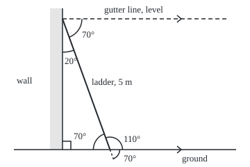

# Angles: what a degree measures and why parallel lines copy angles

Geometry and trig → Angles, Triangles and Congruence → Turning and copying angles → Angles

---

## General Overview

A 5 m ladder leans on an upright house wall over level ground. Its foot sits 1.710 m out from the wall; its top rests 4.698 m up. Between ladder and ground, on the wall side, the angle is 70 degrees.

An angle is an amount of turning. At the foot, a sight line along the ground towards the wall, swung up until it runs along the ladder, turns through 70 degrees. The unit is the degree, one 360th of a full turn. So 70 degrees is 70/360 = 7/36 of a turn, about 0.194.

One measured angle fixes the rest. On the far side of the foot the angle is 110 degrees. The gutter line at the top runs level, so it is parallel to the ground (it never meets it), and the ladder crosses it at 70 degrees again. Ladder and wall meet at 20 degrees. No protractor is needed: a straight line is half a turn, and parallel lines copy angles.

**An angle measures turning, with 360 degrees to a full turn; angles that share a straight line add to 180 degrees, and a line crossing two parallel lines meets both at the same angle.**

**What kind of fact this is:** the degree is a definition; the rules for crossing lines and parallels are theorems, proved on this card in Why it works from one assumption about flat ground, the parallel postulate.

### The picture: the ladder, the ground and the gutter line

<p align="center"></p>

Drawn to scale, 1 m = 40 units: the top at (90, 27.06), the foot at (158.40, 215), and the ladder's line continued 0.4 m past the foot to (163.88, 230.04). Arrowheads mark the parallels; the square marks the right angle.

---

## The formula

Notation first, in words. The small circle ° is the degree sign: 70° means 70 degrees. The Greek letter theta, $\theta$, names the measured angle. Two angles making a straight line together, 180°, are **supplementary**; two making a right angle, 90°, are **complementary**. The two angles facing each other where two lines cross are **vertical angles** (they share a vertex, the corner point; nothing to do with upright). A line crossing two others is a **transversal**: the ladder crosses the ground and the gutter line.

$$s = 180^\circ - \theta \qquad v = \theta \qquad c = a = \theta \qquad i = 180^\circ - \theta \qquad w = 90^\circ - \theta$$

**Read it aloud:** a neighbour on a straight line takes what is left of 180°; the angle across a crossing is equal; a parallel line is met at the same angle in the matching corner and the opposite inside corner, and at what is left of 180° in the same-side inside corner; the wall gets what is left of 90°.

| Symbol | Plain meaning | In our example | Push it up and the answer… |
| --- | --- | --- | --- |
| $\theta$ | the measured angle, ladder to ground, wall side | 70° | the ladder stands steeper |
| $s$ | the supplement: neighbour on the same straight line | 110°, foot, far side | falls |
| $v$ | the vertical angle, facing $\theta$ across the foot | 70°, below ground | rises with it |
| $c$ | the corresponding angle: same corner position at the gutter line | 70°, above it, wall side | rises with it |
| $a$ | the alternate angle: inside the parallels, other side of the ladder | 70°, below it, away from wall | rises with it |
| $i$ | the co-interior angle: inside the parallels, same side | 110°, below it, wall side | falls |
| $w$ | the angle between ladder and wall | 20° | falls |
| $^\circ$ | the degree: one 360th of a full turn | 360° in a turn | a unit, not a quantity |

Angle types: under 90° is **acute** (20°, 70°); exactly 90° is **right**; between 90° and 180° is **obtuse** (110°); exactly 180° is **straight**; over 180° is **reflex**, such as the 290° the long way round from ground to ladder.

### When it holds

- **A flat plane.** On a sphere two meridians both cross the equator at 90° and still meet at the pole.
- **Truly parallel lines.** A gutter rising 2° away from the wall is met at 72°, not 70°.
- **Straight lines.** A ladder bowed under load has no single angle with the ground.

---

## Why it works

### Step 0: an angle is a share of one full turn

An angle is a ratio: turning done over one full turn ([ratios-and-rates](../../01-Foundations/01-Everyday%20Arithmetic/09-ratios-and-rates.md)). The degree fixes the denominator at 360. Two consequences carry the rest: a straight line is half a turn, 180°, and an upright wall on level ground is a quarter turn, 90°.

<details>
<summary>Why 360 and not 100?</summary>

Babylonian astronomy counted in sixties, and 360 stayed because it splits well: it has 24 whole-number divisors, 100 has 9. Halves, thirds, quarters, fifths, sixths, eighths, ninths, tenths and twelfths of a turn are whole degrees.

</details>

### Step 1: angles on a straight line add to 180°

The ground is a straight line. At the foot the ladder splits its half turn into 70° towards the wall and the rest: 180° − 70° = 110°. That is $s = 180^\circ - \theta$.

### Step 2: vertical angles are equal

Continue the ladder's line past its foot into the ground; the two lines now cross, making four angles. The 70° angle and the one facing it below ground each share a straight line with the same 110° angle, so each is 180° − 110°: $v = \theta$. Round the crossing: 70 + 110 + 70 + 110 = 360. This is Euclid's Book I, Proposition 15.

### Step 3: a transversal meets parallel lines at the same angle

The gutter line and the ground are both level, so they never meet: they are parallel. Treat each as a full line, running on through the wall on paper. The claim: the ladder crosses the gutter line at 70°, in the same corner position as at the foot. Slide the ground up the ladder without turning it and it lands on the gutter line, angle and all. Proving it lands exactly there needs one assumption about the plane.

The **parallel postulate**, in John Playfair's form: through a point off a line there is exactly one line that never meets it. It cannot be proved from Euclid's other assumptions; it is what makes the plane flat. With it, $c = \theta$ follows: a line through the top at exactly 70° is itself parallel to the ground, so it must be the gutter line.

<details>
<summary>Detailed proof: corresponding angles on parallel lines are equal</summary>

Let the ground be g and the gutter line ℓ, parallel, and let the ladder cross g at the foot F and ℓ at the top T. Suppose the corresponding angle at T were not 70°.

Through T draw the line m that does make 70° with the ladder in the corresponding position. Suppose m met g at a point X. Then F, T and X are the corners of a triangle. Swapping one of the two equal 70° angles for its vertical angle (Step 2) makes one of them an exterior angle of that triangle (outside it, beside a corner) and the other an interior angle at a different corner. But an exterior angle of a triangle is larger than each interior angle at the other two corners: Euclid's Book I, Proposition 16, which uses no parallels. So m never meets g.

Now m and ℓ are two different lines through T, both parallel to g. The parallel postulate says only one exists. So the assumption was false, and the corresponding angle at T is 70°. This is Euclid's Book I, Proposition 29.

</details>

### Step 4: the alternate and co-interior angles come free

At the top, the alternate angle (below the gutter line, away from the wall) faces the corresponding angle across the crossing, so by Step 2 it is 70°: $a = \theta$. The co-interior angle (below the gutter line, wall side) shares a straight line with it, so by Step 1 it is 110°: $i = 180^\circ - \theta$.

### Step 5: the angle against the wall

The wall meets the ground at 90° and crosses the gutter line too, so by Step 3 it meets the gutter line at 90°. At the top the ladder splits that right angle into the alternate angle, 70°, and the angle against the wall: $w = 90^\circ - 70^\circ = 20^\circ$.

Step 3 also runs backwards: equal corresponding angles make two lines parallel. That direction needs only Proposition 16, not the postulate. It is how parallels are drawn with a set square or a compass: [ruler-and-compass-constructions](../06-Beyond%20Euclid/03-ruler-and-compass-constructions.md).

---

## Worked numbers, by hand

| Step | Arithmetic | Value |
| --- | --- | --- |
| the measured angle | ladder to ground, wall side | 70° |
| as a share of a turn | 70/360 = 7/36 | 0.194 turn |
| foot, far side | 180 − 70, straight line | 110° |
| foot, across the crossing | vertical angle | 70° |
| top, above gutter line, wall side | corresponding angle | 70° |
| top, below gutter line, away from wall | alternate angle | 70° |
| top, below gutter line, wall side | 180 − 70, co-interior | 110° |
| top, ladder to wall | 90 − 70 | **20°** |

A ladder at 70° to the ground leans 20° off the wall; every angle at its ends is 70° or 110°.

### What breaks if you drop a piece

| Mistake | Comes out at | What went wrong |
| --- | --- | --- |
| Copying the ground angle onto the wall | 70°, true 20° | Wall and ground are not parallel |
| A gutter rising 2° | 72°, not 70° | Not parallel: the angle shifts by the tilt |
| Co-interior angle taken as equal | 70°, true 110° | Same-side inside angles add to 180° |

---

## Code, from first principles, and it actually runs

Two roads reach every angle. Road one is the card's arithmetic: 180 − 70, 90 − 70, and copies of 70. Road two never uses those rules. It puts wall and ground on a grid in metres, places the ladder by bisection (halving an interval until it reads 70°), then measures every other angle off the coordinates with a protractor built from the dot product and a determinant. Adding unit vectors along an angle's two sides halves it; after 30 halvings the sliver's slope is proportional to its size. It is calibrated on a square's diagonal, 45°, and tested on an equilateral triangle's corner, 60°. Four asserts: measured angles match the arithmetic, the foot's four total 360, a tilted gutter shifts the copy by the tilt, and the protractor passes its test.

### Python

```python
# Angles and parallel lines: the check behind the card. Standard library only.
# A 5 m ladder leans on a wall at 70 degrees to level ground. Road one is the
# card's arithmetic. Road two puts the ladder on a grid (metres, y up) and
# measures every angle with a protractor written here from the grid alone.
THETA, L = 70, 5.0

def atan(t):                        # size of the angle of slope t (0..1), arbitrary unit
    for _ in range(30):             # halve it: the bisector of (1, 0) and (1, t) is their
        t = t / (1 + (1 + t * t) ** 0.5)          # unit vectors added, slope t / (1 + |(1, t)|)
    return t * 2 ** 30              # a sliver's slope is proportional to its size

def deg(t):                         # calibrated by the square's diagonal: 45 degrees
    return 45 * atan(t) / atan(1)

def angle(u, v):                    # protractor: angle between two directions, 0..180
    c = u[0] * v[0] + u[1] * v[1]                 # dot product
    s = abs(u[0] * v[1] - u[1] * v[0])            # determinant, made positive
    if c >= s: return deg(s / c)
    if c > -s: return 90 - deg(c / s)
    return 180 - deg(s / -c)

def slope_for(target):              # bisection: rise per unit run giving `target` degrees
    lo, hi = 0.0, 100.0
    for _ in range(200):
        mid = (lo + hi) / 2
        lo, hi = (mid, hi) if angle((1, 0), (1, mid)) < target else (lo, mid)
    return lo
def sub(p, q): return (p[0] - q[0], p[1] - q[1])
def kind(a): return "acute" if a < 90 else "right" if a == 90 else "obtuse" if a < 180 else "straight" if a == 180 else "reflex"

k = slope_for(THETA)                              # road two: place the ladder
d = L / (1 + k * k) ** 0.5; h = k * d
O, F, T, G = (0, 0), (d, 0), (0, h), (4, h)        # wall base, foot, top, a gutter point
E = (d + 0.4 * d / L, -0.4 * h / L)               # the ladder's line 0.4 m past the foot
rows = [("foot, far side (straight line)", 180 - THETA, angle(sub((9, 0), F), sub(T, F))),
        ("foot, across (vertical)", THETA, angle(sub((9, 0), F), sub(E, F))),
        ("top, gutter to ladder (alternate)", THETA, angle(sub(G, T), sub(F, T))),
        ("top, above the line (corresponding)", THETA, angle(sub(T, G), sub(T, F))),
        ("top, gutter side (co-interior)", 180 - THETA, angle(sub(T, G), sub(F, T))),
        ("top, ladder to wall", 90 - THETA, angle(sub(O, T), sub(F, T)))]
round_foot = angle(sub(O, F), sub(T, F)) + rows[0][2] + rows[1][2] + angle(sub(O, F), sub(E, F))
m = slope_for(2); tilted = angle((4, 4 * m), sub(F, T))    # gutter rising 2 degrees
assert all(abs(grid - synth) < 1e-9 for _, synth, grid in rows)
assert abs(round_foot - 360) < 1e-9
assert abs(tilted - (THETA + 2)) < 1e-9
equi = angle((1, 0), (1, 3 ** 0.5))                   # equilateral corner, true 60
assert abs(equi - 60) < 1e-9
print("turn: full 360, straight 180, right 90; divisors of 360:", sum(360 % n == 0 for n in range(1, 361)), "of 100:", sum(100 % n == 0 for n in range(1, 101)))
print(f"ladder {THETA} degrees = 7/36 of a turn = {THETA / 360:.3f} turn")
print(f"ladder 5 m: foot {d:.3f} m from wall, top {h:.3f} m up, foot/length {d / L:.3f}")
print(f"figure, 1 m = 40 units: top (90, {215 - 40 * h:.2f}), foot ({90 + 40 * d:.2f}, 215), extension 0.4 m ({90 + 40 * E[0]:.2f}, {215 - 40 * E[1]:.2f})")
for name, synth, grid in rows: print(f"{name}: synthetic {synth}, grid {grid:.3f}")
print(f"four angles round the foot, grid: {round_foot:.3f}")
print(f"protractor test, square diagonal: {angle((1, 0), (1, 1)):.3f}, equilateral corner: {equi:.3f}")
print("types:", ", ".join(f"{a} {kind(a)}" for a in (20, 70, 90, 110, 180, 360 - THETA)))
print(f"quarter-length rule: {angle((-1, 0), (-1, 15 ** 0.5)):.3f} degrees")
print(f"what breaks: wall angle copied from ground: {THETA}, true {90 - THETA}")
print(f"what breaks: gutter rising 2 degrees: copied angle {tilted:.3f}, not {THETA}")
print(f"what breaks: co-interior taken as equal: {THETA}, true {180 - THETA}")
print("ALL CHECKS PASS")
```

**Ran 2026-09-24 on macOS, Python 3.14.6, standard library only. All checks passed. Output, pasted from the run:**

```
turn: full 360, straight 180, right 90; divisors of 360: 24 of 100: 9
ladder 70 degrees = 7/36 of a turn = 0.194 turn
ladder 5 m: foot 1.710 m from wall, top 4.698 m up, foot/length 0.342
figure, 1 m = 40 units: top (90, 27.06), foot (158.40, 215), extension 0.4 m (163.88, 230.04)
foot, far side (straight line): synthetic 110, grid 110.000
foot, across (vertical): synthetic 70, grid 70.000
top, gutter to ladder (alternate): synthetic 70, grid 70.000
top, above the line (corresponding): synthetic 70, grid 70.000
top, gutter side (co-interior): synthetic 110, grid 110.000
top, ladder to wall: synthetic 20, grid 20.000
four angles round the foot, grid: 360.000
protractor test, square diagonal: 45.000, equilateral corner: 60.000
types: 20 acute, 70 acute, 90 right, 110 obtuse, 180 straight, 290 reflex
quarter-length rule: 75.522 degrees
what breaks: wall angle copied from ground: 70, true 20
what breaks: gutter rising 2 degrees: copied angle 72.000, not 70
what breaks: co-interior taken as equal: 70, true 110
ALL CHECKS PASS
```

### Rust

```rust
// Angles and parallel lines: the check behind the card. std only.
// A 5 m ladder leans on a wall at 70 degrees to level ground. Road one is the
// card's arithmetic. Road two puts the ladder on a grid (metres, y up) and
// measures every angle with a protractor written here from the grid alone.
const THETA: i32 = 70;
const L: f64 = 5.0;
type P = (f64, f64);

fn atan(mut t: f64) -> f64 { // size of the angle of slope t (0..1), arbitrary unit
    // halve it 30 times: the bisector of (1, 0) and (1, t) is their unit vectors added
    for _ in 0..30 { t = t / (1.0 + (1.0 + t * t).sqrt()); }
    t * 2f64.powi(30) // a sliver's slope is proportional to its size
}
fn deg(t: f64) -> f64 { 45.0 * atan(t) / atan(1.0) } // calibrated by the square's diagonal
fn angle(u: P, v: P) -> f64 { // protractor: angle between two directions, 0..180
    let c = u.0 * v.0 + u.1 * v.1; // dot product
    let s = (u.0 * v.1 - u.1 * v.0).abs(); // determinant, made positive
    if c >= s { deg(s / c) } else if c > -s { 90.0 - deg(c / s) } else { 180.0 - deg(s / -c) }
}
fn slope_for(target: f64) -> f64 { // bisection: rise per unit run giving `target` degrees
    let (mut lo, mut hi) = (0.0, 100.0);
    for _ in 0..200 {
        let mid = (lo + hi) / 2.0;
        if angle((1.0, 0.0), (1.0, mid)) < target { lo = mid } else { hi = mid }
    }
    lo
}
fn sub(p: P, q: P) -> P { (p.0 - q.0, p.1 - q.1) }
fn kind(a: i32) -> &'static str {
    if a < 90 { "acute" } else if a == 90 { "right" } else if a < 180 { "obtuse" } else if a == 180 { "straight" } else { "reflex" }
}

fn main() {
    let th = THETA as f64;
    let k = slope_for(th); // road two: place the ladder
    let d = L / (1.0 + k * k).sqrt();
    let h = k * d;
    let (o, f, t, g) = ((0.0, 0.0), (d, 0.0), (0.0, h), (4.0, h)); // wall base, foot, top, a gutter point
    let e = (d + 0.4 * d / L, -0.4 * h / L); // the ladder's line 0.4 m past the foot
    let rows = [("foot, far side (straight line)", 180 - THETA, angle(sub((9.0, 0.0), f), sub(t, f))),
        ("foot, across (vertical)", THETA, angle(sub((9.0, 0.0), f), sub(e, f))),
        ("top, gutter to ladder (alternate)", THETA, angle(sub(g, t), sub(f, t))),
        ("top, above the line (corresponding)", THETA, angle(sub(t, g), sub(t, f))),
        ("top, gutter side (co-interior)", 180 - THETA, angle(sub(t, g), sub(f, t))),
        ("top, ladder to wall", 90 - THETA, angle(sub(o, t), sub(f, t)))];
    let round_foot = angle(sub(o, f), sub(t, f)) + rows[0].2 + rows[1].2 + angle(sub(o, f), sub(e, f));
    let m = slope_for(2.0);
    let tilted = angle((4.0, 4.0 * m), sub(f, t)); // gutter rising 2 degrees
    assert!(rows.iter().all(|r| (r.2 - r.1 as f64).abs() < 1e-9));
    assert!((round_foot - 360.0).abs() < 1e-9);
    assert!((tilted - (th + 2.0)).abs() < 1e-9);
    let equi = angle((1.0, 0.0), (1.0, 3f64.sqrt())); // equilateral corner, true 60
    assert!((equi - 60.0).abs() < 1e-9);
    let divs = |n: i32| (1..=n).filter(|x| n % x == 0).count();
    println!("turn: full 360, straight 180, right 90; divisors of 360: {} of 100: {}", divs(360), divs(100));
    println!("ladder {} degrees = 7/36 of a turn = {:.3} turn", THETA, th / 360.0);
    println!("ladder 5 m: foot {:.3} m from wall, top {:.3} m up, foot/length {:.3}", d, h, d / L);
    println!("figure, 1 m = 40 units: top (90, {:.2}), foot ({:.2}, 215), extension 0.4 m ({:.2}, {:.2})",
        215.0 - 40.0 * h, 90.0 + 40.0 * d, 90.0 + 40.0 * e.0, 215.0 - 40.0 * e.1);
    for (name, synth, grid) in rows.iter() { println!("{}: synthetic {}, grid {:.3}", name, synth, grid); }
    println!("four angles round the foot, grid: {:.3}", round_foot);
    println!("protractor test, square diagonal: {:.3}, equilateral corner: {:.3}", angle((1.0, 0.0), (1.0, 1.0)), equi);
    let types: Vec<String> = [20, 70, 90, 110, 180, 360 - THETA].iter().map(|a| format!("{} {}", a, kind(*a))).collect();
    println!("types: {}", types.join(", "));
    println!("quarter-length rule: {:.3} degrees", angle((-1.0, 0.0), (-1.0, 15f64.sqrt())));
    println!("what breaks: wall angle copied from ground: {}, true {}", THETA, 90 - THETA);
    println!("what breaks: gutter rising 2 degrees: copied angle {:.3}, not {}", tilted, THETA);
    println!("what breaks: co-interior taken as equal: {}, true {}", THETA, 180 - THETA);
    println!("ALL CHECKS PASS");
}
```

**Ran 2026-09-24 on macOS, rustc 1.98.1, no crates. All checks passed. Output, pasted from the run:**

```
turn: full 360, straight 180, right 90; divisors of 360: 24 of 100: 9
ladder 70 degrees = 7/36 of a turn = 0.194 turn
ladder 5 m: foot 1.710 m from wall, top 4.698 m up, foot/length 0.342
figure, 1 m = 40 units: top (90, 27.06), foot (158.40, 215), extension 0.4 m (163.88, 230.04)
foot, far side (straight line): synthetic 110, grid 110.000
foot, across (vertical): synthetic 70, grid 70.000
top, gutter to ladder (alternate): synthetic 70, grid 70.000
top, above the line (corresponding): synthetic 70, grid 70.000
top, gutter side (co-interior): synthetic 110, grid 110.000
top, ladder to wall: synthetic 20, grid 20.000
four angles round the foot, grid: 360.000
protractor test, square diagonal: 45.000, equilateral corner: 60.000
types: 20 acute, 70 acute, 90 right, 110 obtuse, 180 straight, 290 reflex
quarter-length rule: 75.522 degrees
what breaks: wall angle copied from ground: 70, true 20
what breaks: gutter rising 2 degrees: copied angle 72.000, not 70
what breaks: co-interior taken as equal: 70, true 110
ALL CHECKS PASS
```

The two outputs are identical line for line.

> [!TIP]
> **Try changing**
> - **Set THETA to 40.** Guess first: does an assert fail? None does; the rules hold for any angle.
> - **Raise one end of the gutter: G = (4, h + 0.1).** Guess first. The first assert fails: the gutter is no longer parallel.
> - **Change 45 to 46 in the protractor.** Guess first. The 70s and 110s still agree, since a miscalibrated protractor agrees with itself; only the equilateral test fails. A tool checked only against itself proves nothing.

---

## The usual mistake

> [!warning]
> **Copying an angle between lines that are not parallel.** The ladder meets the ground at 70°, so it seems to meet the wall at 70° too. Wall and ground are not parallel, and the true answer is 20°. Before copying an angle, name the two parallel lines and the transversal.
>
> - **"Vertical" read as upright.** Vertical angles face each other across a crossing, whatever the lines' direction.
> - **Reflex angles forgotten.** Two rays make two angles, 70° and 290°; "the angle" means the smaller unless stated.

---

## Where you meet it in real life

- **Ladder safety.** US workplace rules (OSHA) put a leaning ladder's foot about a quarter of its working length out: 75.522° to the ground. The 70° ladder has its foot 0.342 of its length out, shallower than advised.
- **Navigation.** North lines on a map are parallel, so a bearing is the same wherever it is read; the route back differs by 180°.
- **Measuring the Earth.** Sunlight arrives in near-parallel rays, so alternate angles turned a shadow's angle at one city into the angle between two cities at the Earth's centre: Eratosthenes' estimate of its size.

> **Say it back**
> An angle is a share of a full turn, and a degree is one 360th of it. Angles on a straight line add to 180°, so vertical angles, which share a neighbour, are equal. A line crossing two parallel lines meets both at the same angle; that is where the flatness of the plane enters, through the parallel postulate. So a ladder at 70° to level ground meets a level gutter at 70° and the upright wall at 20°.

---

## What this builds on

- [ratios-and-rates](../../01-Foundations/01-Everyday%20Arithmetic/09-ratios-and-rates.md): an angle is a ratio, turning done over a full turn.

## Where this goes next

- [triangle-angle-sum-and-inequality](02-triangle-angle-sum-and-inequality.md): the gutter-line trick, a parallel through a triangle's top corner, proves its angles total 180°.
- [ruler-and-compass-constructions](../06-Beyond%20Euclid/03-ruler-and-compass-constructions.md): drawing a parallel by copying an angle, the backwards direction of Step 3.

---

## Sources

Verified 2026-09-24: every link below opens a page naming the cited work.

- Euclid, *Elements*, Book I, Proposition 15, ed. David E. Joyce, Clark University. [Proposition 15](https://mathcs.clarku.edu/~djoyce/java/elements/bookI/propI15.html). Vertical angles.
- Euclid, *Elements*, Book I, Proposition 29, ed. David E. Joyce, Clark University. [Proposition 29](https://mathcs.clarku.edu/~djoyce/java/elements/bookI/propI29.html). Parallel-line angles: the postulate's first use.
- Hartshorne, Robin. *Geometry: Euclid and Beyond*. Springer, 2000. [Publisher page](https://link.springer.com/book/10.1007/978-0-387-22676-7). Playfair's postulate and what depends on it.
- US Occupational Safety and Health Administration, 29 CFR 1926.1053, Ladders. [Regulation text](https://www.osha.gov/laws-regs/regulations/standardnumber/1926/1926.1053). The quarter-length rule for leaning ladders.
