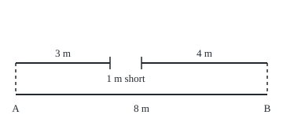
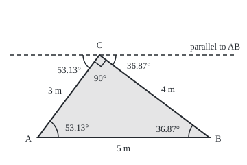

# Triangles: why the angles add to 180 and why two sides must beat the third

[Syllabus](../../../SYLLABUS.md) → [Geometry and trig](../../../SYLLABUS.md#w05) → [Angles, Triangles and Congruence](../../../SYLLABUS.md#w05-s01) → Triangles

---

## General Overview

Three fence panels, 3 m, 4 m and 8 m long, are meant to hinge into a triangular vegetable bed. Lay the 8 m panel down and hinge the other two to its ends. However they swing, their loose ends never meet. Pointed straight at each other, the 3 m and 4 m panels cover 7 m of the 8 m and stop 1 m short.

Swap in a 5 m panel and the bed closes. A builder's square shows the corner between the 3 m and 4 m panels is a right angle, 90°. A protractor on the corner between the 5 m and 4 m panels reads 36.87°. The third corner needs no instrument: 180° − 90° − 36.87° = 53.13°.

**Three lengths make a triangle exactly when the two shorter ones together beat the longest; once it closes, its three angles add to 180°, so any two corners fix the third.**

**What kind of fact this is:** two theorems, both proved on this card in Why it works.

### The picture: the 3 m and 4 m panels at their best try

<p align="center"></p>

Drawn to scale, 1 m = 40 units. The short panels, hinged at A and B, really lie along the 8 m one; they are drawn lifted so all three show. This is the closest their ends can get.

---

## The formula

The degree sign ° counts turning, 360° to a full turn, as on [Angles](01-angles-and-parallel-lines.md). New here, the naming used for every triangle from now on: corners are A, B and C, each letter also naming the angle there, and each side takes the small letter of the corner it faces: side $a$ lies opposite corner $A$.

In the 5 m bed, A and B are the ends of the 5 m panel and C is where the other two meet, so $c$ = 5 m, $b$ = 3 m and $a$ = 4 m.

$$A + B + C = 180^\circ$$

**Read it aloud:** the three angles of a triangle add to a half-turn.

So a missing angle is whatever the other two leave of 180°: $C = 180^\circ - A - B$.

$$a + b > c, \qquad b + c > a, \qquad c + a > b$$

**Read it aloud:** each side is shorter than the other two laid end to end.

With $c$ the longest side, the second and third lines hold automatically, since $c$ alone is at least as long as $a$ or $b$. One comparison settles it: the two shorter against the longest. For the fence, 3 + 4 = 7, not more than 8.

Turned round, a third panel works with the 3 m and 4 m ones when it is shorter than 4 + 3 = 7 m and longer than 4 − 3 = 1 m.

| Symbol | Plain meaning | In our example | Push it up and the answer… |
| --- | --- | --- | --- |
| $A$, $B$, $C$ | the angles at the three corners, in degrees | 53.13°, 36.87°, 90° | the other two must shrink by the same total |
| $a$, $b$, $c$ | side lengths, each named after the corner it faces | 4 m, 3 m, 5 m (the failed bed: 4, 3, 8) | push $c$ to 7 m or past it and the triangle is gone |
| $^\circ$ | a degree: one 360th of a full turn | 90° is a quarter turn | — |
| $>$ | strictly greater: equal does not count | 7 > 5 | — |

### When it holds

- **A flat surface.** The angle proof uses parallel lines in a plane. On a globe, a triangle whose sides are shortest routes over the surface has angles adding to more than 180°.
- **Two genuine angles.** Each given angle is above 0°, and the two together are under 180°: 100° and 90° leave −10°, no triangle.
- **Straight sides.** A kinked panel is really two sides, and neither rule covers it.
- **Strictly greater.** When the two shorter sides exactly equal the longest, as with 3, 4 and 7, the panels close only lying flat: a squashed triangle with no inside.
- **Hinge-to-hinge lengths.** Posts and thickness change the working length; test the distances between hinges.

---

## Why it works

### Step 0: a straight line is a half-turn, and parallel lines copy angles

Two facts from [Angles](01-angles-and-parallel-lines.md) carry the angle sum. Angles side by side along a straight line add to 180°. And when a line crosses two parallels, the angles on opposite sides of it, between the parallels, are equal: **alternate angles**. The proof moves the three corners until they sit side by side on one line.

### Step 1: carry corners A and B up to corner C

Through C draw the line parallel to AB.

### The picture: the parallel through C collects all three angles

<p align="center"></p>

Drawn to scale, 1 m = 50 units: A at (55, 200), B at (305, 200), C at (145, 80) in drawing units. Dashed: the parallel through C.

Side CA crosses both parallels, so the angle between CA and the new line, left of C, is an alternate angle to the one at A: both 53.13°. Likewise, right of C, the angle between CB and the new line equals the angle at B: 36.87°.

### Step 2: the three angles at C fill a straight line

At C, left to right along the new line, sit the copy of A, the triangle's own angle C, and the copy of B. Together they fill the line, 180°. So A + B + C = 180°: here 53.13° + 36.87° + 90°. No step used the particular lengths, so every flat triangle obeys it.

Extend AB past B and the outside angle there, the **exterior angle**, is 180° − 36.87° = 143.13°, which is A + C: the sum of the two far corners.

### Step 3: two sides beat the third

The claim: walking from B to C by way of A is longer than going straight. Euclid's proof straightens the bend. Swing side AC round A until it continues the line BA past A, ending at D, so BD = BA + AC. In the new triangle BCD the angle at C is larger than the angle at D, and a larger angle faces a longer side. So BD beats BC.

<details>
<summary>Detailed proof</summary>

Let ABC be any triangle. Extend BA beyond A to D so that AD = AC.

1. Triangle ACD has AD = AC, so its base angles are equal: angle ADC = angle ACD (Euclid I.5).
2. Point A lies between B and D, so the ray CA runs inside angle BCD. Hence angle BCD is greater than angle ACD, which equals angle ADC, which is angle BDC.
3. In triangle BCD, the angle at C is greater than the angle at D. The side opposite the greater angle is the greater side (Euclid I.19). The side facing C is BD; the side facing D is BC. So BD > BC.
4. BD = BA + AD = BA + AC. Hence BA + AC > BC.

The same argument with the letters exchanged gives the other two inequalities.

</details>

### Step 4: lengths that pass the test always close

The converse answers the fence question. Lay the 5 m panel from A to B, hinge the 3 m panel at A and swing it through a half-turn. Its free end starts 5 − 3 = 2 m from B and ends 5 + 3 = 8 m from B. The distance grows without jumps, so it passes 4 m on the way. There the 4 m panel from B meets the tip, and the bed closes.

With the 8 m panel the swing runs from 5 m to 11 m, and 4 m is never reached; the best try is 1 m short. The swing reaches a third length exactly when it lies strictly between the difference and the sum of the other two, which is the test in the formula. Euclid builds the same triangle with two circles in Book I, Proposition 22; the swing is the code's second road.

---

## Worked numbers, by hand

| Step | Arithmetic | Value |
| --- | --- | --- |
| sort the panels | 3, 4, 8 | longest 8 m |
| two shorter end to end | 3 + 4 | 7 m |
| compare with the longest | 7 against 8 | **no triangle: 1 m short** |
| what third panel would work | above 4 − 3, below 4 + 3 | strictly between 1 m and 7 m |
| swap in 5 m | 3 + 4 = 7, and 7 > 5 | closes |
| corners known | C = 90°, B = 36.87° | two of three |
| missing corner | 180 − 90 − 36.87 | **A = 53.13°** |

Any third panel from just over 1 m to just under 7 m closes the bed; the 8 m one cannot.

### What breaks if you drop a piece

| Mistake | Comes out at | What went wrong |
| --- | --- | --- |
| Test the first two against the third in the order given | 8, 3, 4 gives 11 > 4, "yes" | Only the two shorter against the longest decides |
| Accept equality | 3, 4, 7: ends meet only lying flat, gap 0 m | A real triangle needs strictly greater |
| Subtract from 360° | 360 − 90 − 36.87 = 233.13° | A triangle's angles fill a half-turn, not a full turn |

The code prints all three.

---

## Code, from first principles, and it actually runs

Two roads, sharing no arithmetic. The first is the rule: sort, compare, subtract from 180. The second puts the panels on a grid and swings the 3 m panel round A in small steps, measuring how far its tip sits beyond the 4 m panel's reach. A bisection search (halving an interval each time) finds where the 5 m bed closes, and the corners there are measured from grid positions with the dot product. The swing's positions use cos and sin, and the angle uses the inverse cosine, all met later in this wing. A second case checks the angle sum on 1000 triangles from a home-made random number generator.

### Python

```python
# Triangles: the angle sum and the two-sides-beat-the-third test.  math supplies
# cos, sin, acos, hypot and pi, nothing more.  Fence panels 3, 4 and 8 m, then 3, 4
# and 5 m.  Two roads: the rule on the card, and panels on a grid, swung round.
import math

def rule(p):                                  # road one: the two shorter against the longest
    return sum(sorted(p)[:2]) > max(p)

def gap(b, a, c, t):                          # b hinged at A = (0, 0), turned t up from the
    x, y = b * math.cos(t), b * math.sin(t)   # long panel A to B = (c, 0); a hinged at B:
    return math.hypot(x - c, y) - a           # how far the tip of b sits beyond a's reach

def swing(b, a, c, n=3600):                   # road two: every position of the swing
    g = [gap(b, a, c, math.pi * k / n) for k in range(n + 1)]
    return min(g) < 0 < max(g), min(g), max(g)

def angle(p, q, r):                           # angle at corner p, from the dot product
    u, v = (q[0] - p[0], q[1] - p[1]), (r[0] - p[0], r[1] - p[1])
    cos = (u[0] * v[0] + u[1] * v[1]) / (math.hypot(*u) * math.hypot(*v))
    return math.acos(max(-1.0, min(1.0, cos))) * 180 / math.pi

yn = lambda v: "yes" if v else "no"
by_rule = [rule((3, 4, c)) for c in range(1, 9)]
by_swing = [swing(3, 4, c)[0] for c in range(1, 9)]
s5, s8, closest7 = swing(3, 4, 5), swing(3, 4, 8), swing(3, 4, 7)[1]
lo, hi = 0.0, math.pi                         # bisect for where the 3 m tip meets the 4 m panel
for _ in range(100):
    mid = (lo + hi) / 2
    lo, hi = (mid, hi) if gap(3, 4, 5, mid) < 0 else (lo, mid)
A, B, C = (0.0, 0.0), (5.0, 0.0), (3 * math.cos(lo), 3 * math.sin(lo))
angA, angB, angC = angle(A, B, C), angle(B, C, A), angle(C, A, B)
missing = 180 - angC - angB                   # the rule: the third corner from the other two
s, worst, pts = 2026, 0.0, []                 # second case: 1000 triangles from our own LCG
for _ in range(6000):
    s = (1103515245 * s + 12345) % 2**31
    pts.append(10 * s / 2**31)
for i in range(0, 6000, 6):
    P, Q, R = (pts[i], pts[i + 1]), (pts[i + 2], pts[i + 3]), (pts[i + 4], pts[i + 5])
    worst = max(worst, abs(angle(P, Q, R) + angle(Q, R, P) + angle(R, P, Q) - 180))
print(f"panels [3, 4, 8]: two shorter end to end {3 + 4} m vs longest 8 m -> triangle: {yn(rule((3, 4, 8)))}")
print(f"swing the 3 m panel through a half-turn: closest the loose ends get {s8[1]:.3f} m")
print(f"3 m tip to B over the swing: {s5[1] + 4:.3f} to {s5[2] + 4:.3f} m with the 5 m panel, {s8[1] + 4:.3f} to {s8[2] + 4:.3f} m with the 8 m")
print("third panel with 3 m and 4 m, c = 1..8, by the rule:  " + " ".join(map(yn, by_rule)))
print("third panel with 3 m and 4 m, c = 1..8, by the swing: " + " ".join(map(yn, by_swing)))
print(f"so the third panel must lie strictly between {4 - 3} m and {4 + 3} m")
print(f"panels [3, 4, 5]: swing closes at A = {lo * 180 / math.pi:.2f} deg, C at ({C[0]:.3f}, {C[1]:.3f})")
print(f"grid angles by dot product: A {angA:.2f}, B {angB:.2f}, C {angC:.2f}, sum {angA + angB + angC:.2f}")
print(f"missing angle by the rule: 180 - {angC:.2f} - {angB:.2f} = {missing:.2f}")
print(f"exterior angle at B: 180 - {angB:.2f} = {180 - angB:.2f} = A + C")
print(f"1000 random triangles: angle sum within 1e-9 deg of 180 every time: {yn(worst < 1e-9)}")
print(f"mistake 1, order 8, 3, 4, first two against the third: {8 + 3} > 4 says {yn(8 + 3 > 4)}")
print(f"mistake 2, panels [3, 4, 7]: closest the loose ends get {closest7:.3f} m, only lying flat")
print(f"mistake 3, 360 - {angC:.2f} - {angB:.2f} = {360 - angC - angB:.2f}, more than a half-turn")
print(f"figure 1, 1 m = 40 units: 8 m panel x 20 to {20 + 8 * 40}, 3 m panel ends x {20 + 3 * 40}, 4 m panel starts x {340 - 4 * 40}")
print(f"figure 2, 1 m = 50 units: A (55, 200), B ({55 + 5 * 50}, 200), C ({55 + 50 * C[0]:.0f}, {200 - 50 * C[1]:.0f})")
assert by_rule == by_swing                    # two roads agree on every third panel, 1 m to 8 m
assert abs(s8[1] - (8 - (3 + 4))) < 1e-12  # the swing's closest approach is the shortfall
assert abs(missing - lo * 180 / math.pi) < 1e-9 and abs(math.hypot(C[0] - 5, C[1]) - 4) < 1e-9  # closed on the 4 m panel, at the rule's corner
assert worst < 1e-9                           # the sum holds on triangles nobody chose
print("ALL CHECKS PASS")
```

**Ran 2026-09-19 on macOS, Python 3.14.6, standard library only. All checks passed. Output, pasted from the run:**

```
panels [3, 4, 8]: two shorter end to end 7 m vs longest 8 m -> triangle: no
swing the 3 m panel through a half-turn: closest the loose ends get 1.000 m
3 m tip to B over the swing: 2.000 to 8.000 m with the 5 m panel, 5.000 to 11.000 m with the 8 m
third panel with 3 m and 4 m, c = 1..8, by the rule:  no yes yes yes yes yes no no
third panel with 3 m and 4 m, c = 1..8, by the swing: no yes yes yes yes yes no no
so the third panel must lie strictly between 1 m and 7 m
panels [3, 4, 5]: swing closes at A = 53.13 deg, C at (1.800, 2.400)
grid angles by dot product: A 53.13, B 36.87, C 90.00, sum 180.00
missing angle by the rule: 180 - 90.00 - 36.87 = 53.13
exterior angle at B: 180 - 36.87 = 143.13 = A + C
1000 random triangles: angle sum within 1e-9 deg of 180 every time: yes
mistake 1, order 8, 3, 4, first two against the third: 11 > 4 says yes
mistake 2, panels [3, 4, 7]: closest the loose ends get 0.000 m, only lying flat
mistake 3, 360 - 90.00 - 36.87 = 233.13, more than a half-turn
figure 1, 1 m = 40 units: 8 m panel x 20 to 340, 3 m panel ends x 140, 4 m panel starts x 180
figure 2, 1 m = 50 units: A (55, 200), B (305, 200), C (145, 80)
ALL CHECKS PASS
```

### Rust

Same numbers, same labels, built with `rustc --edition 2021 -O`.

```rust
// Triangles: the angle sum and the two-sides-beat-the-third test, in Rust, no
// crates.  Fence panels 3, 4 and 8 m, then 3, 4 and 5 m.  Two roads: the rule on
// the card, and the panels placed on a grid and swung round.
use std::f64::consts::PI;

fn rule(p: [f64; 3]) -> bool {                   // road one: the two shorter against the longest
    let mut s = p;
    s.sort_by(|x, y| x.partial_cmp(y).unwrap());
    s[0] + s[1] > s[2]
}

fn gap(b: f64, a: f64, c: f64, t: f64) -> f64 {  // b hinged at A = (0, 0), turned t up from the
    let (x, y) = (b * t.cos(), b * t.sin());     // long panel A to B = (c, 0); a hinged at B:
    (x - c).hypot(y) - a                         // how far the tip of b sits beyond a's reach
}

fn swing(b: f64, a: f64, c: f64) -> (bool, f64, f64) { // road two: every position of the swing
    let n = 3600;
    let g: Vec<f64> = (0..=n).map(|k| gap(b, a, c, PI * k as f64 / n as f64)).collect();
    let lo = g.iter().cloned().fold(f64::INFINITY, f64::min);
    let hi = g.iter().cloned().fold(f64::NEG_INFINITY, f64::max);
    (lo < 0.0 && 0.0 < hi, lo, hi)
}

fn angle(p: (f64, f64), q: (f64, f64), r: (f64, f64)) -> f64 { // angle at p, from the dot product
    let (u, v) = ((q.0 - p.0, q.1 - p.1), (r.0 - p.0, r.1 - p.1));
    let cos = (u.0 * v.0 + u.1 * v.1) / (u.0.hypot(u.1) * v.0.hypot(v.1));
    cos.max(-1.0).min(1.0).acos() * 180.0 / PI
}

fn yn(v: bool) -> &'static str { if v { "yes" } else { "no" } }

fn main() {
    let by_rule: Vec<bool> = (1..=8).map(|c| rule([3.0, 4.0, c as f64])).collect();
    let by_swing: Vec<bool> = (1..=8).map(|c| swing(3.0, 4.0, c as f64).0).collect();
    let (s5, s8, closest7) = (swing(3.0, 4.0, 5.0), swing(3.0, 4.0, 8.0), swing(3.0, 4.0, 7.0).1);
    let closest8 = s8.1;
    let (mut lo, mut hi) = (0.0_f64, PI);        // bisect for where the 3 m tip meets the 4 m panel
    for _ in 0..100 {
        let mid = (lo + hi) / 2.0;
        if gap(3.0, 4.0, 5.0, mid) < 0.0 { lo = mid } else { hi = mid }
    }
    let (a, b, c) = ((0.0, 0.0), (5.0, 0.0), (3.0 * lo.cos(), 3.0 * lo.sin()));
    let (ang_a, ang_b, ang_c) = (angle(a, b, c), angle(b, c, a), angle(c, a, b));
    let missing = 180.0 - ang_c - ang_b;         // the rule: the third corner from the other two
    let (mut s, mut worst, mut pts): (u64, f64, Vec<f64>) = (2026, 0.0, Vec::new());
    for _ in 0..6000 {                           // second case: 1000 triangles from our own LCG
        s = (1103515245 * s + 12345) % (1 << 31);
        pts.push(10.0 * s as f64 / (1u64 << 31) as f64);
    }
    for i in (0..6000).step_by(6) {
        let (p, q, r) = ((pts[i], pts[i + 1]), (pts[i + 2], pts[i + 3]), (pts[i + 4], pts[i + 5]));
        worst = worst.max((angle(p, q, r) + angle(q, r, p) + angle(r, p, q) - 180.0).abs());
    }
    let words = |v: &Vec<bool>| v.iter().map(|&x| yn(x)).collect::<Vec<_>>().join(" ");
    let swing_a = lo * 180.0 / PI;
    println!("panels [3, 4, 8]: two shorter end to end {} m vs longest 8 m -> triangle: {}", 3 + 4, yn(rule([3.0, 4.0, 8.0])));
    println!("swing the 3 m panel through a half-turn: closest the loose ends get {:.3} m", closest8);
    println!("3 m tip to B over the swing: {:.3} to {:.3} m with the 5 m panel, {:.3} to {:.3} m with the 8 m", s5.1 + 4.0, s5.2 + 4.0, s8.1 + 4.0, s8.2 + 4.0);
    println!("third panel with 3 m and 4 m, c = 1..8, by the rule:  {}", words(&by_rule));
    println!("third panel with 3 m and 4 m, c = 1..8, by the swing: {}", words(&by_swing));
    println!("so the third panel must lie strictly between {} m and {} m", 4 - 3, 4 + 3);
    println!("panels [3, 4, 5]: swing closes at A = {:.2} deg, C at ({:.3}, {:.3})", swing_a, c.0, c.1);
    println!("grid angles by dot product: A {:.2}, B {:.2}, C {:.2}, sum {:.2}", ang_a, ang_b, ang_c, ang_a + ang_b + ang_c);
    println!("missing angle by the rule: 180 - {:.2} - {:.2} = {:.2}", ang_c, ang_b, missing);
    println!("exterior angle at B: 180 - {:.2} = {:.2} = A + C", ang_b, 180.0 - ang_b);
    println!("1000 random triangles: angle sum within 1e-9 deg of 180 every time: {}", yn(worst < 1e-9));
    println!("mistake 1, order 8, 3, 4, first two against the third: {} > 4 says {}", 8 + 3, yn(8 + 3 > 4));
    println!("mistake 2, panels [3, 4, 7]: closest the loose ends get {:.3} m, only lying flat", closest7);
    println!("mistake 3, 360 - {:.2} - {:.2} = {:.2}, more than a half-turn", ang_c, ang_b, 360.0 - ang_c - ang_b);
    println!("figure 1, 1 m = 40 units: 8 m panel x 20 to {}, 3 m panel ends x {}, 4 m panel starts x {}", 20 + 8 * 40, 20 + 3 * 40, 340 - 4 * 40);
    println!("figure 2, 1 m = 50 units: A (55, 200), B ({}, 200), C ({:.0}, {:.0})", 55 + 5 * 50, 55.0 + 50.0 * c.0, 200.0 - 50.0 * c.1);
    assert!(by_rule == by_swing);                // two roads agree on every third panel, 1 m to 8 m
    assert!((closest8 - (8.0 - (3.0 + 4.0))).abs() < 1e-12); // the swing's closest approach is the shortfall
    assert!((missing - swing_a).abs() < 1e-9 && ((c.0 - 5.0).hypot(c.1) - 4.0).abs() < 1e-9); // closed on the 4 m panel, at the rule's corner
    assert!(worst < 1e-9);                       // the sum holds on triangles nobody chose
    println!("ALL CHECKS PASS");
}
```

**Ran 2026-09-19 on macOS, rustc 1.98.1, no crates. All checks passed. Output, pasted from the run:**

```
panels [3, 4, 8]: two shorter end to end 7 m vs longest 8 m -> triangle: no
swing the 3 m panel through a half-turn: closest the loose ends get 1.000 m
3 m tip to B over the swing: 2.000 to 8.000 m with the 5 m panel, 5.000 to 11.000 m with the 8 m
third panel with 3 m and 4 m, c = 1..8, by the rule:  no yes yes yes yes yes no no
third panel with 3 m and 4 m, c = 1..8, by the swing: no yes yes yes yes yes no no
so the third panel must lie strictly between 1 m and 7 m
panels [3, 4, 5]: swing closes at A = 53.13 deg, C at (1.800, 2.400)
grid angles by dot product: A 53.13, B 36.87, C 90.00, sum 180.00
missing angle by the rule: 180 - 90.00 - 36.87 = 53.13
exterior angle at B: 180 - 36.87 = 143.13 = A + C
1000 random triangles: angle sum within 1e-9 deg of 180 every time: yes
mistake 1, order 8, 3, 4, first two against the third: 11 > 4 says yes
mistake 2, panels [3, 4, 7]: closest the loose ends get 0.000 m, only lying flat
mistake 3, 360 - 90.00 - 36.87 = 233.13, more than a half-turn
figure 1, 1 m = 40 units: 8 m panel x 20 to 340, 3 m panel ends x 140, 4 m panel starts x 180
figure 2, 1 m = 50 units: A (55, 200), B (305, 200), C (145, 80)
ALL CHECKS PASS
```

The two outputs match line for line.

> [!TIP]
> **Try changing**
> Guess first, then run it.
> - **A coarse swing.** Set `n` in `swing` to 4: five positions only. Does the swing still agree with the rule? Yes, and every assert passes: the gap is smallest at the start of the swing and largest at the end.
> - **Break the strictness.** Change `>` in `rule` to `>=`. Now 3, 4 and 7 count as a triangle by the rule but not by the swing, and the first assert stops the run.
> - **Use the wrong corner.** In `missing`, subtract `angA` instead of `angB`. The rule's answer becomes 36.87°, not where the swing closed, and the third assert stops the run.

---

## The usual mistake

> [!warning]
> **Testing one pair and stopping.** Any pair that includes the longest side passes: 3 + 8 > 4 and 4 + 8 > 3. Only the two shorter against the longest can fail. Taking the panels in the order listed, 8 and 3 against 4, gives 11 > 4 and a wrong "yes".
>
> - **Letting equality through.** With 3, 4 and 7 the panels meet only lying flat; the bed has no inside.
> - **Subtracting from 360°.** 360° − 90° − 36.87° = 233.13°, more than a half-turn for one corner. A full turn is the total for four-sided shapes.

---

## Where you meet it in real life

- **Frames and trusses.** A roof truss of two rafters and a tie is a triangle; its cut list must pass the test before timber is ordered. Why fixed sides make it rigid is [Congruent triangles](03-congruent-triangles.md).
- **Surveying.** Measure two angles of a small triangular plot and the third is computed; measure all three and the amount their sum misses 180° is the instrument error.
- **Right angles.** When the corner at C is 90°, the sides obey a tighter rule: [Pythagoras](05-pythagoras-and-its-converse.md).

> **Say it back**
> Three lengths make a triangle when the two shorter together are strictly longer than the longest. Panels of 3 m, 4 m and 8 m fail by 1 m; a third panel between 1 m and 7 m would close the bed. In a flat triangle the angles add to 180°, because a parallel through one corner collects all three on a straight line. So a missing angle is 180° minus the other two: 53.13° in the 3, 4, 5 m bed.

---

## What this builds on

- [Angles](01-angles-and-parallel-lines.md): degrees, angles on a straight line, and the alternate angles that parallel lines copy.

## Where this goes next

- [Congruent triangles](03-congruent-triangles.md): when two triangles with some matching sides and angles must match everywhere.

This card says when three panels close, not whether they can close in more than one shape; that question is congruence.

---

## Sources

Verified 2026-09-24: every link below resolves to the publisher's page.

- Euclid. *Elements*, Book I, Proposition 32, David E. Joyce's edition, Clark University. [I.32](https://mathcs.clarku.edu/~djoyce/java/elements/bookI/propI32.html). The parallel-line proof of the angle sum, and the exterior angle.
- Euclid. *Elements*, Book I, Proposition 20, Joyce's edition. [I.20](https://mathcs.clarku.edu/~djoyce/java/elements/bookI/propI20.html). Two sides beat the third; it leans on [I.19](https://mathcs.clarku.edu/~djoyce/java/elements/bookI/propI19.html), larger angle facing larger side.
- Euclid. *Elements*, Book I, Proposition 22, Joyce's edition. [I.22](https://mathcs.clarku.edu/~djoyce/java/elements/bookI/propI22.html). A triangle built from three lengths that pass the test.
- Heath, Thomas L. *The Thirteen Books of the Elements*, Vol. 1, 2nd ed. Dover. [Publisher page](https://store.doverpublications.com/products/9780486600888). Heath's translation of Book I, with commentary.
