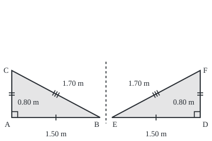
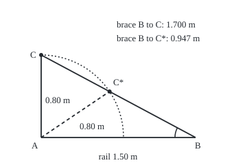

# Congruent triangles: when two triangles are the same shape and size

Geometry and trig → Angles, Triangles and Congruence → Four tests for an exact copy → Congruent triangles

---

## General Overview

A driveway gate has two leaves that close in the middle. Each leaf is a timber frame: a bottom rail, a hinge stile (the upright on the hinge side), and a diagonal brace bolted between them. On the left leaf three bolt holes sit at the corner, on the rail 1.50 m from the corner, and on the stile 0.80 m up. The brace between rail hole and stile hole is 1.70 m, and the corner is square.

The right leaf is the mirror image. A copy of the left brace must drop onto its holes without redrilling. Measuring all six sides and corners would settle it; three, well chosen, are enough.

Two triangles are **congruent** when one can be laid exactly on the other after sliding, turning or flipping it: same shape, same size. Four tests, SSS, SAS, ASA and RHS, prove it from three matching parts. Once it is proved, a part unmeasured on one triangle is read off the other: a transferred length.

**Three well-chosen matching parts force the other three to match, so a length measured on one triangle holds on its congruent partner without measuring it again.**

**What kind of fact this is:** congruence is a definition; SAS is the founding rule (Euclid proved it by laying one triangle on another, modern axioms take it as given); SSS, ASA and RHS are theorems, proved from SAS on this card in Why it works.

### The picture: two leaves, one brace triangle

<p align="center"></p>

Drawn to scale, 1 m = 100 units; the dashed line is where the leaves meet. Equal tick marks, equal lengths. A matches D, B matches E, C matches F.

---

## The formula

Notation, in words. $\triangle ABC$ is the triangle with corners A, B, C. Two corner letters together, such as AB, name the distance between them. $\angle A$ is the angle at corner A; three letters, as in angle ABG, name the angle at the middle letter. The sign $\cong$ reads "is congruent to", with corners listed in matching order. Congruence means all six parts match:

$$\triangle ABC \cong \triangle DEF \iff AB = DE,\; BC = EF,\; CA = FD,\; \angle A = \angle D,\; \angle B = \angle E,\; \angle C = \angle F$$

**Read it aloud:** the triangles are congruent exactly when every side and every angle equals its partner, partners fixed by the letter order.

Each test needs only three of the six. In the names, S is a matching side and A a matching angle; RHS reads right angle, hypotenuse, side. The **hypotenuse** is the side facing the right angle; here, the brace.

| Test | What must match | On the gate |
| --- | --- | --- |
| SSS | all three sides | rail, stile, brace |
| SAS | two sides and the angle between them | rail, square corner, stile |
| ASA | two angles and the side between them | square corner, rail, brace angle at the rail hole |
| RHS | a right angle, the side facing it, one other side | square corner, brace, rail |

| Symbol | Plain meaning | In our example | Push it up and the answer… |
| --- | --- | --- | --- |
| $A$, $B$, $C$ | corners of the first triangle | left leaf: corner, rail and stile holes | — |
| $D$, $E$, $F$ | matching corners of the second | right leaf, same roles, mirrored | — |
| $AB$, $BC$, $CA$ | distances between corners | 1.50 m, 1.70 m, 0.80 m | a longer rail needs a longer brace |
| $\angle A$ | angle at corner A | square, a right angle | opening it lengthens the brace |
| $\triangle ABC$ | triangle with corners A, B, C | left brace triangle | — |
| $\cong$ | "is congruent to" | left and right triangles | — |
| $\iff$ | "exactly when" | — | — |
| $s$ | unknown brace length in the SSA trap | 1.700 m or 0.947 m | — |

### When it holds

- **A flat plane.** On a sphere, three equal angles force equal sides; on paper they do not.
- **Partners in order.** Pair the rail with the stile and even a true congruence lands the rail hole 0.700 m off.
- **The angle in its place.** SAS needs the angle between the sides. Move it outside and the result is SSA, which can fit two triangles.
- **Flips allowed.** The right leaf is a flipped left leaf. A plate countersunk on one face must not flip; the tests do not check that.

---

## Why it works

### Step 0: a rigid copy is fixed by fewer than six facts

Sliding, turning and flipping never stretch a length or open an angle, so congruent triangles match in all six parts. Which three pin the copy down?

### Step 1: SAS, the founding rule

Lay the left triangle on the right: A on D, rail AB along DE. Both rails are 1.50 m, so B lands on E. Both corners are square, so stile AC runs along DF, flipping over if needed. Both stiles are 0.80 m, so C lands on F. Two points fix one straight line, so brace BC lies along EF.

This is Euclid's Book I, Proposition 4. His postulates never say a triangle can be moved, so Hilbert in 1899 made the SAS step an axiom.

### Step 2: ASA, by trying to break it

Suppose angles A and D match, angles B and E match, and AB = DE, but stile AC is longer than DF. Mark G on AC with AG = DF. Triangles ABG and DEF match by SAS, so angle ABG equals angle E, which equals angle ABC. But G lies strictly between A and C, so angle ABG is smaller than angle ABC. So AC is not longer than DF; swapping the triangles shows it is not shorter. So AC = DF, and SAS finishes. By the angle sum ([triangle-angle-sum-and-inequality](02-triangle-angle-sum-and-inequality.md)), two matching angles force the third, so any matching side will do (AAS). On the gate, a bevel gauge (a hinged blade that copies an angle) copies the brace angle at the rail hole; the copied line meets the right stile 0.800 m up.

### Step 3: SSS, by building a kite

With all three sides matching, fit the second triangle against the first along the rail, on the far side, so F lands at a point G across the rail from C. A, C, B, G form a kite: AC = AG and BC = BG. Join C to G. A triangle with two equal sides, such as ACG or BCG, is **isosceles**, and its two base angles, those facing the equal sides, are equal. Adding the pair at C and the pair at G gives angle ACB = angle AGB, and SAS finishes.

<details>
<summary>Detailed proof: SSS from SAS</summary>

Base angles first. Let PQ = PR. Triangle PQR and the same triangle read as PRQ match by SAS: PQ = PR, the shared angle at P, PR = PQ. So the angle at Q equals the angle at R (Euclid I.5).

Now let AB = DE, BC = EF, CA = FD, and copy DEF onto AB on the side away from C, F landing at G. Triangles ACG and BCG are isosceles, so each has equal angles at C and G. If CG crosses AB between A and B, add the pairs; if beyond A or B, subtract; if through A or B, one pair suffices. Every case gives angle ACB = angle AGB = angle DFE, and SAS finishes.

</details>

### Step 4: RHS, by standing back to back

Take right triangles with equal hypotenuses BC and EF and equal legs AB and DE. Fit the second against the first along AB, on the far side, so F lands at G. The two right angles at A make a straight line, so C, A, G are in line. Triangle BCG has BC = BG, so its angles at C and G are equal. Triangles ABC and ABG share AB, the right angle, and that equal angle: AAS. On the gate, a 1.70 m brace from the rail hole reaches the stile at one point only, 0.800 m up. The arithmetic road is [pythagoras-and-its-converse](05-pythagoras-and-its-converse.md).

### Step 5: SSA is not a test

Copy the brace angle at the rail hole, keep the rail at 1.50 m, and ask only that the stile hole sit 0.80 m from the corner hole, with no square corner. A 0.80 m arm swung about the corner hole meets the brace line twice. One crossing gives the true brace, 1.700 m. The other gives 0.947 m, with the stile hole at 0.664 m along and 0.446 m up. Two triangles share all three facts.

<p align="center"></p>

Drawn to scale, 1 m = 150 units. The small arc at B is the copied angle; the dotted arc is every point 0.80 m from A.

When the side facing the given angle is at least as long as the other given side, the arm meets the line once on the correct side of B. A right angle always gives that case: RHS.

The code's second road is coordinates: holes on a grid, distances by the distance formula. The proofs say why the grid always agrees.

---

## Worked numbers, by hand

| Step | Arithmetic | Value |
| --- | --- | --- |
| left leaf | rail AB, stile AC, brace BC | 1.50 m, 0.80 m, 1.70 m |
| right leaf | rail DE, stile DF, corner by builder's square | 1.50 m, 0.80 m, square |
| test | two sides, the angle between them | SAS |
| transfer | EF matches BC | **1.70 m** |

The copied brace fits the right leaf, and its diagonal was never measured there. ASA and RHS each put the stile hole 0.800 m up.

### What breaks if you drop a piece

| Mistake | Comes out at | What went wrong |
| --- | --- | --- |
| SSA, corner not checked | a second brace, 0.947 m, fits too | the angle is not between the sides |
| AAA, angles only | a 0.8-size copy: rail 1.20 m, stile 0.64 m, brace 1.36 m, 0.340 m short | angles fix shape, not size |
| Rail and stile swapped | rail hole misses by 0.700 m | letter order sets the partners |

In the AAA copy the brace rises 0.533 m per metre of rail, as on the gate, so every angle matches.

---

## Code, from first principles, and it actually runs

Nothing is imported. Both leaves go on a grid in metres; a dot product of 0 marks the square corner. Road one builds the right stile hole by ASA. Road two flips the left leaf over the centre line, a rigid motion, and compares holes. RHS is found by halving an interval up the stile; SSA is solved by the quadratic formula and again by scanning. The last lines give the figures' coordinates.

### Python

```python
# Congruent triangles -- the check behind the card.  Nothing is imported.
# A double gate, metres.  Left brace triangle: corner hole A, rail hole B,
# stile hole C.  The right leaf D, E, F is built by ASA and by RHS, then
# compared with the left leaf flipped over.  SSA and AAA are shown failing.
A, B, C = (0.0, 0.0), (1.5, 0.0), (0.0, 0.8)
D, E = (3.2, 0.0), (1.7, 0.0)          # right corner hole and rail hole

def dist(p, q):                        # the distance formula on the grid
    return ((p[0] - q[0]) ** 2 + (p[1] - q[1]) ** 2) ** 0.5

def bisect(f, lo, hi):                 # a root of f between lo and hi, by halving
    for _ in range(200):
        mid = (lo + hi) / 2
        if (f(lo) > 0) == (f(mid) > 0): lo = mid
        else: hi = mid
    return (lo + hi) / 2

brace = dist(B, C)
dot = (B[0] - A[0]) * (C[0] - A[0]) + (B[1] - A[1]) * (C[1] - A[1])   # 0 means a square corner
print(f"left leaf: rail {dist(A, B):.3f} stile {dist(A, C):.3f} brace {brace:.3f}, corner dot product {dot:.3f}")
print(f"SAS right leaf, 1.500 and 0.800 at a square corner: brace {dist(E, (D[0], 0.8)):.3f}")
u = (-(C[0] - B[0]), C[1] - B[1])      # ASA: bevel gauge copies the brace line, mirrored
t = (D[0] - E[0]) / u[0]               # run along it until it meets the right stile
F = (E[0] + t * u[0], E[1] + t * u[1])
print(f"ASA right leaf, bevel copy at rail hole: stile hole {F[1]:.3f} up, brace {dist(E, F):.3f}")
flip = [(3.2 - x, y) for (x, y) in (A, B, C)]   # rigid motion: turn the left leaf over
miss = max(dist(p, q) for p, q in zip(flip, (D, E, F)))
print(f"flipped left leaf vs ASA-built right leaf: largest hole miss {miss:.3f}")
print(f"SSS spacings right leaf: {dist(D, E):.3f} {dist(D, F):.3f} {dist(E, F):.3f}")
h = bisect(lambda y: dist(E, (D[0], y)) - brace, 0.0, brace)
print(f"RHS search up the stile for a {brace:.3f} brace: {h:.3f}")
assert miss < 1e-12                    # ASA construction lands on the flipped holes
assert abs(dist(E, F) - brace) < 1e-12 # the transferred brace length
assert abs(h - dist(A, C)) < 1e-9      # RHS search returns the left stile spacing
# SSA: angle at B, rail BA = 1.5, stile hole 0.8 from A; brace length s unknown.
w = ((C[0] - B[0]) / brace, (C[1] - B[1]) / brace)
p = (B[0] - A[0]) * w[0] + (B[1] - A[1]) * w[1]
q = dist(A, B) ** 2 - 0.8 ** 2         # s^2 + 2 p s + q = 0
roots = sorted([-p - (p * p - q) ** 0.5, -p + (p * p - q) ** 0.5])
print(f"SSA quadratic: braces {roots[1]:.3f} and {roots[0]:.3f}")
print(f"SSA gap from corner hole to brace line: {(dist(A, B) ** 2 - p * p) ** 0.5:.3f}")
g = lambda s: dist(A, (B[0] + s * w[0], B[1] + s * w[1])) - 0.8
scan = [bisect(g, k / 100, (k + 1) / 100) for k in range(300) if (g(k / 100) > 0) != (g((k + 1) / 100) > 0)]
print(f"SSA brute-force scan: braces {scan[1]:.3f} and {scan[0]:.3f}")
assert all(abs(a - b) < 1e-9 for a, b in zip(roots, scan))
Cs = (B[0] + scan[0] * w[0], B[1] + scan[0] * w[1])
print(f"SSA second stile hole: ({Cs[0]:.3f}, {Cs[1]:.3f}), {dist(A, Cs):.3f} from corner")
small = [0.8 * dist(A, B), 0.8 * dist(A, C)]   # AAA: same angles, 0.8 size
sb = dist((small[0], 0.0), (0.0, small[1]))
print(f"AAA copy at 0.8 size: rail {small[0]:.3f} stile {small[1]:.3f} brace {sb:.3f}")
print(f"brace slope {small[1] / small[0]:.3f} vs {C[1] / B[0]:.3f}, brace short by {brace - sb:.3f}")
print(f"rail and stile swapped: rail hole misses by {dist(A, B) - dist(A, C):.3f}")
fig = lambda P: f"{20 + 100 * P[0]:.0f},{200 - 100 * P[1]:.0f}"
print("figure, 100 units per m: " + " ".join(n + " " + fig(P) for n, P in zip("ABCDEF", (A, B, C, D, E, F))))
fig2 = lambda P: f"{60 + 150 * P[0]:.1f},{200 - 150 * P[1]:.1f}"
print("figure2, 150 units per m: " + " ".join(n + " " + fig2(P) for n, P in (("A", A), ("B", B), ("C", C), ("C*", Cs))))
print("ALL CHECKS PASS")
```

**Ran 2026-09-24 on macOS, Python 3.14.6, standard library only. All checks passed. Output, pasted from the run:**

```
left leaf: rail 1.500 stile 0.800 brace 1.700, corner dot product 0.000
SAS right leaf, 1.500 and 0.800 at a square corner: brace 1.700
ASA right leaf, bevel copy at rail hole: stile hole 0.800 up, brace 1.700
flipped left leaf vs ASA-built right leaf: largest hole miss 0.000
SSS spacings right leaf: 1.500 0.800 1.700
RHS search up the stile for a 1.700 brace: 0.800
SSA quadratic: braces 1.700 and 0.947
SSA gap from corner hole to brace line: 0.706
SSA brute-force scan: braces 1.700 and 0.947
SSA second stile hole: (0.664, 0.446), 0.800 from corner
AAA copy at 0.8 size: rail 1.200 stile 0.640 brace 1.360
brace slope 0.533 vs 0.533, brace short by 0.340
rail and stile swapped: rail hole misses by 0.700
figure, 100 units per m: A 20,200 B 170,200 C 20,120 D 340,200 E 190,200 F 340,120
figure2, 150 units per m: A 60.0,200.0 B 285.0,200.0 C 60.0,80.0 C* 159.7,133.1
ALL CHECKS PASS
```

### Rust

```rust
// Congruent triangles -- the check behind the card.  std only, no crates.
// A double gate, metres.  Left brace triangle: corner hole A, rail hole B,
// stile hole C.  The right leaf D, E, F is built by ASA and by RHS, then
// compared with the left leaf flipped over.  SSA and AAA are shown failing.
type P = (f64, f64);

fn dist(p: P, q: P) -> f64 {
    // the distance formula on the grid
    ((p.0 - q.0).powi(2) + (p.1 - q.1).powi(2)).sqrt()
}

fn bisect(f: &dyn Fn(f64) -> f64, mut lo: f64, mut hi: f64) -> f64 {
    // a root of f between lo and hi, by halving
    for _ in 0..200 {
        let mid = (lo + hi) / 2.0;
        if (f(lo) > 0.0) == (f(mid) > 0.0) { lo = mid } else { hi = mid }
    }
    (lo + hi) / 2.0
}

fn main() {
    let (a, b, c): (P, P, P) = ((0.0, 0.0), (1.5, 0.0), (0.0, 0.8));
    let (d, e): (P, P) = ((3.2, 0.0), (1.7, 0.0));
    let brace = dist(b, c);
    let dot = (b.0 - a.0) * (c.0 - a.0) + (b.1 - a.1) * (c.1 - a.1); // 0 means a square corner
    println!("left leaf: rail {:.3} stile {:.3} brace {:.3}, corner dot product {:.3}", dist(a, b), dist(a, c), brace, dot);
    println!("SAS right leaf, 1.500 and 0.800 at a square corner: brace {:.3}", dist(e, (d.0, 0.8)));
    // ASA: the bevel gauge copies the brace line, mirrored, and runs it to the right stile
    let u = (-(c.0 - b.0), c.1 - b.1);
    let t = (d.0 - e.0) / u.0;
    let f = (e.0 + t * u.0, e.1 + t * u.1);
    println!("ASA right leaf, bevel copy at rail hole: stile hole {:.3} up, brace {:.3}", f.1, dist(e, f));
    // rigid motion: turn the left leaf over about the gate's centre line
    let flip: Vec<P> = [a, b, c].iter().map(|p| (3.2 - p.0, p.1)).collect();
    let miss = flip.iter().zip([d, e, f].iter()).map(|(p, q)| dist(*p, *q)).fold(0.0, f64::max);
    println!("flipped left leaf vs ASA-built right leaf: largest hole miss {:.3}", miss);
    println!("SSS spacings right leaf: {:.3} {:.3} {:.3}", dist(d, e), dist(d, f), dist(e, f));
    let h = bisect(&|y| dist(e, (d.0, y)) - brace, 0.0, brace);
    println!("RHS search up the stile for a {:.3} brace: {:.3}", brace, h);
    assert!(miss < 1e-12);
    assert!((dist(e, f) - brace).abs() < 1e-12);
    assert!((h - dist(a, c)).abs() < 1e-9);
    // SSA: angle at B, rail BA = 1.5, stile hole 0.8 from A; brace length s unknown
    let w = ((c.0 - b.0) / brace, (c.1 - b.1) / brace);
    let p = (b.0 - a.0) * w.0 + (b.1 - a.1) * w.1;
    let q = dist(a, b).powi(2) - 0.8f64.powi(2); // s^2 + 2 p s + q = 0
    let roots = [-p - (p * p - q).sqrt(), -p + (p * p - q).sqrt()];
    println!("SSA quadratic: braces {:.3} and {:.3}", roots[1], roots[0]);
    println!("SSA gap from corner hole to brace line: {:.3}", (dist(a, b).powi(2) - p * p).sqrt());
    let g = |s: f64| dist(a, (b.0 + s * w.0, b.1 + s * w.1)) - 0.8;
    let scan: Vec<f64> = (0..300)
        .filter(|k| (g(*k as f64 / 100.0) > 0.0) != (g((*k + 1) as f64 / 100.0) > 0.0))
        .map(|k| bisect(&g, k as f64 / 100.0, (k + 1) as f64 / 100.0))
        .collect();
    println!("SSA brute-force scan: braces {:.3} and {:.3}", scan[1], scan[0]);
    assert!(roots.iter().zip(scan.iter()).all(|(x, y)| (x - y).abs() < 1e-9));
    let cs = (b.0 + scan[0] * w.0, b.1 + scan[0] * w.1);
    println!("SSA second stile hole: ({:.3}, {:.3}), {:.3} from corner", cs.0, cs.1, dist(a, cs));
    let small = [0.8 * dist(a, b), 0.8 * dist(a, c)]; // AAA: same angles, 0.8 size
    let sb = dist((small[0], 0.0), (0.0, small[1]));
    println!("AAA copy at 0.8 size: rail {:.3} stile {:.3} brace {:.3}", small[0], small[1], sb);
    println!("brace slope {:.3} vs {:.3}, brace short by {:.3}", small[1] / small[0], c.1 / b.0, brace - sb);
    println!("rail and stile swapped: rail hole misses by {:.3}", dist(a, b) - dist(a, c));
    let fig = |p: P| format!("{:.0},{:.0}", 20.0 + 100.0 * p.0, 200.0 - 100.0 * p.1);
    let pts = [("A", a), ("B", b), ("C", c), ("D", d), ("E", e), ("F", f)];
    let row: Vec<String> = pts.iter().map(|(n, p)| format!("{} {}", n, fig(*p))).collect();
    println!("figure, 100 units per m: {}", row.join(" "));
    let fig2 = |p: P| format!("{:.1},{:.1}", 60.0 + 150.0 * p.0, 200.0 - 150.0 * p.1);
    let pts2 = [("A", a), ("B", b), ("C", c), ("C*", cs)];
    let row2: Vec<String> = pts2.iter().map(|(n, p)| format!("{} {}", n, fig2(*p))).collect();
    println!("figure2, 150 units per m: {}", row2.join(" "));
    println!("ALL CHECKS PASS");
}
```

**Ran 2026-09-24 on macOS, rustc 1.98.1, no crates. All checks passed. Output, pasted from the run:**

```
left leaf: rail 1.500 stile 0.800 brace 1.700, corner dot product 0.000
SAS right leaf, 1.500 and 0.800 at a square corner: brace 1.700
ASA right leaf, bevel copy at rail hole: stile hole 0.800 up, brace 1.700
flipped left leaf vs ASA-built right leaf: largest hole miss 0.000
SSS spacings right leaf: 1.500 0.800 1.700
RHS search up the stile for a 1.700 brace: 0.800
SSA quadratic: braces 1.700 and 0.947
SSA gap from corner hole to brace line: 0.706
SSA brute-force scan: braces 1.700 and 0.947
SSA second stile hole: (0.664, 0.446), 0.800 from corner
AAA copy at 0.8 size: rail 1.200 stile 0.640 brace 1.360
brace slope 0.533 vs 0.533, brace short by 0.340
rail and stile swapped: rail hole misses by 0.700
figure, 100 units per m: A 20,200 B 170,200 C 20,120 D 340,200 E 190,200 F 340,120
figure2, 150 units per m: A 60.0,200.0 B 285.0,200.0 C 60.0,80.0 C* 159.7,133.1
ALL CHECKS PASS
```

> [!TIP]
> **Try changing**
> - **Guess first: does the ASA copy land if the rail hole moves?** Change E to `(1.9, 0.0)`. The copied line meets the stile lower, and the first assert stops the script: a different rail, a different triangle.
> - **Guess first: how many braces does SSA allow with a 0.70 m arm?** Change both 0.8 values in the SSA lines to 0.7. The arm is shorter than the 0.706 m gap to the brace line, so it never reaches it; the script stops with an error. No triangle at all.

---

## The usual mistake

> [!warning]
> **Treating any three matching parts as proof.** SSA and AAA list three parts too, and neither is a test. On the gate SSA fits a 0.947 m brace as well as the 1.70 m one, and AAA fits a copy 0.340 m short. A test needs the angle between its sides, the side between its angles, or the right angle that turns SSA into RHS.
>
> - **Partners taken from the page, not the letters.** The right leaf faces the other way. Matching by position on the drawing pairs rail with stile and misses by 0.700 m.
> - **A figure as proof.** Braces that look equal on a drawing are an illustration; the tests are the argument.

---

## Where you meet it in real life

- **Carpentry and steelwork.** A gusset plate (a triangular plate joining members) is cut from one template; SSS on the hole spacings is why every copy fits.
- **Triangulated frames.** Three fixed sides cannot change shape, which is SSS. Gates, trusses and bridges are braced with triangles because a rectangle alone folds.
- **Surveying.** A distance across a river is copied by ASA onto a triangle laid out on the near bank, then measured there.

> **Say it back**
> Two triangles are congruent when one can be moved, turned or flipped onto the other. Three well-placed parts force the rest: SSS, SAS, ASA, and RHS for right triangles. SAS is the founding rule; the others are proved from it. SSA and AAA fail, as the second 0.947 m brace and the 0.340 m shortfall show. Once two triangles are congruent, a part measured on one is known on the other.

---

## What this builds on

- [triangle-angle-sum-and-inequality](02-triangle-angle-sum-and-inequality.md): the angle sum that turns two matching angles into three, which gives AAS and RHS.

## Where this goes next

- [similar-triangles-and-scale](04-similar-triangles-and-scale.md): the AAA row as a theorem: same angles, sides in one ratio.

---

## Sources

Verified 2026-09-24: every link below resolves to the publisher's page.

- Euclid, *Elements*, Book I, ed. David E. Joyce, Clark University: [I.4](https://mathcs.clarku.edu/~djoyce/elements/bookI/propI4.html) (SAS, by laying one triangle on the other), [I.5](https://mathcs.clarku.edu/~djoyce/elements/bookI/propI5.html) (isosceles base angles), [I.8](https://mathcs.clarku.edu/~djoyce/elements/bookI/propI8.html) (SSS) and [I.26](https://mathcs.clarku.edu/~djoyce/elements/bookI/propI26.html) (ASA and AAS).
- Hilbert, David. *The Foundations of Geometry*, trans. E. J. Townsend. [Project Gutenberg](https://www.gutenberg.org/ebooks/17384). Axiom IV, 6 takes the SAS step as an axiom; Theorems 10, 11 and 16 derive SAS, ASA and SSS for whole triangles.
- Hartshorne, Robin. *Geometry: Euclid and Beyond*. Springer, 2000. [Publisher page](https://link.springer.com/book/10.1007/978-0-387-22676-7). Why Euclid's superposition needs repair, and the tests from Hilbert's axioms.
