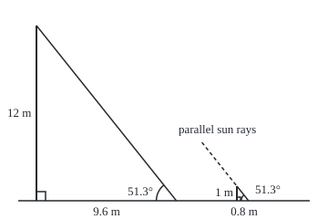
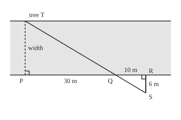

# Similar triangles: same shape, different size, and the scale factor between them

[Syllabus](../../../SYLLABUS.md) → [Geometry and trig](../README.md) → [Angles, Triangles and Congruence](../README.md#s01) → Similar triangles

---

## General Overview

A flagpole stands on a level field. Nobody can climb it with a tape measure, but its shadow can be measured: 9.6 m along the grass. At the same moment, a metre stick held upright casts a shadow of 0.8 m.

The pole's shadow is 12 times the stick's, so the pole is 12 times the stick's height: 12 m. The sun hits both at the same angle, so the pole's triangle of height, shadow and sun's ray is the stick's triangle blown up 12 times.

Two triangles with the same shape are **similar**: one is a uniformly enlarged or shrunk copy of the other. The number that turns one into the other, 12 here, is the **scale factor**. Similarity is congruence with the size let go ([Congruent triangles](03-congruent-triangles.md)): congruent triangles are similar with a scale factor of 1.

Lengths scale by the factor; areas do not. The pole's triangle covers 144 times the stick's, because an area has two directions and both stretch.

**If two angles of one triangle equal two angles of another, the triangles are similar: every length of one is the same multiple of the matching length of the other, and every area is that multiple squared.**

**What kind of fact this is:** a theorem, proved on this card in Why it works; "similar" and "scale factor" are definitions.

### The picture: two shadows, one sun

<p align="center"></p>

Drawn to scale, 1 m = 16 units. The dashed line extends the stick's ray, parallel to the pole's; the arcs mark equal angles.

---

## The formula

Notation first, in words. The stick's height is $h$ and its shadow $s$; the pole's height is $H$ and its shadow $S$. The scale factor, big over small, is $k$.

$$k = \frac{S}{s} = \frac{H}{h}, \qquad\text{so}\qquad H = h \times \frac{S}{s} = 1 \times \frac{9.6}{0.8} = 12 \text{ m}$$

**Read it aloud:** the pole's height is to the stick's as the pole's shadow is to the stick's shadow.

$$\frac{\text{area of the pole's triangle}}{\text{area of the stick's triangle}} = k^2 = 144$$

**Read it aloud:** scale every length by k and every area scales by k times k.

| Symbol | Plain meaning | In our example | Push it up and the answer… |
| --- | --- | --- | --- |
| $h$ | the stick's height | 1 m | taller pole |
| $s$ | the stick's shadow | 0.8 m | shorter pole |
| $H$ | the pole's height, the unknown | 12 m | — |
| $S$ | the pole's shadow | 9.6 m | taller pole, in proportion |
| $k$ | the scale factor: big length over matching small one | 12 | every length grows by it |
| $k^2$ | the area factor | 144 | areas grow by its square |

The factor has no unit, metres over metres, so both shadows must be in the same unit.

### When it holds

- **Same sun angle.** Both shadows must be read at the same moment. Read the stick's an hour later at 1.2 m and the pole comes out at 8 m.
- **Upright objects on level ground.** A leaning pole or a sloping field changes one triangle's angles, and the ratio stops applying.
- **Parallel rays.** The sun is far enough away for its rays to arrive parallel. A street lamp's rays spread from a point and meet stick and pole at different angles.
- **A flat plane.** On a sphere, triangles with equal angles are the same size; no scaled copies exist.

---

## Why it works

### Step 0: angles fix the shape, and the shape fixes the ratios

Angles say nothing about size. Fix them, and the only freedom left is how big to draw the triangle. The steps below prove it.

### Step 1: the sun gives two equal angles, so the third matches too

Each object stands upright, so each triangle has a right angle at the ground. Parallel rays cross level ground at equal angles ([Angles](01-angles-and-parallel-lines.md)): 51.3° at both shadow tips. The three angles of any triangle add to 180° ([Triangles](02-triangle-angle-sum-and-inequality.md)), so the angles at the tops match as well. Two equal angles are enough; this is the **AA test** (angle-angle).

### Step 2: slide the small triangle inside the big one

Call the pole's shadow tip T, its foot B, its top C. Carry the stick until its shadow tip also lands on T. Its foot, D, now lies on TB. The angle at T is the same for both, so the stick's ray lies along TC, and its top, E, sits on the pole's ray. The stick stands upright, like the pole, so DE is parallel to BC. For any two triangles with two equal angles the same slide works: the equal angles at D and B make DE parallel to BC.

### Step 3: a parallel cut divides both sides in the same ratio

A line parallel to one side of a triangle cuts the other two sides in equal proportions. Along the ground, TD is 0.8 m of TB's 9.6 m: one twelfth. Along the ray, TE is then one twelfth of TC too. The proof compares areas.

<details>
<summary>Detailed proof: a parallel cut divides both sides proportionally</summary>

The corners are named as in Step 2: D on TB and E on TC, with DE parallel to BC.

Triangles DEB and DEC stand on the same base DE. Their far corners B and C lie on BC, which is parallel to DE, so both are the same height above DE. Equal base and equal height give equal area.

Triangles TDE and DBE share the corner E, and their bases TD and DB lie on one line, so they have the same height from E. Their areas are in the ratio TD to DB. In the same way, triangles TDE and DCE share the corner D, so their areas are in the ratio TE to EC.

The second areas, DBE and DCE, are equal. So TD to DB equals TE to EC. Add 1 to each side: TB to DB equals TC to EC. Flip both ratios and take each from 1:

$$\frac{TD}{TB} = \frac{TE}{TC}.$$

The same argument runs in reverse: if a line cuts two sides proportionally, it is parallel to the third. That is Euclid's *Elements*, Book VI, Proposition 2.

</details>

### Step 4: the heights follow

The heights need one more cut. From E draw a line level with the ground, meeting the pole at F. That line is parallel to TB, so Step 3 applies again, now in the corner at C: CF is the same fraction of CB as CE is of CT. Since TE is one twelfth of TC, CE is eleven twelfths of it, so CF is eleven twelfths of the pole and FB is the last twelfth. FB is level with the stick's top, so it equals the stick's height. All three pairs of sides share one ratio: $k$ = 12.

### Step 5: areas scale by the square

A triangle's area is half its base times its height. Scaling by $k$ multiplies the base by $k$ and the height by $k$, so the area gets $k$ twice: $k^2$. The stick's triangle covers 0.4 m^2, the pole's 0.4 × 144 = 57.6 m^2.

Two other tests are proved the same way: three sides in one ratio (Euclid VI.5), or two sides in one ratio with the angle between them equal (VI.6). Another road to the height is the angle itself: shelf 03's right-triangle card calls the fixed ratio of height to shadow the **tangent** of the sun's angle.

---

## Worked numbers, by hand

| Step | Arithmetic | Value |
| --- | --- | --- |
| scale factor | pole's shadow over stick's: 9.6 ÷ 0.8 | 12 |
| pole's height | stick's height times the factor: 1 × 12 | **12 m** |
| stick's triangle area | half of 1 × 0.8 | 0.4 m^2 |
| pole's triangle area | half of 12 × 9.6 | 57.6 m^2 |
| area ratio | 57.6 ÷ 0.4 | **144 = 12 × 12** |

### A second case: a river's width

The same idea reaches distances that cannot be walked. A tree T stands on the far bank. From P, directly across from it, walk 30 m along the bank to a marker Q, then 10 m on to R. Turn away from the river at a right angle and walk until tree and marker line up, at S: 6 m.

<p align="center"></p>

Drawn to scale, 1 m = 6 units. The river is shaded; the sight line runs from T through Q to S.

The triangles meet at Q, where their angles are opposite each other across two crossing lines, so equal; both have a right angle. AA makes them similar, with factor 30 ÷ 10 = 3. The river is 6 × 3 = **18 m** wide.

### What breaks if you drop a piece

| Mistake | Comes out at | What went wrong |
| --- | --- | --- |
| Ratio crossed: pole's height over its shadow set to stick's shadow over its height | 7.68 m | Height matched with shadow |
| Area scaled by the factor | 4.8 m^2 | One direction stretched, not two |
| Stick's shadow read later, at 1.2 m | 8 m | The sun moved; the triangles are not similar |

The code prints all three.

---

## Code, from first principles, and it actually runs

The pole's height takes two roads. One scales the stick's height by the shadow ratio. The other forms no ratio of shadows: it hunts by repeated halving (bisection) for the pole height whose sun angle, compared through the dot product of the two sides at the shadow tip, equals the stick's. Areas come from half base times height and from counting the 1 cm squares whose centres lie inside. The river's width comes from scaling and from intersecting the sight line with the line across the river on a grid. Four asserts compare the roads.

### Python

```python
# Similar triangles and scale -- the check behind the card.  Standard library
# only.  A metre stick and a flagpole stand on level ground in the same sun.
# The pole's height is found twice: by scaling the stick (road one) and by
# hunting the height that makes the sun's angle match (road two).  Areas are
# found by the formula and by counting 1 cm squares.  A river is crossed too.
import math
h, s, S = 1.0, 0.8, 9.6                 # stick height, stick shadow, pole shadow (m)
k = S / s                               # road one: the scale factor
H1 = h * k

def cos_at_tip(height, shadow):         # cosine at the tip: dot product of the sides over their lengths
    return shadow / math.sqrt(shadow * shadow + height * height)

lo, hi = 0.0, 1000.0                    # road two: bisection on the pole height
for _ in range(200):
    mid = (lo + hi) / 2
    if cos_at_tip(mid, S) > cos_at_tip(h, s): lo = mid
    else: hi = mid
H2 = (lo + hi) / 2
assert abs(H1 - H2) < 1e-9

def count_cm2(hc, sc):                  # squares of 1 cm whose centre lies under the ray
    return sum(1 for i in range(sc) for j in range(hc)
               if (2 * j + 1) * sc + (2 * i + 1) * hc < 2 * hc * sc)
a_stick, a_pole = h * s / 2, H1 * S / 2
c_stick, c_pole = count_cm2(100, 80), count_cm2(1200, 960)
assert abs(c_pole / 1e4 - a_pole) / a_pole < 0.005
assert abs(c_pole / c_stick - k * k) / (k * k) < 0.01

near, on, back = 30.0, 10.0, 6.0        # river: marker Q is 30 m along, R 10 m on, S 6 m back
w1 = back * near / on                   # road one: scale the small triangle
x1, y1, x2, y2 = on + near, -back, near, 0.0   # road two: line S to Q meets the line x = 0
w2 = y1 + (0 - x1) * (y2 - y1) / (x2 - x1)
assert abs(w1 - w2) < 1e-9

print(f"flagpole: stick {h:.1f} m casts {s:.1f} m, pole casts {S:.1f} m")
print(f"scale factor k = {k:.0f}")
print(f"road 1, scale the stick: pole height {H1:.6f} m")
print(f"road 2, match the sun's angle by bisection: pole height {H2:.6f} m")
sun, top = math.degrees(math.atan2(h, s)), math.degrees(math.atan2(s, h))
print(f"angles: sun {sun:.1f} at both tips, top {top:.1f}, with the right angle {sun + top + 90:.1f}")
print(f"areas by formula: stick {a_stick:.6f} m^2, pole {a_pole:.6f} m^2")
print(f"areas by counting 1 cm squares: stick {c_stick / 1e4:.4f} m^2, pole {c_pole / 1e4:.4f} m^2")
print(f"area ratio: formula {a_pole / a_stick:.4f}, counted {c_pole / c_stick:.4f}, k^2 = {k * k:.0f}")
print(f"river: factor {near / on:.0f}, road 1, scale the 6 m walk: width {w1:.6f} m")
print(f"river: road 2, intersect the sight line: width {w2:.6f} m")
print(f"mistake, ratio upside down: {s * S / h:.6f} m")
print(f"mistake, area scaled by k: {a_stick * k:.6f} m^2")
print(f"mistake, stick shadow read later at 1.2 m: {h * S / 1.2:.6f} m")
g, m = 220.0, 16.0                      # figures: ground line and units per metre
print(f"figure, flag (1 m = 16): pole (40.0,{g:.1f})-(40.0,{g - H1 * m:.1f}), tip ({40 + S * m:.1f},{g:.1f}), "
      f"stick top (260.0,{g - h * m:.1f}), tip ({260 + s * m:.1f},{g:.1f})")
print(f"figure, river (1 m = 6): P (50,150), T (50,{150 - w1 * 6:.0f}), Q ({50 + near * 6:.0f},150), "
      f"R ({50 + (near + on) * 6:.0f},150), S ({50 + (near + on) * 6:.0f},{150 + back * 6:.0f})")
print("ALL CHECKS PASS")
```

**Ran 2026-09-24 on macOS, Python 3.14.6, standard library only. All checks passed. Output, pasted from the run:**

```
flagpole: stick 1.0 m casts 0.8 m, pole casts 9.6 m
scale factor k = 12
road 1, scale the stick: pole height 12.000000 m
road 2, match the sun's angle by bisection: pole height 12.000000 m
angles: sun 51.3 at both tips, top 38.7, with the right angle 180.0
areas by formula: stick 0.400000 m^2, pole 57.600000 m^2
areas by counting 1 cm squares: stick 0.4000 m^2, pole 57.6000 m^2
area ratio: formula 144.0000, counted 144.0000, k^2 = 144
river: factor 3, road 1, scale the 6 m walk: width 18.000000 m
river: road 2, intersect the sight line: width 18.000000 m
mistake, ratio upside down: 7.680000 m
mistake, area scaled by k: 4.800000 m^2
mistake, stick shadow read later at 1.2 m: 8.000000 m
figure, flag (1 m = 16): pole (40.0,220.0)-(40.0,28.0), tip (193.6,220.0), stick top (260.0,204.0), tip (272.8,220.0)
figure, river (1 m = 6): P (50,150), T (50,42), Q (230,150), R (290,150), S (290,186)
ALL CHECKS PASS
```

### Rust

```rust
// Similar triangles and scale -- the check behind the card.  std only.
// A metre stick and a flagpole stand on level ground in the same sun.
// The pole's height is found twice: by scaling the stick (road one) and by
// hunting the height that makes the sun's angle match (road two).  Areas are
// found by the formula and by counting 1 cm squares.  A river is crossed too.

fn cos_at_tip(height: f64, shadow: f64) -> f64 {
    // dot product of the two sides at the shadow tip, over their lengths
    shadow / (shadow * shadow + height * height).sqrt()
}

fn count_cm2(hc: i64, sc: i64) -> i64 {
    // squares of 1 cm whose centre lies under the ray
    let mut n = 0;
    for i in 0..sc {
        for j in 0..hc {
            if (2 * j + 1) * sc + (2 * i + 1) * hc < 2 * hc * sc {
                n += 1;
            }
        }
    }
    n
}

fn main() {
    let (h, s, big_s) = (1.0_f64, 0.8_f64, 9.6_f64); // stick height, stick shadow, pole shadow (m)
    let k = big_s / s; // road one: the scale factor
    let h1 = h * k;

    let (mut lo, mut hi) = (0.0_f64, 1000.0_f64); // road two: bisection on the pole height
    for _ in 0..200 {
        let mid = (lo + hi) / 2.0;
        if cos_at_tip(mid, big_s) > cos_at_tip(h, s) { lo = mid; } else { hi = mid; }
    }
    let h2 = (lo + hi) / 2.0;
    assert!((h1 - h2).abs() < 1e-9);

    let (a_stick, a_pole) = (h * s / 2.0, h1 * big_s / 2.0);
    let (c_stick, c_pole) = (count_cm2(100, 80) as f64, count_cm2(1200, 960) as f64);
    assert!((c_pole / 1e4 - a_pole).abs() / a_pole < 0.005);
    assert!((c_pole / c_stick - k * k).abs() / (k * k) < 0.01);

    let (near, on, back) = (30.0_f64, 10.0_f64, 6.0_f64); // river: Q 30 m along, R 10 m on, S 6 m back
    let w1 = back * near / on; // road one: scale the small triangle
    let (x1, y1, x2, y2) = (on + near, -back, near, 0.0_f64); // road two: line S to Q meets x = 0
    let w2 = y1 + (0.0 - x1) * (y2 - y1) / (x2 - x1);
    assert!((w1 - w2).abs() < 1e-9);

    println!("flagpole: stick {:.1} m casts {:.1} m, pole casts {:.1} m", h, s, big_s);
    println!("scale factor k = {:.0}", k);
    println!("road 1, scale the stick: pole height {:.6} m", h1);
    println!("road 2, match the sun's angle by bisection: pole height {:.6} m", h2);
    let (sun, top) = (h.atan2(s).to_degrees(), s.atan2(h).to_degrees());
    println!("angles: sun {:.1} at both tips, top {:.1}, with the right angle {:.1}", sun, top, sun + top + 90.0);
    println!("areas by formula: stick {:.6} m^2, pole {:.6} m^2", a_stick, a_pole);
    println!("areas by counting 1 cm squares: stick {:.4} m^2, pole {:.4} m^2", c_stick / 1e4, c_pole / 1e4);
    println!("area ratio: formula {:.4}, counted {:.4}, k^2 = {:.0}", a_pole / a_stick, c_pole / c_stick, k * k);
    println!("river: factor {:.0}, road 1, scale the 6 m walk: width {:.6} m", near / on, w1);
    println!("river: road 2, intersect the sight line: width {:.6} m", w2);
    println!("mistake, ratio upside down: {:.6} m", s * big_s / h);
    println!("mistake, area scaled by k: {:.6} m^2", a_stick * k);
    println!("mistake, stick shadow read later at 1.2 m: {:.6} m", h * big_s / 1.2);
    let (g, m) = (220.0_f64, 16.0_f64); // figures: ground line and units per metre
    println!("figure, flag (1 m = 16): pole (40.0,{:.1})-(40.0,{:.1}), tip ({:.1},{:.1}), stick top (260.0,{:.1}), tip ({:.1},{:.1})",
             g, g - h1 * m, 40.0 + big_s * m, g, g - h * m, 260.0 + s * m, g);
    println!("figure, river (1 m = 6): P (50,150), T (50,{:.0}), Q ({:.0},150), R ({:.0},150), S ({:.0},{:.0})",
             150.0 - w1 * 6.0, 50.0 + near * 6.0, 50.0 + (near + on) * 6.0, 50.0 + (near + on) * 6.0, 150.0 + back * 6.0);
    println!("ALL CHECKS PASS");
}
```

**Ran 2026-09-24 on macOS, rustc 1.98.1, no crates. All checks passed. Output, pasted from the run:**

```
flagpole: stick 1.0 m casts 0.8 m, pole casts 9.6 m
scale factor k = 12
road 1, scale the stick: pole height 12.000000 m
road 2, match the sun's angle by bisection: pole height 12.000000 m
angles: sun 51.3 at both tips, top 38.7, with the right angle 180.0
areas by formula: stick 0.400000 m^2, pole 57.600000 m^2
areas by counting 1 cm squares: stick 0.4000 m^2, pole 57.6000 m^2
area ratio: formula 144.0000, counted 144.0000, k^2 = 144
river: factor 3, road 1, scale the 6 m walk: width 18.000000 m
river: road 2, intersect the sight line: width 18.000000 m
mistake, ratio upside down: 7.680000 m
mistake, area scaled by k: 4.800000 m^2
mistake, stick shadow read later at 1.2 m: 8.000000 m
figure, flag (1 m = 16): pole (40.0,220.0)-(40.0,28.0), tip (193.6,220.0), stick top (260.0,204.0), tip (272.8,220.0)
figure, river (1 m = 6): P (50,150), T (50,42), Q (230,150), R (290,150), S (290,186)
ALL CHECKS PASS
```

The outputs agree line for line. The square count lands exactly on the formula because each square the ray cuts is matched by one with the opposite overhang.

> [!TIP]
> **Try changing**
> Guess first, then run it. An assert stops the program when two roads disagree.
> - **Double the pole's shadow.** Set `S` to `19.2`. Both roads give 24 m, but the square count is still sized for the 12 m pole, so the second assert stops it.
> - **Halve less often.** Cut the bisection from 200 rounds to 20. Each round halves the search interval, and 20 rounds leave it about a millimetre wide, so the first assert, which asks for agreement to a billionth of a metre, stops it.
> - **Flip the ratio.** Write `k = s / S`. Road one gives a pole shorter than a pencil; the bisection still finds 12 m, and the first assert stops it.

---

## The usual mistake

> [!warning]
> **Using the ratio before checking the angles.** Triangles that merely look alike need not have proportional sides. A leaning pole, a sloping field, a lamp instead of the sun: each changes an angle, and the shadow ratio then gives a confident wrong height. The theorem's input is the pair of equal angles.
>
> - **Matching the wrong sides.** Pair height with height, shadow with shadow; crossing them gives 7.68 m.
> - **Scaling area by the factor.** The pole's triangle covers 57.6 m^2, not 4.8 m^2.
> - **Mixed units.** The factor is a pure number only if both shadows are in metres; a pole's shadow in centimetres over a stick's in metres gives a pole over a kilometre tall.

---

## Where you meet it in real life

- **Heights from shadows.** Thales of Miletus is reported to have measured a pyramid this way, against a staff's shadow.
- **Surveying across obstacles.** The river construction measures a width by walking on the near side only.
- **Maps and plans.** A plan at one scale keeps every angle, so lengths shrink by one factor and areas by its square: a plan twice the size needs four times the ink.
- **Scale models.** An engineering model is a similar copy of the full-size machine; its areas and forces scale by powers of the factor ([Similarity](../../13-Engineering%20mathematics/01-Units%20and%20Modelling/04-similarity-and-model-testing.md)).

> **Say it back**
> Two triangles are similar when one is a uniformly scaled copy of the other. Two equal angles are enough to prove it, because a line parallel to one side of a triangle cuts the other two sides in the same ratio. Every length of the big triangle is then the scale factor times its match: 9.6 m of shadow against 0.8 m gives 12, and the pole is 12 m tall. Areas scale by the factor squared, 144 here, because base and height both stretch.

---

## What this builds on

- [Congruent triangles](03-congruent-triangles.md): matching corners in order, and the tests that fix a triangle; similarity is congruence with the size set free.
- [Ratios and rates](../../01-Foundations/01-Everyday%20Arithmetic/09-ratios-and-rates.md): equal ratios, and why a ratio of like units has no unit.

## Where this goes next

- [Pythagoras](05-pythagoras-and-its-converse.md): the height dropped onto the long side of a right triangle splits it into two triangles similar to the whole, and that gives Pythagoras.
- [Similarity](../../13-Engineering%20mathematics/01-Units%20and%20Modelling/04-similarity-and-model-testing.md): scaling laws for whole machines, where lengths, areas and volumes grow at different rates.

Each area here came from a base and a height; finding one from the sides alone, or for shapes that are not triangles, is [Area](06-area-of-triangles-and-polygons.md).

---

## Sources

Verified 2026-09-24: every link below opens the cited page.

- Euclid, *Elements*, Book VI, [Proposition 2](https://mathcs.clarku.edu/~djoyce/elements/bookVI/propVI2.html), ed. D. E. Joyce, Clark University. The parallel cut, proved by areas.
- Euclid, *Elements*, Book VI, [Proposition 4](https://mathcs.clarku.edu/~djoyce/elements/bookVI/propVI4.html). Triangles with equal angles have proportional sides: the AA test.
- Euclid, *Elements*, Book VI, [Proposition 19](https://mathcs.clarku.edu/~djoyce/elements/bookVI/propVI19.html). Similar triangles' areas are in the "duplicate ratio" of their sides: the square of the scale factor.
- O'Connor, J. J., and E. F. Robertson. "Thales of Miletus." MacTutor Archive, University of St Andrews. [Biography](https://mathshistory.st-andrews.ac.uk/Biographies/Thales/). The ancient accounts of measuring a pyramid by its shadow.
