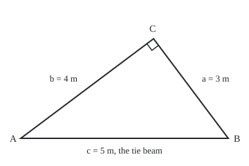
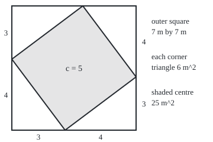

# Pythagoras: the rule that fixes a right triangle, and the test that detects one

[Syllabus](../../../SYLLABUS.md) → [Geometry and trig](../../../SYLLABUS.md#w05) → [Angles, Triangles and Congruence](../../../SYLLABUS.md#w05-s01) → Pythagoras

---

## General Overview

A roof truss is a triangle of timber. Two sloping rafters meet at the ridge; a tie beam joins their feet. Here the rafters are 3 m and 4 m and meet square: at a right angle, 90°. The tie beam must then be exactly 5 m. Not 7 m, the rafters laid end to end. Not "about 5".

The numbers also work backwards. A carpenter setting out a corner marks 3 m along one edge and 4 m along the other. Marks exactly 5 m apart mean the corner is square. At 5.1 m it has opened past square; at 4.9 m it has closed.

These are two claims. One starts from a right angle and fixes a length; the other starts from three lengths and detects a right angle. A claim turned round need not stay true, so each gets its own proof.

**In a flat triangle with a right angle, the squares on the two short sides add up to the square on the long side; and when three lengths obey that equation, the triangle they make has a right angle.**

**What kind of fact this is:** a theorem and its converse (the same statement run backwards), both proved on this card in Why it works.

### The picture: the truss, to scale

<p align="center"></p>

Drawn at 1 m = 60 units. The ridge C sits 3.2 m along the tie beam from A and 2.4 m above it; the small square at C marks the right angle.

---

## The formula

Reminder: corners are A, B, C, and each side carries the lower-case letter of the corner opposite it ([Angles](01-angles-and-parallel-lines.md)). Put the right angle at C. The sides meeting there, $a$ and $b$, are the **legs**; the side opposite, $c$, is the **hypotenuse**, always the longest.

$$a^2 + b^2 = c^2$$

**Read it aloud:** the square on one leg plus the square on the other leg equals the square on the hypotenuse.

$a^2$ is $a$ times $a$: the area of a square with side $a$. For the truss, 9 + 16 = 25 m^2. The positive square root gives a length back ([Roots](../../01-Foundations/03-Powers%2C%20Roots%20and%20Logarithms/03-roots-and-fractional-exponents.md)):

$$c = \sqrt{a^2 + b^2}, \qquad b = \sqrt{c^2 - a^2}$$

**Read it aloud:** the hypotenuse is the root of the leg squares added; a missing leg is the root of the hypotenuse square minus the other leg's.

The **converse**: if three positive lengths satisfy $a^2 + b^2 = c^2$, their triangle has a right angle between $a$ and $b$. The test is the **residual** $a^2 + b^2 - c^2$: zero means square.

| Symbol | Plain meaning | In our example | Push it up and the answer… |
| --- | --- | --- | --- |
| $A$, $B$, $C$ | the corners: rafter feet A and B, ridge C | A to B is 5 m | — |
| $a$ | the leg opposite A: rafter BC | 3 m | the span grows, but by less than the rafter grew |
| $b$ | the leg opposite B: rafter CA | 4 m | the same |
| $c$ | the hypotenuse, opposite C: the tie beam | 5 m | with legs fixed, the corner opens past square |
| $a^2$, $b^2$, $c^2$ | areas of squares on each side | 9, 16, 25 m^2 | — |
| $\sqrt{\ }$ | the positive square root: the length whose square is given | the root of 25 is 5 | — |
| $d$ | the converse proof's built third side | 5 m | — |
| $a^2 + b^2 - c^2$ | the residual: zero exactly when the corner is square | 0; −1.01 for a 5.1 m diagonal | negative: opened; positive: closed |

### When it holds

- **A flat surface.** On a curved one, such as the Earth over hundreds of kilometres, a right-angled triangle's hypotenuse comes out shorter than the rule says.
- **The right angle at C.** The side opposite the right angle always stands alone; put it elsewhere and the equation misleads.
- **Exact lengths for an exact verdict.** A tape reads to about a millimetre, so a residual near zero shows a corner square only to that accuracy.

---

## Why it works

### Step 0: count one area two ways

Build one big square out of pieces and count its area twice: as a whole, and piece by piece. The two counts must agree; their agreement is the theorem.

### The picture: four copies of the truss in a 7 m square

<p align="center"></p>

Drawn at 1 m = 30 units. Each side of the outer square is one 3 m leg and one 4 m leg; each slanted side of the shaded centre is a 5 m hypotenuse.

### Step 1: pack four copies of the triangle into a square

Put a copy of the truss triangle in each corner of a square of side $a + b$, 7 m here, right angle in the corner. Turn the copies so every side of the big square is one leg $a$ followed by one leg $b$. The four hypotenuses enclose a middle region with four sides of length $c$.

### Step 2: the middle is a square

Four equal sides alone make only a diamond; the corners must be right angles too. Where two hypotenuses meet the outer edge, three angles sit along a straight line, so they add to 180°. Two are the triangle's two sharp angles, one from each copy, and they add to 90°, since a triangle's angles total 180° and the right angle has used 90° ([Triangles](02-triangle-angle-sum-and-inequality.md)). The third, the middle's corner, is 90°. So the middle is a square of area $c^2$.

### Step 3: subtract

Each corner triangle is half an $a$ by $b$ rectangle cut along its diagonal, so its area is $ab/2$: 6 m^2 here. From the big square's $(a + b)^2$, take the four triangles away:

$$c^2 = (a + b)^2 - 4 \cdot \tfrac{ab}{2} = a^2 + 2ab + b^2 - 2ab = a^2 + b^2$$

The mixed $2ab$ terms cancel. Nothing used 3 and 4, so the rule holds for every right triangle. For the truss: 49 − 24 = 25.

### Step 4: the converse, by building a second triangle

Now start from three lengths $a$, $b$, $c$ with $a^2 + b^2 = c^2$, and no angle known. Build a separate triangle with a right angle between legs $a$ and $b$; call its hypotenuse $d$. Steps 1 to 3 give $d^2 = a^2 + b^2 = c^2$. Two positive lengths with equal squares are equal, so $d = c$.

The two triangles now match side for side, and three matching sides force matching angles (the side-side-side test, [Congruent triangles](03-congruent-triangles.md)). The built triangle is right-angled between $a$ and $b$, so the original is too. That is the carpenter's 3-4-5 check, proved.

<details>
<summary>Detailed proof: the points the steps pass over</summary>

**No gaps, no overlaps.** Each side reads $a$ then $b$, total $a + b$, so neighbouring copies meet exactly on the edge. The middle lies inside all four hypotenuses, so the areas add: $(a + b)^2 = 4 \cdot ab/2 + c^2$.

**Equal squares give equal lengths.** If $d$ were longer than $c$, then $d^2$ would exceed $c^2$; if shorter, fall short. Only $d = c$ fits.

**No distance formula.** The grid distance formula is built from this theorem ([Distance and midpoint](../04-Coordinates%20and%20Curves/01-distance-and-midpoint.md)), so proving the theorem with it would argue in a circle.

</details>

A second road: drop a line from the ridge square onto the tie beam. It cuts the truss into two smaller right triangles, each the same shape as the whole. Matching side ratios make $a^2$ and $b^2$ the hypotenuse times each piece it was cut into; added, they give $c$ times $c$. The ratios are the work of [Similar triangles](04-similar-triangles-and-scale.md). For the truss the pieces are 1.8 m and 3.2 m: 5 × 1.8 = 9 and 5 × 3.2 = 16.

---

## Worked numbers, by hand

| Step | Arithmetic | Value |
| --- | --- | --- |
| square the rafters | 3 × 3 and 4 × 4 | 9 and 16 m^2 |
| add | 9 + 16 | 25 m^2 |
| back to a length | the root of 25 | **5 m** |
| outer square of the dissection | 7 × 7 | 49 m^2 |
| four corner triangles | 4 × (3 × 4 ÷ 2) | 24 m^2 |
| middle square | 49 − 24 | **25 m^2** |
| missing rafter, span 5 m and rafter 3 m | the root of 25 − 9 = 16 | **4 m** |
| a symmetric truss, rafters 3 m and 3 m | the root of 9 + 9 = 18 | **4.2426406871 m** |
| corner check, diagonal reads 5.1 m | 9 + 16 − 26.01 | **−1.01**: opened past square |

The 3-4 truss takes a tie beam cut at exactly 5 m. The 3-3 truss needs one no tape reads as a round number: 18 has no whole-number root.

### What breaks if you drop a piece

| Mistake | Comes out at | What went wrong |
| --- | --- | --- |
| Add the rafters | 3 + 4 = 7 m | The walk along both rafters is longer than the straight line across |
| Stop before the root | 25 "m" | 25 is an area in m^2, not a length |
| Call the 4 m rafter the hypotenuse | the root of 16 − 9: 2.6457513111 m | The side opposite the right angle was misidentified |

The code prints all three.

---

## Code, from first principles, and it actually runs

Nothing is imported; the square root is found by halving an interval. The area $c^2$ is reached three ways: the rule, the dissection's subtraction, and the shoelace formula, which finds a polygon's area from the grid positions of its corners and never measures a slanted side. For the converse, the program lays rafter $a$ along the ground, swings rafter $b$ round a circle, and searches for the point where the diagonal reads the tape's value. That point's sideways shift from the square position must equal the residual divided by twice $a$; the law of cosines, on the trigonometry shelf, says why. A second truss, rafters 3 m and 3 m, runs the same roads.

### Python

```python
# Pythagoras and its converse -- the check behind the card.  Nothing is imported.
# Truss: rafters 3 m and 4 m, square at the ridge.  Roads: the rule, the dissection,
# the tilted square's corner coordinates; the converse by a search round a circle.

def root(x):                             # square root by halving an interval
    lo, hi = 0.0, max(1.0, x)
    for _ in range(200):
        mid = (lo + hi) / 2
        lo, hi = (mid, hi) if mid * mid < x else (lo, mid)
    return lo

def shoelace(pts):                       # area of a polygon from its corners
    s = 0
    for (x, y), (u, v) in zip(pts, pts[1:] + pts[:1]):
        s += x * v - y * u
    return abs(s) / 2

def centre(a, b):                        # the tilted square inside the (a+b) square
    return [(a, 0), (a + b, a), (b, a + b), (0, b)]

def corner_x(a, b, c):                   # search for the far end of rafter b
    lo, hi = 0.0, 1000.0                 # t walks it round a circle of radius b
    for _ in range(200):
        t = (lo + hi) / 2
        x, y = b * (1 - t * t) / (1 + t * t), 2 * b * t / (1 + t * t)
        lo, hi = (t, hi) if (x - a) ** 2 + y * y < c * c else (lo, t)
    return x                             # x = 0 means the corner is square

for a, b in [(3, 4), (3, 3)]:
    rule, box = a * a + b * b, (a + b) ** 2 - 4 * (a * b / 2)
    area = shoelace(centre(a, b))
    print(f"rafters {a} and {b}: rule {a}^2 + {b}^2 = {rule}, span {root(rule):.10f}")
    print(f"  dissection: outer {a + b} x {a + b} = {(a + b) ** 2}, four triangles 4 x {a * b // 2} = {2 * a * b},"
          f" left {box:.0f}; corner coordinates give {area:.0f}; root {root(area):.10f}")
    assert rule == area and box == area                # three roads to one area
leg = root(5 * 5 - 3 * 3)
print(f"missing rafter, span 5 and rafter 3: {leg:.10f}")
c = root(25); p, q = 9 / c, 16 / c                     # the altitude's two pieces
print(f"altitude from C: pieces {p:.1f} + {q:.1f} = {p + q:.1f}, height {12 / c:.1f};"
      f" 5 x {p:.1f} = {c * p:.0f}, 5 x {q:.1f} = {c * q:.0f}")
assert abs(leg - 4) < 1e-9                             # the rafter actually cut
for c in [5.0, 5.1, 4.9, 5.001]:
    res = 3 * 3 + 4 * 4 - c * c
    x = corner_x(3, 4, c)
    x = 0.0 if abs(x) < 1e-12 else x
    verdict = "square" if x == 0 else ("opened" if x < 0 else "closed") + f" by {abs(x):.4f} m"
    print(f"corner test, diagonal {c:.3f}: 9 + 16 - {c * c:.6f} = {res:.6f}; search: {verdict}")
    assert abs(x - res / 6) < 1e-9                     # the search agrees with the residual
print(f"mistakes: add the rafters {3 + 4}; stop before the root {3 * 3 + 4 * 4};"
      f" 4 m rafter as the span {root(4 * 4 - 3 * 3):.10f}; 3, 5, 4 in place {9 + 25 - 16}")
print(f"try: rafters 6 and 8 span {root(6 * 6 + 8 * 8):.4f}; 5 and 12 span {root(5 * 5 + 12 * 12):.4f};"
      f" diagonal 5.01 opened by {-corner_x(3, 4, 5.01):.4f} m")
k = 60                                                 # truss figure: 1 m = 60 units
cx, cy = 30 + k * 16 / 5, 200 - k * 12 / 5
print(f"figure, truss 1 m = {k}: A (30, 200) B ({30 + 5 * k}, 200) C ({cx:.0f}, {cy:.0f})")
print(f"figure, square marker ({cx - 9.6:.1f}, {cy + 7.2:.1f}) ({cx - 2.4:.1f}, {cy + 16.8:.1f})"
      f" ({cx + 7.2:.1f}, {cy + 9.6:.1f})")
pts = [(20 + 30 * x, 220 - 30 * y) for x, y in centre(3, 4)]
print(f"figure, dissection 1 m = 30: outer (20, 10) to (230, 220); centre {pts}")
print("ALL CHECKS PASS")
```

**Ran 2026-09-24 on macOS, Python 3.14.6, standard library only. All checks passed. Output, pasted from the run:**

```
rafters 3 and 4: rule 3^2 + 4^2 = 25, span 5.0000000000
  dissection: outer 7 x 7 = 49, four triangles 4 x 6 = 24, left 25; corner coordinates give 25; root 5.0000000000
rafters 3 and 3: rule 3^2 + 3^2 = 18, span 4.2426406871
  dissection: outer 6 x 6 = 36, four triangles 4 x 4 = 18, left 18; corner coordinates give 18; root 4.2426406871
missing rafter, span 5 and rafter 3: 4.0000000000
altitude from C: pieces 1.8 + 3.2 = 5.0, height 2.4; 5 x 1.8 = 9, 5 x 3.2 = 16
corner test, diagonal 5.000: 9 + 16 - 25.000000 = 0.000000; search: square
corner test, diagonal 5.100: 9 + 16 - 26.010000 = -1.010000; search: opened by 0.1683 m
corner test, diagonal 4.900: 9 + 16 - 24.010000 = 0.990000; search: closed by 0.1650 m
corner test, diagonal 5.001: 9 + 16 - 25.010001 = -0.010001; search: opened by 0.0017 m
mistakes: add the rafters 7; stop before the root 25; 4 m rafter as the span 2.6457513111; 3, 5, 4 in place 18
try: rafters 6 and 8 span 10.0000; 5 and 12 span 13.0000; diagonal 5.01 opened by 0.0167 m
figure, truss 1 m = 60: A (30, 200) B (330, 200) C (222, 56)
figure, square marker (212.4, 63.2) (219.6, 72.8) (229.2, 65.6)
figure, dissection 1 m = 30: outer (20, 10) to (230, 220); centre [(110, 220), (230, 130), (140, 10), (20, 100)]
ALL CHECKS PASS
```

### Rust

Same numbers, same labels, built with `rustc --edition 2021 -O`.

```rust
// Pythagoras and its converse -- the same check as the Python, in Rust.  No crates.
// Truss: rafters 3 m and 4 m, square at the ridge.  Roads: the rule, the dissection,
// the tilted square's corner coordinates; the converse by a search round a circle.

fn root(x: f64) -> f64 {                          // square root by halving an interval
    let (mut lo, mut hi) = (0.0, x.max(1.0));
    for _ in 0..200 {
        let mid = (lo + hi) / 2.0;
        if mid * mid < x { lo = mid } else { hi = mid }
    }
    lo
}

fn shoelace(p: &[(i64, i64)]) -> f64 {            // area of a polygon from its corners
    let mut s = 0;
    for j in 0..p.len() {
        let ((x, y), (u, v)) = (p[j], p[(j + 1) % p.len()]);
        s += x * v - y * u;
    }
    s.abs() as f64 / 2.0
}

fn centre(a: i64, b: i64) -> Vec<(i64, i64)> {    // the tilted square inside the (a+b) square
    vec![(a, 0), (a + b, a), (b, a + b), (0, b)]
}

fn corner_x(a: f64, b: f64, c: f64) -> f64 {      // search for the far end of rafter b
    let (mut lo, mut hi, mut x) = (0.0, 1000.0, 0.0); // t walks it round a circle of radius b
    for _ in 0..200 {
        let t: f64 = (lo + hi) / 2.0;
        x = b * (1.0 - t * t) / (1.0 + t * t);
        let y = 2.0 * b * t / (1.0 + t * t);
        if (x - a).powi(2) + y * y < c * c { lo = t } else { hi = t }
    }
    x                                             // x = 0 means the corner is square
}

fn main() {
    for (a, b) in [(3i64, 4i64), (3, 3)] {
        let (rule, sq) = (a * a + b * b, (a + b) * (a + b));
        let boxed = sq as f64 - 4.0 * (a * b) as f64 / 2.0;
        let area = shoelace(&centre(a, b));
        println!("rafters {} and {}: rule {}^2 + {}^2 = {}, span {:.10}", a, b, a, b, rule, root(rule as f64));
        println!("  dissection: outer {} x {} = {}, four triangles 4 x {} = {}, left {:.0}; corner coordinates give {:.0}; root {:.10}",
                 a + b, a + b, sq, a * b / 2, 2 * a * b, boxed, area, root(area));
        assert!(rule as f64 == area && boxed == area);  // three roads to one area
    }
    let leg = root(5.0 * 5.0 - 3.0 * 3.0);
    println!("missing rafter, span 5 and rafter 3: {:.10}", leg);
    assert!((leg - 4.0).abs() < 1e-9);                  // the rafter actually cut
    let c = root(25.0);
    let (p, q) = (9.0 / c, 16.0 / c);                   // the altitude's two pieces
    println!("altitude from C: pieces {:.1} + {:.1} = {:.1}, height {:.1}; 5 x {:.1} = {:.0}, 5 x {:.1} = {:.0}",
             p, q, p + q, 12.0 / c, p, c * p, q, c * q);
    for c in [5.0f64, 5.1, 4.9, 5.001] {
        let res = 3.0 * 3.0 + 4.0 * 4.0 - c * c;
        let mut x = corner_x(3.0, 4.0, c);
        if x.abs() < 1e-12 { x = 0.0 }
        let verdict = if x == 0.0 { "square".to_string() }
            else { format!("{} by {:.4} m", if x < 0.0 { "opened" } else { "closed" }, x.abs()) };
        println!("corner test, diagonal {:.3}: 9 + 16 - {:.6} = {:.6}; search: {}", c, c * c, res, verdict);
        assert!((x - res / 6.0).abs() < 1e-9);          // the search agrees with the residual
    }
    println!("mistakes: add the rafters {}; stop before the root {}; 4 m rafter as the span {:.10}; 3, 5, 4 in place {}",
             3 + 4, 3 * 3 + 4 * 4, root(4.0 * 4.0 - 3.0 * 3.0), 9 + 25 - 16);
    println!("try: rafters 6 and 8 span {:.4}; 5 and 12 span {:.4}; diagonal 5.01 opened by {:.4} m",
             root(6.0 * 6.0 + 8.0 * 8.0), root(5.0 * 5.0 + 12.0 * 12.0), -corner_x(3.0, 4.0, 5.01));
    let k = 60.0;                                       // truss figure: 1 m = 60 units
    let (cx, cy) = (30.0 + k * 16.0 / 5.0, 200.0 - k * 12.0 / 5.0);
    println!("figure, truss 1 m = {}: A (30, 200) B ({}, 200) C ({:.0}, {:.0})", k, 30.0 + 5.0 * k, cx, cy);
    println!("figure, square marker ({:.1}, {:.1}) ({:.1}, {:.1}) ({:.1}, {:.1})",
             cx - 9.6, cy + 7.2, cx - 2.4, cy + 16.8, cx + 7.2, cy + 9.6);
    let pts: Vec<(i64, i64)> = centre(3, 4).iter().map(|&(x, y)| (20 + 30 * x, 220 - 30 * y)).collect();
    println!("figure, dissection 1 m = 30: outer (20, 10) to (230, 220); centre {:?}", pts);
    println!("ALL CHECKS PASS");
}
```

**Ran 2026-09-24 on macOS, rustc 1.98.1, no crates. All checks passed. Output, pasted from the run:**

```
rafters 3 and 4: rule 3^2 + 4^2 = 25, span 5.0000000000
  dissection: outer 7 x 7 = 49, four triangles 4 x 6 = 24, left 25; corner coordinates give 25; root 5.0000000000
rafters 3 and 3: rule 3^2 + 3^2 = 18, span 4.2426406871
  dissection: outer 6 x 6 = 36, four triangles 4 x 4 = 18, left 18; corner coordinates give 18; root 4.2426406871
missing rafter, span 5 and rafter 3: 4.0000000000
altitude from C: pieces 1.8 + 3.2 = 5.0, height 2.4; 5 x 1.8 = 9, 5 x 3.2 = 16
corner test, diagonal 5.000: 9 + 16 - 25.000000 = 0.000000; search: square
corner test, diagonal 5.100: 9 + 16 - 26.010000 = -1.010000; search: opened by 0.1683 m
corner test, diagonal 4.900: 9 + 16 - 24.010000 = 0.990000; search: closed by 0.1650 m
corner test, diagonal 5.001: 9 + 16 - 25.010001 = -0.010001; search: opened by 0.0017 m
mistakes: add the rafters 7; stop before the root 25; 4 m rafter as the span 2.6457513111; 3, 5, 4 in place 18
try: rafters 6 and 8 span 10.0000; 5 and 12 span 13.0000; diagonal 5.01 opened by 0.0167 m
figure, truss 1 m = 60: A (30, 200) B (330, 200) C (222, 56)
figure, square marker (212.4, 63.2) (219.6, 72.8) (229.2, 65.6)
figure, dissection 1 m = 30: outer (20, 10) to (230, 220); centre [(110, 220), (230, 130), (140, 10), (20, 100)]
ALL CHECKS PASS
```

> [!TIP]
> **Try changing**
> - **Rafters 6 m and 8 m.** Guess first. Every length doubles, so the span doubles too: 10 m.
> - **Rafters 5 m and 12 m.** Guess first. The span is 13 m: another whole-number truss.
> - **Diagonal 5.01 m in the corner test.** Guess first. The search reports the corner opened by 0.0167 m.
> - **Break the dissection.** In `centre`, change `(0, b)` to `(0, a)`. The middle stops being a square and the first assert fails.

---

## The usual mistake

> [!warning]
> **Using the rule where there is no right angle.** The equation belongs to the right angle, with $c$ opposite it. Rafters of 3 m and 4 m meeting wider than square span more than 5 m, yet the rule still says 5 m. The converse checks the corner before the rule is trusted.
>
> - **Stopping at the square.** 25 is the tie beam's square in m^2; the length is its root, 5 m.
> - **Testing with the longest side out of place.** Lengths 3, 5, 4 tried in that order leave a residual of 18, though the corner is square; the longest side always goes alone on the right.
> - **Reading a near-zero residual as proof.** A diagonal of 5.001 m leaves a residual of −0.010001 m^2, a corner opened by 0.0017 m: easy to miss on a tape, still not square.

---

## Where you meet it in real life

- **Setting out foundations.** Builders peg 3 m and 4 m from a corner, or 6 m and 8 m, and adjust until the diagonal reads 5 m or 10 m. The converse is why that works.
- **Distance on a map grid.** Walk 3 km east and 4 km north and the straight line back is 5 km; the grid version is [Distance and midpoint](../04-Coordinates%20and%20Curves/01-distance-and-midpoint.md).
- **Old tablets.** Babylonian scribes listed lengths obeying the equation more than a thousand years before Pythagoras. The first proof is often credited to him, but no record of it survives.

> **Say it back**
> In a flat right triangle the leg squares add to the hypotenuse square, so 3 m and 4 m rafters need a 5 m tie beam. The proof packs four copies into a 7 m square and counts the middle twice: 49 − 24 = 25. The converse builds a right triangle on the same legs, finds the same third side, and transfers the right angle by side-side-side. So a 3-4-5 diagonal proves a corner square.

---

## What this builds on

- [Similar triangles](04-similar-triangles-and-scale.md): the same-shape ratios behind the second proof.
- [Roots](../../01-Foundations/03-Powers%2C%20Roots%20and%20Logarithms/03-roots-and-fractional-exponents.md): the positive square root that turns 25 m^2 back into 5 m.

## Where this goes next

- [Area](06-area-of-triangles-and-polygons.md): the half-rectangle area used in Step 3, extended to any triangle and polygon.
- [Distance and midpoint](../04-Coordinates%20and%20Curves/01-distance-and-midpoint.md): the rule turned into the distance between two points on a grid.
- [Law of cosines](../03-Trigonometry/06-law-of-cosines.md): what a wider ridge does to the span, and why a negative residual means an opened corner, once angles have a number.

---

## Sources

Verified 2026-09-24: every link below opens a page naming the cited work.

- Euclid. *Elements*, Book I, [Proposition 47](https://mathcs.clarku.edu/~djoyce/elements/bookI/propI47.html), David E. Joyce's edition, Clark University. The theorem, by Euclid's own area proof.
- Euclid. *Elements*, Book I, [Proposition 48](https://mathcs.clarku.edu/~djoyce/elements/bookI/propI48.html), same edition. The converse, by the built triangle of Step 4.
- Maor, Eli. *The Pythagorean Theorem: A 4,000-Year History*. Princeton University Press. [Publisher page](https://press.princeton.edu/books/paperback/9780691196886/the-pythagorean-theorem). Many proofs, and the Babylonian record.
- O'Connor, J. J., and E. F. Robertson. "Pythagoras of Samos." MacTutor Archive, University of St Andrews. [Biography](https://mathshistory.st-andrews.ac.uk/Biographies/Pythagoras/). Why the attribution is uncertain.
