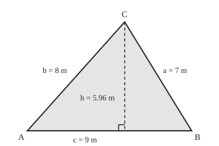
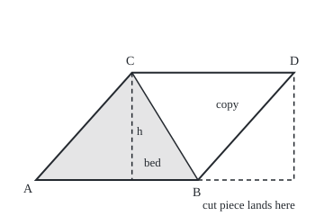

# Area: half base times height, and why cutting and rearranging never changes it

Geometry and trig → Angles, Triangles and Congruence → Measuring flat regions → Area

---

## General Overview

A garden bed is a triangle with sides 7 m, 8 m and 9 m. Topsoil is sold by the square metre, so the question is how much ground lies inside the edges. Adding the edges gives 24 m of edging board, a different question.

The school rule is half the base times the height. Take the 9 m side as the base. The height is the distance from the far corner to that side, meeting it square on. Here it is about 5.96 m, so the bed holds about 26.83 square metres.

Heron of Alexandria, in the first century, gave a rule that needs only the three sides, and it gives the same answer. Parallelograms (opposite sides parallel) and trapezoids (one pair of sides parallel) follow from one idea: slice a shape, move the pieces without stretching them, and they cover as much ground as before.

**Area counts unit squares, and cutting and moving pieces never changes that count, so a parallelogram is a rectangle in disguise, a triangle is half a parallelogram, and Heron's rule is the same triangle with its height worked out from the sides.**

**What kind of fact this is:** a theorem, proved on this card in Why it works, resting on two starting rules for area: shapes that match exactly have equal area, and pieces that do not overlap add.

### The picture: the bed, drawn to scale

<p align="center"></p>

Scale 1 m = 30 units. Corner A sits at the origin, B 9 m along, and C above a point 5.33 m from A. The dashed line is the height; the small square marks its right angle with the base.

---

## The formula

Corners are A, B and C, and each side takes the small letter of the corner it faces: side a faces A. K is the area, c the side taken as base, and h the height to it. The sign √ asks which positive number times itself gives what is under it.

$$K = \tfrac12\, c\, h$$

**Read it aloud:** a triangle's area is half of one side times the height measured square on to that side.

A parallelogram with base $c$ and height $h$ has area $c\,h$. A trapezoid whose parallel sides are $u$ and $v$, a height $h$ apart, has area

$$K = \frac{u + v}{2}\, h$$

**Read it aloud:** average the two parallel sides, then multiply by the distance between them.

Heron's rule needs only the sides. First halve the perimeter:

$$s = \frac{a + b + c}{2}, \qquad K = \sqrt{s\,(s - a)(s - b)(s - c)}$$

**Read it aloud:** take half the perimeter, multiply it by what is left after taking away each side in turn, and take the square root.

| Symbol | Plain meaning | In our example | Push it up and the answer… |
| --- | --- | --- | --- |
| $K$ | the area, in square metres | 26.832816 | — |
| $a$, $b$, $c$ | the three sides; $c$ is the one chosen as base | 7, 8, 9 m | rises until the angle it faces is square, then falls |
| $h$ | the height: square-on distance from the far corner to the base's line | 5.962848 m | grows in step: double it, double the area |
| $s$ | the semiperimeter: half the distance round | 12 m | — |
| $x$ | distance along the base from A to the foot of the height (where it meets the base) | 5.333333 m | slides the corner; area unchanged |
| $u$, $v$ | the two parallel sides of a trapezoid | 9 m and 4.5 m | grows by half the height per metre |

### When it holds

- **Flat ground.** On a curved surface, such as a large patch of the Earth, other rules apply.
- **Height means square on.** A sloping side is not a height: the 8 m side gives 36 square metres, not 26.83.
- **The sides can close.** Each side must be shorter than the other two together ([triangle-angle-sum-and-inequality](02-triangle-angle-sum-and-inequality.md)). For 2, 3 and 6 m, Heron's product comes out at −24.0625, which has no square root: there is no such triangle. At exact equality, as in 2, 3 and 5 m, the triangle lies flat and the area is 0.
- **Pieces cover once.** A polygon's area is the sum of its pieces only when they do not overlap and leave no gaps.
- **Measured sides carry error.** In a very thin triangle one of s − a, s − b, s − c is a small gap between large measured numbers, so a small tape error moves the answer a lot.

---

## Why it works

### Step 0: area is a count that cutting cannot change

A rectangle 3 m by 2 m holds six one-metre squares: width times height. For lengths that are not whole metres, finer squares count, and the rule stands.

Two rules carry the rest. Shapes that match exactly when one is laid on the other ([congruent-triangles](03-congruent-triangles.md)) have equal area. Pieces that do not overlap add. So cutting a shape up and sliding or turning the pieces keeps the total.

### Step 1: a parallelogram is a rectangle with one piece moved

Turn a copy of the bed half a turn and lay it against side BC, as drawn below. Together they make the parallelogram A, B, D, C: base 9 m, height h. Cut down the dashed height from C. Slide the left piece 9 m right and it fills the gap under D exactly, because the two slanted ends are parallel and equally long. The result is a rectangle 9 m wide and h tall. Nothing was stretched, so the parallelogram's area is $c\,h$: 53.665631 square metres.

### The picture: two beds make a parallelogram, one cut makes a rectangle

<p align="center"></p>

Scale 1 m = 20 units. Shaded: the bed. The copy is the bed turned half a turn, sharing side BC. The dashed outline on the right is where the cut-off piece lands.

### Step 2: a triangle is half a parallelogram

The parallelogram's diagonal BC splits it into two triangles with the same three sides, so they match exactly and have equal area. Each is half: $K = \tfrac12\,c\,h$, or 26.832816 square metres.

Any side can be the base, with its own height: 7.666519 m to side a, 6.708204 m to b, 5.962848 m to c. Each product is 53.665631, twice the area.

### Step 3: a trapezoid is half a parallelogram too

Two copies of any trapezoid, one turned half a turn, make a parallelogram with base $u + v$ and height $h$. Halve it: $K = \tfrac12 (u + v)\,h$.

Run a hedge across the bed halfway up, parallel to the 9 m side; by [similar-triangles-and-scale](04-similar-triangles-and-scale.md) it is 4.5 m long. The trapezoid below holds 20.124612 square metres, the triangle above 6.708204. Together, 26.832816: the whole bed, as Step 0 demands.

Any straight-edged plot splits the same way: draw lines between corners that stay inside it, cutting it into triangles, and add their areas.

### Step 4: the height, from the three sides

Lay side c along the ground with A at the start. Call the foot of the height $x$ metres from A. Two right-angled triangles stand either side of the height, and [pythagoras-and-its-converse](05-pythagoras-and-its-converse.md) gives one equation for each:

b^2 = x^2 + h^2 and a^2 = (c − x)^2 + h^2.

Subtract the second from the first. The h^2 cancels and leaves x = (b^2 + c^2 − a^2) / (2c). For the bed, (64 + 81 − 49) / 18 = 5.333333 m. Then h^2 = 64 − x^2, and h = 5.962848 m.

If the angle at A is wide, x comes out negative and the foot lies outside the triangle; the equations still hold.

### Step 5: put that height into half base times height

Square the area and multiply by 16: 16K^2 = 4c^2h^2. Replace h^2 from Step 4 and only sides remain. The result factors into four brackets, each twice one of s, s − a, s − b, s − c; the twos cancel the 16, and the square root is Heron's rule.

For the bed: the brackets are 24, 10, 8 and 6, whose product is 11520, which is 16 × 720. The area is √720, the 26.832816 of Step 2.

<details>
<summary>Detailed proof</summary>

From Step 4, 2cx = b^2 + c^2 − a^2 and h^2 = b^2 − x^2. So

16K^2 = 4c^2h^2 = 4b^2c^2 − (2cx)^2 = (2bc)^2 − (b^2 + c^2 − a^2)^2.

A difference of two squares factors as (P − Q)(P + Q):

16K^2 = (2bc − b^2 − c^2 + a^2)(2bc + b^2 + c^2 − a^2) = (a^2 − (b − c)^2)((b + c)^2 − a^2).

Factor each bracket again:

16K^2 = (a − b + c)(a + b − c)(b + c − a)(b + c + a).

With 2s = a + b + c, the four brackets are 2(s − b), 2(s − c), 2(s − a) and 2s. Their product is 16 s(s − a)(s − b)(s − c). Divide by 16 and take the positive root. The triangle inequality makes all four brackets positive, so the root exists.

</details>

A second road needs no area formula. Slice the bed into thin upright strips, treat each as a rectangle, and add: 10 strips give 26.838914, 100 give 26.833563, 1000 give 26.832834, closing in on 26.832816.

---

## Worked numbers, by hand

| Step | Arithmetic | Value |
| --- | --- | --- |
| Half the perimeter | (7 + 8 + 9) / 2 | s = 12 |
| What is left after each side | 12 − 7, 12 − 8, 12 − 9 | 5, 4, 3 |
| Heron's product | 12 × 5 × 4 × 3 | 720 |
| Heron's area | √720 | **26.832816** |
| Foot of the height | (64 + 81 − 49) / 18 | x = 5.333333 |
| Height | √(64 − x^2) | h = 5.962848 |
| Half base times height | 9 × 5.962848 / 2 | **26.832816** |

The bed needs about 26.83 square metres of topsoil.

### What breaks if you drop a piece

| Mistake | Comes out at | What went wrong |
| --- | --- | --- |
| The 8 m side used as height | 9 × 8 / 2 = 36 | A sloping side is longer than the square-on height |
| The perimeter 24 used as s | 312.921715 | s is half the perimeter |
| Trapezoid: bases added, not averaged | 40.249224 for the 20.124612 strip | The two copies make a parallelogram; the half was dropped |
| Sides doubled, area doubled | Predict 53.67; truth 107.331263 | Base and height both double, so area multiplies by four |

The code prints all four.

---

## Code, from first principles, and it actually runs

Nothing is imported. The square root is Newton's rule (average a guess with the number divided by the guess, and repeat). Road one is Heron. Road two puts the bed on a grid, finds the height by Pythagoras, and adds 1000 thin strips. A third check finds each side's height with the dot product. A second case, sides 4, 5 and 8 m, has its foot outside the triangle.

### Python

```python
# The 7-8-9 m bed. Road one: Heron. Road two: grid, Pythagoras, thin strips.

def root(v):                               # square root by Newton's rule
    r = max(v, 1.0)
    for _ in range(60):
        r = (r + v / r) / 2
    return r

def product(a, b, c):                      # Heron's product s(s-a)(s-b)(s-c)
    s = (a + b + c) / 2
    return s * (s - a) * (s - b) * (s - c)
def heron(a, b, c):
    return root(product(a, b, c))

def corner(a, b, c):                       # C above base AB, with A at (0, 0)
    x = (b * b + c * c - a * a) / (2 * c)  # from b^2 = x^2 + h^2, a^2 = (c - x)^2 + h^2
    return x, root(b * b - x * x)

def strips(c, x, h, n):                    # n strips, each read at its middle
    w, total = c / n, 0.0
    for i in range(n):
        t = (i + 0.5) * w
        total += w * (h * t / x if t < x else h * (c - t) / (c - x))
    return total

def height_to(p, q, r):                    # distance from p to the line through q, r
    dx, dy = r[0] - q[0], r[1] - q[1]
    k = ((p[0] - q[0]) * dx + (p[1] - q[1]) * dy) / (dx * dx + dy * dy)
    fx, fy = q[0] + k * dx, q[1] + k * dy  # the foot, found with the dot product
    return root((p[0] - fx) ** 2 + (p[1] - fy) ** 2)

a, b, c = 7, 8, 9
K, (x, h) = heron(a, b, c), corner(a, b, c)
A, B, C = (0.0, 0.0), (float(c), 0.0), (x, h)
ha, hb = height_to(A, B, C), height_to(B, C, A)
f16 = (a + b + c) * (-a + b + c) * (a - b + c) * (a + b - c)
g16 = 2 * (a * a * b * b + b * b * c * c + c * c * a * a) - (a ** 4 + b ** 4 + c ** 4)
trap, top, (x2, h2) = (c + c / 2) / 2 * (h / 2), (c / 2) * (h / 2) / 2, corner(8, 5, 4)
print(f"sides 7, 8, 9; s = {(a + b + c) / 2:.0f}; s(s-a)(s-b)(s-c) = {product(a, b, c):.0f}")
print(f"road one, Heron: area = {K:.6f}")
print(f"road two, grid: foot at x = {x:.6f}, height h = {h:.6f}, 9 x h / 2 = {c * h / 2:.6f}")
print("10, 100, 1000 strips: " + ", ".join(f"{strips(c, x, h, n):.6f}" for n in (10, 100, 1000)))
print(f"heights to a, b, c: {ha:.6f}, {hb:.6f}, {h:.6f}")
print(f"base x height, three ways: {a * ha:.6f}, {b * hb:.6f}, {c * h:.6f}")
print(f"16 x area^2: factored {f16}, expanded {g16}")
print(f"two beds, parallelogram: {c * h:.6f}")
print(f"cut halfway up: trapezoid {trap:.6f} + top {top:.6f} = {trap + top:.6f}")
print(f"second case 4, 5, 8: Heron {heron(4, 5, 8):.6f}; foot x = {x2:.6f}, h = {h2:.6f}, 4 x h / 2 = {4 * h2 / 2:.6f}")
print(f"mistake, slope as height: 9 x 8 / 2 = {c * b / 2:.6f}")
print(f"mistake, perimeter for s: {root(24 * 17 * 16 * 15):.6f}")
print(f"mistake, sum of bases for trapezoid: {(c + c / 2) * (h / 2):.6f}")
print(f"doubled sides 14, 16, 18: {heron(14, 16, 18):.6f}, {heron(14, 16, 18) / K:.6f} x the bed")
print(f"sides 2, 3, 6: s(s-a)(s-b)(s-c) = {product(2, 3, 6):.4f}, no triangle")
print(f"figure 1, 1 m = 30: A (45, 215), B (315, 215), C ({45 + 30 * x:.2f}, {215 - 30 * h:.2f})")
print(f"figure 2, 1 m = 20: A (40, 200), B (220, 200), D ({220 + 20 * x:.2f}, {200 - 20 * h:.2f}), C ({40 + 20 * x:.2f}, {200 - 20 * h:.2f})")
assert abs(strips(c, x, h, 1000) - K) < 1e-4             # strips against Heron
assert abs(16 * K * K - g16) < 1e-6                      # Heron against the expanded form
assert all(abs(v - 2 * K) < 1e-9 for v in (a * ha, b * hb, c * h))  # any base
assert abs(4 * h2 / 2 - heron(4, 5, 8)) < 1e-9           # obtuse case, two roads
print("ALL CHECKS PASS")
```

**Ran 2026-09-24 on macOS, Python 3.14.6, standard library only. All checks passed. Output, pasted from the run:**

```
sides 7, 8, 9; s = 12; s(s-a)(s-b)(s-c) = 720
road one, Heron: area = 26.832816
road two, grid: foot at x = 5.333333, height h = 5.962848, 9 x h / 2 = 26.832816
10, 100, 1000 strips: 26.838914, 26.833563, 26.832834
heights to a, b, c: 7.666519, 6.708204, 5.962848
base x height, three ways: 53.665631, 53.665631, 53.665631
16 x area^2: factored 11520, expanded 11520
two beds, parallelogram: 53.665631
cut halfway up: trapezoid 20.124612 + top 6.708204 = 26.832816
second case 4, 5, 8: Heron 8.181534; foot x = -2.875000, h = 4.090767, 4 x h / 2 = 8.181534
mistake, slope as height: 9 x 8 / 2 = 36.000000
mistake, perimeter for s: 312.921715
mistake, sum of bases for trapezoid: 40.249224
doubled sides 14, 16, 18: 107.331263, 4.000000 x the bed
sides 2, 3, 6: s(s-a)(s-b)(s-c) = -24.0625, no triangle
figure 1, 1 m = 30: A (45, 215), B (315, 215), C (205.00, 36.11)
figure 2, 1 m = 20: A (40, 200), B (220, 200), D (326.67, 80.74), C (146.67, 80.74)
ALL CHECKS PASS
```

### Rust

Same numbers, same labels, built with `rustc --edition 2021 -O`.

```rust
// Area of the 7-8-9 m bed, std only.  Road one: Heron, from the sides.
// Road two: the bed on a grid, its height by Pythagoras, then thin strips.

fn root(v: f64) -> f64 {                   // square root by Newton's rule
    let mut r = v.max(1.0);
    for _ in 0..60 {
        r = (r + v / r) / 2.0;
    }
    r
}

fn product(a: f64, b: f64, c: f64) -> f64 { // Heron's product s(s-a)(s-b)(s-c)
    let s = (a + b + c) / 2.0;
    s * (s - a) * (s - b) * (s - c)
}

fn heron(a: f64, b: f64, c: f64) -> f64 {
    root(product(a, b, c))
}

fn corner(a: f64, b: f64, c: f64) -> (f64, f64) { // C above base AB, A at (0, 0)
    let x = (b * b + c * c - a * a) / (2.0 * c);
    (x, root(b * b - x * x))
}

fn strips(c: f64, x: f64, h: f64, n: usize) -> f64 { // n strips, read at the middle
    let w = c / n as f64;
    (0..n).map(|i| {
        let t = (i as f64 + 0.5) * w;
        w * if t < x { h * t / x } else { h * (c - t) / (c - x) }
    }).sum()
}

fn height_to(p: (f64, f64), q: (f64, f64), r: (f64, f64)) -> f64 {
    let (dx, dy) = (r.0 - q.0, r.1 - q.1);
    let k = ((p.0 - q.0) * dx + (p.1 - q.1) * dy) / (dx * dx + dy * dy);
    let (fx, fy) = (q.0 + k * dx, q.1 + k * dy); // the foot, by the dot product
    root((p.0 - fx).powi(2) + (p.1 - fy).powi(2))
}

fn main() {
    let (a, b, c) = (7.0_f64, 8.0_f64, 9.0_f64);
    let (k, (x, h)) = (heron(a, b, c), corner(a, b, c));
    let (pa, pb, pc) = ((0.0, 0.0), (c, 0.0), (x, h));
    let (ha, hb) = (height_to(pa, pb, pc), height_to(pb, pc, pa));
    let (ai, bi, ci) = (7i64, 8i64, 9i64);
    let f16 = (ai + bi + ci) * (-ai + bi + ci) * (ai - bi + ci) * (ai + bi - ci);
    let g16 = 2 * (ai * ai * bi * bi + bi * bi * ci * ci + ci * ci * ai * ai) - (ai.pow(4) + bi.pow(4) + ci.pow(4));
    let (trap, top) = ((c + c / 2.0) / 2.0 * (h / 2.0), (c / 2.0) * (h / 2.0) / 2.0);
    let (x2, h2) = corner(8.0, 5.0, 4.0);
    let st: Vec<String> = [10, 100, 1000].iter().map(|&n| format!("{:.6}", strips(c, x, h, n))).collect();
    println!("sides 7, 8, 9; s = {:.0}; s(s-a)(s-b)(s-c) = {:.0}", (a + b + c) / 2.0, product(a, b, c));
    println!("road one, Heron: area = {:.6}", k);
    println!("road two, grid: foot at x = {:.6}, height h = {:.6}, 9 x h / 2 = {:.6}", x, h, c * h / 2.0);
    println!("10, 100, 1000 strips: {}", st.join(", "));
    println!("heights to a, b, c: {:.6}, {:.6}, {:.6}", ha, hb, h);
    println!("base x height, three ways: {:.6}, {:.6}, {:.6}", a * ha, b * hb, c * h);
    println!("16 x area^2: factored {}, expanded {}", f16, g16);
    println!("two beds, parallelogram: {:.6}", c * h);
    println!("cut halfway up: trapezoid {:.6} + top {:.6} = {:.6}", trap, top, trap + top);
    println!("second case 4, 5, 8: Heron {:.6}; foot x = {:.6}, h = {:.6}, 4 x h / 2 = {:.6}", heron(4.0, 5.0, 8.0), x2, h2, 4.0 * h2 / 2.0);
    println!("mistake, slope as height: 9 x 8 / 2 = {:.6}", c * b / 2.0);
    println!("mistake, perimeter for s: {:.6}", root(24.0 * 17.0 * 16.0 * 15.0));
    println!("mistake, sum of bases for trapezoid: {:.6}", (c + c / 2.0) * (h / 2.0));
    println!("doubled sides 14, 16, 18: {:.6}, {:.6} x the bed", heron(14.0, 16.0, 18.0), heron(14.0, 16.0, 18.0) / k);
    println!("sides 2, 3, 6: s(s-a)(s-b)(s-c) = {:.4}, no triangle", product(2.0, 3.0, 6.0));
    println!("figure 1, 1 m = 30: A (45, 215), B (315, 215), C ({:.2}, {:.2})", 45.0 + 30.0 * x, 215.0 - 30.0 * h);
    println!("figure 2, 1 m = 20: A (40, 200), B (220, 200), D ({:.2}, {:.2}), C ({:.2}, {:.2})", 220.0 + 20.0 * x, 200.0 - 20.0 * h, 40.0 + 20.0 * x, 200.0 - 20.0 * h);
    assert!((strips(c, x, h, 1000) - k).abs() < 1e-4);          // strips against Heron
    assert!((16.0 * k * k - g16 as f64).abs() < 1e-6);          // Heron against the expanded form
    assert!([a * ha, b * hb, c * h].iter().all(|v| (v - 2.0 * k).abs() < 1e-9)); // any base
    assert!((4.0 * h2 / 2.0 - heron(4.0, 5.0, 8.0)).abs() < 1e-9); // obtuse case, two roads
    println!("ALL CHECKS PASS");
}
```

**Ran 2026-09-24 on macOS, rustc 1.98.1, no crates. All checks passed. Output, pasted from the run:**

```
sides 7, 8, 9; s = 12; s(s-a)(s-b)(s-c) = 720
road one, Heron: area = 26.832816
road two, grid: foot at x = 5.333333, height h = 5.962848, 9 x h / 2 = 26.832816
10, 100, 1000 strips: 26.838914, 26.833563, 26.832834
heights to a, b, c: 7.666519, 6.708204, 5.962848
base x height, three ways: 53.665631, 53.665631, 53.665631
16 x area^2: factored 11520, expanded 11520
two beds, parallelogram: 53.665631
cut halfway up: trapezoid 20.124612 + top 6.708204 = 26.832816
second case 4, 5, 8: Heron 8.181534; foot x = -2.875000, h = 4.090767, 4 x h / 2 = 8.181534
mistake, slope as height: 9 x 8 / 2 = 36.000000
mistake, perimeter for s: 312.921715
mistake, sum of bases for trapezoid: 40.249224
doubled sides 14, 16, 18: 107.331263, 4.000000 x the bed
sides 2, 3, 6: s(s-a)(s-b)(s-c) = -24.0625, no triangle
figure 1, 1 m = 30: A (45, 215), B (315, 215), C (205.00, 36.11)
figure 2, 1 m = 20: A (40, 200), B (220, 200), D (326.67, 80.74), C (146.67, 80.74)
ALL CHECKS PASS
```

The two outputs match line for line.

> [!TIP]
> **Try changing**
> - **Sides 14, 16, 18 m.** Guess first. Area 107.331263, four times the bed.
> - **Sides 4, 5, 8 m, on the 4 m base.** Guess where the foot lands. At x = −2.875, outside; height 4.090767, area 8.181534 both ways.
> - **Sides 2, 3, 6 m.** Guess first. Heron's product is −24.0625: no triangle.
> - **Only 10 strips.** Guess the error. 26.838914, a little high, all from the strip under corner C.

---

## The usual mistake

> [!warning]
> **Taking a sloping side as the height.** A slanted side is the longest side of a right-angled triangle whose upright is the true height, so it is always too long. For the bed, 9 × 8 / 2 gives 36 square metres against 26.832816.
>
> - **Forgetting the half:** 53.665631, two beds.

---

## Where you meet it in real life

- **Land survey.** A straight-edged plot is split into triangles, each measured along its sides only, as in Heron's book, the *Metrica*.
- **Materials by the square metre.** Turf, paint and tiles are priced by area, so an L-shaped room is cut into rectangles and a gable end into a rectangle and a triangle.
- **Computer graphics and engineering meshes.** Surfaces are stored as thousands of small triangles, and their areas weight shading, mass and stress.

> **Say it back**
> Area counts unit squares, and cutting and moving pieces never changes the count. A parallelogram is a rectangle with one end piece moved: base times height. Two copies of a triangle make a parallelogram, so a triangle is half base times height. Pythagoras finds the height from the sides, and that gives Heron's rule. The 7-8-9 m bed holds 26.83 square metres either way.

---

## What this builds on

- [pythagoras-and-its-converse](05-pythagoras-and-its-converse.md): the two right-angled triangles that give the height from the sides.

## Where this goes next

- [small-angles-and-the-sine-bound](../03-Trigonometry/08-small-angles-and-the-sine-bound.md): compares a triangle's area with a circular slice to pin down how a small angle behaves.
- [polygon-area-and-orientation](../07-Points%2C%20Convexity%20and%20Fractals/01-polygon-area-and-orientation.md): the area of any polygon straight from its corners' grid positions, the shoelace formula.

---

## Sources

Verified 2026-09-24: every link below resolves to the publisher's page.

- Euclid. *Elements*, Book I, Propositions 35 and 41, ed. D. E. Joyce, Clark University. [Proposition 35](https://mathcs.clarku.edu/~djoyce/java/elements/bookI/propI35.html) and [Proposition 41](https://mathcs.clarku.edu/~djoyce/java/elements/bookI/propI41.html). Parallelograms on one base between the same parallels are equal; a triangle is half such a parallelogram.
- O'Connor, J. J., and E. F. Robertson. "Heron of Alexandria." MacTutor Archive, University of St Andrews. [Biography](https://mathshistory.st-andrews.ac.uk/Biographies/Heron/). The Metrica and its areas of triangles and polygons.
- Abramson, Jay, et al. *Precalculus 2e*, section 8.2. OpenStax. [Section page](https://openstax.org/books/precalculus-2e/pages/8-2-non-right-triangles-law-of-cosines). Heron's formula with worked examples.
