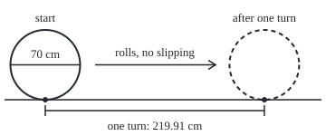
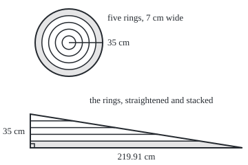

# Circles: where pi comes from and why area is pi r squared

[Syllabus](../../../SYLLABUS.md) → [Geometry and trig](../../../SYLLABUS.md#w05) → [Circles and Solids](../../../SYLLABUS.md#w05-s02) → Circles

---

## General Overview

A bicycle wheel is 70 cm across, measured over the tyre. Chalk a mark where the tyre meets the ground and push the bike until the mark comes round again: one turn moves the bike 219.91 cm, a little over three widths.

That "a little over three" holds for every circle. The distance round, the **circumference**, divided by the distance across, the **diameter**, is always 3.14159…, the number called **pi**. So one measurement of a wheel tells a cycle computer how far each turn goes.

Pi returns where rolling plays no part. The flat region inside the tyre's outer edge, the **disc**, covers pi times the **radius** (centre to edge, 35 cm) times itself: 3848.45 square centimetres. The reason: peel the disc into thin rings, straighten them, and they stack into a triangle with the circumference as base and the radius as height. Archimedes proved the disc equals that triangle.

**Every circle's circumference is pi times its diameter, and unrolling the disc into a triangle makes its area half the circumference times the radius: pi times the radius squared.**

**What kind of fact this is:** pi is a definition, circumference over diameter; that it is one number for every circle, and that the disc's area is pi r squared, are theorems, proved on this card in Why it works.

### The picture: one turn of the wheel

<p align="center"></p>

Scale 1 cm = 1.1 units. The dot is the chalk mark, on the ground at the start and again one turn later, 219.91 cm on.

---

## The formula

Notation first, in words. The Greek letter $\pi$, said "pie", names the distance round any circle divided by the distance across it. Below, $C$ is the circumference, $d$ the diameter, $r$ the radius and $A$ the disc's area; a raised 2, as in $r^2$, means that letter times itself.

$$C = \pi\, d = 2\pi\, r$$

**Read it aloud:** the distance round is pi times the distance across, or two pi times the radius.

$$A = \tfrac12\, C\, r = \pi\, r^2$$

**Read it aloud:** the disc covers half the circumference times the radius, which is pi times the radius times itself.

| Symbol | Plain meaning | In our example | Push it up and the answer… |
| --- | --- | --- | --- |
| $d$ | diameter: edge to edge through the centre | 70 cm | circumference grows in step |
| $r$ | radius: centre to edge, half the diameter | 35 cm | doubled: circumference twice, disc four times |
| $C$ | circumference: the distance round, so the distance per turn | 219.911486 cm | — |
| $A$ | area of the disc inside the edge | 3848.451001 square cm | — |
| $\pi$ | circumference over diameter, the same for every circle | 3.1415926536 | fixed |
| $P$ | perimeter of a polygon inside the circle | 210 cm, hexagon | rises to $C$ as sides double |
| $h$ | centre to the middle of a side of that polygon | under 35 cm | rises to $r$ |
| $s$ | one side of that polygon | 35 cm, hexagon | about halves per doubling |

### When it holds

- **A flat plane.** On a globe, with the radius measured along the surface, the circumference falls short of $2\pi r$: the equator, centred on the North Pole, is four radii round.
- **A true circle.** A tyre squashed under a rider sits lower than its unladen radius, so it rolls a little less than pi times its width per turn.
- **No slipping.** A wheel spinning on ice turns and goes nowhere.

---

## Why it works

### Step 0: every circle is one shape, and a disc unrolls into a triangle

Any circle is an enlarged copy of any other, so round over across cannot depend on size: that ratio is $\pi$. And a disc cut into thin rings straightens into a triangle.

### Step 1: one ratio for every circle

Centre a 140 cm wheel on the 70 cm wheel and enlarge the small one by 2: each edge point moves from 35 cm out to 70 cm, onto the big wheel's edge.

The circumference is the length that paths of short straight hops round the edge close in on as the hops shrink. Enlarging doubles every hop, so the circumference doubles, 439.822972 cm against 219.911486 cm, and so does the width. No enlargement changes the ratio, so every circle shares it: $\pi$.

### Step 2: trap pi between polygons

A regular hexagon, six equal sides and six equal angles, fits inside the circle with each side equal to the radius: it splits into six triangles with all sides equal. Its perimeter is 3 diameters, and each straight side is shorter than the curve it cuts across, so $\pi$ is more than 3. A hexagon wrapped outside has a perimeter of 3.464102 diameters, so $\pi$ is less than that.

Doubling the sides, with Pythagoras giving each new side from the old, shrinks the gap between the two bounds about fourfold each time: 0.464102, 0.109562, 0.027031, 0.006736, 0.001683. Archimedes stopped at 96 sides, between 3.141032 and 3.142715, and rounded outward to 3 10/71 and 3 1/7, which are 3.140845 and 3.142857; 3 1/7 is the familiar 22/7. At 6,291,456 sides both bounds read 3.1415926536.

No fraction is exact: $\pi$ is irrational, like root 2 on [Irrational numbers](../../01-Foundations/02-The%20Number%20Line/03-irrational-numbers.md), as Johann Heinrich Lambert proved in the 1760s by a route beyond this card.

<details>
<summary>The algebra behind the doubling</summary>

Radius 1, inside side $s$. By Pythagoras the centre is h = √(1 − s^2/4) from each side's midpoint. A new corner goes on the circle straight out past that midpoint; the new side is the long side of a right-angled triangle with legs s/2 and 1 − h, so new side^2 = 2 − √(4 − s^2), which the code computes as s ÷ √(2 + √(4 − s^2)) to avoid subtracting nearly equal numbers. The outside polygon is the inside one enlarged until its sides touch, so its side is s ÷ h.

</details>

### Step 3: the circumference

Turn the definition round: $C = \pi d$, or $2\pi r$, since the diameter is two radii. For the wheel, 3.1415926536 × 70 = 219.911486 cm per turn, 454.73 turns to the kilometre.

### Step 4: unroll the disc into a triangle

Cut the disc into rings, like the growth rings of a sawn log, and straighten each into a strip as long as its circumference: $2\pi$ times its distance from the centre, by Step 3. Stack the strips, outermost at the bottom. Their lengths fall steadily from 219.91 cm to nothing 35 cm up: a right-angled triangle with base $C$ and height $r$. A triangle is half base times height ([Area](../01-Angles%2C%20Triangles%20and%20Congruence/06-area-of-triangles-and-polygons.md)), so

$$A = \tfrac12 \times 2\pi r \times r = \pi r^2$$

Half of 219.911486 × 35 is 3848.451001 square centimetres. This is Proposition 1 of Archimedes' *Measurement of a Circle*.

### The picture: the rings, straightened

<p align="center"></p>

Scale 1 cm = 1.4 units. The shaded outer ring becomes the shaded bottom strip, its 219.91 cm outer edge along the base. Every strip ends on one slanting line, because a ring's length is proportional to its distance from the centre.

### Step 5: why thin rings are enough

A straightened ring's inner edge is shorter than its outer, so the stack is only nearly a triangle, and "thin enough" is a claim about ever finer slicing. Archimedes settled it with polygons, folded below. The code adds a road with no rings and no $\pi$: millimetre squares wholly inside the wheel cover 3833.64 square centimetres, those touching it 3861.44, and 3848.451001 sits between.

<details>
<summary>Detailed proof</summary>

**Inside.** Join the centre to each corner of the inside polygon: triangles of height $h$, adding to half of $P$ times $h$. As $P$ is less than $C$ and $h$ less than $r$, this is less than the triangle, half of C times r.

**Outside.** The outside polygon's triangles have height $r$, so its area is half its perimeter times $r$. That perimeter exceeds $C$, so the area exceeds the triangle. Outside perimeters exceeding $C$ and inside ones falling short is Archimedes' starting rule for curved lengths.

**Between.** The disc contains the inside polygon and lies within the outside one, so disc and triangle both lie between the two polygon areas.

**The squeeze.** The outside polygon is the inside one enlarged by r ÷ h, so their gap is the inside area times (r^2 − h^2) ÷ h^2. By Pythagoras r^2 − h^2 is the square of half a side, which falls about fourfold per doubling, so the gap drops below any amount named in advance.

**Equal.** If disc and triangle differed by some amount, double until the gap is smaller; both lie inside it, a contradiction. So $A = \tfrac12 C r$.

</details>

Another road lays wedges of the disc side by side, points alternately up and down: nearly a rectangle half the circumference long and one radius tall. Wedges have their own card, [Radians](02-radians-arcs-and-sectors.md).

---

## Worked numbers, by hand

| Step | Arithmetic | Value |
| --- | --- | --- |
| Radius | 70 ÷ 2 | 35 cm |
| Pi | polygons of 6,291,456 sides | 3.1415926536 |
| Distance per turn | 3.1415926536 × 70 | **219.911486 cm** |
| Turns per kilometre | 100,000 ÷ 219.911486 | 454.73 |
| Disc, unrolled | half of 219.911486 × 35 | 3848.451001 square cm |
| Disc, by the formula | 3.1415926536 × 35 × 35 | **3848.451001 square cm** |
| Disc, millimetre squares | wholly inside, then touching | 3833.64 to 3861.44 square cm |

### What breaks if you drop a piece

| Mistake | Comes out at | What went wrong |
| --- | --- | --- |
| Radius put in pi times d | 109.955743 cm per turn | The radius is half the width |
| Pi taken as 3 | 210.000000 cm; a real km reads 0.954930 km | That is the inside hexagon, not the circle |
| Diameter put in pi r squared | 15393.804003 square cm | Radius squared, so doubling it quadruples |
| Whole circumference times radius | 7696.902001 square cm | The unrolled disc is a triangle: the half matters |

The code prints all four.

---

## Code, from first principles, and it actually runs

Nothing is imported and no built-in $\pi$ is used. Road one is Archimedes' polygons, square roots alone. Road two is a grid and Pythagoras: 10,000 straight hops round an eighth of the edge, times 8, and a count of squares. The asserts test Archimedes' fractions against the polygons, the walk against pi times 70, and the squares, millimetre bracket inside centimetre bracket, against pi r squared and against half the walked circumference times the radius, which needs no $\pi$.

### Python

```python
# Circles, on a bicycle wheel 70 cm across.  Nothing is imported, so pi is not
# borrowed.  Road one finds pi from polygons inside and outside the rim.  Road
# two measures the rim and the disc on a grid, with Pythagoras alone.  Lengths
# are in cm, areas in square cm.
D = 70.0
R = D / 2

def pi_bounds(doublings):                  # radius 1; perimeter over the width, 2
    n, s = 6, 1.0                          # hexagon inside: each side equals the radius
    for _ in range(doublings):             # double the sides, by Pythagoras
        n, s = 2 * n, s / (2 + (4 - s * s) ** 0.5) ** 0.5
    t = s / (1 - s * s / 4) ** 0.5         # side of the matching polygon outside
    return n, n * s / 2, n * t / 2

def walk(r, hops):                         # an eighth of the rim in straight hops, x 8
    end, total, x0, y0 = r / 2 ** 0.5, 0.0, 0.0, r
    for k in range(1, hops + 1):
        x = end * k / hops
        y = (r * r - x * x) ** 0.5         # the rim point above x, by Pythagoras
        total += ((x - x0) ** 2 + (y - y0) ** 2) ** 0.5
        x0, y0 = x, y
    return 8 * total

def squares(r, per_cm):                    # grid squares wholly inside, and touching, x 4
    m, inside, touch = round(r * per_cm), 0, 0
    for i in range(m):
        for j in range(m):
            inside += (i + 1) ** 2 + (j + 1) ** 2 <= m * m
            touch += i * i + j * j < m * m
    return 4 * inside / per_cm ** 2, 4 * touch / per_cm ** 2

(n6, lo6, hi6), (n96, lo96, hi96), (nf, PI, hi) = pi_bounds(0), pi_bounds(4), pi_bounds(20)
C, A, rim = PI * D, PI * R * R, walk(R, 10000)
(c_lo, c_hi), (m_lo, m_hi) = squares(R, 1), squares(R, 10)
print(f"wheel: diameter {D:.0f} cm, radius {R:.0f} cm")
print(f"pi from {n6} sides: between {lo6:.6f} and {hi6:.6f}")
print(f"pi from {n96} sides: between {lo96:.6f} and {hi96:.6f}; Archimedes wrote "
      f"{3 + 10 / 71:.6f} and {3 + 1 / 7:.6f}")
print("gap, outside minus inside, 6 to 96 sides: "
      + ", ".join(f"{pi_bounds(k)[2] - pi_bounds(k)[1]:.6f}" for k in range(5)))
print(f"pi from {nf} sides: between {PI:.10f} and {hi:.10f}")
print(f"distance per turn, pi x {D:.0f}: {C:.6f} cm; turns per km: {100000 / C:.2f}")
print(f"distance per turn, 10000 hops round an eighth of the rim, x 8: {rim:.6f} cm")
print(f"disc, pi x {R:.0f} x {R:.0f}: {A:.6f}; unrolled, half of {C:.6f} x {R:.0f}: {C * R / 2:.6f}")
print(f"disc, centimetre squares: between {c_lo:.0f} and {c_hi:.0f}")
print(f"disc, millimetre squares: between {m_lo:.2f} and {m_hi:.2f}")
print(f"disc / radius^2 from the squares: between {m_lo / R / R:.6f} and {m_hi / R / R:.6f}")
print(f"second case, wheel {2 * D:.0f} cm: {PI * 2 * D:.6f} cm per turn, disc {PI * D * D:.6f}")
print(f"measuring wheel, 100 cm per turn: diameter {100 / PI:.6f} cm")
print(f"mistake, radius in pi x d: {PI * R:.6f} cm per turn")
print(f"mistake, pi as 3: {3 * D:.6f} cm per turn; a real km reads {3 * D / C:.6f} km")
print(f"mistake, diameter in pi r^2: {PI * D * D:.6f}; whole rim x radius: {C * R:.6f}")
print(f"figure 1, 1 cm = 1.1: centres (50, 71.5) and ({50 + 1.1 * C:.2f}, 71.5), radius {1.1 * R:.1f}")
print(f"figure 2, 1 cm = 1.4: disc radius {1.4 * R:.0f}, rings {R / 5:.0f} cm wide; base ends at ({44 + 1.4 * C:.2f}, 215); strips end at x "
      + ", ".join(f"{44 + 1.4 * 2 * PI * p:.2f}" for p in (28, 21, 14, 7)))
assert 3 + 10 / 71 < lo96 < PI < hi < hi96 < 3 + 1 / 7   # Archimedes' two fractions
assert abs(rim - C) < 1e-6                                 # rim: grid walk against pi x 70
assert c_lo < m_lo < A < m_hi < c_hi                      # disc: mm squares inside cm, around pi r^2
assert m_lo < rim * R / 2 < m_hi                           # half rim x radius, no pi at all
print("ALL CHECKS PASS")
```

**Ran 2026-09-24 on macOS, Python 3.14.6, standard library only. All checks passed. Output, pasted from the run:**

```
wheel: diameter 70 cm, radius 35 cm
pi from 6 sides: between 3.000000 and 3.464102
pi from 96 sides: between 3.141032 and 3.142715; Archimedes wrote 3.140845 and 3.142857
gap, outside minus inside, 6 to 96 sides: 0.464102, 0.109562, 0.027031, 0.006736, 0.001683
pi from 6291456 sides: between 3.1415926536 and 3.1415926536
distance per turn, pi x 70: 219.911486 cm; turns per km: 454.73
distance per turn, 10000 hops round an eighth of the rim, x 8: 219.911486 cm
disc, pi x 35 x 35: 3848.451001; unrolled, half of 219.911486 x 35: 3848.451001
disc, centimetre squares: between 3712 and 3980
disc, millimetre squares: between 3833.64 and 3861.44
disc / radius^2 from the squares: between 3.129502 and 3.152196
second case, wheel 140 cm: 439.822972 cm per turn, disc 15393.804003
measuring wheel, 100 cm per turn: diameter 31.830989 cm
mistake, radius in pi x d: 109.955743 cm per turn
mistake, pi as 3: 210.000000 cm per turn; a real km reads 0.954930 km
mistake, diameter in pi r^2: 15393.804003; whole rim x radius: 7696.902001
figure 1, 1 cm = 1.1: centres (50, 71.5) and (291.90, 71.5), radius 38.5
figure 2, 1 cm = 1.4: disc radius 49, rings 7 cm wide; base ends at (351.88, 215); strips end at x 290.30, 228.73, 167.15, 105.58
ALL CHECKS PASS
```

### Rust

Same numbers, same labels, built with `rustc --edition 2021 -O`.

```rust
// Circles, on a bicycle wheel 70 cm across.  No crates, and std's own pi is not
// used.  Road one finds pi from polygons inside and outside the rim.  Road two
// measures the rim and the disc on a grid, with Pythagoras alone.  Lengths are
// in cm, areas in square cm.
const D: f64 = 70.0;
const R: f64 = D / 2.0;

fn pi_bounds(doublings: u32) -> (u64, f64, f64) { // radius 1; perimeter over the width, 2
    let (mut n, mut s) = (6u64, 1.0f64);           // hexagon inside: each side equals the radius
    for _ in 0..doublings {                        // double the sides, by Pythagoras
        n *= 2;
        s = s / (2.0 + (4.0 - s * s).sqrt()).sqrt();
    }
    let t = s / (1.0 - s * s / 4.0).sqrt();        // side of the matching polygon outside
    (n, n as f64 * s / 2.0, n as f64 * t / 2.0)
}

fn walk(r: f64, hops: u32) -> f64 {                // an eighth of the rim in straight hops, x 8
    let (end, mut total, mut x0, mut y0) = (r / 2f64.sqrt(), 0.0, 0.0, r);
    for k in 1..=hops {
        let x = end * k as f64 / hops as f64;
        let y = (r * r - x * x).sqrt();            // the rim point above x, by Pythagoras
        total += ((x - x0).powi(2) + (y - y0).powi(2)).sqrt();
        x0 = x;
        y0 = y;
    }
    8.0 * total
}

fn squares(r: f64, per_cm: i64) -> (f64, f64) {   // grid squares wholly inside, and touching, x 4
    let (m, mut inside, mut touch) = ((r * per_cm as f64).round() as i64, 0i64, 0i64);
    for i in 0..m {
        for j in 0..m {
            if (i + 1).pow(2) + (j + 1).pow(2) <= m * m { inside += 1 }
            if i * i + j * j < m * m { touch += 1 }
        }
    }
    let cell = (per_cm * per_cm) as f64;
    (4.0 * inside as f64 / cell, 4.0 * touch as f64 / cell)
}

fn main() {
    let ((n6, lo6, hi6), (n96, lo96, hi96), (nf, pi, hi)) = (pi_bounds(0), pi_bounds(4), pi_bounds(20));
    let (c, a, rim) = (pi * D, pi * R * R, walk(R, 10000));
    let ((c_lo, c_hi), (m_lo, m_hi)) = (squares(R, 1), squares(R, 10));
    let gaps: Vec<String> = (0..5).map(|k| { let (_, l, h) = pi_bounds(k); format!("{:.6}", h - l) }).collect();
    let ends: Vec<String> = [28.0, 21.0, 14.0, 7.0].iter().map(|p| format!("{:.2}", 44.0 + 1.4 * 2.0 * pi * p)).collect();
    println!("wheel: diameter {:.0} cm, radius {:.0} cm", D, R);
    println!("pi from {} sides: between {:.6} and {:.6}", n6, lo6, hi6);
    println!("pi from {} sides: between {:.6} and {:.6}; Archimedes wrote {:.6} and {:.6}",
             n96, lo96, hi96, 3.0 + 10.0 / 71.0, 3.0 + 1.0 / 7.0);
    println!("gap, outside minus inside, 6 to 96 sides: {}", gaps.join(", "));
    println!("pi from {} sides: between {:.10} and {:.10}", nf, pi, hi);
    println!("distance per turn, pi x {:.0}: {:.6} cm; turns per km: {:.2}", D, c, 100000.0 / c);
    println!("distance per turn, 10000 hops round an eighth of the rim, x 8: {:.6} cm", rim);
    println!("disc, pi x {:.0} x {:.0}: {:.6}; unrolled, half of {:.6} x {:.0}: {:.6}", R, R, a, c, R, c * R / 2.0);
    println!("disc, centimetre squares: between {:.0} and {:.0}", c_lo, c_hi);
    println!("disc, millimetre squares: between {:.2} and {:.2}", m_lo, m_hi);
    println!("disc / radius^2 from the squares: between {:.6} and {:.6}", m_lo / R / R, m_hi / R / R);
    println!("second case, wheel {:.0} cm: {:.6} cm per turn, disc {:.6}", 2.0 * D, pi * 2.0 * D, pi * D * D);
    println!("measuring wheel, 100 cm per turn: diameter {:.6} cm", 100.0 / pi);
    println!("mistake, radius in pi x d: {:.6} cm per turn", pi * R);
    println!("mistake, pi as 3: {:.6} cm per turn; a real km reads {:.6} km", 3.0 * D, 3.0 * D / c);
    println!("mistake, diameter in pi r^2: {:.6}; whole rim x radius: {:.6}", pi * D * D, c * R);
    println!("figure 1, 1 cm = 1.1: centres (50, 71.5) and ({:.2}, 71.5), radius {:.1}", 50.0 + 1.1 * c, 1.1 * R);
    println!("figure 2, 1 cm = 1.4: disc radius {:.0}, rings {:.0} cm wide; base ends at ({:.2}, 215); strips end at x {}",
             1.4 * R, R / 5.0, 44.0 + 1.4 * c, ends.join(", "));
    assert!(3.0 + 10.0 / 71.0 < lo96 && lo96 < pi && pi < hi && hi < hi96 && hi96 < 3.0 + 1.0 / 7.0);
    assert!((rim - c).abs() < 1e-6);                  // rim: grid walk against pi x 70
    assert!(c_lo < m_lo && m_lo < a && a < m_hi && m_hi < c_hi); // disc: mm squares inside cm, around pi r^2
    assert!(m_lo < rim * R / 2.0 && rim * R / 2.0 < m_hi); // half rim x radius, no pi at all
    println!("ALL CHECKS PASS");
}
```

**Ran 2026-09-24 on macOS, rustc 1.98.1, no crates. All checks passed. Output, pasted from the run:**

```
wheel: diameter 70 cm, radius 35 cm
pi from 6 sides: between 3.000000 and 3.464102
pi from 96 sides: between 3.141032 and 3.142715; Archimedes wrote 3.140845 and 3.142857
gap, outside minus inside, 6 to 96 sides: 0.464102, 0.109562, 0.027031, 0.006736, 0.001683
pi from 6291456 sides: between 3.1415926536 and 3.1415926536
distance per turn, pi x 70: 219.911486 cm; turns per km: 454.73
distance per turn, 10000 hops round an eighth of the rim, x 8: 219.911486 cm
disc, pi x 35 x 35: 3848.451001; unrolled, half of 219.911486 x 35: 3848.451001
disc, centimetre squares: between 3712 and 3980
disc, millimetre squares: between 3833.64 and 3861.44
disc / radius^2 from the squares: between 3.129502 and 3.152196
second case, wheel 140 cm: 439.822972 cm per turn, disc 15393.804003
measuring wheel, 100 cm per turn: diameter 31.830989 cm
mistake, radius in pi x d: 109.955743 cm per turn
mistake, pi as 3: 210.000000 cm per turn; a real km reads 0.954930 km
mistake, diameter in pi r^2: 15393.804003; whole rim x radius: 7696.902001
figure 1, 1 cm = 1.1: centres (50, 71.5) and (291.90, 71.5), radius 38.5
figure 2, 1 cm = 1.4: disc radius 49, rings 7 cm wide; base ends at (351.88, 215); strips end at x 290.30, 228.73, 167.15, 105.58
ALL CHECKS PASS
```

The two outputs match line for line.

> [!TIP]
> **Try changing**
> Guess first, then run it.
> - **A wheel twice as wide.** Set `D = 140.0`: 439.822972 cm per turn, a disc of 15393.804003 square cm, and every assert passes.
> - **Stop where Archimedes stopped.** Change `pi_bounds(20)` to `pi_bounds(4)`: pi drops to 3.141032 and the first assert stops it.
> - **Forget the half.** Set `A` to `PI * D * R`: 7696.902001, and the third assert stops it.

---

## The usual mistake

> [!warning]
> **Scaling the disc like the circumference.** A wheel twice as wide has twice the circumference, 439.822972 cm, but four times the disc, 15393.804003 square centimetres, because enlarging by 2 stretches every small square of the disc both ways.
>
> - **Radius for diameter.** 109.955743 cm per turn: a cycle computer set with it reads half the distance.
> - **22/7 as pi.** It is Archimedes' upper bound, 3.142857; no fraction is pi.

---

## Where you meet it in real life

- **Cycle computers.** The sensor counts turns and multiplies by the circumference entered at setup, found by rolling the loaded bike one turn.
- **Measuring wheels.** A surveyor's wheel that clicks once a metre is 31.830989 cm across: 100 ÷ pi.
- **Pipes and tanks.** At a given flow speed a pipe carries water in proportion to pi r squared. The tank 2 m across on [Prisms and cylinders](04-prisms-and-cylinders.md) stands on pi square metres.
- **Spheres and cones.** Pi returns in their surfaces and volumes, on [Pyramids, cones and spheres](05-pyramids-cones-and-spheres.md).

> **Say it back**
> Every circle is an enlarged copy of every other, so circumference over diameter is one number, pi: trapped by polygons, and irrational. The 70 cm wheel rolls 219.91 cm per turn. Its disc, cut into rings and straightened, stacks into a triangle with the circumference as base and the radius as height, so its area is pi r squared, 3848.45 square centimetres. Double the wheel: twice the circumference, four times the disc.

---

## What this builds on

- [Irrational numbers](../../01-Foundations/02-The%20Number%20Line/03-irrational-numbers.md): why a decimal that never stops or repeats belongs to no fraction; pi is one.

## Where this goes next

- [Radians](02-radians-arcs-and-sectors.md): part of a turn, its arc and its wedge.
- [Prisms and cylinders](04-prisms-and-cylinders.md): the disc as a tank's floor, stacked into a volume.

---

## Sources

Verified 2026-09-24: every link below opens the cited work.

- Archimedes. *Measurement of a Circle*, Proposition 1. Seminar notes, Harvard Department of Mathematics, 2009. [PDF](https://abel.math.harvard.edu/archive/archimedes09/pdf/Measurement.of.the.Circle.pdf). The circle as a triangle on its radius and circumference.
- O'Connor, J. J., and E. F. Robertson. "A history of Pi." MacTutor, University of St Andrews. [History topic](https://mathshistory.st-andrews.ac.uk/HistTopics/Pi_through_the_ages/). Archimedes' 96-sided polygons and his bounds 223/71 and 22/7.
- O'Connor, J. J., and E. F. Robertson. "Johann Heinrich Lambert." MacTutor, University of St Andrews. [Biography](https://mathshistory.st-andrews.ac.uk/Biographies/Lambert/). The first rigorous proof that pi is irrational.
- Marecek, Lynn, MaryAnne Anthony-Smith, and Andrea Honeycutt Mathis. *Prealgebra 2e*, section 9.5. OpenStax. [Section page](https://openstax.org/books/prealgebra-2e/pages/9-5-solve-geometry-applications-circles-and-irregular-figures). Worked circumference and area practice.
