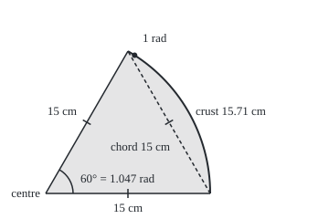

# Radians: measuring an angle by the arc it cuts, and why that makes formulas simple

[Syllabus](../../../SYLLABUS.md) → [Geometry and trig](../../../SYLLABUS.md#w05) → [Circles and Solids](../../../SYLLABUS.md#w05-s02) → Radians

---

## General Overview

A pizza 30 cm across is cut into six equal slices of 60 degrees. Each slice has two straight cut edges running 15 cm from centre to rim: the radius. Between their ends runs a curved strip of crust.

The slice carries 15.71 cm of crust and 117.81 cm^2 (square centimetres) of pizza: a sixth of the pizza's 94.25 cm of rim and 706.86 cm^2 of area ([Circles](01-circle-circumference-and-area.md)).

Lay the crust along a cut edge: 15.71 cm against 15 cm, so the crust is 1.047 radii long. Cut the same slice from a bigger pizza and that ratio does not move. It depends only on how wide the slice opens, so it can measure the angle. Measured as crust over radius, an angle is in **radians**: the slice is 1.047 radians wide.

From here on the crust is the **arc**, a piece of a circle's rim, and a slice cut from the centre is a **sector**. In degrees, every formula for them drags along an extra pi over 180; radians drop it.

**Measure an angle by how many radii of arc it cuts from a circle centred at its corner; then the arc is the radius times the angle, and the sector's area is half the radius squared times the angle.**

**What kind of fact this is:** the radian is a definition, and the arc formula restates it; that the ratio ignores the pizza's size, the degree conversion and the sector formula are theorems, proved on this card in Why it works.

### The picture: one slice, to scale

<p align="center"></p>

Drawn to scale, 1 cm = 12 units. Ticks mark three equal 15 cm sides: the cut edges and the dashed **chord**, the straight line joining the crust's ends. The dot sits one radius of crust from the lower end: 1 radian.

---

## The formula

Notation first, in words. The Greek letter theta, $\theta$, is the angle in radians: a length over a length, so the centimetres cancel: a plain number, tagged rad as a reminder. Degrees are written as the word. The arc is $s$, the sector's area $A$, the radius $r$, and $\pi$ is circumference over diameter.

$$\theta = \frac{s}{r}$$

**Read it aloud:** the angle in radians is the arc it cuts, divided by the radius.

$$\theta = \text{degrees} \times \frac{\pi}{180}, \qquad \text{degrees} = \theta \times \frac{180}{\pi}$$

**Read it aloud:** degrees times pi over 180 give radians; radians times 180 over pi give degrees.

$$s = r\,\theta, \qquad A = \tfrac12\, r^2\, \theta$$

**Read it aloud:** the arc is the radius times the angle; the sector's area is half the radius squared times the angle.

| Symbol | Plain meaning | In our example | Push it up and the answer… |
| --- | --- | --- | --- |
| $r$ | the radius: centre to rim | 15 cm | arc grows in step, area with its square |
| degrees | the same angle, 360 to a turn | 60° | a wider slice |
| $\theta$ | the same angle in radians | 1.047 rad, exactly $\pi$/3 | arc and area grow in step |
| $s$ | the arc: length of crust | 15.71 cm | at a fixed radius, a wider angle |
| $A$ | the sector's area: pizza on the slice | 117.81 cm^2 | — |
| $\pi$ | circumference over diameter | 3.141593 | fixed for every circle |

Landmarks: 30° is $\pi$/6 = 0.524 rad, 45° is $\pi$/4 = 0.785, 90° is $\pi$/2 = 1.571, 180° is $\pi$ = 3.142, and a full turn is 2$\pi$ = 6.283 rad. One radian is 57.30°.

### When it holds

- **The angle is in radians.** Put 60 in for $\theta$ and the slice gets 900 cm of crust.
- **The slice is cut from the centre.** Both straight edges must be radii; a square-cut party slice is no sector.
- **At most one turn, for area.** Past 2$\pi$ the arc formula still gives the distance a spinning rim travels, but the area formula counts pizza twice.

---

## Why it works

### Step 0: arc over radius belongs to the angle, not to the pizza

Cut the same 60° slice from a 40 cm pizza, radius 20 cm. Its crust is 20.94 cm, and 20.94 ÷ 20 = 1.047 again.

A curve's length is what the total of ever shorter straight chords along it settles to. Enlarge the pizza from its centre and every chord grows by the enlargement factor, since the triangle it makes with its two radii is enlarged whole ([Similar triangles](../01-Angles%2C%20Triangles%20and%20Congruence/04-similar-triangles-and-scale.md)). Crust and radius grow alike, so their ratio holds.

**One radian is the angle whose arc is exactly one radius long.**

### Step 1: equal angles cut equal arcs and equal slices

Turn the pizza a sixth of a turn about its centre. Each slice lands on the next, and turning changes no length or area, so the six share rim and area equally: 94.25 ÷ 6 = 15.71 cm, 706.86 ÷ 6 = 117.81 cm^2.

In general, **an arc is its angle's share of a full turn, taken of the rim, and a sector is the same share of the area.** Rotation proves it for fractions of a turn such as 1/6 or 5/12; every other angle is squeezed between such fractions.

<details>
<summary>Detailed proof: the share rule for any angle</summary>

Assume one fact: a slice inside a wider slice has less crust and less area.

Cut the pizza into n equal slices, n any whole number. Rotation gives each 1/n of the rim. Say m of them fit inside the angle but m + 1 do not. The angle's share of a turn then lies between m/n and (m + 1)/n, and so does its crust's share of the rim, since its slice holds m small slices and fits inside m + 1.

Two numbers in one gap of width 1/n differ by at most 1/n, for every n however large, so they are equal. Areas squeeze the same way. Euclid's *Elements* VI.33 makes the same comparison with multiples of arcs and angles.

</details>

### Step 2: a full turn is 2π radians

The whole rim, $2\pi r$, divided by the radius gives $2\pi$, about 6.283. So 360° is $2\pi$ radians, 180° is $\pi$ radians, and one degree is $\pi$/180 of a radian: $\theta$ = 60 × $\pi$/180 = $\pi$/3 = 1.047 rad. One radian is 180/$\pi$ = 57.30°, a little narrower than the slice, so the slice's crust is a little longer than its 15 cm edge.

### Step 3: the arc formula, and where π went

A slice of $\theta$ radians is the share $\theta$/(2$\pi$) of a turn, so by Step 1:

$$s = \frac{\theta}{2\pi} \times 2\pi r = r\,\theta.$$

The $2\pi$ above and below cancel. In degrees the same step gives

$$s = \frac{\text{degrees}}{360} \times 2\pi r = \frac{\pi\, r \times \text{degrees}}{180},$$

and nothing cancels: a formula in degrees carries the factor $\pi$/180 forever. The radian is the unit that makes that factor 1. For the slice, $s$ = 15 × 1.047 = 15.71 cm.

### Step 4: the area formula, two ways

The sector is the same share of the whole area, $\pi r^2$:

$$A = \frac{\theta}{2\pi} \times \pi r^2 = \tfrac12\, r^2\, \theta.$$

The $\pi$ cancels and a half is left: ½ × 15 × 15 × 1.047 = 117.81 cm^2.

The half has a picture. Cut the sector into thin slivers from the centre, each nearly a triangle with the radius for height and a stretch of crust for base. The bases add up to the arc, so

$$A = \tfrac12\, r\, s,$$

which is $\tfrac12 r^2 \theta$ once $s = r\theta$ is put in: a sector has the area of a triangle with the arc for base and the radius for height. The code's 4096 slivers give 117.81 cm^2.

A second road starts from the circle of radius 1, where an angle in radians is its own arc, and enlarges it by $r$: [The unit circle](../03-Trigonometry/02-radians-and-the-unit-circle.md).

---

## Worked numbers, by hand

| Step | Arithmetic | Value |
| --- | --- | --- |
| convert to radians | 60 × $\pi$ ÷ 180 | 1.047 rad |
| arc, the crust | 15 × 1.047 | **15.71 cm** |
| sector, the pizza on it | ½ × 15 × 15 × 1.047 | **117.81 cm^2** |
| check: a sixth of the rim | 94.25 ÷ 6 | 15.71 cm |
| check: a sixth of the pizza | 706.86 ÷ 6 | 117.81 cm^2 |

Either road, one slice carries 15.71 cm of crust and 117.81 cm^2 of pizza.

### A second case: a slice cut by crust length

A slice with exactly 20 cm of crust spans $\theta$ = 20 ÷ 15 = 1.333 rad, which is 1.333 × 180/$\pi$ = 76.39°. Its area needs no angle: $A$ = ½ × 15 × 20 = 150 cm^2. No $\pi$ appears until degrees are wanted. The code reaches 76.39° again by walking 20 cm along its chords.

### What breaks if you drop a piece

| Mistake | Comes out at | What went wrong |
| --- | --- | --- |
| 60 put into $s = r\theta$ | 900 cm of crust | 60 is degrees; the formula wants 1.047 |
| The half left off | 235.62 cm^2 | $r^2\theta$ is two slices' worth |
| 30 cm taken as the radius | 31.42 cm and 471.24 cm^2 | 30 cm is the diameter |
| The chord taken for the crust | 15.00 cm | the straight line misses the bulge |

---

## Code, from first principles, and it actually runs

Road one converts 60° to radians and applies the formulas. Road two uses no $\pi$ and no angle. It puts the pizza on a grid, centre at (0, 0), each point named by how far across and up it lies. Triangles with three equal sides fix the slice's far corner, and the next slice's. Twelve rounds of halving follow: each chord's midpoint, pushed out to the rim, splits its piece in two. The 4096 chords per 60° add up, by Pythagoras, to the crust, and their thin triangles to the slice. Walking one radius along them, at 60/4096 of a degree per piece, sizes the radian. Four asserts compare the roads.

### Python

```python
# Radians, arcs and sectors -- the check behind the card.  Standard library only.
# A 30 cm pizza, radius 15 cm, and a 60 degree slice.  Road one: radians and the
# formulas.  Road two: coordinates, no pi -- the crust as thousands of short chords.
import math
r, deg = 15.0, 60.0
theta = deg * math.pi / 180                      # road one: degrees to radians
arc, area = r * theta, r * r * theta / 2

def dist(p, q): return math.sqrt((p[0] - q[0]) ** 2 + (p[1] - q[1]) ** 2)

def crust(rad, rounds):                 # crust points from 0 to 120 degrees, no angles used
    h = math.sqrt(rad * rad - (rad / 2) ** 2)    # triangles with three equal sides fix 60 and 120
    pts = [(rad, 0.0), (rad / 2, h), (-rad / 2, h)]
    for _ in range(rounds):             # halve every piece: push each chord's midpoint out to the crust
        new = [pts[0]]
        for p, q in zip(pts, pts[1:]):
            x, y = p[0] + q[0], p[1] + q[1]
            new += [(x * rad / math.sqrt(x * x + y * y), y * rad / math.sqrt(x * x + y * y)), q]
        pts = new
    return pts

def walk(pts, target=1e9):              # along the chords: pieces passed, length, area, where it stops
    done = tri = 0.0
    for i, (p, q) in enumerate(zip(pts, pts[1:])):
        c, mid = dist(p, q), ((p[0] + q[0]) / 2, (p[1] + q[1]) / 2)
        f = min(1.0, (target - done) / c)            # stop partway along a chord at the target
        done, tri = done + f * c, tri + f * c * dist((0, 0), mid) / 2   # thin triangle: base x height / 2
        if f < 1: return i + f, done, tri, (p[0] + f * (q[0] - p[0]), p[1] + f * (q[1] - p[1]))
    return len(pts) - 1, done, tri, pts[-1]

fine = crust(r, 12)                     # 4096 pieces for every 60 degrees
print(f"pizza {2 * r:.0f} cm across, radius {r:.4f} cm; slice {deg:.0f} degrees")
print(f"road 1, convert: {deg:.0f} degrees = {theta:.6f} rad; 1 rad = {180 / math.pi:.6f} degrees")
print("landmarks in rad: " + ", ".join(f"{a} = {a * math.pi / 180:.6f}" for a in (30, 45, 90, 180, 360)))
print(f"road 1, formulas: crust {arc:.4f} cm, area {area:.4f} cm^2")
print(f"whole pizza: crust {2 * math.pi * r:.4f} cm, area {math.pi * r * r:.4f} cm^2; "
      f"one sixth: {2 * math.pi * r / 6:.4f} cm, {math.pi * r * r / 6:.4f} cm^2")
for step in (4096, 1024, 256, 1):
    _, L, T, _ = walk(fine[:4097:step])
    print(f"road 2, {4096 // step:>4} chord(s): length {L:.4f} cm, triangle area {T:.4f} cm^2")
(n1, _, _, P), (n2, _, A2, _) = walk(fine, r), walk(fine, 20.0)
print(f"road 2, length over radius {L / r:.6f} rad; walk {r:.0f} cm (one radius): {60 * n1 / 4096:.6f} degrees")
print(f"second case, 20 cm of crust: road 1 {20 / r:.6f} rad = {20 / r * 180 / math.pi:.6f} degrees, "
      f"area {r * 20 / 2:.4f} cm^2")
print(f"second case, road 2 walk: {60 * n2 / 4096:.6f} degrees, area {A2:.4f} cm^2")
_, L40, _, _ = walk(crust(20.0, 12)[:4097])
print(f"same slice of a 40 cm pizza, radius 20 cm: crust {L40:.4f} cm, crust over radius {L40 / 20:.6f}")
print(f"mistake, 60 used as radians: crust {r * 60:.4f} cm, area {r * r * 60 / 2:.4f} cm^2")
print(f"mistake, half left off: {r * r * theta:.4f} cm^2; diameter as radius: crust "
      f"{2 * r * theta:.4f} cm, area {2 * r * 2 * r * theta / 2:.4f} cm^2")
bx, by = 50 + 12 * fine[4096][0], 212 - 12 * fine[4096][1]
print(f"figure, 1 cm = 12 units: O (50.0,212.0), A ({50 + 12 * r:.1f},212.0), B ({bx:.1f},{by:.1f}), "
      f"angle mark to ({50 + (bx - 50) / 6:.1f},{212 - (212 - by) / 6:.1f}), "
      f"1 rad at ({50 + 12 * P[0]:.1f},{212 - 12 * P[1]:.1f})")
assert abs(L - arc) < 1e-6                       # chords against r x theta
assert abs(T - area) < 1e-5                      # thin triangles against r^2 x theta / 2
assert abs(60 * n1 / 4096 - 180 / math.pi) < 1e-6   # one radius of crust is 180/pi degrees
assert abs(A2 - r * 20 / 2) < 1e-5               # second case: area is radius x crust / 2
print("ALL CHECKS PASS")
```

**Ran 2026-09-24 on macOS, Python 3.14.6, standard library only. All checks passed. Output, pasted from the run:**

```
pizza 30 cm across, radius 15.0000 cm; slice 60 degrees
road 1, convert: 60 degrees = 1.047198 rad; 1 rad = 57.295780 degrees
landmarks in rad: 30 = 0.523599, 45 = 0.785398, 90 = 1.570796, 180 = 3.141593, 360 = 6.283185
road 1, formulas: crust 15.7080 cm, area 117.8097 cm^2
whole pizza: crust 94.2478 cm, area 706.8583 cm^2; one sixth: 15.7080 cm, 117.8097 cm^2
road 2,    1 chord(s): length 15.0000 cm, triangle area 97.4279 cm^2
road 2,    4 chord(s): length 15.6631 cm, triangle area 116.4686 cm^2
road 2,   16 chord(s): length 15.7052 cm, triangle area 117.7256 cm^2
road 2, 4096 chord(s): length 15.7080 cm, triangle area 117.8097 cm^2
road 2, length over radius 1.047198 rad; walk 15 cm (one radius): 57.295780 degrees
second case, 20 cm of crust: road 1 1.333333 rad = 76.394373 degrees, area 150.0000 cm^2
second case, road 2 walk: 76.394373 degrees, area 150.0000 cm^2
same slice of a 40 cm pizza, radius 20 cm: crust 20.9440 cm, crust over radius 1.047198
mistake, 60 used as radians: crust 900.0000 cm, area 6750.0000 cm^2
mistake, half left off: 235.6194 cm^2; diameter as radius: crust 31.4159 cm, area 471.2389 cm^2
figure, 1 cm = 12 units: O (50.0,212.0), A (230.0,212.0), B (140.0,56.1), angle mark to (65.0,186.0), 1 rad at (147.3,60.5)
ALL CHECKS PASS
```

### Rust

Same numbers, same labels, built with `rustc --edition 2021 -O`.

```rust
// Radians, arcs and sectors -- the same check as the Python, in Rust.  No crates.
// A 30 cm pizza, radius 15 cm, and a 60 degree slice.  Road one: radians and the
// formulas.  Road two: coordinates, no pi -- the crust as thousands of short chords.
use std::f64::consts::PI;
type Pt = (f64, f64);

fn dist(p: Pt, q: Pt) -> f64 { ((p.0 - q.0).powi(2) + (p.1 - q.1).powi(2)).sqrt() }

fn crust(rad: f64, rounds: usize) -> Vec<Pt> {  // crust points from 0 to 120 degrees, no angles used
    let h = (rad * rad - (rad / 2.0).powi(2)).sqrt(); // triangles with three equal sides fix 60 and 120
    let mut pts = vec![(rad, 0.0), (rad / 2.0, h), (-rad / 2.0, h)];
    for _ in 0..rounds {                        // halve every piece: push each chord's midpoint out
        let mut new = vec![pts[0]];
        for w in pts.windows(2) {
            let (x, y) = (w[0].0 + w[1].0, w[0].1 + w[1].1);
            let k = rad / (x * x + y * y).sqrt();
            new.push((x * k, y * k));
            new.push(w[1]);
        }
        pts = new;
    }
    pts
}

fn walk(pts: &[Pt], target: f64) -> (f64, f64, f64, Pt) { // pieces passed, length, area, where it stops
    let (mut done, mut tri) = (0.0, 0.0);
    for (i, w) in pts.windows(2).enumerate() {
        let (p, q) = (w[0], w[1]);
        let (c, mid) = (dist(p, q), ((p.0 + q.0) / 2.0, (p.1 + q.1) / 2.0));
        let f = f64::min(1.0, (target - done) / c);   // stop partway along a chord at the target
        done += f * c;
        tri += f * c * dist((0.0, 0.0), mid) / 2.0;   // thin triangle: base x height / 2
        if f < 1.0 { return (i as f64 + f, done, tri, (p.0 + f * (q.0 - p.0), p.1 + f * (q.1 - p.1))); }
    }
    ((pts.len() - 1) as f64, done, tri, pts[pts.len() - 1])
}

fn main() {
    let (r, deg) = (15.0_f64, 60.0_f64);
    let theta = deg * PI / 180.0;                   // road one: degrees to radians
    let (arc, area) = (r * theta, r * r * theta / 2.0);
    let fine = crust(r, 12);                        // 4096 pieces for every 60 degrees
    println!("pizza {:.0} cm across, radius {:.4} cm; slice {:.0} degrees", 2.0 * r, r, deg);
    println!("road 1, convert: {:.0} degrees = {:.6} rad; 1 rad = {:.6} degrees", deg, theta, 180.0 / PI);
    let marks: Vec<String> = [30, 45, 90, 180, 360].iter().map(|&a| format!("{} = {:.6}", a, a as f64 * PI / 180.0)).collect();
    println!("landmarks in rad: {}", marks.join(", "));
    println!("road 1, formulas: crust {:.4} cm, area {:.4} cm^2", arc, area);
    println!("whole pizza: crust {:.4} cm, area {:.4} cm^2; one sixth: {:.4} cm, {:.4} cm^2",
             2.0 * PI * r, PI * r * r, 2.0 * PI * r / 6.0, PI * r * r / 6.0);
    let (mut l, mut t) = (0.0, 0.0);
    for step in [4096, 1024, 256, 1] {
        let coarse: Vec<Pt> = fine[..4097].iter().step_by(step).copied().collect();
        (_, l, t, _) = walk(&coarse, 1e9);
        println!("road 2, {:>4} chord(s): length {:.4} cm, triangle area {:.4} cm^2", 4096 / step, l, t);
    }
    let ((n1, _, _, p), (n2, _, a2, _)) = (walk(&fine, r), walk(&fine, 20.0));
    println!("road 2, length over radius {:.6} rad; walk {:.0} cm (one radius): {:.6} degrees", l / r, r, 60.0 * n1 / 4096.0);
    println!("second case, 20 cm of crust: road 1 {:.6} rad = {:.6} degrees, area {:.4} cm^2",
             20.0 / r, 20.0 / r * 180.0 / PI, r * 20.0 / 2.0);
    println!("second case, road 2 walk: {:.6} degrees, area {:.4} cm^2", 60.0 * n2 / 4096.0, a2);
    let (_, l40, _, _) = walk(&crust(20.0, 12)[..4097], 1e9);
    println!("same slice of a 40 cm pizza, radius 20 cm: crust {:.4} cm, crust over radius {:.6}", l40, l40 / 20.0);
    println!("mistake, 60 used as radians: crust {:.4} cm, area {:.4} cm^2", r * 60.0, r * r * 60.0 / 2.0);
    println!("mistake, half left off: {:.4} cm^2; diameter as radius: crust {:.4} cm, area {:.4} cm^2",
             r * r * theta, 2.0 * r * theta, 2.0 * r * 2.0 * r * theta / 2.0);
    let (bx, by) = (50.0 + 12.0 * fine[4096].0, 212.0 - 12.0 * fine[4096].1);
    println!("figure, 1 cm = 12 units: O (50.0,212.0), A ({:.1},212.0), B ({:.1},{:.1}), angle mark to ({:.1},{:.1}), 1 rad at ({:.1},{:.1})",
             50.0 + 12.0 * r, bx, by, 50.0 + (bx - 50.0) / 6.0, 212.0 - (212.0 - by) / 6.0,
             50.0 + 12.0 * p.0, 212.0 - 12.0 * p.1);
    assert!((l - arc).abs() < 1e-6);                    // chords against r x theta
    assert!((t - area).abs() < 1e-5);                   // thin triangles against r^2 x theta / 2
    assert!((60.0 * n1 / 4096.0 - 180.0 / PI).abs() < 1e-6); // one radius of crust is 180/pi degrees
    assert!((a2 - r * 20.0 / 2.0).abs() < 1e-5);        // second case: area is radius x crust / 2
    println!("ALL CHECKS PASS");
}
```

**Ran 2026-09-24 on macOS, rustc 1.98.1, no crates. All checks passed. Output, pasted from the run:**

```
pizza 30 cm across, radius 15.0000 cm; slice 60 degrees
road 1, convert: 60 degrees = 1.047198 rad; 1 rad = 57.295780 degrees
landmarks in rad: 30 = 0.523599, 45 = 0.785398, 90 = 1.570796, 180 = 3.141593, 360 = 6.283185
road 1, formulas: crust 15.7080 cm, area 117.8097 cm^2
whole pizza: crust 94.2478 cm, area 706.8583 cm^2; one sixth: 15.7080 cm, 117.8097 cm^2
road 2,    1 chord(s): length 15.0000 cm, triangle area 97.4279 cm^2
road 2,    4 chord(s): length 15.6631 cm, triangle area 116.4686 cm^2
road 2,   16 chord(s): length 15.7052 cm, triangle area 117.7256 cm^2
road 2, 4096 chord(s): length 15.7080 cm, triangle area 117.8097 cm^2
road 2, length over radius 1.047198 rad; walk 15 cm (one radius): 57.295780 degrees
second case, 20 cm of crust: road 1 1.333333 rad = 76.394373 degrees, area 150.0000 cm^2
second case, road 2 walk: 76.394373 degrees, area 150.0000 cm^2
same slice of a 40 cm pizza, radius 20 cm: crust 20.9440 cm, crust over radius 1.047198
mistake, 60 used as radians: crust 900.0000 cm, area 6750.0000 cm^2
mistake, half left off: 235.6194 cm^2; diameter as radius: crust 31.4159 cm, area 471.2389 cm^2
figure, 1 cm = 12 units: O (50.0,212.0), A (230.0,212.0), B (140.0,56.1), angle mark to (65.0,186.0), 1 rad at (147.3,60.5)
ALL CHECKS PASS
```

The outputs match line for line. The chord totals climb to the formula from below, since each chord cuts inside the crust.

> [!TIP]
> **Try changing**
> Guess first, then run it. An assert stops the program when two roads disagree.
> - **A bigger pizza.** Which numbers move? Set `r` to `20.0`. The crust grows to 20.9440 cm, but the angle stays 1.047198 rad, and 20 cm of crust, now one radius, reads 57.295780 degrees. All asserts pass.
> - **Skip the conversion.** Replace `deg * math.pi / 180` with `deg`. The crust reads 900.0000 cm; the first assert stops it.
> - **Straight chords.** In `crust`, leave each midpoint unpushed: `(x / 2, y / 2)`. Every road-two row reads 15.0000 cm; the first assert stops it.

---

## The usual mistake

> [!warning]
> **Putting degrees into a radian formula.** $s = r\theta$ with 60 for $\theta$ gives 900 cm: nine metres of crust on one slice. The radian has absorbed the factor $\pi$/180, so degrees fed in give an answer 57.30 times too big. Convert first: 60° is 1.047 rad. Programming languages and spreadsheets take radians too.
>
> - **Dropping the half.** $r^2\theta$ gives 235.62 cm^2, two slices' worth.
> - **Radius for diameter.** Taking the 30 cm width as the radius doubles the crust to 31.42 cm and quadruples the area to 471.24 cm^2.
> - **Triangle for sector.** The triangle of the two cuts and the chord holds 97.43 cm^2; the slice holds 117.81 cm^2.

---

## Where you meet it in real life

- **Pie charts.** Each share is a sector: one sixth of the total gets 60° and one sixth of the disc.
- **Wheels.** A wheel of radius $r$ turning $\theta$ radians rolls $r\theta$ along the ground: the rim unrolled onto the road.
- **Cones.** A paper cone is a rolled-up sector whose arc becomes the base's rim ([Pyramids, cones and spheres](05-pyramids-cones-and-spheres.md)).

> **Say it back**
> A radian measures an angle by its arc over its radius, a ratio fixed however big the circle. A full turn is 2π radians, so 180° is π radians and 60° is 1.047 radians. In radians the arc is radius times angle and the sector half the radius squared times angle, because the π in a full turn cancels the π in the circle. A 60° slice of a 30 cm pizza has 15.71 cm of crust and 117.81 cm^2 of pizza. Degrees fed to these formulas give answers 57.30 times too big.

---

## What this builds on

- [Circles](01-circle-circumference-and-area.md): the circumference $2\pi r$ and area $\pi r^2$ that every slice takes a share of, and $\pi$ itself.

## Where this goes next

- [Angles at a circle](03-angles-in-a-circle.md): angles with their corner on the rim.
- [The unit circle](../03-Trigonometry/02-radians-and-the-unit-circle.md): the circle of radius 1, whose rim points give sine and cosine.

Every angle here had its corner at the centre. Move the corner onto the crust, keep the arc, and the angle halves: [Angles at a circle](03-angles-in-a-circle.md) proves why.

---

## Sources

Verified 2026-09-24: every link below resolves to the publisher's page.

- Euclid, *Elements*, Book VI, [Proposition 33](https://mathcs.clarku.edu/~djoyce/elements/bookVI/propVI33.html), ed. D. E. Joyce, Clark University. Angles at the centre are in the ratio of their arcs.
- OpenStax, *Precalculus 2e*, [section 5.1, "Angles"](https://openstax.org/books/precalculus-2e/pages/5-1-angles), Rice University. Radians, conversion, arc length and sector area, with exercises.
- Bureau International des Poids et Mesures. *The International System of Units (SI Brochure)*, 9th ed., 2019. [doi:10.59161/AUEZ1291](https://doi.org/10.59161/AUEZ1291). Table 4, note (b): the radian as the angle whose arc equals the radius.
- Miller, Jeff. "Earliest Known Uses of Some of the Words of Mathematics (R)." MacTutor, University of St Andrews. [Radian entry](https://mathshistory.st-andrews.ac.uk/Miller/mathword/r/). The name first printed in 1873, by James Thomson in Belfast.
