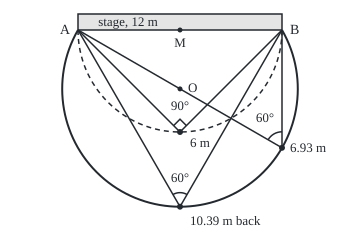
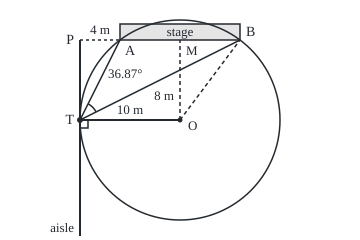

# Angles at a circle: the inscribed-angle rule and the tangent that meets the radius square on

[Syllabus](../../../SYLLABUS.md) → [Geometry and trig](../../../SYLLABUS.md#w05) → [Circles and Solids](../../../SYLLABUS.md#w05-s02) → Angles at a circle

---

## General Overview

A stage is 12 m wide. A camera with a 60° lens must frame it edge to edge. The lens's **field of view**, 60°, is the angle at the camera between the frame's left and right edges. So the camera needs a spot where the stage's ends are exactly 60° apart.

One such spot is 10.39 m straight back from the stage's middle; another, 6.93 m straight back from its right-hand end. All of them lie on one arc of a circle through the stage's ends. A 90° lens needs the half-circle across the stage: 6 m back at the middle. On a side aisle running straight back from 4 m beyond the left end, the widest view, 36.87°, is 8 m back, where a circle through the stage's ends touches it.

**Every spot on one arc of a circle sees the arc's ends at half the angle they make at the centre, on the side away from the spot. A diameter is seen at a right angle. A line touching a circle meets the radius there at a right angle.**

**What kind of fact this is:** three theorems, each proved on this card in Why it works.

### The picture: every spot that frames the stage

<p align="center"></p>

To scale, 1 m = 17 units. A and B are the stage's ends, M its midpoint. Dashed: the 90° half-circle, radius 6 m round M. Solid: the 60° arc, radius 6.93 m round O, 3.46 m back from M.

---

## The formula

A **chord** joins two points of a circle: here the stage's front edge AB. An **inscribed angle**, or rim angle, has its corner V on the circle and its arms running to A and B: the camera's view, θ (theta). The **central angle** has its corner at the centre O. Both stand on the arc from A to B that does not contain V. Three letters name the angle at the middle letter ([Congruent triangles](../01-Angles%2C%20Triangles%20and%20Congruence/03-congruent-triangles.md)).

$$\theta = \angle AVB = \tfrac12\,\angle AOB$$

**Read it aloud:** the angle at the rim is half the angle at the centre, both standing on the same arc.

V's place on the arc does not enter, so every spot on it sees the same angle. A 60° lens needs 120° at the centre. In radians a central angle is its arc over the radius ([Radians](02-radians-arcs-and-sectors.md)), so the rim angle is the far arc, behind the stage, over the diameter: 14.51 m ÷ 13.86 m = 1.0472 rad, which is 60°.

When AB is a diameter the central angle is 180°, so the rim angle is 90°: **Thales' theorem**. A **tangent**, a straight line meeting the circle at one point only, meets the radius there at a right angle. Now let a straight aisle run back from a point $P$ on the stage line, square to it. P is $a$ from the near end and $b$ from the far end. The best spot $T$ on the aisle is where a circle through A and B touches it, $t$ back:

$$t = \sqrt{ab}$$

**Read it aloud:** the best spot is as far back as the square root of the two distances multiplied.

| Symbol | Plain meaning | In our example | Push it up and the answer… |
| --- | --- | --- | --- |
| $A$, $B$ | the stage's ends | 12 m apart | a bigger circle |
| $M$, $P$ | the stage's midpoint; the aisle's start | P 4 m left of A | — |
| $V$ | the camera, on the circle | 10.39 m back from M | — |
| $O$, $r$ | the circle's centre and radius | 3.46 m back from M; 6.93 m | a narrower view |
| $\theta$ | the rim angle $\angle AVB$, in degrees: the field of view | 60° | the arc pulls in |
| $\angle AOB$ | the central angle on the arc away from V | 120° | always twice $\theta$ |
| $T$, $t$ | where a circle touches the aisle; how far back | 8 m | — |
| $a$, $b$ | P to the near and far ends | 4 m, 16 m | the best spot moves back |

### When it holds

- **The camera on the circle.** Inside it the view is wider, outside narrower (Step 3).
- **The audience side.** Behind the stage, a spot on the same circle stands on the other arc and sees 120°.
- **A straight aisle starting beyond the stage.** Slanted, the best spot is still √(ab) from P, but along the aisle, not straight back (Euclid III.36). An aisle starting on the stage is best at its start, 180°.

---

## Why it works

### Step 0: two radii make an isosceles triangle

Two radii make an **isosceles** triangle (two sides equal), so its angles facing those sides are equal ([Congruent triangles](../01-Angles%2C%20Triangles%20and%20Congruence/03-congruent-triangles.md)). The other tool: a triangle's **exterior angle**, between one side and the next side extended, equals the two far corners added ([Triangles](../01-Angles%2C%20Triangles%20and%20Congruence/02-triangle-angle-sum-and-inequality.md)).

### Step 1: the centre sees twice what the rim sees

Take the camera at the far end of the diameter from A, 6.93 m back from B: its sight line to A passes through O. Triangle OVB has two radii for sides, so its angles at V and B are equal, each θ. Angle AOB is its exterior angle at O: θ + θ = 2θ. Any other camera: the diameter through V splits θ into two such pieces; add, or subtract when O falls outside the angle.

<details>
<summary>Detailed proof</summary>

Let V be on the circle, off the arc AB the angle stands on, and VD the diameter through V.

1. **O on one arm**, say VA: the argument above.
2. **O inside the angle.** By case 1, angle AOD = 2 × angle AVD and angle DOB = 2 × angle DVB. Adding, angle AOB = 2 × angle AVB, measured across the arc away from V; it may pass 180°.
3. **O outside the angle.** Say VB lies between VD and VA. Then angle AVB = angle AVD − angle BVD, and by case 1, angle AOB = angle AOD − angle BOD = 2 × angle AVB.

</details>

### Step 2: Thales, a diameter seen square on

With the stage as diameter, the centre is M and the central angle is a straight line, 180°: every spot on the half-circle sees 90°.

### Step 3: inside the circle the view is wider, outside narrower

Take a spot Q on the audience side, off the circle, and join M to Q. If Q is outside, MQ crosses the arc at a point V inside triangle QAB. Extend AV to meet QB at E. Angle AVB is an exterior angle of triangle VEB, so it is larger than angle AEB; and angle AEB is an exterior angle of triangle QAE, so it is larger than angle AQB (Euclid I.21). So Q sees less than V: under 60°. If Q is inside, carry the line on to the arc: Q is inside triangle VAB and sees more than V.

### Step 4: the tangent meets the radius square on

Let the aisle touch the circle at T only, and let F be where a line from O meets the aisle square on. If F were not T, take T′ on the aisle as far past F as T, on the other side. Right triangles OFT and OFT′ share OF and have equal legs FT and FT′, so OT′ = OT by Pythagoras: a second meeting point. So F is T.

### Step 5: the best spot on the aisle

A circle through A and B has its centre equally far from both, so on the line through M square to the stage. One touches the aisle, at T. OT meets the aisle square on (Step 4), so by Pythagoras every other aisle spot is farther from O: outside the circle, it sees the stage narrower (Step 3).

### The picture: the circle that touches the aisle

<p align="center"></p>

To scale, 1 m = 10 units. Dashed: OM and OB. The square marks the right angle at T.

OT and the stage are both square to the aisle, so O and T are equally far back, and the radius is M's distance from the aisle: 4 + 6 = 10 m. In triangle OMB, OB = 10 m and MB = 6 m, so OM = √(10^2 − 6^2) = 8 m: T is 8 m back. In letters the radius is (a + b) ÷ 2 and MB is (b − a) ÷ 2; their squares differ by $a \times b$, so $t = \sqrt{ab}$.

The angle at T is half of angle AOB, which OM halves: it is angle MOB. Triangle OMB, sides 6, 8 and 10 m, is the 3, 4, 5 triangle doubled ([Similar triangles](../01-Angles%2C%20Triangles%20and%20Congruence/04-similar-triangles-and-scale.md)), so that corner is the 36.87° one facing 3 ([Triangles](../01-Angles%2C%20Triangles%20and%20Congruence/02-triangle-angle-sum-and-inequality.md)). At 4 m or 16 m back the view shrinks to 30.96°.

Grid coordinates give a second road, the code's: see [Distance and midpoint](../04-Coordinates%20and%20Curves/01-distance-and-midpoint.md).

---

## Worked numbers, by hand

| Step | Arithmetic | Value |
| --- | --- | --- |
| 90° lens | Thales: radius 12 ÷ 2 | **6 m** back |
| 60° lens | OM halves the 120° at O, so triangle OMB is half an equilateral triangle | r = 2 × OM |
| Pythagoras | (2 × OM)^2 = OM^2 + 6^2, so 3 × OM^2 = 36 | OM = 3.46 m, r = 6.93 m |
| straight back from M | 3.46 + 6.93 | **10.39 m** |
| straight back from B | far end of the diameter from A: 2 × 3.46 | **6.93 m** |
| aisle, best spot | radius 10 m; √(10^2 − 6^2) = √(4 × 16) | **8 m** back, seeing **36.87°** |

A 60° lens frames the stage from anywhere on the arc; on the aisle nothing beats 8 m back.

### What breaks if you drop a piece

| Mistake | Comes out at | What went wrong |
| --- | --- | --- |
| Central angle made 60°, not 120° | 22.39 m back, sees 30° | The rim angle is half the central angle |
| 90° lens, stage width as the radius | 12 m back, sees 53.13° | The stage is the diameter |
| A spot on the circle behind the stage | 120° | It stands on the other arc |
| Aisle spot at the average, 10 m | sees 36.19° | The best is √(4 × 16) = 8 m |

---

## Code, from first principles, and it actually runs

Two roads: the card's rules, and a grid. The grid puts M at (0, 0), A at (−6, 0) and B at (6, 0): metres right of M, then metres back. It measures each angle from the dot product of the two sight lines, at seven cameras round the arc, grid spots 5 cm apart and aisle spots 1 mm apart. Cos, sin and the inverse cosine come from [Sine, cosine and tangent](../03-Trigonometry/01-right-triangle-trigonometry.md).

### Python

```python
# Angles at a circle -- the check behind the card.  math supplies sqrt, acos,
# cos, sin and pi, nothing more.  A stage 12 m wide runs from A = (-6, 0) to
# B = (6, 0); the audience sits at positive y.  Road one: the circle rules.
# Road two: camera spots on a grid, every angle measured by the dot product.
import math

A, B, HALF = (-6.0, 0.0), (6.0, 0.0), 6.0

def dot(u, w): return u[0] * w[0] + u[1] * w[1]
def length(u): return math.sqrt(dot(u, u))

def seen(v):                                  # angle at v between A and B, in degrees
    u, w = (A[0] - v[0], A[1] - v[1]), (B[0] - v[0], B[1] - v[1])
    c = dot(u, w) / (length(u) * length(w))
    return math.acos(max(-1.0, min(1.0, c))) * 180 / math.pi

om = math.sqrt(HALF * HALF / 3)               # road one: half an equilateral triangle,
r60, O = 2 * om, (0.0, om)                    # so r = 2 OM and r^2 = OM^2 + 6^2
back, front_b = om + r60, om + math.sqrt(r60 * r60 - HALF * HALF)
arc_len = r60 * 120 * math.pi / 180           # the arc away from the camera: 120 deg of turn
a, b = 4.0, 16.0                              # the aisle: 4 m left of A, 16 m from B
P = -HALF - a                                 # where the aisle meets the stage line
r_aisle = (a + b) / 2                         # the centre sits over M, level with T (OT square)
t_rule = math.sqrt(r_aisle * r_aisle - HALF * HALF)   # how far back: Pythagoras on O, M, B
O2 = (0.0, t_rule)
thales = [seen((0.0, 6.0)), seen((3.6, 4.8))]              # road two: measure
arc = [seen((r60 * math.cos(d * math.pi / 180), om + r60 * math.sin(d * math.pi / 180)))
       for d in range(0, 181, 30)]
hits = [length((x / 20, y / 20 - om)) for x in range(-200, 201) for y in range(1, 241)
        if abs(seen((x / 20, y / 20)) - 60) < 0.05]
best, at = max(((seen((P, k / 1000)), k / 1000) for k in range(1, 40001)), key=lambda p: p[0])
wrong = math.sqrt(12 * 12 - HALF * HALF)     # mistake 1: centre angle 60, so O, A, B equilateral
print(f"stage A (-6, 0) to B (6, 0): {B[0] - A[0]:.0f} m wide, midpoint M (0, 0)")
print(f"90 deg lens, Thales: radius {HALF:.3f} m round M; at (0, 6) and (3.6, 4.8): "
      f"{thales[0]:.3f}, {thales[1]:.3f} deg")
print(f"60 deg lens: centre angle 120 deg; O {om:.3f} m back from M, radius {r60:.3f} m")
print(f"straight back from M {back:.3f} m; straight back from B {front_b:.3f} m")
print(f"measured at {len(arc)} spots round the arc: {min(arc):.3f} to {max(arc):.3f} deg; at O {seen(O):.3f} deg")
print(f"in radians: arc {arc_len:.3f} m / diameter {2 * r60:.3f} m = {arc_len / (2 * r60):.4f} rad"
      f" = {arc_len / (2 * r60) * 180 / math.pi:.3f} deg")
print(f"grid spots 5 cm apart seeing 60 +/- 0.05 deg: {len(hits)}, all {min(hits):.3f} to {max(hits):.3f} m from O")
print(f"aisle, a = {a:.0f} m, b = {b:.0f} m: circle radius {r_aisle:.3f} m, centre (0, {t_rule:.0f})")
print(f"rule: t = sqrt({r_aisle:.0f}^2 - 6^2) = {t_rule:.3f} = sqrt({a:.0f} x {b:.0f}) = {math.sqrt(a * b):.3f} m; "
      f"angle {seen(O2):.3f} / 2 = {seen(O2) / 2:.3f} deg")
print(f"scan of the aisle in 1 mm steps: widest {best:.3f} deg at {at:.3f} m")
print(f"at 4 m and 16 m back: {seen((P, 4.0)):.3f} and {seen((P, 16.0)):.3f} deg")
print(f"mistake 1, centre angle made 60: radius 12 m, straight back {wrong + 12:.3f} m sees {seen((0.0, wrong + 12)):.3f} deg")
print(f"mistake 2, 90 deg lens 12 m back, width taken as radius: {seen((0.0, 12.0)):.3f} deg")
print(f"mistake 3, same circle, behind the stage: {seen((0.0, om - r60)):.3f} deg")
print(f"mistake 4, aisle at the average ({a:.0f} + {b:.0f}) / 2 = {r_aisle:.0f} m: {seen((P, r_aisle)):.3f} deg")
print(f"figure 1, 1 m = 17 units: A (78, 30), B (282, 30), O (180, {30 + 17 * om:.1f}), radius {17 * r60:.1f}; "
      f"cameras (180, {30 + 17 * back:.1f}), (282, {30 + 17 * front_b:.1f}), (180, {30 + 17 * HALF:.0f})")
print(f"figure 2, 1 m = 10 units: P (80, 40), A ({80 + 10 * a:.0f}, 40), B ({80 + 10 * b:.0f}, 40), centre "
      f"({80 + 10 * r_aisle:.0f}, {40 + 10 * t_rule:.0f}), radius {10 * r_aisle:.0f}, T (80, {40 + 10 * t_rule:.0f})")
assert max(abs(x - 60) for x in arc + [seen((HALF, front_b))]) < 1e-9 and max(abs(x - 90) for x in thales) < 1e-9  # rim rule
assert abs(seen(O) - 2 * 60) < 1e-9 and abs(seen((0.0, back)) - arc_len / (2 * r60) * 180 / math.pi) < 1e-9  # centre; far arc / diameter
assert hits and max(abs(d - r60) for d in hits) < 0.05   # the grid finds no 60 deg spot off the arc
assert abs(at - math.sqrt(a * b)) < 0.002 and abs(best - seen(O2) / 2) < 1e-6  # widest at the touch
print("ALL CHECKS PASS")
```

**Ran 2026-09-24 on macOS, Python 3.14.6, standard library only. All checks passed. Output, pasted from the run:**

```
stage A (-6, 0) to B (6, 0): 12 m wide, midpoint M (0, 0)
90 deg lens, Thales: radius 6.000 m round M; at (0, 6) and (3.6, 4.8): 90.000, 90.000 deg
60 deg lens: centre angle 120 deg; O 3.464 m back from M, radius 6.928 m
straight back from M 10.392 m; straight back from B 6.928 m
measured at 7 spots round the arc: 60.000 to 60.000 deg; at O 120.000 deg
in radians: arc 14.510 m / diameter 13.856 m = 1.0472 rad = 60.000 deg
grid spots 5 cm apart seeing 60 +/- 0.05 deg: 151, all 6.919 to 6.938 m from O
aisle, a = 4 m, b = 16 m: circle radius 10.000 m, centre (0, 8)
rule: t = sqrt(10^2 - 6^2) = 8.000 = sqrt(4 x 16) = 8.000 m; angle 73.740 / 2 = 36.870 deg
scan of the aisle in 1 mm steps: widest 36.870 deg at 8.000 m
at 4 m and 16 m back: 30.964 and 30.964 deg
mistake 1, centre angle made 60: radius 12 m, straight back 22.392 m sees 30.000 deg
mistake 2, 90 deg lens 12 m back, width taken as radius: 53.130 deg
mistake 3, same circle, behind the stage: 120.000 deg
mistake 4, aisle at the average (4 + 16) / 2 = 10 m: 36.193 deg
figure 1, 1 m = 17 units: A (78, 30), B (282, 30), O (180, 88.9), radius 117.8; cameras (180, 206.7), (282, 147.8), (180, 132)
figure 2, 1 m = 10 units: P (80, 40), A (120, 40), B (240, 40), centre (180, 120), radius 100, T (80, 120)
ALL CHECKS PASS
```

### Rust

Same numbers, same labels, built with `rustc --edition 2021 -O`.

```rust
// Angles at a circle -- the same check as the Python, in Rust, no crates.  A
// stage 12 m wide runs from A = (-6, 0) to B = (6, 0); the audience sits at
// positive y.  Road one: the circle rules.  Road two: camera spots on a grid,
// every angle measured by the dot product.
use std::f64::consts::PI;

const A: (f64, f64) = (-6.0, 0.0);
const B: (f64, f64) = (6.0, 0.0);
const HALF: f64 = 6.0;

fn dot(u: (f64, f64), w: (f64, f64)) -> f64 { u.0 * w.0 + u.1 * w.1 }
fn length(u: (f64, f64)) -> f64 { dot(u, u).sqrt() }

fn seen(v: (f64, f64)) -> f64 {                // angle at v between A and B, in degrees
    let (u, w) = ((A.0 - v.0, A.1 - v.1), (B.0 - v.0, B.1 - v.1));
    let c = dot(u, w) / (length(u) * length(w));
    c.max(-1.0).min(1.0).acos() * 180.0 / PI
}

fn main() {
    let om = (HALF * HALF / 3.0).sqrt();       // road one: half an equilateral triangle,
    let (r60, o) = (2.0 * om, (0.0, om));      // so r = 2 OM and r^2 = OM^2 + 6^2
    let (back, front_b) = (om + r60, om + (r60 * r60 - HALF * HALF).sqrt());
    let arc_len = r60 * 120.0 * PI / 180.0;    // the arc away from the camera: 120 deg of turn
    let (a, b) = (4.0_f64, 16.0_f64);          // the aisle: 4 m left of A, 16 m from B
    let p_x = -HALF - a;                       // where the aisle meets the stage line
    let r_aisle = (a + b) / 2.0;               // the centre sits over M, level with T (OT square)
    let t_rule = (r_aisle * r_aisle - HALF * HALF).sqrt(); // how far back: Pythagoras on O, M, B
    let o2 = (0.0, t_rule);
    let thales = [seen((0.0, 6.0)), seen((3.6, 4.8))];     // road two: measure
    let arc: Vec<f64> = (0..=180).step_by(30).map(|d| {
        let t = d as f64 * PI / 180.0;
        seen((r60 * t.cos(), om + r60 * t.sin()))
    }).collect();
    let mut hits: Vec<f64> = Vec::new();
    for x in -200..=200 {
        for y in 1..=240 {
            let p = (x as f64 / 20.0, y as f64 / 20.0);
            if (seen(p) - 60.0).abs() < 0.05 { hits.push(length((p.0, p.1 - om))) }
        }
    }
    let (mut best, mut at) = (f64::NEG_INFINITY, 0.0);
    for k in 1..=40000 {
        let y = k as f64 / 1000.0;
        let s = seen((p_x, y));
        if s > best { best = s; at = y }
    }
    let wrong = (12.0 * 12.0 - HALF * HALF).sqrt(); // mistake 1: centre angle 60, so O, A, B equilateral
    let lo = |v: &[f64]| v.iter().cloned().fold(f64::INFINITY, f64::min);
    let hi = |v: &[f64]| v.iter().cloned().fold(f64::NEG_INFINITY, f64::max);
    println!("stage A (-6, 0) to B (6, 0): {:.0} m wide, midpoint M (0, 0)", B.0 - A.0);
    println!("90 deg lens, Thales: radius {:.3} m round M; at (0, 6) and (3.6, 4.8): {:.3}, {:.3} deg", HALF, thales[0], thales[1]);
    println!("60 deg lens: centre angle 120 deg; O {:.3} m back from M, radius {:.3} m", om, r60);
    println!("straight back from M {:.3} m; straight back from B {:.3} m", back, front_b);
    println!("measured at {} spots round the arc: {:.3} to {:.3} deg; at O {:.3} deg", arc.len(), lo(&arc), hi(&arc), seen(o));
    println!("in radians: arc {:.3} m / diameter {:.3} m = {:.4} rad = {:.3} deg", arc_len, 2.0 * r60, arc_len / (2.0 * r60), arc_len / (2.0 * r60) * 180.0 / PI);
    println!("grid spots 5 cm apart seeing 60 +/- 0.05 deg: {}, all {:.3} to {:.3} m from O", hits.len(), lo(&hits), hi(&hits));
    println!("aisle, a = {:.0} m, b = {:.0} m: circle radius {:.3} m, centre (0, {:.0})", a, b, r_aisle, t_rule);
    println!("rule: t = sqrt({:.0}^2 - 6^2) = {:.3} = sqrt({:.0} x {:.0}) = {:.3} m; angle {:.3} / 2 = {:.3} deg", r_aisle, t_rule, a, b, (a * b).sqrt(), seen(o2), seen(o2) / 2.0);
    println!("scan of the aisle in 1 mm steps: widest {:.3} deg at {:.3} m", best, at);
    println!("at 4 m and 16 m back: {:.3} and {:.3} deg", seen((p_x, 4.0)), seen((p_x, 16.0)));
    println!("mistake 1, centre angle made 60: radius 12 m, straight back {:.3} m sees {:.3} deg", wrong + 12.0, seen((0.0, wrong + 12.0)));
    println!("mistake 2, 90 deg lens 12 m back, width taken as radius: {:.3} deg", seen((0.0, 12.0)));
    println!("mistake 3, same circle, behind the stage: {:.3} deg", seen((0.0, om - r60)));
    println!("mistake 4, aisle at the average ({:.0} + {:.0}) / 2 = {:.0} m: {:.3} deg", a, b, r_aisle, seen((p_x, r_aisle)));
    println!("figure 1, 1 m = 17 units: A (78, 30), B (282, 30), O (180, {:.1}), radius {:.1}; cameras (180, {:.1}), (282, {:.1}), (180, {:.0})",
             30.0 + 17.0 * om, 17.0 * r60, 30.0 + 17.0 * back, 30.0 + 17.0 * front_b, 30.0 + 17.0 * HALF);
    println!("figure 2, 1 m = 10 units: P (80, 40), A ({:.0}, 40), B ({:.0}, 40), centre ({:.0}, {:.0}), radius {:.0}, T (80, {:.0})",
             80.0 + 10.0 * a, 80.0 + 10.0 * b, 80.0 + 10.0 * r_aisle, 40.0 + 10.0 * t_rule, 10.0 * r_aisle, 40.0 + 10.0 * t_rule);
    assert!(arc.iter().chain(&[seen((HALF, front_b))]).all(|x| (x - 60.0).abs() < 1e-9) && thales.iter().all(|x| (x - 90.0).abs() < 1e-9)); // rim rule
    assert!((seen(o) - 2.0 * 60.0).abs() < 1e-9 && (seen((0.0, back)) - arc_len / (2.0 * r60) * 180.0 / PI).abs() < 1e-9); // centre; far arc / diameter
    assert!(!hits.is_empty() && hits.iter().all(|d| (d - r60).abs() < 0.05)); // the grid finds no 60 deg spot off the arc
    assert!((at - (a * b).sqrt()).abs() < 0.002 && (best - seen(o2) / 2.0).abs() < 1e-6); // widest at the touch
    println!("ALL CHECKS PASS");
}
```

**Ran 2026-09-24 on macOS, rustc 1.98.1, no crates. All checks passed. Output, pasted from the run:**

```
stage A (-6, 0) to B (6, 0): 12 m wide, midpoint M (0, 0)
90 deg lens, Thales: radius 6.000 m round M; at (0, 6) and (3.6, 4.8): 90.000, 90.000 deg
60 deg lens: centre angle 120 deg; O 3.464 m back from M, radius 6.928 m
straight back from M 10.392 m; straight back from B 6.928 m
measured at 7 spots round the arc: 60.000 to 60.000 deg; at O 120.000 deg
in radians: arc 14.510 m / diameter 13.856 m = 1.0472 rad = 60.000 deg
grid spots 5 cm apart seeing 60 +/- 0.05 deg: 151, all 6.919 to 6.938 m from O
aisle, a = 4 m, b = 16 m: circle radius 10.000 m, centre (0, 8)
rule: t = sqrt(10^2 - 6^2) = 8.000 = sqrt(4 x 16) = 8.000 m; angle 73.740 / 2 = 36.870 deg
scan of the aisle in 1 mm steps: widest 36.870 deg at 8.000 m
at 4 m and 16 m back: 30.964 and 30.964 deg
mistake 1, centre angle made 60: radius 12 m, straight back 22.392 m sees 30.000 deg
mistake 2, 90 deg lens 12 m back, width taken as radius: 53.130 deg
mistake 3, same circle, behind the stage: 120.000 deg
mistake 4, aisle at the average (4 + 16) / 2 = 10 m: 36.193 deg
figure 1, 1 m = 17 units: A (78, 30), B (282, 30), O (180, 88.9), radius 117.8; cameras (180, 206.7), (282, 147.8), (180, 132)
figure 2, 1 m = 10 units: P (80, 40), A (120, 40), B (240, 40), centre (180, 120), radius 100, T (80, 120)
ALL CHECKS PASS
```

The two outputs match line for line.

> [!TIP]
> **Try changing**
> Guess first, then run it.
> - **Move the aisle out.** Set `a, b` to `9.0, 21.0`: the best spot moves back to √(9 × 21) = 13.748 m, and every assert passes.
> - **Stand off the arc.** Change `2 * om` to `2.1 * om` in the `r60` line. The cameras see 55.173° to 58.386°; the first assert stops the run.
> - **Loosen the grid's test.** Change `< 0.05]` to `< 0.5]`: 1498 spots, 6.827 m to 7.032 m from O. The third assert stops the run.

---

## The usual mistake

> [!warning]
> **Taking the central angle for the camera's angle.** A stage spanning 60° at the centre makes triangle OAB equilateral, radius 12 m, and the camera 22.39 m back sees only 30°. The camera's angle is half the central angle, so a 60° lens needs 120° at the centre.
>
> - **The stage width as the radius.** For the 90° lens, 12 m back sees 53.13°.
> - **The average for the square root of the product.** 10 m back on the aisle sees 36.19°, not 36.87°.

---

## Where you meet it in real life

- **Rugby conversions.** The kick is taken from a line straight out from where the try was scored: the aisle, with the posts as the stage's ends.
- **Navigation.** The angle between two charted landmarks puts a ship on an arc through them; keeping it below a set value keeps the ship outside a circle round a hidden rock (Step 3).

> **Say it back**
> A camera's field of view is the angle at which it sees the stage's ends. Every spot on one arc through those ends sees half the angle at the centre, because radii make isosceles triangles; a diameter is seen at 90°. Off the arc the view narrows outside and widens inside. A tangent meets the radius square on, which puts the best aisle spot √(ab) back.

---

## What this builds on

- [Radians](02-radians-arcs-and-sectors.md): an angle measured by its arc, which makes the rim angle the far arc over the diameter.
- [Circles](01-circle-circumference-and-area.md) and [Pythagoras](../01-Angles%2C%20Triangles%20and%20Congruence/05-pythagoras-and-its-converse.md): centre, radius and diameter; the lengths OM, r and t.

## Where this goes next

- [Law of sines](../03-Trigonometry/07-law-of-sines-and-the-ambiguous-case.md): this rule makes each side of a triangle, over the sine of the angle facing it, the diameter of the circle through its corners.

This card sized circles only for 60° and 90°; any other angle needs the sine ratio of [Sine, cosine and tangent](../03-Trigonometry/01-right-triangle-trigonometry.md).

---

## Sources

Verified 2026-09-24: every link below resolves to the publisher's page.

- Euclid. *Elements*, David E. Joyce's edition, Clark University. [III.20](https://mathcs.clarku.edu/~djoyce/java/elements/bookIII/propIII20.html), centre angle double the rim angle; [III.21](https://mathcs.clarku.edu/~djoyce/java/elements/bookIII/propIII21.html), equal angles from one arc; [III.31](https://mathcs.clarku.edu/~djoyce/java/elements/bookIII/propIII31.html), the angle in a semicircle; [III.18](https://mathcs.clarku.edu/~djoyce/java/elements/bookIII/propIII18.html), radius and tangent; [III.36](https://mathcs.clarku.edu/~djoyce/java/elements/bookIII/propIII36.html), tangent and secant; [I.21](https://mathcs.clarku.edu/~djoyce/java/elements/bookI/propI21.html), the view from inside a triangle.
- Heath, Thomas L. *The Thirteen Books of the Elements*, Vol. 2, Books III to IX. Dover. [Publisher page](https://store.doverpublications.com/products/9780486600895). Book III, with commentary.
- Dörrie, Heinrich. *100 Great Problems of Elementary Mathematics*. Dover. [Publisher page](https://store.doverpublications.com/products/9780486613482). Problem 94, Regiomontanus' maximum problem: the aisle question, for a hanging rod.
