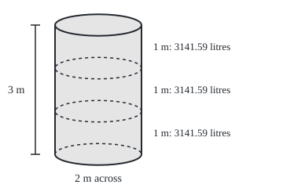
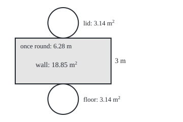

# Prisms and cylinders: volume is cross-section times height

[Syllabus](../../../SYLLABUS.md) → [Geometry and trig](../../../SYLLABUS.md#w05) → [Circles and Solids](../../../SYLLABUS.md#w05-s02) → Prisms and cylinders

---

## General Overview

A rain tank stands beside a house: a round drum 2 m across and 3 m tall. How many litres does it hold? A litre is the space inside a cube 10 cm on each edge, so a cubic metre holds 10 × 10 × 10 of them: 1000 litres.

Look down into the full tank. The water's surface is a circle 2 m across, of area 3.141593 square metres. Every centimetre of depth is another layer of that circle, holding 31.4159 litres. The tank is 300 cm deep: 300 layers, 9424.78 litres.

Nothing in that count needs the layer to be round. Any solid that keeps one cross-section (the face a straight cut across it leaves) from end to end works the same way: a box, a beam, a tent, a pencil. With polygon ends (flat shapes with straight edges) it is a **prism**; with circular ends, a **cylinder**. Its skin, cut down one line and laid flat, is one rectangle plus the two ends.

**A solid whose every slice matches its base holds the base's area times its height; standing upright, its walls unroll into one rectangle as wide as the base's perimeter.**

**What kind of fact this is:** a theorem. Why it works proves the upright case from two rules for volume: a box holds length times width times height, and pieces that do not overlap add. The leaning case rests on Cavalieri's principle, proved on a later card.

### The picture: the tank as three one-metre slices

<p align="center"></p>

Scale 1 m = 55 units across and up; the round ends are drawn a quarter as deep as they are wide, as seen from a little above. Each dashed ring marks another metre of depth.

---

## The formula

Notation first, in words. $B$ is the base area, which is also the area of every slice parallel to the base. $h$ is the height, measured square on (at right angles) between the ends. $P$ is the perimeter, the distance once round the base. $V$ is the volume. $L$ is the **lateral area**, the area of the walls alone. $S$ is the **surface area**, the whole skin: walls and both ends.

$$V = B\,h \qquad L = P\,h \qquad S = P\,h + 2B$$

**Read it aloud:** the volume is one slice's area times the height; the walls are the way round times the height; the surface area adds the two ends.

For a cylinder of radius $r$ (centre to rim), the circle card ([Circles](01-circle-circumference-and-area.md)) gives $B = \pi r^2$ and $P = 2\pi r$, where $\pi$ (pi) is every circle's circumference divided by its diameter, about 3.141593.

$$V = \pi r^2 h \qquad L = 2\pi r\,h \qquad S = 2\pi r\,h + 2\pi r^2$$

**Read it aloud:** a cylinder holds pi times the radius squared times the height; its wall is once round the rim times the height.

| Symbol | Plain meaning | In our example | Push it up and the answer… |
| --- | --- | --- | --- |
| $V$ | volume; in cubic metres, times 1000 for litres | 9.424778 cubic metres, 9424.78 litres | — |
| $B$ | base area, and every slice's | 3.141593 square metres | volume grows in step |
| $h$ | height between the ends, square on | 3 m | volume and walls grow in step |
| $P$ | perimeter: once round the base | 6.283185 m | more wall for the same base area |
| $L$ | lateral area: the walls alone | 18.849556 square metres | — |
| $S$ | surface area: walls and both ends | 25.132741 square metres | — |
| $r$ | radius, half the width | 1 m | twice the radius, four times the litres |
| $\pi$ | circumference divided by diameter | 3.141593 | — |

### When it holds

- **Every slice matches.** The cone-shaped hopper under the tank narrows to a point and holds a third of the matching cylinder ([Pyramids, cones and spheres](05-pyramids-cones-and-spheres.md)).
- **Height square on.** A leaning prism still holds $B\,h$ with $h$ its upright height; using the longer sloping edge instead overstates the volume.
- **Walls square on.** A leaning prism's walls are slanted parallelograms (opposite sides parallel), with more area than $P\,h$.
- **Inside measurements, flat ends.** Capacity uses the inside width and depth; a domed lid or sloping floor changes the water held.

---

## Why it works

### Step 0: a box is one layer of cubes, repeated

The square box the tank just fits inside is 2 m by 2 m by 3 m. Its floor takes 20 × 20 = 400 litre cubes, a layer 10 cm deep, and 30 layers fill it: 12000 litres. Cubes in one layer times the number of layers is base area times height, and any solid whose slices all match is one layer repeated.

The tank fills 0.785398 of the box: the share of the square floor the circle covers. The height is shared, so only the slices matter.

### Step 1: a curved base, by columns

A round floor cannot be tiled with whole squares. Lay a grid of squares over the base and stand a full-height column of cubes on each. Columns on squares wholly inside the circle lie in the tank; columns on squares touching it cover the tank. The volume lies between the two counts.

Litre cubes give 8280 inside and 10320 touching. Cubes 1 cm on an edge, a millilitre each, give 9304.80 to 9538.80 litres. Each count is its squares' area times the height, and as the squares shrink, both areas close in on the circle's 3.141593 square metres.

### Step 2: leaning keeps the volume

Push a stack of coins so it leans: each coin is unchanged, so the stack holds the same metal, and the height that counts is the upright one. The general rule is **Cavalieri's principle**: solids whose slices at every height have equal areas hold equal volumes. Bonaventura Cavalieri published it in 1635.

<details>
<summary>Detailed proof</summary>

Inside columns do not overlap and lie in the solid, so the volume is at least their squares' total area times $h$. Touching columns cover the solid, so it is at most their total area times $h$. As the grid is refined, both areas approach $B$: that is what the base having area $B$ means. A fixed number caught between two quantities that both approach $B\,h$ can only be $B\,h$.

At every height a leaning prism's slice is the upright prism's, shifted sideways, so Cavalieri's principle gives it $B\,h$ too. [Volumes](../../06-Calculus%20and%20analysis/05-Curves%20and%20Solids/03-volumes-by-slices-and-shells.md) proves the principle.

</details>

### Step 3: unroll the walls

The box's four walls are rectangles 2 m wide and 3 m tall. Side by side they make one rectangle 8 m (the way round the floor) by 3 m: 24 square metres. Floor and lid add 4 each: 32 square metres.

The tank's wall curves only one way; up the wall it is straight. Cut down one vertical line and it unrolls flat, like a label off a tin, without stretching: a rectangle 3 m tall and 6.28 m wide, once round the rim, so 18.85 square metres. Lid and floor are circles of 3.14 square metres each: 25.13 square metres in all.

### The picture: the tank's surface, laid flat

<p align="center"></p>

Scale 1 m = 30 units. The shaded wall's left and right edges were the single cut; the lid and floor touch it where they joined.

### Step 4: a cylinder ends a run of prisms

Put a square inside the tank's circle, corners on the rim, and another outside, sides touching it. Prisms on them hold 6000 and 12000 litres, bracketing the tank. Double the sides again and again: each new corner goes on the rim, halfway between two old ones. Each new side is the long side of a right-angled triangle whose short sides are half the old side and the gap from its middle out to the rim ([Pythagoras](../01-Angles%2C%20Triangles%20and%20Congruence/05-pythagoras-and-its-converse.md)), so no π enters.

At 16 sides the prisms hold 9184.40 to 9547.79 litres; at 4096, 9424.77 to 9424.78. Their walls close in on 18.849556 square metres. Every prism obeys $V = B\,h$ and $L = P\,h$, so the cylinder they close in on does too. Book XII of Euclid's *Elements* doubles the sides of an inside square the same way to compare cylinders.

Solids whose slices change size need the slices added one by one: [Volumes](../../06-Calculus%20and%20analysis/05-Curves%20and%20Solids/03-volumes-by-slices-and-shells.md).

---

## Worked numbers, by hand

| Step | Arithmetic | Value |
| --- | --- | --- |
| Radius | 2 m across, halved | 1 m |
| Base area | π × 1 × 1 | 3.141593 square metres |
| Volume | 3.141593 × 3 | 9.424778 cubic metres |
| In litres | 9.424778 × 1000 | **9424.78 litres** |
| One centimetre of depth | 3.141593 × 0.01 × 1000 | 31.4159 litres |
| Once round the rim | 2 × π × 1 | 6.283185 m |
| Walls | 6.283185 × 3 | 18.849556 square metres |
| Closed tank | 18.849556 + 2 × 3.141593 | **25.132741 square metres** |

Full, the tank holds 9424.78 litres, and its dipstick reads 31.4159 litres to the centimetre.

### What breaks if you drop a piece

| Mistake | Comes out at | What went wrong |
| --- | --- | --- |
| The 2 m width as the radius | 37699.11 litres | The radius is squared: twice it, four times the litres |
| Circumference as base area | 18849.56 litres | $2\pi r$ is a length round the rim, not an area |
| 100 litres to the cubic metre | 942.48 litres | It is 10 × 10 × 10 litre cubes |
| Paint for the walls only | 18.85 of 25.13 square metres | Lid and floor forgotten |

The code prints all four.

---

## Code, from first principles, and it actually runs

Three roads to the litres. Road one is the formula. Road two counts cubes, testing each base square's nearest and farthest corners against the rim with Pythagoras. Road three builds the inside and outside prisms by doubling from a square. Roads two and three never use π. The three asserts check that cubes and prisms bracket the formula and close in.

### Python

```python
# Prisms and cylinders -- the check behind the card.  The tank is a cylinder
# 2 m across (radius 1 m) and 3 m tall.  Road one: base area times height.
# Two more roads never touch pi: count cubes of water, and squeeze the tank
# between prisms on many-sided bases whose sides come from Pythagoras alone.
from math import pi, sqrt

R, H = 1.0, 3.0                                 # radius and height, in metres
base, rim = pi * R * R, 2 * pi * R              # circle area and circumference
vol, side = base * H, rim * H                   # base x height; perimeter x height
L = vol * 1000                                  # 1000 litre cubes to the cubic metre
print(f"tank: {2 * R:.0f} m across, radius {R:.0f} m, {H:.0f} m tall")
print(f"base area {base:.6f} m^2; volume {vol:.6f} m^3, x 1000 = {L:.2f} litres")
print(f"each cm of depth: {base * 10:.4f} litres, x {H * 100:.0f} cm = {L:.2f}; each 1 m slice: {base * 1000:.2f}")
print(f"circumference {rim:.6f} m; side {side:.6f}, with floor {side + base:.6f}, closed {side + 2 * base:.6f} m^2")
D, k, z = 2 * R, round(20 * R), round(10 * H)   # the square box the tank fits in; litre cubes
print(f"square box {D:.0f} x {D:.0f} x {H:.0f} m: {k} x {k} = {k * k} litre cubes a layer, x {z} layers = {k * k * z} litres")
print(f"box skin: perimeter {4 * D:.0f} m x {H:.0f} m = {4 * D * H:.0f} m^2 of walls, + 2 x {D * D:.0f} m^2 of ends = "
      f"{4 * D * H + 2 * D * D:.0f} m^2; tank / box = {vol / (D * D * H):.6f}")

def cubes(n):                                   # cubes of edge 1/n m: wholly inside, touching
    m, inside, touching = round(R * n), 0, 0
    for i in range(-m, m):                      # one layer, cell corners i..i+1, j..j+1
        for j in range(-m, m):
            far = max(i * i, (i + 1) ** 2) + max(j * j, (j + 1) ** 2)
            near = min(i * i, (i + 1) ** 2) + min(j * j, (j + 1) ** 2)
            inside += far <= m * m              # farthest corner inside the circle
            touching += near < m * m            # nearest corner inside the circle
    return inside * round(H * n), touching * round(H * n)   # one layer, times the layers

(lo1, hi1), (lo2, hi2) = cubes(10), cubes(100)
print(f"litre cubes (10 cm): {lo1} wholly inside, {hi1} touching the tank")
print(f"millilitre cubes (1 cm): {lo2} to {hi2}, so {lo2 / 1000:.2f} to {hi2 / 1000:.2f} litres")

rows, s, n = [], sqrt(2) * R, 4                 # a square inside the circle
while n <= 4096:
    a = sqrt(R * R - s * s / 4)                 # centre to the middle of a side
    rows.append((n, n * s * a / 2 * H * 1000, n * s * R * R / (2 * a) * H * 1000,
                 n * s * H, n * s * R / a * H))  # inside and outside prisms
    s, n = sqrt(R * s * s / (2 * (R + a))), 2 * n  # double the sides, by Pythagoras
for n, vin, vout, sin_, sout in rows:
    if n in (4, 16, 256, 4096):
        print(f"prisms, {n} sides: {vin:.2f} to {vout:.2f} litres; side {sin_:.6f} to {sout:.6f} m^2")

print(f"mistake, diameter as radius: {pi * (2 * R) ** 2 * H * 1000:.2f} litres")
print(f"mistake, circumference as base area: {rim * H * 1000:.2f} litres")
print(f"mistake, 100 litres to the cubic metre: {vol * 100:.2f} litres")
print(f"mistake, paint for the side only: {side:.2f} of {side + 2 * base:.2f} m^2")
print(f"figure, tank at 1 m = 55: walls x {125 - 55 * R:.0f} and {125 + 55 * R:.0f}, rim y 32, "
      f"slices y {32 + 55:.0f} and {32 + 110:.0f}, floor y {32 + 55 * H:.0f}, ends {55 * R / 4:.2f} deep")
print(f"figure, net at 1 m = 30: side 30 to {30 + 30 * rim:.2f} by 75 to {75 + 30 * H:.0f} "
      f"({rim:.2f} m by {H:.0f} m, {side:.2f} m^2); ends centred x {30 + 15 * rim:.2f}, "
      f"y {75 - 30 * R:.0f} and {75 + 30 * H + 30 * R:.0f}, radius {30 * R:.0f} ({base:.2f} m^2 each)")
assert lo1 < L < hi1 and lo2 / 1000 < L < hi2 / 1000 and (hi2 - lo2) / 1000 < (hi1 - lo1) / 5
assert all(r[1] < L < r[2] for r in rows) and rows[-1][2] - rows[-1][1] < 1e-6 * L
assert all(r[3] < side < r[4] for r in rows) and rows[-1][4] - rows[-1][3] < 1e-6 * side
print("ALL CHECKS PASS")
```

**Ran 2026-09-24 on macOS, Python 3.14.6, standard library only. All checks passed. Output, pasted from the run:**

```
tank: 2 m across, radius 1 m, 3 m tall
base area 3.141593 m^2; volume 9.424778 m^3, x 1000 = 9424.78 litres
each cm of depth: 31.4159 litres, x 300 cm = 9424.78; each 1 m slice: 3141.59
circumference 6.283185 m; side 18.849556, with floor 21.991149, closed 25.132741 m^2
square box 2 x 2 x 3 m: 20 x 20 = 400 litre cubes a layer, x 30 layers = 12000 litres
box skin: perimeter 8 m x 3 m = 24 m^2 of walls, + 2 x 4 m^2 of ends = 32 m^2; tank / box = 0.785398
litre cubes (10 cm): 8280 wholly inside, 10320 touching the tank
millilitre cubes (1 cm): 9304800 to 9538800, so 9304.80 to 9538.80 litres
prisms, 4 sides: 6000.00 to 12000.00 litres; side 16.970563 to 24.000000 m^2
prisms, 16 sides: 9184.40 to 9547.79 litres; side 18.728671 to 19.095587 m^2
prisms, 256 sides: 9423.83 to 9425.25 litres; side 18.849083 to 18.850502 m^2
prisms, 4096 sides: 9424.77 to 9424.78 litres; side 18.849554 to 18.849560 m^2
mistake, diameter as radius: 37699.11 litres
mistake, circumference as base area: 18849.56 litres
mistake, 100 litres to the cubic metre: 942.48 litres
mistake, paint for the side only: 18.85 of 25.13 m^2
figure, tank at 1 m = 55: walls x 70 and 180, rim y 32, slices y 87 and 142, floor y 197, ends 13.75 deep
figure, net at 1 m = 30: side 30 to 218.50 by 75 to 165 (6.28 m by 3 m, 18.85 m^2); ends centred x 124.25, y 45 and 195, radius 30 (3.14 m^2 each)
ALL CHECKS PASS
```

### Rust

Same numbers, same labels, built with `rustc --edition 2021 -O`.

```rust
// Prisms and cylinders -- the same check as the Python, in Rust.  No crates.
// The tank is a cylinder 2 m across (radius 1 m) and 3 m tall.  Road one: base
// area times height.  Two more roads never touch pi: count cubes of water, and
// squeeze the tank between prisms on many-sided bases built by Pythagoras alone.
use std::f64::consts::PI;

const R: f64 = 1.0; // radius, in metres
const H: f64 = 3.0; // height, in metres

fn cubes(n: i64) -> (i64, i64) { // cubes of edge 1/n m: wholly inside, touching
    let m = (R * n as f64).round() as i64;
    let (mut inside, mut touching) = (0, 0);
    for i in -m..m { // one layer, cell corners i..i+1, j..j+1
        for j in -m..m {
            let far = (i * i).max((i + 1) * (i + 1)) + (j * j).max((j + 1) * (j + 1));
            let near = (i * i).min((i + 1) * (i + 1)) + (j * j).min((j + 1) * (j + 1));
            if far <= m * m { inside += 1 } // farthest corner inside the circle
            if near < m * m { touching += 1 } // nearest corner inside the circle
        }
    }
    let layers = (H * n as f64).round() as i64;
    (inside * layers, touching * layers) // one layer, times the layers
}

fn main() {
    let (base, rim) = (PI * R * R, 2.0 * PI * R); // circle area and circumference
    let (vol, side) = (base * H, rim * H); // base x height; perimeter x height
    let l = vol * 1000.0; // 1000 litre cubes to the cubic metre
    println!("tank: {:.0} m across, radius {:.0} m, {:.0} m tall", 2.0 * R, R, H);
    println!("base area {:.6} m^2; volume {:.6} m^3, x 1000 = {:.2} litres", base, vol, l);
    println!("each cm of depth: {:.4} litres, x {:.0} cm = {:.2}; each 1 m slice: {:.2}",
             base * 10.0, H * 100.0, l, base * 1000.0);
    println!("circumference {:.6} m; side {:.6}, with floor {:.6}, closed {:.6} m^2",
             rim, side, side + base, side + 2.0 * base);
    let (d, k, z) = (2.0 * R, (20.0 * R).round() as i64, (10.0 * H).round() as i64); // the box; litre cubes
    println!("square box {:.0} x {:.0} x {:.0} m: {} x {} = {} litre cubes a layer, x {} layers = {} litres",
             d, d, H, k, k, k * k, z, k * k * z);
    println!("box skin: perimeter {:.0} m x {:.0} m = {:.0} m^2 of walls, + 2 x {:.0} m^2 of ends = {:.0} m^2; tank / box = {:.6}",
             4.0 * d, H, 4.0 * d * H, d * d, 4.0 * d * H + 2.0 * d * d, vol / (d * d * H));
    let ((lo1, hi1), (lo2, hi2)) = (cubes(10), cubes(100));
    println!("litre cubes (10 cm): {} wholly inside, {} touching the tank", lo1, hi1);
    println!("millilitre cubes (1 cm): {} to {}, so {:.2} to {:.2} litres",
             lo2, hi2, lo2 as f64 / 1000.0, hi2 as f64 / 1000.0);
    let (mut rows, mut s, mut n): (Vec<(f64, f64, f64, f64, f64)>, f64, f64) = (vec![], 2f64.sqrt() * R, 4.0);
    while n <= 4096.0 { // a square inside the circle, then double the sides
        let a = (R * R - s * s / 4.0).sqrt(); // centre to the middle of a side
        rows.push((n, n * s * a / 2.0 * H * 1000.0, n * s * R * R / (2.0 * a) * H * 1000.0,
                   n * s * H, n * s * R / a * H)); // inside and outside prisms
        s = (R * s * s / (2.0 * (R + a))).sqrt(); // the new side, by Pythagoras
        n *= 2.0;
    }
    for &(n, vin, vout, sin, sout) in &rows {
        if [4.0, 16.0, 256.0, 4096.0].contains(&n) {
            println!("prisms, {} sides: {:.2} to {:.2} litres; side {:.6} to {:.6} m^2", n, vin, vout, sin, sout);
        }
    }
    println!("mistake, diameter as radius: {:.2} litres", PI * (2.0 * R).powi(2) * H * 1000.0);
    println!("mistake, circumference as base area: {:.2} litres", rim * H * 1000.0);
    println!("mistake, 100 litres to the cubic metre: {:.2} litres", vol * 100.0);
    println!("mistake, paint for the side only: {:.2} of {:.2} m^2", side, side + 2.0 * base);
    println!("figure, tank at 1 m = 55: walls x {:.0} and {:.0}, rim y 32, slices y {:.0} and {:.0}, floor y {:.0}, ends {:.2} deep",
             125.0 - 55.0 * R, 125.0 + 55.0 * R, 32.0 + 55.0, 32.0 + 110.0, 32.0 + 55.0 * H, 55.0 * R / 4.0);
    println!("figure, net at 1 m = 30: side 30 to {:.2} by 75 to {:.0} ({:.2} m by {:.0} m, {:.2} m^2); ends centred x {:.2}, y {:.0} and {:.0}, radius {:.0} ({:.2} m^2 each)",
             30.0 + 30.0 * rim, 75.0 + 30.0 * H, rim, H, side, 30.0 + 15.0 * rim, 75.0 - 30.0 * R, 75.0 + 30.0 * H + 30.0 * R, 30.0 * R, base);
    let (lo1, hi1, lo2, hi2) = (lo1 as f64, hi1 as f64, lo2 as f64, hi2 as f64);
    assert!(lo1 < l && l < hi1 && lo2 / 1000.0 < l && l < hi2 / 1000.0 && (hi2 - lo2) / 1000.0 < (hi1 - lo1) / 5.0);
    assert!(rows.iter().all(|r| r.1 < l && l < r.2) && rows[rows.len() - 1].2 - rows[rows.len() - 1].1 < 1e-6 * l);
    assert!(rows.iter().all(|r| r.3 < side && side < r.4) && rows[rows.len() - 1].4 - rows[rows.len() - 1].3 < 1e-6 * side);
    println!("ALL CHECKS PASS");
}
```

**Ran 2026-09-24 on macOS, rustc 1.98.1, no crates. All checks passed. Output, pasted from the run:**

```
tank: 2 m across, radius 1 m, 3 m tall
base area 3.141593 m^2; volume 9.424778 m^3, x 1000 = 9424.78 litres
each cm of depth: 31.4159 litres, x 300 cm = 9424.78; each 1 m slice: 3141.59
circumference 6.283185 m; side 18.849556, with floor 21.991149, closed 25.132741 m^2
square box 2 x 2 x 3 m: 20 x 20 = 400 litre cubes a layer, x 30 layers = 12000 litres
box skin: perimeter 8 m x 3 m = 24 m^2 of walls, + 2 x 4 m^2 of ends = 32 m^2; tank / box = 0.785398
litre cubes (10 cm): 8280 wholly inside, 10320 touching the tank
millilitre cubes (1 cm): 9304800 to 9538800, so 9304.80 to 9538.80 litres
prisms, 4 sides: 6000.00 to 12000.00 litres; side 16.970563 to 24.000000 m^2
prisms, 16 sides: 9184.40 to 9547.79 litres; side 18.728671 to 19.095587 m^2
prisms, 256 sides: 9423.83 to 9425.25 litres; side 18.849083 to 18.850502 m^2
prisms, 4096 sides: 9424.77 to 9424.78 litres; side 18.849554 to 18.849560 m^2
mistake, diameter as radius: 37699.11 litres
mistake, circumference as base area: 18849.56 litres
mistake, 100 litres to the cubic metre: 942.48 litres
mistake, paint for the side only: 18.85 of 25.13 m^2
figure, tank at 1 m = 55: walls x 70 and 180, rim y 32, slices y 87 and 142, floor y 197, ends 13.75 deep
figure, net at 1 m = 30: side 30 to 218.50 by 75 to 165 (6.28 m by 3 m, 18.85 m^2); ends centred x 124.25, y 45 and 195, radius 30 (3.14 m^2 each)
ALL CHECKS PASS
```

The two outputs match line for line.

> [!TIP]
> **Try changing**
> Guess first, then run it.
> - **Twice as wide.** Set `R` to `2.0`: 37699.11 litres, the figure the diameter-as-radius mistake prints. Every road scales, so the asserts pass.
> - **Half as tall.** Set `H` to `1.5`: the litres halve, the surface area does not, since lid and floor keep 3.14 square metres each.
> - **A wrong rim.** Change `2 * pi * R` to `pi * R`: the walls fall below every inside prism's, and the third assert stops it.

---

## The usual mistake

> [!warning]
> **Putting the width in for the radius.** A tank 2 m across has radius 1 m. Put 2 into $\pi r^2 h$ and out comes 37699.11 litres, four times the truth: the radius is squared.
>
> - **Circumference for area.** $2\pi r$ is a length; as a base area it gives 18849.56 litres.
> - **The litre conversion.** A cubic metre is 1000 litres, not 100; the slip gives 942.48.
> - **Walls without ends.** 18.85 square metres of paint, for a closed tank needing 25.13.
> - **A tank on its side.** Still 9424.78 litres, but its horizontal slices differ in width, so depth no longer converts at a fixed rate.

---

## Where you meet it in real life

- **Tanks and dipsticks.** An upright tank converts depth at one fixed rate, 31.4159 litres a centimetre here.
- **Beams and extrusions.** A steel beam or an extruded bar (pushed through a shaped hole, so every slice matches) holds its cross-section times its length.
- **Packaging.** A tin's label is its unrolled wall; a carton is cut flat as side panels in a row plus the ends.

> **Say it back**
> A prism or cylinder is one slice repeated, so its volume is the slice's area times the height, measured square on. Its walls unroll into one rectangle as wide as the way round the base; the ends are added separately. The tank 2 m across and 3 m tall holds 9424.78 litres; closed, its surface area is 25.13 square metres. Its radius is 1 m, not 2.

---

## What this builds on

- [Circles](01-circle-circumference-and-area.md): $B = \pi r^2$ and $P = 2\pi r$ for the round slice, and π as circumference divided by diameter.

## Where this goes next

- [Pyramids, cones and spheres](05-pyramids-cones-and-spheres.md): slices that shrink to a point, and the sphere.
- [Polyhedra](06-polyhedra-and-eulers-formula.md): counting a prism's faces, edges and corners.
- [Volumes](../../06-Calculus%20and%20analysis/05-Curves%20and%20Solids/03-volumes-by-slices-and-shells.md): any solid as a sum of thin slabs, whatever its slices do.

The hopper beneath the tank tapers to a point; how much a tapering solid holds is the question [Pyramids, cones and spheres](05-pyramids-cones-and-spheres.md) answers.

---

## Sources

Verified 2026-09-24: every link below resolves to the publisher's page.

- Euclid. *Elements*, Book XI, Proposition 31, ed. D. E. Joyce, Clark University. [Proposition 31](https://mathcs.clarku.edu/~djoyce/java/elements/bookXI/propXI31.html). Boxes on equal bases and of one height hold the same, upright or leaning.
- Euclid. *Elements*, Book XII, Propositions 11 and 14, ed. D. E. Joyce, Clark University. [Proposition 11](https://mathcs.clarku.edu/~djoyce/java/elements/bookXII/propXII11.html) and [Proposition 14](https://mathcs.clarku.edu/~djoyce/java/elements/bookXII/propXII14.html). Cylinders of one height compare as their bases, and on equal bases as their heights; Proposition 11 doubles the sides of an inside square, as Step 4 does.
- O'Connor, J. J., and E. F. Robertson. "Bonaventura Cavalieri." MacTutor Archive, University of St Andrews. [Biography](https://mathshistory.st-andrews.ac.uk/Biographies/Cavalieri/). The 1635 *Geometria*, source of Cavalieri's principle.
- Marecek, Lynn, MaryAnne Anthony-Smith and Andrea Honeycutt Mathis. *Prealgebra 2e*, section 9.6, "Solve Geometry Applications: Volume and Surface Area." OpenStax. [Section page](https://openstax.org/books/prealgebra-2e/pages/9-6-solve-geometry-applications-volume-and-surface-area). Boxes and cylinders, worked in the standard notation.
