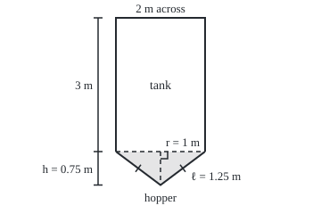
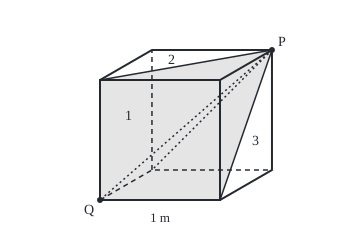

# Pyramids, cones and spheres: the one-third rule and the sphere's four pi r squared

Geometry and trig → Circles and Solids → Solids with shrinking slices → Pyramids, cones and spheres

---

## General Overview

Under a water tank 2 m across and 3 m tall hangs a steel hopper: a cone, a circle narrowing straight to a point, hung point down, its rim on the tank's bottom edge. The rim's radius is 1 m; the point is 0.75 m below it.

A cylinder on that rim, 0.75 m deep, would hold 2.356194 cubic metres. The hopper holds a third: 0.785398 cubic metres, or 785.40 litres, as much as the bottom 25 cm of the tank. Its wall, 1.25 m along the slope, takes 3.926991 square metres of steel.

The third comes from the narrowing: every level slice is a smaller copy of the rim. A pyramid, narrowing the same way from a flat-sided base, obeys the same rule. A ball as wide as the tank holds 4.188790 cubic metres; its skin (strictly, the sphere) covers 12.566371 square metres.

**A pyramid or cone holds one third of base area times height, because its slices shrink evenly to a point; a ball of radius r holds four thirds of pi r cubed, and its skin is four pi r squared.**

**What kind of fact this is:** theorems. Why it works proves the one-third for a pyramid cut from a cube. Cavalieri's principle (equal slices, equal volumes), which calculus proves, carries it to every pyramid and cone and gives the ball's volume. The skin is argued, not proved.

### The picture: the hopper under the tank, drawn to scale

<p align="center"></p>

Scale 1 m = 50 units. The height runs down the dashed centre line, square to the rim; the slant runs along either wall, ticked as equal.

---

## The formula

$V$ is the volume; $B$ the base's area; $h$ the height, measured square on (at a right angle) from base to tip; $\pi$, as on [circle-circumference-and-area](01-circle-circumference-and-area.md), a circle's circumference over its diameter.

$$V = \tfrac13\,B\,h$$

**Read it aloud:** a pyramid or cone holds one third of its base area times its height.

A cone on a circle of radius $r$ has $B = \pi r^2$. Its slant $\ell$, rim to tip along the wall, comes from Pythagoras ([pythagoras-and-its-converse](../01-Angles%2C%20Triangles%20and%20Congruence/05-pythagoras-and-its-converse.md)); $S$ is the wall's area:

$$V = \tfrac13\,\pi r^2 h, \qquad \ell = \sqrt{r^2 + h^2}, \qquad S = \pi r \ell$$

**Read it aloud:** a cone holds a third of the cylinder on its rim; its wall is pi times radius times slant.

For a ball of radius $r$, $S$ is the skin's area:

$$V = \tfrac43\,\pi r^3, \qquad S = 4\pi r^2$$

**Read it aloud:** a ball holds four thirds of pi r cubed; its skin is four of its widest circles.

| Symbol | Plain meaning | In our example | Push it up and the answer… |
| --- | --- | --- | --- |
| $V$ | volume | 0.785398; ball 4.188790 m^3 | — |
| $B$ | base area | 3.141593 m^2 | rises in step |
| $h$ | height, square on | 0.75 m | rises in step |
| $r$ | radius, rim or ball | 1 m | cone volume by its square, ball by its cube |
| $\ell$ | slant along the wall | 1.25 m | steel rises in step |
| $S$ | curved area: wall, or skin | 3.926991; 12.566371 m^2 | — |
| $\pi$ | circumference over diameter | 3.141593 | fixed |
| $z$ | a slice's height above the tip, or the ball's middle | 0.6 m, Step 5 | — |

### When it holds

- **Straight sides to one tip.** A curved bowl does not obey it.
- **Height square on.** The slant as height gives 1.308997. A leaning cone keeps $\tfrac13 B h$.
- **A right cone for the wall**: tip above the rim's centre. Tilt it and the slant varies round the rim, so $\pi r \ell$ fails. A lid adds $\pi r^2$.
- **A true sphere**, all of it one distance from the centre. An egg obeys neither formula.

---

## Why it works

### Step 0: compare solids slice by slice

**Cavalieri's principle**, from [prisms-and-cylinders](04-prisms-and-cylinders.md): two solids whose level slices have equal areas at every height hold equal volumes, taken here as a starting rule. A second rule: stretching a solid in one direction by a factor multiplies its volume by that factor, as for a box.

### Step 1: three pyramids fill a cube

Take a 1 m cube and a corner P. The three faces not touching P meet at the opposite corner, Q; each is the base of a pyramid with its tip at P, 1 m square and 1 m high.

They fill the cube without overlapping: each point belongs to the pyramid on the face at Q nearest to it. A third of a turn about the line PQ carries each face at Q onto the next, so the pyramids are congruent: the same shape and size. Each holds 0.333333 cubic metres: a third of base times height.

### The picture: one cube, three pyramids, one shared tip

<p align="center"></p>

Scale 1 m = 120 units; depth half size, 30 degrees up. Dashed: hidden edges; dotted: hidden cuts. Piece 1 (shaded) stands on the front face, 2 on the left, 3 on the bottom; each number sits on its piece's visible part.

<details>
<summary>Detailed proof: the three pieces fill the cube exactly</summary>

Put Q at (0, 0, 0) and P at (1, 1, 1); a point's distances to the faces at Q are its x, y and z. Going a fraction t of the way from P to a point (0, b, c) of the face x = 0 gives (1 − t, 1 − t + tb, 1 − t + tc), whose first coordinate is smallest, as b and c are at least 0. Conversely, any (x, y, z) other than P with smallest first coordinate is reached with t = 1 − x, b = (y − x)/(1 − x), c = (z − x)/(1 − x), all between 0 and 1.

So each pyramid is the points nearest its base. The pieces cover the cube and meet only on ties, flat walls with no volume. Renaming x as y, y as z, z as x turns the cube a third of a turn about PQ and carries each piece onto the next.

</details>

### Step 2: squash and widen to the hopper's size

Squash the cube to 0.75 m tall: piece 3 becomes a pyramid on a 1 m square, 0.75 m tall, holding 0.250000 cubic metres. Widen both level directions by 1.772454, the square root of π: base π square metres, the rim's area, and volume 0.785398. Base and volume grew together, so the third survives.

### Step 3: from a square base to the round rim

At height $z$ above the tip, measured square on, a slice of any pyramid or cone is its base shrunk to $z/h$ in every width ([similar-triangles-and-scale](../01-Angles%2C%20Triangles%20and%20Congruence/04-similar-triangles-and-scale.md)). Its area is $B$ times $(z/h)^2$, one factor for each level direction. The square pyramid and the hopper share $B$ and $h$, so their slices match at every level: by Cavalieri the hopper holds 0.785398 cubic metres. Neither the base's shape nor the tip's position entered, so every pyramid and cone holds $\tfrac13 B h$.

Stacks of thin cylinders inside and outside trap it: 1000 layers give 0.784220 to 0.786577 cubic metres.

### Step 4: the hopper's steel, unrolled

Cut the wall from rim to tip and lay it flat: a sector, a slice of a disc cut from its centre ([radians-arcs-and-sectors](02-radians-arcs-and-sectors.md)). Its radius is the slant, 1.25 m; its curved edge is the rim, 1/1.25 of the full circle of that radius. So the sector is 0.80 of the disc, 288 degrees: 0.80 × π × 1.25^2 = 3.926991 square metres. In letters, $r/\ell$ of $\pi \ell^2$ is $\pi r \ell$. A pyramid on a many-sided polygon inside the rim agrees: 3.924945 with 96 sides, 3.926990 with 6144.

### Step 5: the ball's volume, as a cylinder minus a cone

Archimedes' comparison. Beside half the ball, flat face down, stand a cylinder of radius 1 m and height 1 m with a cone scooped out, tip at the bottom centre, rim on the top edge.

Slice both 0.6 m up. The half-ball's slice has radius 0.800000 m, by Pythagoras, and area 2.010619 square metres. The cone widens as fast as it rises, so its disc there has radius 0.6 m; the cylinder's slice is π minus that disc, again 2.010619. At any height $z$ both are $\pi(r^2 - z^2)$. By Cavalieri the half-ball holds π − π/3 = 2.094395 cubic metres, and the ball 4.188790, which is $\tfrac43 \pi r^3$: 0.666667 of the 2 m cylinder around it, 6.283185. Archimedes wanted this sphere-in-cylinder on his tomb.

### Step 6: the ball's skin, from thin pyramids

Cover the skin with small patches and join each to the centre: thin pyramids, each with a patch for base and the radius for height. So the ball holds a third of skin times radius: $S = 3V/r$ = 3 × 4.188790 = 12.566371 square metres, which is $4\pi r^2$.

The patches curve, so the pieces are only nearly pyramids; calculus makes "nearly" exact. The code spins a many-sided outline of the ball into bands, each a big cone's wall minus a small one's: π times its two radii added, times its slant width. 1000 bands give 12.566336. The skin equals the 2 m cylinder's curved wall, as Archimedes found.

Euclid's route to the third, Elements XII.7, cuts a triangular prism into three pyramids of equal volume.

---

## Worked numbers, by hand

| Step | Arithmetic | Value |
| --- | --- | --- |
| Slant | √(1^2 + 0.75^2) | 1.25 m |
| Rim area | π × 1^2 | 3.141593 m^2 |
| Hopper volume | 3.141593 × 0.75 ÷ 3 | **0.785398 m^3 = 785.40 litres** |
| Tank and hopper | 3.141593 × 3 + 0.785398 | 10.210176 m^3 |
| Hopper steel | π × 1 × 1.25 | **3.926991 m^2** |
| Ball | 4 ÷ 3 × π × 1^3, and 4 × π × 1^2 | **4.188790 m^3, 12.566371 m^2** |

Brimful, the pair hold 10.210176 cubic metres, 785.40 litres of it in the hopper.

### What breaks if you drop a piece

| Mistake | Comes out at | What went wrong |
| --- | --- | --- |
| No one-third | 2.356194 m^3 | Every slice as wide as the rim |
| Slant as the height | 1.308997 m^3 | 1.25 m runs along the wall |
| The third on a half-ball bowl | 1.047198 m^3, truth 2.094395 | Curved walls do not shrink evenly |
| A lid counted | 7.068583 m^2 | The hopper is open to the tank |

---

## Code, from first principles, and it actually runs

Only π and the square root are imported. Road one is the formulas. Road two never uses the formula it tests: stacked slabs for the three volumes, a pyramid on a many-sided polygon for the steel, spun bands for the skin. Four asserts pin each formula against road two.

### Python

```python
# Pyramids, cones and spheres -- the check behind the card.  The hopper under
# the tank is a cone, rim radius 1 m, depth 0.75 m; the ball is 2 m across.
# Road one: the formulas.  Road two: thin slabs, a many-sided pyramid and thin
# bands, built from slice areas and Pythagoras alone, never from the formulas.
from math import pi, sqrt

R, H, TANK = 1.0, 0.75, 3.0                  # rim radius, hopper depth, tank height
L = sqrt(R * R + H * H)                      # the slant, by Pythagoras

def slabs(area_at, height, n):               # n flat slabs: one stack inside, one outside
    ends = [area_at(height * j / n) for j in range(n + 1)]
    inside = sum(min(ends[j], ends[j + 1]) for j in range(n)) * height / n
    return inside, sum(max(ends[j], ends[j + 1]) for j in range(n)) * height / n

def polygon_steel(doublings):                # a pyramid on a 6 x 2^k-sided rim polygon
    n, e = 6, R                              # a hexagon's side equals its radius
    for _ in range(doublings):               # halve every side's angle: Pythagoras twice
        n, e = 2 * n, sqrt(2 * R * R - R * sqrt(4 * R * R - e * e))
    return n, n * e * sqrt(H * H + R * R - e * e / 4) / 2   # faces: edge x face height / 2

def bands(n):                                # the ball's outline cut into n chords, spun
    z = [-R + 2 * R * j / n for j in range(n + 1)]     # round; a band is pi x (r1 + r2) x chord
    r = [sqrt(max(0.0, R * R - v * v)) for v in z]
    return sum(pi * (r[j] + r[j + 1]) * sqrt((z[j + 1] - z[j]) ** 2 + (r[j + 1] - r[j]) ** 2) for j in range(n))

cone_v, cone_s, ball_v, ball_s = pi * R * R * H / 3, pi * R * L, 4 * pi * R ** 3 / 3, 4 * pi * R * R
cone_at = lambda z: pi * (R * z / H) ** 2   # slice z above the tip: the rim shrunk by z/H
hemi_at = lambda z: pi * (R * R - z * z)    # slice z above the ball's middle
cone_slabs = [slabs(cone_at, H, n) for n in (10, 100, 1000)]
ball_lo, ball_hi = slabs(hemi_at, R, 1000)
print(f"hopper: rim radius {R:.0f} m, depth {H} m, slant {L:.6f} m; volume {cone_v:.6f} m^3 = {cone_v * 1000:.2f} litres")
print(f"rim area {pi * R * R:.6f} m^2; hopper = {cone_v / (pi * R * R):.6f} m of tank; tank {pi * R * R * TANK:.6f} m^3, "
      f"tank and hopper {pi * R * R * TANK + cone_v:.6f} m^3")
for n, (lo, hi) in zip((10, 100, 1000), cone_slabs):
    print(f"hopper by {n} slabs: inside {lo:.6f}, outside {hi:.6f}")
lo, hi = slabs(lambda z: z * z, 1.0, 100)
print(f"1 m cube, one of three pyramids: 1/3 = {1 / 3:.6f}; 100 slabs {lo:.6f} to {hi:.6f}")
print(f"stretched to 0.75 m tall {0.75 / 3:.6f}; base widened to pi m^2 {pi * 0.75 / 3:.6f}; square side {sqrt(pi):.6f} m")
print(f"hopper steel, pi x r x slant: {cone_s:.6f} m^2; unrolled sector {360 * R / L:.2f} degrees, "
      f"{R / L:.2f} of a {L:.2f} m disc: {R / L * pi * L * L:.6f} m^2")
print("pyramid steel on a rim polygon: " + "; ".join("%d sides %.6f" % polygon_steel(k) for k in (4, 10)))
print(f"ball 2 m across: volume {ball_v:.6f} m^3, skin {ball_s:.6f} m^2; 1000 slabs {2 * ball_lo:.6f} to {2 * ball_hi:.6f}")
print(f"ball skin by 10, 100, 1000 bands: {bands(10):.6f}, {bands(100):.6f}, {bands(1000):.6f}")
print(f"cylinder 2 m tall round the ball: {2 * pi * R ** 3:.6f} m^3, wall {2 * pi * R * (2 * R):.6f} m^2, "
      f"ball / cylinder {ball_v / (2 * pi * R ** 3):.6f}")
print(f"slice 0.6 m above the middle: ball radius {sqrt(R * R - 0.36):.6f}, area {hemi_at(0.6):.6f}; "
      f"cylinder minus cone {pi * R * R - pi * 0.6 ** 2:.6f}; hemisphere {pi * R ** 3 - pi * R ** 3 / 3:.6f}")
print(f"mistakes: no third {pi * R * R * H:.6f}; slant as depth {pi * R * R * L / 3:.6f}; lid counted {cone_s + pi * R * R:.6f}")
print(f"mistakes: third on a 1 m bowl {pi * R ** 3 / 3:.6f}; 4 m ball as double {2 * ball_v:.6f}, truth {4 * pi * 2 ** 3 / 3:.6f}, "
      f"{4 * pi * 2 ** 3 / 3 / ball_v:.6f} times the 2 m ball")
print(f"figure, hopper at 1 m = 50: tank (130, 20) to ({130 + 100 * R:.0f}, {20 + 50 * TANK:.0f}), "
      f"tip ({130 + 50 * R:.0f}, {20 + 50 * TANK + 50 * H:.2f}), wall {50 * L:.2f} long")
dx, dy = 60 * sqrt(0.75), 60 * 0.5          # cube figure: depth drawn half size, 30 degrees up
print(f"figure, cube at 1 m = 120, depth half size at 30 degrees: front (100, 200) to (220, 80), back shift ({dx:.2f}, {-dy:.2f}), "
      f"P ({220 + dx:.2f}, {80 - dy:.2f}), Q (100, 200)")
assert all(lo < cone_v < hi for lo, hi in cone_slabs)          # slabs pinch a third of B x h
assert abs(polygon_steel(10)[1] - cone_s) < 1e-5               # many-sided pyramid against pi r l
assert 2 * ball_lo < ball_v < 2 * ball_hi                      # slabs pinch 4/3 pi r^3
assert 0 < ball_s - bands(1000) < 1e-4                         # bands fall just short of 4 pi r^2
print("ALL CHECKS PASS")
```

**Ran 2026-09-24 on macOS, Python 3.14.6, standard library only. All checks passed. Output, pasted from the run:**

```
hopper: rim radius 1 m, depth 0.75 m, slant 1.250000 m; volume 0.785398 m^3 = 785.40 litres
rim area 3.141593 m^2; hopper = 0.250000 m of tank; tank 9.424778 m^3, tank and hopper 10.210176 m^3
hopper by 10 slabs: inside 0.671515, outside 0.907135
hopper by 100 slabs: inside 0.773656, outside 0.797218
hopper by 1000 slabs: inside 0.784220, outside 0.786577
1 m cube, one of three pyramids: 1/3 = 0.333333; 100 slabs 0.328350 to 0.338350
stretched to 0.75 m tall 0.250000; base widened to pi m^2 0.785398; square side 1.772454 m
hopper steel, pi x r x slant: 3.926991 m^2; unrolled sector 288.00 degrees, 0.80 of a 1.25 m disc: 3.926991 m^2
pyramid steel on a rim polygon: 96 sides 3.924945; 6144 sides 3.926990
ball 2 m across: volume 4.188790 m^3, skin 12.566371 m^2; 1000 slabs 4.185648 to 4.191931
ball skin by 10, 100, 1000 bands: 12.368660, 12.563670, 12.566336
cylinder 2 m tall round the ball: 6.283185 m^3, wall 12.566371 m^2, ball / cylinder 0.666667
slice 0.6 m above the middle: ball radius 0.800000, area 2.010619; cylinder minus cone 2.010619; hemisphere 2.094395
mistakes: no third 2.356194; slant as depth 1.308997; lid counted 7.068583
mistakes: third on a 1 m bowl 1.047198; 4 m ball as double 8.377580, truth 33.510322, 8.000000 times the 2 m ball
figure, hopper at 1 m = 50: tank (130, 20) to (230, 170), tip (180, 207.50), wall 62.50 long
figure, cube at 1 m = 120, depth half size at 30 degrees: front (100, 200) to (220, 80), back shift (51.96, -30.00), P (271.96, 50.00), Q (100, 200)
ALL CHECKS PASS
```

### Rust

Same numbers, same labels, built with `rustc --edition 2021 -O`.

```rust
// Pyramids, cones and spheres -- the same check as the Python, in Rust.  No
// crates.  The hopper under the tank is a cone, rim radius 1 m, depth 0.75 m;
// the ball is 2 m across.  Road one: the formulas.  Road two: thin slabs, a
// many-sided pyramid and thin bands, from slice areas and Pythagoras alone.
use std::f64::consts::PI;

const R: f64 = 1.0; // rim radius, m
const H: f64 = 0.75; // hopper depth, m
const TANK: f64 = 3.0; // tank height, m

fn slabs(area_at: &dyn Fn(f64) -> f64, height: f64, n: usize) -> (f64, f64) {
    let ends: Vec<f64> = (0..=n).map(|j| area_at(height * j as f64 / n as f64)).collect();
    let inside: f64 = (0..n).map(|j| ends[j].min(ends[j + 1])).sum::<f64>() * height / n as f64;
    (inside, (0..n).map(|j| ends[j].max(ends[j + 1])).sum::<f64>() * height / n as f64)
}

fn polygon_steel(doublings: u32) -> (u64, f64) { // a pyramid on a 6 x 2^k-sided rim polygon
    let (mut n, mut e) = (6u64, R); // a hexagon's side equals its radius
    for _ in 0..doublings { // halve every side's angle: Pythagoras twice
        n *= 2;
        e = (2.0 * R * R - R * (4.0 * R * R - e * e).sqrt()).sqrt();
    }
    (n, n as f64 * e * (H * H + R * R - e * e / 4.0).sqrt() / 2.0) // edge x face height / 2
}

fn bands(n: usize) -> f64 { // the ball's outline cut into n chords, spun round
    let z: Vec<f64> = (0..=n).map(|j| -R + 2.0 * R * j as f64 / n as f64).collect();
    let r: Vec<f64> = z.iter().map(|v| (R * R - v * v).max(0.0).sqrt()).collect();
    (0..n).map(|j| PI * (r[j] + r[j + 1]) * ((z[j + 1] - z[j]).powi(2) + (r[j + 1] - r[j]).powi(2)).sqrt()).sum()
}

fn main() {
    let l = (R * R + H * H).sqrt(); // the slant, by Pythagoras
    let (cone_v, cone_s) = (PI * R * R * H / 3.0, PI * R * l);
    let (ball_v, ball_s) = (4.0 * PI * R.powi(3) / 3.0, 4.0 * PI * R * R);
    let cone_at = |z: f64| PI * (R * z / H).powi(2); // slice z above the tip
    let hemi_at = |z: f64| PI * (R * R - z * z); // slice z above the ball's middle
    let cone_slabs: Vec<(f64, f64)> = [10, 100, 1000].iter().map(|&n| slabs(&cone_at, H, n)).collect();
    let (ball_lo, ball_hi) = slabs(&hemi_at, R, 1000);
    println!("hopper: rim radius {:.0} m, depth {} m, slant {:.6} m; volume {:.6} m^3 = {:.2} litres", R, H, l, cone_v, cone_v * 1000.0);
    println!("rim area {:.6} m^2; hopper = {:.6} m of tank; tank {:.6} m^3, tank and hopper {:.6} m^3",
             PI * R * R, cone_v / (PI * R * R), PI * R * R * TANK, PI * R * R * TANK + cone_v);
    for (n, (lo, hi)) in [10, 100, 1000].iter().zip(cone_slabs.iter()) {
        println!("hopper by {} slabs: inside {:.6}, outside {:.6}", n, lo, hi);
    }
    let (lo, hi) = slabs(&|z: f64| z * z, 1.0, 100);
    println!("1 m cube, one of three pyramids: 1/3 = {:.6}; 100 slabs {:.6} to {:.6}", 1.0 / 3.0, lo, hi);
    println!("stretched to 0.75 m tall {:.6}; base widened to pi m^2 {:.6}; square side {:.6} m", 0.75 / 3.0, PI * 0.75 / 3.0, PI.sqrt());
    println!("hopper steel, pi x r x slant: {:.6} m^2; unrolled sector {:.2} degrees, {:.2} of a {:.2} m disc: {:.6} m^2",
             cone_s, 360.0 * R / l, R / l, l, R / l * PI * l * l);
    let steel: Vec<String> = [4, 10].iter().map(|&k| { let (n, s) = polygon_steel(k); format!("{} sides {:.6}", n, s) }).collect();
    println!("pyramid steel on a rim polygon: {}", steel.join("; "));
    println!("ball 2 m across: volume {:.6} m^3, skin {:.6} m^2; 1000 slabs {:.6} to {:.6}", ball_v, ball_s, 2.0 * ball_lo, 2.0 * ball_hi);
    println!("ball skin by 10, 100, 1000 bands: {:.6}, {:.6}, {:.6}", bands(10), bands(100), bands(1000));
    println!("cylinder 2 m tall round the ball: {:.6} m^3, wall {:.6} m^2, ball / cylinder {:.6}",
             2.0 * PI * R.powi(3), 2.0 * PI * R * (2.0 * R), ball_v / (2.0 * PI * R.powi(3)));
    println!("slice 0.6 m above the middle: ball radius {:.6}, area {:.6}; cylinder minus cone {:.6}; hemisphere {:.6}",
             (R * R - 0.36).sqrt(), hemi_at(0.6), PI * R * R - PI * 0.6_f64.powi(2), PI * R.powi(3) - PI * R.powi(3) / 3.0);
    println!("mistakes: no third {:.6}; slant as depth {:.6}; lid counted {:.6}", PI * R * R * H, PI * R * R * l / 3.0, cone_s + PI * R * R);
    println!("mistakes: third on a 1 m bowl {:.6}; 4 m ball as double {:.6}, truth {:.6}, {:.6} times the 2 m ball",
             PI * R.powi(3) / 3.0, 2.0 * ball_v, 4.0 * PI * 8.0 / 3.0, 4.0 * PI * 8.0 / 3.0 / ball_v);
    println!("figure, hopper at 1 m = 50: tank (130, 20) to ({:.0}, {:.0}), tip ({:.0}, {:.2}), wall {:.2} long",
             130.0 + 100.0 * R, 20.0 + 50.0 * TANK, 130.0 + 50.0 * R, 20.0 + 50.0 * TANK + 50.0 * H, 50.0 * l);
    let (dx, dy) = (60.0 * 0.75_f64.sqrt(), 60.0 * 0.5); // cube figure: depth drawn half size, 30 degrees up
    println!("figure, cube at 1 m = 120, depth half size at 30 degrees: front (100, 200) to (220, 80), back shift ({:.2}, {:.2}), P ({:.2}, {:.2}), Q (100, 200)",
             dx, -dy, 220.0 + dx, 80.0 - dy);
    assert!(cone_slabs.iter().all(|&(lo, hi)| lo < cone_v && cone_v < hi)); // slabs pinch a third of B x h
    assert!((polygon_steel(10).1 - cone_s).abs() < 1e-5); // many-sided pyramid against pi r l
    assert!(2.0 * ball_lo < ball_v && ball_v < 2.0 * ball_hi); // slabs pinch 4/3 pi r^3
    assert!(0.0 < ball_s - bands(1000) && ball_s - bands(1000) < 1e-4); // bands fall just short of 4 pi r^2
    println!("ALL CHECKS PASS");
}
```

**Ran 2026-09-24 on macOS, rustc 1.98.1, no crates. All checks passed. Output, pasted from the run:**

```
hopper: rim radius 1 m, depth 0.75 m, slant 1.250000 m; volume 0.785398 m^3 = 785.40 litres
rim area 3.141593 m^2; hopper = 0.250000 m of tank; tank 9.424778 m^3, tank and hopper 10.210176 m^3
hopper by 10 slabs: inside 0.671515, outside 0.907135
hopper by 100 slabs: inside 0.773656, outside 0.797218
hopper by 1000 slabs: inside 0.784220, outside 0.786577
1 m cube, one of three pyramids: 1/3 = 0.333333; 100 slabs 0.328350 to 0.338350
stretched to 0.75 m tall 0.250000; base widened to pi m^2 0.785398; square side 1.772454 m
hopper steel, pi x r x slant: 3.926991 m^2; unrolled sector 288.00 degrees, 0.80 of a 1.25 m disc: 3.926991 m^2
pyramid steel on a rim polygon: 96 sides 3.924945; 6144 sides 3.926990
ball 2 m across: volume 4.188790 m^3, skin 12.566371 m^2; 1000 slabs 4.185648 to 4.191931
ball skin by 10, 100, 1000 bands: 12.368660, 12.563670, 12.566336
cylinder 2 m tall round the ball: 6.283185 m^3, wall 12.566371 m^2, ball / cylinder 0.666667
slice 0.6 m above the middle: ball radius 0.800000, area 2.010619; cylinder minus cone 2.010619; hemisphere 2.094395
mistakes: no third 2.356194; slant as depth 1.308997; lid counted 7.068583
mistakes: third on a 1 m bowl 1.047198; 4 m ball as double 8.377580, truth 33.510322, 8.000000 times the 2 m ball
figure, hopper at 1 m = 50: tank (130, 20) to (230, 170), tip (180, 207.50), wall 62.50 long
figure, cube at 1 m = 120, depth half size at 30 degrees: front (100, 200) to (220, 80), back shift (51.96, -30.00), P (271.96, 50.00), Q (100, 200)
ALL CHECKS PASS
```

The two outputs match line for line.

> [!TIP]
> **Try changing**
> Guess first, then run the Python.
> - **Drop the third.** Delete the first `/ 3` in the line setting `cone_v`: 2.356194 tops every outside stack, so the first assert stops it.
> - **Steel from the height.** Change `pi * R * L` to `pi * R * H`: the polygon still gives 3.926990, and the second assert stops it.
> - **Skin as 2 pi r squared.** Change `4 * pi * R * R` to `2 * pi * R * R`: the bands still reach 12.566336, and the fourth assert stops it.

---

## The usual mistake

> [!warning]
> **Mixing up the two lengths from rim to tip.** The height runs straight down, 0.75 m; the slant runs along the wall, 1.25 m. Volume uses the height, steel the slant: the slant in the volume gives 1.308997 cubic metres, not 0.785398.
>
> - **Dropping the third:** 2.356194, three times the hopper.
> - **Twice as wide, twice as much:** a ball 4 m across holds 33.510322 cubic metres, not 8.377580: eight times the 2 m ball, as volume goes with the radius cubed.
> - **The third on a curved shape:** a half-ball bowl gets 1.047198, half the true 2.094395.

---

## Where you meet it in real life

- **Hoppers and silos.** Grain leaves through a cone; the third is why a deep-looking hopper holds little.
- **Gas tanks.** A sphere encloses the most volume for its skin, and pressure loads its wall evenly.

> **Say it back**
> A pyramid or cone holds a third of base times height, because its slices shrink evenly to a point. Three equal pyramids fill a cube; Cavalieri's slice rule carries the third to the hopper, 0.785398 cubic metres. Its wall unrolls into a sector of 3.926991 square metres. Half a ball matches a cylinder minus a cone: four thirds of pi r cubed. Thin pyramids from the centre give the skin, four pi r squared.

---

## What this builds on

- [prisms-and-cylinders](04-prisms-and-cylinders.md): base area times height for a solid whose slice never changes, Cavalieri's principle, and the tank.

## Where this goes next

- [polyhedra-and-eulers-formula](06-polyhedra-and-eulers-formula.md): flat-faced solids, the cube and pyramids among them, counted by corners, edges and faces.

Cavalieri's principle and the ball's skin were checked here with ever thinner slabs and bands, not proved; calculus makes "ever thinner" an exact sum, in [volumes-by-slices-and-shells](../../06-Calculus%20and%20analysis/05-Curves%20and%20Solids/03-volumes-by-slices-and-shells.md) and [surface-area-of-revolution](../../06-Calculus%20and%20analysis/05-Curves%20and%20Solids/04-surface-area-of-revolution.md).

---

## Sources

Verified 2026-09-24: every link below resolves to the publisher's page.

- Euclid. *Elements*, Book XII, ed. D. E. Joyce, Clark University. [Proposition 7](https://mathcs.clarku.edu/~djoyce/elements/bookXII/propXII7.html) and [Proposition 10](https://mathcs.clarku.edu/~djoyce/elements/bookXII/propXII10.html). Three pyramids fill a prism; a cone is a third of its cylinder.
- O'Connor, J. J., and E. F. Robertson. "Archimedes of Syracuse." MacTutor, St Andrews. [Biography](https://mathshistory.st-andrews.ac.uk/Biographies/Archimedes/). *On the Sphere and Cylinder*; the tomb.
- O'Connor, J. J., and E. F. Robertson. "Bonaventura Francesco Cavalieri." MacTutor, St Andrews. [Biography](https://mathshistory.st-andrews.ac.uk/Biographies/Cavalieri/). His slicing method, forerunner of the integral.
- Strang, Gilbert, and Edwin Herman. *Calculus Volume 1*, section 6.2, "Determining Volumes by Slicing." OpenStax. [Section page](https://openstax.org/books/calculus-volume-1/pages/6-2-determining-volumes-by-slicing). Pyramid, cone and sphere by calculus.
