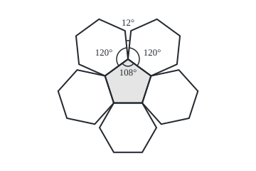

# Polyhedra: vertices minus edges plus faces is two, and what that forbids

Geometry and trig → Circles and Solids → Corners, seams and faces → Polyhedra

---

## General Overview

The classic football (soccer ball) is sewn from 32 panels: 12 pentagons, which have five sides, and 20 hexagons, which have six. Each seam joins two panels; wherever seams meet, three panels touch.

Count the pieces: 60 corners, 90 seams, 32 panels, and 60 − 90 + 32 = 2. A cube gives 8 − 12 + 6 = 2 as well. Leonhard Euler noticed this in 1750 and published it in 1758: for a solid with flat polygon faces that could be pumped up into a ball, as this one is, the count is always 2, whatever the sizes and angles.

A count that cannot change forbids things. Every ball of pentagons and hexagons meeting three at a corner has exactly 12 pentagons, and only five solids are regular: identical regular faces, the same number at every corner, no dents.

**Corners minus edges plus faces is 2 for every solid with polygon faces that could be pumped up into a ball, which forces 12 pentagons onto every ball like this one and allows exactly five regular solids.**

**What kind of fact this is:** a theorem, proved in Why it works for convex solids by reducing it to [planar-graphs-and-eulers-formula](../../04-Combinatorics%20and%20graphs/12-Planarity%20and%20Colouring/01-planar-graphs-and-eulers-formula.md); the twelve pentagons and the five solids follow from it.

### The picture: one pentagon and its five hexagons, laid flat

<p align="center"></p>

Scale: seams 40 units, pentagon centred at (180, 117), hexagons turned in 72° steps about it. At each pentagon corner 108° + 120° + 120° = 348°, leaving a 12° slit; stitched shut, the slits lift the patch into a dome. Three hexagons make 360° and lie flat.

---

## The formula

$V$ counts vertices (corners), $E$ edges (seams, each between two faces) and $F$ faces, as on [planar-graphs-and-eulers-formula](../../04-Combinatorics%20and%20graphs/12-Planarity%20and%20Colouring/01-planar-graphs-and-eulers-formula.md). A **polyhedron** is a solid bounded by flat polygon faces; the football's pattern is one; pumping it up only bulges the panels.

$$V - E + F = 2$$

**Read it aloud:** corners, minus edges, plus faces, is two for any polyhedron that could be pumped up into a ball.

Every edge borders two faces and has two ends, so adding up the sides of all faces counts each edge twice, and so does adding up the edges at all corners. On a regular solid, with $p$ sides on every face and $q$ faces, so $q$ edges, at every corner:

$$pF = 2E, \qquad qV = 2E$$

On the ball, $P$ counts pentagons and $H$ hexagons.

| Symbol | Plain meaning | In our example | Push it up and the answer… |
| --- | --- | --- | --- |
| $V$ | vertices: corners | 60 on the ball | a corner added mid-edge adds an edge: no change |
| $E$ | edges: seams between two faces | 90 | an edge across a face splits it: no change |
| $F$ | faces: flat panels | 32 | a face left off: falls by one |
| $P$ | pentagons on the ball | 12 | cannot move: forced |
| $H$ | hexagons on the ball | 20 | free: no change |
| $p$ | sides per face of a regular solid | 5 on the dodecahedron | from 6 up, nothing closes |
| $q$ | faces (and edges) per corner | 3 on the ball | from 6 up, nothing closes |

### When it holds

- **Closed:** each edge borders two faces. A lidless box reads 8 − 12 + 5 = 1.
- **One piece:** two separate dice read 16 − 24 + 12 = 4.
- **No tunnel:** a square picture frame reads 16 − 32 + 16 = 0.
- **Faces that do not cut through each other:** the star-shaped small stellated dodecahedron reads 12 − 30 + 12 = −6.
- **Plain polygon faces:** stand a small cube on a big one and the big top face becomes a ring; the solid reads 16 − 24 + 11 = 3.

The first four spell out "pumped up into a ball". Convexity (every straight segment between two points of the solid stays inside) guarantees all five.

---

## Why it works

### Step 0: a solid seen through one face is a flat drawing

Look into a cube through its top face as if it were glass: the bottom face shows as a small square inside the top one, the sides as four strips between, and no edge crosses another. That is the drawing [planar-graphs-and-eulers-formula](../../04-Combinatorics%20and%20graphs/12-Planarity%20and%20Colouring/01-planar-graphs-and-eulers-formula.md) counts, with the outside region standing for the glass face. Any convex polyhedron seen this way keeps V, E and F, and that card proves the drawing reads 2. So does the solid.

<details>
<summary>Detailed proof: the view through one face has no crossings</summary>

Put the eye just beyond one face, the window, and on the solid's side of every other face's plane; every sightline to the rest of the surface then enters through the window. A straight line meets a convex solid in one unbroken piece, so it crosses the surface at most twice: in through the window, then out. Each point of the other faces thus has its own sightline, and marking where sightlines pierce the window draws those faces inside it, nothing overlapping. Dented solids without tunnels flatten by stretching instead: euler-characteristic-and-triangulations.

</details>

### Step 1: every edge is counted twice

The panels have 5 × 12 + 6 × 20 = 180 sides. Each seam was counted from both sides, so E = 90. The panels also have 180 corners, and each corner of the ball was counted three times, so V = 60. Slicing the 12 corners off an icosahedron (20 triangles, five at a corner) builds the same ball: each cut leaves a pentagon, each triangle a hexagon.

### Step 2: the twelve pentagons are forced

Split V − E + F among the panels. Three panels share each corner and two share each seam, so a panel carries a third of each of its corners, minus half of each of its seams, plus one for itself. A hexagon carries 6/3 − 6/2 + 1 = 0; a pentagon carries 5/3 − 5/2 + 1 = 1/6. The shares total 2, so there are 2 ÷ 1/6 = 12 pentagons. In symbols, with F = P + H and 2E = 3V = 5P + 6H:

$$V - E + F = \frac{5P + 6H}{3} - \frac{5P + 6H}{2} + P + H = \frac{P}{6} = 2$$

The hexagons cancel, so P = 12 on every such ball.

### Step 3: only five regular solids

A convex solid is **regular** when all its faces are one regular polygon (equal sides, equal angles) with p sides, and q faces meet at every corner; a polygon needs 3 sides and a corner 3 faces. Put pF = 2E and qV = 2E into Euler's count and divide by 2E:

$$\frac{1}{p} + \frac{1}{q} = \frac{1}{2} + \frac{1}{E}$$

E is positive, so one over p plus one over q beats a half. Multiplying by 2pq gives 2p + 2q > pq, or (p − 2)(q − 2) < 4. Both brackets are whole numbers of at least 1, so the product is 1, 2 or 3: five pairs, counted by E = 2pq ÷ (2p + 2q − pq), V = 2E ÷ q and F = 2E ÷ p:

| p, q | Product | Solid | V − E + F |
| --- | --- | --- | --- |
| 3, 3 | 1 | tetrahedron: triangles | 4 − 6 + 4 = 2 |
| 4, 3 | 2 | cube: squares | 8 − 12 + 6 = 2 |
| 3, 4 | 2 | octahedron: triangles | 6 − 12 + 8 = 2 |
| 5, 3 | 3 | dodecahedron: pentagons | 20 − 30 + 12 = 2 |
| 3, 5 | 3 | icosahedron: triangles | 12 − 30 + 20 = 2 |

### Step 4: the same answers from angles

At a corner of a convex solid the face angles add to less than 360°; the shortfall is the corner's **gap**. A regular p-sided face has corners of 180° × (p − 2) ÷ p: cut from one corner, it makes p − 2 triangles ([triangle-angle-sum-and-inequality](../01-Angles%2C%20Triangles%20and%20Congruence/02-triangle-angle-sum-and-inequality.md)). On a regular solid q such corners must fit under 360°, which rearranges to (p − 2)(q − 2) < 4 again: the same five pairs, with no edge counted. Euclid ends the *Elements* this way.

The gaps always total 720°. Each ball corner has a 12° gap, and 60 corners make 720°; so does each regular solid. Every ball corner touches one pentagon, so each pentagon carries 5 × 12° = 60°, and 720° ÷ 60° = 12.

<details>
<summary>The algebra behind the 720°, if you want it</summary>

A face with n sides has angles totalling (n − 2) × 180°. The sides of all the faces total 2E, so all the angles total (2E − 2F) × 180° = (E − F) × 360°. The gaps are V × 360° minus that: (V − E + F) × 360° = 720°. It is Euler's count in degrees, found first by René Descartes.

</details>

---

## Worked numbers, by hand

| Step | Arithmetic | Value |
| --- | --- | --- |
| sides of all panels | 5 × 12 + 6 × 20 | 180 |
| edges, each counted twice | 180 ÷ 2 | 90 |
| corners, each counted three times | 180 ÷ 3 | 60 |
| Euler's count | 60 − 90 + 32 | **2** |
| gap at one corner | 360° − (108° + 120° + 120°) | 12° |
| total gap | 60 × 12° | 720° |
| pentagons, from the gaps | 720° ÷ (5 × 12°) | **12** |

A ball maker can vary the hexagons, never the pentagons.

### What breaks if you drop a piece

| Mistake | Comes out at | What went wrong |
| --- | --- | --- |
| Counting every panel side as a seam | 60 − 180 + 32 = −88 | each seam borders two panels |
| Sewing a ball of 20 hexagons alone | 40 − 60 + 20 = 0 | three hexagons at a corner lie flat |
| Hexagons, three at a corner, as a regular solid | 2p + 2q − pq = 0 | the flat honeycomb never closes |

The code prints all three.

---

## Code, from first principles, and it actually runs

Two roads to every result: the ball from its panels and from the icosahedron; the pentagons from shares, gaps and a search of every count from 0 to 199; the five pairs from the inequality and the angles. Each solid is also placed in space, its edges (closest pairs of corners) and faces (flat sets of corners with the solid on one side) counted from positions alone.

### Python

```python
# Polyhedra and Euler's formula -- the check behind the card.  Standard library only.
# A football of 12 pentagons and 20 hexagons, then the five regular solids, two roads each.
from itertools import combinations, product
from math import cos, sin, radians
def angle(p): return 180 * (p - 2) / p              # one corner of a regular p-sided face
def share(n): return 2 * n - 3 * n + 6               # an n-sided ball panel's part of V - E + F, in sixths
def measure(pts):                                     # road two: p, q, V, E, F from positions
    d = lambda a, b: sum((u - v) ** 2 for u, v in zip(a, b))
    short = min(d(a, b) for a, b in combinations(pts, 2))
    E, faces = sum(abs(d(a, b) - short) < 1e-9 for a, b in combinations(pts, 2)), set()
    for a, b, c in combinations(pts, 3):              # a face: corners on one plane with
        u, w = [b[i] - a[i] for i in range(3)], [c[i] - a[i] for i in range(3)]
        n = [u[1] * w[2] - u[2] * w[1], u[2] * w[0] - u[0] * w[2], u[0] * w[1] - u[1] * w[0]]
        s = [sum(n[i] * (x[i] - a[i]) for i in range(3)) for x in pts]
        if min(s) > -1e-9 or max(s) < 1e-9:           # the whole solid on one side of it
            faces.add(frozenset(k for k, v in enumerate(s) if abs(v) < 1e-9))
    return len(next(iter(faces))), 2 * E // len(pts), len(pts), E, len(faces)
g = (1 + 5 ** 0.5) / 2                                # the golden ratio
def turn(pts): return [t for x, y, z in pts for t in ((x, y, z), (y, z, x), (z, x, y))]
cube = list(product((-1, 1), repeat=3))
seen = {name: measure(pts) for name, pts in [("tetrahedron", [c for c in cube if c[0] * c[1] * c[2] == 1]),
        ("cube", cube), ("octahedron", turn([(s, 0, 0) for s in (-1, 1)])),
        ("dodecahedron", cube + turn([(0, a / g, b * g) for a in (-1, 1) for b in (-1, 1)])),
        ("icosahedron", turn([(0, a, b * g) for a in (-1, 1) for b in (-1, 1)]))]}
P, H = 12, 20                                         # road one for the ball: count sides
sides = 5 * P + 6 * H
V, E, F = sides // 3, sides // 2, P + H               # three panels per corner, two per seam
p, q, Vi, Ei, Fi = seen["icosahedron"]                # road two: slice off its 12 corners
cut, gap = (q * Vi, Ei + q * Vi, Fi + Vi), 360 - angle(5) - 2 * angle(6)
by_shares = (2 * 6 - H * share(6)) // share(5)       # shares total 2: solve for the pentagons
by_count = sorted({a for a in range(200) for b in range(200) for s in [5 * a + 6 * b] if s % 6 == 0 and s // 3 - s // 2 + a + b == 2})
print(f"football by panels: F = {F}, sides {sides}, E = {sides}/2 = {E}, V = {sides}/3 = {V}; V - E + F = {V - E + F}")
print(f"football by slicing the icosahedron's {Vi} corners: V = {cut[0]}, E = {cut[1]}, F = {cut[2]}")
print(f"shares: hexagon 6/3 - 6/2 + 1 = {share(6) // 6}, pentagon 5/3 - 5/2 + 1 = {share(5)}/6, so 2 / ({share(5)}/6) = {by_shares} pentagons")
print(f"one corner: {angle(5):.0f} + {angle(6):.0f} + {angle(6):.0f} = {360 - gap:.0f} degrees, gap {gap:.0f}; {V} corners x {gap:.0f} = {V * gap:.0f}")
print(f"pentagons by angles: 720 / (5 x {gap:.0f}) = {720 / (5 * gap):.0f}; by V - E + F = 2, 0 to 199 of each: {by_count}")
euler = [(p, q) for p in range(3, 101) for q in range(3, 101) if 2 * p + 2 * q - p * q > 0]
corners = [(p, q) for p in range(3, 101) for q in range(3, 101) if q * angle(p) < 360]
formula = sorted((p, q, 4 * p // d, 2 * p * q // d, 4 * q // d) for p, q in euler for d in [2 * p + 2 * q - p * q])
print("solid          p  q   V   E   F  V-E+F  (p-2)(q-2)  gap per corner x V")
for name, (p, q, v, e, f) in seen.items():
    print(f"{name:<13}{p:>3}{q:>3}{v:>4}{e:>4}{f:>4}{v - e + f:>5}{(p - 2) * (q - 2):>9}    {360 - q * angle(p):>9.0f} x {v} = {v * (360 - q * angle(p)):.0f}")
print(f"(p, q) to 100 with 2p + 2q - pq > 0: {euler}; by corners under 360: {'same' if corners == euler else 'differ'}")
print(f"rows above measured from corner positions; E = 2pq/(2p + 2q - pq) agrees: {'yes' if sorted(seen.values()) == formula else 'no'}")
print(f"breaks: seams not halved {V} - {sides} + {F} = {V - sides + F}; 20 hexagons alone {6 * 20 // 3} - {6 * 20 // 2}"
      f" + 20 = {6 * 20 // 3 - 6 * 20 // 2 + 20}; p = 6, q = 3: 2p + 2q - pq = {2 * 6 + 2 * 3 - 6 * 3}")
for group in ([("open box", 8, 12, 5), ("two open boxes", 16, 24, 10), ("two dice", 16, 24, 12)],
              [("picture frame", 16, 32, 16), ("cube on a cube", 16, 24, 11), ("small stellated dodecahedron", 12, 30, 12)]):
    print("conditions: " + "; ".join(f"{n} {v} - {e} + {f} = {v - e + f}" for n, v, e, f in group))
R = 20 / sin(radians(36)); c = R * cos(radians(36)) + 20 * 3 ** 0.5    # figure: seam 40 units
pent = [(R * cos(radians(90 + 72 * k)), R * sin(radians(90 + 72 * k))) for k in range(5)]
hexa = [(c * cos(radians(54)) + 40 * cos(radians(204 + 60 * k)),       # the hexagon on the
         c * sin(radians(54)) + 40 * sin(radians(204 + 60 * k))) for k in range(6)]  # top-right seam
for label, pts in (("seam 40, centre 180,117, pentagon", pent), ("top-right hexagon, turn by 72 for the rest", hexa)):
    print(f"figure, {label} " + " ".join(f"{180 + x:.2f},{117 - y:.2f}" for x, y in pts))
assert euler == corners and len(euler) == 5                    # two reasons, the same five pairs
assert sorted(seen.values()) == formula                        # corner positions against the formula
assert (V, E, F) == cut                                        # the ball two ways
assert by_count == [round(720 / (5 * gap))] == [by_shares]     # twelve pentagons three ways
print("ALL CHECKS PASS")
```

**Ran 2026-09-24 on macOS, Python 3.14.6, standard library only. All checks passed. Output, pasted from the run:**

```
football by panels: F = 32, sides 180, E = 180/2 = 90, V = 180/3 = 60; V - E + F = 2
football by slicing the icosahedron's 12 corners: V = 60, E = 90, F = 32
shares: hexagon 6/3 - 6/2 + 1 = 0, pentagon 5/3 - 5/2 + 1 = 1/6, so 2 / (1/6) = 12 pentagons
one corner: 108 + 120 + 120 = 348 degrees, gap 12; 60 corners x 12 = 720
pentagons by angles: 720 / (5 x 12) = 12; by V - E + F = 2, 0 to 199 of each: [12]
solid          p  q   V   E   F  V-E+F  (p-2)(q-2)  gap per corner x V
tetrahedron    3  3   4   6   4    2        1          180 x 4 = 720
cube           4  3   8  12   6    2        2           90 x 8 = 720
octahedron     3  4   6  12   8    2        2          120 x 6 = 720
dodecahedron   5  3  20  30  12    2        3           36 x 20 = 720
icosahedron    3  5  12  30  20    2        3           60 x 12 = 720
(p, q) to 100 with 2p + 2q - pq > 0: [(3, 3), (3, 4), (3, 5), (4, 3), (5, 3)]; by corners under 360: same
rows above measured from corner positions; E = 2pq/(2p + 2q - pq) agrees: yes
breaks: seams not halved 60 - 180 + 32 = -88; 20 hexagons alone 40 - 60 + 20 = 0; p = 6, q = 3: 2p + 2q - pq = 0
conditions: open box 8 - 12 + 5 = 1; two open boxes 16 - 24 + 10 = 2; two dice 16 - 24 + 12 = 4
conditions: picture frame 16 - 32 + 16 = 0; cube on a cube 16 - 24 + 11 = 3; small stellated dodecahedron 12 - 30 + 12 = -6
figure, seam 40, centre 180,117, pentagon 180.00,82.97 147.64,106.49 160.00,144.53 200.00,144.53 212.36,106.49
figure, top-right hexagon, turn by 72 for the rest 180.00,82.97 212.36,106.49 248.90,90.22 253.08,50.44 220.72,26.92 184.18,43.19
ALL CHECKS PASS
```

### Rust

Same numbers, same labels, built with `rustc --edition 2021 -O`.

```rust
// Polyhedra and Euler's formula -- the same check as the Python, in Rust.  No crates.
// A football of 12 pentagons and 20 hexagons, then the five regular solids, two roads each.
use std::collections::BTreeSet;
type Row = (i64, i64, i64, i64, i64);
fn angle(p: i64) -> f64 { 180.0 * (p - 2) as f64 / p as f64 }   // one corner of a regular p-sided face
fn share(n: i64) -> i64 { 2 * n - 3 * n + 6 }                     // an n-sided ball panel's part of V - E + F, in sixths
fn measure(pts: &[[f64; 3]]) -> Row {                          // road two: p, q, V, E, F from positions
    let n = pts.len();
    let d = |a: [f64; 3], b: [f64; 3]| (0..3).map(|i| (a[i] - b[i]).powi(2)).sum::<f64>();
    let pairs: Vec<(usize, usize)> = (0..n).flat_map(|a| (a + 1..n).map(move |b| (a, b))).collect();
    let short = pairs.iter().map(|&(a, b)| d(pts[a], pts[b])).fold(f64::MAX, f64::min);
    let e = pairs.iter().filter(|&&(a, b)| (d(pts[a], pts[b]) - short).abs() < 1e-9).count() as i64;
    let mut faces: BTreeSet<Vec<usize>> = BTreeSet::new();
    for a in 0..n { for b in a + 1..n { for c in b + 1..n {     // a face: corners on a plane, all the solid to one side
        let (u, w): (Vec<f64>, Vec<f64>) = (0..3).map(|i| (pts[b][i] - pts[a][i], pts[c][i] - pts[a][i])).unzip();
        let nv = [u[1] * w[2] - u[2] * w[1], u[2] * w[0] - u[0] * w[2], u[0] * w[1] - u[1] * w[0]];
        let s: Vec<f64> = pts.iter().map(|x| (0..3).map(|i| nv[i] * (x[i] - pts[a][i])).sum()).collect();
        let (lo, hi) = s.iter().fold((f64::MAX, f64::MIN), |(l, h), &v| (l.min(v), h.max(v)));
        if lo > -1e-9 || hi < 1e-9 { faces.insert((0..n).filter(|&k| s[k].abs() < 1e-9).collect()); }
    }}}
    (faces.iter().next().unwrap().len() as i64, 2 * e / n as i64, n as i64, e, faces.len() as i64)
}
fn main() {
    let g = (1.0 + 5f64.sqrt()) / 2.0;                               // the golden ratio
    let turn = |pts: Vec<[f64; 3]>| -> Vec<[f64; 3]> { pts.iter().flat_map(|&[x, y, z]| [[x, y, z], [y, z, x], [z, x, y]]).collect() };
    let pm = [-1.0, 1.0];
    let cube: Vec<[f64; 3]> = (0..8).map(|i| [pm[i >> 2 & 1], pm[i >> 1 & 1], pm[i & 1]]).collect();
    let signs: Vec<(f64, f64)> = (0..4).map(|i| (pm[i >> 1], pm[i & 1])).collect();
    let dodeca: Vec<[f64; 3]> = cube.iter().copied().chain(turn(signs.iter().map(|&(a, b)| [0.0, a / g, b * g]).collect())).collect();
    let solids: [(&str, Vec<[f64; 3]>); 5] = [("tetrahedron", cube.iter().filter(|c| c[0] * c[1] * c[2] == 1.0).copied().collect()),
        ("cube", cube.clone()), ("octahedron", turn(pm.iter().map(|&s| [s, 0.0, 0.0]).collect())), ("dodecahedron", dodeca),
        ("icosahedron", turn(signs.iter().map(|&(a, b)| [0.0, a, b * g]).collect()))];
    let seen: Vec<(&str, Row)> = solids.iter().map(|(name, pts)| (*name, measure(pts))).collect();
    let (pn, hn) = (12i64, 20i64);                                   // road one for the ball: count sides
    let sides = 5 * pn + 6 * hn;
    let (v, e, f) = (sides / 3, sides / 2, pn + hn);                 // three panels per corner, two per seam
    let (_, q, vi, ei, fi) = seen[4].1;                              // road two: slice off its 12 corners
    let (cut, gap) = ((q * vi, ei + q * vi, fi + vi), 360.0 - angle(5) - 2.0 * angle(6));
    let by_shares = (2 * 6 - hn * share(6)) / share(5);              // shares total 2: solve for the pentagons
    let by_count: Vec<i64> = (0..200i64).filter(|&a| (0..200i64).any(|b| { let s = 5 * a + 6 * b;
        s % 6 == 0 && s / 3 - s / 2 + a + b == 2 })).collect();
    println!("football by panels: F = {}, sides {}, E = {}/2 = {}, V = {}/3 = {}; V - E + F = {}", f, sides, sides, e, sides, v, v - e + f);
    println!("football by slicing the icosahedron's {} corners: V = {}, E = {}, F = {}", vi, cut.0, cut.1, cut.2);
    println!("shares: hexagon 6/3 - 6/2 + 1 = {}, pentagon 5/3 - 5/2 + 1 = {}/6, so 2 / ({}/6) = {} pentagons", share(6) / 6, share(5), share(5), by_shares);
    println!("one corner: {:.0} + {:.0} + {:.0} = {:.0} degrees, gap {:.0}; {} corners x {:.0} = {:.0}",
             angle(5), angle(6), angle(6), 360.0 - gap, gap, v, gap, v as f64 * gap);
    println!("pentagons by angles: 720 / (5 x {:.0}) = {:.0}; by V - E + F = 2, 0 to 199 of each: {:?}", gap, 720.0 / (5.0 * gap), by_count);
    let pq: Vec<(i64, i64)> = (3..101i64).flat_map(|p| (3..101i64).map(move |q| (p, q))).collect();
    let euler: Vec<(i64, i64)> = pq.iter().copied().filter(|&(p, q)| 2 * p + 2 * q - p * q > 0).collect();
    let corners: Vec<(i64, i64)> = pq.iter().copied().filter(|&(p, q)| q as f64 * angle(p) < 360.0).collect();
    let mut formula: Vec<Row> = euler.iter().map(|&(p, q)| { let d = 2 * p + 2 * q - p * q; (p, q, 4 * p / d, 2 * p * q / d, 4 * q / d) }).collect();
    let mut measured: Vec<Row> = seen.iter().map(|s| s.1).collect();
    formula.sort(); measured.sort();
    println!("solid          p  q   V   E   F  V-E+F  (p-2)(q-2)  gap per corner x V");
    for (name, (p, q, v, e, f)) in &seen {
        let per = 360.0 - *q as f64 * angle(*p);
        println!("{:<13}{:>3}{:>3}{:>4}{:>4}{:>4}{:>5}{:>9}    {:>9.0} x {} = {:.0}", name, p, q, v, e, f, v - e + f, (p - 2) * (q - 2), per, v, *v as f64 * per);
    }
    println!("(p, q) to 100 with 2p + 2q - pq > 0: {:?}; by corners under 360: {}", euler, if corners == euler { "same" } else { "differ" });
    println!("rows above measured from corner positions; E = 2pq/(2p + 2q - pq) agrees: {}", if measured == formula { "yes" } else { "no" });
    println!("breaks: seams not halved {} - {} + {} = {}; 20 hexagons alone {} - {} + 20 = {}; p = 6, q = 3: 2p + 2q - pq = {}",
             v, sides, f, v - sides + f, 6 * 20 / 3, 6 * 20 / 2, 6 * 20 / 3 - 6 * 20 / 2 + 20, 2 * 6 + 2 * 3 - 6 * 3);
    for group in [vec![("open box", 8, 12, 5), ("two open boxes", 16, 24, 10), ("two dice", 16, 24, 12)],
                  vec![("picture frame", 16, 32, 16), ("cube on a cube", 16, 24, 11), ("small stellated dodecahedron", 12, 30, 12)]] {
        println!("conditions: {}", group.iter().map(|(n, v, e, f)| format!("{} {} - {} + {} = {}", n, v, e, f, v - e + f)).collect::<Vec<_>>().join("; "));
    }
    let r = 20.0 / 36f64.to_radians().sin();                         // figure: seam 40 units
    let c = r * 36f64.to_radians().cos() + 20.0 * 3f64.sqrt();
    let pent: Vec<(f64, f64)> = (0..5).map(|k| { let t = (90.0 + 72.0 * k as f64).to_radians(); (r * t.cos(), r * t.sin()) }).collect();
    let (cx, cy) = (c * 54f64.to_radians().cos(), c * 54f64.to_radians().sin());   // the hexagon on the top-right seam
    let hexa: Vec<(f64, f64)> = (0..6).map(|k| { let t = (204.0 + 60.0 * k as f64).to_radians(); (cx + 40.0 * t.cos(), cy + 40.0 * t.sin()) }).collect();
    for (label, pts) in [("seam 40, centre 180,117, pentagon", &pent), ("top-right hexagon, turn by 72 for the rest", &hexa)] {
        println!("figure, {} {}", label, pts.iter().map(|(x, y)| format!("{:.2},{:.2}", 180.0 + x, 117.0 - y)).collect::<Vec<_>>().join(" "));
    }
    assert!(euler == corners && euler.len() == 5);                  // two reasons, the same five pairs
    assert!(measured == formula);                                    // corner positions against the formula
    assert!((v, e, f) == cut);                                       // the ball two ways
    assert!(by_count == vec![(720.0 / (5.0 * gap)).round() as i64] && by_count == vec![by_shares]);  // twelve pentagons three ways
    println!("ALL CHECKS PASS");
}
```

**Ran 2026-09-24 on macOS, rustc 1.98.1, no crates. All checks passed. Output, pasted from the run:**

```
football by panels: F = 32, sides 180, E = 180/2 = 90, V = 180/3 = 60; V - E + F = 2
football by slicing the icosahedron's 12 corners: V = 60, E = 90, F = 32
shares: hexagon 6/3 - 6/2 + 1 = 0, pentagon 5/3 - 5/2 + 1 = 1/6, so 2 / (1/6) = 12 pentagons
one corner: 108 + 120 + 120 = 348 degrees, gap 12; 60 corners x 12 = 720
pentagons by angles: 720 / (5 x 12) = 12; by V - E + F = 2, 0 to 199 of each: [12]
solid          p  q   V   E   F  V-E+F  (p-2)(q-2)  gap per corner x V
tetrahedron    3  3   4   6   4    2        1          180 x 4 = 720
cube           4  3   8  12   6    2        2           90 x 8 = 720
octahedron     3  4   6  12   8    2        2          120 x 6 = 720
dodecahedron   5  3  20  30  12    2        3           36 x 20 = 720
icosahedron    3  5  12  30  20    2        3           60 x 12 = 720
(p, q) to 100 with 2p + 2q - pq > 0: [(3, 3), (3, 4), (3, 5), (4, 3), (5, 3)]; by corners under 360: same
rows above measured from corner positions; E = 2pq/(2p + 2q - pq) agrees: yes
breaks: seams not halved 60 - 180 + 32 = -88; 20 hexagons alone 40 - 60 + 20 = 0; p = 6, q = 3: 2p + 2q - pq = 0
conditions: open box 8 - 12 + 5 = 1; two open boxes 16 - 24 + 10 = 2; two dice 16 - 24 + 12 = 4
conditions: picture frame 16 - 32 + 16 = 0; cube on a cube 16 - 24 + 11 = 3; small stellated dodecahedron 12 - 30 + 12 = -6
figure, seam 40, centre 180,117, pentagon 180.00,82.97 147.64,106.49 160.00,144.53 200.00,144.53 212.36,106.49
figure, top-right hexagon, turn by 72 for the rest 180.00,82.97 212.36,106.49 248.90,90.22 253.08,50.44 220.72,26.92 184.18,43.19
ALL CHECKS PASS
```

The two outputs match line for line.

> [!TIP]
> **Try changing**
> Guess first, then run the Python; each assert compares two roads.
> - **More hexagons.** Set `P, H = 12, 30`: 80 − 120 + 42 is still 2, but the icosahedron road still says 60, 90, 32; the third assert stops it.
> - **Allow a flat corner.** Change `q * angle(p) < 360` to `q * angle(p) <= 360`: the flat floors (3, 6), (4, 4) and (6, 3) join, and the first assert stops it.
> - **Forget to halve.** Change `sides // 2` to `sides`. The ball reads −88, and the third assert stops it.

---

## The usual mistake

> [!warning]
> **Counting per panel instead of per solid.** Each seam belongs to two panels and each corner to three; skip the halving and the ball reads 60 − 180 + 32 = −88, not 2.
>
> - **Taking 2 as universal.** A picture frame reads 0.
> - **Reading 2 as a certificate.** Two lidless boxes read 16 − 24 + 10 = 2.
> - **Dropping convexity from "only five".** Star-shaped regular solids exist; the small stellated dodecahedron reads −6.

---

## Where you meet it in real life

- **Carbon cages.** Buckminsterfullerene, reported in 1985, puts 60 carbon atoms at the football's corners. Every closed cage of five- and six-atom rings, three bonds per atom, has 12 five-atom rings.
- **Geodesic spheres and virus shells.** A closed shell of triangles meeting five or six at a point has exactly 12 five-way points: Step 2 with corners and faces swapped.

> **Say it back**
> Corners minus edges plus faces is 2 for a polyhedron that could be pumped up into a ball; seen through one face, a convex one is a flat drawing that reads 2. On a ball of pentagons and hexagons, three at a corner, a hexagon carries none of the total and a pentagon a sixth: 12 pentagons. On a regular solid the count forces (p − 2)(q − 2) below 4: five solids. Corner gaps totalling 720° give both results again.

---

## What this builds on

- [prisms-and-cylinders](04-prisms-and-cylinders.md): solids with flat faces, and the words face, edge and corner.
- [planar-graphs-and-eulers-formula](../../04-Combinatorics%20and%20graphs/12-Planarity%20and%20Colouring/01-planar-graphs-and-eulers-formula.md): the proof, borrowed in Step 0, that a crossing-free drawing in one piece reads 2.

## Where this goes next

- euler-characteristic-and-triangulations: the count on any surface; each tunnel lowers it by 2.
- gauss-bonnet-theorem: the 720° of gaps, spread over a curved surface as curvature.

Left open: why no way of cutting a surface into faces changes its count, which euler-characteristic-and-triangulations settles.

---

## Sources

Verified 24 Sep 2026: every link below resolves to the publisher's page.

- Euler, Leonhard. "Elementa doctrinae solidorum." *Novi Commentarii academiae scientiarum Petropolitanae* 4 (1758): 109–140. [Euler Archive, E230](https://scholarlycommons.pacific.edu/euler-works/230/). The first published statement of the count.
- Levin, Oscar. *Discrete Mathematics: An Open Introduction*, 3rd ed., section 4.3, "Planar Graphs." [Open textbook](https://discrete.openmathbooks.org/dmoi3/sec_planar.html). Theorem 4.3.4 counts the regular polyhedra.
- Richeson, David S. *Euler's Gem: The Polyhedron Formula and the Birth of Topology*. Princeton University Press, paperback 2019. [Publisher page](https://press.princeton.edu/books/paperback/9780691191379/eulers-gem). The formula's history, soccer balls included.
- Kroto, H. W., and others. "C60: Buckminsterfullerene." *Nature* 318 (1985): 162–163. [doi:10.1038/318162a0](https://doi.org/10.1038/318162a0). The football-shaped carbon molecule.
