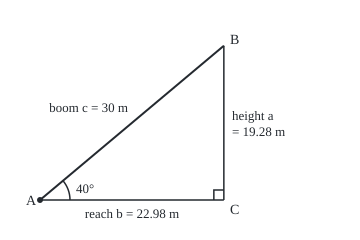
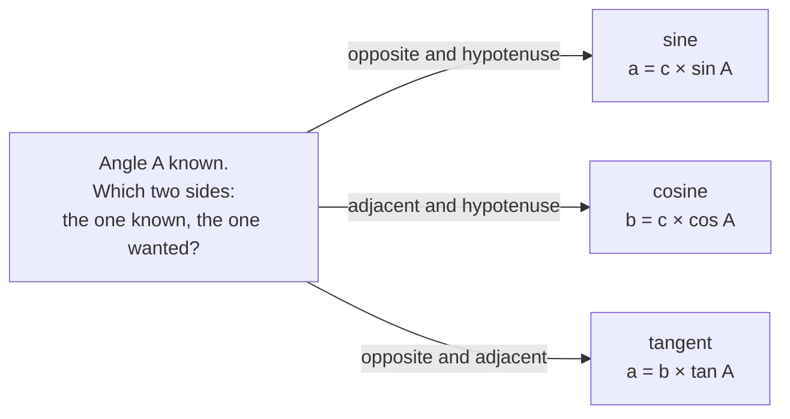

# Sine, cosine and tangent: three ratios that turn an angle into lengths

[Syllabus](../../../SYLLABUS.md) → [Geometry and trig](../../../SYLLABUS.md#w05) → [Trigonometry](../../../SYLLABUS.md#w05-s03) → Sine, cosine and tangent

---

## General Overview

A mobile crane's boom is 30 m long, raised to 40° above level, and the hook hangs straight down from its tip. Two lengths decide the lift: how far out the hook hangs, the **reach**, and how high the tip stands above the boom's pivot, the **height**.

Boom, hook line and the level line through the pivot form a right triangle, since a hanging line meets the level at 90°. Fix the boom's angle and the triangle's shape is fixed; only its size can change. So at 40° the reach is always 0.7660 of the boom and the height 0.6428 of it: the **cosine** and the **sine** of 40°. Height over reach, 0.8391, is the **tangent**. The 30 m boom reaches 22.98 m out, its tip 19.28 m up.

**One acute angle fixes a right triangle's shape, so each ratio of two sides belongs to the angle alone; sine, cosine and tangent name three of them, and one known side, multiplied or divided by the right one, gives the others.**

**What kind of fact this is:** a definition, resting on a theorem proved in Why it works: the ratios depend on the angle alone. Solving a triangle with them is a method.

### The picture: the boom as a right triangle

<p align="center"></p>

Drawn to scale, 1 m = 8 units. The boom runs from pivot A to tip B, the hook line from B down to the right angle at C. Each side takes the small letter of the corner it faces.

---

## The formula

Seen from the corner A, the **hypotenuse** c faces the right angle (the boom), the **opposite** side a faces A (the height), and the **adjacent** side b touches A without being the hypotenuse (the reach). "sin A", read "the sine of A", names one number fixed by the angle, not sin times A; cos A and tan A read the same way.

$$\sin A = \frac{a}{c}, \qquad \cos A = \frac{b}{c}, \qquad \tan A = \frac{a}{b}$$

**Read it aloud:** sine is opposite over hypotenuse, cosine adjacent over hypotenuse, tangent opposite over adjacent: SOH-CAH-TOA, one initial per word.

Multiplied by the boom, they answer the crane:

$$a = c \times \sin A = 30 \times 0.6428 = 19.28 \text{ m}, \qquad b = c \times \cos A = 30 \times 0.7660 = 22.98 \text{ m}$$

**Read it aloud:** height is boom times sine; reach is boom times cosine.

| Symbol | Plain meaning | In our example | Push it up and the answer… |
| --- | --- | --- | --- |
| $A$ | angle at the pivot, boom to level | 40° | tip rises, reach shrinks |
| $B$ | angle at the tip, boom to hook line | 50°: the angles total 180° | the reverse of A |
| $C$ | the right angle, hook line to level | 90° | fixed: the ratios need it |
| $a$ | side facing A: the height, **opposite** | 19.28 m | — |
| $b$ | side facing B: the reach, **adjacent** | 22.98 m | — |
| $c$ | side facing C: the boom, **hypotenuse** | 30 m | all sides grow; no ratio moves |
| $\sin A$, $\cos A$, $\tan A$ | ratios of sides: pure numbers, no unit | 0.6428, 0.7660, 0.8391 | move only when A does |

Tangent is sine over cosine: (a ÷ c) ÷ (b ÷ c) = a ÷ b.

### When it holds

As definitions, the ratios hold in every right triangle. The crane needs:

- **A true right angle at C, and A measured from level.** The hook hangs plumb and the reach is level. Read against a tilted deck, the angle is wrong and so is every length; cranes are levelled before a lift.
- **An angle strictly between 0° and 90°.** At either end the triangle collapses into a line; there and beyond, the ratios need [The unit circle](02-radians-and-the-unit-circle.md).
- **A straight boom, heights from the pivot.** The triangle uses the straight line from pivot to tip; height above the ground adds the pivot's own.

---

## Why it works

### Step 0: one angle fixes the shape

The right angle is one angle and A a second; the three total 180°, so B is forced: 50° ([Triangles](../01-Angles%2C%20Triangles%20and%20Congruence/02-triangle-angle-sum-and-inequality.md)). Two triangles with equal angles are **similar**: one is a scaled copy of the other ([Similar triangles](../01-Angles%2C%20Triangles%20and%20Congruence/04-similar-triangles-and-scale.md)). Size is the only freedom left.

### Step 1: the scale cancels, so each ratio belongs to the angle

Take two right triangles with a 40° angle. By Step 0 they are similar, so each side of one is the same number times its match in the other. Divide one side by another and that number cancels. So in every such triangle the side opposite 40° is 0.6428 of the hypotenuse, at any size. "The sine of 40°" is one number, tabulated once for every crane, ramp and roof at 40°.

### Step 2: from the other corner, the legs swap

From the tip B the legs swap: the reach b is opposite B, the height a adjacent. So the sine of B is b ÷ c, the cosine of A. Since B is 90° − A, the cosine of an angle is the sine of its **complement**, the angle making it up to 90°; Edmund Gunter suggested *co-sinus* in 1620. The sine of 50° is 0.7660, and its tangent 1.1918.

### Step 3: pick the ratio that holds the known side and the wanted side

Given the angle and one side, choose the ratio holding the side known and the side wanted. Wanted side on top: multiply by the ratio. On the bottom: divide by it.

### The picture: which ratio



The crane knew the boom, c: sine gives the height, cosine the reach.

### Step 4: reading a table or a calculator

Three angles take exact values from simple figures. Halve an equilateral triangle of side 2: angles of 30° and 60°, short side 1, hypotenuse 2, so the sine of 30° is exactly 0.5. By Pythagoras ([Pythagoras](../01-Angles%2C%20Triangles%20and%20Congruence/05-pythagoras-and-its-converse.md)) the long side is √3, so the cosine of 30° is √3 ÷ 2, or 0.8660. Halve a square of side 1 along its diagonal, √2 long: the sine and cosine of 45° are both 1 ÷ √2, or 0.7071.

Raise a boom of fixed length and its tip climbs and comes in: from 0° to 90°, sine rises from 0 toward 1, cosine falls from 1 toward 0, and tangent passes 1 at 45° and grows without bound. So 40°, between 30° and 45°, must have a sine between 0.5 and 0.7071; the table's 0.6428 passes. A four-figure table is off by at most 0.00005, moving the height by at most 0.0015 m.

No simple figure gives 40° exactly. Ptolemy built his second-century table by halving angles that regular polygons give; the code's second road halves too.

---

## Worked numbers, by hand

The 30 m boom at 40°, with a four-figure table.

| Step | Arithmetic | Value |
| --- | --- | --- |
| angle at the tip | 180° − 90° − 40° | 50° |
| sine of 40° | table; between 0.5 and 0.7071, so plausible | 0.6428 |
| height a | 30 × 0.6428 | **19.28 m** |
| cosine of 40° | table; the same as the sine of 50° | 0.7660 |
| reach b | 30 × 0.7660 | **22.98 m** |

The hook hangs 22.98 m out, under a tip 19.28 m up.

### A second case: a telescopic boom

A load must land 20 m out, the boom held at 40°. The boom telescopes, sliding out in sections: how long must it be, and how high is the tip? The known side is now the reach, b.

| Step | Arithmetic | Value |
| --- | --- | --- |
| boom: cosine holds b and c, c on its bottom, so divide | 20 ÷ 0.7660 | **26.11 m** |
| height: tangent holds a and b, a on its top, so multiply | 20 × 0.8391 | **16.78 m** |
| cross-check: shrink the 30 m triangle to a 20 m reach | 19.28 × 20 ÷ 22.98 | 16.78 m |

### What breaks if you drop a piece

| Mistake | Comes out at | What went wrong |
| --- | --- | --- |
| Sine for the reach | 19.28 m, not 22.98 m | The reach is adjacent, not opposite |
| Boom times tangent for the height | 25.17 m, not 19.28 m | Tangent's bottom is the reach |
| Calculator set to radians | 22.35 m, not 19.28 m | 40 radians is 2,291.83°; its sine is 0.7451 |
| 20 × cosine of 40° for the telescopic boom | 15.32 m, not 26.11 m | The wanted side is on the bottom: divide |

The code prints all four.

---

## Code, from first principles, and it actually runs

Nothing is imported; a built-in sine would already hold the answer. Each road finds the tip of a one-unit boom at 40°, a point on a circle of radius 1; its height and reach are the sine and cosine. Road one takes the degree at its word, an angle being the fraction of a turn its arc covers. It walks up the circle in 400,000 straight steps and stops at 40/45 of the walk to the 45° point. Road two shares no arithmetic with it: it halves angles. A **chord**, the straight line joining two points of the circle, has its midpoint on the line halving their angle, since the two halves are congruent ([Congruent triangles](../01-Angles%2C%20Triangles%20and%20Congruence/03-congruent-triangles.md)). Pushed out to radius 1, that midpoint lands on the circle. Sixty halvings from 0° and 90°, each keeping the half that holds 40°, close in far below a billionth of a degree. Four asserts: the roads agree on sine and on cosine, road one gives 0.5 at 30°, and the telescopic boom comes out the same by the ratios as by shrinking the crane.

### Python

```python
# Sine, cosine and tangent -- the check behind the card.  Nothing is imported.
# A 30 m crane boom at 40 degrees: how far out and how high is its tip?
# Road one measures the angle as a fraction of a turn: walk up a circle of
# radius 1 in tiny straight steps until the distance walked is 40/45 of the
# walk to the 45-degree point.  Road two halves angles: a chord's midpoint,
# pushed out to radius 1, halves its angle; 60 halvings from 0 and 90 close in.
BOOM, ANGLE, OUT = 30.0, 40.0, 20.0     # boom (m), boom angle (deg), second case reach (m)
TOP, STEPS = 0.5 ** 0.5, 400000         # the 45-degree point sits at height 1/sqrt(2)

def walk(target=None):                  # road one: climb from (1, 0) by equal rises
    s, x, y = 0.0, 1.0, 0.0
    for i in range(1, STEPS + 1):
        y2 = TOP * i / STEPS
        x2 = (1 - y2 * y2) ** 0.5       # Pythagoras keeps every point on the circle
        step = ((x - x2) ** 2 + (y2 - y) ** 2) ** 0.5
        if target is not None and s + step >= target:
            f = (target - s) / step     # stop part-way through the last step
            return x + f * (x2 - x), y + f * (y2 - y)
        s, x, y = s + step, x2, y2
    return s                            # no target: the whole walk to 45 degrees

EIGHTH = walk()                         # the arc to 45 degrees, an eighth of a turn
def point(deg): return walk(deg / 45 * EIGHTH)   # (cos, sin) of deg, for deg up to 45
(cA, sA), (c30, s30) = point(ANGLE), point(30.0)
lo, hi, p, q = 0.0, 90.0, (1.0, 0.0), (0.0, 1.0)   # road two: the points at 0 and 90 deg
for _ in range(60):                     # halve 60 times, keeping the half that holds 40
    mx, my = (p[0] + q[0]) / 2, (p[1] + q[1]) / 2   # chord midpoint, on the halving line
    r, mid = (mx * mx + my * my) ** 0.5, (lo + hi) / 2
    if mid < ANGLE: p, lo = (mx / r, my / r), mid  # pushed out to radius 1
    else: q, hi = (mx / r, my / r), mid
(cB, sB) = p
reach, height = BOOM * cA, BOOM * sA
boom2, tip2 = OUT / cB, OUT * sB / cB   # second case: tip 20 m out, boom extended
rad = 180 / (4 * EIGHTH)                # one radian, the angle whose arc equals the radius
left = 40 * rad - 6 * 360               # 40 rad is six full turns and this much more
wrong = point(left - 90)[0]             # a quarter turn lifts a point's reach to its height
print(f"angles: A = {ANGLE:.0f}, C = 90, so B = 180 - 90 - {ANGLE:.0f} = {90 - ANGLE:.0f} deg")
print(f"walk to 45 deg: {EIGHTH:.6f}; one radian = {rad:.4f} deg")
print(f"road 1, arc 40/360 of a turn: sin 40 = {sA:.6f}, cos 40 = {cA:.6f}, tan 40 = {sA / cA:.6f}")
print(f"road 2, 60 halvings from 0 and 90 deg: sin 40 = {sB:.6f}, cos 40 = {cB:.6f}, tan 40 = {sB / cB:.6f}")
print(f"reach b = {BOOM:.0f} cos 40 = {reach:.6f} m; height a = {BOOM:.0f} sin 40 = {height:.6f} m")
for d, co, si in ((30, c30, s30), (40, cA, sA), (45, TOP, TOP), (50, sA, cA), (60, s30, c30)):  # 50, 60 by the complement rule
    print(f"table {d} deg: sin {si:.4f}  cos {co:.4f}  tan {si / co:.4f}")
print(f"from the table: 30 x 0.6428 = {30 * 0.6428:.4f} m against {height:.4f} m; "
      f"rounding moves it at most 30 x 0.00005 = {30 * 0.00005:.4f} m")
print(f"second case, tip {OUT:.0f} m out: boom 20 / cos 40 = {boom2:.6f} m, height 20 tan 40 = {tip2:.6f} m")
print(f"second case by scaling the first: height {height * OUT / reach:.6f} m, boom {BOOM * OUT / reach:.6f} m")
print(f"mistake, sine for the reach: {BOOM * sA:.2f} m, not {reach:.2f} m")
print(f"mistake, tangent times the boom: {BOOM * sA / cA:.2f} m, not {height:.2f} m")
print(f"mistake, radian mode: 40 rad = {40 * rad:.2f} deg = 6 turns + {left:.2f} deg, "
      f"sin = {wrong:.4f}, height {BOOM * wrong:.2f} m")
print(f"mistake, 20 x cos 40 for the boom: {OUT * cA:.2f} m, not {boom2:.2f} m")
print(f"figure, 1 m = 8 units: pivot (40,200), tip ({40 + 8 * reach:.2f},{200 - 8 * height:.2f}), "
      f"foot ({40 + 8 * reach:.2f},200), arc end ({40 + 30 * cA:.2f},{200 - 30 * sA:.2f})")
assert abs(sA - sB) < 1e-9                  # two roads to sin 40
assert abs(cA - cB) < 1e-9                  # two roads to cos 40
assert abs(s30 - 0.5) < 1e-9                # road one against half an equilateral triangle
assert max(abs(BOOM * OUT / reach - boom2), abs(height * OUT / reach - tip2)) < 1e-9  # scaling vs ratios
print("ALL CHECKS PASS")
```

**Ran 2026-09-24 on macOS, Python 3.14.6, standard library only. All checks passed. Output, pasted from the run:**

```
angles: A = 40, C = 90, so B = 180 - 90 - 40 = 50 deg
walk to 45 deg: 0.785398; one radian = 57.2958 deg
road 1, arc 40/360 of a turn: sin 40 = 0.642788, cos 40 = 0.766044, tan 40 = 0.839100
road 2, 60 halvings from 0 and 90 deg: sin 40 = 0.642788, cos 40 = 0.766044, tan 40 = 0.839100
reach b = 30 cos 40 = 22.981333 m; height a = 30 sin 40 = 19.283628 m
table 30 deg: sin 0.5000  cos 0.8660  tan 0.5774
table 40 deg: sin 0.6428  cos 0.7660  tan 0.8391
table 45 deg: sin 0.7071  cos 0.7071  tan 1.0000
table 50 deg: sin 0.7660  cos 0.6428  tan 1.1918
table 60 deg: sin 0.8660  cos 0.5000  tan 1.7321
from the table: 30 x 0.6428 = 19.2840 m against 19.2836 m; rounding moves it at most 30 x 0.00005 = 0.0015 m
second case, tip 20 m out: boom 20 / cos 40 = 26.108146 m, height 20 tan 40 = 16.781993 m
second case by scaling the first: height 16.781993 m, boom 26.108146 m
mistake, sine for the reach: 19.28 m, not 22.98 m
mistake, tangent times the boom: 25.17 m, not 19.28 m
mistake, radian mode: 40 rad = 2291.83 deg = 6 turns + 131.83 deg, sin = 0.7451, height 22.35 m
mistake, 20 x cos 40 for the boom: 15.32 m, not 26.11 m
figure, 1 m = 8 units: pivot (40,200), tip (223.85,45.73), foot (223.85,200), arc end (62.98,180.72)
ALL CHECKS PASS
```

### Rust

```rust
// Sine, cosine and tangent -- the same check as the Python, in Rust.  No crates.
// A 30 m crane boom at 40 degrees: how far out and how high is its tip?
// Road one measures the angle as a fraction of a turn: walk up a circle of
// radius 1 in tiny straight steps until the distance walked is 40/45 of the
// walk to the 45-degree point.  Road two halves angles: a chord's midpoint,
// pushed out to radius 1, halves its angle; 60 halvings from 0 and 90 close in.
const BOOM: f64 = 30.0; // boom (m)
const ANGLE: f64 = 40.0; // boom angle (deg)
const OUT: f64 = 20.0; // second case reach (m)
const STEPS: usize = 400000;

// road one: climb from (1, 0) by equal rises; stop once the walk reaches target
// (returns the point), or walk the whole way to 45 degrees (returns the distance)
fn walk(target: Option<f64>) -> (f64, f64, f64) {
    let top = 0.5_f64.sqrt(); // the 45-degree point sits at height 1/sqrt(2)
    let (mut s, mut x, mut y) = (0.0_f64, 1.0_f64, 0.0_f64);
    for i in 1..=STEPS {
        let y2 = top * i as f64 / STEPS as f64;
        let x2 = (1.0 - y2 * y2).sqrt(); // Pythagoras keeps every point on the circle
        let step = ((x - x2).powi(2) + (y2 - y).powi(2)).sqrt();
        if let Some(t) = target {
            if s + step >= t {
                let f = (t - s) / step; // stop part-way through the last step
                return (x + f * (x2 - x), y + f * (y2 - y), t);
            }
        }
        s += step;
        x = x2;
        y = y2;
    }
    (x, y, s)
}

fn main() {
    let top = 0.5_f64.sqrt();
    let eighth = walk(None).2; // the arc to 45 degrees, an eighth of a turn
    let point = |deg: f64| { let p = walk(Some(deg / 45.0 * eighth)); (p.0, p.1) };
    let ((c_a, s_a), (c30, s30)) = (point(ANGLE), point(30.0));
    let (mut lo, mut hi) = (0.0_f64, 90.0_f64); // road two: the points at 0 and 90 deg
    let (mut p, mut q) = ((1.0_f64, 0.0_f64), (0.0_f64, 1.0_f64));
    for _ in 0..60 { // halve 60 times, keeping the half that holds 40
        let (mx, my) = ((p.0 + q.0) / 2.0, (p.1 + q.1) / 2.0); // chord midpoint, on the halving line
        let (r, mid) = ((mx * mx + my * my).sqrt(), (lo + hi) / 2.0);
        if mid < ANGLE { p = (mx / r, my / r); lo = mid } else { q = (mx / r, my / r); hi = mid } // pushed out to radius 1
    }
    let (c_b, s_b) = p;
    let (reach, height) = (BOOM * c_a, BOOM * s_a);
    let (boom2, tip2) = (OUT / c_b, OUT * s_b / c_b); // second case: tip 20 m out
    let rad = 180.0 / (4.0 * eighth); // one radian, the angle whose arc equals the radius
    let left = 40.0 * rad - 6.0 * 360.0; // 40 rad is six full turns and this much more
    let wrong = point(left - 90.0).0; // a quarter turn lifts a point's reach to its height
    println!("angles: A = {:.0}, C = 90, so B = 180 - 90 - {:.0} = {:.0} deg", ANGLE, ANGLE, 90.0 - ANGLE);
    println!("walk to 45 deg: {:.6}; one radian = {:.4} deg", eighth, rad);
    println!("road 1, arc 40/360 of a turn: sin 40 = {:.6}, cos 40 = {:.6}, tan 40 = {:.6}", s_a, c_a, s_a / c_a);
    println!("road 2, 60 halvings from 0 and 90 deg: sin 40 = {:.6}, cos 40 = {:.6}, tan 40 = {:.6}", s_b, c_b, s_b / c_b);
    println!("reach b = {:.0} cos 40 = {:.6} m; height a = {:.0} sin 40 = {:.6} m", BOOM, reach, BOOM, height);
    // 50 and 60 degrees come from 40 and 30 by the complement rule: swap sine and cosine
    for (d, co, si) in [(30, c30, s30), (40, c_a, s_a), (45, top, top), (50, s_a, c_a), (60, s30, c30)] {
        println!("table {} deg: sin {:.4}  cos {:.4}  tan {:.4}", d, si, co, si / co);
    }
    println!("from the table: 30 x 0.6428 = {:.4} m against {:.4} m; rounding moves it at most 30 x 0.00005 = {:.4} m",
             30.0 * 0.6428, height, 30.0 * 0.00005);
    println!("second case, tip {:.0} m out: boom 20 / cos 40 = {:.6} m, height 20 tan 40 = {:.6} m", OUT, boom2, tip2);
    println!("second case by scaling the first: height {:.6} m, boom {:.6} m", height * OUT / reach, BOOM * OUT / reach);
    println!("mistake, sine for the reach: {:.2} m, not {:.2} m", BOOM * s_a, reach);
    println!("mistake, tangent times the boom: {:.2} m, not {:.2} m", BOOM * s_a / c_a, height);
    println!("mistake, radian mode: 40 rad = {:.2} deg = 6 turns + {:.2} deg, sin = {:.4}, height {:.2} m",
             40.0 * rad, left, wrong, BOOM * wrong);
    println!("mistake, 20 x cos 40 for the boom: {:.2} m, not {:.2} m", OUT * c_a, boom2);
    println!("figure, 1 m = 8 units: pivot (40,200), tip ({:.2},{:.2}), foot ({:.2},200), arc end ({:.2},{:.2})",
             40.0 + 8.0 * reach, 200.0 - 8.0 * height, 40.0 + 8.0 * reach, 40.0 + 30.0 * c_a, 200.0 - 30.0 * s_a);
    assert!((s_a - s_b).abs() < 1e-9); // two roads to sin 40
    assert!((c_a - c_b).abs() < 1e-9); // two roads to cos 40
    assert!((s30 - 0.5).abs() < 1e-9); // road one against half an equilateral triangle
    assert!((BOOM * OUT / reach - boom2).abs().max((height * OUT / reach - tip2).abs()) < 1e-9); // scaling vs ratios
    println!("ALL CHECKS PASS");
}
```

**Ran 2026-09-24 on macOS, rustc 1.98.1, no crates. All checks passed. Output, pasted from the run:**

```
angles: A = 40, C = 90, so B = 180 - 90 - 40 = 50 deg
walk to 45 deg: 0.785398; one radian = 57.2958 deg
road 1, arc 40/360 of a turn: sin 40 = 0.642788, cos 40 = 0.766044, tan 40 = 0.839100
road 2, 60 halvings from 0 and 90 deg: sin 40 = 0.642788, cos 40 = 0.766044, tan 40 = 0.839100
reach b = 30 cos 40 = 22.981333 m; height a = 30 sin 40 = 19.283628 m
table 30 deg: sin 0.5000  cos 0.8660  tan 0.5774
table 40 deg: sin 0.6428  cos 0.7660  tan 0.8391
table 45 deg: sin 0.7071  cos 0.7071  tan 1.0000
table 50 deg: sin 0.7660  cos 0.6428  tan 1.1918
table 60 deg: sin 0.8660  cos 0.5000  tan 1.7321
from the table: 30 x 0.6428 = 19.2840 m against 19.2836 m; rounding moves it at most 30 x 0.00005 = 0.0015 m
second case, tip 20 m out: boom 20 / cos 40 = 26.108146 m, height 20 tan 40 = 16.781993 m
second case by scaling the first: height 16.781993 m, boom 26.108146 m
mistake, sine for the reach: 19.28 m, not 22.98 m
mistake, tangent times the boom: 25.17 m, not 19.28 m
mistake, radian mode: 40 rad = 2291.83 deg = 6 turns + 131.83 deg, sin = 0.7451, height 22.35 m
mistake, 20 x cos 40 for the boom: 15.32 m, not 26.11 m
figure, 1 m = 8 units: pivot (40,200), tip (223.85,45.73), foot (223.85,200), arc end (62.98,180.72)
ALL CHECKS PASS
```

The two outputs match line for line.

> [!TIP]
> **Try changing**
> Guess first, then run it.
> - **Shorten the boom.** Set `BOOM` to `20.0`. The ratios stay put, the reach falls to 15.32 m, and every assert passes: none is pinned to 30 m.
> - **Walk in bigger steps.** Set `STEPS` to `4000`. The sine still prints 0.642788, but the roads now differ in the ninth decimal, and the first assert stops it.
> - **Swap the roles.** Compute the reach with `sA` and the height with `cA`. The fourth assert stops it.

---

## The usual mistake

> [!warning]
> **Naming the sides before choosing the angle.** "Opposite" and "adjacent" mean nothing until a corner is chosen: from the pivot the height is opposite, from the tip adjacent. Named from the wrong corner, the boom times the sine of 40° gives 19.28 m and calls it the reach.
>
> - **The hypotenuse is the longest side.** Multiplying by the cosine instead of dividing gives a 15.32 m boom for a 20 m reach.
> - **Degrees read as radians.** In radians, a larger unit of about 57.3°, sin 40 is 0.7451, outside the bracket of 0.5 to 0.7071: a 22.35 m height.
> - **Tangent multiplies the adjacent side.** Boom times tangent gives 25.17 m.

---

## Where you meet it in real life

- **Cranes.** A mobile crane's load chart gives the safe load by boom length and working radius, the level distance from the crane's turning centre to the hook; boom length times the cosine of its angle is most of that radius.
- **Heights.** A clinometer, a sighting tube with an angle scale, reads the angle to a treetop; the measured distance times the tangent, plus eye height, gives the tree.
- **Forces.** A cable pulling at 40° above level splits its pull into a level part, 0.7660 of it, and an upward part, 0.6428.
- **Other triangles.** [Law of cosines](06-law-of-cosines.md) and [Law of sines](07-law-of-sines-and-the-ambiguous-case.md) carry the ratios into any triangle; [Inverse trig](05-inverse-trig-and-solving-equations.md) runs them backwards.

> **Say it back**
> One acute angle fixes a right triangle's shape, so every ratio of two sides depends on that angle alone. From a chosen corner, sine is opposite over hypotenuse, cosine adjacent over hypotenuse, tangent opposite over adjacent. To solve a triangle, take the ratio holding the side known and the side wanted, then multiply or divide. A 30 m boom at 40° reaches 22.98 m out, its tip 19.28 m up. The exact values at 30° and 45° bracket the reading at 40°.

---

## What this builds on

- [Similar triangles](../01-Angles%2C%20Triangles%20and%20Congruence/04-similar-triangles-and-scale.md): the angle-angle test, which makes each ratio depend on the angle alone.
- [Triangles](../01-Angles%2C%20Triangles%20and%20Congruence/02-triangle-angle-sum-and-inequality.md): why the angle at the tip is forced to 50°.
- [Pythagoras](../01-Angles%2C%20Triangles%20and%20Congruence/05-pythagoras-and-its-converse.md): the third side of the 30° and 45° benchmark triangles.
- [Congruent triangles](../01-Angles%2C%20Triangles%20and%20Congruence/03-congruent-triangles.md): why a chord's midpoint halves its angle, in the code's second road.

## Where this goes next

- [The unit circle](02-radians-and-the-unit-circle.md): sine and cosine for any angle, as a point on a circle, and the radian.
- [Complex roots](../../08-Differential%20equations%20and%20dynamics/03-Oscillators%20-%20Second-Order%20Linear%20Equations/03-complex-roots-and-damped-oscillation.md): sine and cosine as the shape of a dying vibration.
- [The pendulum](../../08-Differential%20equations%20and%20dynamics/06-Nonlinear%20Dynamics%20in%20the%20Plane/03-the-nonlinear-pendulum.md): the pull restoring a pendulum follows the sine of its angle.
- [Seasonal curves](../../12-Financial%20mathematics/25-Commodity%20forwards%20-%20carry%2C%20storage%2C%20convenience%20yield%20and%20the%20curve/05-seasonality-and-the-gas-curve.md): a one-year sine wave tracks the winter peak in gas prices.

Every angle here sat inside a triangle, below 90°; what sine and cosine mean for a boom raised past upright, or a wheel that keeps turning, is [The unit circle](02-radians-and-the-unit-circle.md).

---

## Sources

Verified 2026-09-24: every link below opens the cited page.

- Euclid, *Elements*, Book VI, [Proposition 4](https://mathcs.clarku.edu/~djoyce/elements/bookVI/propVI4.html), ed. D. E. Joyce, Clark University. Equal angles, proportional sides.
- Abramson, Jay, et al. *Precalculus 2e*, section 5.4, "Right Triangle Trigonometry." OpenStax. [Section page](https://openstax.org/books/precalculus-2e/pages/5-4-right-triangle-trigonometry). The ratios and exact values, with exercises.
- O'Connor, J. J., and E. F. Robertson. "The trigonometric functions." MacTutor History of Mathematics, University of St Andrews. [Article](https://mathshistory.st-andrews.ac.uk/HistTopics/Trigonometric_functions/). Ptolemy's table, built by halving; co-sinus from Gunter.
