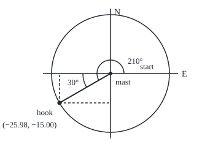
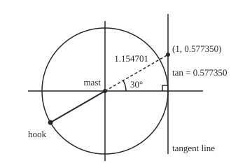

# The unit circle: sine and cosine for every angle, including the ones no triangle has

[Syllabus](../../../SYLLABUS.md) → [Geometry and trig](../README.md) → [Trigonometry](../README.md#s03) → The unit circle

---

## General Overview

A tower crane's 30 m jib, the horizontal arm the hook runs along, turns on the mast, the crane's tower. A lift starts with the jib due east and the hook at its tip. The operator swings it anticlockwise, seen from above, through 210°: past north and west to 30° south of west. The load comes down 25.98 m west and 15.00 m south of the mast.

No right triangle has a 210° corner, so sine and cosine as side ratios ([Sine, cosine and tangent](01-right-triangle-trigonometry.md)) cannot give those two offsets. A circle can: shrink the jib to length 1 and read where its tip ends.

**Turn an arm of length 1 from due east through any angle: the cosine is how far east its tip ends and the sine how far north, positions that exist at every angle and carry a sign.**

**What kind of fact this is:** a definition, chosen to agree with the triangle ratios below 90°; the agreement and the sign rule are proved on this card in Why it works.

### The picture: the swing, seen from above

<p align="center"></p>

Drawn at 1 m = 3.2 units, north up. Long arc: the 210° swing. Short arc: the 30° between jib and due west. Dashed: the hook's 15.00 m south and 25.98 m west.

---

## The formula

Notation first, in words. A position on the plan is a pair (x, y): x is how far east of the mast, y how far north, with west and south negative. The Greek letter theta, $\theta$, names the angle turned. Reminder: a radian is the angle whose arc equals the radius, so 210° is 7π/6 radians ([Radians](../02-Circles%20and%20Solids/02-radians-arcs-and-sectors.md)).

The **unit circle** has radius 1 and centre (0, 0), the mast; on it, distances are counted in radii. Start at (1, 0) and turn through $\theta$, anticlockwise positive and clockwise negative, to end at (x, y).

$$\cos\theta = x, \qquad \sin\theta = y$$

**Read it aloud:** cosine is how far east a unit arm's tip ends after the turn; sine is how far north.

The tip never leaves the circle, so neither passes 1 or −1. An arm of length $r$ is the unit arm scaled up by $r$, so it ends at $(r\cos\theta,\ r\sin\theta)$: for the jib, 30 × (−0.866025, −0.5) = (−25.98, −15.00) in metres. Four more ratios come from the same two positions:

$$\tan\theta = \frac{y}{x}, \qquad \sec\theta = \frac{1}{x}, \qquad \csc\theta = \frac{1}{y}, \qquad \cot\theta = \frac{x}{y}$$

**Read it aloud:** tangent is north over east, secant one over east, cosecant one over north, cotangent east over north.

| Symbol | Plain meaning | In our example | Push it up and the answer… |
| --- | --- | --- | --- |
| $\theta$ | angle turned from due east | 210° = 3.665191 rad | tip moves on anticlockwise |
| $x$, $y$ | tip's east and north positions, in radii: $\cos\theta$ and $\sin\theta$ | −√3/2 ≈ −0.866025, −1/2 | — |
| $r$ | the arm's real length | 30 m | offsets grow; ratios stay |
| $\tan\theta$ | tangent, $y$/$x$: slope of the jib's line | 0.577350 | — |
| $\sec\theta$, $\csc\theta$, $\cot\theta$ | 1/$x$, 1/$y$, $x$/$y$ | −1.154701, −2, 1.732051 | — |
| $\alpha$ | reference angle: sharp angle to the east–west line | 30° | — |
| $\pi$ | circumference over diameter | half a turn is π rad | — |

### When it holds

A definition cannot fail, but it fixes a convention: angles run from due east, anticlockwise positive, not from north like a compass bearing. Tangent and secant need $x$ ≠ 0: none at 90°, 270° or angles whole turns from them. Cotangent and cosecant need $y$ ≠ 0: none at 0°, 180° or their whole-turn partners.

---

## Why it works

### Step 0: make the hypotenuse 1, and the ratios become positions

Sine and cosine divide a side by the hypotenuse. Make the hypotenuse the unit arm, corner on the mast, and the division vanishes: the sides become the tip's north and east positions. Positions exist at every angle, right triangles only below 90°, so positions become the definition.

### Step 1: between 0° and 90°, nothing changes

Below 90°, drop a line from the tip square onto the east–west line: a right triangle with hypotenuse 1, adjacent side $x$, opposite side $y$. Its cosine is $x$ ÷ 1 and its sine $y$ ÷ 1, so the triangle card's values stand.

Half an equilateral triangle of side 1 has a 30° corner, the short side 1/2 opposite it and, by Pythagoras, height √(1 − 1/4) = √3/2. So the 30° point is (√3/2, 1/2), about (0.866025, 0.5). Equal legs under a hypotenuse of 1 give the 45° point, (0.707107, 0.707107).

### Step 2: the reference angle gives the sizes, the quadrant the signs

The east–west and north–south lines through the mast, the **axes**, cut the plane into four **quadrants**, numbered anticlockwise from north-east: I (east, north), II (west, north), III (west, south), IV (east, south). The **reference angle** $\alpha$ (Greek alpha) is the sharp angle between the arm and the east–west line: at 210°, in quadrant III, 210° − 180° = 30°.

A half turn about the mast carries the 30° arm onto the 210° arm and sends (x, y) to (−x, −y), so cos 210° = −0.866025 and sin 210° = −0.5. The mirror in the north–south line sends 30° to 150° and (x, y) to (−x, y), here (−0.8660, 0.5000); the mirror in the east–west line sends it to 330° and (x, y) to (x, −y), here (0.8660, −0.5000). Tangent, north over east, is positive where the two signs match: quadrants I and III.

<details>
<summary>Detailed proof: the half turn and the mirrors only flip signs</summary>

Let the arm at $\alpha$ end at P = (x, y) in quadrant I, mast O. Drop P square to the east–west line at F: OP = 1, OF = x, FP = y.

Extend PO beyond O by its own length to P′ and drop P′ to the line at F′. Angles FOP and F′OP′ are vertical angles, so equal ([Angles](../01-Angles%2C%20Triangles%20and%20Congruence/01-angles-and-parallel-lines.md)). Triangles OFP and OF′P′ each have a right angle, an angle $\alpha$ and hypotenuse 1, so they are congruent by AAS ([Congruent triangles](../01-Angles%2C%20Triangles%20and%20Congruence/03-congruent-triangles.md)): OF′ = x, F′P′ = y. P′ is west and south of O: (−x, −y), at 180° + $\alpha$.

Reflecting P in either axis gives a congruent triangle across it: (−x, y) at 180° − $\alpha$, or (x, −y) at −$\alpha$, the same point as 360° − $\alpha$. Every $\theta$ strictly inside quadrant II, III or IV is one of these for one $\alpha$ strictly between 0° and 90°, where Step 1 applies. Other angles first shed whole turns (Step 3).

</details>

### Step 3: in radians, the angle is the distance walked

With radius 1, an arc is as long as its angle in radians, so $\cos\theta$ and $\sin\theta$ are where a walk of that length round the unit circle from (1, 0) ends: anticlockwise, or clockwise for a negative angle. The hook walks 30 × 3.665191 = 109.955743 m; the code walks it in 1.5 mm steps, with no triangle or sign rule, and lands at (−25.980762, −15.000000).

Whole turns change nothing: 150° clockwise ends at the 210° spot, and so does 570°. Sine and cosine have **period** 2π: the smallest shift that brings every value back.

### Step 4: the other four, and where their names come from

The north–south line through (1, 0), where every point has $x$ = 1, touches the circle there: the **tangent line**, from Latin *tangens*, touching. Scaling the tip (x, y) by 1/x slides it along the jib's line, through the mast when x is negative, to (1, y/x) on the tangent line. So tan θ = y/x is a height on the tangent line: hence the name. The tip is 1 from the mast, so $x^2 + y^2 = 1$ (Pythagoras). The meeting point's distance from the mast, a hypotenuse over legs 1 and y/x, is $\sqrt{1 + (y/x)^2} = \sqrt{(x^2 + y^2)/x^2}$ = 1/|x|, |x| being x without its sign: the secant's size, from *secans*, cutting.

### The picture: tangent and secant at 210°

<p align="center"></p>

Drawn at radius 1 = 90 units. Dashed: the jib's line, extended back through the mast to the tangent line. 210° shares that line with 30°, so tan 210° = tan 30°: tangent repeats every half turn. The meeting point lies beyond the mast from the hook, so sec 210° = −1.154701.

Co- means "of the complement", the angle making up 90° ([Angles](../01-Angles%2C%20Triangles%20and%20Congruence/01-angles-and-parallel-lines.md)): an angle's cosine is its complement's sine. Cotangent and cosecant repeat the construction on the east–west line through (0, 1): cot 210° = √3 = 1.732051, csc 210° = −2. At 90° the jib's line is parallel to the tangent line and never meets it, so tan 90° and sec 90° do not exist; cot 90° is 0.

---

## Worked numbers, by hand

| Step | Arithmetic | Value |
| --- | --- | --- |
| the swing in radians | 210 × π ÷ 180 | 3.665191 rad |
| the hook's arc | 30 × 3.665191 | 109.955743 m |
| quadrant, reference angle | 210° − 180° | III, 30° |
| unit-circle point | 30° point, both signs flipped | (−0.866025, −0.500000) |
| the hook | 30 × each | **25.98 m west, 15.00 m south** |
| tan, sec, csc, cot | y/x, 1/x, 1/y, x/y | 0.577350, −1.154701, −2, 1.732051 |
| second case: 45° clockwise | reference 45°, quadrant IV | (0.707107, −0.707107); hook **21.21 m east, 21.21 m south** |

The ground crew waits 25.98 m west and 15.00 m south of the mast.

### What breaks if you drop a piece

| Mistake | Comes out at | What went wrong |
| --- | --- | --- |
| Keep the triangle's positive values | (25.98, 15.00) | The 30° spot: the quadrant sets signs |
| Swap sine and cosine, as a bearing does | (−15.00, −25.98) | The 240° spot |
| Type 210 into a radian-mode sine | cos −0.8839, sin 0.4677 | 210 radians is 33 turns and 152.11° more |

The code prints all three.

---

## Code, from first principles, and it actually runs

Road one is the card's method. Road two never mentions a triangle: it walks the hook round in 1.5 mm steps, each a short move across the jib pulled back to 30 m, until the steps total the radius times the radians. The asserts: the roads agree in every quadrant and clockwise; walks of 210°, −150° and 570° meet; 210 radians walked in full matches the walk left after 33 laps; the tangent-line distance is the secant's size.

### Python

```python
# The unit circle -- the check behind the card.  Nothing is imported.  A tower
# crane's 30 m jib starts pointing east and swings anticlockwise through 210 deg.
# Road one: reference angle, exact triangle values, quadrant signs.  Road two:
# walk the hook round the circle until the arc is the radius times the radians.
R, PI, H = 30.0, 3.141592653589793, 3 ** 0.5 / 2   # H: height of half an equilateral triangle
EXACT = {0: (1.0, 0.0), 30: (H, 0.5), 45: (0.5 ** 0.5, 0.5 ** 0.5), 60: (0.5, H), 90: (0.0, 1.0)}

def point(deg):                          # road one: sizes from the reference angle,
    a = deg % 360                        # signs from the quadrant
    x, y = EXACT[min(a % 180, 180 - a % 180)]
    return (-x if 90 < a < 270 else x, -y if a > 180 else y)

def walk(theta, r, per=20000):           # road two: the radian, walked out in short steps
    x, y, done, arc = r, 0.0, 0.0, r * abs(theta)
    turn = 1 if theta > 0 else -1        # anticlockwise positive, clockwise negative
    while arc - done > 1e-9:
        s = turn * min(r / per, arc - done)
        u, v = x - y * s / r, y + x * s / r                  # a short step across the jib
        k = r / (u * u + v * v) ** 0.5                       # pulled back to r from the mast
        done += ((u * k - x) ** 2 + (v * k - y) ** 2) ** 0.5  # the arc, walked as chords
        x, y = u * k, v * k
    return x, y

def ratio(a, b):                         # a quotient that refuses to divide by zero
    return "undefined" if b == 0 else f"{a / b + 0.0:.6f}"

def pair(p, d=6):
    return f"({p[0]:.{d}f}, {p[1]:.{d}f})"

t, (x, y) = 210 * PI / 180, point(210)
walks = {d: walk(d * PI / 180, R) for d in [30, 150, 210, 330, -45, -150, 570]}
print(f"jib 30 m, swing 210 deg = 7pi/6 rad = {t:.6f} rad; the hook's arc 30 x {t:.6f} = {R * t:.6f} m")
print(f"road one: reference angle 30 deg, quadrant III, signs (-, -): cos {x:.6f}, sin {y:.6f}")
print(f"road two: {R * t:.6f} m walked round the circle in 1.5 mm steps: hook at {pair(walks[210])} m")
print(f"hook: {-R * x:.2f} m west and {-R * y:.2f} m south of the mast")
print(f"the other four at 210 deg: tan {ratio(y, x)}, sec {ratio(1, x)}, csc {ratio(1, y)}, cot {ratio(x, y)}")
tl = (1 + (y / x) ** 2) ** 0.5           # Pythagoras on the tangent-line triangle
print(f"tangent line x = 1: the jib's line meets it at (1, {y / x:.6f}), {tl:.6f} from the mast, beyond it from the hook")
print("one per quadrant: " + "  ".join(f"{d} deg {pair(point(d), 4)}" for d in [30, 150, 210, 330]))
print(f"second case, 45 deg clockwise = -pi/4 rad: road one {pair(point(-45))}, road two hook at {pair(walks[-45], 2)} m")
print(f"150 deg clockwise and 570 deg anticlockwise end at {pair(walks[-150], 2)} and {pair(walks[570], 2)} m")
for d in (90, 180):
    a, b = point(d)
    print(f"on an axis, {d} deg at ({a:.0f}, {b:.0f}): tan {ratio(b, a)}, sec {ratio(1, a)}, csc {ratio(1, b)}, cot {ratio(a, b)}")
laps = int(210 / (2 * PI)); rest = 210 - laps * 2 * PI
c, s = walk(rest, 1.0)
print(f"mistake 1, the triangle's positive signs kept: hook at {pair((R * H, R / 2), 2)}, the 30 deg spot")
print(f"mistake 2, sine and cosine swapped: hook at {pair((R * y, R * x), 2)}; the 240 deg spot is {pair((R * point(240)[0], R * point(240)[1]), 2)}")
print(f"mistake 3, 210 typed in radian mode: {laps} turns and {rest:.6f} rad = {rest * 180 / PI:.2f} deg more; cos {c:.4f}, sin {s:.4f}")
print(f"figure, plan 1 m = 3.2: mast (180, 120), jib 96, hook ({180 + 96 * x:.2f}, {120 - 96 * y:.2f}),"
      f" arcs end ({180 + 22 * x:.2f}, {120 - 22 * y:.2f}) and ({180 + 45 * x:.2f}, {120 - 45 * y:.2f})")
print(f"figure, tangent line 1 = 90: mast (150, 130), hook ({150 + 90 * x:.2f}, {130 - 90 * y:.2f}),"
      f" meets at (240, {130 - 90 * y / x:.2f}), 30 deg arc end ({150 + 30 * H:.2f}, {130 - 15:.2f})")
for d in [30, 150, 210, 330, -45]:       # two roads agree in all four quadrants
    assert abs(R * point(d)[0] - walks[d][0]) < 1e-6 and abs(R * point(d)[1] - walks[d][1]) < 1e-6
assert all(abs(walks[d][i] - walks[210][i]) < 1e-6 for d in (-150, 570) for i in (0, 1))  # three walks
cf, sf = walk(210, 1.0, 2000)            # 210 radians walked in full: 33 laps and the rest
assert abs(cf - c) < 1e-4 and abs(sf - s) < 1e-4
assert abs(tl - abs(1 / x)) < 1e-12      # the tangent-line hypotenuse is |sec 210|
print("ALL CHECKS PASS")
```

**Ran 2026-09-24 on macOS, Python 3.14.6, standard library only. All checks passed. Output, pasted from the run:**

```
jib 30 m, swing 210 deg = 7pi/6 rad = 3.665191 rad; the hook's arc 30 x 3.665191 = 109.955743 m
road one: reference angle 30 deg, quadrant III, signs (-, -): cos -0.866025, sin -0.500000
road two: 109.955743 m walked round the circle in 1.5 mm steps: hook at (-25.980762, -15.000000) m
hook: 25.98 m west and 15.00 m south of the mast
the other four at 210 deg: tan 0.577350, sec -1.154701, csc -2.000000, cot 1.732051
tangent line x = 1: the jib's line meets it at (1, 0.577350), 1.154701 from the mast, beyond it from the hook
one per quadrant: 30 deg (0.8660, 0.5000)  150 deg (-0.8660, 0.5000)  210 deg (-0.8660, -0.5000)  330 deg (0.8660, -0.5000)
second case, 45 deg clockwise = -pi/4 rad: road one (0.707107, -0.707107), road two hook at (21.21, -21.21) m
150 deg clockwise and 570 deg anticlockwise end at (-25.98, -15.00) and (-25.98, -15.00) m
on an axis, 90 deg at (0, 1): tan undefined, sec undefined, csc 1.000000, cot 0.000000
on an axis, 180 deg at (-1, 0): tan 0.000000, sec -1.000000, csc undefined, cot undefined
mistake 1, the triangle's positive signs kept: hook at (25.98, 15.00), the 30 deg spot
mistake 2, sine and cosine swapped: hook at (-15.00, -25.98); the 240 deg spot is (-15.00, -25.98)
mistake 3, 210 typed in radian mode: 33 turns and 2.654885 rad = 152.11 deg more; cos -0.8839, sin 0.4677
figure, plan 1 m = 3.2: mast (180, 120), jib 96, hook (96.86, 168.00), arcs end (160.95, 131.00) and (141.03, 142.50)
figure, tangent line 1 = 90: mast (150, 130), hook (72.06, 175.00), meets at (240, 78.04), 30 deg arc end (175.98, 115.00)
ALL CHECKS PASS
```

### Rust

Same numbers, same labels, built with `rustc --edition 2021 -O`.

```rust
// The unit circle -- the same check as the Python, in Rust.  No crates.  A tower
// crane's 30 m jib starts pointing east and swings anticlockwise through 210 deg.
// Road one: reference angle, exact triangle values, quadrant signs.  Road two:
// walk the hook round the circle until the arc is the radius times the radians.
const R: f64 = 30.0;
const PI: f64 = 3.141592653589793;

fn point(deg: i64) -> (f64, f64) {                // road one: sizes from the reference angle,
    let h = 3f64.sqrt() / 2.0;                    // signs from the quadrant
    let a = deg.rem_euclid(360);
    let (x, y) = match (a % 180).min(180 - a % 180) {
        0 => (1.0, 0.0), 30 => (h, 0.5), 45 => (0.5f64.sqrt(), 0.5f64.sqrt()),
        60 => (0.5, h), 90 => (0.0, 1.0), _ => panic!("not a special angle"),
    };
    (if a > 90 && a < 270 { -x } else { x }, if a > 180 { -y } else { y })
}

fn walk(theta: f64, r: f64, per: f64) -> (f64, f64) {   // road two: the radian, walked out
    let (mut x, mut y, mut done, arc) = (r, 0.0f64, 0.0f64, r * theta.abs());
    let turn = if theta > 0.0 { 1.0 } else { -1.0 };     // anticlockwise positive
    while arc - done > 1e-9 {
        let s = turn * (r / per).min(arc - done);
        let (u, v) = (x - y * s / r, y + x * s / r);      // a short step across the jib
        let k = r / (u * u + v * v).sqrt();               // pulled back to r from the mast
        done += ((u * k - x).powi(2) + (v * k - y).powi(2)).sqrt();  // the arc, as chords
        x = u * k;
        y = v * k;
    }
    (x, y)
}

fn ratio(a: f64, b: f64) -> String {              // a quotient that refuses to divide by zero
    if b == 0.0 { "undefined".to_string() } else { format!("{:.6}", a / b + 0.0) }
}

fn pair(p: (f64, f64), d: usize) -> String { format!("({:.*}, {:.*})", d, p.0, d, p.1) }

fn main() {
    let (t, (x, y), h) = (210.0 * PI / 180.0, point(210), 3f64.sqrt() / 2.0);
    let ds = [30i64, 150, 210, 330, -45, -150, 570];
    let w: Vec<(f64, f64)> = ds.iter().map(|&d| walk(d as f64 * PI / 180.0, R, 20000.0)).collect();
    let at = |d: i64| w[ds.iter().position(|&e| e == d).unwrap()];
    println!("jib 30 m, swing 210 deg = 7pi/6 rad = {:.6} rad; the hook's arc 30 x {:.6} = {:.6} m", t, t, R * t);
    println!("road one: reference angle 30 deg, quadrant III, signs (-, -): cos {:.6}, sin {:.6}", x, y);
    println!("road two: {:.6} m walked round the circle in 1.5 mm steps: hook at {} m", R * t, pair(at(210), 6));
    println!("hook: {:.2} m west and {:.2} m south of the mast", -R * x, -R * y);
    println!("the other four at 210 deg: tan {}, sec {}, csc {}, cot {}", ratio(y, x), ratio(1.0, x), ratio(1.0, y), ratio(x, y));
    let tl = (1.0 + (y / x).powi(2)).sqrt();      // Pythagoras on the tangent-line triangle
    println!("tangent line x = 1: the jib's line meets it at (1, {:.6}), {:.6} from the mast, beyond it from the hook", y / x, tl);
    let fam: Vec<String> = [30, 150, 210, 330].iter().map(|&d| format!("{} deg {}", d, pair(point(d), 4))).collect();
    println!("one per quadrant: {}", fam.join("  "));
    println!("second case, 45 deg clockwise = -pi/4 rad: road one {}, road two hook at {} m", pair(point(-45), 6), pair(at(-45), 2));
    println!("150 deg clockwise and 570 deg anticlockwise end at {} and {} m", pair(at(-150), 2), pair(at(570), 2));
    for d in [90, 180] {
        let (a, b) = point(d);
        println!("on an axis, {} deg at ({:.0}, {:.0}): tan {}, sec {}, csc {}, cot {}", d, a, b, ratio(b, a), ratio(1.0, a), ratio(1.0, b), ratio(a, b));
    }
    let laps = (210.0 / (2.0 * PI)).floor();
    let rest = 210.0 - laps * 2.0 * PI;
    let (c, s) = walk(rest, 1.0, 20000.0);
    println!("mistake 1, the triangle's positive signs kept: hook at {}, the 30 deg spot", pair((R * h, R / 2.0), 2));
    let p240 = point(240);
    println!("mistake 2, sine and cosine swapped: hook at {}; the 240 deg spot is {}", pair((R * y, R * x), 2), pair((R * p240.0, R * p240.1), 2));
    println!("mistake 3, 210 typed in radian mode: {} turns and {:.6} rad = {:.2} deg more; cos {:.4}, sin {:.4}", laps as i64, rest, rest * 180.0 / PI, c, s);
    println!("figure, plan 1 m = 3.2: mast (180, 120), jib 96, hook ({:.2}, {:.2}), arcs end ({:.2}, {:.2}) and ({:.2}, {:.2})",
             180.0 + 96.0 * x, 120.0 - 96.0 * y, 180.0 + 22.0 * x, 120.0 - 22.0 * y, 180.0 + 45.0 * x, 120.0 - 45.0 * y);
    println!("figure, tangent line 1 = 90: mast (150, 130), hook ({:.2}, {:.2}), meets at (240, {:.2}), 30 deg arc end ({:.2}, {:.2})",
             150.0 + 90.0 * x, 130.0 - 90.0 * y, 130.0 - 90.0 * y / x, 150.0 + 30.0 * h, 130.0 - 15.0);
    for d in [30, 150, 210, 330, -45] {           // two roads agree in all four quadrants
        let (p, q) = (point(d), at(d));
        assert!((R * p.0 - q.0).abs() < 1e-6 && (R * p.1 - q.1).abs() < 1e-6);
    }
    for d in [-150, 570] {                        // three walks, one spot
        assert!((at(d).0 - at(210).0).abs() < 1e-6 && (at(d).1 - at(210).1).abs() < 1e-6);
    }
    let (cf, sf) = walk(210.0, 1.0, 2000.0);      // 210 radians walked in full: 33 laps and the rest
    assert!((cf - c).abs() < 1e-4 && (sf - s).abs() < 1e-4);
    assert!((tl - (1.0 / x).abs()).abs() < 1e-12);  // the tangent-line hypotenuse is |sec 210|
    println!("ALL CHECKS PASS");
}
```

**Ran 2026-09-24 on macOS, rustc 1.98.1, no crates. All checks passed. Output, pasted from the run:**

```
jib 30 m, swing 210 deg = 7pi/6 rad = 3.665191 rad; the hook's arc 30 x 3.665191 = 109.955743 m
road one: reference angle 30 deg, quadrant III, signs (-, -): cos -0.866025, sin -0.500000
road two: 109.955743 m walked round the circle in 1.5 mm steps: hook at (-25.980762, -15.000000) m
hook: 25.98 m west and 15.00 m south of the mast
the other four at 210 deg: tan 0.577350, sec -1.154701, csc -2.000000, cot 1.732051
tangent line x = 1: the jib's line meets it at (1, 0.577350), 1.154701 from the mast, beyond it from the hook
one per quadrant: 30 deg (0.8660, 0.5000)  150 deg (-0.8660, 0.5000)  210 deg (-0.8660, -0.5000)  330 deg (0.8660, -0.5000)
second case, 45 deg clockwise = -pi/4 rad: road one (0.707107, -0.707107), road two hook at (21.21, -21.21) m
150 deg clockwise and 570 deg anticlockwise end at (-25.98, -15.00) and (-25.98, -15.00) m
on an axis, 90 deg at (0, 1): tan undefined, sec undefined, csc 1.000000, cot 0.000000
on an axis, 180 deg at (-1, 0): tan 0.000000, sec -1.000000, csc undefined, cot undefined
mistake 1, the triangle's positive signs kept: hook at (25.98, 15.00), the 30 deg spot
mistake 2, sine and cosine swapped: hook at (-15.00, -25.98); the 240 deg spot is (-15.00, -25.98)
mistake 3, 210 typed in radian mode: 33 turns and 2.654885 rad = 152.11 deg more; cos -0.8839, sin 0.4677
figure, plan 1 m = 3.2: mast (180, 120), jib 96, hook (96.86, 168.00), arcs end (160.95, 131.00) and (141.03, 142.50)
figure, tangent line 1 = 90: mast (150, 130), hook (72.06, 175.00), meets at (240, 78.04), 30 deg arc end (175.98, 115.00)
ALL CHECKS PASS
```

The two outputs match line for line.

> [!TIP]
> **Try changing**
> Guess first, then run it.
> - **Break a sign.** In `point`, change `90 < a < 270` to `a > 180`: 150° lands on the 30° spot; the first assert fails.
> - **Walk the wrong way.** Set `turn = 1`: the clockwise 45° swing ends north-east; the first assert fails.
> - **Count half laps.** Change `laps * 2 * PI` to `laps * PI`: the point lands on the opposite side; the third assert fails.

---

## The usual mistake

> [!warning]
> **Treating sine and cosine as lengths.** Ratios of lengths are always positive; positions on the circle carry a sign: cos 210° = −0.866025 because the hook is west of the mast. Keep the positive values and the load lands at (25.98, 15.00), across the site.
>
> - **Degrees into a radian-mode sine.** A calculator in radian mode, and most programming languages, read sin(210) as 210 radians: 0.4677, not −0.5.
> - **A bearing read as the angle.** The hook's compass bearing, clockwise from north, is 240°; fed in as the angle, it gives (−15.00, −25.98).
> - **One over the sine read as undoing it.** csc 210° = −2 is 1 ÷ sin 210°, not an angle; getting the angle back from a sine is [Inverse trig](05-inverse-trig-and-solving-equations.md).

---

## Where you meet it in real life

- **Cranes and robot arms.** Controllers turn a joint angle into offsets as (r cos θ, r sin θ) at every angle, with no quadrant cases.
- **Triangles with an angle over 90°.** The law of cosines needs that angle's negative cosine ([Law of cosines](06-law-of-cosines.md)).
- **Waves.** A point circling steadily has a north position that rises and falls: a sine wave ([Trig graphs](04-trig-graphs-amplitude-period-and-phase.md)).

> **Say it back**
> Turn an arm of length 1 from due east, anticlockwise positive. Cosine is how far east its tip ends, sine how far north. The reference angle gives the sizes, the quadrant the signs: a 30 m jib swung 210° puts the hook 25.98 m west and 15.00 m south. Tangent, secant, cosecant and cotangent are y/x, 1/x, 1/y and x/y, missing where the denominator is zero.

---

## What this builds on

- [Sine, cosine and tangent](01-right-triangle-trigonometry.md): the side ratios the circle keeps below 90°.
- [Radians](../02-Circles%20and%20Solids/02-radians-arcs-and-sectors.md): the radian, an angle as a distance walked.

## Where this goes next

- [Trig identities](03-trig-identities.md): $x^2 + y^2 = 1$, and two turns in a row.
- [Trig graphs](04-trig-graphs-amplitude-period-and-phase.md): sine plotted against the angle.
- [Small angles](08-small-angles-and-the-sine-bound.md): a short arc against its height.
- [Polar coordinates](../04-Coordinates%20and%20Curves/03-polar-coordinates.md): from a point back to its angle.
- [Polar form](../../07-Complex%20analysis/01-Complex%20Numbers%20and%20the%20Plane/03-polar-form-and-argument.md): the circle's points as numbers.
- AC power: three points a third of a turn apart.
- Runge's phenomenon: circle points dropped onto a diameter.

The circle says where one swing lands; where a jib hinged on a jib lands, one angle added to another, is the addition formula of [Trig identities](03-trig-identities.md).

---

## Sources

Verified 2026-09-24: every link below opens a page naming the cited work.

- Abramson, Jay, et al. *Precalculus 2e*, section 5.2, "Unit Circle: Sine and Cosine Functions." OpenStax. [Section page](https://openstax.org/books/precalculus-2e/pages/5-2-unit-circle-sine-and-cosine-functions). Coordinates as definitions; reference angles.
- Abramson, Jay, et al. *Precalculus 2e*, section 5.3, "The Other Trigonometric Functions." OpenStax. [Section page](https://openstax.org/books/precalculus-2e/pages/5-3-the-other-trigonometric-functions). The four quotients and their gaps.
- O'Connor, J. J., and E. F. Robertson. "The trigonometric functions." MacTutor, University of St Andrews. [History page](https://mathshistory.st-andrews.ac.uk/HistTopics/Trigonometric_functions/). Where the names come from.
