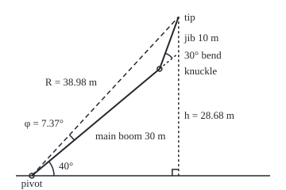

# Trig identities: the Pythagorean and addition formulas, and where the double angles come from

[Syllabus](../../../SYLLABUS.md) → [Geometry and trig](../../../SYLLABUS.md#w05) → [Trigonometry](../../../SYLLABUS.md#w05-s03) → Trig identities

---

## General Overview

A knuckle-boom crane has two booms. The main boom, 30 m long, rises from a pivot on the truck at 40° above level ground. At its head a hinge, the knuckle, holds a 10 m jib locked 30° steeper, pointing at 70°.

Each boom adds its own rise, its length times the sine of its angle. The tip sits 30 m × sin 40° + 10 m × sin 70° = 19.28 m + 9.40 m = 28.68 m above the pivot.

With two sines of two angles, the tip's highest point is hard to see. Yet the locked booms act as one rigid arm: the tip stays 38.98 m from the pivot, on a line 7.37° steeper than the main boom. So its height is one sine, 38.98 m times the sine of the boom's angle plus 7.37°, peaking at 38.98 m with the boom at 82.63°. The trig identities make that fold.

**The sine and cosine of a sum of angles are built from each angle's sine and cosine, so shifted sines fold into one sine and doubled or halved angles need no new table.**

**What kind of fact this is:** theorems, true for every angle, proved on this card in Why it works; folding a sum into one sine is a method built on them.

### The picture: the two booms, to scale

<p align="center"></p>

Drawn at 1 m = 7 units. A position is a pair in brackets, metres across from the pivot, then metres up: knuckle (22.98, 19.28), tip (26.40, 28.68). R is the pivot-to-tip distance, φ (phi) its angle above the main boom.

---

## The formula

θ (theta), β (beta) and φ (phi) name angles. $\sin^2\theta$ means $(\sin\theta)^2$, the sine's value squared. As on [The unit circle](02-radians-and-the-unit-circle.md), turning θ counterclockwise from due east on a circle of radius 1 reaches a point cos θ across and sin θ up; either can be negative.

$$\sin^2\theta+\cos^2\theta=1$$

$$\sin(\theta+\beta)=\sin\theta\cos\beta+\cos\theta\sin\beta, \qquad \cos(\theta+\beta)=\cos\theta\cos\beta-\sin\theta\sin\beta$$

**Read it aloud:** sine squared plus cosine squared is one; the sine of a sum crosses the pairs and adds, the cosine matches them and subtracts.

$$\sin 2\theta=2\sin\theta\cos\theta, \qquad \cos 2\theta=\cos^2\theta-\sin^2\theta=2\cos^2\theta-1=1-2\sin^2\theta$$

$$\sin\tfrac{\theta}{2}=\pm\sqrt{\tfrac{1-\cos\theta}{2}}, \qquad \cos\tfrac{\theta}{2}=\pm\sqrt{\tfrac{1+\cos\theta}{2}}$$

**Read it aloud:** double angles are the sum formulas with equal angles; half angles are those read backwards, signed by where the half angle points.

$$h=L_1\sin\theta+L_2\sin(\theta+\beta)=P\sin\theta+Q\cos\theta=R\sin(\theta+\varphi)$$

**Read it aloud:** two booms' rises make one arm's rise: the pivot-to-tip distance times the sine of the boom's angle plus an offset.

Here $P=L_1+L_2\cos\beta$ and $Q=L_2\sin\beta$, $R=\sqrt{P^2+Q^2}=\sqrt{L_1^2+L_2^2+2L_1L_2\cos\beta}$, and $\varphi$ is the angle with cosine $P/R$ and sine $Q/R$.

| Symbol | Plain meaning | In our example | Push it up and the answer… |
| --- | --- | --- | --- |
| $\theta$ | main boom's angle above level | 40° | the tip climbs until 82.63° |
| $\beta$ | knuckle's bend: how much steeper the jib points | 30° | $R$ shrinks, $\varphi$ grows |
| $L_1$, $L_2$ | main boom's and jib's lengths | 30 m, 10 m | $R$ grows |
| $\sin$, $\cos$ | up and across at that angle on a circle of radius 1 | 0.642788, 0.766044 at 40° | stay within −1 to 1 |
| $h$ | tip's height above the pivot | 28.68 m | — |
| $P$, $Q$ | tip's distance along the main boom's line, and square to it (at right angles) | 38.6603 m, 5 m | — |
| $R$ | pivot-to-tip distance: the single sine's size | 38.98 m | the peak rises |
| $\varphi$ | offset: angle at the pivot from main boom to line R | 7.37° | the peak comes sooner |

### When it holds

- **Every angle, one unit.** Negative angles and angles past a full turn obey them too, in degrees or radians, one unit per formula.
- **Half angles need a sign.** The root gives the size only; a half angle between 90° and 270° has a negative cosine, though the root is positive.
- **A locked, rigid arm.** If the bend changes as the boom moves, no single sine fits. If $R$ is 0, equal booms folded flat back, no offset exists.

---

## Why it works

### Step 0: split the jib into along and across

Split the jib into a piece along the main boom's line, $L_2\cos\beta$ long, and a piece square to it, $L_2\sin\beta$ long. Turning the main boom by θ carries both; the jib's rise is the sum of theirs.

### Step 1: the Pythagorean identity, because every point of the circle is one unit out

Drop a line from the point at angle θ to the east–west line through the centre: a right triangle with legs cos θ and sin θ, signs dropped, and the radius 1 as its longest side. Pythagoras ([Pythagoras](../01-Angles%2C%20Triangles%20and%20Congruence/05-pythagoras-and-its-converse.md)) gives $\cos^2\theta+\sin^2\theta=1$. Squares erase signs, so every quarter of the circle obeys it; on an axis, 0 and ±1 do too. At 40°, 0.642788 squared plus 0.766044 squared gives 1.000000.

### Step 2: the addition formulas, read off the jib

The along piece points at θ: it rises $L_2\cos\beta\sin\theta$ and runs $L_2\cos\beta\cos\theta$ across. The square piece points at θ + 90°. A quarter turn counterclockwise turns an arrow (a vector) cos θ across and sin θ up into one −sin θ across and cos θ up, so the square piece rises $L_2\sin\beta\cos\theta$ and runs $-L_2\sin\beta\sin\theta$: it leans back.

The whole jib points at θ + β. Add the pieces' rises and runs, divide by $L_2$, and both addition formulas appear; the cosine's minus is the lean back. For the crane, sin 70° comes out 0.939693.

<details>
<summary>Detailed proof: every angle, not only the crane's</summary>

**Quarter turn.** East goes to north and north to west, so a point x east and y north goes to x north and y west: the pair (−y, x), whatever the signs of x and y.

**Turning keeps sums.** A turn keeps lengths and angles, so parallelograms stay parallelograms: a turned sum of arrows is the sum of the turned arrows, stretches included.

**The formulas.** The unit arrow at β is cos β east arrows plus sin β north arrows. Turned by θ, east becomes (cos θ, sin θ), north becomes (−sin θ, cos θ), and the arrow at β becomes the arrow at θ + β:
$$\big(\cos(\theta+\beta),\sin(\theta+\beta)\big)=\cos\beta\,(\cos\theta,\sin\theta)+\sin\beta\,(-\sin\theta,\cos\theta)$$
First places give the cosine formula, second places the sine formula, for any sizes of θ and β. Putting −β for β, with $\cos(-\beta)=\cos\beta$ and $\sin(-\beta)=-\sin\beta$, gives the difference formulas.

</details>

### Step 3: double angles, by making the two angles equal

Put θ for β: $\sin 2\theta=2\sin\theta\cos\theta$ and $\cos 2\theta=\cos^2\theta-\sin^2\theta$. Step 1 trades one square for the other, giving the other two spellings. Raised alone from 40° to 80°, the main boom's head climbs to 29.54 m, worked from the 40° numbers: not double 19.28 m.

### Step 4: half angles, by reading a double angle backwards

Put $\tfrac{\theta}{2}$ for θ in $\cos 2\theta=1-2\sin^2\theta$: $\cos\theta=1-2\sin^2\tfrac{\theta}{2}$, so $\sin^2\tfrac{\theta}{2}=\tfrac{1-\cos\theta}{2}$. The spelling $2\cos^2\theta-1$ gives the cosine's version. The root gives the size; the quarter of the circle holding the half angle gives the sign. Lowered to 20°, the main boom's head sits at 10.26 m.

### Step 5: fold the crane's two sines into one

Expand the jib's rise with Step 2 and gather terms:

$$h=L_1\sin\theta+L_2(\sin\theta\cos\beta+\cos\theta\sin\beta)=(L_1+L_2\cos\beta)\sin\theta+(L_2\sin\beta)\cos\theta$$

That is $P\sin\theta+Q\cos\theta$. Divide $P$ and $Q$ by $R=\sqrt{P^2+Q^2}$: the quotients' squares add to 1, so they are the across and up of a point on the circle of radius 1, at some angle φ: Step 1 backwards. Then $P\sin\theta+Q\cos\theta=R(\sin\theta\cos\varphi+\cos\theta\sin\varphi)=R\sin(\theta+\varphi)$, Step 2 backwards. Expanding $P^2+Q^2$ leaves $L_2^2(\cos^2\beta+\sin^2\beta)$, which Step 1 turns into $L_2^2$: hence the second form of $R$. For the crane, $R$ = 38.9822 m and $\varphi$ = 7.3693°.

A sine never exceeds 1, so the tip peaks at $R$ when θ + φ is 90°. Finding φ from its sine is [Inverse trig](05-inverse-trig-and-solving-equations.md); what $R$ and $\varphi$ do to a graph is [Trig graphs](04-trig-graphs-amplitude-period-and-phase.md). Another road, where multiplying certain numbers adds their angles, is [Polar form](../../07-Complex%20analysis/01-Complex%20Numbers%20and%20the%20Plane/03-polar-form-and-argument.md).

---

## Worked numbers, by hand

| Step | Arithmetic | Value |
| --- | --- | --- |
| main boom's rise, reach | 30 × 0.642788, 30 × 0.766044 | 19.2836 m, 22.9813 m |
| sin 70° | 0.642788 × √3/2 + 0.766044 × 0.5 | 0.939693 |
| cos 70° | 0.766044 × √3/2 − 0.642788 × 0.5 | 0.342020 |
| tip height | 30 × 0.642788 + 10 × 0.939693 | **28.6806 m** |
| tip reach | 30 × 0.766044 + 10 × 0.342020 | 26.4015 m |
| boom alone at 80° | 30 × 2 × 0.642788 × 0.766044 | 29.5442 m |
| boom alone at 20° | 30 × the root of (1 − 0.766044) ÷ 2 | 10.2606 m |
| $P$, $Q$ | 30 + 10 × 0.866025, and 10 × 0.5 | 38.6603 m, 5 m |
| $R$ | the root of 30^2 + 10^2 + 2 × 30 × 10 × 0.866025 | 38.9822 m |
| $\varphi$ | the angle whose sine is 5 ÷ 38.9822 | 7.3693° |
| one sine | 38.9822 × sin 47.3693° | 28.6806 m |
| highest tip | $R$, with the boom at 90° − 7.3693° | **38.9822 m at 82.6307°** |

With the knuckle locked, the tip never rises above 38.98 m, reached with the main boom at 82.63°.

### What breaks if you drop a piece

| Mistake | Comes out at | What went wrong |
| --- | --- | --- |
| sin 70° as sin 40° + sin 30° | 1.142788; tip at 30.7115 m | No sine exceeds 1 |
| Plus in the cosine formula | cos 70° as 0.984808; reach 32.8294 m | That is cos 10° |
| Twice the angle, twice the height | 38.5673 m at 80° | The true height is 29.5442 m |
| $R$ as the booms laid straight | 40 m | The bend shortens it to 38.9822 m |

---

## Code, from first principles, and it actually runs

Two roads. Road 1 is a calculator's: the built-in sine gives sin 40° and cos 40°, and later finds φ from its sine; sin 30° = 1/2 and cos 30° = √3/2 come exact from half an equilateral triangle ([Sine, cosine and tangent](01-right-triangle-trigonometry.md)); the identities do the rest. Road 2 uses no sine: adding two unit arrows and rescaling to length 1 halves the angle between them, since a rhombus's diagonal splits its angle ([Congruent triangles](../01-Angles%2C%20Triangles%20and%20Congruence/03-congruent-triangles.md)). Sixty halvings pin each angle; the booms add as arrows. Four asserts compare the roads.

### Python

```python
# Trig identities -- the check behind the card.  A 30 m main boom raised 40 deg,
# a 10 m jib hinged at its head and bent 30 deg further up.  Road 1: the built-in
# sine as a calculator gives it, sin 30 and cos 30 exact, and the identities.
# Road 2: no sine at all; directions come from halving angles, booms add as arrows.
from math import sin, cos, sqrt, radians
L1, L2, TH, BEND = 30.0, 10.0, 40.0, 30.0
S30, C30 = 0.5, sqrt(3) / 2                        # exact: half an equilateral triangle

def single_sine(l1, l2, sb, cb):                   # P sin t + Q cos t = R sin(t + phi)
    p, q = l1 + l2 * cb, l2 * sb
    r = sqrt(l1 * l1 + l2 * l2 + 2 * l1 * l2 * cb)  # P^2 + Q^2, once sin^2 + cos^2 = 1
    lo, hi = 0.0, 90.0                             # phi: the angle whose sine is Q / R
    for _ in range(100):
        mid = (lo + hi) / 2
        lo, hi = (mid, hi) if sin(radians(mid)) < q / r else (lo, mid)
    return p, q, r, lo
def direction(up):                                 # road 2: halve the angle 60 times
    lo, hi, a_lo, a_hi = (1.0, 0.0), (0.0, 1.0), 0.0, 90.0
    for _ in range(60):
        x, y = lo[0] + hi[0], lo[1] + hi[1]        # a rhombus diagonal halves the angle
        n = sqrt(x * x + y * y)
        mid, a = (x / n, y / n), (a_lo + a_hi) / 2
        lo, hi, a_lo, a_hi = (mid, hi, a, a_hi) if up(mid, a) else (lo, mid, a_lo, a)
    return mid, a
def unit(deg): return direction(lambda v, a: a < deg)[0]
def at(p, m, u): return (p[0] + m * u[0], p[1] + m * u[1])
def svg(p): return f"({40 + 7 * p[0]:.2f}, {222 - 7 * p[1]:.2f})"

s, c = sin(radians(TH)), cos(radians(TH))         # road 1: sin 40, cos 40 built in
s70, c70 = s * C30 + c * S30, c * C30 - s * S30    # the addition formulas
h1, x1 = L1 * s + L2 * s70, L1 * c + L2 * c70
p, q, r, phi = single_sine(L1, L2, S30, C30)
u40, u70 = unit(TH), unit(TH + BEND)              # road 2: arrows on a grid
kn = at((0, 0), L1, u40)
tip = at(kn, L2, u70)
r2 = sqrt(tip[0] * tip[0] + tip[1] * tip[1])
phi2 = direction(lambda v, a: v[1] * tip[0] < tip[1] * v[0])[1] - TH  # steer by slope
dbl, half, h80, h20 = 2 * s * c, sqrt((1 - c) / 2), L1 * unit(2 * TH)[1], L1 * unit(TH / 2)[1]
print(f"sin 40 = {s:.6f}, cos 40 = {c:.6f}; squares add to {s * s + c * c:.6f}")
print(f"road 1, addition formulas with sin 30 = {S30:.6f}, cos 30 = {C30:.6f}: sin 70 = {s70:.6f}, cos 70 = {c70:.6f}")
print(f"road 1: height {L1 * s:.4f} + {L2 * s70:.4f} = {h1:.4f} m; reach {L1 * c:.4f} + {L2 * c70:.4f} = {x1:.4f} m")
print(f"road 2, arrows on a grid: knuckle ({kn[0]:.4f}, {kn[1]:.4f}), tip ({tip[0]:.4f}, {tip[1]:.4f})")
print(f"single sine: P = {p:.4f}, Q = {q:.4f}; R = {r:.4f} m, by the distance formula {r2:.4f} m")
print(f"phi = {phi:.4f} deg by root finding, {phi2:.4f} deg from the tip's direction")
print(f"check: {r:.4f} x sin {TH + phi:.4f} = {r * sin(radians(TH + phi)):.4f} m; highest tip {r:.4f} m at boom angle {90 - phi:.4f} deg")
print(f"double: boom at 80 deg, 30 x 2 sin 40 cos 40 = {L1 * dbl:.4f} m; on the grid {h80:.4f} m")
print(f"half: boom at 20 deg, 30 x root((1 - cos 40)/2) = {L1 * half:.4f} m; on the grid {h20:.4f} m")
print(f"mistake 1, sin 70 as sin 40 + sin 30 = {s + S30:.6f}: tip at {L1 * s + L2 * (s + S30):.4f} m")
print(f"mistake 2, plus in the cosine formula: cos 70 as {c * C30 + s * S30:.6f}, reach {L1 * c + L2 * (c * C30 + s * S30):.4f} m")
print(f"mistake 3, twice the angle read as twice the height: {2 * L1 * s:.4f} m; mistake 4, R as {L1 + L2:.0f} m")
(_, _, r0, p0), (_, _, r3, p3) = single_sine(L1, L2, 0.0, 1.0), single_sine(L1, L1, S30, C30)
print(f"try: bend 0 gives R {r0:.4f}, phi {p0:.4f}; jib 30 m gives R {r3:.4f}, phi {p3:.4f}")
print(f"figure, 1 m = 7 units: pivot {svg((0, 0))}, knuckle {svg(kn)}, tip {svg(tip)}, foot {svg((tip[0], 0))}")
print(f"figure, arcs: 40 deg {svg((4, 0))} to {svg(at((0, 0), 4, u40))}; phi {svg(at((0, 0), 10, u40))} to "
      f"{svg(at((0, 0), 10 / r2, tip))}; bend {svg(at(kn, 3, u40))} to {svg(at(kn, 3, u70))}; guide to {svg(at(kn, 4, u40))}")
assert abs(h1 - tip[1]) < 1e-9 and abs(x1 - tip[0]) < 1e-9            # sine and cosine addition
assert abs(r - r2) < 1e-9 and abs(phi - phi2) < 1e-9                   # R and phi, two roads
assert abs(r * sin(radians(TH + phi)) - tip[1]) < 1e-9                 # the single sine
assert abs(L1 * dbl - h80) < 1e-9 and abs(L1 * half - h20) < 1e-9      # double and half angle
print("ALL CHECKS PASS")
```

**Ran 2026-09-24 on macOS, Python 3.14.6, standard library only. All checks passed. Output, pasted from the run:**

```
sin 40 = 0.642788, cos 40 = 0.766044; squares add to 1.000000
road 1, addition formulas with sin 30 = 0.500000, cos 30 = 0.866025: sin 70 = 0.939693, cos 70 = 0.342020
road 1: height 19.2836 + 9.3969 = 28.6806 m; reach 22.9813 + 3.4202 = 26.4015 m
road 2, arrows on a grid: knuckle (22.9813, 19.2836), tip (26.4015, 28.6806)
single sine: P = 38.6603, Q = 5.0000; R = 38.9822 m, by the distance formula 38.9822 m
phi = 7.3693 deg by root finding, 7.3693 deg from the tip's direction
check: 38.9822 x sin 47.3693 = 28.6806 m; highest tip 38.9822 m at boom angle 82.6307 deg
double: boom at 80 deg, 30 x 2 sin 40 cos 40 = 29.5442 m; on the grid 29.5442 m
half: boom at 20 deg, 30 x root((1 - cos 40)/2) = 10.2606 m; on the grid 10.2606 m
mistake 1, sin 70 as sin 40 + sin 30 = 1.142788: tip at 30.7115 m
mistake 2, plus in the cosine formula: cos 70 as 0.984808, reach 32.8294 m
mistake 3, twice the angle read as twice the height: 38.5673 m; mistake 4, R as 40 m
try: bend 0 gives R 40.0000, phi 0.0000; jib 30 m gives R 57.9555, phi 15.0000
figure, 1 m = 7 units: pivot (40.00, 222.00), knuckle (200.87, 87.01), tip (224.81, 21.24), foot (224.81, 222.00)
figure, arcs: 40 deg (68.00, 222.00) to (61.45, 204.00); phi (93.62, 177.00) to (87.41, 170.50); bend (216.96, 73.52) to (208.05, 67.28); guide to (222.32, 69.02)
ALL CHECKS PASS
```

### Rust

Same numbers, same labels, built with `rustc --edition 2021 -O`.

```rust
// Trig identities -- the same check as the Python, in Rust.  No crates.  A 30 m
// main boom raised 40 deg, a 10 m jib hinged at its head and bent 30 deg further
// up.  Road 1: the built-in sine, sin 30 and cos 30 exact, and the identities.
// Road 2: no sine at all; directions come from halving angles, booms add as arrows.
const L1: f64 = 30.0;
const L2: f64 = 10.0;
const TH: f64 = 40.0;
const BEND: f64 = 30.0;
type P = (f64, f64);

fn single_sine(l1: f64, l2: f64, sb: f64, cb: f64) -> (f64, f64, f64, f64) {
    let (p, q) = (l1 + l2 * cb, l2 * sb);                   // P sin t + Q cos t = R sin(t + phi)
    let r = (l1 * l1 + l2 * l2 + 2.0 * l1 * l2 * cb).sqrt(); // P^2 + Q^2, once sin^2 + cos^2 = 1
    let (mut lo, mut hi) = (0.0f64, 90.0f64);                // phi: the angle whose sine is Q / R
    for _ in 0..100 {
        let mid = (lo + hi) / 2.0;
        if mid.to_radians().sin() < q / r { lo = mid } else { hi = mid }
    }
    (p, q, r, lo)
}

fn direction(up: impl Fn(P, f64) -> bool) -> (P, f64) {     // road 2: halve the angle 60 times
    let (mut lo, mut hi, mut a_lo, mut a_hi): (P, P, f64, f64) = ((1.0, 0.0), (0.0, 1.0), 0.0, 90.0);
    let (mut mid, mut a) = ((0.0, 0.0), 0.0);
    for _ in 0..60 {
        let (x, y) = (lo.0 + hi.0, lo.1 + hi.1);            // a rhombus diagonal halves the angle
        let n = (x * x + y * y).sqrt();
        mid = (x / n, y / n);
        a = (a_lo + a_hi) / 2.0;
        if up(mid, a) { lo = mid; a_lo = a } else { hi = mid; a_hi = a }
    }
    (mid, a)
}

fn unit(deg: f64) -> P { direction(|_, a| a < deg).0 }
fn at(p: P, m: f64, u: P) -> P { (p.0 + m * u.0, p.1 + m * u.1) }
fn svg(p: P) -> String { format!("({:.2}, {:.2})", 40.0 + 7.0 * p.0, 222.0 - 7.0 * p.1) }

fn main() {
    let (s30, c30) = (0.5f64, 3.0f64.sqrt() / 2.0);        // exact: half an equilateral triangle
    let (s, c) = (TH.to_radians().sin(), TH.to_radians().cos()); // road 1: sin 40, cos 40 built in
    let (s70, c70) = (s * c30 + c * s30, c * c30 - s * s30); // the addition formulas
    let (h1, x1) = (L1 * s + L2 * s70, L1 * c + L2 * c70);
    let (p, q, r, phi) = single_sine(L1, L2, s30, c30);
    let (u40, u70) = (unit(TH), unit(TH + BEND));            // road 2: arrows on a grid
    let kn = at((0.0, 0.0), L1, u40);
    let tip = at(kn, L2, u70);
    let r2 = (tip.0 * tip.0 + tip.1 * tip.1).sqrt();
    let phi2 = direction(|v, _| v.1 * tip.0 < tip.1 * v.0).1 - TH; // steer by slope
    let (dbl, half) = (2.0 * s * c, ((1.0 - c) / 2.0).sqrt());
    let (h80, h20) = (L1 * unit(2.0 * TH).1, L1 * unit(TH / 2.0).1);
    let (c70w, h_one) = (c * c30 + s * s30, r * (TH + phi).to_radians().sin());
    println!("sin 40 = {:.6}, cos 40 = {:.6}; squares add to {:.6}", s, c, s * s + c * c);
    println!("road 1, addition formulas with sin 30 = {:.6}, cos 30 = {:.6}: sin 70 = {:.6}, cos 70 = {:.6}", s30, c30, s70, c70);
    println!("road 1: height {:.4} + {:.4} = {:.4} m; reach {:.4} + {:.4} = {:.4} m", L1 * s, L2 * s70, h1, L1 * c, L2 * c70, x1);
    println!("road 2, arrows on a grid: knuckle ({:.4}, {:.4}), tip ({:.4}, {:.4})", kn.0, kn.1, tip.0, tip.1);
    println!("single sine: P = {:.4}, Q = {:.4}; R = {:.4} m, by the distance formula {:.4} m", p, q, r, r2);
    println!("phi = {:.4} deg by root finding, {:.4} deg from the tip's direction", phi, phi2);
    println!("check: {:.4} x sin {:.4} = {:.4} m; highest tip {:.4} m at boom angle {:.4} deg", r, TH + phi, h_one, r, 90.0 - phi);
    println!("double: boom at 80 deg, 30 x 2 sin 40 cos 40 = {:.4} m; on the grid {:.4} m", L1 * dbl, h80);
    println!("half: boom at 20 deg, 30 x root((1 - cos 40)/2) = {:.4} m; on the grid {:.4} m", L1 * half, h20);
    println!("mistake 1, sin 70 as sin 40 + sin 30 = {:.6}: tip at {:.4} m", s + s30, L1 * s + L2 * (s + s30));
    println!("mistake 2, plus in the cosine formula: cos 70 as {:.6}, reach {:.4} m", c70w, L1 * c + L2 * c70w);
    println!("mistake 3, twice the angle read as twice the height: {:.4} m; mistake 4, R as {:.0} m", 2.0 * L1 * s, L1 + L2);
    let ((_, _, r0, p0), (_, _, r3, p3)) = (single_sine(L1, L2, 0.0, 1.0), single_sine(L1, L1, s30, c30));
    println!("try: bend 0 gives R {:.4}, phi {:.4}; jib 30 m gives R {:.4}, phi {:.4}", r0, p0, r3, p3);
    println!("figure, 1 m = 7 units: pivot {}, knuckle {}, tip {}, foot {}", svg((0.0, 0.0)), svg(kn), svg(tip), svg((tip.0, 0.0)));
    println!("figure, arcs: 40 deg {} to {}; phi {} to {}; bend {} to {}; guide to {}", svg((4.0, 0.0)),
             svg(at((0.0, 0.0), 4.0, u40)), svg(at((0.0, 0.0), 10.0, u40)), svg(at((0.0, 0.0), 10.0 / r2, tip)),
             svg(at(kn, 3.0, u40)), svg(at(kn, 3.0, u70)), svg(at(kn, 4.0, u40)));
    assert!((h1 - tip.1).abs() < 1e-9 && (x1 - tip.0).abs() < 1e-9);          // sine and cosine addition
    assert!((r - r2).abs() < 1e-9 && (phi - phi2).abs() < 1e-9);               // R and phi, two roads
    assert!((h_one - tip.1).abs() < 1e-9);                                     // the single sine
    assert!((L1 * dbl - h80).abs() < 1e-9 && (L1 * half - h20).abs() < 1e-9);  // double and half angle
    println!("ALL CHECKS PASS");
}
```

**Ran 2026-09-24 on macOS, rustc 1.98.1, no crates. All checks passed. Output, pasted from the run:**

```
sin 40 = 0.642788, cos 40 = 0.766044; squares add to 1.000000
road 1, addition formulas with sin 30 = 0.500000, cos 30 = 0.866025: sin 70 = 0.939693, cos 70 = 0.342020
road 1: height 19.2836 + 9.3969 = 28.6806 m; reach 22.9813 + 3.4202 = 26.4015 m
road 2, arrows on a grid: knuckle (22.9813, 19.2836), tip (26.4015, 28.6806)
single sine: P = 38.6603, Q = 5.0000; R = 38.9822 m, by the distance formula 38.9822 m
phi = 7.3693 deg by root finding, 7.3693 deg from the tip's direction
check: 38.9822 x sin 47.3693 = 28.6806 m; highest tip 38.9822 m at boom angle 82.6307 deg
double: boom at 80 deg, 30 x 2 sin 40 cos 40 = 29.5442 m; on the grid 29.5442 m
half: boom at 20 deg, 30 x root((1 - cos 40)/2) = 10.2606 m; on the grid 10.2606 m
mistake 1, sin 70 as sin 40 + sin 30 = 1.142788: tip at 30.7115 m
mistake 2, plus in the cosine formula: cos 70 as 0.984808, reach 32.8294 m
mistake 3, twice the angle read as twice the height: 38.5673 m; mistake 4, R as 40 m
try: bend 0 gives R 40.0000, phi 0.0000; jib 30 m gives R 57.9555, phi 15.0000
figure, 1 m = 7 units: pivot (40.00, 222.00), knuckle (200.87, 87.01), tip (224.81, 21.24), foot (224.81, 222.00)
figure, arcs: 40 deg (68.00, 222.00) to (61.45, 204.00); phi (93.62, 177.00) to (87.41, 170.50); bend (216.96, 73.52) to (208.05, 67.28); guide to (222.32, 69.02)
ALL CHECKS PASS
```

> [!TIP]
> **Try changing**
> Guess first, then run it. The asserts compare roads, not fixed numbers.
> - **A jib as long as the main boom.** Set `L2` to `30.0`. Pivot, knuckle and tip then make a triangle with two equal sides, so φ is half the bend: $R$ = 57.9555 m, $\varphi$ = 15°.
> - **Straighten the knuckle.** Set `BEND` to `0.0` and `S30, C30` to `0.0, 1.0`: one straight arm, $R$ = 40 m, $\varphi$ = 0°.
> - **Drop the minus.** Change `c * C30 - s * S30` to `c * C30 + s * S30`: road 1's reach becomes 32.8294 m and the first assert stops the run.

---

## The usual mistake

> [!warning]
> **Treating sine as if it spreads over a sum.** sin(40° + 30°) is not sin 40° + sin 30°. That sum is 1.142788, more than any sine can be, and puts the tip at 30.71 m, not 28.68 m. The second turn mixes across and up; the true formula crosses the pairs.
>
> - **The dropped minus.** cos 70° with a plus is 0.984808, which is cos 10°; the reach becomes 32.83 m, not 26.40 m.
> - **Doubling the angle doubles the height.** At 80° the boom's head is at 29.54 m, not 38.57 m.
> - **R as the booms' total length.** Straight they make 40 m; bent, the tip is 38.98 m out.

---

## Where you meet it in real life

- **Mains electricity.** Two voltages of one frequency, a quarter cycle apart, add to one wave, as in Step 5; three waves make AC power.
- **Sound.** Two nearly equal notes swell and fade: the sum and difference formulas turn their sum into a product, and the slow factor is the beat ([Resonance](../../08-Differential%20equations%20and%20dynamics/03-Oscillators%20-%20Second-Order%20Linear%20Equations/06-resonance-and-beats.md)).
- **Tables before calculators.** Ptolemy's second-century chord table grew from a few exact angles by a half-arc rule; he knew the sum rule in chord form. Abu'l-Wafa had the double angle by 980.

> **Say it back**
> Every point on a circle of radius 1 is one unit out, so sine squared plus cosine squared is one. Split a second turn into pieces along and square to the first direction, and the sum formulas fall out; the square piece leans back, giving the cosine's minus. Equal angles give the double angles, read backwards the half angles. Together they fold two locked booms into one arm.

---

## What this builds on

- [The unit circle](02-radians-and-the-unit-circle.md): sine and cosine as up and across on a circle of radius 1, for every angle.

## Where this goes next

- [Law of cosines](06-law-of-cosines.md): $R$'s formula, in any triangle.
- [Derivatives of sine and cosine](../../06-Calculus%20and%20analysis/02-Derivatives/04-derivatives-of-trig-functions.md): the sum formula splits a sine's small step.
- [Trig substitution](../../06-Calculus%20and%20analysis/04-Integrals/06-trig-substitution.md): the Pythagorean identity clears square roots.
- [Polar form](../../07-Complex%20analysis/01-Complex%20Numbers%20and%20the%20Plane/03-polar-form-and-argument.md): multiplying adds angles.
- [Resonance](../../08-Differential%20equations%20and%20dynamics/03-Oscillators%20-%20Second-Order%20Linear%20Equations/06-resonance-and-beats.md): sums of sines heard as beats.
- [Fourier series](../../08-Differential%20equations%20and%20dynamics/09-Fourier%20Series/01-fourier-series-and-orthogonality.md): products of sines turned into sums.
- [The Lyapunov exponent](../../08-Differential%20equations%20and%20dynamics/11-Discrete%20Dynamics%20and%20Chaos/04-chaos-and-the-lyapunov-exponent.md): the logistic map's wildest case as angle doubling.
- AC power: waves folded into one.
- Dirichlet and Fejer kernels: long sums of cosines collapsed.

This card found $R$ from two lengths and a bend, unmeasured; why that expression gives the third side of every triangle is [Law of cosines](06-law-of-cosines.md).

---

## Sources

Verified 2026-09-24: every link below opens a page naming the cited work.

- OpenStax. *Precalculus 2e*, section 7.2, "Sum and Difference Identities." [Textbook page](https://openstax.org/books/precalculus-2e/pages/7-2-sum-and-difference-identities). The sum and difference formulas.
- OpenStax. *Precalculus 2e*, section 7.3, "Double-Angle, Half-Angle, and Reduction Formulas." [Textbook page](https://openstax.org/books/precalculus-2e/pages/7-3-double-angle-half-angle-and-reduction-formulas). Double angles from the sum formulas, and half-angle signs.
- NIST. *Digital Library of Mathematical Functions*, §4.21, "Identities." [DLMF 4.21](https://dlmf.nist.gov/4.21). The identities in all their forms.
- O'Connor, J. J., and E. F. Robertson. "The trigonometric functions." MacTutor, University of St Andrews. [History topic](https://mathshistory.st-andrews.ac.uk/HistTopics/Trigonometric_functions/). Ptolemy's chords and sum rule; Abu'l-Wafa's double angle.
