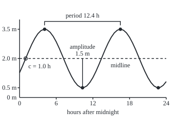

# Trig graphs: reading amplitude, period, midline and phase off a wave

[Syllabus](../../../SYLLABUS.md) → [Geometry and trig](../../../SYLLABUS.md#w05) → [Trigonometry](../../../SYLLABUS.md#w05-s03) → Trig graphs

---

## General Overview

A harbour's tide table for one day:

| Tide | Time | Height above chart datum |
| --- | --- | --- |
| High water | 04:06 | 3.5 m |
| Low water | 10:18 | 0.5 m |
| High water | 16:30 | 3.5 m |
| Low water | 22:42 | 0.5 m |

Chart datum is the fixed zero of the harbour's tide gauge. The water swings 3 m, from 0.5 m to 3.5 m, and each high water comes 12.4 hours after the last: 12 hours 24 minutes.

A skipper at 09:00 needs a height the table does not give. Plotted against the clock, the entries fit a sine wave: the height of a point turning steadily round a circle, drawn against time ([The unit circle](02-radians-and-the-unit-circle.md)).

Four numbers fix that wave. The **amplitude** is how far the water rises above its middle level, the **midline**. The **period** is the time one cycle takes. The **phase** says when a cycle starts. Read the four off the table and a formula gives the height at any minute; read them off a formula and the curve can be sketched without a calculator.

**Every steady wave is one sine curve stretched up to its amplitude, lifted to its midline, stretched along to its period and slid to its start, and each move can be read straight back off the graph.**

**What kind of fact this is:** a theorem about stretched and slid sine curves, proved on this card in Why it works; the four names are definitions, and a sine-shaped tide is a model that fits a day or two, not a month.

### The picture: one day of tide

<p align="center"></p>

Drawn to scale: 1 h = 12.5 units across, 1 m = 40 units up. Filled dots: the tide table. Hollow dot: 01:00, where the water rises through the dashed midline.

---

## The formula

Notation first, in words. Time is $t$, in hours after midnight; textbooks write $x$. The height above datum is $y$, in metres. The letters $a$, $b$, $c$ and $d$ are the four numbers, not a triangle's sides.

$$y = a\sin\big(b\,(t - c)\big) + d$$

**Read it aloud:** the height is the midline plus a sine wave, stretched to the amplitude, run at the tide's pace and started at time c.

Read back off a graph, with $P$ the period from one high water to the next:

$$a = \frac{\text{high} - \text{low}}{2}, \qquad d = \frac{\text{high} + \text{low}}{2}, \qquad b = \frac{2\pi}{P}, \qquad c = \text{a rising midline crossing}$$

For this harbour, $y = 1.5\sin(0.5067(t - 1.0)) + 2.0$.

| Symbol | Plain meaning | In our example | Push it up and the answer… |
| --- | --- | --- | --- |
| $t$ | time, hours after midnight | 0 to 24 | — |
| $y$ | water height above datum | 0.5 m to 3.5 m | — |
| $a$ | amplitude: midline to high water | 1.5 m | higher highs, lower lows |
| $d$ | midline: the level the water swings about | 2.0 m | lifts the whole curve |
| $P$ | period: high water to high water | 12.4 h | highs further apart |
| $b$ | angular speed, radians per hour: $2\pi/P$ | 0.5067, or 29.03 degrees an hour | shorter period |
| $c$ | phase shift: a time the curve rises through its midline | 1.0 h, so 01:00 | slides the curve later |
| $\theta$ | the angle inside the sine, $b(t - c)$ | a quarter turn at 04:06 | — |

The cosine form, $y = a\cos(b(t - c)) + d$, keeps $a$, $b$ and $d$; its $c$ is a high water, 04:06, because a cosine starts at its peak ([Trig identities](03-trig-identities.md)).

### When it holds

- **A steady wave.** Real coasts often have two unequal highs a day, and the range swells and shrinks with the Moon's phase, so a one-day fit drifts within days.
- **One wave.** A gauge records many waves of different periods added together; one amplitude and period describe only the largest.
- **The rise as long as the fall.** In a shallow estuary the water can rise faster than it falls, so high water no longer comes a quarter period after the rising crossing.
- **Radians inside the sine.** A calculator set to degrees needs 29.03 degrees an hour, not 0.5067.
- **Neither a nor b zero.** Either flattens the wave into a level line, which repeats after every shift: no shortest repeat, so no period.

---

## Why it works

### Step 0: one curve, four moves

Plot $\sin\theta$ against the angle $\theta$: the height of a point going round the unit circle. It is 0 and rising at $\theta = 0$, reaches 1 at $\theta = \pi/2$, bottoms at −1 at $\theta = 3\pi/2$, and starts over at $\theta = 2\pi$, a full turn.

Every sine wave is this curve stretched up by a, lifted by d, stretched or squeezed along until a cycle lasts 2π/b, and slid along by c. Each move changes one feature only, so a graph can be undone one move at a time.

### Step 1: the vertical moves give amplitude and midline

The sine runs between −1 and 1. Multiply by a = 1.5: between −1.5 and 1.5. Add d = 2.0: between 0.5 and 3.5. High water is d + a and low water d − a, so subtracting and halving gives a, and adding and halving gives d. A negative a turns the wave upside down; the amplitude is then a without its sign.

### Step 2: the stretch along gives the period

The angle $\theta = b(t - c)$ gains b radians every hour. The plain curve repeats each time the angle gains a full turn, $2\pi$. That takes $2\pi/b$ hours, so $P = 2\pi/b$ and $b = 2\pi/P$: for the tide, 0.5067 radians an hour. No shorter slide lays the curve back on itself.

<details>
<summary>Detailed proof: nothing shorter than a full turn repeats the wave</summary>

Suppose the height $P$ hours later always equals the height now. Those hours add b times P to the angle. Subtract d, divide by a (not zero), and $\sin(\theta + bP) = \sin\theta$ for every $\theta$.

Take $\theta = \pi/2$, where the sine is 1. The sine is 1 only at the top of the circle, $\pi/2$ plus whole turns. So b times P is $2\pi$, or $4\pi$, or more whole turns; the smallest gives $P = 2\pi/b$, 12.4 h. A negative b runs the angle backwards, and the period is $2\pi$ over b without its sign.

</details>

### Step 3: the slide gives the start

At $t = c$ the angle is zero, so the wave is where the plain sine starts: on its midline, rising. High water follows a quarter period later, at c + P/4. Read backwards: a quarter period is 3.1 h, so c is 04:06 less 3.1 h, 01:00.

The slide reads as a time only while b sits outside the brackets. Multiplied out, the model is $1.5\sin(0.5067t - 0.5067) + 2.0$. That second 0.5067 is b times c, an angle in radians; divided by b it gives the slide, 1.0 h.

### Step 4: sketching and reading back use the same five points

To sketch: draw the midline at d and the band from d − a to d + a, mark c, and step a quarter period at a time through midline, top, midline, bottom, midline. Five points and a smooth curve make one cycle. A cosine starts at the top instead. Reading back runs the steps in reverse.

The reading is unique once a and b are positive and c is the first rising crossing after midnight. Otherwise c at 13:24 gives the same tide, and so does a = −1.5 with c at 07:12. The code checks both.

Another route: the tide is the height of a point on a wheel of radius 1.5 m, centred 2.0 m above datum, turning once every 12.4 hours. Phasors keeps the wheel and drops the wave.

---

## Worked numbers, by hand

| Step | Arithmetic | Value |
| --- | --- | --- |
| midline | (3.5 + 0.5) ÷ 2 | 2.0 m |
| amplitude | (3.5 − 0.5) ÷ 2 | 1.5 m |
| period | 16:30 − 04:06 | 12.4 h |
| angular speed | 2π ÷ 12.4 | 0.5067 radians an hour |
| phase shift | 04:06 − 12.4 ÷ 4 = 04:06 − 3.1 h | 01:00, so c = 1.0 |
| angle at 09:00 | 0.5067 × (9 − 1.0) | 4.0537 radians |
| its sine | past a half turn, short of three quarters | −0.7908 |
| height at 09:00 | 1.5 × (−0.7908) + 2.0 | **0.81 m** |

At 09:00 the water stands 0.81 m above datum, still falling towards the 0.5 m low at 10:18.

### What breaks if you drop a piece

| Mistake | Comes out at | What went wrong |
| --- | --- | --- |
| The 3 m swing used as the amplitude | highs of 5.0 m, lows of −1.0 m | The amplitude is half the swing |
| High-water time used as c in the sine | first high water at 07:12 | A sine's top comes 3.1 h after c |
| Shift read before factoring, from $\sin(0.5067t - 0.5067)$ | first high water at 03:36 | 0.5067 there is an angle; the slide is 1.0 h |
| Period put where b goes, $\sin(12.4(t - 1.0))$ | a high water every 0.51 h, 48 a day | b is 2π ÷ 12.4 |

The code prints all four.

---

## Code, from first principles, and it actually runs

Two roads. Road one applies the reading rules to the tide table. Road two builds the curve from road one's numbers, then only measures it: highs and lows from one-minute samples, midline crossings by bisection (halving the minute that holds each crossing, sixty times), and the shortest slide that lays the curve on itself. It must hand back the tide table. Three other formulas for the tide are compared hour by hour.

### Python

```python
# Trig graphs -- the check behind the card.  Standard library only.  A tide
# table is read into y = a sin(b(t - c)) + d by the reading rules (road one).
# Road two builds that curve, samples it once a minute and measures it back:
# highs, lows, midline crossings, the shortest repeat.  It must return the table.
import math
table = [(4.1, 3.5), (10.3, 0.5), (16.5, 3.5), (22.7, 0.5)]   # (hours after midnight, m)
(t1, hi), (_, lo), (t3, _), _ = table
a, d = (hi - lo) / 2, (hi + lo) / 2     # road one: half the swing, and the middle of it
P = t3 - t1                             # high water to high water
b = 2 * math.pi / P                     # one full turn, 2 pi radians, per period
c = t1 - P / 4                          # the sine starts rising a quarter period before its peak
wave = lambda a, b, c, d: lambda t: a * math.sin(b * (t - c)) + d
y = wave(a, b, c, d)
hm = lambda t: f"{round(t * 60) // 60:02d}:{round(t * 60) % 60:02d}"

def extremes(f, s):                     # road two: highs (s = 1) or lows (s = -1), minute by minute
    v = [s * f(m / 60) for m in range(1441)]
    return [(m / 60, s * v[m]) for m in range(1, 1440) if v[m - 1] < v[m] >= v[m + 1]]
def pin(f, level, l, h):                # bisection: halve the bracket 60 times
    for _ in range(60):
        l, h = ((l + h) / 2, h) if f((l + h) / 2) < level else (l, (l + h) / 2)
    return h
def rising(f, level):                   # road two: where f climbs through level, found by the minute, then pinned
    return [pin(f, level, (m - 1) / 60, m / 60) for m in range(1, 1441) if f((m - 1) / 60) < level <= f(m / 60)]
def shortest_repeat(f):                 # road two: the first shift, in steps of 0.01 h, that repeats f
    return next((k / 100 for k in range(1, 2001)
                 if max(abs(f(t + k / 100) - f(t)) for t in range(25)) < 1e-9), math.inf)

highs, lows = extremes(y, 1), extremes(y, -1)
mid = (highs[0][1] + lows[0][1]) / 2    # the midline as measured, not as read
ups, downs, rep = rising(y, mid), rising(lambda t: -y(t), -mid), shortest_repeat(y)
forms = [lambda t: a * math.cos(b * (t - t1)) + d, wave(a, b, c + P, d), wave(-a, b, c + P / 2, d)]
gap = max(abs(f(t) - y(t)) for f in forms for t in range(25))
at = lambda pts: ", ".join(f"{v:.1f} m at {hm(t)}" for t, v in pts)
print("tide table: " + at(table))
print(f"road 1, reading rules: swing {hi - lo:.1f} m, a = {a:.1f} m, d = {d:.1f} m, P = {P:.1f} h ({hm(P)}), P/4 = {P / 4:.1f} h, c = {c:.1f} h ({hm(c)})")
print(f"road 1: b = 2 pi / {P:.1f} = {b:.4f} radians per hour = {math.degrees(b):.2f} degrees per hour")
print(f"road 2, measured off the curve: highs {at(highs)}; lows {at(lows)}; midline {mid:.1f} m")
print(f"road 2, midline crossings: rising {', '.join(map(hm, ups))}; falling {', '.join(map(hm, downs))}")
print(f"road 2, shortest shift that repeats the curve, tried in steps of 0.01 h: {rep:.2f} h")
print(f"cosine from {hm(t1)}, sine from {hm(c + P)}, sine with a = {-a:.1f} from {hm(c + P / 2)}: all agree: {'yes' if gap < 1e-12 else 'no'}")
print(f"height at 09:00: angle {b * (9 - c):.4f} rad, sine {math.sin(b * (9 - c)):.4f}, height {y(9):.2f} m")
print(f"tomorrow's first high water: {hm(t1 + 2 * P - 24)}, {round((2 * P - 24) * 60)} min later")
sw = wave(hi - lo, b, c, d)
print(f"mistake, swing as amplitude: highs {extremes(sw, 1)[0][1]:.1f} m, lows {extremes(sw, -1)[0][1]:.1f} m")
print(f"mistake, high-water time as c in the sine: first high at {hm(extremes(wave(a, b, t1, d), 1)[0][0])}")
print(f"mistake, shift read before factoring, {b * c:.4f} h: first high at {hm(extremes(wave(a, b, b * c, d), 1)[0][0])}")
print(f"mistake, period where b goes: repeats every {2 * math.pi / P:.2f} h, {len(extremes(wave(a, P, c, d), 1))} highs a day")
X, Y = lambda t: 40 + 12.5 * t, lambda h: 200 - 40 * h   # figure: 1 h = 12.5 units, 1 m = 40, datum at y = 200
pt = lambda t, h: f"({X(t):.2f},{Y(h):.1f})"
print(f"figure, key (1 h = 12.5, 1 m = 40, datum at y = 200): highs {pt(t1, hi)} {pt(t3, hi)}, lows {pt(table[1][0], lo)} {pt(table[3][0], lo)}, c {pt(c, d)}")
tenths = sorted({5 * k for k in range(49)} | {round(10 * (c + k * P / 4)) for k in range(8)})
print("figure, curve: " + " ".join(f"{X(n / 10):.2f},{Y(y(n / 10)):.1f}" for n in tenths))
got = sorted(highs + lows)
assert len(got) == 4 and all(round(t * 60) == round(u * 60) and abs(v - w) < 1e-9 for (t, v), (u, w) in zip(got, table))
assert abs(ups[0] - c) < 1e-9 and abs(downs[0] - ups[0] - P / 2) < 1e-9   # starts at c; rises and falls alike
assert abs(rep - P) < 0.005                                    # the shortest repeat is the table's period
assert gap < 1e-12                                             # four formulas, one tide
print("ALL CHECKS PASS")
```

**Ran 2026-09-24 on macOS, Python 3.14.6, standard library only. All checks passed. Output, pasted from the run:**

```
tide table: 3.5 m at 04:06, 0.5 m at 10:18, 3.5 m at 16:30, 0.5 m at 22:42
road 1, reading rules: swing 3.0 m, a = 1.5 m, d = 2.0 m, P = 12.4 h (12:24), P/4 = 3.1 h, c = 1.0 h (01:00)
road 1: b = 2 pi / 12.4 = 0.5067 radians per hour = 29.03 degrees per hour
road 2, measured off the curve: highs 3.5 m at 04:06, 3.5 m at 16:30; lows 0.5 m at 10:18, 0.5 m at 22:42; midline 2.0 m
road 2, midline crossings: rising 01:00, 13:24; falling 07:12, 19:36
road 2, shortest shift that repeats the curve, tried in steps of 0.01 h: 12.40 h
cosine from 04:06, sine from 13:24, sine with a = -1.5 from 07:12: all agree: yes
height at 09:00: angle 4.0537 rad, sine -0.7908, height 0.81 m
tomorrow's first high water: 04:54, 48 min later
mistake, swing as amplitude: highs 5.0 m, lows -1.0 m
mistake, high-water time as c in the sine: first high at 07:12
mistake, shift read before factoring, 0.5067 h: first high at 03:36
mistake, period where b goes: repeats every 0.51 h, 48 highs a day
figure, key (1 h = 12.5, 1 m = 40, datum at y = 200): highs (91.25,60.0) (246.25,60.0), lows (168.75,180.0) (323.75,180.0), c (52.50,120.0)
figure, curve: 40.00,149.1 46.25,135.0 52.50,120.0 58.75,105.0 65.00,90.9 71.25,78.7 77.50,69.1 83.75,62.8 90.00,60.1 91.25,60.0 96.25,61.2 102.50,66.1 108.75,74.5 115.00,85.7 121.25,99.2 127.50,113.9 130.00,120.0 133.75,129.1 140.00,143.7 146.25,156.7 152.50,167.4 158.75,175.1 165.00,179.3 168.75,180.0 171.25,179.7 177.50,176.3 183.75,169.2 190.00,159.1 196.25,146.4 202.50,132.1 207.50,120.0 208.75,117.0 215.00,102.0 221.25,88.3 227.50,76.5 233.75,67.5 240.00,61.9 246.25,60.0 252.50,61.9 258.75,67.5 265.00,76.5 271.25,88.3 277.50,102.0 283.75,117.0 285.00,120.0 290.00,132.1 296.25,146.4 302.50,159.1 308.75,169.2 315.00,176.3 321.25,179.7 323.75,180.0 327.50,179.3 333.75,175.1 340.00,167.4
ALL CHECKS PASS
```

### Rust

Same numbers, same labels, built with `rustc --edition 2021 -O`.

```rust
// Trig graphs -- the same check as the Python, in Rust.  std only.  A tide
// table is read into y = a sin(b(t - c)) + d by the reading rules (road one).
// Road two builds that curve, samples it once a minute and measures it back:
// highs, lows, midline crossings, the shortest repeat.  It must return the table.
use std::collections::BTreeSet;
use std::f64::consts::PI;

fn wave(a: f64, b: f64, c: f64, d: f64) -> impl Fn(f64) -> f64 { move |t| a * (b * (t - c)).sin() + d }
fn hm(t: f64) -> String { let m = (t * 60.0).round() as i64; format!("{:02}:{:02}", m / 60, m % 60) }
fn extremes(f: &dyn Fn(f64) -> f64, s: f64) -> Vec<(f64, f64)> {  // road two: highs (s = 1) or lows (s = -1)
    let v: Vec<f64> = (0..1441).map(|m| s * f(m as f64 / 60.0)).collect();
    (1..1440).filter(|&m| v[m - 1] < v[m] && v[m] >= v[m + 1]).map(|m| (m as f64 / 60.0, s * v[m])).collect()
}
fn pin(f: &dyn Fn(f64) -> f64, level: f64, mut l: f64, mut h: f64) -> f64 {  // bisection, 60 halvings
    for _ in 0..60 { let m = (l + h) / 2.0; if f(m) < level { l = m } else { h = m } }
    h
}
fn rising(f: &dyn Fn(f64) -> f64, level: f64) -> Vec<f64> {  // road two: climbs through level, by the minute, then pinned
    (1..1441).map(|m| ((m - 1) as f64 / 60.0, m as f64 / 60.0))
        .filter(|&(l, h)| f(l) < level && level <= f(h)).map(|(l, h)| pin(f, level, l, h)).collect()
}
fn shortest_repeat(f: &dyn Fn(f64) -> f64) -> f64 {  // road two: the first shift, in steps of 0.01 h, that repeats f
    (1..2001).map(|k| k as f64 / 100.0)
        .find(|&p| (0..25).map(|t| (f(t as f64 + p) - f(t as f64)).abs()).fold(0.0, f64::max) < 1e-9)
        .unwrap_or(f64::INFINITY)
}
fn at(pts: &[(f64, f64)]) -> String {
    pts.iter().map(|&(t, v)| format!("{:.1} m at {}", v, hm(t))).collect::<Vec<_>>().join(", ")
}
fn main() {
    let table = [(4.1, 3.5), (10.3, 0.5), (16.5, 3.5), (22.7, 0.5)];  // (hours after midnight, m)
    let ((t1, hi), (_, lo), (t3, _)) = (table[0], table[1], table[2]);
    let (a, d) = ((hi - lo) / 2.0, (hi + lo) / 2.0);  // road one: half the swing, and the middle of it
    let p = t3 - t1;                                  // high water to high water
    let b = 2.0 * PI / p;                             // one full turn, 2 pi radians, per period
    let c = t1 - p / 4.0;                             // the sine starts rising a quarter period before its peak
    let y = wave(a, b, c, d);
    let (highs, lows) = (extremes(&y, 1.0), extremes(&y, -1.0));
    let mid = (highs[0].1 + lows[0].1) / 2.0;         // the midline as measured, not as read
    let (ups, downs, rep) = (rising(&y, mid), rising(&|t| -y(t), -mid), shortest_repeat(&y));
    let cosine = move |t: f64| a * (b * (t - t1)).cos() + d;
    let forms: [&dyn Fn(f64) -> f64; 3] = [&cosine, &wave(a, b, c + p, d), &wave(-a, b, c + p / 2.0, d)];
    let yr = &y;
    let gap = forms.iter().flat_map(|f| (0..25).map(move |t| (f(t as f64) - yr(t as f64)).abs())).fold(0.0, f64::max);
    let join = |ts: &[f64]| ts.iter().map(|&t| hm(t)).collect::<Vec<_>>().join(", ");
    println!("tide table: {}", at(&table));
    println!("road 1, reading rules: swing {:.1} m, a = {:.1} m, d = {:.1} m, P = {:.1} h ({}), P/4 = {:.1} h, c = {:.1} h ({})",
             hi - lo, a, d, p, hm(p), p / 4.0, c, hm(c));
    println!("road 1: b = 2 pi / {:.1} = {:.4} radians per hour = {:.2} degrees per hour", p, b, b.to_degrees());
    println!("road 2, measured off the curve: highs {}; lows {}; midline {:.1} m", at(&highs), at(&lows), mid);
    println!("road 2, midline crossings: rising {}; falling {}", join(&ups), join(&downs));
    println!("road 2, shortest shift that repeats the curve, tried in steps of 0.01 h: {:.2} h", rep);
    println!("cosine from {}, sine from {}, sine with a = {:.1} from {}: all agree: {}", hm(t1), hm(c + p), -a, hm(c + p / 2.0), if gap < 1e-12 { "yes" } else { "no" });
    println!("height at 09:00: angle {:.4} rad, sine {:.4}, height {:.2} m", b * (9.0 - c), (b * (9.0 - c)).sin(), y(9.0));
    println!("tomorrow's first high water: {}, {} min later", hm(t1 + 2.0 * p - 24.0), ((2.0 * p - 24.0) * 60.0).round());
    let sw = wave(hi - lo, b, c, d);
    println!("mistake, swing as amplitude: highs {:.1} m, lows {:.1} m", extremes(&sw, 1.0)[0].1, extremes(&sw, -1.0)[0].1);
    println!("mistake, high-water time as c in the sine: first high at {}", hm(extremes(&wave(a, b, t1, d), 1.0)[0].0));
    println!("mistake, shift read before factoring, {:.4} h: first high at {}", b * c, hm(extremes(&wave(a, b, b * c, d), 1.0)[0].0));
    println!("mistake, period where b goes: repeats every {:.2} h, {} highs a day", 2.0 * PI / p, extremes(&wave(a, p, c, d), 1.0).len());
    let (xs, ys) = (|t: f64| 40.0 + 12.5 * t, |h: f64| 200.0 - 40.0 * h);  // figure: 1 h = 12.5, 1 m = 40, datum y = 200
    let pt = |t: f64, h: f64| format!("({:.2},{:.1})", xs(t), ys(h));
    println!("figure, key (1 h = 12.5, 1 m = 40, datum at y = 200): highs {} {}, lows {} {}, c {}", pt(t1, hi), pt(t3, hi), pt(table[1].0, lo), pt(table[3].0, lo), pt(c, d));
    let mut tenths: BTreeSet<i64> = (0..49).map(|k| 5 * k).collect();
    tenths.extend((0..8).map(|k| (10.0 * (c + k as f64 * p / 4.0)).round() as i64));
    let curve: Vec<String> = tenths.iter().map(|&n| format!("{:.2},{:.1}", xs(n as f64 / 10.0), ys(y(n as f64 / 10.0)))).collect();
    println!("figure, curve: {}", curve.join(" "));
    let mut got: Vec<(f64, f64)> = highs.iter().chain(lows.iter()).copied().collect();
    got.sort_by(|u, v| u.0.partial_cmp(&v.0).unwrap());
    assert!(got.len() == 4 && got.iter().zip(table.iter()).all(|(g, w)| (g.0 * 60.0).round() == (w.0 * 60.0).round() && (g.1 - w.1).abs() < 1e-9));
    assert!((ups[0] - c).abs() < 1e-9 && (downs[0] - ups[0] - p / 2.0).abs() < 1e-9);  // starts at c; rises and falls alike
    assert!((rep - p).abs() < 0.005);                                            // the shortest repeat is the table's period
    assert!(gap < 1e-12);                                                        // four formulas, one tide
    println!("ALL CHECKS PASS");
}
```

**Ran 2026-09-24 on macOS, rustc 1.98.1, no crates. All checks passed. Output, pasted from the run:**

```
tide table: 3.5 m at 04:06, 0.5 m at 10:18, 3.5 m at 16:30, 0.5 m at 22:42
road 1, reading rules: swing 3.0 m, a = 1.5 m, d = 2.0 m, P = 12.4 h (12:24), P/4 = 3.1 h, c = 1.0 h (01:00)
road 1: b = 2 pi / 12.4 = 0.5067 radians per hour = 29.03 degrees per hour
road 2, measured off the curve: highs 3.5 m at 04:06, 3.5 m at 16:30; lows 0.5 m at 10:18, 0.5 m at 22:42; midline 2.0 m
road 2, midline crossings: rising 01:00, 13:24; falling 07:12, 19:36
road 2, shortest shift that repeats the curve, tried in steps of 0.01 h: 12.40 h
cosine from 04:06, sine from 13:24, sine with a = -1.5 from 07:12: all agree: yes
height at 09:00: angle 4.0537 rad, sine -0.7908, height 0.81 m
tomorrow's first high water: 04:54, 48 min later
mistake, swing as amplitude: highs 5.0 m, lows -1.0 m
mistake, high-water time as c in the sine: first high at 07:12
mistake, shift read before factoring, 0.5067 h: first high at 03:36
mistake, period where b goes: repeats every 0.51 h, 48 highs a day
figure, key (1 h = 12.5, 1 m = 40, datum at y = 200): highs (91.25,60.0) (246.25,60.0), lows (168.75,180.0) (323.75,180.0), c (52.50,120.0)
figure, curve: 40.00,149.1 46.25,135.0 52.50,120.0 58.75,105.0 65.00,90.9 71.25,78.7 77.50,69.1 83.75,62.8 90.00,60.1 91.25,60.0 96.25,61.2 102.50,66.1 108.75,74.5 115.00,85.7 121.25,99.2 127.50,113.9 130.00,120.0 133.75,129.1 140.00,143.7 146.25,156.7 152.50,167.4 158.75,175.1 165.00,179.3 168.75,180.0 171.25,179.7 177.50,176.3 183.75,169.2 190.00,159.1 196.25,146.4 202.50,132.1 207.50,120.0 208.75,117.0 215.00,102.0 221.25,88.3 227.50,76.5 233.75,67.5 240.00,61.9 246.25,60.0 252.50,61.9 258.75,67.5 265.00,76.5 271.25,88.3 277.50,102.0 283.75,117.0 285.00,120.0 290.00,132.1 296.25,146.4 302.50,159.1 308.75,169.2 315.00,176.3 321.25,179.7 323.75,180.0 327.50,179.3 333.75,175.1 340.00,167.4
ALL CHECKS PASS
```

The two outputs match line for line. The figure's curve runs through the `figure, curve` points.

> [!TIP]
> **Try changing**
> Guess first, then run it. The asserts compare road two with the tide table.
> - **A bigger tide.** Set the heights to 4.0 m and 0.0 m. The amplitude becomes 2.0 m, the midline stays 2.0 m, and 09:00 reads 0.42 m.
> - **Forget the quarter period.** Set `c = t1`. The measured highs move to 07:12 and 19:36, and the first assert stops it.
> - **An uneven table.** Move the second high water to 16:36. The lows land at 10:21 and 22:51, and the first assert stops it.

---

## The usual mistake

> [!warning]
> **Reading the start time off the high water.** In the sine form, c is where the wave crosses its midline going up, a quarter period before high water. Put 04:06 into the sine and high water lands at 07:12, 3.1 h late. The high-water time is c only in the cosine form.
>
> - **The swing as the amplitude.** It gives lows of −1.0 m, below datum.
> - **Reading the shift before factoring.** In $\sin(0.5067t - 0.5067)$ the slide is 1.0 h; read as 0.5067 h, high water comes at 03:36.
> - **The period in b's place.** It gives 48 high waters a day.

---

## Where you meet it in real life

- **Tide tables.** The Moon returns overhead later each day, so the times creep: this model's first high water tomorrow is 04:54, 48 minutes later.
- **Tide-predicting machines.** William Thomson, later Lord Kelvin, built one in 1873. It added ten cosine waves, each set by its own amplitude, angular speed and phase, and traced the total.
- **Mains electricity.** Socket voltage is a sine wave in time, read for amplitude and phase as here (Phasors).

> **Say it back**
> A steady wave is the plain sine curve moved four ways. The amplitude is half the swing, 1.5 m; the midline is its middle, 2.0 m. The period is high water to high water, 12.4 h, and b = 2π ÷ P. The phase shift c is when the sine rises through its midline, a quarter period before high water: 01:00. With those four, the formula gives the height at any minute.

---

## What this builds on

- [The unit circle](02-radians-and-the-unit-circle.md): the sine as the height of a point on the unit circle, and the radian, which makes a full turn $2\pi$.

## Where this goes next

- [Inverse trig](05-inverse-trig-and-solving-equations.md): the formula run backwards, from a height to the times it happens.
- Phasors: amplitude and phase kept as an arrow, so waves of one period add like arrows.

The formula turns a time into a height. A skipper needs the reverse: the times when the water is deep enough.

---

## Sources

Verified 2026-09-24: every link below resolves to the publisher's page.

- OpenStax. *Precalculus 2e*, section 6.1, "Graphs of the Sine and Cosine Functions." Rice University. [Textbook page](https://openstax.org/books/precalculus-2e/pages/6-1-graphs-of-the-sine-and-cosine-functions). Amplitude, period, midline and phase shift.
- NIST. *Digital Library of Mathematical Functions*, §4.14, "Definitions and Periodicity." [DLMF 4.14](https://dlmf.nist.gov/4.14). Sine and cosine repeat every full turn: the fact behind Step 2.
- NOAA National Ocean Service. "Frequency of Tides: The Lunar Day." [Tutorial page](https://oceanservice.noaa.gov/education/tutorial_tides/tides05_lunarday.html). Why most coasts see two high waters each time the Moon comes back overhead.
- NOAA Tides and Currents. "Tide Predicting Machines." [History page](https://tidesandcurrents.noaa.gov/predmach.html). Thomson's 1873 machine, which summed cosine waves and traced the predicted tide.
