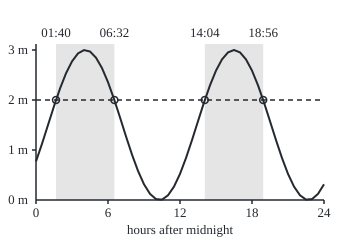
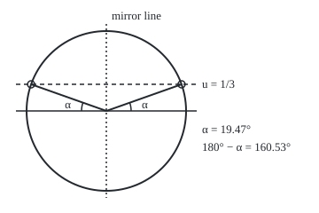

# Inverse trig: getting the angle back, and why there is more than one answer

[Syllabus](../../../SYLLABUS.md) → [Geometry and trig](../../../SYLLABUS.md#w05) → [Trigonometry](../../../SYLLABUS.md#w05-s03) → Inverse trig

---

## General Overview

A harbour's tide gauge reads 0.0 m at low water and 3.0 m at high water. One rise and fall takes 12.4 hours. On this day the water passes mid-height, 1.5 m, rising, at 01:00, and peaks at 04:06 and 16:30.

A boat needs more than 2 m on the gauge to cross the sill, a low wall across the harbour mouth. Between midnight and midnight, when can it cross?

The gauge follows a sine wave, the height of a point turning round a circle, so each time is an angle of that turn. A calculator's inverse-sine button returns one angle, and from it one time, 01:40. The day holds four: up and down through 2 m on each of two tides.

**An inverse trig function returns one angle from an agreed window; every other angle with the same sine is its mirror image or a whole number of turns from one of the two, and the question's interval decides which count.**

**What kind of fact this is:** a definition, since the windows are chosen by agreement; that the mirror and the whole turns give every solution is a theorem, proved on this card in Why it works.

### The picture: one day of tide, and the times above 2 m

<p align="center"></p>

Drawn to scale: 1 hour = 12 units across, 1 m = 50 units up. Rings mark the four crossings of the dashed 2 m line; shaded bands are the times above it.

---

## The formula

For a number u from −1 to 1, $\arcsin u$, "arc-sine of u", is the angle between −90° and 90° whose sine is u. Calculators write $\sin^{-1}$: the −1 marks an undo, as on [Inverse functions](../../01-Foundations/08-Relations%20and%20Functions/05-inverse-functions.md), not one over the sine. $\arccos u$ and $\arctan u$ undo cosine and tangent. Each answers from a window, its **principal branch**.

| Undo | Accepts (its domain) | Returns (its range) |
| --- | --- | --- |
| arcsin u | −1 to 1 | −π/2 to π/2, ends included: −90° to 90° |
| arccos u | −1 to 1 | 0 to π, ends included: 0° to 180° |
| arctan u | any number | strictly between −π/2 and π/2: −90° to 90°, ends excluded |

For an unknown angle $\theta$:

$$\sin\theta = u \quad\text{exactly when}\quad \theta = \alpha + 2\pi k \quad\text{or}\quad \theta = \pi - \alpha + 2\pi k, \qquad \alpha = \arcsin u$$

**Read it aloud:** take the button's angle and its mirror image, half a turn minus it; then add any whole number of turns.

For cosine the mirror is the horizontal axis: $\theta = \pm\beta + 2\pi k$, with $\beta = \arccos u$. For tangent the matching points are half a turn apart: $\theta = \arctan u + \pi k$.

The tide is the one on [Trig graphs](04-trig-graphs-amplitude-period-and-phase.md), with the gauge's zero moved up to low water: midline 1.5 m, amplitude 1.5 m, period 12.4 hours, rising through the midline at $t = 1$, for $t$ in hours after midnight:

$$h(t) = 1.5 + 1.5\sin\theta, \qquad \theta = \frac{2\pi\,(t - 1)}{12.4}$$

Above 2 m means $\sin\theta$ above $u = (2 - 1.5)/1.5$, which is 1/3.

| Symbol | Plain meaning | In our example | Push it up and the answer… |
| --- | --- | --- | --- |
| $t$ | hours after midnight | 1.670675, i.e. 01:40 | — |
| $h(t)$ | the gauge reading, in m | 2 at every crossing | — |
| $\theta$ | an angle; on the tide, how far round its cycle, in radians | 0.339837 at 01:40 | a turn, $2\pi$, is one tide on |
| $u$ | the value the sine must reach | 1/3 = 0.333333 | windows shrink; above 1, none |
| $\alpha$ | $\arcsin u$, the principal angle | 0.339837 rad = 19.47° | rising crossing later |
| $\beta$ | $\arccos u$, cosine's principal angle | 1.230959 rad = 70.53° | windows widen |
| $k$ | a whole number of turns, negative ones too | 0 and 1 | one tide later |
| $\pi$ | half a turn, in radians | $\pi - \alpha$ = 2.801756 | — |

### When it holds

- **The windows are an agreement.** Any stretch where the function takes each value once would serve; these are the standard ones.
- **Sine and cosine need a value from −1 to 1.** Outside it there is no solution, and clipping the value to 1 hides that.
- **At exactly 1 or −1 the two families merge.** A level of 3.0 m is touched once per tide, not crossed twice.
- **The tide must be one wave.** Real tides add several, so real crossings drift; the solving is exact, the model is not.
- **One unit for angles and turns.** Radians with $2\pi$ to a turn, or degrees with 360°.

---

## Why it works

### Step 0: a repeating function has no undo until it is cut down

The sine equals 1/3 at 19.47°, at 160.53°, and at either plus any number of full turns. An undo exists only when no two inputs share an output ([Inverse functions](../../01-Foundations/08-Relations%20and%20Functions/05-inverse-functions.md)).

So cut the sine down to the angles from −90° to 90°. There it climbs steadily from −1 to 1, meeting each value once, so it has an undo: arcsin. The cut chooses which answer comes back; it does not remove the others.

### Step 1: why these three windows

On the unit circle ([The unit circle](02-radians-and-the-unit-circle.md)) the point at angle $\theta$, measured anticlockwise from the rightward axis, is (cos θ, sin θ).

- **Arcsin:** the right half, bottom to top, passes every height, every sine, once.
- **Arccos:** the top half, 0° to 180°, passes every left-right position, every cosine, once.
- **Arctan:** the right half without its top and bottom passes every slope, every tangent, once. A vertical radius has no slope.

### Step 2: two points at every height, and no others

<p align="center"></p>

Drawn to scale: radius 1 = 90 units. The right point is the rising crossing, 01:40; its mirror, the falling one, 06:32.

The line at height 1/3 cuts the circle in two points, mirror images across the vertical axis. The right one is at α = 19.47°. Reflection keeps the angle but measures it from the leftward axis, so the left one is at 180° − α = 160.53°. Whole turns return to the same points, and no other point has height 1/3.

<details>
<summary>Detailed proof: the two families hold every solution</summary>

Let $\sin\theta = u$, with u strictly between −1 and 1. The point (cos θ, sin θ) is on the unit circle, where left-right position x and height y satisfy x^2 + y^2 = 1. Its height is u, so x = ±√(1 − u^2).

α = arcsin u has sine u and lies between −90° and 90°, where cosine is not negative, so the point at α is (+√(1 − u^2), u). If x is positive, θ names that point, and angles naming one point differ by whole turns: $\theta = \alpha + 2\pi k$.

As cos(π − α) = −cos α and sin(π − α) = sin α ([Trig identities](03-trig-identities.md)), the point at π − α is (−√(1 − u^2), u). If x is negative, $\theta = \pi - \alpha + 2\pi k$.

So every solution lies in one family, and every member of either has sine u: the two families are exactly the solutions. At u = ±1 they merge; beyond, nothing solves.

</details>

### Step 3: the other order works only inside the window

Sine after arcsin always returns the value. Arcsin after sine need not return the angle. The falling crossing's angle is 2.801756 rad, 160.53°; arcsin of its sine gives 0.339837. The 06:32 crossing comes back as 01:40.

### Step 4: from angles to times, and which side is above

The angle shifts the time back an hour and stretches one tide to one turn; undoing both in reverse order ([Inverse functions](../../01-Foundations/08-Relations%20and%20Functions/05-inverse-functions.md)) gives $t = 1 + 12.4\,\theta / 2\pi$. Rising crossings land at 1.670675 hours plus 12.4 times $k$, falling ones at 6.529325 plus the same. The day runs from $t = 0$ up to, not including, $t = 24$: only $k = 0$ and $k = 1$ count.

From α to 180° − α the arc lies above the line, so the water is above 2 m from each rising crossing to the next falling one.

A second road counts from high water, 04:06. As a cosine from there, the tide needs cosine above 1/3, answered by ±β, with β = 70.53° = 90° − α: high water plus or minus 2.429325 hours, the same four times. Why the two forms agree is on [Trig identities](03-trig-identities.md).

---

## Worked numbers, by hand

| Step | Arithmetic | Value |
| --- | --- | --- |
| Peel off midline and amplitude | (2 − 1.5) ÷ 1.5 | u = 0.333333 |
| Press the button | arcsin 0.333333 | α = 0.339837 rad = 19.47° |
| Mirror it | π − 0.339837 | 2.801756 rad = 160.53° |
| Angle to time, k = 0 | 1 + 12.4 × θ ÷ 2π | 1.670675 h and 6.529325 h |
| One tide on, k = 1 | add 12.4 h | 14.070675 h and 18.929325 h |
| k = −1 and k = 2 | another 12.4 h off or on | −10.729325, −5.870675, 26.470675, 31.329325: outside the day |
| Which side is above | each rising crossing to the next falling one | **01:40 to 06:32 and 14:04 to 18:56** |

Two windows of 4.858649 hours, 4 h 52 min, each centred on a high water: 0.391827 of every tide.

### What breaks if you drop a piece

| Mistake | Comes out at | What went wrong |
| --- | --- | --- |
| Stop at the button | 01:40 and nothing else | No mirror, no whole turns |
| Mirror, but no whole turns | 01:40 and 06:32 | The afternoon window, 14:04 to 18:56, is lost |
| Forget the midline | 2 ÷ 1.5 = 1.333333: no angle | Outside arcsin's domain |
| Degrees fed in as radians | first crossing at 39.43 h | 19.47 radians is several turns |

---

## Code, from first principles, and it actually runs

Three roads to the four crossings. Road 1: arcsin, mirror, whole turns. Road 1b: arccos from high water. Road 2 inverts nothing: it scans the day by the minute and halves each crossing minute sixty times (bisection). The asserts check roads 2 and 1b against road 1, put each time back into the tide, and compare a minute count above 2 m with the formula.

### Python

```python
# Inverse trig and solving equations: the check behind the card.  Standard library
# only.  The tide h(t) = 1.5 + 1.5 sin(2 pi (t - 1) / 12.4) metres, t in hours after
# midnight.  When is the water above 2 m?  Road 1: the principal arcsin, its mirror
# and whole turns.  Road 1b: arccos, counted from high water.  Road 2 inverts
# nothing: it scans the day minute by minute and bisects each crossing.
from math import sin, asin, acos, pi, sqrt
MID, AMP, P, C, LEVEL = 1.5, 1.5, 12.4, 1.0, 2.0
h = lambda t: MID + AMP * sin(2 * pi * (t - C) / P)     # the gauge, in m, at t hours
to_time = lambda theta: C + P * theta / (2 * pi)        # undo theta = 2 pi (t - C) / P
hhmm = lambda t: f"{round(t * 60) // 60:02d}:{round(t * 60) % 60:02d}"
six = lambda xs: " ".join(f"{x:.6f}" for x in xs)
deg = lambda a: a * 180 / pi
u = (LEVEL - MID) / AMP
alpha, beta, high = asin(u), acos(u), C + P / 4         # high water: a quarter-tide on
rising = [to_time(alpha + 2 * pi * k) for k in range(-1, 3)]
falling = [to_time(pi - alpha + 2 * pi * k) for k in range(-1, 3)]
road1 = sorted(t for t in rising + falling if 0 <= t < 24)
half = P * beta / (2 * pi)                              # arccos: high water, plus or minus
road1b = sorted(t for k in range(-1, 3) for t in (high + P * k - half, high + P * k + half)
                if 0 <= t < 24)
road2 = []
for m in range(24 * 60):
    a, b = m / 60, (m + 1) / 60
    if (h(a) - LEVEL) * (h(b) - LEVEL) < 0:
        for _ in range(60):
            mid = (a + b) / 2
            a, b = (a, mid) if (h(a) - LEVEL) * (h(mid) - LEVEL) <= 0 else (mid, b)
        road2.append((a + b) / 2)
counted = sum(1 for m in range(24 * 60) if h((m + 0.5) / 60) > LEVEL)
window = P * (pi - 2 * alpha) / (2 * pi)
curve = " ".join(f"{36 + 6 * i},{200 - 50 * h(i / 2):.1f}" for i in range(49))
cx = sqrt(1 - u * u)
print(f"tide: low {MID - AMP:.1f} m, high {MID + AMP:.1f} m, period {P:.1f} h, rising through {MID:.1f} m at {hhmm(C)}; high water {hhmm(high)} and {hhmm(high + P)}")
print(f"u = ({LEVEL:.1f} - {MID:.1f}) / {AMP:.1f} = {u:.6f}")
print(f"road 1: arcsin(u) = {alpha:.6f} rad = {deg(alpha):.2f} deg; mirror pi - arcsin(u) = {pi - alpha:.6f} rad = {deg(pi - alpha):.2f} deg")
print(f"rising crossings, k = -1, 0, 1, 2 (h): {six(rising)}")
print(f"falling crossings, k = -1, 0, 1, 2 (h): {six(falling)}")
print(f"road 1, kept in [0, 24): {six(road1)}; heights there {six(h(t) for t in road1)}")
print(f"road 1b: arccos(u) = {beta:.6f} rad = {deg(beta):.2f} deg; high water +/- {half:.6f} h ({hhmm(half)}): {six(road1b)}")
print(f"road 2, minute scan and bisection: {six(road2)}")
print(f"above 2 m: {hhmm(road1[0])} to {hhmm(road1[1])} and {hhmm(road1[2])} to {hhmm(road1[3])}")
print(f"each window {window:.6f} h ({hhmm(window)}), {window / P:.6f} of a tide; minutes above 2 m: counted {counted}, formula {2 * window * 60:.2f}")
print(f"arcsin(sin({pi - alpha:.6f})) = {asin(sin(pi - alpha)):.6f}: the {hhmm(to_time(pi - alpha))} crossing comes back as {hhmm(to_time(asin(sin(pi - alpha))))}")
print(f"mistake 1, button only: {hhmm(rising[1])} and nothing else")
print(f"mistake 2, no whole turns: {hhmm(rising[1])} and {hhmm(falling[1])}; {hhmm(road1[2])} to {hhmm(road1[3])} lost")
print(f"mistake 3, midline skipped: {LEVEL:.1f} / {AMP:.1f} = {LEVEL / AMP:.6f}, {'outside [-1, 1]: no angle' if abs(LEVEL / AMP) > 1 else 'inside [-1, 1]'}")
print(f"mistake 4, degrees fed in as radians: first crossing at {to_time(deg(alpha)):.2f} h")
print(f"figure, tide, origin 36,200, 1 h = 12 units, 1 m = 50 units, half-hourly: {curve}")
print(f"figure, crossings x = {' '.join(f'{36 + 12 * t:.1f}' for t in road1)} on the 2 m line y = {200 - 50 * LEVEL:.1f}")
print(f"figure, circle centre 120,125 radius 90, line y = {125 - 90 * u:.1f}: points {120 + 90 * cx:.1f},{125 - 90 * u:.1f} and {120 - 90 * cx:.1f},{125 - 90 * u:.1f}; "
      f"arcs radius 28 from {120 + 28},125 and {120 - 28},125 to {120 + 28 * cx:.1f},{125 - 28 * u:.1f} and {120 - 28 * cx:.1f},{125 - 28 * u:.1f}")
assert len(road2) == len(road1) and all(abs(x - y) < 1e-9 for x, y in zip(road1, road2))
assert len(road1b) == len(road1) and all(abs(x - y) < 1e-9 for x, y in zip(road1, road1b))
assert all(abs(h(t) - LEVEL) < 1e-12 for t in road1)          # each time, plugged back in
assert abs(counted - 2 * window * 60) <= 2                      # slices against the formula
print("ALL CHECKS PASS")
```

**Ran 2026-09-24 on macOS, Python 3.14.6, standard library only. All checks passed. Output, pasted from the run:**

```
tide: low 0.0 m, high 3.0 m, period 12.4 h, rising through 1.5 m at 01:00; high water 04:06 and 16:30
u = (2.0 - 1.5) / 1.5 = 0.333333
road 1: arcsin(u) = 0.339837 rad = 19.47 deg; mirror pi - arcsin(u) = 2.801756 rad = 160.53 deg
rising crossings, k = -1, 0, 1, 2 (h): -10.729325 1.670675 14.070675 26.470675
falling crossings, k = -1, 0, 1, 2 (h): -5.870675 6.529325 18.929325 31.329325
road 1, kept in [0, 24): 1.670675 6.529325 14.070675 18.929325; heights there 2.000000 2.000000 2.000000 2.000000
road 1b: arccos(u) = 1.230959 rad = 70.53 deg; high water +/- 2.429325 h (02:26): 1.670675 6.529325 14.070675 18.929325
road 2, minute scan and bisection: 1.670675 6.529325 14.070675 18.929325
above 2 m: 01:40 to 06:32 and 14:04 to 18:56
each window 4.858649 h (04:52), 0.391827 of a tide; minutes above 2 m: counted 584, formula 583.04
arcsin(sin(2.801756)) = 0.339837: the 06:32 crossing comes back as 01:40
mistake 1, button only: 01:40 and nothing else
mistake 2, no whole turns: 01:40 and 06:32; 14:04 to 18:56 lost
mistake 3, midline skipped: 2.0 / 1.5 = 1.333333, outside [-1, 1]: no angle
mistake 4, degrees fed in as radians: first crossing at 39.43 h
figure, tide, origin 36,200, 1 h = 12 units, 1 m = 50 units, half-hourly: 36,161.4 42,143.8 48,125.0 54,106.2 60,88.6 66,73.3 72,61.4 78,53.4 84,50.1 90,51.5 96,57.7 102,68.1 108,82.2 114,99.0 120,117.4 126,136.4 132,154.6 138,170.9 144,184.3 150,193.9 156,199.1 162,199.6 168,195.3 174,186.6 180,173.9 186,158.0 192,140.1 198,121.2 204,102.5 210,85.3 216,70.6 222,59.4 228,52.4 234,50.0 240,52.4 246,59.4 252,70.6 258,85.3 264,102.5 270,121.2 276,140.1 282,158.0 288,173.9 294,186.6 300,195.3 306,199.6 312,199.1 318,193.9 324,184.3
figure, crossings x = 56.0 114.4 204.8 263.2 on the 2 m line y = 100.0
figure, circle centre 120,125 radius 90, line y = 95.0: points 204.9,95.0 and 35.1,95.0; arcs radius 28 from 148,125 and 92,125 to 146.4,115.7 and 93.6,115.7
ALL CHECKS PASS
```

### Rust

```rust
// Inverse trig and solving equations: the same check as the Python, in Rust.  No
// crates.  The tide h(t) = 1.5 + 1.5 sin(2 pi (t - 1) / 12.4) metres, t in hours after
// midnight.  When is the water above 2 m?  Road 1: the principal arcsin, its mirror
// and whole turns.  Road 1b: arccos, counted from high water.  Road 2 inverts
// nothing: it scans the day minute by minute and bisects each crossing.
use std::f64::consts::PI;
const MID: f64 = 1.5;
const AMP: f64 = 1.5;
const P: f64 = 12.4;
const C: f64 = 1.0;
const LEVEL: f64 = 2.0;

fn h(t: f64) -> f64 { MID + AMP * (2.0 * PI * (t - C) / P).sin() }   // the gauge, in m, at t hours
fn to_time(theta: f64) -> f64 { C + P * theta / (2.0 * PI) }          // undo theta = 2 pi (t - C) / P
fn hhmm(t: f64) -> String { let m = (t * 60.0).round() as i64; format!("{:02}:{:02}", m / 60, m % 60) }
fn six(xs: &[f64]) -> String { xs.iter().map(|x| format!("{:.6}", x)).collect::<Vec<_>>().join(" ") }
fn deg(a: f64) -> f64 { a * 180.0 / PI }
fn in_day(xs: Vec<f64>) -> Vec<f64> {                                  // keep 0 <= t < 24, sorted
    let mut kept: Vec<f64> = xs.into_iter().filter(|t| (0.0..24.0).contains(t)).collect();
    kept.sort_by(|a, b| a.partial_cmp(b).unwrap());
    kept
}

fn main() {
    let u = (LEVEL - MID) / AMP;
    let (alpha, beta, high) = (u.asin(), u.acos(), C + P / 4.0);     // high water: a quarter-tide on
    let rising: Vec<f64> = (-1..3).map(|k| to_time(alpha + 2.0 * PI * k as f64)).collect();
    let falling: Vec<f64> = (-1..3).map(|k| to_time(PI - alpha + 2.0 * PI * k as f64)).collect();
    let road1 = in_day(rising.iter().chain(falling.iter()).copied().collect());
    let half = P * beta / (2.0 * PI);                                 // arccos: high water, plus or minus
    let road1b = in_day((-1..3).flat_map(|k| [high + P * k as f64 - half, high + P * k as f64 + half]).collect());
    let mut road2 = Vec::new();
    for m in 0..24 * 60 {
        let (mut a, mut b) = (m as f64 / 60.0, (m + 1) as f64 / 60.0);
        if (h(a) - LEVEL) * (h(b) - LEVEL) < 0.0 {
            for _ in 0..60 {
                let mid = (a + b) / 2.0;
                if (h(a) - LEVEL) * (h(mid) - LEVEL) <= 0.0 { b = mid } else { a = mid }
            }
            road2.push((a + b) / 2.0);
        }
    }
    let counted = (0..24 * 60).filter(|&m| h((m as f64 + 0.5) / 60.0) > LEVEL).count() as f64;
    let window = P * (PI - 2.0 * alpha) / (2.0 * PI);
    let curve: Vec<String> = (0..49).map(|i| format!("{},{:.1}", 36 + 6 * i, 200.0 - 50.0 * h(i as f64 / 2.0))).collect();
    let cx = (1.0 - u * u).sqrt();
    let heights: Vec<f64> = road1.iter().map(|&t| h(t)).collect();
    let xs: Vec<String> = road1.iter().map(|t| format!("{:.1}", 36.0 + 12.0 * t)).collect();
    let back = (PI - alpha).sin().asin();
    println!("tide: low {:.1} m, high {:.1} m, period {:.1} h, rising through {:.1} m at {}; high water {} and {}", MID - AMP, MID + AMP, P, MID, hhmm(C), hhmm(high), hhmm(high + P));
    println!("u = ({:.1} - {:.1}) / {:.1} = {:.6}", LEVEL, MID, AMP, u);
    println!("road 1: arcsin(u) = {:.6} rad = {:.2} deg; mirror pi - arcsin(u) = {:.6} rad = {:.2} deg", alpha, deg(alpha), PI - alpha, deg(PI - alpha));
    println!("rising crossings, k = -1, 0, 1, 2 (h): {}", six(&rising));
    println!("falling crossings, k = -1, 0, 1, 2 (h): {}", six(&falling));
    println!("road 1, kept in [0, 24): {}; heights there {}", six(&road1), six(&heights));
    println!("road 1b: arccos(u) = {:.6} rad = {:.2} deg; high water +/- {:.6} h ({}): {}", beta, deg(beta), half, hhmm(half), six(&road1b));
    println!("road 2, minute scan and bisection: {}", six(&road2));
    println!("above 2 m: {} to {} and {} to {}", hhmm(road1[0]), hhmm(road1[1]), hhmm(road1[2]), hhmm(road1[3]));
    println!("each window {:.6} h ({}), {:.6} of a tide; minutes above 2 m: counted {}, formula {:.2}", window, hhmm(window), window / P, counted, 2.0 * window * 60.0);
    println!("arcsin(sin({:.6})) = {:.6}: the {} crossing comes back as {}", PI - alpha, back, hhmm(to_time(PI - alpha)), hhmm(to_time(back)));
    println!("mistake 1, button only: {} and nothing else", hhmm(rising[1]));
    println!("mistake 2, no whole turns: {} and {}; {} to {} lost", hhmm(rising[1]), hhmm(falling[1]), hhmm(road1[2]), hhmm(road1[3]));
    println!("mistake 3, midline skipped: {:.1} / {:.1} = {:.6}, {}", LEVEL, AMP, LEVEL / AMP,
             if (LEVEL / AMP).abs() > 1.0 { "outside [-1, 1]: no angle" } else { "inside [-1, 1]" });
    println!("mistake 4, degrees fed in as radians: first crossing at {:.2} h", to_time(deg(alpha)));
    println!("figure, tide, origin 36,200, 1 h = 12 units, 1 m = 50 units, half-hourly: {}", curve.join(" "));
    println!("figure, crossings x = {} on the 2 m line y = {:.1}", xs.join(" "), 200.0 - 50.0 * LEVEL);
    println!("figure, circle centre 120,125 radius 90, line y = {:.1}: points {:.1},{:.1} and {:.1},{:.1}; arcs radius 28 from {},125 and {},125 to {:.1},{:.1} and {:.1},{:.1}",
             125.0 - 90.0 * u, 120.0 + 90.0 * cx, 125.0 - 90.0 * u, 120.0 - 90.0 * cx, 125.0 - 90.0 * u, 120 + 28, 120 - 28,
             120.0 + 28.0 * cx, 125.0 - 28.0 * u, 120.0 - 28.0 * cx, 125.0 - 28.0 * u);
    assert!(road2.len() == road1.len() && road1.iter().zip(&road2).all(|(x, y)| (x - y).abs() < 1e-9));
    assert!(road1b.len() == road1.len() && road1.iter().zip(&road1b).all(|(x, y)| (x - y).abs() < 1e-9));
    assert!(road1.iter().all(|&t| (h(t) - LEVEL).abs() < 1e-12));   // each time, plugged back in
    assert!((counted - 2.0 * window * 60.0).abs() <= 2.0);           // slices against the formula
    println!("ALL CHECKS PASS");
}
```

**Ran 2026-09-24 on macOS, rustc 1.98.1, no crates. All checks passed. Output, pasted from the run:**

```
tide: low 0.0 m, high 3.0 m, period 12.4 h, rising through 1.5 m at 01:00; high water 04:06 and 16:30
u = (2.0 - 1.5) / 1.5 = 0.333333
road 1: arcsin(u) = 0.339837 rad = 19.47 deg; mirror pi - arcsin(u) = 2.801756 rad = 160.53 deg
rising crossings, k = -1, 0, 1, 2 (h): -10.729325 1.670675 14.070675 26.470675
falling crossings, k = -1, 0, 1, 2 (h): -5.870675 6.529325 18.929325 31.329325
road 1, kept in [0, 24): 1.670675 6.529325 14.070675 18.929325; heights there 2.000000 2.000000 2.000000 2.000000
road 1b: arccos(u) = 1.230959 rad = 70.53 deg; high water +/- 2.429325 h (02:26): 1.670675 6.529325 14.070675 18.929325
road 2, minute scan and bisection: 1.670675 6.529325 14.070675 18.929325
above 2 m: 01:40 to 06:32 and 14:04 to 18:56
each window 4.858649 h (04:52), 0.391827 of a tide; minutes above 2 m: counted 584, formula 583.04
arcsin(sin(2.801756)) = 0.339837: the 06:32 crossing comes back as 01:40
mistake 1, button only: 01:40 and nothing else
mistake 2, no whole turns: 01:40 and 06:32; 14:04 to 18:56 lost
mistake 3, midline skipped: 2.0 / 1.5 = 1.333333, outside [-1, 1]: no angle
mistake 4, degrees fed in as radians: first crossing at 39.43 h
figure, tide, origin 36,200, 1 h = 12 units, 1 m = 50 units, half-hourly: 36,161.4 42,143.8 48,125.0 54,106.2 60,88.6 66,73.3 72,61.4 78,53.4 84,50.1 90,51.5 96,57.7 102,68.1 108,82.2 114,99.0 120,117.4 126,136.4 132,154.6 138,170.9 144,184.3 150,193.9 156,199.1 162,199.6 168,195.3 174,186.6 180,173.9 186,158.0 192,140.1 198,121.2 204,102.5 210,85.3 216,70.6 222,59.4 228,52.4 234,50.0 240,52.4 246,59.4 252,70.6 258,85.3 264,102.5 270,121.2 276,140.1 282,158.0 288,173.9 294,186.6 300,195.3 306,199.6 312,199.1 318,193.9 324,184.3
figure, crossings x = 56.0 114.4 204.8 263.2 on the 2 m line y = 100.0
figure, circle centre 120,125 radius 90, line y = 95.0: points 204.9,95.0 and 35.1,95.0; arcs radius 28 from 148,125 and 92,125 to 146.4,115.7 and 93.6,115.7
ALL CHECKS PASS
```

The two outputs match line for line. The count, 584 minutes, is within one of the formula's 583.04.

> [!TIP]
> **Try changing**
> Guess first, then run it; expect an assert to stop the program.
> - **Level at the top.** Set `LEVEL` to `3.0`. Angle and mirror are both 90°: road 1 lists each high water twice, the scan finds no crossing, and the first assert stops it.
> - **Level above the top.** Set `LEVEL` to `3.5`. The value needed is 1.333333: Python's arcsin refuses it; Rust's returns "not a number", and the program stops soon after.
> - **Move the tide.** Set `C` to `7.0`. The day opens above 2 m, its first crossing falls, and the fourth assert stops it.

---

## The usual mistake

> [!warning]
> **Taking the button's answer as the answer.** Arcsin of 1/3 is 19.47°, one of endlessly many angles with that sine: 01:40 alone. The mirror, 160.53°, gives 06:32; whole turns give 14:04 and 18:56. The interval decides which count.
>
> - **Cancelling arcsin against sine.** At 06:32 θ is 160.53°, and arcsin of its sine is 19.47°: 01:40.
> - **Reading $\sin^{-1}$ as one over the sine.** That is the cosecant, a number, not an angle.
> - **Degree mode against radian mode.** 19.47 as radians puts the first crossing at 39.43 h.

---

## Where you meet it in real life

- **Harbours and tidal gates.** Marinas behind a sill publish daily access windows: this calculation, on a full tide prediction.
- **Sunrise.** The sunrise equation gives the Earth's turn from sunrise to noon as an arccos, 0° to 180°: 0 to 12 hours. Near the poles its value can leave −1 to 1: then the sun never rises, or never sets.
- **Angles from lengths.** A crane boom's angle is the arctan of height over reach ([Sine, cosine and tangent](01-right-triangle-trigonometry.md)); for a map direction, programs use atan2, which takes east and north separately and so keeps the quadrant.

> **Say it back**
> Sine repeats, so it has no undo until it is cut to a window where it takes each value once. Arcsin answers from −90° to 90°. Every other angle with the same sine is its mirror, 180° minus it, or whole turns from one of the two. For the tide, arcsin of 1/3 gives 01:40; the mirror and a second tide give 06:32, 14:04 and 18:56.

---

## What this builds on

- [Trig graphs](04-trig-graphs-amplitude-period-and-phase.md): the tide's midline, amplitude, period and phase, read off the wave.
- [Inverse functions](../../01-Foundations/08-Relations%20and%20Functions/05-inverse-functions.md): an undo exists only when no two inputs share an output, so the sine must be cut down first.

## Where this goes next

- [Law of cosines](06-law-of-cosines.md): arccos returns a triangle's angle from three sides, no mirror needed.
- [Law of sines](07-law-of-sines-and-the-ambiguous-case.md): arcsin's mirror angle becomes a second possible triangle.

On the tide the mirror answer was always a second time; in a triangle it is a second shape, sometimes impossible, and the law of sines settles which.

---

## Sources

Verified 24 Sep 2026: every link below resolves to the publisher's page.

- OpenStax. *Precalculus 2e*, section 6.3, "Inverse Trigonometric Functions." [Textbook page](https://openstax.org/books/precalculus-2e/pages/6-3-inverse-trigonometric-functions). The principal windows and the −1 notation.
- OpenStax. *Precalculus 2e*, section 7.5, "Solving Trigonometric Equations." [Textbook page](https://openstax.org/books/precalculus-2e/pages/7-5-solving-trigonometric-equations). Every solution on an interval.
- NIST. *Digital Library of Mathematical Functions*, section 4.23, "Inverse Trigonometric Functions." [DLMF 4.23](https://dlmf.nist.gov/4.23). The reference principal values.
- NOAA National Ocean Service. "Frequency of Tides: The Lunar Day." [Tutorial page](https://oceanservice.noaa.gov/education/tutorial_tides/tides05_lunarday.html). Two high waters a day on most coasts, 12 hours 25 minutes apart: the 12.4-hour period.
