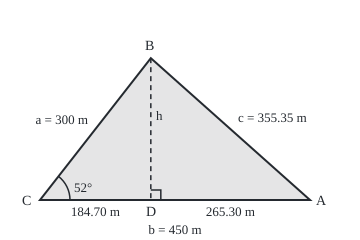
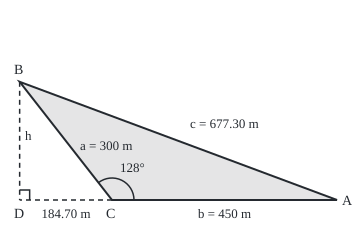

# Law of cosines: Pythagoras with a correction term for any angle

[Syllabus](../../../SYLLABUS.md) → [Geometry and trig](../README.md) → [Trigonometry](../README.md#s03) → Law of cosines

---

## General Overview

A surveyor sets a tripod at a point C. Two landmarks are in view: a marker post B and a pylon A. A laser rangefinder reads 300 m to the marker and 450 m to the pylon, and the tripod's dial reads 52° between the two sightings. A pond lies between marker and pylon, so no tape can cross it. How far apart are they?

Two sides and the angle between them fix a triangle: that is the SAS rule, side-angle-side, of [Congruent triangles](../01-Angles%2C%20Triangles%20and%20Congruence/03-congruent-triangles.md). The rule says the distance has one value, not what it is. The answer is 355.35 m.

At a right angle, Pythagoras would give 540.83 m ([Pythagoras](../01-Angles%2C%20Triangles%20and%20Congruence/05-pythagoras-and-its-converse.md)). A narrower angle draws the landmarks together; a wider one pushes them apart, to 677.30 m at 128°. The same measurements give the ground enclosed, 53190.73 square metres (5.32 hectares, a hectare being 10000 square metres), and three sides give back every angle.

**The square on the side facing an angle is the sum of the squares on the two sides that form the angle, minus twice their product times the angle's cosine; at a right angle the cosine is 0 and Pythagoras is left.**

**What kind of fact this is:** a theorem, proved on this card in Why it works from Pythagoras and the identity that a sine squared plus a cosine squared makes 1.

### The picture: the survey, to scale

<p align="center"></p>

Drawn at 1 m = 0.6 units. C is the surveyor, B the marker, A the pylon. The dashed height h from B meets the base at a right angle at D, splitting the 450 m sighting into a near piece of 184.70 m and a far piece of 265.30 m.

---

## The formula

Each side takes the small letter of the corner it faces: $c$, the distance across, faces the surveyor's corner $C$, where the sightings $a$ and $b$ meet. Cosine and sine are the ratios of [Sine, cosine and tangent](01-right-triangle-trigonometry.md), extended past 90° by [The unit circle](02-radians-and-the-unit-circle.md), where the cosine turns negative.

$$c^2 = a^2 + b^2 - 2ab\cos C$$

**Read it aloud:** square the two sightings and add; take away twice their product times the cosine of the angle between them; what is left is the distance across, squared.

Rearranged, it gives angle C from three sides; relabelling the corners gives the other two:

$$\cos C = \frac{a^2 + b^2 - c^2}{2ab}$$

The area $K$ uses the same two sides and angle:

$$K = \tfrac12\,ab\sin C$$

**Read it aloud:** half the product of two sides, times the sine of the angle between them.

| Symbol | Plain meaning | In our example | Push it up and the answer… |
| --- | --- | --- | --- |
| $a$, $b$ | the two sides meeting at C: the sightings | 300 m and 450 m | here, c grows |
| $C$ | the angle between them | 52° | c grows all the way to 180°; the area peaks at 90° |
| $c$ | the side facing C: the distance across | 355.35 m | the angle it faces opens |
| $A$, $B$ | the angles at the pylon and the marker | 41.70° and 86.30° | — |
| $\cos C$, $\sin C$ | cosine and sine of the angle at C | 0.61566148 and 0.78801075 | a bigger cosine takes more away |
| $h$, $D$ | the height from B, at a right angle to line CA; D, its foot | 236.40 m; D is 184.70 m from C | the area grows with h |
| $K$ | the area enclosed | 53190.73 square metres | — |
| $u$, $v$ | arrows from C to A and to B | 450 m and 300 m long | — |

### When it holds

- **Flat ground.** The proof runs on Pythagoras, a fact about a flat plane. Over hundreds of kilometres the Earth's curve takes over ([Triangles on a sphere](../06-Beyond%20Euclid/01-triangles-on-a-sphere.md)).
- **The angle between the known sides.** Given an angle facing a known side instead (SSA), the law becomes a quadratic in the unknown side, and there may be no triangle, one, or two: [Law of sines](07-law-of-sines-and-the-ambiguous-case.md).
- **Three sides that close.** For SSS (side-side-side), each side must be shorter than the other two together. Sides of 300, 450 and 800 m ask for a cosine of −1.2870; no angle has a cosine below −1, so no triangle exists.

---

## Why it works

### Step 0: cut the triangle into two right triangles

Pythagoras needs a right angle, and this triangle has none. So make two. From B, drop the height $h$ to the base line, meeting it at a right angle at $D$. The triangle becomes two right triangles sharing the height.

### Step 1: sine and cosine name the pieces

In the right triangle C, D, B, the 300 m sighting is the long side facing the right angle. So the height is $a\sin C$, 236.40 m, and the near piece of the base is $a\cos C$, 184.70 m. The far piece, from D to A, is $b - a\cos C$, 265.30 m.

### Step 2: Pythagoras on the far triangle

Triangle D, A, B has its right angle at D, short sides the far piece and the height, and long side c:

$$c^2 = (b - a\cos C)^2 + (a\sin C)^2$$

### Step 3: expand, and the identity collapses it

The first bracket expands to $b^2 - 2ab\cos C + a^2\cos^2 C$, where $\cos^2 C$ means the cosine squared; the second is $a^2\sin^2 C$. The terms carrying $a^2$ add to $a^2(\cos^2 C + \sin^2 C)$, and that bracket is 1 ([Trig identities](03-trig-identities.md)). What is left is the law. The correction is two rectangles, each the base $b$ by the near piece $a\cos C$, as Euclid drew it.

### Step 4: a wide angle pushes the foot outside

Open the sightings to 128°. The height now lands behind C, on the base line extended. Past 90° the cosine is negative, and the sign carries the geometry: the near piece is −184.70 m, meaning 184.70 m behind C, and the far piece grows to 634.70 m. Steps 2 and 3 go through unchanged. Subtracting a negative correction adds, giving 677.30 m against Pythagoras's 540.83 m. The foot can also land beyond A, when $a\cos C$ exceeds $b$: the far piece turns negative, and its square is unchanged.

### The picture: the same sightings opened to 128°

<p align="center"></p>

Drawn at 1 m = 0.5 units. The dashed base line runs 184.70 m back past C to the foot D; the height is still 236.40 m.

<details>
<summary>Detailed proof</summary>

Euclid (Book II, Propositions 12 and 13) used positive lengths only, so he split the cases that the signed near piece covers at once. Write CD for the length from C to the foot; Pythagoras in triangle B, D, C gives $a^2 = \text{CD}^2 + h^2$.

- **C obtuse, D behind C.** DA is $b + \text{CD}$, so $c^2 = a^2 + b^2 + 2b\,\text{CD}$. Angle B, C, D is 180° − C, with cosine $\text{CD}/a$; an angle and 180° minus it have cosines of equal size and opposite sign, so $2b\,\text{CD} = -2ab\cos C$.
- **C right, D at C.** CD and $\cos C$ are both 0, and Pythagoras stands.
- **C acute, D on A's side.** DA is $b - \text{CD}$ or $\text{CD} - b$, with the same square, so $c^2 = a^2 + b^2 - 2b\,\text{CD}$, where $\text{CD} = a\cos C$.

**The SSS range.** The fraction $(a^2 + b^2 - c^2)/(2ab)$ is below 1 exactly when $(a - b)^2 < c^2$, and above −1 exactly when $c^2 < (a + b)^2$: exactly when the three lengths close into a triangle.

</details>

### Step 5: the same height gives the area

Half the base times the height ([Area](../01-Angles%2C%20Triangles%20and%20Congruence/06-area-of-triangles-and-polygons.md)) is $\tfrac12 \times b \times a\sin C$: 53190.73 square metres. At 128° the height and so the area are unchanged, because an angle and 180° minus it share a sine.

### Step 6: run it backwards

From 0° to 180° the cosine falls steadily from 1 to −1, so each cosine names exactly one angle, which the inverse cosine returns ([Inverse trig](05-inverse-trig-and-solving-equations.md)). From 300, 450 and 355.35 m the rearranged law gives A = 41.70°, B = 86.30° and C = 52.00°, each found on its own. They add to 180.00°, as the angle sum requires ([Triangles](../01-Angles%2C%20Triangles%20and%20Congruence/02-triangle-angle-sum-and-inequality.md)). A sine could not do this: 52° and 128° share one.

A second route uses arrows. With $u$ the arrow from C to A and $v$ from C to B, the arrow across, from B to A, is $u - v$, and the dot product expands its squared length, bars meaning length:

$$\lvert u - v\rvert^2 = \lvert u\rvert^2 + \lvert v\rvert^2 - 2\,u \cdot v$$

Since $\lvert u\rvert = b$ and $\lvert v\rvert = a$, comparing with the law gives $u \cdot v = ab\cos C$: the fact [The dot product](../../03-Algebra/06-Dot%20Products%20and%20Best%20Fits/01-dot-product.md) left for this wing.

---

## Worked numbers, by hand

| Step | Arithmetic | Value |
| --- | --- | --- |
| square the sightings, add | $300^2 + 450^2$ | 292500.00 |
| the correction | $2 \times 300 \times 450 \times 0.61566148$ | 166228.60 |
| take it away | 292500.00 − 166228.60 | 126271.40 |
| square root | $\sqrt{126271.40}$ | **355.35 m** |
| the area | $\tfrac12 \times 300 \times 450 \times 0.78801075$ | **53190.73 square metres** |
| angle at the pylon | $\cos A = (450^2 + 355.35^2 - 300^2) \div (2 \times 450 \times 355.35) = 0.7466$ | **41.70°** |
| angle at the marker | $\cos B = (300^2 + 355.35^2 - 450^2) \div (2 \times 300 \times 355.35) = 0.0646$ | **86.30°** |
| check | 41.70 + 86.30 + 52.00 | 180.00 |

Marker and pylon stand 355.35 m apart across the pond, and the survey triangle encloses 5.32 hectares.

### What breaks if you drop a piece

| Mistake | Comes out at | What went wrong |
| --- | --- | --- |
| Drop the correction | 540.83 m | Pythagoras assumes a right angle at C |
| Forget the 2 | 457.59 m | Only one of the two rectangles is taken away |
| Calculator in radians | 580.09 m | 52 radians is another angle, with a negative cosine |
| Area with cosine for sine | 41557.15 square metres | $a\cos C$ is the near piece, not the height |

The code prints all four.

---

## Code, from first principles, and it actually runs

Python's math library supplies only cosine, sine and the square root. The distance takes two roads: the law, and a grid on which the landmarks sit at directions 20° and 72° from due east, their gap measured by Pythagoras, so the cosine of 52° is never taken. The area is half base times height, and again by Heron's rule from the three sides alone ([Area](../01-Angles%2C%20Triangles%20and%20Congruence/06-area-of-triangles-and-polygons.md)). The angles come back by halving an interval until the cosine matches.

### Python

```python
# Law of cosines -- the check behind the card.  Only cos, sin, sqrt and pi are
# imported.  A surveyor at C sights marker B 300 m away and pylon A 450 m away,
# 52 degrees apart.  Distance, area and angles are each reached by two roads.
from math import cos, sin, sqrt, pi
a, b, C = 300.0, 450.0, 52.0                  # the two sightings (m), the angle between

def rad(deg): return deg * pi / 180           # degrees to radians, for cos and sin
def law(a, b, deg):                           # road one: the law of cosines
    return sqrt(a * a + b * b - 2 * a * b * cos(rad(deg)))

def grid(a, b, deg, turn=20.0):               # road two: two directions on a grid,
    ax, ay = b * cos(rad(turn)), b * sin(rad(turn))               # pylon at 20 degrees,
    bx, by = a * cos(rad(turn + deg)), a * sin(rad(turn + deg))   # marker deg further
    return sqrt((ax - bx) ** 2 + (ay - by) ** 2)                  # round; Pythagoras

def angle_back(q):                            # the angle from 0 to 180 whose cosine is q,
    lo, hi = 0.0, 180.0                       # found by halving: cos falls steadily there
    for _ in range(100):
        mid = (lo + hi) / 2
        lo, hi = (mid, hi) if cos(rad(mid)) > q else (lo, mid)
    return (lo + hi) / 2
def cos_facing(x, y, z):                      # SSS: cosine of the angle facing side x
    return (y * y + z * z - x * x) / (2 * y * z)

def figure(name, deg, scale, x0):             # corners of the drawn figure, y pointing down
    bx, by = x0 + scale * a * cos(rad(deg)), 200 - scale * a * sin(rad(deg))
    print(f"figure, {name}, 1 m = {scale:.1f} units: C ({x0:.2f}, 200.00), "
          f"A ({x0 + scale * b:.2f}, 200.00), B ({bx:.2f}, {by:.2f}), foot ({bx:.2f}, 200.00)")

c, cg = law(a, b, C), grid(a, b, C)
h, near = a * sin(rad(C)), a * cos(rad(C))
K = 0.5 * b * h                               # half base times height
s = (a + b + cg) / 2                          # Heron, from the grid's three sides only
heron = sqrt(s * (s - a) * (s - b) * (s - cg))
qA, qB, qC = cos_facing(a, b, cg), cos_facing(b, a, cg), cos_facing(cg, a, b)
A_, B_, C_ = angle_back(qA), angle_back(qB), angle_back(qC)
print(f"sightings a = {a:.2f} m, b = {b:.2f} m, angle C = {C:.2f} degrees; "
      f"cos C = {cos(rad(C)):.8f}, sin C = {sin(rad(C)):.8f}")
print(f"a^2 + b^2 = {a * a + b * b:.2f}; correction 2ab cos C = {2 * a * b * cos(rad(C)):.2f}; c^2 = {c * c:.2f}")
print(f"SAS, c by the law: {c:.2f} m; by directions 20 and {20 + C:.0f} degrees on a grid: {cg:.2f} m")
print(f"height h = a sin C = {h:.2f} m; near piece a cos C = {near:.2f} m; far piece b - a cos C = {b - near:.2f} m")
print(f"area (1/2) b h = {K:.2f} m^2 = {K / 10000:.2f} hectares of 10000 m^2; Heron from three sides: {heron:.2f} m^2")
print(f"SSS, cos A = {qA:.4f}, cos B = {qB:.4f}, cos C = {qC:.4f}")
print(f"angles back by halving: A = {A_:.2f}, B = {B_:.2f}, C = {C_:.2f} degrees; sum {A_ + B_ + C_:.2f}")
for deg in (90.0, 128.0):
    print(f"at {deg:.0f} degrees: law {law(a, b, deg):.2f} m, grid {grid(a, b, deg):.2f} m, near piece "
          f"{a * cos(rad(deg)):.2f} m, far piece {b - a * cos(rad(deg)):.2f} m, area {0.5 * a * b * sin(rad(deg)):.2f} m^2")
print(f"no triangle: sides 300, 450, 800 m need cos C = {cos_facing(800.0, a, b):.4f}, below -1")
print(f"mistake, no correction: {sqrt(a * a + b * b):.2f} m; correction without the 2: "
      f"{sqrt(a * a + b * b - a * b * cos(rad(C))):.2f} m")
print(f"mistake, 52 read as radians: {sqrt(a * a + b * b - 2 * a * b * cos(C)):.2f} m; "
      f"area with cos for sin: {0.5 * a * b * cos(rad(C)):.2f} m^2")
figure("acute", C, 0.6, 40.0)
figure("obtuse", 128.0, 0.5, 112.0)
for deg in (C, 90.0, 128.0):
    assert abs(law(a, b, deg) - grid(a, b, deg)) < 1e-9     # two roads, one distance
assert abs(K - heron) < 1e-6                                 # two roads, one area
assert abs(C_ - C) < 1e-9                                    # SSS hands back the SAS angle
assert abs(A_ + B_ + C_ - 180.0) < 1e-9                      # three separate angles close up
print("ALL CHECKS PASS")
```

**Ran 2026-09-24 on macOS, Python 3.14.6, standard library only. All checks passed. Output, pasted from the run:**

```
sightings a = 300.00 m, b = 450.00 m, angle C = 52.00 degrees; cos C = 0.61566148, sin C = 0.78801075
a^2 + b^2 = 292500.00; correction 2ab cos C = 166228.60; c^2 = 126271.40
SAS, c by the law: 355.35 m; by directions 20 and 72 degrees on a grid: 355.35 m
height h = a sin C = 236.40 m; near piece a cos C = 184.70 m; far piece b - a cos C = 265.30 m
area (1/2) b h = 53190.73 m^2 = 5.32 hectares of 10000 m^2; Heron from three sides: 53190.73 m^2
SSS, cos A = 0.7466, cos B = 0.0646, cos C = 0.6157
angles back by halving: A = 41.70, B = 86.30, C = 52.00 degrees; sum 180.00
at 90 degrees: law 540.83 m, grid 540.83 m, near piece 0.00 m, far piece 450.00 m, area 67500.00 m^2
at 128 degrees: law 677.30 m, grid 677.30 m, near piece -184.70 m, far piece 634.70 m, area 53190.73 m^2
no triangle: sides 300, 450, 800 m need cos C = -1.2870, below -1
mistake, no correction: 540.83 m; correction without the 2: 457.59 m
mistake, 52 read as radians: 580.09 m; area with cos for sin: 41557.15 m^2
figure, acute, 1 m = 0.6 units: C (40.00, 200.00), A (310.00, 200.00), B (150.82, 58.16), foot (150.82, 200.00)
figure, obtuse, 1 m = 0.5 units: C (112.00, 200.00), A (337.00, 200.00), B (19.65, 81.80), foot (19.65, 200.00)
ALL CHECKS PASS
```

### Rust

Same numbers, same labels, built with `rustc --edition 2021 -O`.

```rust
// Law of cosines -- the same check as the Python, in Rust.  No crates.  A
// surveyor at C sights marker B 300 m away and pylon A 450 m away, 52 degrees
// apart.  Distance, area and angles are each reached by two roads.
use std::f64::consts::PI;
const A_SIDE: f64 = 300.0; // a, the sighting to the marker (m)
const B_SIDE: f64 = 450.0; // b, the sighting to the pylon (m)
const C_DEG: f64 = 52.0; // the angle between them

fn rad(deg: f64) -> f64 { deg * PI / 180.0 } // degrees to radians, for cos and sin

fn law(a: f64, b: f64, deg: f64) -> f64 { // road one: the law of cosines
    (a * a + b * b - 2.0 * a * b * rad(deg).cos()).sqrt()
}

fn grid(a: f64, b: f64, deg: f64) -> f64 { // road two: two directions on a grid,
    let turn = 20.0; // pylon at 20 degrees, marker deg further round
    let (ax, ay) = (b * rad(turn).cos(), b * rad(turn).sin());
    let (bx, by) = (a * rad(turn + deg).cos(), a * rad(turn + deg).sin());
    ((ax - bx).powi(2) + (ay - by).powi(2)).sqrt() // Pythagoras
}

fn angle_back(q: f64) -> f64 { // the angle from 0 to 180 whose cosine is q,
    let (mut lo, mut hi) = (0.0_f64, 180.0_f64); // found by halving: cos falls steadily
    for _ in 0..100 {
        let mid = (lo + hi) / 2.0;
        if rad(mid).cos() > q { lo = mid } else { hi = mid }
    }
    (lo + hi) / 2.0
}

fn cos_facing(x: f64, y: f64, z: f64) -> f64 { // SSS: cosine of the angle facing side x
    (y * y + z * z - x * x) / (2.0 * y * z)
}

fn figure(name: &str, deg: f64, scale: f64, x0: f64) { // corners of the drawn figure
    let (bx, by) = (x0 + scale * A_SIDE * rad(deg).cos(), 200.0 - scale * A_SIDE * rad(deg).sin());
    println!("figure, {}, 1 m = {:.1} units: C ({:.2}, 200.00), A ({:.2}, 200.00), B ({:.2}, {:.2}), foot ({:.2}, 200.00)",
             name, scale, x0, x0 + scale * B_SIDE, bx, by, bx);
}

fn main() {
    let (a, b, c_deg) = (A_SIDE, B_SIDE, C_DEG);
    let (c, cg) = (law(a, b, c_deg), grid(a, b, c_deg));
    let (h, near) = (a * rad(c_deg).sin(), a * rad(c_deg).cos());
    let k = 0.5 * b * h; // half base times height
    let s = (a + b + cg) / 2.0; // Heron, from the grid's three sides only
    let heron = (s * (s - a) * (s - b) * (s - cg)).sqrt();
    let (qa, qb, qc) = (cos_facing(a, b, cg), cos_facing(b, a, cg), cos_facing(cg, a, b));
    let (aa, bb, cc) = (angle_back(qa), angle_back(qb), angle_back(qc));
    println!("sightings a = {:.2} m, b = {:.2} m, angle C = {:.2} degrees; cos C = {:.8}, sin C = {:.8}",
             a, b, c_deg, rad(c_deg).cos(), rad(c_deg).sin());
    println!("a^2 + b^2 = {:.2}; correction 2ab cos C = {:.2}; c^2 = {:.2}", a * a + b * b, 2.0 * a * b * rad(c_deg).cos(), c * c);
    println!("SAS, c by the law: {:.2} m; by directions 20 and {:.0} degrees on a grid: {:.2} m", c, 20.0 + c_deg, cg);
    println!("height h = a sin C = {:.2} m; near piece a cos C = {:.2} m; far piece b - a cos C = {:.2} m", h, near, b - near);
    println!("area (1/2) b h = {:.2} m^2 = {:.2} hectares of 10000 m^2; Heron from three sides: {:.2} m^2", k, k / 10000.0, heron);
    println!("SSS, cos A = {:.4}, cos B = {:.4}, cos C = {:.4}", qa, qb, qc);
    println!("angles back by halving: A = {:.2}, B = {:.2}, C = {:.2} degrees; sum {:.2}", aa, bb, cc, aa + bb + cc);
    for deg in [90.0, 128.0] {
        println!("at {:.0} degrees: law {:.2} m, grid {:.2} m, near piece {:.2} m, far piece {:.2} m, area {:.2} m^2",
                 deg, law(a, b, deg), grid(a, b, deg), a * rad(deg).cos(), b - a * rad(deg).cos(), 0.5 * a * b * rad(deg).sin());
    }
    println!("no triangle: sides 300, 450, 800 m need cos C = {:.4}, below -1", cos_facing(800.0, a, b));
    println!("mistake, no correction: {:.2} m; correction without the 2: {:.2} m",
             (a * a + b * b).sqrt(), (a * a + b * b - a * b * rad(c_deg).cos()).sqrt());
    println!("mistake, 52 read as radians: {:.2} m; area with cos for sin: {:.2} m^2",
             (a * a + b * b - 2.0 * a * b * c_deg.cos()).sqrt(), 0.5 * a * b * rad(c_deg).cos());
    figure("acute", c_deg, 0.6, 40.0);
    figure("obtuse", 128.0, 0.5, 112.0);
    for deg in [c_deg, 90.0, 128.0] {
        assert!((law(a, b, deg) - grid(a, b, deg)).abs() < 1e-9); // two roads, one distance
    }
    assert!((k - heron).abs() < 1e-6); // two roads, one area
    assert!((cc - c_deg).abs() < 1e-9); // SSS hands back the SAS angle
    assert!((aa + bb + cc - 180.0).abs() < 1e-9); // three separate angles close up
    println!("ALL CHECKS PASS");
}
```

**Ran 2026-09-24 on macOS, rustc 1.98.1, no crates. All checks passed. Output, pasted from the run:**

```
sightings a = 300.00 m, b = 450.00 m, angle C = 52.00 degrees; cos C = 0.61566148, sin C = 0.78801075
a^2 + b^2 = 292500.00; correction 2ab cos C = 166228.60; c^2 = 126271.40
SAS, c by the law: 355.35 m; by directions 20 and 72 degrees on a grid: 355.35 m
height h = a sin C = 236.40 m; near piece a cos C = 184.70 m; far piece b - a cos C = 265.30 m
area (1/2) b h = 53190.73 m^2 = 5.32 hectares of 10000 m^2; Heron from three sides: 53190.73 m^2
SSS, cos A = 0.7466, cos B = 0.0646, cos C = 0.6157
angles back by halving: A = 41.70, B = 86.30, C = 52.00 degrees; sum 180.00
at 90 degrees: law 540.83 m, grid 540.83 m, near piece 0.00 m, far piece 450.00 m, area 67500.00 m^2
at 128 degrees: law 677.30 m, grid 677.30 m, near piece -184.70 m, far piece 634.70 m, area 53190.73 m^2
no triangle: sides 300, 450, 800 m need cos C = -1.2870, below -1
mistake, no correction: 540.83 m; correction without the 2: 457.59 m
mistake, 52 read as radians: 580.09 m; area with cos for sin: 41557.15 m^2
figure, acute, 1 m = 0.6 units: C (40.00, 200.00), A (310.00, 200.00), B (150.82, 58.16), foot (150.82, 200.00)
figure, obtuse, 1 m = 0.5 units: C (112.00, 200.00), A (337.00, 200.00), B (19.65, 81.80), foot (19.65, 200.00)
ALL CHECKS PASS
```

The two outputs match line for line.

> [!TIP]
> **Try changing**
> Guess first, then run it.
> - **Square the corner.** Set `C` (in Rust, `C_DEG`) to `90.0`: 540.83 m, Pythagoras exactly, and every assert passes.
> - **Drop the 2.** In `law`, make `2 * a * b` into `a * b`: the law says 457.59 m against the grid's 355.35 m, and the first assert stops it.
> - **Wrong ratio for the height.** Give the height `cos` for `sin`: 41557.15 square metres against Heron's 53190.73, and the second assert stops it.

---

## The usual mistake

> [!warning]
> **Pairing the angle with the wrong side.** The cosine belongs to the angle between the two known sides. Measure 52° at the pylon instead and the data are SSA, which may fit no triangle, one, or two.
>
> - **Dropping the sign on a wide angle.** The cosine of 128° is negative. Its size alone gives 355.35 m, the 52° answer; the truth is 677.30 m.
> - **Stopping at the square.** 126271.40 is the distance squared. The distance is 355.35 m.
> - **Radians for degrees.** The same inputs give 580.09 m.

---

## Where you meet it in real life

- **Surveying across obstacles.** Two distances and the angle between fix a third no tape can cross. Surveying by distances alone, trilateration, solves each triangle from its three sides.
- **Robot arms and cranes.** Two rigid arms and the joint angle fix the tip's distance from the base; run backwards, a required reach sets the joint angle.
- **Navigation.** A boat sails two legs with a turn between them; the distance back to the start is the third side, and the angle between the legs is 180° minus the turn.

> **Say it back**
> The law of cosines finds the side facing an angle from the two sides that form it: Pythagoras, minus twice their product times the angle's cosine. At 90° the correction vanishes; past 90° the cosine is negative and the correction adds. Sightings of 300 m and 450 m at 52° put the landmarks 355.35 m apart, enclosing 53190.73 square metres. Rearranged, three sides give back each angle.

---

## What this builds on

- [Trig identities](03-trig-identities.md): a sine squared plus a cosine squared makes 1, the step that collapses the algebra to the law.

## Where this goes next

- [Law of sines](07-law-of-sines-and-the-ambiguous-case.md): triangles known from two angles and a side, or from an angle facing a known side.
- [Triangles on a sphere](../06-Beyond%20Euclid/01-triangles-on-a-sphere.md): the cosine rule on a globe, which shrinks to this card's law for small triangles.

An angle that faces a known side, rather than lying between two, can leave none, one or two triangles; the law of sines sorts them.

---

## Sources

Verified 24 Sep 2026: every link below resolves to the publisher's page.

- Euclid. *Elements*, Book II, Propositions 12 and 13, in D. E. Joyce's online edition, Clark University. [Proposition 12](https://mathcs.clarku.edu/~djoyce/elements/bookII/propII12.html) and [Proposition 13](https://mathcs.clarku.edu/~djoyce/elements/bookII/propII13.html). The law as squares and rectangles, before cosines had a name.
- Abramson, Jay, et al. *Precalculus 2e*, section 8.2. OpenStax, Rice University. [Section page](https://openstax.org/books/precalculus-2e/pages/8-2-non-right-triangles-law-of-cosines). The coordinate derivation, SAS and SSS solving, and Heron's formula.
- Gelfand, I. M., and Mark Saul. *Trigonometry*. Birkhäuser, 2001. [Publisher page](https://link.springer.com/book/10.1007/978-1-4612-0149-6). The chapter "Relationships in a Triangle" (pp. 67–90) carries the ratios beyond right triangles.
