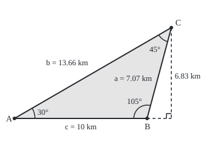
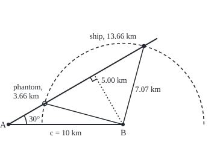

# Law of sines: sides opposite angles in fixed proportion, and the case with two answers

[Syllabus](../../../SYLLABUS.md) → [Geometry and trig](../../../SYLLABUS.md#w05) → [Trigonometry](../../../SYLLABUS.md#w05-s03) → Law of sines

---

## General Overview

Two lighthouses, A and B, stand 10 km apart on a straight coast. On a clear night both keepers sight one ship. At A the sightline makes 30° with the coast towards B; at B, 105° with the coast towards A. How far off is it?

Two angles and the side between them fix a triangle: the ASA rule, angle-side-angle, of [Congruent triangles](../01-Angles%2C%20Triangles%20and%20Congruence/03-congruent-triangles.md). So the ship has one position; the law of sines finds it: 13.66 km from A, 7.07 km from B, 6.83 km off the coast.

Then fog hides the ship from B, whose radar still reads its range: 7.07 km. A still sights it at 30°. An angle, the side beside it and the side facing it (SSA, side-side-angle) need not fix a triangle. A circle of 7.07 km about B crosses A's 30° sightline twice: at the ship, and at a phantom 3.66 km from A. Both fit every reading.

**Each side of a triangle over the sine of the angle it faces gives the same length, the diameter of the circle through the corners; two angles and a side fix every side, but two sides and an angle not between them can fit no triangle, one or two.**

**What kind of fact this is:** two theorems, the law and the count of SSA triangles, both proved on this card in Why it works; solving with them is a method.

### The picture: the clear-night fix, to scale

<p align="center"></p>

Drawn at 1 km = 22 units; C is the ship. The angle at B is past 90°, so the dashed square-on line (at right angles) from the ship meets the coast beyond B.

---

## The formula

Each side takes the small letter of the corner it faces; the capital also names the corner's angle. So $c$ is the baseline, $a$ the ship's distance from B, $b$ from A. In a right triangle an angle's sine is the side facing it over the longest side; its cosine, the side beside it over the longest ([Sine, cosine and tangent](01-right-triangle-trigonometry.md)). [The unit circle](02-radians-and-the-unit-circle.md) carries both past 90°, where an angle and 180° minus it share a sine. $R$ is the radius of the circle through the corners.

$$\frac{a}{\sin A} = \frac{b}{\sin B} = \frac{c}{\sin C} = 2R$$

**Read it aloud:** each side, divided by the sine of the angle facing it, gives the same length, the diameter of the circle through the three corners.

In the fog the law runs backwards, from the range $a$:

$$\sin C = \frac{c \sin A}{a}$$

**Read it aloud:** the sine of the ship's angle is the baseline times the sine of A, over the range.

A sine between 0 and 1 belongs to two angles under 180°: the one from 0° to 90° that the inverse sine, $\arcsin$, returns ([Inverse trig](05-inverse-trig-and-solving-equations.md)), and its mirror, 180° minus that. Each stands only if it leaves a positive angle at B. With $d = c \sin A$, B's square-on distance to A's sightline, and A below 90°:

| Range from B | Triangles | In the fog, d = 5.00 km |
| --- | --- | --- |
| under d | none | 4 km: the circle misses |
| equal to d | one, right-angled at the ship | 5 km: touches, 8.66 km from A |
| between d and c | two | 7.07 km: ship and phantom |
| c or more | one | 12 km: one crossing is behind A |

With A at 90° or more, one triangle if the range exceeds c, none otherwise.

| Symbol | Plain meaning | In our example | Push it up and the answer… |
| --- | --- | --- | --- |
| $A$, $B$, $C$ | lighthouses A and B, the ship, and the angles there | 30°, 105°, 45° | a bigger A or B pushes the ship out |
| $a$, $b$, $c$ | the sides facing A, B, C | 7.07, 13.66, 10 km | in the fog, a longer range $a$ gives none, one, two, one |
| $\sin$, $\cos$ | sine and cosine of an angle | sin 30° = 0.5000 | sine rises to 1 at 90°, then falls |
| $R$ | radius of the circle through the corners | 7.07 km | — |
| $h$ | the ship's square-on distance from the coast | 6.83 km | — |
| $d$ | B's square-on distance to A's sightline | 5.00 km | — |
| $t$, $t_1$, $t_2$ | distance along A's sightline; its two solutions | 3.66, 13.66 km | — |
| $\arcsin$ | the calculator's angle for a sine; 0° to 90° if the sine is positive | arcsin 0.7071 = 45° | — |

### When it holds

- **Flat ground.** Across an ocean the sides are arcs, with a law of their own ([Triangles on a sphere](../06-Beyond%20Euclid/01-triangles-on-a-sphere.md)).
- **Each side over the sine of the angle it faces.** B's range faces A, so it goes over sin A; a wrong pairing fails silently.
- **A range clear of d.** Near 5 km the circle grazes the sightline; a small error flips the count between none and two.

---

## Why it works

### Step 0: one height, measured from both ends

Measure the ship's square-on distance from the coast, $h$, from each lighthouse. From A, $h = b \sin A$. B's angle is past 90°, so its right triangle lies beyond B, with angle 180° − 105° = 75°, which has the same sine: $h = a \sin 75° = a \sin B$. Both give 6.83 km:

$$b \sin A = a \sin B$$

Divide by $\sin A$ and by $\sin B$, and the first two ratios are equal. At a corner under 90° the right triangle lies inside and uses the angle itself, so this holds for every triangle.

### Step 1: a second height gives the third ratio

The height from B onto A's sightline is $c \sin A$ from A and $a \sin C$ from the ship, so $a / \sin A = c / \sin C$. It is 5.00 km, the fog's $d$.

### Step 2: the common ratio is a diameter

Three corners not in a line lie on one circle: the square-on lines through the midpoints of two sides cross at a point equally far from all three. Draw the diameter from A to E. A diameter is seen at a right angle from its circle ([Angles at a circle](../02-Circles%20and%20Solids/03-angles-in-a-circle.md)), so triangle A, B, E is right-angled at B and its angle at E has sine $c / 2R$. E and the ship see the baseline at equal angles from the same arc, or at angles adding to 180° from opposite arcs; the sines match, so $c / \sin C = 2R$. (If the baseline is a diameter, the ship's angle is 90° and $c = 2R$ at once.) With A at (0, 0) and B at (10, 0) in km, the centre is (5.00, 5.00): diameter 14.1421 km.

### Step 3: two angles and a side give one triangle

The angle sum gives 45° at the ship ([Triangles](../01-Angles%2C%20Triangles%20and%20Congruence/02-triangle-angle-sum-and-inequality.md)). The known side sets the ratio, 14.1421 km; each side is that ratio times its angle's sine. AAS data, two angles and a side not between them, reduce to this the same way. One answer, because ASA is a congruence test.

### The picture: the fog, to scale

<p align="center"></p>

Drawn at 1 km = 19 units. B's dotted square-on line lands midway between the two crossings.

### Step 4: SSA, a circle crossing a line

In the fog the sines give 45° or 135° at the ship, leaving 105° or 15° at B. The grid shows both are real. The point $t$ km out along A's sightline sits at ($t \cos A$, $t \sin A$). By Pythagoras and $\cos^2 A + \sin^2 A = 1$ ([Trig identities](03-trig-identities.md)), its distance from B equals the range when

$$t^2 - 2ct\cos A + c^2 - a^2 = 0$$

that is, $(t - c\cos A)^2 = a^2 - d^2$, so $t = c\cos A \pm \sqrt{a^2 - d^2}$; for the fog's range, 8.66 km plus or minus 5.00 km. A range under $d$ puts a negative number under the root: no crossing. Only $t$ above 0 is a ship.

<details>
<summary>Detailed proof: none, one or two</summary>

Call the crossings $t_1$ and $t_2$. The quadratic is $(t - t_1)(t - t_2)$; multiplying out shows they add to $2c\cos A$ and multiply to $c^2 - a^2$.

- **Range under d:** no crossing.
- **A below 90°, range d:** one crossing, $t = c\cos A$, where B's line meets the sightline square on: a right angle at the ship.
- **A below 90°, range between d and c:** sum and product positive, so both crossings lie ahead.
- **A below 90°, range c or more:** product zero or negative, so exactly one lies ahead.
- **A at 90° or more:** the sum is not positive, so a crossing lies ahead only when the product is negative, a range over c; then exactly one does.

</details>

At corner A, with $b$ unknown, the law of cosines ([Law of cosines](06-law-of-cosines.md)) is this quadratic, with $b$ for $t$.

---

## Worked numbers, by hand

| Step | Arithmetic | Value |
| --- | --- | --- |
| angle at the ship | 180° − 30° − 105° | 45° |
| common ratio | 10 ÷ 0.7071 | 14.1421 km |
| ship to B | 14.1421 × 0.5000 | **7.07 km** |
| ship to A | 14.1421 × 0.9659 | **13.66 km** |
| off the coast | 13.66 × 0.5000 | **6.83 km** |
| fog: sine at the ship | 10 × 0.5000 ÷ 7.07 | 0.707 |
| two angles, and B | 45° or 135°, leaving 105° or 15° | two triangles |
| distance from A | 7.07 × 0.9659 ÷ 0.5, or 7.07 × 0.2588 ÷ 0.5 | **13.66 or 3.66 km** |

The ship is 13.66 km from A; the fog's readings also fit a vessel 3.66 km from A.

### What breaks if you drop a piece

| Mistake | Comes out at | What went wrong |
| --- | --- | --- |
| Only the calculator's angle | one ship, 13.66 km | the mirror, 135°, gives a second, 3.66 km |
| Sides in proportion to angles | 24.75 km, not 13.66 | 105° is 3.50 times 30°; its sine only 1.93 times |
| Both mirrors kept, 12 km range | a ship with B = −5.38° | 155.38° plus 30° passes 180°; that crossing is 2.25 km behind A |

The code prints all three.

---

## Code, from first principles, and it actually runs

Two independent roads for each part. The fix: the law of sines, against the sightlines crossed on a grid by Cramer's rule (two equations solved by determinants), which never uses the ship's 45°. The fog, at four ranges: the sine and its mirror, against the quadratic. The inverse sine is found by halving an interval, not imported.

### Python

```python
# Law of sines and the ambiguous case -- the check behind the card.  Imports only
# sin, cos, sqrt and pi.  Lighthouses A and B, 10 km apart, fix ship C by two
# bearings (ASA), then in fog by A's bearing and B's radar range (SSA).  Two roads each.
from math import sin, cos, sqrt, pi
c, A, B, TOL = 10.0, 30.0, 105.0, 1e-9       # baseline (km); angles at A and B (degrees)
sn, cs = (lambda d: sin(d * pi / 180)), (lambda d: cos(d * pi / 180))   # sine, cosine in degrees
def arcsin(q):                                # the angle from 0 to 90 whose sine is q,
    lo, hi = 0.0, 90.0                        # by halving: the sine rises steadily there
    for _ in range(100):
        mid = (lo + hi) / 2
        lo, hi = (mid, hi) if sn(mid) < q else (lo, mid)
    return (lo + hi) / 2

def by_sines(a):                              # SSA road one: sin C = c sin A / a, and its mirror
    q = c * sn(A) / a
    Cs = [] if q > 1 + TOL else [90.0] if q > 1 - TOL else [arcsin(q), 180 - arcsin(q)]
    return q, [(C, 180 - A - C, a * sn(180 - A - C) / sn(A)) for C in Cs if 180 - A - C > TOL]

def by_grid(a):                               # SSA road two: A at (0, 0), B at (c, 0).  The point
    p, e = c * cs(A), (c * cs(A)) ** 2 - (c * c - a * a)    # t along A's sightline is a from B
    return [] if e < -TOL else [p] if e < TOL else [p - sqrt(e), p + sqrt(e)]  # t^2 - 2pt + c^2 - a^2 = 0

C = 180 - A - B                               # ASA: the third angle, from the angle sum
k = c / sn(C)                                 # the common ratio: a side over the sine facing it
a, b = k * sn(A), k * sn(B)                   # road one: the law of sines
ux, uy, vx, vy = cs(A), sn(A), cs(180 - B), sn(180 - B)   # road two: sightlines from A and B
t = -c * vy / (vx * uy - ux * vy)             # t (ux, uy) = (c, 0) + w (vx, vy), by Cramer's rule
px, py = t * ux, t * uy                       # the ship on the grid; C = 45 is never used
ga, gb = sqrt((px - c) ** 2 + py ** 2), sqrt(px ** 2 + py ** 2)
oy = (px * px + py * py - c * px) / (2 * py)  # centre (c/2, oy): as far from the ship as from A, B
print(f"ASA: c = {c:.2f} km, A = {A:.2f}, B = {B:.2f}, so C = {C:.2f} degrees; sin A = {sn(A):.4f}, sin B = {sn(B):.4f}, sin C = {sn(C):.4f}")
print(f"road one, law of sines: c / sin C = {k:.4f} km, so a = {a:.2f} km (ship to B), b = {b:.2f} km (ship to A)")
print(f"road two, sightlines at {A:.0f} and {180 - B:.0f} degrees on a grid: ship at ({px:.2f}, {py:.2f}); a = {ga:.2f} km, b = {gb:.2f} km")
print(f"one height, two ways: b sin A = {b * sn(A):.2f} km, a sin B = {a * sn(B):.2f} km")
print(f"circle through A, B and ship: centre ({c / 2:.2f}, {oy:.2f}), diameter {2 * sqrt(c * c / 4 + oy * oy):.4f} km")
print(f"SSA: A = {A:.2f}, c = {c:.2f} km; c cos A = {c * cs(A):.2f} km, gap from B to A's sightline d = c sin A = {c * sn(A):.2f} km")
counts, sides = [], []
for r in (4.0, 5.0, a, 12.0):                 # B's radar range; a is the true ship's
    q, tri = by_sines(r)
    roots = [x for x in by_grid(r) if x > TOL]
    counts.append((len(tri), len(roots)))
    sides += list(zip(sorted(x[2] for x in tri), roots))
    print(f"range {r:.2f} km: sin C = {q:.4f}; triangles by sines {len(tri)}, by the grid {len(roots)}")
    for Cx, Bx, bx in tri:
        print(f"  C = {Cx:.2f}, B = {Bx:.2f}, sin B = {sn(Bx):.4f}, b = {bx:.2f} km")
m = arcsin(by_sines(12.0)[0])                 # the calculator's angle at a 12 km range
print(f"mistake, both mirrors kept at 12 km: C = {180 - m:.2f} leaves B = {m - A:.2f}; "
      f"the grid's other crossing is {by_grid(12.0)[0]:.2f} km, behind A")
print(f"mistake, sides in proportion to angles: b = {a * B / A:.2f} km; sin B / sin A = {sn(B) / sn(A):.2f}, not {B / A:.2f}")
fix = lambda x, y: f"({24 + 22 * x:.2f}, {196 - 22 * y:.2f})"   # km to figure units, y pointing down
fog = lambda x, y: f"({14 + 19 * x:.2f}, {206 - 19 * y:.2f})"
foot, ph = c * cs(A), by_grid(a)[0]           # fog: foot of B's square-on line; the phantom
print(f"figure, fix, 1 km = 22 units: A {fix(0, 0)}, B {fix(c, 0)}, ship {fix(px, py)}, foot {fix(px, 0)}")
print(f"figure, fog, 1 km = 19 units: A {fog(0, 0)}, B {fog(c, 0)}, foot {fog(foot * cs(A), foot * sn(A))}, "
      f"ship {fog(px, py)}, phantom {fog(ph * cs(A), ph * sn(A))}, radius {19 * a:.2f}")
assert max(abs(a - ga), abs(b - gb)) < 1e-9                   # ASA: sines and grid agree
assert abs(2 * sqrt(c * c / 4 + oy * oy) - k) < 1e-9          # the common ratio is the circle's diameter
assert counts == [(0, 0), (1, 1), (2, 2), (1, 1)]             # SSA: none, one, two, one, by both roads
assert max(abs(x - y) for x, y in sides) < 1e-9               # and the same distances, road for road
print("ALL CHECKS PASS")
```

**Ran 2026-09-24 on macOS, Python 3.14.6, standard library only. All checks passed. Output, pasted from the run:**

```
ASA: c = 10.00 km, A = 30.00, B = 105.00, so C = 45.00 degrees; sin A = 0.5000, sin B = 0.9659, sin C = 0.7071
road one, law of sines: c / sin C = 14.1421 km, so a = 7.07 km (ship to B), b = 13.66 km (ship to A)
road two, sightlines at 30 and 75 degrees on a grid: ship at (11.83, 6.83); a = 7.07 km, b = 13.66 km
one height, two ways: b sin A = 6.83 km, a sin B = 6.83 km
circle through A, B and ship: centre (5.00, 5.00), diameter 14.1421 km
SSA: A = 30.00, c = 10.00 km; c cos A = 8.66 km, gap from B to A's sightline d = c sin A = 5.00 km
range 4.00 km: sin C = 1.2500; triangles by sines 0, by the grid 0
range 5.00 km: sin C = 1.0000; triangles by sines 1, by the grid 1
  C = 90.00, B = 60.00, sin B = 0.8660, b = 8.66 km
range 7.07 km: sin C = 0.7071; triangles by sines 2, by the grid 2
  C = 45.00, B = 105.00, sin B = 0.9659, b = 13.66 km
  C = 135.00, B = 15.00, sin B = 0.2588, b = 3.66 km
range 12.00 km: sin C = 0.4167; triangles by sines 1, by the grid 1
  C = 24.62, B = 125.38, sin B = 0.8154, b = 19.57 km
mistake, both mirrors kept at 12 km: C = 155.38 leaves B = -5.38; the grid's other crossing is -2.25 km, behind A
mistake, sides in proportion to angles: b = 24.75 km; sin B / sin A = 1.93, not 3.50
figure, fix, 1 km = 22 units: A (24.00, 196.00), B (244.00, 196.00), ship (284.26, 45.74), foot (284.26, 196.00)
figure, fog, 1 km = 19 units: A (14.00, 206.00), B (204.00, 206.00), foot (156.50, 123.73), ship (238.77, 76.23), phantom (74.23, 171.23), radius 134.35
ALL CHECKS PASS
```

### Rust

Same numbers, same labels, built with `rustc --edition 2021 -O`.

```rust
// Law of sines and the ambiguous case -- the same check as the Python, in Rust.
// No crates.  Lighthouses A and B, 10 km apart, fix ship C by two bearings (ASA),
// then in fog by A's bearing and B's radar range (SSA).  Two roads each.
use std::f64::consts::PI;
const C_KM: f64 = 10.0; // c, the baseline between the lighthouses (km)
const A_DEG: f64 = 30.0; // the angle at A (degrees)
const B_DEG: f64 = 105.0; // the angle at B
const TOL: f64 = 1e-9;

fn sn(d: f64) -> f64 { (d * PI / 180.0).sin() } // sine and cosine of an angle in degrees
fn cs(d: f64) -> f64 { (d * PI / 180.0).cos() }
fn arcsin(q: f64) -> f64 { // the angle from 0 to 90 whose sine is q,
    let (mut lo, mut hi) = (0.0_f64, 90.0_f64); // by halving: the sine rises steadily there
    for _ in 0..100 {
        let mid = (lo + hi) / 2.0;
        if sn(mid) < q { lo = mid } else { hi = mid }
    }
    (lo + hi) / 2.0
}

fn by_sines(a: f64) -> (f64, Vec<(f64, f64, f64)>) { // SSA road one: sin C = c sin A / a, and its mirror
    let q = C_KM * sn(A_DEG) / a;
    let cands = if q > 1.0 + TOL { vec![] } else if q > 1.0 - TOL { vec![90.0] } else { vec![arcsin(q), 180.0 - arcsin(q)] };
    let tri = cands.into_iter().filter(|&cc| 180.0 - A_DEG - cc > TOL)
        .map(|cc| (cc, 180.0 - A_DEG - cc, a * sn(180.0 - A_DEG - cc) / sn(A_DEG))).collect();
    (q, tri)
}

fn by_grid(a: f64) -> Vec<f64> { // SSA road two: A at (0, 0), B at (c, 0).  The point t along
    let p = C_KM * cs(A_DEG); // A's sightline is a from B when t^2 - 2pt + c^2 - a^2 = 0
    let e = p * p - (C_KM * C_KM - a * a);
    if e < -TOL { vec![] } else if e < TOL { vec![p] } else { vec![p - e.sqrt(), p + e.sqrt()] }
}
fn fix(x: f64, y: f64) -> String { format!("({:.2}, {:.2})", 24.0 + 22.0 * x, 196.0 - 22.0 * y) } // km to units, y down
fn fog(x: f64, y: f64) -> String { format!("({:.2}, {:.2})", 14.0 + 19.0 * x, 206.0 - 19.0 * y) }

fn main() {
    let (c, a_deg, b_deg) = (C_KM, A_DEG, B_DEG);
    let c_deg = 180.0 - a_deg - b_deg; // ASA: the third angle, from the angle sum
    let k = c / sn(c_deg); // the common ratio: a side over the sine facing it
    let (a, b) = (k * sn(a_deg), k * sn(b_deg)); // road one: the law of sines
    let (ux, uy, vx, vy) = (cs(a_deg), sn(a_deg), cs(180.0 - b_deg), sn(180.0 - b_deg)); // road two: sightlines
    let t = -c * vy / (vx * uy - ux * vy); // t (ux, uy) = (c, 0) + w (vx, vy), by Cramer's rule
    let (px, py) = (t * ux, t * uy); // the ship on the grid; C = 45 is never used
    let (ga, gb) = (((px - c).powi(2) + py * py).sqrt(), (px * px + py * py).sqrt());
    let oy = (px * px + py * py - c * px) / (2.0 * py); // centre (c/2, oy): as far from the ship as from A, B
    let diam = 2.0 * (c * c / 4.0 + oy * oy).sqrt();
    println!("ASA: c = {:.2} km, A = {:.2}, B = {:.2}, so C = {:.2} degrees; sin A = {:.4}, sin B = {:.4}, sin C = {:.4}", c, a_deg, b_deg, c_deg, sn(a_deg), sn(b_deg), sn(c_deg));
    println!("road one, law of sines: c / sin C = {:.4} km, so a = {:.2} km (ship to B), b = {:.2} km (ship to A)", k, a, b);
    println!("road two, sightlines at {:.0} and {:.0} degrees on a grid: ship at ({:.2}, {:.2}); a = {:.2} km, b = {:.2} km", a_deg, 180.0 - b_deg, px, py, ga, gb);
    println!("one height, two ways: b sin A = {:.2} km, a sin B = {:.2} km", b * sn(a_deg), a * sn(b_deg));
    println!("circle through A, B and ship: centre ({:.2}, {:.2}), diameter {:.4} km", c / 2.0, oy, diam);
    println!("SSA: A = {:.2}, c = {:.2} km; c cos A = {:.2} km, gap from B to A's sightline d = c sin A = {:.2} km", a_deg, c, c * cs(a_deg), c * sn(a_deg));
    let (mut counts, mut sides) = (vec![], vec![]);
    for r in [4.0, 5.0, a, 12.0] { // B's radar range; a is the true ship's
        let (q, tri) = by_sines(r);
        let roots: Vec<f64> = by_grid(r).into_iter().filter(|&x| x > TOL).collect();
        counts.push((tri.len(), roots.len()));
        let mut bs: Vec<f64> = tri.iter().map(|x| x.2).collect();
        bs.sort_by(|x, y| x.partial_cmp(y).unwrap());
        sides.extend(bs.into_iter().zip(roots.iter().copied()));
        println!("range {:.2} km: sin C = {:.4}; triangles by sines {}, by the grid {}", r, q, tri.len(), roots.len());
        for (cx, bx, sx) in &tri { println!("  C = {:.2}, B = {:.2}, sin B = {:.4}, b = {:.2} km", cx, bx, sn(*bx), sx) }
    }
    let m = arcsin(by_sines(12.0).0); // the calculator's angle at a 12 km range
    println!("mistake, both mirrors kept at 12 km: C = {:.2} leaves B = {:.2}; the grid's other crossing is {:.2} km, behind A",
             180.0 - m, m - a_deg, by_grid(12.0)[0]);
    println!("mistake, sides in proportion to angles: b = {:.2} km; sin B / sin A = {:.2}, not {:.2}",
             a * b_deg / a_deg, sn(b_deg) / sn(a_deg), b_deg / a_deg);
    let (foot, ph) = (c * cs(a_deg), by_grid(a)[0]); // fog: foot of B's square-on line; the phantom
    println!("figure, fix, 1 km = 22 units: A {}, B {}, ship {}, foot {}", fix(0.0, 0.0), fix(c, 0.0), fix(px, py), fix(px, 0.0));
    println!("figure, fog, 1 km = 19 units: A {}, B {}, foot {}, ship {}, phantom {}, radius {:.2}", fog(0.0, 0.0), fog(c, 0.0),
             fog(foot * cs(a_deg), foot * sn(a_deg)), fog(px, py), fog(ph * cs(a_deg), ph * sn(a_deg)), 19.0 * a);
    assert!((a - ga).abs().max((b - gb).abs()) < 1e-9); // ASA: sines and grid agree
    assert!((diam - k).abs() < 1e-9); // the common ratio is the circle's diameter
    assert!(counts == vec![(0, 0), (1, 1), (2, 2), (1, 1)]); // SSA: none, one, two, one, by both roads
    assert!(sides.iter().map(|(x, y)| (x - y).abs()).fold(0.0, f64::max) < 1e-9); // same distances
    println!("ALL CHECKS PASS");
}
```

**Ran 2026-09-24 on macOS, rustc 1.98.1, no crates. All checks passed. Output, pasted from the run:**

```
ASA: c = 10.00 km, A = 30.00, B = 105.00, so C = 45.00 degrees; sin A = 0.5000, sin B = 0.9659, sin C = 0.7071
road one, law of sines: c / sin C = 14.1421 km, so a = 7.07 km (ship to B), b = 13.66 km (ship to A)
road two, sightlines at 30 and 75 degrees on a grid: ship at (11.83, 6.83); a = 7.07 km, b = 13.66 km
one height, two ways: b sin A = 6.83 km, a sin B = 6.83 km
circle through A, B and ship: centre (5.00, 5.00), diameter 14.1421 km
SSA: A = 30.00, c = 10.00 km; c cos A = 8.66 km, gap from B to A's sightline d = c sin A = 5.00 km
range 4.00 km: sin C = 1.2500; triangles by sines 0, by the grid 0
range 5.00 km: sin C = 1.0000; triangles by sines 1, by the grid 1
  C = 90.00, B = 60.00, sin B = 0.8660, b = 8.66 km
range 7.07 km: sin C = 0.7071; triangles by sines 2, by the grid 2
  C = 45.00, B = 105.00, sin B = 0.9659, b = 13.66 km
  C = 135.00, B = 15.00, sin B = 0.2588, b = 3.66 km
range 12.00 km: sin C = 0.4167; triangles by sines 1, by the grid 1
  C = 24.62, B = 125.38, sin B = 0.8154, b = 19.57 km
mistake, both mirrors kept at 12 km: C = 155.38 leaves B = -5.38; the grid's other crossing is -2.25 km, behind A
mistake, sides in proportion to angles: b = 24.75 km; sin B / sin A = 1.93, not 3.50
figure, fix, 1 km = 22 units: A (24.00, 196.00), B (244.00, 196.00), ship (284.26, 45.74), foot (284.26, 196.00)
figure, fog, 1 km = 19 units: A (14.00, 206.00), B (204.00, 206.00), foot (156.50, 123.73), ship (238.77, 76.23), phantom (74.23, 171.23), radius 134.35
ALL CHECKS PASS
```

The two outputs match line for line.

> [!TIP]
> **Try changing**
> Guess first, then run it.
> - **Drop the mirror.** In `by_sines`, keep only `arcsin(q)`: at the 7.07 km range, one triangle by sines, two by the grid. The third assert stops it.
> - **Forget the angle sum.** Make `180 - A - C > TOL` read `True`: at 12 km a triangle with B = −5.38° appears. The third assert stops it.
> - **Wrong angle.** Change `sn(180 - A - C)` to `sn(C)` (Rust: `sn(cc)`): counts survive, distances do not. The fourth assert stops it.

---

## The usual mistake

> [!warning]
> **Taking the calculator's angle as the only angle.** The inverse sine returns one angle; its mirror has the same sine. In the fog the button gives 45° and 13.66 km, and would say so with the vessel at the mirror's 3.66 km. Test the mirror every time.
>
> - **Sides in proportion to the angles:** 24.75 km, not 13.66.
> - **Keeping every mirror.** At 12 km the mirror, 155.38°, plus 30° passes 180°.
> - **Trusting a count at the boundary.** A range read as 5 km may fit none or two.

---

## Where you meet it in real life

- **Triangulation.** Surveys before satellites measured one baseline and fixed every further point by angles: a chain of ASA triangles.
- **A sightline and a range.** Taken from two stations, they cross twice, as in the fog; a third reading picks one.
- **Star distances.** Sightings from opposite sides of the Earth's orbit make a thin ASA triangle, tiny-angled at the star ([Small angles](08-small-angles-and-the-sine-bound.md)).

> **Say it back**
> Each side over the sine of the angle it faces gives the same length, the diameter of the circle through the corners. One height, measured from both ends, proves the ratios equal. Two angles and a side fix the ship, 13.66 km from A. With SSA the facing side swings like a radius and meets the other line twice, once or never; in the fog, twice.

---

## What this builds on

- [Law of cosines](06-law-of-cosines.md): SAS and SSS triangles; written at corner A, the quadratic this card's grid road solves.

## Where this goes next

- [Small angles](08-small-angles-and-the-sine-bound.md): a thin triangle's tiny angle.
- [Triangles on a sphere](../06-Beyond%20Euclid/01-triangles-on-a-sphere.md): the law of sines on a globe, where sides are arcs.

Dividing by the tiny sine of a far ship's angle magnifies every error; how nearly that sine equals its angle, in radians, is the next card's question.

---

## Sources

Verified 24 Sep 2026: every link below resolves to the publisher's page.

- Abramson, Jay, et al. *Precalculus 2e*, section 8.1, "Non-right Triangles: Law of Sines." OpenStax, Rice University. [Section page](https://openstax.org/books/precalculus-2e/pages/8-1-non-right-triangles-law-of-sines). Heights, ASA, AAS and the SSA cases.
- Euclid. *Elements*, Book III, Proposition 20, ed. D. E. Joyce, Clark University. [Proposition 20](https://mathcs.clarku.edu/~djoyce/elements/bookIII/propIII20.html). The angle at the centre is twice that at the circle.
- Gelfand, I. M., and Mark Saul. *Trigonometry*. Birkhäuser, 2001. [Publisher page](https://link.springer.com/book/10.1007/978-1-4612-0149-6). Chapter "Relationships in a Triangle".
- O'Connor, J. J., and E. F. Robertson. "Nasir al-Din al-Tusi." MacTutor, University of St Andrews. [Biography](https://mathshistory.st-andrews.ac.uk/Biographies/Al-Tusi_Nasir/). His *Treatise on the quadrilateral* states the plane sine law.
