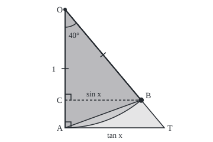
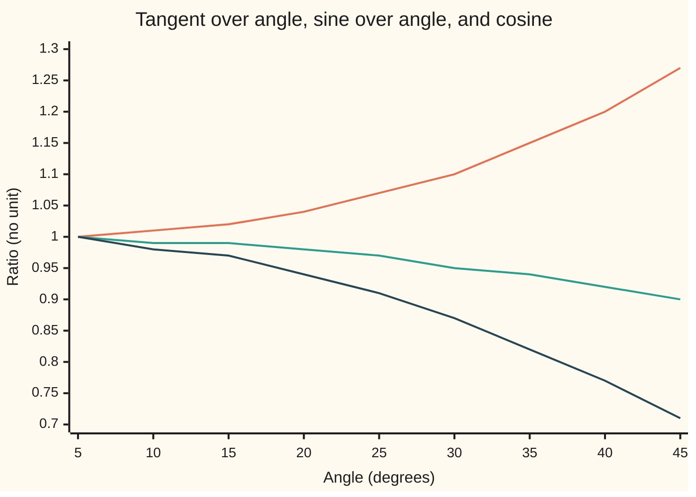

# Small angles: why sin x is nearly x, and the sandwich that proves it

[Syllabus](../../../SYLLABUS.md) → [Geometry and trig](../README.md) → [Trigonometry](../README.md#s03) → Small angles

---

## General Overview

A clock pendulum is 1 m long. Its bob is pulled 5° out from straight down. It sits 87.16 mm to the side of the vertical. Along its curved path it has swung 87.27 mm. The string's line, carried on, would cross the level line through the lowest point 87.49 mm out.

The pull that swings the bob back is its weight times the sine of the angle. Physics swaps that sine for the angle itself, in radians: the length of arc the angle cuts from a circle of radius 1 ([The unit circle](02-radians-and-the-unit-circle.md)). 5° is 0.0873 radians; its sine is 0.0872. The swap overstates the pull by 0.127% and makes the swing easy to predict.

Up to a right angle the three distances always come in that order, smallest first: the angle is sandwiched between its sine and its tangent. Three nested areas prove it.

**In radians, a triangle inside a slice of circle inside a larger triangle gives sine < angle < tangent up to a right angle, so a small angle's sine and tangent are both nearly the angle, off by a share of it that shrinks like the angle squared.**

**What kind of fact this is:** a theorem, proved on this card in Why it works; the small-angle rules it yields are approximations, each with its error stated.

### The picture: three shapes, one inside the next

<p align="center"></p>

Drawn at 40°, not 5°, so the shapes separate; radius 1 = 200 units. Pivot O (110, 16), lowest point A (110, 216), bob B (238.56, 169.21), and T (277.82, 216), where OB carried on meets the level line. Darkest: triangle OAB. Middle: the sector's sliver beyond the chord AB, the straight cut from A to B. Palest: triangle OAT beyond the arc. Dashed: CB, B's sideways offset, square to OA at C.

---

## The formula

Notation first. The angle is x, in radians, so 180° is π radians. Sine, cosine and tangent are the right-triangle ratios of [Sine, cosine and tangent](01-right-triangle-trigonometry.md). The sign ≈ reads "is approximately".

$$\sin x < x < \tan x \qquad \text{for } 0 < x < \tfrac{\pi}{2}$$

**Read it aloud:** up to a right angle, in radians, the sine is less than the angle, and the angle less than the tangent.

Dividing by x (Step 4) and putting a floor, a lower bound, under the cosine (Step 5) gives a chain whose links all sit near 1 when x is small, and so the small-angle rules:

$$1 - \frac{x^2}{2} < \cos x < \frac{\sin x}{x} < 1 < \frac{\tan x}{x} < \frac{1}{\cos x}$$

$$\sin x \approx x, \qquad \tan x \approx x, \qquad \cos x \approx 1 - \frac{x^2}{2}$$

The chain bounds each error: the sine falls short of x by less than the share $x^2/2$ of x, the tangent overshoots x by less than the share $1/\cos x - 1$, and the cosine overshoots its rule by less than $x^4/8$. At 5°: bounds 0.003808, 0.003820, 0.0000072; true errors 0.001269, 0.002546, 0.0000024.

| Symbol | Plain meaning | In our example | Push it up and the answer… |
| --- | --- | --- | --- |
| $x$ | the angle in radians: the arc it cuts from a circle of radius 1 | 5° = 0.087266 | sine's and tangent's errors, as shares of x, grow roughly as x squared |
| $\sin x$ | sideways offset of the arc's far end | 0.087156 | falls further below x |
| $\cos x$ | depth of the arc's far end below the centre | 0.996195 | — |
| $\tan x$ | sine ÷ cosine: the stretch AT along the level line | 0.087489 | climbs further above x |
| $\pi$ | circumference over diameter | 180° is π radians | — |
| $L$ | the pendulum's length | 1000 mm | lengths grow; ratios stay |
| O, A, B, C, T | pivot, lowest point, bob, foot of B's offset on OA, and where OB extended meets the level line | the picture | — |

### When it holds

- **Radians.** Only in radians is the angle an arc's length. Read as radians, the degree count 5 is 57.30 times x.
- **Between 0 and a right angle.** At 90° the line OB never meets the level line, and past it the tangent turns negative. Below 0 all three flip sign and the inequalities reverse.
- **Small enough for the accuracy wanted.** The bound keeps the sine within 1% of x up to 8.10°; the true edge is 14.06°.

---

## Why it works

### Step 0: compare areas, because curved lengths are hard

Comparing the curved arc with the straight stretch AT needs a theory of measuring curves. Areas are easier: a region inside another has less area, and the sector's area is already known. Halved, each of the three lengths is an area in the picture.

### Step 1: three shapes on one circle

Centre a circle of radius 1 on the pivot O. A is the lowest point, B the bob, turned x from OA. Drop a line from B square onto OA, at C. Triangle OCB has hypotenuse 1, so CB is $\sin x$ and OC is $\cos x$.

The level line through A touches the circle, so it meets the radius OA square on ([Angles at a circle](../02-Circles%20and%20Solids/03-angles-in-a-circle.md)). Carry OB on to meet it at T. Triangle OAT is right-angled at A with OA = 1, so AT = $\tan x$.

### Step 2: three areas

- **Triangle OAB:** base OA = 1, height CB, area $\tfrac12 \sin x$ ([Area](../01-Angles%2C%20Triangles%20and%20Congruence/06-area-of-triangles-and-polygons.md)).
- **Sector OAB:** half the radius squared times the angle, $\tfrac12 x$ ([Radians](../02-Circles%20and%20Solids/02-radians-arcs-and-sectors.md)).
- **Triangle OAT:** legs 1 and $\tan x$, area $\tfrac12 \tan x$.

At 5°: 0.043578, 0.043633 and 0.043744.

### Step 3: each shape sits inside the next

Triangle OAB is the sector minus the sliver beyond chord AB. Triangle OAT is the sector plus the corner beyond the arc. Both pieces have area above zero, so $\tfrac12 \sin x < \tfrac12 x < \tfrac12 \tan x$. Double each part: $\sin x < x < \tan x$.

<details>
<summary>Detailed proof: why the shapes nest, and why strictly</summary>

Call a point's **depth** its distance below O along OA. Depth never exceeds distance from O, as a leg never exceeds the hypotenuse.

**Sector inside triangle OAT.** Both are points inside angle AOB: the sector those within 1 of O, the triangle those with depth at most 1. The first forces the second. The triangle's points near T lie about 1/$\cos x$ from O, more than 1, so they are a leftover of positive area.

**Triangle OAB inside the sector.** A sector narrower than a half turn has no dents: the straight path between any two of its points stays inside. Holding O, A and B, it holds the whole triangle. The arc's midpoint is 1 from O, the chord's only $\cos(x/2)$: points between lie in the sector, not the triangle.

</details>

### Step 4: divide through

Divide $\sin x < x$ by the positive x: $\sin x / x < 1$. Multiply $x < \sin x / \cos x$ by the positive $\cos x / x$: $\cos x < \sin x / x$. Divide that pair by $\cos x$: $1 < \tan x / x < 1/\cos x$. At 5°: 0.996195 < 0.998731 < 1 < 1.002546 < 1.003820.

### Step 5: how far the cosine sits below 1

The half-angle rule of [Trig identities](03-trig-identities.md) gives $1 - \cos x = 2\sin^2(x/2)$, twice the squared sine of half the angle. Step 3 at half the angle gives $\sin(x/2) < x/2$, so $1 - \cos x < x^2/2$: the floor, 0.996192 against 0.996195 at 5°. Halve the angle and the cosine's distance below 1 roughly quarters. The bob's rise, $L(1 - \cos x)$, is 3.805 mm; the rule gives 3.808 mm.

<details>
<summary>Detailed proof: the cosine's ceiling, $x^4/8$ above the rule</summary>

Step 4 at half the angle gives $\sin(x/2) > (x/2)\cos(x/2)$. Square and double:
$$1 - \cos x = 2\sin^2(x/2) > \frac{x^2}{2}\cos^2(x/2) = \frac{x^2}{2}\left(1 - \sin^2(x/2)\right) > \frac{x^2}{2}\left(1 - \frac{x^2}{4}\right),$$
so $\cos x < 1 - x^2/2 + x^4/8$.

</details>

### The picture: the sandwich closing as the angle shrinks



Top: tan x ÷ x. Middle: sin x ÷ x. Bottom: cos x, its floor. All read 1.00 at 5°; by 40° they read 1.20, 0.92 and 0.77.

Calculus reaches the same rules through sine's rate of change ([Derivatives of sine and cosine](../../06-Calculus%20and%20analysis/02-Derivatives/04-derivatives-of-trig-functions.md)), but computes that rate from this chain. The bounds are cautious: the true shortfall, 0.001269, is a third of 0.003808.

---

## Worked numbers, by hand

| Step | Arithmetic | Value |
| --- | --- | --- |
| the angle | 5 × π ÷ 180 | 0.087266 |
| sine, by both roads | 30° halved, then a third; or the arc walked | 0.087156 |
| tangent | sine ÷ cosine, cosine 0.996195 | 0.087489 |
| sine over angle | 0.087156 ÷ 0.087266 | 0.998731 |
| on the pendulum | 1000 mm × each of the three | **87.16, 87.27, 87.49 mm** |
| the bob's rise | 1000 × (1 − 0.996195), and 1000 × x × x ÷ 2 | **3.805 mm and 3.808 mm** |

On the clock, the rules put the pull 0.127% high and the rise at 3.808 mm for 3.805 mm.

### What breaks if you drop a piece

| Mistake | Comes out at | What went wrong |
| --- | --- | --- |
| Degrees for radians: sin 5° ≈ 5 | 5, which is 57.30 times x | Only radians make the angle an arc |
| The angle for its sine at 40° | 0.698132 for 0.642788, 8.61% high | 40° is not small |
| The rise by $x^2$, not $x^2/2$ | 7.615 mm, not 3.805 mm | The half comes from $2\sin^2(x/2)$ |

The code prints all three.

---

## Code, from first principles, and it actually runs

Road one halves 30° to get sin 15°. It finds the sine s of 5° from the triple-angle rule `3s - 4s^3 = sin 15°` (the addition rule used twice) by a halving search: keep whichever half of a range holds the answer. The addition rule then steps on in 5s to 100°. Road two uses no trigonometry: it walks the arc round a circle of radius 1 in short steps, and the thin triangles it sweeps add up to the sector. Four asserts: the roads agree from 5° to 45°; the slices give x/2 between the triangles; the chain holds at all nine angles; 96 sides bracket π.

### Python

```python
# Small angles -- the check behind the card.  Nothing is imported.  A pendulum
# 1 m long swings 5 deg out from straight down.  Road one: sin 5 deg from exact
# values, the half-angle and triple-angle rules, then 5 deg added again and again.
# Road two: walk the arc round a circle of radius 1 in short chords.
PI, L = 3.141592653589793, 1000.0                # L: the pendulum's length in mm

def walk(x, step=1e-5):                          # road two: walk arc x from the lowest point
    c, s, done, area = 1.0, 0.0, 0.0, 0.0        # c: depth below the pivot, s: sideways
    while x - done > 1e-15:
        h = min(step, x - done)
        u, v = c - s * h, s + c * h              # a short step along the tangent line
        k = (u * u + v * v) ** -0.5              # pulled back onto the circle
        done += ((u * k - c) ** 2 + (v * k - s) ** 2) ** 0.5   # the arc, as chords
        area += (c * v - s * u) * k / 2          # the sector, as thin triangles from the pivot
        c, s = u * k, v * k
    return c, s, area
def halve(f, lo, hi):                            # halving search: f(lo) holds, f(hi) fails
    for _ in range(60):
        lo, hi = ((lo + hi) / 2, hi) if f((lo + hi) / 2) else (lo, (lo + hi) / 2)
    return lo

c30 = 3 ** 0.5 / 2
s15 = ((1 - c30) / 2) ** 0.5                     # half of 30 deg
s5 = halve(lambda s: 3 * s - 4 * s ** 3 < s15, 0.0, 0.5)   # a third of 15 deg
one, c, s, c5 = [], 1.0, 0.0, (1 - s5 * s5) ** 0.5
for k in range(1, 21):                           # road one at 5, 10, ... 100 deg
    c, s = c * c5 - s * s5, s * c5 + c * s5      # add 5 deg: the addition rule
    one.append((5 * k * PI / 180, c, s))
two = [walk(r[0]) for r in one[:9]]              # road two at 5, 10, ... 45 deg
(x, _, _), (wc, ws, wa), (x4, c4, s4) = one[0], two[0], one[7]
t = ws / wc
print(f"pendulum 1 m = {L:.0f} mm, swing 5 deg = 5 x pi / 180 = {x:.6f} rad; to four places sin {x:.4f} = {ws:.4f}")
print(f"sin 5 deg, road one (30 deg halved, then a third): {s5:.6f}; road two (arc walked): {ws:.6f}")
print(f"the sandwich at 5 deg: sin x {ws:.6f} < x {x:.6f} < tan x {t:.6f}")
print(f"areas: triangle OAB {ws / 2:.6f} < sector in thin slices {wa:.6f} (x / 2 = {x / 2:.6f}) < triangle OAT {t / 2:.6f}")
print(f"the chain: 1 - x^2/2 = {1 - x * x / 2:.6f} < cos x {wc:.6f} < sin x / x {ws / x:.6f} < 1 < tan x / x {t / x:.6f} < 1 / cos x {1 / wc:.6f}")
print(f"shortfalls: 1 - sin x / x = {1 - ws / x:.6f} (bound x^2/2 = {x * x / 2:.6f}); tan x / x - 1 = {t / x - 1:.6f} (bound {1 / wc - 1:.6f})")
print(f"cos x - (1 - x^2/2) = {wc - 1 + x * x / 2:.7f} (bound x^4/8 = {x ** 4 / 8:.7f}); x in place of sin x is {x / ws - 1:.3%} too high")
print(f"1 m pendulum, mm: sideways {L * ws:.2f}, along the arc {L * x:.2f}, to the tangent point {L * t:.2f}; "
      f"rise {L * (1 - wc):.3f}, by x^2/2 {L * x * x / 2:.3f}")
print(f"second case, 40 deg = {x4:.6f} rad: sin {s4:.6f} < x < tan {s4 / c4:.6f}; x in place of sin x is {x4 / s4 - 1:.2%} too high")
edge = halve(lambda y: walk(y, 1e-4)[1] / y > 0.99, 0.1, 0.5)
print(f"within 1% of x: the bound x^2/2 promises it to {0.02 ** 0.5 * 180 / PI:.2f} deg; walked, it holds to {edge * 180 / PI:.2f} deg")
sa, ca = 0.5, c30                                # Archimedes: 30 deg halved four times
for _ in range(4):
    sa, ca = ((1 - ca) / 2) ** 0.5, ((1 + ca) / 2) ** 0.5
print(f"Archimedes, 96 sides: {96 * sa:.6f} < pi < {96 * sa / ca:.6f}; his fractions {3 + 10 / 71:.6f} and {3 + 1 / 7:.6f}")
print("chart, angle in deg: " + " ".join(f"{5 * k}" for k in range(1, 10)))
for name, f in (("tan x / x", lambda w, y: w[1] / w[0] / y), ("sin x / x", lambda w, y: w[1] / y), ("cos x", lambda w, y: w[0])):
    print(f"chart, {name}: " + " ".join(f"{f(w, r[0]):.2f}" for w, r in zip(two, one)))
print(f"mistakes: 5 for x is {5 / x:.2f} times x; rise by x^2 {L * x * x:.3f} mm; at 100 deg tan x {one[19][2] / one[19][1]:.6f}, x {one[19][0]:.6f}")
print(f"figure, 40 deg, radius 1 = 200: O (110, 16), A (110, 216), B ({110 + 200 * s4:.2f}, {16 + 200 * c4:.2f}), T ({110 + 200 * s4 / c4:.2f}, 216), "
      f"arc end ({110 + 30 * s4:.2f}, {16 + 30 * c4:.2f}), OB tick ({110 + 100 * s4 + 6 * c4:.2f}, {16 + 100 * c4 - 6 * s4:.2f}) "
      f"to ({110 + 100 * s4 - 6 * c4:.2f}, {16 + 100 * c4 + 6 * s4:.2f})")
assert max(abs(r[2] - w[1]) for r, w in zip(one, two)) < 1e-10          # two roads, each sine
assert abs(wa - x / 2) < 1e-10 and ws / 2 < wa < t / 2                   # slices give x/2, nested
for (y, _, _), (cy, sy, _) in zip(one, two):     # the whole chain at every chart angle
    assert 1 - y * y / 2 < cy < sy / y < 1 < sy / cy / y and cy < 1 - y * y / 2 + y ** 4 / 8
assert 96 * sa < PI < 96 * sa / ca                                       # the sandwich brackets pi
print("ALL CHECKS PASS")
```

**Ran 2026-09-24 on macOS, Python 3.14.6, standard library only. All checks passed. Output, pasted from the run:**

```
pendulum 1 m = 1000 mm, swing 5 deg = 5 x pi / 180 = 0.087266 rad; to four places sin 0.0873 = 0.0872
sin 5 deg, road one (30 deg halved, then a third): 0.087156; road two (arc walked): 0.087156
the sandwich at 5 deg: sin x 0.087156 < x 0.087266 < tan x 0.087489
areas: triangle OAB 0.043578 < sector in thin slices 0.043633 (x / 2 = 0.043633) < triangle OAT 0.043744
the chain: 1 - x^2/2 = 0.996192 < cos x 0.996195 < sin x / x 0.998731 < 1 < tan x / x 1.002546 < 1 / cos x 1.003820
shortfalls: 1 - sin x / x = 0.001269 (bound x^2/2 = 0.003808); tan x / x - 1 = 0.002546 (bound 0.003820)
cos x - (1 - x^2/2) = 0.0000024 (bound x^4/8 = 0.0000072); x in place of sin x is 0.127% too high
1 m pendulum, mm: sideways 87.16, along the arc 87.27, to the tangent point 87.49; rise 3.805, by x^2/2 3.808
second case, 40 deg = 0.698132 rad: sin 0.642788 < x < tan 0.839100; x in place of sin x is 8.61% too high
within 1% of x: the bound x^2/2 promises it to 8.10 deg; walked, it holds to 14.06 deg
Archimedes, 96 sides: 3.141032 < pi < 3.142715; his fractions 3.140845 and 3.142857
chart, angle in deg: 5 10 15 20 25 30 35 40 45
chart, tan x / x: 1.00 1.01 1.02 1.04 1.07 1.10 1.15 1.20 1.27
chart, sin x / x: 1.00 0.99 0.99 0.98 0.97 0.95 0.94 0.92 0.90
chart, cos x: 1.00 0.98 0.97 0.94 0.91 0.87 0.82 0.77 0.71
mistakes: 5 for x is 57.30 times x; rise by x^2 7.615 mm; at 100 deg tan x -5.671282, x 1.745329
figure, 40 deg, radius 1 = 200: O (110, 16), A (110, 216), B (238.56, 169.21), T (277.82, 216), arc end (129.28, 38.98), OB tick (178.88, 88.75) to (169.68, 96.46)
ALL CHECKS PASS
```

### Rust

Same numbers, same labels, built with `rustc --edition 2021 -O`.

```rust
// Small angles -- the same check as the Python, in Rust.  No crates.  A pendulum
// 1 m long swings 5 deg out from straight down.  Road one: sin 5 deg from exact
// values, the half-angle and triple-angle rules, then 5 deg added again and again.
// Road two: walk the arc round a circle of radius 1 in short chords.
const PI: f64 = 3.141592653589793;
const L: f64 = 1000.0;                                 // the pendulum's length in mm

fn walk(x: f64, step: f64) -> (f64, f64, f64) {       // road two: walk arc x from the lowest point
    let (mut c, mut s, mut done, mut area) = (1.0f64, 0.0f64, 0.0f64, 0.0f64);
    while x - done > 1e-15 {                           // c: depth below the pivot, s: sideways
        let h = step.min(x - done);
        let (u, v) = (c - s * h, s + c * h);           // a short step along the tangent line
        let k = 1.0 / (u * u + v * v).sqrt();          // pulled back onto the circle
        done += ((u * k - c).powi(2) + (v * k - s).powi(2)).sqrt();   // the arc, as chords
        area += (c * v - s * u) * k / 2.0;             // the sector, as thin triangles from the pivot
        (c, s) = (u * k, v * k);
    }
    (c, s, area)
}

fn halve(f: impl Fn(f64) -> bool, mut lo: f64, mut hi: f64) -> f64 {   // f(lo) holds, f(hi) fails
    for _ in 0..60 {
        let mid = (lo + hi) / 2.0;
        if f(mid) { lo = mid } else { hi = mid }
    }
    lo
}

fn main() {
    let c30 = 3f64.sqrt() / 2.0;
    let s15 = ((1.0 - c30) / 2.0).sqrt();              // half of 30 deg
    let s5 = halve(|s| 3.0 * s - 4.0 * s.powi(3) < s15, 0.0, 0.5);   // a third of 15 deg
    let (mut one, mut c, mut s, c5) = (Vec::new(), 1.0f64, 0.0f64, (1.0 - s5 * s5).sqrt());
    for k in 1..=20 {                                  // road one at 5, 10, ... 100 deg
        (c, s) = (c * c5 - s * s5, s * c5 + c * s5);   // add 5 deg: the addition rule
        one.push((5.0 * k as f64 * PI / 180.0, c, s));
    }
    let two: Vec<(f64, f64, f64)> = one[..9].iter().map(|r| walk(r.0, 1e-5)).collect();
    let (x, (wc, ws, wa), (x4, c4, s4)) = (one[0].0, two[0], one[7]);
    let t = ws / wc;
    println!("pendulum 1 m = {:.0} mm, swing 5 deg = 5 x pi / 180 = {:.6} rad; to four places sin {:.4} = {:.4}", L, x, x, ws);
    println!("sin 5 deg, road one (30 deg halved, then a third): {:.6}; road two (arc walked): {:.6}", s5, ws);
    println!("the sandwich at 5 deg: sin x {:.6} < x {:.6} < tan x {:.6}", ws, x, t);
    println!("areas: triangle OAB {:.6} < sector in thin slices {:.6} (x / 2 = {:.6}) < triangle OAT {:.6}", ws / 2.0, wa, x / 2.0, t / 2.0);
    println!("the chain: 1 - x^2/2 = {:.6} < cos x {:.6} < sin x / x {:.6} < 1 < tan x / x {:.6} < 1 / cos x {:.6}",
             1.0 - x * x / 2.0, wc, ws / x, t / x, 1.0 / wc);
    println!("shortfalls: 1 - sin x / x = {:.6} (bound x^2/2 = {:.6}); tan x / x - 1 = {:.6} (bound {:.6})",
             1.0 - ws / x, x * x / 2.0, t / x - 1.0, 1.0 / wc - 1.0);
    println!("cos x - (1 - x^2/2) = {:.7} (bound x^4/8 = {:.7}); x in place of sin x is {:.3}% too high",
             wc - 1.0 + x * x / 2.0, x.powi(4) / 8.0, (x / ws - 1.0) * 100.0);
    println!("1 m pendulum, mm: sideways {:.2}, along the arc {:.2}, to the tangent point {:.2}; rise {:.3}, by x^2/2 {:.3}",
             L * ws, L * x, L * t, L * (1.0 - wc), L * x * x / 2.0);
    println!("second case, 40 deg = {:.6} rad: sin {:.6} < x < tan {:.6}; x in place of sin x is {:.2}% too high", x4, s4, s4 / c4, (x4 / s4 - 1.0) * 100.0);
    let edge = halve(|y| walk(y, 1e-4).1 / y > 0.99, 0.1, 0.5);
    println!("within 1% of x: the bound x^2/2 promises it to {:.2} deg; walked, it holds to {:.2} deg", 0.02f64.sqrt() * 180.0 / PI, edge * 180.0 / PI);
    let (mut sa, mut ca) = (0.5f64, c30);              // Archimedes: 30 deg halved four times
    for _ in 0..4 {
        (sa, ca) = (((1.0 - ca) / 2.0).sqrt(), ((1.0 + ca) / 2.0).sqrt());
    }
    println!("Archimedes, 96 sides: {:.6} < pi < {:.6}; his fractions {:.6} and {:.6}", 96.0 * sa, 96.0 * sa / ca, 3.0 + 10.0 / 71.0, 3.0 + 1.0 / 7.0);
    println!("chart, angle in deg: 5 10 15 20 25 30 35 40 45");
    let charts: [(&str, fn(&(f64, f64, f64), f64) -> f64); 3] =
        [("tan x / x", |w, y| w.1 / w.0 / y), ("sin x / x", |w, y| w.1 / y), ("cos x", |w, _| w.0)];
    for (name, f) in charts {
        let parts: Vec<String> = two.iter().zip(&one).map(|(w, r)| format!("{:.2}", f(w, r.0))).collect();
        println!("chart, {}: {}", name, parts.join(" "));
    }
    println!("mistakes: 5 for x is {:.2} times x; rise by x^2 {:.3} mm; at 100 deg tan x {:.6}, x {:.6}", 5.0 / x, L * x * x, one[19].2 / one[19].1, one[19].0);
    println!("figure, 40 deg, radius 1 = 200: O (110, 16), A (110, 216), B ({:.2}, {:.2}), T ({:.2}, 216), arc end ({:.2}, {:.2}), OB tick ({:.2}, {:.2}) to ({:.2}, {:.2})",
             110.0 + 200.0 * s4, 16.0 + 200.0 * c4, 110.0 + 200.0 * s4 / c4, 110.0 + 30.0 * s4, 16.0 + 30.0 * c4,
             110.0 + 100.0 * s4 + 6.0 * c4, 16.0 + 100.0 * c4 - 6.0 * s4, 110.0 + 100.0 * s4 - 6.0 * c4, 16.0 + 100.0 * c4 + 6.0 * s4);
    assert!(one.iter().zip(&two).all(|(r, w)| (r.2 - w.1).abs() < 1e-10));      // two roads, each sine
    assert!((wa - x / 2.0).abs() < 1e-10 && ws / 2.0 < wa && wa < t / 2.0);     // slices give x/2, nested
    for (r, w) in one.iter().zip(&two) {                                         // the chain at every chart angle
        let (y, cy, sy) = (r.0, w.0, w.1);
        assert!(1.0 - y * y / 2.0 < cy && cy < sy / y && sy / y < 1.0 && 1.0 < sy / cy / y && cy < 1.0 - y * y / 2.0 + y.powi(4) / 8.0);
    }
    assert!(96.0 * sa < PI && PI < 96.0 * sa / ca);                              // the sandwich brackets pi
    println!("ALL CHECKS PASS");
}
```

**Ran 2026-09-24 on macOS, rustc 1.98.1, no crates. All checks passed. Output, pasted from the run:**

```
pendulum 1 m = 1000 mm, swing 5 deg = 5 x pi / 180 = 0.087266 rad; to four places sin 0.0873 = 0.0872
sin 5 deg, road one (30 deg halved, then a third): 0.087156; road two (arc walked): 0.087156
the sandwich at 5 deg: sin x 0.087156 < x 0.087266 < tan x 0.087489
areas: triangle OAB 0.043578 < sector in thin slices 0.043633 (x / 2 = 0.043633) < triangle OAT 0.043744
the chain: 1 - x^2/2 = 0.996192 < cos x 0.996195 < sin x / x 0.998731 < 1 < tan x / x 1.002546 < 1 / cos x 1.003820
shortfalls: 1 - sin x / x = 0.001269 (bound x^2/2 = 0.003808); tan x / x - 1 = 0.002546 (bound 0.003820)
cos x - (1 - x^2/2) = 0.0000024 (bound x^4/8 = 0.0000072); x in place of sin x is 0.127% too high
1 m pendulum, mm: sideways 87.16, along the arc 87.27, to the tangent point 87.49; rise 3.805, by x^2/2 3.808
second case, 40 deg = 0.698132 rad: sin 0.642788 < x < tan 0.839100; x in place of sin x is 8.61% too high
within 1% of x: the bound x^2/2 promises it to 8.10 deg; walked, it holds to 14.06 deg
Archimedes, 96 sides: 3.141032 < pi < 3.142715; his fractions 3.140845 and 3.142857
chart, angle in deg: 5 10 15 20 25 30 35 40 45
chart, tan x / x: 1.00 1.01 1.02 1.04 1.07 1.10 1.15 1.20 1.27
chart, sin x / x: 1.00 0.99 0.99 0.98 0.97 0.95 0.94 0.92 0.90
chart, cos x: 1.00 0.98 0.97 0.94 0.91 0.87 0.82 0.77 0.71
mistakes: 5 for x is 57.30 times x; rise by x^2 7.615 mm; at 100 deg tan x -5.671282, x 1.745329
figure, 40 deg, radius 1 = 200: O (110, 16), A (110, 216), B (238.56, 169.21), T (277.82, 216), arc end (129.28, 38.98), OB tick (178.88, 88.75) to (169.68, 96.46)
ALL CHECKS PASS
```

The two outputs match line for line.

> [!TIP]
> **Try changing**
> Guess first, then run it.
> - **Break the triple-angle rule.** Change `4 * s ** 3` to `3 * s ** 3`. Road one drifts to 0.086930 and the first assert stops the run.
> - **Feed in degrees.** Change `5 * k * PI / 180` to `5 * k`. Road two walks 5 radians to a sine of −0.958924; the first assert stops it.
> - **Tighten the cosine's ceiling.** Change `y ** 4 / 8` to `y ** 4 / 24`: it still passes; at `/ 25` the chain assert stops it. The sharp ceiling is $x^4/24$, beyond this card's geometry.

---

## The usual mistake

> [!warning]
> **Using sin x ≈ x with the angle in degrees.** Only in radians is the angle an arc length. sin 5° is 0.087156, not 5, which is 57.30 times x. Multiply degrees by π ÷ 180 first.
>
> - **Trusting it at any angle.** At 40° the angle is 8.61% above its sine.
> - **Dropping the half.** $\cos x \approx 1 - x^2$ puts the rise at 7.615 mm, not 3.805 mm.
> - **Stopping at cos x ≈ 1.** It says the bob never rises; heights need the $x^2/2$.
> - **Carrying it past a right angle.** At 100° the tangent is −5.671282, below x = 1.745329.

---

## Where you meet it in real life

- **Pendulum clocks.** With the angle for its sine, the pull back grows in step with the distance along the arc, so a swing's timing stops depending on its size; clock pendulums keep to small, steady arcs.
- **Sighting and surveying.** A width divided by its distance is nearly the angle it spans, in radians, because $\tan x \approx x$.
- **Archimedes' π.** At an angle of π ÷ 96, the sandwich times 96 puts π between the half-perimeters of regular 96-sided figures inside and outside a circle of radius 1: 3.141032 < π < 3.142715, from square roots alone. Archimedes, rounding safely, published 3 10/71 and 3 1/7: 3.140845 and 3.142857.

> **Say it back**
> On a circle of radius 1, a triangle, the slice of circle cut by an angle x in radians, and a larger triangle nest, with areas half of sin x, x and tan x, so sin x < x < tan x. Dividing by x traps sin x ÷ x between cos x and 1, and cos x lies within $x^2/2$ of 1. A 5° pendulum's angle, 0.0873 radians, stands in for its sine, 0.0872, at a cost of 0.127%.

---

## What this builds on

- [The unit circle](02-radians-and-the-unit-circle.md): the radian as a length of arc; sine, cosine and tangent on a circle of radius 1.
- [Area](../01-Angles%2C%20Triangles%20and%20Congruence/06-area-of-triangles-and-polygons.md): half base times height, for the two triangles.

## Where this goes next

- [Limit laws and the squeeze](../../06-Calculus%20and%20analysis/01-Limits%20and%20Continuity/04-limit-laws-and-the-squeeze.md): the sandwich's squeeze on sin x ÷ x, made exact.
- [Derivatives of sine and cosine](../../06-Calculus%20and%20analysis/02-Derivatives/04-derivatives-of-trig-functions.md): the chain turned into the rates of change of sine and cosine.

The chain pins sin x ÷ x ever closer to 1 as the angle shrinks, yet no angle makes it equal 1; what the ratio closes in on, and what "closes in" means, is [Limit laws and the squeeze](../../06-Calculus%20and%20analysis/01-Limits%20and%20Continuity/04-limit-laws-and-the-squeeze.md).

---

## Sources

Verified 2026-09-24: every link below opens a page naming the cited work.

- OpenStax. *Calculus Volume 1*, section 2.3, "The Limit Laws." [Textbook page](https://openstax.org/books/calculus-volume-1/pages/2-3-the-limit-laws). The same figure, and the squeeze built on it.
- OpenStax. *University Physics Volume 1*, section 15.4, "Pendulums." [Textbook page](https://openstax.org/books/university-physics-volume-1/pages/15-4-pendulums). The pull as weight times sine, and the small-angle swap.
- O'Connor, J. J., and E. F. Robertson. "Archimedes of Syracuse." MacTutor, University of St Andrews. [Biography](https://mathshistory.st-andrews.ac.uk/Biographies/Archimedes/). The 96-sided figures and the bounds 3 10/71 and 3 1/7.
