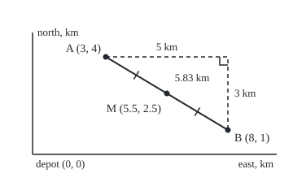

# Distance and midpoint: Pythagoras on a grid

[Syllabus](../../../SYLLABUS.md) → [Geometry and trig](../README.md) → [Coordinates and Curves](../README.md#s04) → Distance and midpoint

---

## General Overview

A delivery van leaves its depot with two parcels. The town is laid out on a grid measured in kilometres. Drop A is 3 km east of the depot and 4 km north. Drop B is 8 km east and 1 km north.

A position on the grid is written as two numbers in brackets, east first, then north: A is (3, 4) and B is (8, 1). These two numbers are the point's **coordinates**, the word used from here on. The depot, (0, 0), is the **origin**. A negative number means west or south.

Two questions follow. How far apart are the drops in a straight line? A drone between them flies 5.83 km. Where is the point exactly halfway, for a parcel locker serving both? At (5.5, 2.5).

The coordinates already hold both answers. From A to B is 5 km east and 3 km south, two moves at right angles, so Pythagoras gives the straight line. Halfway is half of each move.

**Subtract the coordinates to get the moves along each axis; square them, add, and take the root for the distance; average the coordinates for the midpoint.**

**What kind of fact this is:** a theorem, proved on this card from Pythagoras in Why it works; the coordinates it runs on are a convention.

### The picture: the two drops, to scale

<p align="center"></p>

Drawn at 1 km = 30 units. The dashed legs run 5 km east and 3 km south and meet square at (8, 4). The tick marks show the two equal halves of the straight line.

---

## The formula

Notation first, in words. A small 1 or 2 written low after a letter says which point it belongs to: $x_1$ is A's east number, $x_2$ is B's. So A is $(x_1, y_1)$ and B is $(x_2, y_2)$.

$$d = \sqrt{(x_2 - x_1)^2 + (y_2 - y_1)^2}$$

**Read it aloud:** take A's east number from B's, and A's north number from B's; square both differences, add them, and the positive square root is the distance.

$$M = \left(\frac{x_1 + x_2}{2},\ \frac{y_1 + y_2}{2}\right)$$

**Read it aloud:** the midpoint's east number is the average of the two east numbers, and its north number is the average of the two north numbers.

In space a point needs a third number, its height, written $z$. One more squared difference goes under the root, and the midpoint averages three numbers instead of two:

$$d = \sqrt{(x_2 - x_1)^2 + (y_2 - y_1)^2 + (z_2 - z_1)^2}$$

| Symbol | Plain meaning | In our example | Push it up and the answer… |
| --- | --- | --- | --- |
| $A$, $B$ | the two points | the drops | — |
| $x_1$, $y_1$ | A's east and north numbers | 3 and 4 km | changes both answers |
| $x_2$, $y_2$ | B's east and north numbers | 8 and 1 km | changes both answers |
| $x_2 - x_1$, $y_2 - y_1$ | the moves along each axis, signed | 5 and −3 km | a bigger move of either sign lengthens $d$ |
| $d$ | the straight-line distance, never negative | 5.8309518948 km | — |
| $M$ | the midpoint: halfway along the line | (5.5, 2.5) | moves half as far as the endpoint pushed |
| $z_1$, $z_2$ | heights, for points in space | 0 and 12 m on the cable below | a bigger height gap lengthens $d$ |
| $t$ | the fraction of the way from A to B | 1/2 at the midpoint | the point slides toward B |

### When it holds

- **Axes at right angles.** The moves form a right triangle only because grid lines cross square. On slanted axes the formula misses a term, which the law of cosines supplies ([Law of cosines](../03-Trigonometry/06-law-of-cosines.md)).
- **One unit on every axis.** East in kilometres and north in miles give a number that is no length at all. Convert first.
- **Flat ground.** A town is flat enough; latitude and longitude are angles on a round Earth, and across a continent the formula fails.
- **A straight line, not a road.** The van on a square street grid drives at least 8 km, 5 east plus 3 south; 5.83 km is the drone's line.
- **The midpoint needs less.** Averaging works on any straight axes with evenly spaced marks, even slanted or in mixed units: halving each move halves the whole step.

---

## Why it works

### Step 0: coordinates split a slanted gap into two square moves

From A to B the east number changes by 5 and the north number by −3. Both moves run along grid lines, which cross at right angles. So the slanted gap is the long side of a right triangle whose short sides are the moves.

### Step 1: Pythagoras on the grid

Walk from A east to the corner (8, 4), then south to B. The legs are 5 km and 3 km, square at the corner. Pythagoras ([Pythagoras](../01-Angles%2C%20Triangles%20and%20Congruence/05-pythagoras-and-its-converse.md)) gives

$$d^2 = 5^2 + 3^2 = 25 + 9 = 34, \qquad d = \sqrt{34} = 5.8309518948 \text{ km}.$$

Squaring removes a move's sign: (−3)^2 = 3^2 = 9. So the formula uses the signed moves directly, and the order of the points does not matter.

If one move is zero, the points share a grid line and the formula gives the other move's size. If both are zero, the points coincide and the distance is 0.

### Step 2: the midpoint is half of each move

Halfway along the line from A means half the east move and half the north move: 2.5 km east and 1.5 km south of A, which is (5.5, 2.5). In symbols, $x_1 + (x_2 - x_1)/2 = (x_1 + x_2)/2$: starting at A and adding half the move is the same as averaging. The north number works the same way.

### Step 3: M is on the line, and exactly halfway

Each half of the trip is the same move, 2.5 east and 1.5 south. By Step 1 each half has length $\sqrt{2.5^2 + 1.5^2} = 2.9154759474$ km, exactly half of 5.8309518948.

The halves add up to the full distance, and a route through a point off the line is always longer than the line (the triangle inequality, [Triangles](../01-Angles%2C%20Triangles%20and%20Congruence/02-triangle-angle-sum-and-inequality.md)). So M sits on the line, with equal parts on each side.

<details>
<summary>Detailed proof: the only point that is halfway</summary>

Every point P on the line from A to B is A plus a fraction $t$ of the whole move, $t$ between 0 and 1. Its moves from A are $t(x_2 - x_1)$ and $t(y_2 - y_1)$. Squaring multiplies each by $t^2$, so the root multiplies by $t$: P is $t d$ from A. Likewise it is $(1 - t) d$ from B.

The two are equal only when $t = 1/2$: A plus half the move, the average of Step 2. So the midpoint is the one point on the line equally far from both ends.

Off the line, a whole line of points is equally far from A and B, the perpendicular bisector ([Lines](02-lines-slopes-and-intersections.md)).

</details>

### Step 4: in space, Pythagoras twice

At the depot a cable runs from a floor bolt at (1, 2, 0) to a shelf bracket at (4, 6, 12), in metres: 3 east, 4 north, 12 up. On the floor, 3 and 4 give a 5 m diagonal to the point under the bracket. The 12 m rise stands straight up from the floor, so it meets that diagonal square. Pythagoras again: 5^2 + 12^2 = 169, and the cable is 13 m.

The floor square 5^2 was 3^2 + 4^2, so the three squares add: 9 + 16 + 144 = 169. The midpoint averages each number: (2.5, 4, 6), and each half is 6.5 m.

A second road starts at the depot. The dot product of two positions multiplies matching coordinates and adds ([The dot product](../../03-Algebra/06-Dot%20Products%20and%20Best%20Fits/01-dot-product.md)). A's squared distance from the depot, plus B's, minus twice their dot product, is 25 + 65 − 2 × 28 = 34: the law of cosines in coordinates. A third road measures the square built on AB from its corners. The code runs all three.

---

## Worked numbers, by hand

| Step | Arithmetic | Value |
| --- | --- | --- |
| east move | 8 − 3 | 5 km |
| north move | 1 − 4 | −3 km |
| square and add | 25 + 9 | 34 km^2 |
| root | the root of 34 | **5.8309518948 km** |
| midpoint, east | (3 + 8) ÷ 2 | 5.5 |
| midpoint, north | (4 + 1) ÷ 2 | 2.5 |
| the locker | | **(5.5, 2.5)** |
| each half | the root of 2.5^2 + 1.5^2 | 2.9154759474 km |
| B from A and M: B = 2M − A | 2 × (5.5, 2.5) − (3, 4) | (8, 1) |
| the cable in space | the root of 9 + 16 + 144 | **13 m** |

A drone flies 5.83 km between the drops; a locker at (5.5, 2.5) sits half that, 2.9154759474 km, from each.

### What breaks if you drop a piece

| Mistake | Comes out at | What went wrong |
| --- | --- | --- |
| Add the moves | 5 + 3 = 8 km | That is the street route round the corner, not the straight line |
| Stop before the root | 34 | 34 is an area in km^2, not a length |
| Halve the move instead of averaging | (2.5, −1.5) | Half the move from A is a step, not a place; add it to A |

The code prints all three.

---

## Code, from first principles, and it actually runs

Nothing is imported; the square root is Newton's method, averaging a guess with the number divided by the guess until they agree. The squared distance comes by three roads: squaring the moves, the depot's dot products, and the shoelace formula (a polygon's area from its corner coordinates) on the square built on the segment. The midpoint comes twice: by averaging, and by a search along the segment for the point equally far from both ends. The drops and the cable run the same code.

### Python

```python
# Distance and midpoint -- the check behind the card.  Nothing is imported.
# Van grid in km, depot at (0, 0), drops A (3, 4) and B (8, 1).  In space, a
# cable in metres from (1, 2, 0) to (4, 6, 12).  Roads: the formula, the square
# on the segment by corner coordinates, the depot's dot products, a search.

def root(x):                               # square root by Newton: average guess and x / guess
    r = max(x, 1.0)
    for _ in range(80):
        r = (r + x / r) / 2
    return r

def sq(a, b):                              # road one: square each change and add
    return sum((q - p) ** 2 for p, q in zip(a, b))

def dot(a, b):
    return sum(p * q for p, q in zip(a, b))

def shoelace(pts):                         # area of a polygon from its corners
    return abs(sum(x * v - y * u for (x, y), (u, v) in zip(pts, pts[1:] + pts[:1]))) / 2

def search_mid(a, b):                      # walk along the segment until equally far
    lo, hi = 0.0, 1.0
    for _ in range(100):
        t = (lo + hi) / 2
        p = [x + t * (y - x) for x, y in zip(a, b)]
        lo, hi = (t, hi) if sq(a, p) < sq(p, b) else (lo, t)
    return [round(x + t * (y - x), 9) + 0.0 for x, y in zip(a, b)]

for a, b in [((3, 4), (8, 1)), ((1, 2, 0), (4, 6, 12))]:
    ch = [q - p for p, q in zip(a, b)]
    s, d = sq(a, b), root(sq(a, b))
    m = [(p + q) / 2 for p, q in zip(a, b)]
    road2 = dot(a, a) + dot(b, b) - 2 * dot(a, b)
    am, mb = root(sq(a, m)), root(sq(m, b))
    print(f"{a} to {b}: changes {ch}, squares {[c * c for c in ch]}, sum {s}, distance {d:.10f}")
    print(f"  depot road: {dot(a, a)} + {dot(b, b)} - 2 x {dot(a, b)} = {road2}")
    print(f"  midpoint by averaging {m}; by searching the segment {search_mid(a, b)}")
    print(f"  halves {am:.10f} + {mb:.10f} = {am + mb:.10f}; 2M - A = {[2 * x - p for x, p in zip(m, a)]}")
    assert s == road2                                          # two roads to the square
    assert m == search_mid(a, b)                               # two roads to the midpoint
    assert abs(am - mb) < 1e-12 and abs(am + mb - root(road2)) < 1e-12
w = (3, 5)                                 # the change (5, -3) turned a quarter turn
tilt = [(3, 4), (8, 1), (8 + w[0], 1 + w[1]), (3 + w[0], 4 + w[1])]
print(f"square on AB, corners {tilt}: area by corners {shoelace(tilt):.0f}; box 8 x 8 - 4 x 7.5 = {64 - 30}")
assert shoelace(tilt) == sq((3, 4), (8, 1))                    # the square Pythagoras names
print(f"depot to A {root(25):.10f}, depot to B {root(65):.10f}; floor diagonal {root(9 + 16):.10f}; corner {(8, 1)[0], (3, 4)[1]}")
print(f"mistakes: add the legs 5 + 3 = {5 + 3}; stop before the root {5 * 5 + 3 * 3}; "
      f"halve the change ({(8 - 3) / 2}, {(1 - 4) / 2})")
print(f"try: shifted by (10, -7) to {(3 + 10, 4 - 7)} and {(8 + 10, 1 - 7)} distance {root(sq((13, -3), (18, -6))):.10f}; "
      f"B moved to (9, 12) gives {root(sq((3, 4), (9, 12))):.10f}")
k, ox, oy = 30, 40, 190                    # figure: 1 km = 30 units, y points down
px = lambda p: f"({ox + k * p[0]:.0f}, {oy - k * p[1]:.0f})"
print(f"figure, 1 km = {k}: depot {px((0, 0))} A {px((3, 4))} B {px((8, 1))} "
      f"M {px((5.5, 2.5))} corner {px((8, 4))}")
print(f"figure, marker {px((7 + 2 / 3, 4))} {px((7 + 2 / 3, 3 + 2 / 3))} {px((8, 3 + 2 / 3))}; axes to {px((10, 0))} {px((0, 5))}")
n = [z * 6 / root(150 ** 2 + 90 ** 2) for z in (-90, 150)]  # tick half-length 6
for c in [(167.5, 92.5), (242.5, 137.5)]:
    print(f"figure, tick ({c[0] + n[0]:.1f}, {c[1] + n[1]:.1f}) ({c[0] - n[0]:.1f}, {c[1] - n[1]:.1f})")
print("ALL CHECKS PASS")
```

**Ran 2026-09-24 on macOS, Python 3.14.6, standard library only. All checks passed. Output, pasted from the run:**

```
(3, 4) to (8, 1): changes [5, -3], squares [25, 9], sum 34, distance 5.8309518948
  depot road: 25 + 65 - 2 x 28 = 34
  midpoint by averaging [5.5, 2.5]; by searching the segment [5.5, 2.5]
  halves 2.9154759474 + 2.9154759474 = 5.8309518948; 2M - A = [8.0, 1.0]
(1, 2, 0) to (4, 6, 12): changes [3, 4, 12], squares [9, 16, 144], sum 169, distance 13.0000000000
  depot road: 5 + 196 - 2 x 16 = 169
  midpoint by averaging [2.5, 4.0, 6.0]; by searching the segment [2.5, 4.0, 6.0]
  halves 6.5000000000 + 6.5000000000 = 13.0000000000; 2M - A = [4.0, 6.0, 12.0]
square on AB, corners [(3, 4), (8, 1), (11, 6), (6, 9)]: area by corners 34; box 8 x 8 - 4 x 7.5 = 34
depot to A 5.0000000000, depot to B 8.0622577483; floor diagonal 5.0000000000; corner (8, 4)
mistakes: add the legs 5 + 3 = 8; stop before the root 34; halve the change (2.5, -1.5)
try: shifted by (10, -7) to (13, -3) and (18, -6) distance 5.8309518948; B moved to (9, 12) gives 10.0000000000
figure, 1 km = 30: depot (40, 190) A (130, 70) B (280, 160) M (205, 115) corner (280, 70)
figure, marker (270, 70) (270, 80) (280, 80); axes to (340, 190) (40, 40)
figure, tick (164.4, 97.6) (170.6, 87.4)
figure, tick (239.4, 142.6) (245.6, 132.4)
ALL CHECKS PASS
```

### Rust

Same numbers, same labels, built with `rustc --edition 2021 -O`.

```rust
// Distance and midpoint -- the same check as the Python, in Rust.  No crates.
// Van grid in km, depot at (0, 0), drops A (3, 4) and B (8, 1).  In space, a
// cable in metres from (1, 2, 0) to (4, 6, 12).  Roads: the formula, the square
// on the segment by corner coordinates, the depot's dot products, a search.

fn root(x: f64) -> f64 {                          // square root by Newton: average guess and x / guess
    let mut r = x.max(1.0);
    for _ in 0..80 { r = (r + x / r) / 2.0 }
    r
}

fn sq(a: &[f64], b: &[f64]) -> f64 {              // road one: square each change and add
    a.iter().zip(b).map(|(p, q)| (q - p) * (q - p)).sum()
}

fn dot(a: &[i64], b: &[i64]) -> i64 { a.iter().zip(b).map(|(p, q)| p * q).sum() }

fn shoelace(p: &[(i64, i64)]) -> f64 {            // area of a polygon from its corners
    let s: i64 = (0..p.len()).map(|j| { let ((x, y), (u, v)) = (p[j], p[(j + 1) % p.len()]); x * v - y * u }).sum();
    s.abs() as f64 / 2.0
}

fn search_mid(a: &[f64], b: &[f64]) -> Vec<f64> { // walk along the segment until equally far
    let (mut lo, mut hi, mut t) = (0.0, 1.0, 0.0);
    for _ in 0..100 {
        t = (lo + hi) / 2.0;
        let p: Vec<f64> = a.iter().zip(b).map(|(x, y)| x + t * (y - x)).collect();
        if sq(a, &p) < sq(&p, b) { lo = t } else { hi = t }
    }
    a.iter().zip(b).map(|(x, y)| ((x + t * (y - x)) * 1e9).round() / 1e9 + 0.0).collect()
}

fn tup(v: &[i64]) -> String { format!("({})", v.iter().map(|x| x.to_string()).collect::<Vec<_>>().join(", ")) }

fn main() {
    for (a, b) in [(vec![3i64, 4], vec![8i64, 1]), (vec![1, 2, 0], vec![4, 6, 12])] {
        let (af, bf): (Vec<f64>, Vec<f64>) = (a.iter().map(|&x| x as f64).collect(), b.iter().map(|&x| x as f64).collect());
        let ch: Vec<i64> = a.iter().zip(&b).map(|(p, q)| q - p).collect();
        let (s, d) = (sq(&af, &bf), root(sq(&af, &bf)));
        let m: Vec<f64> = af.iter().zip(&bf).map(|(p, q)| (p + q) / 2.0).collect();
        let road2 = dot(&a, &a) + dot(&b, &b) - 2 * dot(&a, &b);
        let (am, mb) = (root(sq(&af, &m)), root(sq(&m, &bf)));
        let back: Vec<f64> = m.iter().zip(&af).map(|(x, p)| 2.0 * x - p).collect();
        println!("{} to {}: changes {:?}, squares {:?}, sum {}, distance {:.10}",
                 tup(&a), tup(&b), ch, ch.iter().map(|c| c * c).collect::<Vec<_>>(), s, d);
        println!("  depot road: {} + {} - 2 x {} = {}", dot(&a, &a), dot(&b, &b), dot(&a, &b), road2);
        println!("  midpoint by averaging {:?}; by searching the segment {:?}", m, search_mid(&af, &bf));
        println!("  halves {:.10} + {:.10} = {:.10}; 2M - A = {:?}", am, mb, am + mb, back);
        assert!(s == road2 as f64);                                     // two roads to the square
        assert!(m == search_mid(&af, &bf));                             // two roads to the midpoint
        assert!((am - mb).abs() < 1e-12 && (am + mb - root(road2 as f64)).abs() < 1e-12);
    }
    let w = (3i64, 5i64);                                               // the change (5, -3) turned a quarter turn
    let tilt = vec![(3i64, 4i64), (8, 1), (8 + w.0, 1 + w.1), (3 + w.0, 4 + w.1)];
    println!("square on AB, corners {:?}: area by corners {:.0}; box 8 x 8 - 4 x 7.5 = {}", tilt, shoelace(&tilt), 64 - 30);
    assert!(shoelace(&tilt) == sq(&[3.0, 4.0], &[8.0, 1.0]));           // the square Pythagoras names
    println!("depot to A {:.10}, depot to B {:.10}; floor diagonal {:.10}; corner ({}, {})", root(25.0), root(65.0), root(9.0 + 16.0), [8, 1][0], [3, 4][1]);
    println!("mistakes: add the legs 5 + 3 = {}; stop before the root {}; halve the change ({:?}, {:?})",
             5 + 3, 5 * 5 + 3 * 3, (8.0 - 3.0) / 2.0, (1.0 - 4.0) / 2.0);
    println!("try: shifted by (10, -7) to ({}, {}) and ({}, {}) distance {:.10}; B moved to (9, 12) gives {:.10}", 3 + 10, 4 - 7, 8 + 10, 1 - 7,
             root(sq(&[13.0, -3.0], &[18.0, -6.0])), root(sq(&[3.0, 4.0], &[9.0, 12.0])));
    let (k, ox, oy) = (30.0, 40.0, 190.0);                              // figure: 1 km = 30 units, y points down
    let px = |x: f64, y: f64| format!("({:.0}, {:.0})", ox + k * x, oy - k * y);
    println!("figure, 1 km = {}: depot {} A {} B {} M {} corner {}",
             k, px(0.0, 0.0), px(3.0, 4.0), px(8.0, 1.0), px(5.5, 2.5), px(8.0, 4.0));
    println!("figure, marker {} {} {}; axes to {} {}", px(7.0 + 2.0 / 3.0, 4.0), px(7.0 + 2.0 / 3.0, 3.0 + 2.0 / 3.0),
             px(8.0, 3.0 + 2.0 / 3.0), px(10.0, 0.0), px(0.0, 5.0));
    let r = root(150.0 * 150.0 + 90.0 * 90.0);
    let n = (-90.0 * 6.0 / r, 150.0 * 6.0 / r);                         // tick half-length 6
    for c in [(167.5, 92.5), (242.5, 137.5)] {
        println!("figure, tick ({:.1}, {:.1}) ({:.1}, {:.1})", c.0 + n.0, c.1 + n.1, c.0 - n.0, c.1 - n.1);
    }
    println!("ALL CHECKS PASS");
}
```

**Ran 2026-09-24 on macOS, rustc 1.98.1, no crates. All checks passed. Output, pasted from the run:**

```
(3, 4) to (8, 1): changes [5, -3], squares [25, 9], sum 34, distance 5.8309518948
  depot road: 25 + 65 - 2 x 28 = 34
  midpoint by averaging [5.5, 2.5]; by searching the segment [5.5, 2.5]
  halves 2.9154759474 + 2.9154759474 = 5.8309518948; 2M - A = [8.0, 1.0]
(1, 2, 0) to (4, 6, 12): changes [3, 4, 12], squares [9, 16, 144], sum 169, distance 13.0000000000
  depot road: 5 + 196 - 2 x 16 = 169
  midpoint by averaging [2.5, 4.0, 6.0]; by searching the segment [2.5, 4.0, 6.0]
  halves 6.5000000000 + 6.5000000000 = 13.0000000000; 2M - A = [4.0, 6.0, 12.0]
square on AB, corners [(3, 4), (8, 1), (11, 6), (6, 9)]: area by corners 34; box 8 x 8 - 4 x 7.5 = 34
depot to A 5.0000000000, depot to B 8.0622577483; floor diagonal 5.0000000000; corner (8, 4)
mistakes: add the legs 5 + 3 = 8; stop before the root 34; halve the change (2.5, -1.5)
try: shifted by (10, -7) to (13, -3) and (18, -6) distance 5.8309518948; B moved to (9, 12) gives 10.0000000000
figure, 1 km = 30: depot (40, 190) A (130, 70) B (280, 160) M (205, 115) corner (280, 70)
figure, marker (270, 70) (270, 80) (280, 80); axes to (340, 190) (40, 40)
figure, tick (164.4, 97.6) (170.6, 87.4)
figure, tick (239.4, 142.6) (245.6, 132.4)
ALL CHECKS PASS
```

The two outputs match line for line.

> [!TIP]
> **Try changing**
> Guess first, then run it.
> - **Move the depot.** Shift both drops 10 km east and 7 km south, to (13, −3) and (18, −6). The moves do not change, so the distance stays 5.8309518948 km.
> - **Move drop B to (9, 12).** The moves become 6 and 8, and the distance is exactly 10 km.
> - **Break the average.** In the midpoint line, divide by 3 instead of 2. The search along the segment still finds (5.5, 2.5), and the second assert stops the run.

---

## The usual mistake

> [!warning]
> **Adding the moves instead of squaring them.** Five east and three south is 8 km of driving on a street grid, but the straight line is shorter, 5.83 km. The two moves are legs of a right triangle; the gap is its long side, and only Pythagoras gets from legs to that side.
>
> **Mixing units.** Heights in metres and ground moves in kilometres under one root give a meaningless number.

---

## Where you meet it in real life

- **Deliveries and drones.** The straight line is a drone's flight and a lower bound on any road route.
- **Maps and screens.** Map grids, floor plans and screen pixels all use this formula, when both axes share one scale.
- **Grouping data.** Clustering sorts points by which centre is nearest, with this distance in many dimensions, and each new centre is an average, a midpoint of many points (k-means).
- **Triangles on a grid.** The balance point of a triangle averages its three corners, the midpoint idea with three points ([Triangle centres](08-triangle-centres.md)).

> **Say it back**
> Coordinates turn the gap between two points into a move along each axis. The moves meet at right angles, so Pythagoras gives the distance: square, add, take the root. The midpoint is half of each move added to the start, which is the average of the coordinates. In space a third move joins the sum. The drops are 5.83 km apart; the locker goes at (5.5, 2.5).

---

## What this builds on

- [Pythagoras](../01-Angles%2C%20Triangles%20and%20Congruence/05-pythagoras-and-its-converse.md): the right-triangle rule this card applies twice.

## Where this goes next

- [Lines](02-lines-slopes-and-intersections.md): the line through A and B as an equation, and the perpendicular bisector.
- [Polar coordinates](03-polar-coordinates.md): a point named by its distance from the origin and a direction.
- [Circles and parabolas](04-circles-and-parabolas.md): a circle is this formula set equal to one number.
- k-means: distance and averaging over many points, to find groups.
- The unit-distance problem: how many pairs among many points can sit exactly one unit apart, still open.

This card measures between two fixed points; describing every point on a given line or at a given distance needs an equation, which starts with [Lines](02-lines-slopes-and-intersections.md).

---

## Sources

Verified 2026-09-24: every link below opens a page naming the cited work.

- OpenStax. *College Algebra 2e*, section 2.1, "The Rectangular Coordinate Systems and Graphs". [Publisher page](https://openstax.org/books/college-algebra-2e/pages/2-1-the-rectangular-coordinate-systems-and-graphs). The distance formula from Pythagoras, and the midpoint formula, in the plane.
- OpenStax. *Calculus Volume 3*, section 2.2, "Vectors in Three Dimensions". [Publisher page](https://openstax.org/books/calculus-volume-3/pages/2-2-vectors-in-three-dimensions). The distance formula in space.
- O'Connor, J. J., and E. F. Robertson. "René Descartes." MacTutor Archive, University of St Andrews. [Biography](https://mathshistory.st-andrews.ac.uk/Biographies/Descartes/). *La géométrie* and the algebra-on-geometry that coordinates come from.
