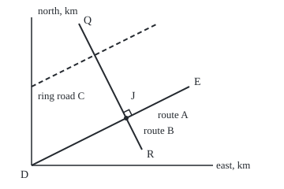

# Lines: slope, intercept, and three ways to write the same line

[Syllabus](../../../SYLLABUS.md) → [Geometry and trig](../../../SYLLABUS.md#w05) → [Coordinates and Curves](../../../SYLLABUS.md#w05-s04) → Lines

---

## General Overview

A delivery firm maps its town on a kilometre grid, depot D at (0, 0). A position is written (east, north): (6, 3) is 6 km east and 3 km north ([Distance and midpoint](01-distance-and-midpoint.md)).

Route A runs straight from the depot to E at (10, 5). Route B runs from Q at (3, 9) to R at (7, 1). A ring road C runs 5 km north of route A the whole way. How steep is each road? Where do two roads meet? Do they cross square?

One idea answers all three: a straight road climbs the same amount for every kilometre east. That fixed climb is the **slope**. With it a line becomes an equation, and a crossing becomes two equations solved at once.

**A straight line is fixed by its slope and one point on it; two lines meet once unless their slopes are equal, and they cross square exactly when their slopes multiply to −1.**

**What kind of fact this is:** three definitions (the ways to write a line) and two theorems (the parallel and perpendicular tests), all proved on this card in Why it works.

### The picture: the three roads, to scale

<p align="center"></p>

Drawn at 1 km = 20 units, depot at the lower left. J is (6, 3); the small square there marks the right angle between routes A and B. The dashed ring road keeps a 5 km gap north of route A.

---

## The formula

Reminder: a point (x, y) is $x$ km east of the depot and $y$ km north. The slope $m$ is rise over run between two points of the line:

$$m = \frac{y_2 - y_1}{x_2 - x_1}$$

**Read it aloud:** the slope is the northward change divided by the eastward change.

Then one line can be written three ways:

$$y = mx + k \qquad\qquad ax + by = p \qquad\qquad (x, y) = (x_0, y_0) + t\,(u, v)$$

**Read it aloud:** north equals slope times east plus a starting height; or a fixed mix of east and north; or a start point plus some multiple of one step.

These are the **slope-intercept form** ($k$ is where the line crosses the north axis), the **general form**, and the **parametric form**, where one dial, $t$, walks along the line. Route A is y = 0.5x, x − 2y = 0, and (0, 0) + t(10, 5), with t = 0 at the depot and t = 1 at E. Route B is y = −2x + 15, 2x + y = 15, and (3, 9) + s(4, −8).

For two lines with slopes $m_1$ and $m_2$:

- **Parallel** (never meeting): $m_1 = m_2$ and different $k$.
- **Perpendicular** (crossing square): $m_1 m_2 = -1$.
- **Where they meet**, for ax + by = p and cx + dy = q:

$$x = \frac{pd - bq}{ad - bc} \qquad y = \frac{aq - cp}{ad - bc}$$

**Read it aloud:** each coordinate is a cross-multiplied difference divided by the **crossing number**, ad − bc.

| Symbol | Plain meaning | In our example | Push it up and the answer… |
| --- | --- | --- | --- |
| $x$, $y$; $x_1$, $y_1$, $x_2$, $y_2$ | km east and north; two known points | J is (6, 3) | a different point |
| $m$, $m_1$, $m_2$ | slope: km north per km east | A 0.5, B −2, C 0.5 | a steeper road |
| $k$ | where the line crosses the north axis | A 0, B 15, C 5 | the road slides north |
| $a$, $b$, $p$ | first line's general form | A: 1, −2, 0 | — |
| $c$, $d$, $q$ | second line's general form | B: 2, 1, 15 | — |
| $ad - bc$ | the crossing number | A with B 5; A with C 0 | 0 means no single crossing |
| $t$, $s$ | dials along routes A and B: 0 at the start, 1 at the end | 0.6 and 0.75 at J | further along |
| $x_0$, $y_0$; $u$, $v$ | parametric start point and step | A: (0, 0) and (10, 5) | — |

### When it holds

- **Axes at right angles, same unit both ways.** On a map stretched north, square crossings no longer have slopes multiplying to −1; the parallel test survives.
- **No vertical line in the slope forms.** A north-south street x = 2 has no slope, but its general form works: it meets route A at (2, 1), crossing number 2.
- **A nonzero crossing number for one crossing.** Zero means the lines point the same way (equal slopes, or both vertical): parallel, or one line written twice.
- **Lines run forever; roads stop.** A crossing is on the roads only if both dials lie between 0 and 1.

---

## Why it works

### Step 0: a straight road has one slope

Under any two points of route A draw the right triangle: one side east, one north, the road as the long side. All such triangles have the same angles, so they are similar and keep one ratio of sides ([Similar triangles](../01-Angles%2C%20Triangles%20and%20Congruence/04-similar-triangles-and-scale.md)). Rise over run is that ratio, so the slope is the same whichever two points are used.

### Step 1: the three forms say the same thing

Take a known point on the line, $(x_1, y_1)$. Any other point (x, y) is on the line exactly when its rise over run from the known point is $m$: $y - y_1 = m(x - x_1)$. Multiply out and collect the constant: y = mx + k with $k = y_1 - m x_1$. For route B, k = 9 − (−2)(3) = 15.

Move the letters to one side for the general form: y = −2x + 15 becomes 2x + y = 15. Going back, the slope is −a/b, here −2/1; when $b$ is 0 the line is vertical.

For the parametric form, start at $(x_0, y_0)$ and add $t$ copies of the step (u, v). Each step has rise over run v/u, which is the slope: 5/10 = 0.5 for route A.

### Step 2: equal slopes never meet, unless they are one line

Route A is y = 0.5x and the ring road is y = 0.5x + 5. At x = 0, 4 and 8 the gap is 5, 5, 5 km. A gap that never changes never closes, so equal slopes with different $k$ never meet: the lines are **parallel**.

The crossing number agrees: equal slopes −a/b = −c/d mean ad − bc = 0, as for routes A and C.

### Step 3: slopes that multiply to −1 cross square

Slide both lines through one point; slopes do not change. Step 1 km east along each: one reaches height $m_1$, the other $m_2$. The corner is square exactly when Pythagoras holds for the triangle of the two steps and the gap between their ends. The distance formula turns that into $m_1 m_2 = -1$.

<details>
<summary>Detailed proof</summary>

Put the shared point at (0, 0); the steps end at U = $(1, m_1)$ and W = $(1, m_2)$. By the distance formula the squared sides are $1 + m_1^2$, $1 + m_2^2$ and, from U to W, $(m_1 - m_2)^2$. By Pythagoras and its converse, the corner is square exactly when

$$1 + m_1^2 + 1 + m_2^2 = m_1^2 - 2 m_1 m_2 + m_2^2$$

The squares cancel, leaving $2 = -2 m_1 m_2$: $m_1 m_2 = -1$. Every step reverses, so the test works both ways.

</details>

Routes A and B pass: 0.5 × (−2) = −1. The points agree: in triangle D, J, Q, DJ^2 = 45, JQ^2 = 45 and DQ^2 = 90, and 45 + 45 = 90.

### Step 4: meeting means solving both at once

A point on both roads satisfies x − 2y = 0 and 2x + y = 15, two equations in two unknowns ([Two equations, two unknowns](../../03-Algebra/01-Letters%20and%20Equations/04-two-equations-two-unknowns.md)). Eliminating one letter gives the formula above: crossing number 5, so x = 30/5 = 6 and y = 15/5 = 3.

The parametric form is shorter. Every point of route A is (10t, 5t). Put it into route B: 2(10t) + 5t = 15, so 25t = 15 and t = 0.6, giving (6, 3) again. On route B the same point has s = 0.75. Both dials lie between 0 and 1, so the junction is on both roads, not their extensions.

A second test of the right angle skips slopes: the steps (10, 5) and (4, −8) have dot product 0, which means perpendicular ([The dot product](../../03-Algebra/06-Dot%20Products%20and%20Best%20Fits/01-dot-product.md)). It never divides, so it handles vertical streets too.

---

## Worked numbers, by hand

| Step | Arithmetic | Value |
| --- | --- | --- |
| slope of route A | (5 − 0)/(10 − 0) | 0.5 |
| slope of route B | (1 − 9)/(7 − 3) = −8/4 | −2 |
| route B's north-axis crossing | 9 − (−2)(3) | 15 |
| general forms | y = 0.5x and y = −2x + 15, rearranged | x − 2y = 0 and 2x + y = 15 |
| crossing number | 1 × 1 − (−2) × 2 | 5 |
| east of the depot | (0 × 1 − (−2) × 15)/5 = 30/5 | 6 |
| north of the depot | (1 × 15 − 2 × 0)/5 = 15/5 | 3 |
| square? | 0.5 × (−2) | −1, yes |
| the junction | | **J = (6, 3)** |

The routes meet square, 6 km east and 3 km north of the depot, 60% of the way along route A.

### What breaks if you drop a piece

| Mistake | Comes out at | What went wrong |
| --- | --- | --- |
| Run over rise for route A | slope 2; junction (3.75, 7.5) | The ratio is upside down |
| Perpendicular to B taken as 1/m | slope −0.5; step dot product 2, not 0 | The rule is −1/m |
| Point order mixed on route B | −8/−4 = 2 | Rise from Q to R, run from R to Q |

---

## Code, from first principles, and it actually runs

Nothing is imported. The junction is reached two ways sharing no arithmetic: the crossing-number formula, and halving route A, keeping the half whose ends lie on opposite sides of route B. The right angle is checked by slopes and by Pythagoras; parallel by crossing number and by measured gap.

### Python

```python
# Lines, slopes and intersections -- the check behind the card.  Nothing is
# imported.  A city grid in km, x east and y north, the depot D at (0, 0).
# Route A runs D to E; route B runs Q to R; ring road C runs beside route A.
# The junction is found by two roads that share no arithmetic.
D, E, Q, R, C0, C1 = (0, 0), (10, 5), (3, 9), (7, 1), (0, 5), (10, 10)
A, B, C = (1, -2, 0), (2, 1, 15), (1, -2, -10)   # a, b, p in ax + by = p

def slope(P1, P2):                  # rise over run, same point order in both
    return (P2[1] - P1[1]) / (P2[0] - P1[0])

def cross(L1, L2):                  # the crossing number ad - bc
    return L1[0] * L2[1] - L1[1] * L2[0]

def meet(L1, L2):                   # road one: the crossing-number formula
    (a, b, p), (c, d, q) = L1, L2
    return (p * d - b * q) / cross(L1, L2), (a * q - c * p) / cross(L1, L2)

def side(L, x, y):                  # sign says which side of line L a point is on
    return L[0] * x + L[1] * y - L[2]

def sq(P1, P2):                     # squared distance, from the distance formula
    return (P2[0] - P1[0]) ** 2 + (P2[1] - P1[1]) ** 2

lo, hi = 0.0, 1.0                   # road two: halve route A until B is crossed
for _ in range(60):
    mid = (lo + hi) / 2
    if side(B, 0, 0) * side(B, 10 * mid, 5 * mid) > 0: lo = mid
    else: hi = mid
t = (lo + hi) / 2
J = meet(A, B)
s = (J[0] - Q[0]) / (R[0] - Q[0])
mA, mB, mC = slope(D, E), slope(Q, R), slope(C0, C1)
kA, kB, kC = D[1] - mA * D[0], Q[1] - mB * Q[0], C0[1] - mC * C0[0]
gaps = [(mC * x + kC) - (mA * x + kA) for x in (0, 4, 8)]
dj, jq, dq = sq(D, J), sq(J, Q), sq(D, Q)
f = lambda v: f"{v:g}"
px = lambda P: f"({f(round(40 + 20 * P[0], 1))}, {f(round(210 - 20 * P[1], 1))})"
u = 0.4 / 5 ** 0.5                  # 8 drawing units along each road, in km
mark = [(J[0] + 2 * u, J[1] + u), (J[0] + u, J[1] + 3 * u), (J[0] - u, J[1] + 2 * u)]
print(f"slopes from two points: A {f(mA)}, B {f(mB)}, C {f(mC)}; north-axis crossings {f(kA)}, {f(kB)}, {f(kC)}")
print(f"slopes from general form, -a/b: A {f(-A[0] / A[1])}, B {f(-B[0] / B[1])}, C {f(-C[0] / C[1])}")
print(f"crossing number A with B: {cross(A, B)}; A with ring road C: {cross(A, C)}")
print(f"junction by the formula: x = {A[2] * B[1] - A[1] * B[2]}/{cross(A, B)} = {f(J[0])}, y = {A[0] * B[2] - B[0] * A[2]}/{cross(A, B)} = {f(J[1])}")
print(f"junction by halving route A: t = {t:.6f}, point ({10 * t:.6f}, {5 * t:.6f})")
print(f"route A put into B: {B[0] * E[0] + B[1] * E[1]}t = {B[2]}, t = {f(B[2] / (B[0] * E[0] + B[1] * E[1]))}; on route B s = {f(s)}")
print(f"slope product A x B: {f(mA * mB)}; step dot product (10, 5).(4, -8) = {(E[0] - D[0]) * (R[0] - Q[0]) + (E[1] - D[1]) * (R[1] - Q[1])}")
print(f"Pythagoras: DJ^2 = {f(dj)}, JQ^2 = {f(jq)}, DQ^2 = {f(dq)}")
print(f"ring road C above route A at x = 0, 4, 8: {', '.join(f(g) for g in gaps)} km")
print(f"ring road C meets route B at ({f(meet(C, B)[0])}, {f(meet(C, B)[1])}), s = {f((meet(C, B)[0] - Q[0]) / (R[0] - Q[0]))}")
print(f"street x = 2 meets route A at ({f(meet(A, (1, 0, 2))[0])}, {f(meet(A, (1, 0, 2))[1])}); crossing number {cross(A, (1, 0, 2))}")
print(f"mistake 1, run over rise: slope {f(10 / 5)}, junction ({f(meet((2, -1, 0), B)[0])}, {f(meet((2, -1, 0), B)[1])})")
print(f"mistake 2, perpendicular to B as 1/m: slope {f(1 / mB)}, step dot product (1, -2).(1, -0.5) = {f(1 + mB * (1 / mB))}")
print(f"mistake 3, point order mixed on B: {R[1] - Q[1]}/{Q[0] - R[0]} = {f((R[1] - Q[1]) / (Q[0] - R[0]))}")
print(f"figure, 20 units per km: D {px(D)} E {px(E)} Q {px(Q)} R {px(R)} J {px(J)} C {px(C0)} to {px((8, 9))}")
print(f"figure, right-angle marker {' '.join(px(P) for P in mark)}")
assert abs(J[0] - 10 * t) < 1e-9 and abs(J[1] - 5 * t) < 1e-9        # two roads, one junction
assert mA * mB == -1 and dj + jq == dq                              # right angle two ways
assert cross(A, C) == 0 and gaps == [5, 5, 5]                       # parallel two ways
assert [mA, mB, mC] == [-L[0] / L[1] for L in (A, B, C)]            # two points vs general form
print("ALL CHECKS PASS")
```

**Ran 2026-09-24 on macOS, Python 3.14.6, standard library only. All checks passed. Output, pasted from the run:**

```
slopes from two points: A 0.5, B -2, C 0.5; north-axis crossings 0, 15, 5
slopes from general form, -a/b: A 0.5, B -2, C 0.5
crossing number A with B: 5; A with ring road C: 0
junction by the formula: x = 30/5 = 6, y = 15/5 = 3
junction by halving route A: t = 0.600000, point (6.000000, 3.000000)
route A put into B: 25t = 15, t = 0.6; on route B s = 0.75
slope product A x B: -1; step dot product (10, 5).(4, -8) = 0
Pythagoras: DJ^2 = 45, JQ^2 = 45, DQ^2 = 90
ring road C above route A at x = 0, 4, 8: 5, 5, 5 km
ring road C meets route B at (4, 7), s = 0.25
street x = 2 meets route A at (2, 1); crossing number 2
mistake 1, run over rise: slope 2, junction (3.75, 7.5)
mistake 2, perpendicular to B as 1/m: slope -0.5, step dot product (1, -2).(1, -0.5) = 2
mistake 3, point order mixed on B: -8/-4 = 2
figure, 20 units per km: D (40, 210) E (240, 110) Q (100, 30) R (180, 190) J (160, 150) C (40, 110) to (200, 30)
figure, right-angle marker (167.2, 146.4) (163.6, 139.3) (156.4, 142.8)
ALL CHECKS PASS
```

### Rust

Same numbers, same labels, built with `rustc --edition 2021 -O`.

```rust
// Lines, slopes and intersections -- the same check as the Python, in Rust.
// No crates.  A city grid in km, x east and y north, the depot D at (0, 0).
// Route A runs D to E; route B runs Q to R; ring road C runs beside route A.
// The junction is found by two roads that share no arithmetic.
type P = (f64, f64);
type L = (f64, f64, f64);                 // a, b, p in ax + by = p

fn slope(p1: P, p2: P) -> f64 { (p2.1 - p1.1) / (p2.0 - p1.0) }   // rise over run
fn cross(l1: L, l2: L) -> f64 { l1.0 * l2.1 - l1.1 * l2.0 }       // ad - bc
fn meet(l1: L, l2: L) -> P {                                       // road one: the formula
    let ((a, b, p), (c, d, q)) = (l1, l2);
    ((p * d - b * q) / cross(l1, l2), (a * q - c * p) / cross(l1, l2))
}
fn side(l: L, x: f64, y: f64) -> f64 { l.0 * x + l.1 * y - l.2 } // which side of line l
fn sq(p1: P, p2: P) -> f64 { (p2.0 - p1.0).powi(2) + (p2.1 - p1.1).powi(2) }
fn px(p: P) -> String {
    let r = |v: f64| (v * 10.0).round() / 10.0;
    format!("({}, {})", r(40.0 + 20.0 * p.0), r(210.0 - 20.0 * p.1))
}

fn main() {
    let (d, e, q, r, c0, c1): (P, P, P, P, P, P) =
        ((0.0, 0.0), (10.0, 5.0), (3.0, 9.0), (7.0, 1.0), (0.0, 5.0), (10.0, 10.0));
    let (a, b, c): (L, L, L) = ((1.0, -2.0, 0.0), (2.0, 1.0, 15.0), (1.0, -2.0, -10.0));
    let (mut lo, mut hi) = (0.0_f64, 1.0_f64);  // road two: halve route A until B is crossed
    for _ in 0..60 {
        let mid = (lo + hi) / 2.0;
        if side(b, 0.0, 0.0) * side(b, 10.0 * mid, 5.0 * mid) > 0.0 { lo = mid } else { hi = mid }
    }
    let t = (lo + hi) / 2.0;
    let j = meet(a, b);
    let s = (j.0 - q.0) / (r.0 - q.0);
    let (ma, mb, mc) = (slope(d, e), slope(q, r), slope(c0, c1));
    let (ka, kb, kc) = (d.1 - ma * d.0, q.1 - mb * q.0, c0.1 - mc * c0.0);
    let gaps: Vec<f64> = [0.0, 4.0, 8.0].iter().map(|&x| (mc * x + kc) - (ma * x + ka)).collect();
    let (dj, jq, dq) = (sq(d, j), sq(j, q), sq(d, q));
    let u = 0.4 / 5f64.sqrt();                  // 8 drawing units along each road, in km
    let mark = [(j.0 + 2.0 * u, j.1 + u), (j.0 + u, j.1 + 3.0 * u), (j.0 - u, j.1 + 2.0 * u)];
    let (cb, st, wrong) = (meet(c, b), meet(a, (1.0, 0.0, 2.0)), meet((2.0, -1.0, 0.0), b));
    println!("slopes from two points: A {}, B {}, C {}; north-axis crossings {}, {}, {}", ma, mb, mc, ka, kb, kc);
    println!("slopes from general form, -a/b: A {}, B {}, C {}", -a.0 / a.1, -b.0 / b.1, -c.0 / c.1);
    println!("crossing number A with B: {}; A with ring road C: {}", cross(a, b), cross(a, c));
    println!("junction by the formula: x = {}/{} = {}, y = {}/{} = {}", a.2 * b.1 - a.1 * b.2,
             cross(a, b), j.0, a.0 * b.2 - b.0 * a.2, cross(a, b), j.1);
    println!("junction by halving route A: t = {:.6}, point ({:.6}, {:.6})", t, 10.0 * t, 5.0 * t);
    println!("route A put into B: {}t = {}, t = {}; on route B s = {}", b.0 * e.0 + b.1 * e.1, b.2, b.2 / (b.0 * e.0 + b.1 * e.1), s);
    println!("slope product A x B: {}; step dot product (10, 5).(4, -8) = {}", ma * mb,
             (e.0 - d.0) * (r.0 - q.0) + (e.1 - d.1) * (r.1 - q.1));
    println!("Pythagoras: DJ^2 = {}, JQ^2 = {}, DQ^2 = {}", dj, jq, dq);
    println!("ring road C above route A at x = 0, 4, 8: {}, {}, {} km", gaps[0], gaps[1], gaps[2]);
    println!("ring road C meets route B at ({}, {}), s = {}", cb.0, cb.1, (cb.0 - q.0) / (r.0 - q.0));
    println!("street x = 2 meets route A at ({}, {}); crossing number {}", st.0, st.1, cross(a, (1.0, 0.0, 2.0)));
    println!("mistake 1, run over rise: slope {}, junction ({}, {})", 10.0 / 5.0, wrong.0, wrong.1);
    println!("mistake 2, perpendicular to B as 1/m: slope {}, step dot product (1, -2).(1, -0.5) = {}", 1.0 / mb, 1.0 + mb * (1.0 / mb));
    println!("mistake 3, point order mixed on B: {}/{} = {}", r.1 - q.1, q.0 - r.0, (r.1 - q.1) / (q.0 - r.0));
    println!("figure, 20 units per km: D {} E {} Q {} R {} J {} C {} to {}", px(d), px(e), px(q), px(r), px(j), px(c0), px((8.0, 9.0)));
    println!("figure, right-angle marker {}", mark.iter().map(|&m| px(m)).collect::<Vec<_>>().join(" "));
    assert!((j.0 - 10.0 * t).abs() < 1e-9 && (j.1 - 5.0 * t).abs() < 1e-9);   // two roads, one junction
    assert!(ma * mb == -1.0 && dj + jq == dq);                                // right angle two ways
    assert!(cross(a, c) == 0.0 && gaps == vec![5.0, 5.0, 5.0]);               // parallel two ways
    assert!([ma, mb, mc] == [-a.0 / a.1, -b.0 / b.1, -c.0 / c.1]);            // two points vs general form
    println!("ALL CHECKS PASS");
}
```

**Ran 2026-09-24 on macOS, rustc 1.98.1, no crates. All checks passed. Output, pasted from the run:**

```
slopes from two points: A 0.5, B -2, C 0.5; north-axis crossings 0, 15, 5
slopes from general form, -a/b: A 0.5, B -2, C 0.5
crossing number A with B: 5; A with ring road C: 0
junction by the formula: x = 30/5 = 6, y = 15/5 = 3
junction by halving route A: t = 0.600000, point (6.000000, 3.000000)
route A put into B: 25t = 15, t = 0.6; on route B s = 0.75
slope product A x B: -1; step dot product (10, 5).(4, -8) = 0
Pythagoras: DJ^2 = 45, JQ^2 = 45, DQ^2 = 90
ring road C above route A at x = 0, 4, 8: 5, 5, 5 km
ring road C meets route B at (4, 7), s = 0.25
street x = 2 meets route A at (2, 1); crossing number 2
mistake 1, run over rise: slope 2, junction (3.75, 7.5)
mistake 2, perpendicular to B as 1/m: slope -0.5, step dot product (1, -2).(1, -0.5) = 2
mistake 3, point order mixed on B: -8/-4 = 2
figure, 20 units per km: D (40, 210) E (240, 110) Q (100, 30) R (180, 190) J (160, 150) C (40, 110) to (200, 30)
figure, right-angle marker (167.2, 146.4) (163.6, 139.3) (156.4, 142.8)
ALL CHECKS PASS
```

The two outputs match line for line.

> [!TIP]
> **Try changing**
> Guess first, then run it; expect an assert to stop the program.
> - **Move the end of route B.** Set `R` to `(7, 2)`. The slope becomes −1.75, the product −0.875: no longer square, and the second assert stops it.
> - **Tilt the ring road.** Set `C1` to `(10, 11)`. The gaps grow, 5, 5.4, 5.8 km, while the general form still says crossing number 0; the third assert stops it.
> - **Halve the wrong way.** Change `> 0` to `< 0` in the loop. The search runs back to the depot, t = 0; the first assert stops it.

---

## The usual mistake

> [!warning]
> **Reading equal slopes as "the same road".** Route A and the ring road both have slope 0.5 and crossing number 0, yet lie 5 km apart, measured north, everywhere. Equal slopes say only that roads point the same way. Compare the north-axis crossings, 0 against 5, before calling them one line.
>
> - **Forgetting the road ends.** The ring road meets route B at (4, 7), on the road only because s = 0.25 lies between 0 and 1.

---

## Where you meet it in real life

- **Routing and maps.** Road segments are stored as a start and a step; a junction is Step 4, with both dials checked.
- **Computer graphics.** Rays and shadows use the parametric form, a dial kept inside the segment.
- **Surveying.** A plot corner is where two boundary lines meet, checked square by the slope product.
- **Reading between data points.** The line through two readings, read in the middle, is Linear interpolation.

> **Say it back**
> A straight line climbs the same amount per step east: its slope. It can be written as slope and crossing height, as ax + by = p, or as a start plus multiples of a step. Equal slopes never meet unless they are one line. Slopes multiplying to −1 cross square. Two lines meet where both equations hold.

---

## What this builds on

- [Distance and midpoint](01-distance-and-midpoint.md): the grid of (x, y) positions, and the distance formula behind the perpendicular proof.
- [Two equations, two unknowns](../../03-Algebra/01-Letters%20and%20Equations/04-two-equations-two-unknowns.md): elimination and the crossing number that finds the junction.

## Where this goes next

- [Triangle centres](08-triangle-centres.md): special lines of a triangle, intersected, locate its centres.
- [Elliptic curves](../06-Beyond%20Euclid/05-elliptic-curves-and-point-addition.md): a line through two points of a curve meets it in a third, which defines an addition.
- Linear interpolation: the line through two readings, used to estimate between them.

Two distinct lines meet once or never; a line meeting a curve, possibly twice, is where [Circles and parabolas](04-circles-and-parabolas.md) begins.

---

## Sources

Verified 24 Sep 2026: every link below resolves to the publisher's page.

- OpenStax. *Precalculus 2e*, section 2.1, "Linear Functions." Rice University. [Textbook page](https://openstax.org/books/precalculus-2e/pages/2-1-linear-functions). Slope, the slope-intercept and point-slope forms.
- OpenStax. *Precalculus 2e*, section 2.2, "Graphs of Linear Functions." Rice University. [Textbook page](https://openstax.org/books/precalculus-2e/pages/2-2-graphs-of-linear-functions). Vertical lines, and the parallel and perpendicular tests.
- Descartes, René. *La Géométrie*, 1637. Project Gutenberg. [Full text](https://www.gutenberg.org/ebooks/26400). Where curves and lines first became equations in two unknowns.
