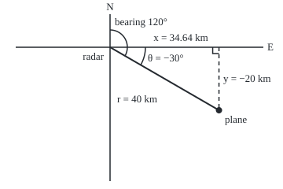
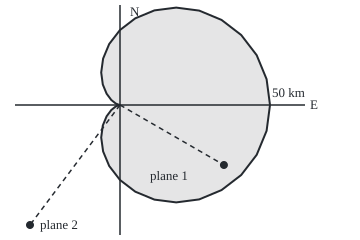

# Polar coordinates: a point as range and bearing

[Syllabus](../../../SYLLABUS.md) → [Geometry and trig](../README.md) → [Coordinates and Curves](../README.md#s04) → Polar coordinates

---

## General Overview

A coastal radar picks up a plane. The screen shows what the radar measures: 40 km away, on bearing 120°. A bearing is a direction read clockwise from north, as on a compass, so 120° points east-south-east.

A chart uses a grid instead: kilometres east and north of the radar. Both name the same spot. The grid gives two perpendicular offsets; the radar gives a distance and a direction. The radar's pair is called **polar coordinates**.

Cosine and sine convert one way; Pythagoras and a sign-aware arctangent convert back. Arctangent undoes tangent: given a ratio, it returns an angle with that tangent. This plane sits 34.64 km east and 20 km south. A plain arctangent sends a second plane, 30 km west and 40 km south, to the north-east.

**A point in the plane can be named by its distance from the centre and the angle of its direction; cosine and sine turn that pair into grid offsets, and Pythagoras plus a quadrant-aware arctangent turn them back.**

**What kind of fact this is:** a definition, since the conventions are chosen; that the conversions undo each other is a theorem, proved on this card in Why it works.

### The picture: the contact on the radar's grid

<p align="center"></p>

Drawn to scale: 1 km = 4 units. Inner arc: the bearing, clockwise from north. Outer arc: the maths angle from east, drawn as −30°, the same direction as 330°.

---

## The formula

Notation first, in words. A grid point $(x, y)$ is $x$ km east and $y$ km north of the radar; a negative $y$ means south. A polar point $(r, \theta)$, read "r, theta", is $r$ km from the radar in the direction $\theta$. Mathematics measures $\theta$ from east, turning anticlockwise, as on the unit circle.

$$x = r\cos\theta, \qquad y = r\sin\theta$$

**Read it aloud:** the east offset is the range times the cosine of the angle; the north offset is the range times its sine.

Going back, for any point other than the centre:

$$r = \sqrt{x^2 + y^2}, \qquad \theta = \alpha,\ \alpha + 180°\ \text{or}\ \alpha + 360°, \qquad \alpha = \arctan\frac{y}{x}$$

**Read it aloud:** the range is Pythagoras; the angle is the arctangent of north over east, plus a half turn if the point lies west, or a full turn if it lies east and south. Due north or south, $x$ is zero and the angle is 90° or 270°.

A bearing $b$ starts at north and turns clockwise; $\theta$ starts at east and turns anticlockwise:

$$\theta = 90° - b, \qquad x = r\sin b, \qquad y = r\cos b$$

**Read it aloud:** the maths angle is ninety degrees minus the bearing, wrapped into one turn; with a bearing, sine gives east and cosine gives north.

| Symbol | Plain meaning | In our example | Push it up and the answer… |
| --- | --- | --- | --- |
| $r$ | range: straight distance from the radar, never negative | 40 km | the point slides outward |
| $\theta$ | maths angle: from east, anticlockwise | 330° | the point swings anticlockwise |
| $b$ | bearing: from north, clockwise | 120° | the point swings clockwise |
| $x$ | east offset, negative for west | 34.64 km | the point moves east |
| $y$ | north offset, negative for south | −20 km | the point moves north |
| $\alpha$ | the angle a plain arctangent returns, between −90° and 90° | −30° for plane 1, 53.13° for plane 2 | — |
| $k$ | a whole number of turns | 0 | adding $360°k$ to $\theta$ names the same point |

### When it holds

- **Range is never negative.** Some books let a negative $r$ mean "back through the centre", which adds a sign case.
- **Angles repeat every turn.** $\theta$ and $\theta + 360°k$ name one point, so fix a window: 0° up to, not including, 360°.
- **The centre has no direction.** At $r = 0$ every angle names the same spot.
- **The ground is flat.** Radar measures slant range to a plane aloft; the ground distance is shorter.
- **One angle convention at a time.** A bearing in the maths-angle formula mirrors the map across the north-east diagonal.

---

## Why it works

### Step 0: a direction is a point on the unit circle

The [The unit circle](../03-Trigonometry/02-radians-and-the-unit-circle.md) card defines $\cos\theta$ and $\sin\theta$ as the east and north offsets of the point at angle $\theta$ on a circle of radius 1. Every direction has such a point, and its offsets carry the right signs.

### Step 1: scale the direction by the range

Going $r$ km in direction $\theta$ reaches the unit-circle point stretched $r$ times, so $x = r\cos\theta$ and $y = r\sin\theta$. No triangle is needed, so no quadrant is special: a southward point gets its negative $y$ from the sine. For the plane, cos 330° is $\sqrt{3}/2$ and sin 330° is −1/2, so $x = 20\sqrt{3}$, about 34.64 km, and $y = −20$ km.

### Step 2: the range comes back by Pythagoras

The two offsets are the legs of a right triangle whose long side is the range ([Distance and midpoint](01-distance-and-midpoint.md)). So $r^2 = x^2 + y^2$, and since $r$ is never negative, $r = \sqrt{x^2 + y^2}$.

### Step 3: the angle needs both signs, not one ratio

Dividing, $y/x = \tan\theta$. But (−30, −40) and (30, 40) share the ratio 4/3 and point opposite ways. A plain arctangent answers only between −90° and 90°, the eastern half, so a western point comes back reversed. The repair reads the signs: $x$ negative, add 180°; $x$ positive and $y$ negative, add 360°.

A second road never divides. Cosine is $x/r$. Arccosine undoes cosine and returns an angle from 0° to 180°, the northern half. If $y$ is negative the point is the mirror image in the southern half: 360° minus the arccosine. The code runs both roads.

<details>
<summary>Detailed proof: the two conversions undo each other</summary>

Take a point other than the centre, with $r > 0$. The point $(x/r, y/r)$ is 1 from the centre, so it sits on the unit circle at an angle $\theta$ with $\cos\theta = x/r$, $\sin\theta = y/r$. Only one window angle does: two with equal cosines are mirror images across the east axis, with opposite sines.

Arccosine's angle has cosine $x/r$ and a non-negative sine: it is $\theta$ when $y \ge 0$, and its mirror is $\theta$ when $y < 0$. With $x > 0$, $\alpha$ has positive cosine and $\tan\alpha = y/x$, so it is $\theta$ up to a whole turn. With $x < 0$, $\alpha + 180°$ flips both offsets' signs to match. Step 1 on $(r, \theta)$ returns $(x, y)$.

</details>

### Step 4: a bearing is the same angle, measured the other way

Turning clockwise instead of anticlockwise flips the angle's sign; starting at north instead of east adds 90°. So $\theta = 90° - b$, wrapped into one turn: bearing 120° gives −30°, which is 330°. Since $\cos(90° - b) = \sin b$ and $\sin(90° - b) = \cos b$, east is $r\sin b$ and north is $r\cos b$.

### Step 5: a curve is a range for each angle

Fix $r$ at 40 and let $\theta$ run: a circle, which a grid writes $x^2 + y^2 = 1600$. Fix $\theta$ at 330° and let $r$ run: a ray through the plane.

A coverage zone gives a range for each direction. An antenna facing east might reach $r = 25(1 + \cos\theta)$ km: 50 km ahead, 25 km to either side, nothing behind. That heart-shaped curve is a **cardioid**. To plot it, pick angles, compute $r$ for each, and convert by Step 1.

Multiply $r \le 25(1 + \cos\theta)$ by $r$ and replace $r\cos\theta$ with $x$: a point is inside when $r^2 \le 25(r + x)$, with no angle left.

---

## Worked numbers, by hand

| Step | Arithmetic | Value |
| --- | --- | --- |
| bearing to maths angle | 90° − 120° = −30°, plus a turn | 330° |
| east offset | 40 × cos 330° = 40 × √3/2 | **34.64 km** |
| north offset | 40 × sin 330° = 40 × (−1/2) | **−20 km** |
| same, by the bearing | 40 × sin 120°, 40 × cos 120° | 34.64, −20 |
| range back | √(34.64^2 + 20^2) | 40 km |
| angle back | arctan(−20 / 34.64) = −30°; east and south, add 360° | 330°, bearing 120° |
| plane 2 at (−30, −40) | √(900 + 1600); arctan(4/3) = 53.13°, west, add 180° | **50 km, 233.13°** |
| plane 2's bearing | 90° − 233.13°, plus a turn | 216.87° |

The contact is 34.64 km east and 20 km south of the radar. The second plane is 50 km out on bearing 216.87°, south-west.

### The picture: the coverage curve

The antenna faces east. Reach $r = 25(1 + \cos\theta)$ at a few angles:

| $\theta$ | 0° | 60° | 90° | 120° | 180° |
| --- | --- | --- | --- | --- | --- |
| reach, km | 50 | 37.5 | 25 | 12.5 | 0 |

Toward plane 1, at 330°, the reach is 46.65 km, beyond its 40 km range: inside. Toward plane 2, at 233.13°, it is 10 km against 50 km: outside.

<p align="center"></p>

Drawn to scale: 1 km = 3 units, radar at the crossing of the axes. The shaded heart is the coverage; dashed lines run from the radar to each plane; plane 1 is inside, plane 2 outside. Its point at 60° from east, 37.5 km out, sits at (176.250, 7.572) on the drawing.

### What breaks if you drop a piece

| Mistake | Comes out at | What went wrong |
| --- | --- | --- |
| Bearing put straight into $x = r\cos\theta$ | 20 km west, 34.64 km north | A bearing starts at north and turns clockwise |
| Plain arctangent for plane 2 | 53.13°, bearing 36.87°: north-east | $y/x$ is the same for opposite points |
| 330 fed to a cosine that expects radians | 39.65 km west, 5.30 km south | 330 radians is dozens of turns, not 330° |

The code prints all three.

---

## Code, from first principles, and it actually runs

Every answer is reached by two roads. To the grid: through the maths angle, and straight from the bearing. Back: arctangent of $y/x$ with the sign repair, and arccosine of $x/r$ with the southern mirror. Coverage: the polar test, and the grid test with no angle.

### Python

```python
# Polar coordinates -- the check behind the card.  Standard library only.
# Radar: a plane 40 km out on bearing 120 deg. Grid: x km east, y km north.
from math import sin, cos, atan, acos, sqrt, pi
D = pi / 180                                   # one degree, in radians

def forward(r, theta):                         # (r, theta in deg) -> (x, y)
    return r * cos(theta * D), r * sin(theta * D)
def angle_by_arctan(x, y):                     # road one back: arctan(y/x), quadrant fixed
    if x == 0:
        return 90.0 if y > 0 else 270.0
    t = atan(y / x) / D
    return t + 180 if x < 0 else (t + 360 if y < 0 else t)

def angle_by_arccos(x, y):                     # road two back: arccos(x/r), sign of y picks the half
    t = acos(x / sqrt(x * x + y * y)) / D
    return t if y >= 0 else 360 - t

def reach(theta):                              # coverage curve r = 25(1 + cos theta), km
    return 25 * (1 + cos(theta * D))
def inside_by_grid(x, y):                      # the same curve with no angle: r^2 <= 25(r + x)
    r = sqrt(x * x + y * y)
    return r * r <= 25 * (r + x)
yn = lambda b: "yes" if b else "no"
r1, bearing = 40.0, 120.0
theta1 = (90 - bearing) % 360                  # bearing -> maths angle
xa, ya = forward(r1, theta1)                   # road one: through the maths angle
xb, yb = r1 * sin(bearing * D), r1 * cos(bearing * D)   # road two: east = r sin b, north = r cos b
print(f"plane 1: range {r1:.0f} km, bearing {bearing:.0f} deg -> 90 - 120 = {90 - bearing:.0f} -> maths angle {theta1:.0f} deg")
print(f"road 1 (via maths angle): x = {xa:.6f} km east, y = {ya:.6f} km north")
print(f"road 2 (via bearing):     x = {xb:.6f} km east, y = {yb:.6f} km north")
back = {}
for name, (x, y) in (("plane 1", (xa, ya)), ("plane 2", (-30.0, -40.0))):
    r, t1, t2 = sqrt(x * x + y * y), angle_by_arctan(x, y), angle_by_arccos(x, y)
    back[name] = (r, t1, t2)
    print(f"back, {name} at ({x:.3f}, {y:.3f}): r = {r:.6f} km; arctan+fix {t1:.6f} deg;"
          f" arccos+sign {t2:.6f} deg; bearing {(90 - t1) % 360:.6f} deg")
print("reach 25(1 + cos theta) at theta 0, 60, 90, 120, 180 deg:",
      " ".join(f"{reach(t):.6f}" for t in (0, 60, 90, 120, 180)), "km")
cover = []
for name, (x, y) in (("plane 1", (xa, ya)), ("plane 2", (-30.0, -40.0))):
    r, t = back[name][0], back[name][1]
    cover.append((r <= reach(t), inside_by_grid(x, y)))
    print(f"reach toward {name} (theta {t:.2f}): {reach(t):.6f} km; inside by polar test:"
          f" {yn(cover[-1][0])}; by grid test: {yn(cover[-1][1])}")
wx, wy = forward(r1, bearing)
print(f"mistake 1, bearing used as maths angle: x = {wx:.6f}, y = {wy:.6f}")
naive = atan(-40 / -30) / D
print(f"mistake 2, arctan(y/x) for plane 2 with no fix: {naive:.6f} deg, bearing {(90 - naive) % 360:.6f}")
print(f"mistake 3, 330 read as radians: x = {r1 * cos(330):.6f}, y = {r1 * sin(330):.6f}")
wide = forward(reach(60), 60)
print(f"figure 1, 1 km = 4 units, origin (140, 60): plane ({140 + 4 * xa:.3f}, {60 - 4 * ya:.3f})")
print(f"figure 2, 1 km = 3 units, origin (120, 105): plane 1 ({120 + 3 * xa:.3f}, {105 - 3 * ya:.3f}),"
      f" plane 2 ({120 - 90:.3f}, {105 + 120:.3f}), 60 deg point ({120 + 3 * wide[0]:.3f}, {105 - 3 * wide[1]:.3f})")
assert max(abs(xa - xb), abs(ya - yb)) < 1e-9 and abs(xa - 20 * sqrt(3)) < 1e-9 and abs(yb + 20) < 1e-9
assert all(abs(t1 - t2) < 1e-9 for _, t1, t2 in back.values()) and abs(back["plane 1"][1] - theta1) < 1e-9
assert max(abs(a - b) for a, b in zip(forward(*back["plane 2"][:2]), (-30, -40))) < 1e-9
assert cover == [(True, True), (False, False)]
print("ALL CHECKS PASS")
```

**Ran 2026-09-24 on macOS, Python 3.14.6, standard library only. All checks passed. Output, pasted from the run:**

```
plane 1: range 40 km, bearing 120 deg -> 90 - 120 = -30 -> maths angle 330 deg
road 1 (via maths angle): x = 34.641016 km east, y = -20.000000 km north
road 2 (via bearing):     x = 34.641016 km east, y = -20.000000 km north
back, plane 1 at (34.641, -20.000): r = 40.000000 km; arctan+fix 330.000000 deg; arccos+sign 330.000000 deg; bearing 120.000000 deg
back, plane 2 at (-30.000, -40.000): r = 50.000000 km; arctan+fix 233.130102 deg; arccos+sign 233.130102 deg; bearing 216.869898 deg
reach 25(1 + cos theta) at theta 0, 60, 90, 120, 180 deg: 50.000000 37.500000 25.000000 12.500000 0.000000 km
reach toward plane 1 (theta 330.00): 46.650635 km; inside by polar test: yes; by grid test: yes
reach toward plane 2 (theta 233.13): 10.000000 km; inside by polar test: no; by grid test: no
mistake 1, bearing used as maths angle: x = -20.000000, y = 34.641016
mistake 2, arctan(y/x) for plane 2 with no fix: 53.130102 deg, bearing 36.869898
mistake 3, 330 read as radians: x = -39.647953, y = -5.295265
figure 1, 1 km = 4 units, origin (140, 60): plane (278.564, 140.000)
figure 2, 1 km = 3 units, origin (120, 105): plane 1 (223.923, 165.000), plane 2 (30.000, 225.000), 60 deg point (176.250, 7.572)
ALL CHECKS PASS
```

### Rust

Same numbers, same labels, built with `rustc --edition 2021 -O`.

```rust
// Polar coordinates -- the same check as the Python, in Rust.  No crates.
// Radar: a plane 40 km out on bearing 120 deg. Grid: x km east, y km north.
const D: f64 = std::f64::consts::PI / 180.0;       // one degree, in radians

fn forward(r: f64, theta: f64) -> (f64, f64) {     // (r, theta in deg) -> (x, y)
    (r * (theta * D).cos(), r * (theta * D).sin())
}
fn angle_by_arctan(x: f64, y: f64) -> f64 {        // road one back: arctan(y/x), quadrant fixed
    if x == 0.0 { return if y > 0.0 { 90.0 } else { 270.0 } }
    let t = (y / x).atan() / D;
    if x < 0.0 { t + 180.0 } else if y < 0.0 { t + 360.0 } else { t }
}
fn angle_by_arccos(x: f64, y: f64) -> f64 {        // road two back: arccos(x/r), sign of y picks the half
    let t = (x / (x * x + y * y).sqrt()).acos() / D;
    if y >= 0.0 { t } else { 360.0 - t }
}
fn reach(theta: f64) -> f64 { 25.0 * (1.0 + (theta * D).cos()) }   // r = 25(1 + cos theta), km
fn inside_by_grid(x: f64, y: f64) -> bool {        // the same curve with no angle: r^2 <= 25(r + x)
    let r = (x * x + y * y).sqrt();
    r * r <= 25.0 * (r + x)
}
fn yn(b: bool) -> &'static str { if b { "yes" } else { "no" } }

fn main() {
    let (r1, bearing) = (40.0_f64, 120.0_f64);
    let theta1 = (90.0 - bearing).rem_euclid(360.0);          // bearing -> maths angle
    let (xa, ya) = forward(r1, theta1);                        // road one: through the maths angle
    let (xb, yb) = (r1 * (bearing * D).sin(), r1 * (bearing * D).cos());   // road two: via bearing
    println!("plane 1: range {:.0} km, bearing {:.0} deg -> 90 - 120 = {:.0} -> maths angle {:.0} deg", r1, bearing, 90.0 - bearing, theta1);
    println!("road 1 (via maths angle): x = {:.6} km east, y = {:.6} km north", xa, ya);
    println!("road 2 (via bearing):     x = {:.6} km east, y = {:.6} km north", xb, yb);
    let planes = [("plane 1", xa, ya), ("plane 2", -30.0, -40.0)];
    let mut back = Vec::new();
    for &(name, x, y) in &planes {
        let (r, t1, t2) = ((x * x + y * y).sqrt(), angle_by_arctan(x, y), angle_by_arccos(x, y));
        back.push((r, t1, t2));
        println!("back, {} at ({:.3}, {:.3}): r = {:.6} km; arctan+fix {:.6} deg; arccos+sign {:.6} deg; bearing {:.6} deg",
                 name, x, y, r, t1, t2, (90.0 - t1).rem_euclid(360.0));
    }
    let row: Vec<String> = [0.0, 60.0, 90.0, 120.0, 180.0].iter().map(|&t| format!("{:.6}", reach(t))).collect();
    println!("reach 25(1 + cos theta) at theta 0, 60, 90, 120, 180 deg: {} km", row.join(" "));
    let mut cover = Vec::new();
    for (i, &(name, x, y)) in planes.iter().enumerate() {
        let (r, t) = (back[i].0, back[i].1);
        cover.push((r <= reach(t), inside_by_grid(x, y)));
        println!("reach toward {} (theta {:.2}): {:.6} km; inside by polar test: {}; by grid test: {}",
                 name, t, reach(t), yn(cover[i].0), yn(cover[i].1));
    }
    let (wx, wy) = forward(r1, bearing);
    println!("mistake 1, bearing used as maths angle: x = {:.6}, y = {:.6}", wx, wy);
    let naive = (-40.0_f64 / -30.0).atan() / D;
    println!("mistake 2, arctan(y/x) for plane 2 with no fix: {:.6} deg, bearing {:.6}", naive, (90.0 - naive).rem_euclid(360.0));
    println!("mistake 3, 330 read as radians: x = {:.6}, y = {:.6}", r1 * 330.0_f64.cos(), r1 * 330.0_f64.sin());
    let wide = forward(reach(60.0), 60.0);
    println!("figure 1, 1 km = 4 units, origin (140, 60): plane ({:.3}, {:.3})", 140.0 + 4.0 * xa, 60.0 - 4.0 * ya);
    println!("figure 2, 1 km = 3 units, origin (120, 105): plane 1 ({:.3}, {:.3}), plane 2 ({:.3}, {:.3}), 60 deg point ({:.3}, {:.3})",
             120.0 + 3.0 * xa, 105.0 - 3.0 * ya, 120.0 - 90.0, 105.0 + 120.0, 120.0 + 3.0 * wide.0, 105.0 - 3.0 * wide.1);
    assert!((xa - xb).abs().max((ya - yb).abs()) < 1e-9 && (xa - 20.0 * 3.0_f64.sqrt()).abs() < 1e-9 && (yb + 20.0).abs() < 1e-9);
    assert!(back.iter().all(|b| (b.1 - b.2).abs() < 1e-9) && (back[0].1 - theta1).abs() < 1e-9);
    let (px, py) = forward(back[1].0, back[1].1);
    assert!((px + 30.0).abs().max((py + 40.0).abs()) < 1e-9);
    assert!(cover == vec![(true, true), (false, false)]);
    println!("ALL CHECKS PASS");
}
```

**Ran 2026-09-24 on macOS, rustc 1.98.1, no crates. All checks passed. Output, pasted from the run:**

```
plane 1: range 40 km, bearing 120 deg -> 90 - 120 = -30 -> maths angle 330 deg
road 1 (via maths angle): x = 34.641016 km east, y = -20.000000 km north
road 2 (via bearing):     x = 34.641016 km east, y = -20.000000 km north
back, plane 1 at (34.641, -20.000): r = 40.000000 km; arctan+fix 330.000000 deg; arccos+sign 330.000000 deg; bearing 120.000000 deg
back, plane 2 at (-30.000, -40.000): r = 50.000000 km; arctan+fix 233.130102 deg; arccos+sign 233.130102 deg; bearing 216.869898 deg
reach 25(1 + cos theta) at theta 0, 60, 90, 120, 180 deg: 50.000000 37.500000 25.000000 12.500000 0.000000 km
reach toward plane 1 (theta 330.00): 46.650635 km; inside by polar test: yes; by grid test: yes
reach toward plane 2 (theta 233.13): 10.000000 km; inside by polar test: no; by grid test: no
mistake 1, bearing used as maths angle: x = -20.000000, y = 34.641016
mistake 2, arctan(y/x) for plane 2 with no fix: 53.130102 deg, bearing 36.869898
mistake 3, 330 read as radians: x = -39.647953, y = -5.295265
figure 1, 1 km = 4 units, origin (140, 60): plane (278.564, 140.000)
figure 2, 1 km = 3 units, origin (120, 105): plane 1 (223.923, 165.000), plane 2 (30.000, 225.000), 60 deg point (176.250, 7.572)
ALL CHECKS PASS
```

The two outputs match line for line.

> [!TIP]
> **Try changing**
> Guess first, then run it. Each change should trip an assert.
> - **Drop the half turn.** In `angle_by_arctan`, return `t` for a western point. Plane 2 comes back at 53.13° against the arccosine's 233.13°; the second assert stops it.
> - **Shrink the coverage.** Change 25 to 20 in `reach` only. Plane 1 falls outside by the polar test, not the grid test; the last assert stops it.
> - **Swap sine and cosine on the bearing road.** The plane lands 20 km west and 34.64 km north; the first assert stops it.

---

## The usual mistake

> [!warning]
> **Trusting a plain arctangent for the angle.** The ratio $y/x$ cannot tell a point from its opposite: (−30, −40) and (30, 40) both give 4/3. A plain arctangent answers 53.13°, north-east, for a plane that is south-west at 233.13°. Keep both signs, or use a two-argument arctangent that takes $y$ and $x$ separately.
>
> - **A bearing is not the maths angle.** Putting 120° into $x = r\cos\theta$ places the plane 20 km west and 34.64 km north.
> - **Degrees into a radian cosine.** Most software expects radians; 330 read that way gives 39.65 km west, 5.30 km south.
> - **Asking the centre for a direction.** At $r = 0$ no angle is correct; software that returns one has chosen a convention.

---

## Where you meet it in real life

- **Radar and sonar.** The sensor measures range and bearing; every map overlay converts to the grid.
- **Surveying.** A total station records distance and angle to each point, then turns them into eastings and northings.
- **Microphones and antennas.** A directional microphone's sensitivity pattern is a cardioid, like the coverage curve here.
- **Complex numbers.** Size and angle are a complex number's polar coordinates ([Polar form](../../07-Complex%20analysis/01-Complex%20Numbers%20and%20the%20Plane/03-polar-form-and-argument.md)).

> **Say it back**
> Polar coordinates name a point by its distance from a centre and the angle of its direction. Multiplying the distance by cosine and sine gives the east and north offsets. Pythagoras gives the distance back; the angle comes back only if both offsets' signs are kept. A bearing is the same angle measured from north the other way, so sine and cosine swap. A polar curve is a range for each angle.

---

## What this builds on

- [The unit circle](../03-Trigonometry/02-radians-and-the-unit-circle.md): cosine and sine as the offsets of a point on a circle of radius 1, signs included.
- [Distance and midpoint](01-distance-and-midpoint.md): the grid pair and Pythagoras for the distance between two points.

## Where this goes next

- [Parametric curves](06-parametric-curves.md): range and angle changing with time trace a path.
- [Cylindrical and spherical coordinates](07-cylindrical-and-spherical-coordinates.md): range and bearing plus height or elevation, for points in space.
- [Polar form](../../07-Complex%20analysis/01-Complex%20Numbers%20and%20the%20Plane/03-polar-form-and-argument.md): multiplying becomes multiplying sizes, adding angles.
- [Conformal maps](../../07-Complex%20analysis/07-Conformal%20Maps%20and%20Harmonic%20Functions/01-conformal-maps.md): maps that act simply on range and angle.
- [Limit cycles](../../08-Differential%20equations%20and%20dynamics/06-Nonlinear%20Dynamics%20in%20the%20Plane/08-limit-cycles-and-van-der-pol.md): a range that settles while the angle keeps turning.
- Orbits: an orbit in one polar line.

---

## Sources

Verified 2026-09-24: every link below resolves to the publisher's page.

- OpenStax. *Precalculus 2e*, section 8.3, "Polar Coordinates". [Publisher page](https://openstax.org/books/precalculus-2e/pages/8-3-polar-coordinates). Free; both conversions, the quadrant check, and the non-uniqueness of the angle.
- OpenStax. *Precalculus 2e*, section 8.4, "Polar Coordinates: Graphs". [Publisher page](https://openstax.org/books/precalculus-2e/pages/8-4-polar-coordinates-graphs). Plotting polar curves by table, cardioids included.
- Coolidge, Julian L. "The Origin of Polar Coordinates." *The American Mathematical Monthly* 59(2), 1952, 78–85. [DOI](https://doi.org/10.1080/00029890.1952.11988074). A history of who first located points by distance and angle.
