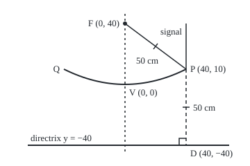

# Circles and parabolas: curves defined by a distance rule

Geometry and trig → Coordinates and Curves → Curves from a distance rule → Circles and parabolas

---

## General Overview

A satellite dish on a roof is 80 cm across and 10 cm deep. Signals from the satellite arrive as parallel rays, and every ray that hits the dish bounces to one spot, where a receiver sits on an arm. Where must the arm hold it?

The answer is 40 cm in front of the dish's centre. Cut the dish through its middle and the edge of the cut is a **parabola**: every point on it is as far from the receiver's spot as from a fixed straight line behind the dish. The spot is the **focus**; the line is the **directrix**. A rim point is 50 cm from each.

A **circle** is the simpler rule of the same kind: every point one fixed distance from a centre. The points 50 cm from the receiver form a circle through both rim points. Written with the distance formula, each rule becomes an equation, and the equation hands back the centre and radius, or the focus and directrix.

**A circle is every point at one distance from a centre; a parabola is every point equally far from a focus and a directrix; the distance formula turns each rule into an equation whose numbers name those parts.**

**What kind of fact this is:** two definitions, turned into equations on this card in Why it works; the dish's focusing is a theorem, proved there too.

### The picture: the dish, cut through its centre

<p align="center"></p>

Drawn at 1 cm = 2.2 units, y measured up the axis from the dish's centre V, the **vertex**. A signal falls onto the rim point P and bounces 50 cm to the receiver at F. The dashed drop from P meets the directrix at a right angle at D, also 50 cm away; the tick marks show PF = PD. Q is the opposite rim point.

---

## The formula

A point (x, y) is x cm across and y cm up from the vertex. Two points' distance is the square root of the across-gap squared plus the up-gap squared ([distance-and-midpoint](01-distance-and-midpoint.md)).

The circle with centre $(h, k)$ and radius $r$:

$$(x-h)^2 + (y-k)^2 = r^2$$

**Read it aloud:** the across-gap from the centre squared, plus the up-gap squared, makes the radius squared.

The upward parabola with vertex at the origin, focus $F$ at height $p$ and directrix the line $y = -p$:

$$x^2 = 4py$$

**Read it aloud:** the across-distance squared equals four times the focal length times the height.

With the vertex moved to $(h, k)$ it is $(x-h)^2 = 4p(y-k)$: focus $(h, k+p)$, directrix $y = k - p$. A negative p opens it downward; swapping x and y turns it on its side.

| Symbol | Plain meaning | In our example | Push it up and the answer… |
| --- | --- | --- | --- |
| $x$, $y$ | a point's position: across, and up the axis, in cm | rim point P at (40, 10) | — |
| $h$, $k$ | the circle's centre (or a moved parabola's vertex) | circle centred at (0, 40), the receiver | the whole curve slides |
| $r$ | the circle's radius | 50 cm | the circle grows |
| $p$ | the focal length: vertex to focus, and vertex to directrix | 40 cm | a flatter, shallower dish |
| $F$, $V$ | the focus and the vertex | (0, 40) and (0, 0) | — |
| $P$, $D$ | a point on the curve, and its foot on the directrix | (40, 10) and (40, −40) | — |

### When it holds

- **Flat, square grid.** The distance formula is Pythagoras: same unit on both axes, meeting at a right angle.
- **Axis along a grid line.** A tilted parabola has an extra term in xy, handled in conics-and-rational-parametrisation.
- **A positive radius, a nonzero focal length.** A tidied circle equation with 0 on the right is one point; with a negative number, no point. With $p = 0$ the focus lies on the directrix and there is no parabola.
- **Rays parallel to the axis.** Rays arriving at a slant do not meet at one point; they blur beside F, which is why the dish is aimed.

---

## Why it works

### Step 0: each curve is a distance rule

A **locus** is the set of all points obeying a rule. The circle's rule fixes one distance; the parabola's sets two distances equal. Write each distance in x and y and the rule becomes an equation.

### Step 1: the circle is Pythagoras

A point (x, y) and the centre (h, k) differ by x − h across and y − k up. Set their distance equal to r and square both sides: that is the circle equation. Squaring adds no false points, since neither side is negative. The minus signs are why a centre at (0, 40) shows up as y − 40.

### Step 2: the parabola is two distances set equal

Put the focus at (0, p) and the directrix at y = −p. For a point (x, y) above the directrix, the distance to the line is the straight drop to it, y + p. The distance to the focus is the square root of x squared plus (y − p) squared. Set them equal and square:

$$x^2 + (y-p)^2 = (y+p)^2$$

Expand both brackets. Each side carries $y^2$ and $p^2$; they cancel. What is left is $x^2 - 2py = 2py$, so $x^2 = 4py$. The 4 is the two cross terms, −2py and +2py, meeting across the equals sign. At P (40, 10) the distance to F is the square root of 1600 + 900, which is 50; the drop to the directrix is 10 + 40, also 50.

### Step 3: read the parts back

The maker knows width and depth, not focus. The rim at (40, 10) must satisfy $x^2 = 4py$: 1600 = 4p × 10, so 4p = 160, the equation is $x^2 = 160y$, and p = 40 cm.

A circle given in expanded form is read by **completing the square**, adding the number that turns $y^2 - 80y$ into a perfect square ([quadratic-formula](../../03-Algebra/02-Polynomials/03-quadratic-formula.md)). Take $x^2 + y^2 - 80y - 900 = 0$. Since $(y - 40)^2 = y^2 - 80y + 1600$, add 1600 to both sides: $x^2 + (y-40)^2 = 2500$. The centre is (0, 40), the receiver; the radius is the square root of 2500, 50 cm. Both rim points lie on it.

### Step 4: why every ray reaches the focus

The **tangent** at P is the straight line touching the curve there without crossing it. It is the line at right angles to FD through its midpoint (20, 0), with slope 0.5: rising 0.5 cm per cm across. Put it into $x^2 = 160y$ to get $x^2 - 80x + 1600 = 0$, which factors as $(x - 40)^2 = 0$: one repeated root, so the line meets the curve at P alone ([factoring-quadratics](../../03-Algebra/02-Polynomials/02-factoring-quadratics.md)).

The tangent also halves the angle FPD. A mirror returns light at the angle it arrived, and the falling signal continues the line DP, so it leaves along PF. Every point has its own D, so every ray parallel to the axis reaches F.

<details>
<summary>Detailed proof: the bisector of FD is the tangent, and it halves the angle</summary>

P is equally far from F and D, so it lies on the bisector: the line of points equally far from F and D, at right angles to FD through its midpoint M.

Any other point R on the bisector has RF = RD. Its drop to the directrix is shorter than RD unless R sits directly above D, and only P does. So R is nearer the directrix than F: outside the parabola. The bisector meets the curve only at P, without crossing: it is the tangent.

Triangles FPM and DPM have PF = PD, MF = MD and the shared side PM, so they are congruent (side-side-side) and their angles at P are equal. The falling ray continues line DP beyond P, so it meets the tangent at the same angle as PD, which equals the angle PF makes. Equal angles in and out is the mirror law.

</details>

The code bounces four falling rays off the curve; all four cross the axis at y = 40.00.

---

## Worked numbers, by hand

| Step | Arithmetic | Value |
| --- | --- | --- |
| rim point | half the width, and the depth | (40, 10) |
| put it into $x^2 = 4py$ | 40 × 40 = 4p × 10 | 4p = 160 |
| focal length | 160 ÷ 4 | **p = 40 cm** |
| rim to receiver | square root of (40 × 40 + 30 × 30) | 50 cm |
| rim to directrix | 10 + 40 | 50 cm |
| a point halfway out | 20 × 20 ÷ 160 | height 2.50 cm, 42.50 cm from both |
| circle round the receiver | add 1600 to $x^2 + y^2 - 80y = 900$ | $x^2 + (y-40)^2 = 2500$ |
| its radius | square root of 2500 | **50 cm** |

The arm holds the receiver 40 cm in front of the dish's centre, 50 cm from every rim point.

### What breaks if you drop a piece

| Mistake | Comes out at | What went wrong |
| --- | --- | --- |
| Reading 160 as p | receiver at 160 cm: rim 155.24 cm from it, 170.00 cm from the line | 160 is 4p |
| Full width for half | p = 160 cm | The rim is at x = 40 |
| 2500 as the radius | 2500 cm | That is r squared |
| Flipped sign | centre (0, −40) | y − 40 means +40 |

The code prints all four.

---

## Code, from first principles, and it actually runs

The focus comes from the equation and from four bounced rays. The rim tangent comes from the bisector of F and D and from a very short chord; a **discriminant** $b^2 - 4c$ of 0 in $x^2 + bx + c = 0$ means one repeated root. The circle's centre and radius come from completing the square and from three points on the circle, by solving two straight-line equations for the point equally far from all three ([two-equations-two-unknowns](../../03-Algebra/01-Letters%20and%20Equations/04-two-equations-two-unknowns.md)).

### Python

```python
# Circles and parabolas -- the check behind the card.  Only sqrt is imported.
# A dish 80 cm across and 10 cm deep, cut through its centre: the vertex at
# (0, 0), y in cm up the axis.  Each fact is reached by two roads.
from math import sqrt
W, DEPTH = 80.0, 10.0                     # dish width and depth (cm)
p = (W / 2) ** 2 / (4 * DEPTH)            # road one: x^2 = 4py at the rim gives p
def curve(x): return x * x / (4 * p)      # the dish's height at x
def dist(P, Q): return sqrt((P[0] - Q[0]) ** 2 + (P[1] - Q[1]) ** 2)

def ray_crossing(x):                      # road two: a signal falls straight down,
    e = 1e-6                              # bounces off the dish and crosses the axis
    m = (curve(x + e) - curve(x - e)) / (2 * e)        # slope of a very short chord
    ux, uy = 1 / sqrt(1 + m * m), m / sqrt(1 + m * m)  # unit arrow along the surface
    d = -uy                                # dot product of (0, -1) with that arrow
    rx, ry = 2 * d * ux, 2 * d * uy + 1    # mirror image: 2 (v . u) u - v
    t = -x / rx                            # distance travelled to reach x = 0
    return curve(x) + t * ry, t

print(f"dish {W:.0f} cm across, {DEPTH:.0f} cm deep: 4p = {4 * p:.2f}, p = {p:.2f} cm")
print(f"focus F (0, {p:.2f}); directrix y = {-p:.2f}; equation x^2 = {4 * p:.0f} y")
for x in (0.0, 20.0, 40.0):
    P = (x, curve(x))
    print(f"point ({x:.0f}, {P[1]:.2f}): to F {dist(P, (0, p)):.2f} cm, to directrix {P[1] + p:.2f} cm")
for x in (12.0, 20.0, 28.0, 40.0):
    y, t = ray_crossing(x)
    print(f"ray down at x = {x:.0f}: bounces, crosses the axis at y = {y:.2f} after {t:.2f} cm")
Fp, Dp = (0.0, p), (40.0, -p)            # focus, and the rim point's foot on the directrix
m = 40.0 / (2 * p)                        # tangent: at right angles to F->D, through P
b, c = -4 * p * m, -4 * p * (DEPTH - 40 * m) # put y = DEPTH + m(x - 40) in x^2 = 4py
chord = (curve(40 + 1e-6) - curve(40 - 1e-6)) / 2e-6
print(f"tangent at P (40, {DEPTH:.0f}): through midpoint ({(Fp[0] + Dp[0]) / 2:.2f}, {(Fp[1] + Dp[1]) / 2:.2f}) "
      f"of F and D (40, {Dp[1]:.2f}), slope {m:.2f}; x^2 {b:+.0f}x {c:+.0f} = 0, discriminant {b * b - 4 * c:.2f}")
D, E, F = 0, -80, -900                    # the circle x^2 + y^2 + Dx + Ey + F = 0
h, k = -D / 2, -E / 2                     # road one: complete both squares
r = sqrt(h * h + k * k - F)
pts = [(40, 10), (-40, 10), (30, 80)]     # three points that satisfy it exactly
on = "yes" if all(x * x + y * y + D * x + E * y + F == 0 for x, y in pts) else "no"
(x1, y1), (x2, y2), (x3, y3) = pts        # road two: the point equally far from all
a1, b1, c1 = 2 * (x2 - x1), 2 * (y2 - y1), x2 * x2 + y2 * y2 - x1 * x1 - y1 * y1
a2, b2, c2 = 2 * (x3 - x1), 2 * (y3 - y1), x3 * x3 + y3 * y3 - x1 * x1 - y1 * y1
det = a1 * b2 - a2 * b1                   # two straight-line equations, Cramer's rule
cx, cy = (c1 * b2 - c2 * b1) / det + 0.0, (a1 * c2 - a2 * c1) / det
cr = dist((cx, cy), pts[0])
print(f"circle x^2 + y^2 - 80y - 900 = 0: centre ({h:.2f}, {k:.2f}), radius {r:.2f} cm")
print(f"three points on it: {on}; the point equally far from them: ({cx:.2f}, {cy:.2f}), {cr:.2f} cm")
print(f"mistake, 4p read as p: focus at {4 * p:.2f} cm, rim point {dist((40, DEPTH), (0, 4 * p)):.2f} cm "
      f"from it, {DEPTH + 4 * p:.2f} cm from its directrix")
print(f"mistake, full width for half: p = {W * W / (4 * DEPTH):.2f} cm")
print(f"mistake, r^2 read as r: radius {r * r:.2f}; sign flipped: centre (0.00, {-k:.2f})")
s, Y0 = 2.2, 122.0                        # figure: 1 cm = 2.2 units, y down
def fig(x, y): return f"({180 + s * x:.2f}, {Y0 - s * y:.2f})"
print(f"figure, 1 cm = {s} units: V {fig(0, 0)}, F {fig(0, p)}, P {fig(40, DEPTH)}, Q {fig(-40, DEPTH)}, "
      f"control {fig(0, -DEPTH)}, D {fig(40, -p)}, ray top {fig(40, 40)}")
for x in (12.0, 20.0, 28.0, 40.0):
    assert abs(ray_crossing(x)[0] - p) < 1e-6              # the bounce finds the focus
for x in (5.0, 25.0, 40.0):
    assert abs(dist((x, curve(x)), (0, p)) - (curve(x) + p)) < 1e-9   # the distance rule
assert abs(m - chord) < 1e-6 and abs(b * b - 4 * c) < 1e-9  # tangent: two roads, one touch
assert on == "yes" and abs(cx - h) + abs(cy - k) + abs(cr - r) < 1e-9  # centre and radius
print("ALL CHECKS PASS")
```

**Ran 2026-09-24 on macOS, Python 3.14.6, standard library only. All checks passed. Output, pasted from the run:**

```
dish 80 cm across, 10 cm deep: 4p = 160.00, p = 40.00 cm
focus F (0, 40.00); directrix y = -40.00; equation x^2 = 160 y
point (0, 0.00): to F 40.00 cm, to directrix 40.00 cm
point (20, 2.50): to F 42.50 cm, to directrix 42.50 cm
point (40, 10.00): to F 50.00 cm, to directrix 50.00 cm
ray down at x = 12: bounces, crosses the axis at y = 40.00 after 40.90 cm
ray down at x = 20: bounces, crosses the axis at y = 40.00 after 42.50 cm
ray down at x = 28: bounces, crosses the axis at y = 40.00 after 44.90 cm
ray down at x = 40: bounces, crosses the axis at y = 40.00 after 50.00 cm
tangent at P (40, 10): through midpoint (20.00, 0.00) of F and D (40, -40.00), slope 0.50; x^2 -80x +1600 = 0, discriminant 0.00
circle x^2 + y^2 - 80y - 900 = 0: centre (0.00, 40.00), radius 50.00 cm
three points on it: yes; the point equally far from them: (0.00, 40.00), 50.00 cm
mistake, 4p read as p: focus at 160.00 cm, rim point 155.24 cm from it, 170.00 cm from its directrix
mistake, full width for half: p = 160.00 cm
mistake, r^2 read as r: radius 2500.00; sign flipped: centre (0.00, -40.00)
figure, 1 cm = 2.2 units: V (180.00, 122.00), F (180.00, 34.00), P (268.00, 100.00), Q (92.00, 100.00), control (180.00, 144.00), D (268.00, 210.00), ray top (268.00, 34.00)
ALL CHECKS PASS
```

### Rust

Same numbers, same labels, built with `rustc --edition 2021 -O`.

```rust
// Circles and parabolas -- the same check as the Python, in Rust.  No crates.
// A dish 80 cm across and 10 cm deep, cut through its centre: the vertex at
// (0, 0), y in cm up the axis.  Each fact is reached by two roads.
const W: f64 = 80.0; // dish width (cm)
const DEPTH: f64 = 10.0; // dish depth (cm)

fn p() -> f64 { (W / 2.0).powi(2) / (4.0 * DEPTH) } // road one: x^2 = 4py at the rim
fn curve(x: f64) -> f64 { x * x / (4.0 * p()) } // the dish's height at x
fn dist(a: (f64, f64), b: (f64, f64)) -> f64 { ((a.0 - b.0).powi(2) + (a.1 - b.1).powi(2)).sqrt() }

fn ray_crossing(x: f64) -> (f64, f64) {
    // road two: a signal falls straight down, bounces off the dish, crosses the axis
    let e = 1e-6;
    let m = (curve(x + e) - curve(x - e)) / (2.0 * e); // slope of a very short chord
    let n = (1.0 + m * m).sqrt();
    let (ux, uy) = (1.0 / n, m / n); // unit arrow along the surface
    let d = -uy; // dot product of (0, -1) with that arrow
    let (rx, ry) = (2.0 * d * ux, 2.0 * d * uy + 1.0); // mirror image: 2 (v . u) u - v
    let t = -x / rx; // distance travelled to reach x = 0
    (curve(x) + t * ry, t)
}

fn main() {
    let p = p();
    println!("dish {:.0} cm across, {:.0} cm deep: 4p = {:.2}, p = {:.2} cm", W, DEPTH, 4.0 * p, p);
    println!("focus F (0, {:.2}); directrix y = {:.2}; equation x^2 = {:.0} y", p, -p, 4.0 * p);
    for x in [0.0, 20.0, 40.0] {
        let pt = (x, curve(x));
        println!("point ({:.0}, {:.2}): to F {:.2} cm, to directrix {:.2} cm", x, pt.1, dist(pt, (0.0, p)), pt.1 + p);
    }
    for x in [12.0, 20.0, 28.0, 40.0] {
        let (y, t) = ray_crossing(x);
        println!("ray down at x = {:.0}: bounces, crosses the axis at y = {:.2} after {:.2} cm", x, y, t);
    }
    let (fp, dp) = ((0.0, p), (40.0, -p)); // focus, and the rim point's foot on the directrix
    let m = 40.0 / (2.0 * p); // tangent: at right angles to F->D, through P
    let (b, c) = (-4.0 * p * m, -4.0 * p * (DEPTH - 40.0 * m)); // put y = DEPTH + m(x - 40) in x^2 = 4py
    let chord = (curve(40.0 + 1e-6) - curve(40.0 - 1e-6)) / 2e-6;
    println!("tangent at P (40, {:.0}): through midpoint ({:.2}, {:.2}) of F and D (40, {:.2}), slope {:.2}; x^2 {:+.0}x {:+.0} = 0, discriminant {:.2}",
             DEPTH, (fp.0 + dp.0) / 2.0, (fp.1 + dp.1) / 2.0, dp.1, m, b, c, b * b - 4.0 * c);
    let (dc, ec, fc) = (0i64, -80i64, -900i64); // the circle x^2 + y^2 + Dx + Ey + F = 0
    let (h, k) = (-dc as f64 / 2.0, -ec as f64 / 2.0); // road one: complete both squares
    let r = (h * h + k * k - fc as f64).sqrt();
    let pts: [(i64, i64); 3] = [(40, 10), (-40, 10), (30, 80)]; // three points on it
    let on = pts.iter().all(|&(x, y)| x * x + y * y + dc * x + ec * y + fc == 0);
    let f: Vec<(f64, f64)> = pts.iter().map(|&(x, y)| (x as f64, y as f64)).collect();
    let (a1, b1) = (2.0 * (f[1].0 - f[0].0), 2.0 * (f[1].1 - f[0].1)); // road two: the point
    let (a2, b2) = (2.0 * (f[2].0 - f[0].0), 2.0 * (f[2].1 - f[0].1)); // equally far from all
    let c1 = f[1].0 * f[1].0 + f[1].1 * f[1].1 - f[0].0 * f[0].0 - f[0].1 * f[0].1;
    let c2 = f[2].0 * f[2].0 + f[2].1 * f[2].1 - f[0].0 * f[0].0 - f[0].1 * f[0].1;
    let det = a1 * b2 - a2 * b1; // two straight-line equations, Cramer's rule
    let (cx, cy) = ((c1 * b2 - c2 * b1) / det + 0.0, (a1 * c2 - a2 * c1) / det);
    let cr = dist((cx, cy), f[0]);
    println!("circle x^2 + y^2 - 80y - 900 = 0: centre ({:.2}, {:.2}), radius {:.2} cm", h, k, r);
    println!("three points on it: {}; the point equally far from them: ({:.2}, {:.2}), {:.2} cm",
             if on { "yes" } else { "no" }, cx, cy, cr);
    println!("mistake, 4p read as p: focus at {:.2} cm, rim point {:.2} cm from it, {:.2} cm from its directrix",
             4.0 * p, dist((40.0, DEPTH), (0.0, 4.0 * p)), DEPTH + 4.0 * p);
    println!("mistake, full width for half: p = {:.2} cm", W * W / (4.0 * DEPTH));
    println!("mistake, r^2 read as r: radius {:.2}; sign flipped: centre (0.00, {:.2})", r * r, -k);
    let (s, y0) = (2.2, 122.0); // figure: 1 cm = 2.2 units, y down
    let fig = |x: f64, y: f64| format!("({:.2}, {:.2})", 180.0 + s * x, y0 - s * y);
    println!("figure, 1 cm = {} units: V {}, F {}, P {}, Q {}, control {}, D {}, ray top {}", s,
             fig(0.0, 0.0), fig(0.0, p), fig(40.0, DEPTH), fig(-40.0, DEPTH), fig(0.0, -DEPTH), fig(40.0, -p), fig(40.0, 40.0));
    for x in [12.0, 20.0, 28.0, 40.0] {
        assert!((ray_crossing(x).0 - p).abs() < 1e-6); // the bounce finds the focus
    }
    for x in [5.0, 25.0, 40.0] {
        assert!((dist((x, curve(x)), (0.0, p)) - (curve(x) + p)).abs() < 1e-9); // the distance rule
    }
    assert!((m - chord).abs() < 1e-6 && (b * b - 4.0 * c).abs() < 1e-9); // tangent: two roads, one touch
    assert!(on && (cx - h).abs() + (cy - k).abs() + (cr - r).abs() < 1e-9); // centre and radius
    println!("ALL CHECKS PASS");
}
```

**Ran 2026-09-24 on macOS, rustc 1.98.1, no crates. All checks passed. Output, pasted from the run:**

```
dish 80 cm across, 10 cm deep: 4p = 160.00, p = 40.00 cm
focus F (0, 40.00); directrix y = -40.00; equation x^2 = 160 y
point (0, 0.00): to F 40.00 cm, to directrix 40.00 cm
point (20, 2.50): to F 42.50 cm, to directrix 42.50 cm
point (40, 10.00): to F 50.00 cm, to directrix 50.00 cm
ray down at x = 12: bounces, crosses the axis at y = 40.00 after 40.90 cm
ray down at x = 20: bounces, crosses the axis at y = 40.00 after 42.50 cm
ray down at x = 28: bounces, crosses the axis at y = 40.00 after 44.90 cm
ray down at x = 40: bounces, crosses the axis at y = 40.00 after 50.00 cm
tangent at P (40, 10): through midpoint (20.00, 0.00) of F and D (40, -40.00), slope 0.50; x^2 -80x +1600 = 0, discriminant 0.00
circle x^2 + y^2 - 80y - 900 = 0: centre (0.00, 40.00), radius 50.00 cm
three points on it: yes; the point equally far from them: (0.00, 40.00), 50.00 cm
mistake, 4p read as p: focus at 160.00 cm, rim point 155.24 cm from it, 170.00 cm from its directrix
mistake, full width for half: p = 160.00 cm
mistake, r^2 read as r: radius 2500.00; sign flipped: centre (0.00, -40.00)
figure, 1 cm = 2.2 units: V (180.00, 122.00), F (180.00, 34.00), P (268.00, 100.00), Q (92.00, 100.00), control (180.00, 144.00), D (268.00, 210.00), ray top (268.00, 34.00)
ALL CHECKS PASS
```

The two outputs match line for line.

> [!TIP]
> **Try changing**
> Guess first, then run it.
> - **A deeper dish.** Set `DEPTH` to `20.0`: 4p = 80, the receiver moves in to 20 cm, and every assert still passes, since the argument holds at any depth.
> - **Drop the 4.** In `curve`, divide by `2 * p` instead of `4 * p`: the rays now cross the axis at 20 cm, not 40, and the first assert stops it.
> - **Flip a sign in the circle.** Make `k` equal `E / 2` (in Rust, drop the minus before `ec`): the completed square says the centre is at (0, −40), the three points say (0, 40), and the last assert stops it.

---

## The usual mistake

> [!warning]
> **Reading a number off the equation before it is in standard form.** In $x^2 = 160y$ the 160 is 4p: the receiver belongs at 40 cm, and at 160 cm the signal misses it. In $x^2 + y^2 - 80y - 900 = 0$ nothing is readable until the square is completed, and then 2500 is the radius squared and y − 40 means a centre at +40.

---

## Where you meet it in real life

- **Satellite dishes and radio telescopes.** Signals parallel to the axis gather at the focus, where the receiver sits.
- **Car headlights and torches.** Run the same bounce backwards: a bulb at the focus sends light out in a parallel beam.
- **Positioning.** A phone's distance from one mast puts it on a circle round the mast; several masts pin it where the circles meet.

> **Say it back**
> A circle is every point at one distance from a centre: $(x-h)^2 + (y-k)^2 = r^2$. A parabola is every point as far from a focus as from a directrix: $x^2 = 4py$. A dish 80 cm across and 10 cm deep satisfies $x^2 = 160y$, so its focus is 40 cm out. The tangent at each point halves the angle between focus and directrix, so every ray along the axis bounces to the receiver.

---

## What this builds on

- [distance-and-midpoint](01-distance-and-midpoint.md): the distance formula that turns each rule into an equation.
- [factoring-quadratics](../../03-Algebra/02-Polynomials/02-factoring-quadratics.md): the repeated root that shows the tangent touches once.

## Where this goes next

- [ellipses-and-hyperbolas](05-ellipses-and-hyperbolas.md): two foci, with a fixed sum or a fixed difference of distances.
- [elliptic-curves-and-point-addition](../06-Beyond%20Euclid/05-elliptic-curves-and-point-addition.md): a cubic curve where a line through two points meets a third.
- conics-and-rational-parametrisation: every curve of degree two, tilted or not, and its points listed by one parameter.
- osculating-circle: the circle that hugs a curve best at a point; at the dish's vertex its radius is 2p.

A parabola has one focus and a line; a curve kept a fixed total distance from two foci closes up into an oval, and the next card finds its equation.

---

## Sources

Verified 24 Sep 2026: every link below resolves to the publisher's page.

- Abramson, Jay, et al. *Precalculus 2e*, section 10.3, "The Parabola". OpenStax, Rice University. [Section page](https://openstax.org/books/precalculus-2e/pages/10-3-the-parabola). The focus and directrix derivation, the moved and sideways forms, and reflectors.
- O'Connor, J. J., and E. F. Robertson. "Diocles." MacTutor Archive, University of St Andrews. [Biography](https://mathshistory.st-andrews.ac.uk/Biographies/Diocles/). *On burning mirrors*, the first proof of the parabolic mirror's focal property and the focus-directrix construction.
- O'Connor, J. J., and E. F. Robertson. "Apollonius of Perga." MacTutor Archive, University of St Andrews. [Biography](https://mathshistory.st-andrews.ac.uk/Biographies/Apollonius/). The *Conics*, which named the parabola.
