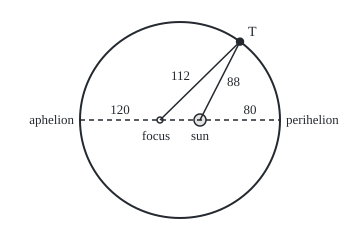
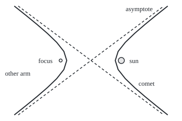

# Ellipses and hyperbolas: fixed sum and fixed difference of distances

[Syllabus](../../../SYLLABUS.md) → [Geometry and trig](../README.md) → [Coordinates and Curves](../README.md#s04) → Ellipses and hyperbolas

---

## General Overview

A planet's orbit has a long half-width of 100 million km and eccentricity 0.2: its sun sits 0.2 of that half-width, 20 million km, off centre. So the planet passes 80 million km from it at perihelion, the closest point, and 120 million km at aphelion, the farthest. Mercury's orbit is close to this shape.

Mark an empty point 20 million km on the other side of the centre. From any spot on the orbit, the distance to the sun plus the distance to that point is 200 million km: 80 + 120 at perihelion, 88 + 112 at a spot 60 million km right of the centre. A loop of string round two pegs, pencil held taut, draws the shape; the pegs are its **foci** (one **focus**), the word used from here on.

Fix the *difference* of the two distances instead and the curve opens into two arms, a **hyperbola**: the path of a comet that passes once and leaves.

**An ellipse is every point whose distances to two foci add to a fixed total; a hyperbola, every point whose distances differ by a fixed amount.**

**What kind of fact this is:** a definition of the two curves; their standard equations and the eccentricity test are proved from it in Why it works.

### The picture: the orbit, to scale

<p align="center"></p>

Drawn at 1 million km = 1 unit; filled dot the sun, open dot the empty focus. The short half-width is 97.98 against 100: the orbit is barely out of round, and the sun's offset is what shows.

---

## The formula

Centre the orbit at (0, 0), long axis along the x-axis, in millions of km; the sun is at (20, 0). A point (x, y) is on the orbit when

$$\frac{x^2}{a^2} + \frac{y^2}{b^2} = 1, \qquad c^2 = a^2 - b^2, \qquad e = \frac{c}{a}$$

**Read it aloud:** across-distance over the long half-width, squared, plus up-distance over the short half-width, squared, makes one.

The hyperbola changes one sign in each:

$$\frac{x^2}{a^2} - \frac{y^2}{b^2} = 1, \qquad c^2 = a^2 + b^2$$

**Read it aloud:** the same two squares, one taken from the other, makes one.

The comet shares the foci, (±20, 0), and its distances differ by 32 million km, so $a$ = 16, $b$ = 12, and it passes the sun at 20 − 16 = 4 million km.

| Symbol | Plain meaning | In our example | Push it up and the answer… |
| --- | --- | --- | --- |
| $x$, $y$ | position across and up from the centre | T = (60, 78.38) | — |
| $a$ | half the fixed sum or difference | 100; comet 16 | the curve grows |
| $b$ | short half-axis; for a hyperbola, the arms' steepness | 97.98; 12 | rounder ellipse; wider arms |
| $c$ | centre to each focus | 20 | the foci spread apart |
| $e$ | eccentricity, $c$ divided by $a$ | 0.2; 1.25 | more stretch; past 1, a hyperbola |
| $L$, $R$ | distances to the empty focus and the sun | 112 and 88 at T | — |
| $P$, $Q$ | the numbers multiplying $x^2$ and $y^2$ | 24 and 25 | their signs name the curve |
| $U$, $V$, $W$ | the numbers multiplying $x$ and $y$, and the constant | 960, 0, −230400 | move the curve, not its shape |

**Telling the four apart.** With its axes along the x- and y-axes, each is $Px^2 + Qy^2 + Ux + Vy + W = 0$. Equal $P$ and $Q$ of one sign: circle, $e$ = 0. Unequal, one sign: ellipse, $e$ below 1. One of them 0: parabola, $e$ = 1. Opposite signs: hyperbola, $e$ above 1.

### When it holds

- **No tilt.** A tilted conic gains a term in x times y and the sign test fails; OpenStax 10.4 (Sources) gives the tilted test.
- **The right gap.** An ellipse needs $2a$ longer than the gap between the foci, $2c$, or it flattens to a segment or vanishes; a hyperbola needs $2a$ between 0 and $2c$.
- **Which axis is long.** A larger denominator under $y^2$ stands the ellipse upright, foci at (0, ±c); a hyperbola opens along whichever square is positive.
- **A real curve left over.** $x^2 + y^2 + 1 = 0$ passes the sign test and has no points; completing squares shows it.

---

## Why it works

### Step 0: one identity serves both curves

For any point (x, y), the distance formula ([Distance and midpoint](01-distance-and-midpoint.md)) gives $L^2 = (x + c)^2 + y^2$ and $R^2 = (x - c)^2 + y^2$. Subtract, and all but one term cancels:

$$L^2 - R^2 = 4cx$$

The curves differ only in which of $L + R$ and $L - R$ is fixed.

### Step 1: a fixed sum splits into two exact distances

On the ellipse $L + R = 2a$. Write the left side of Step 0 as $(L - R)(L + R)$ and divide by $2a$: $L - R = 2cx/a$. Adding and subtracting the two equations:

$$L = a + ex, \qquad R = a - ex$$

At T, x = 60: R = 100 − 0.2 × 60 = 88, L = 112. The sun's distance is least at x = a, $a - c$ = 80, and greatest at x = −a, $a + c$ = 120.

### Step 2: square once, and the standard form appears

Set $R = a - ex$ equal to its distance-formula value and square: $(x - c)^2 + y^2 = (a - cx/a)^2$. The $-2cx$ on each side cancels, leaving $x^2(1 - c^2/a^2) + y^2 = a^2 - c^2$. Name $a^2 - c^2$ as $b^2$ and divide by it: the ellipse's equation. At the top both distances are $a$, so centre, focus and top make a right triangle: $b^2 = 100^2 - 20^2$ = 9600, $b$ = 97.98.

### Step 3: a fixed difference flips one sign

On the comet's arm $L - R = 2a$. The same factoring gives $L + R = 2cx/a$ and $R = ex - a$. Squaring as before gives $x^2(c^2/a^2 - 1) - y^2 = c^2 - a^2$. Now $c$ exceeds $a$, so $b^2 = c^2 - a^2$ = 400 − 256 = 144 is positive and the minus lands in the equation. The other arm, $L - R = -2a$, is its mirror image. Far out the arms hug the lines $y = \pm(b/a)x$, the asymptotes: at y = 3000, y ÷ x = 0.7500 = 12 ÷ 16.

### The picture: the comet's hyperbola, to scale

<p align="center"></p>

Drawn at 1 million km = 3 units. The comet's arm bends round the sun, 4 million km away at its tip; the dashed asymptotes have slope 0.75.

### Step 4: eccentricity is one ratio for all four curves

Step 1 gave $R = a - ex = e(a/e - x)$. The bracket is the distance to the upright line $x = a/e$ = 500, the **directrix**. So the sun's distance is always $e$ times the directrix distance: at T, 88 ÷ 440 = 0.2000. The comet's directrix is $x$ = 12.8: at its tip, 4 ÷ 3.2 = 1.2500. Equal distances, $e$ = 1, is the parabola of [Circles and parabolas](04-circles-and-parabolas.md); a circle is an ellipse whose foci have met, $c$ = 0 and so $e$ = 0.

### Step 5: read the curve off a general equation

With the sun at (0, 0), clearing fractions gives $24x^2 + 25y^2 + 960x - 230400 = 0$. Completing the square in $x$ gives $24(x + 20)^2 + 25y^2$ = a constant, and dividing by it returns the denominators 10000 and 9600. Completing squares shifts the curve without touching $P$ and $Q$: their signs decide the curve, their ratio its shape, $e^2 = 1 - 24/25$.

<details>
<summary>Detailed proof</summary>

Squaring can add points, so the reverse needs checking.

- **Ellipse.** The equation forces $x^2 \le a^2$, so $a - ex \ge a - c > 0$. Substituting $y^2 = b^2(1 - x^2/a^2)$ into $(x - c)^2 + y^2$ gives exactly $(a - ex)^2$, so $R = a - ex$; likewise $L = a + ex$. They add to $2a$.
- **Hyperbola.** The equation forces $x^2 \ge a^2$. On the right arm $ex - a \ge c - a > 0$, and the same substitution gives $R = ex - a$, $L = ex + a$, differing by $2a$. The left arm mirrors it.
- **The sign test.** Completed, the equation is $P$ times a square plus $Q$ times a square equals a constant, and the denominators are the constant over $P$ and over $Q$. Same signs throughout give an ellipse with $e^2 = 1 - P/Q$ (taking $P < Q$); opposite signs a hyperbola with $e^2 = 1 + |P/Q|$ (opening along $x$); a zero leaves one variable unsquared, a parabola.

</details>

Another route names them: each is a flat slice of a double cone, hence "conic"; Projective varieties makes the four one curve.

---

## Worked numbers, by hand

| Step | Arithmetic | Value |
| --- | --- | --- |
| centre to focus | $c = ae$ = 100 × 0.2 | 20 million km |
| short half-axis | $b = \sqrt{100^2 - 20^2} = \sqrt{9600}$ | 97.98 million km |
| perihelion, aphelion | $a - c$, $a + c$ | **80 and 120 million km** |
| T, 60 across | $R = a - ex$ = 100 − 12; $L$ = 100 + 12 | 88 + 112 = 200 |
| directrix check | 88 ÷ (500 − 60) | 0.2000 |
| comet | $b = \sqrt{20^2 - 16^2}$; $e$ = 20 ÷ 16 | 12; **1.2500** |

| Equation | $P$, $Q$ | Curve | $e$ |
| --- | --- | --- | --- |
| $24x^2 + 25y^2 + 960x - 230400 = 0$, orbit | 24, 25 | ellipse | 0.2000 |
| $9x^2 - 16y^2 - 2304 = 0$, comet | 9, −16 | hyperbola | 1.2500 |
| $x^2 + y^2 - 10000 = 0$, round orbit | 1, 1 | circle | 0.0000 |
| $y^2 - 16x - 64 = 0$, escaping comet | 0, 1 | parabola | 1.0000 |

### What breaks if you drop a piece

| Mistake | Comes out at | What went wrong |
| --- | --- | --- |
| Ellipse focus from $\sqrt{a^2 + b^2}$ | 140.00, outside the orbit | the hyperbola's rule |
| Perihelion as $a - b$ | 2.02 million km | $b$ is not the sun's offset |
| Comet focus from $\sqrt{a^2 - b^2}$ | 10.58, inside the tip at 16 | the ellipse's rule |

---

## Code, from first principles, and it actually runs

Road one is the standard-form formulas. Road two never uses them: on a grid with the two foci, halving an interval 200 times finds points obeying the distance rule itself, 2001 of them round the orbit, and the comet's arm. Road three completes the squares of each general equation; its eccentricity must match the grid's.

### Python

```python
# Ellipses and hyperbolas -- the check behind the card.  Only sqrt is imported.
# A planet's orbit: long half-axis a = 100 (million km), eccentricity e = 0.2, the
# Sun at the focus (20, 0).  A comet's hyperbola shares the foci; difference 32.
from math import sqrt
a, e = 100.0, 0.2
c = a * e                                     # road one: the standard-form formulas
b = sqrt(a * a - c * c)
def d(x, y, fx): return sqrt((x - fx) ** 2 + y * y)          # distance to focus (fx, 0)
def total(x, y): return d(x, y, -c) + d(x, y, c)             # the ellipse's sum rule
def diff(x, y): return d(x, y, -c) - d(x, y, c)              # the hyperbola's difference rule
def halve(f, target, lo, hi):                 # road two: find t with f(t) = target, f rising
    for _ in range(200):
        mid = (lo + hi) / 2
        lo, hi = (mid, hi) if f(mid) < target else (lo, mid)
    return (lo + hi) / 2
def classify(P, Q, U, V, W):                  # P x^2 + Q y^2 + U x + V y + W = 0, no xy term
    if P * Q == 0: return "parabola", 0.0, 0.0
    K = -W + U * U / (4 * P) + V * V / (4 * Q)                 # after completing both squares
    s, t = K / P, K / Q                                        # the two denominators
    if s > 0 and t > 0: return ("circle" if s == t else "ellipse"), max(s, t), min(s, t)
    if s * t < 0: return "hyperbola", max(s, t), -min(s, t)
    return "no curve, a point or two lines", 0.0, 0.0
va, hb = halve(lambda x: total(x, 0), 2 * a, c, 3 * a), halve(lambda y: total(0, y), 2 * a, 0, 2 * a)
yP = halve(lambda y: total(60, y), 2 * a, 0, 2 * a)
sun = [d(x, halve(lambda y: total(x, y), 2 * a, 0, 2 * a), c) for x in (a * (i - 1000) / 1000 for i in range(2001))]
print(f"orbit: a = {a:.2f}, e = {e:.2f}, c = ae = {c:.2f}, b = sqrt(a^2 - c^2) = {b:.2f}")
print(f"formulas: perihelion a - c = {a - c:.2f}, aphelion a + c = {a + c:.2f}, sum 2a = {2 * a:.2f}")
print(f"halving on the sum rule: vertex x = {va:.2f}, height at x = 0: {hb:.2f}, T = (60.00, {yP:.2f}) "
      f"at {d(60, yP, -c):.2f} + {d(60, yP, c):.2f}")
print(f"scan of 2001 points: nearest the Sun {min(sun):.2f}, farthest {max(sun):.2f}; "
      f"x^2/a^2 + y^2/b^2 at T = {60 ** 2 / a ** 2 + yP ** 2 / b ** 2:.6f}")
print(f"directrix x = a/e = {a / e:.2f}; at T {d(60, yP, c):.2f} / {a / e - 60:.2f} = {d(60, yP, c) / (a / e - 60):.4f}")
h = 16.0; k = sqrt(c * c - h * h)             # the comet: half the difference, and its b
hv, x12 = halve(lambda x: diff(x, 0), 2 * h, 0, c), halve(lambda x: diff(x, 12), 2 * h, 0, 1000)
x3k = halve(lambda x: diff(x, 3000), 2 * h, 0, 10000)
print(f"comet: a = {h:.2f}, b = sqrt({c * c:.2f} - {h * h:.2f}) = {k:.2f}, e = c/a = {c / h:.4f}, closest c - a = {c - h:.2f}")
print(f"halving on the difference rule: vertex x = {hv:.2f}, at y = 12 x = {x12:.2f} (formula {h * sqrt(1 + 144 / k ** 2):.2f}), "
      f"left branch {diff(-x12, 12):.2f}, y/x at y = 3000: {3000 / x3k:.4f}")
print(f"comet directrix x = a/e = {h * h / c:.2f}; at the vertex {c - hv:.2f} / {hv - h * h / c:.2f} = {(c - hv) / (hv - h * h / c):.4f}")
ecc, ax = {}, {}
for name0, co in (("orbit", (24, 25, 960, 0, -230400)), ("comet", (9, -16, 0, 0, -2304)),
                  ("round orbit", (1, 1, 0, 0, -10000)), ("escaping comet", (0, 1, -16, 0, -64))):
    name, A2, B2 = classify(*co)
    ecc[name0], ax[name0] = (1.0 if name == "parabola" else sqrt(1 - B2 / A2 if name != "hyperbola" else 1 + B2 / A2)), A2
    print(f"{name0}, P, Q, U, V, W = {', '.join(map(str, co))}: {name}, "
          + (f"a^2 = {A2:.2f}, b^2 = {B2:.2f}, " if A2 else "") + f"e = {ecc[name0]:.4f}")
print(f"mistakes: ellipse c from a^2 + b^2 = {sqrt(a * a + b * b):.2f}; comet c from a^2 - b^2 = {sqrt(h * h - k * k):.2f}; "
      f"perihelion as a - b = {a - b:.2f}")
print(f"figure, orbit, 1 million km = 1 unit: centre (180.00, 120.00), rx {a:.2f}, ry {b:.2f}, empty focus ({180 - c:.2f}, 120.00), "
      f"Sun ({180 + c:.2f}, 120.00), T ({180 + 60:.2f}, {120 - yP:.2f})")
print(f"figure, comet, 1 million km = 3 units: vertices ({180 - 3 * h:.2f}, 120.00) ({180 + 3 * h:.2f}, 120.00), foci ({180 - 3 * c:.2f}, 120.00) "
      f"({180 + 3 * c:.2f}, 120.00), asymptote ends ({180 - 3 * 36 * h / k:.2f}, 12.00) ({180 + 3 * 36 * h / k:.2f}, 228.00)")
br = [(halve(lambda x: diff(x, y), 2 * h, 0, 1000), y) for y in range(-36, 37, 6)]
print("figure, right branch:", " ".join(f"{180 + 3 * x:.2f},{120 - 3 * y:.2f}" for x, y in br))
print("figure, left branch:", " ".join(f"{180 - 3 * x:.2f},{120 - 3 * y:.2f}" for x, y in br))
assert abs(hb - b) < 1e-9                                   # halving on the sum rule meets b
assert abs(min(sun) - (a - c)) + abs(max(sun) - (a + c)) < 1e-9     # nearest, farthest
assert abs(x12 - h * sqrt(1 + 144 / k ** 2)) < 1e-9           # halving on the difference rule
assert abs(ecc["orbit"] - c / va) + abs(ecc["comet"] - c / hv) + abs(sqrt(ax["orbit"]) - va) + abs(sqrt(ax["comet"]) - hv) < 1e-9  # equation vs geometry
print("ALL CHECKS PASS")
```

**Ran 2026-09-24 on macOS, Python 3.14.6, standard library only. All checks passed. Output, pasted from the run:**

```
orbit: a = 100.00, e = 0.20, c = ae = 20.00, b = sqrt(a^2 - c^2) = 97.98
formulas: perihelion a - c = 80.00, aphelion a + c = 120.00, sum 2a = 200.00
halving on the sum rule: vertex x = 100.00, height at x = 0: 97.98, T = (60.00, 78.38) at 112.00 + 88.00
scan of 2001 points: nearest the Sun 80.00, farthest 120.00; x^2/a^2 + y^2/b^2 at T = 1.000000
directrix x = a/e = 500.00; at T 88.00 / 440.00 = 0.2000
comet: a = 16.00, b = sqrt(400.00 - 256.00) = 12.00, e = c/a = 1.2500, closest c - a = 4.00
halving on the difference rule: vertex x = 16.00, at y = 12 x = 22.63 (formula 22.63), left branch -32.00, y/x at y = 3000: 0.7500
comet directrix x = a/e = 12.80; at the vertex 4.00 / 3.20 = 1.2500
orbit, P, Q, U, V, W = 24, 25, 960, 0, -230400: ellipse, a^2 = 10000.00, b^2 = 9600.00, e = 0.2000
comet, P, Q, U, V, W = 9, -16, 0, 0, -2304: hyperbola, a^2 = 256.00, b^2 = 144.00, e = 1.2500
round orbit, P, Q, U, V, W = 1, 1, 0, 0, -10000: circle, a^2 = 10000.00, b^2 = 10000.00, e = 0.0000
escaping comet, P, Q, U, V, W = 0, 1, -16, 0, -64: parabola, e = 1.0000
mistakes: ellipse c from a^2 + b^2 = 140.00; comet c from a^2 - b^2 = 10.58; perihelion as a - b = 2.02
figure, orbit, 1 million km = 1 unit: centre (180.00, 120.00), rx 100.00, ry 97.98, empty focus (160.00, 120.00), Sun (200.00, 120.00), T (240.00, 41.62)
figure, comet, 1 million km = 3 units: vertices (132.00, 120.00) (228.00, 120.00), foci (120.00, 120.00) (240.00, 120.00), asymptote ends (36.00, 12.00) (324.00, 228.00)
figure, right branch: 331.79,228.00 309.24,210.00 287.33,192.00 266.53,174.00 247.88,156.00 233.67,138.00 228.00,120.00 233.67,102.00 247.88,84.00 266.53,66.00 287.33,48.00 309.24,30.00 331.79,12.00
figure, left branch: 28.21,228.00 50.76,210.00 72.67,192.00 93.47,174.00 112.12,156.00 126.33,138.00 132.00,120.00 126.33,102.00 112.12,84.00 93.47,66.00 72.67,48.00 50.76,30.00 28.21,12.00
ALL CHECKS PASS
```

### Rust

Same numbers, same labels, built with `rustc --edition 2021 -O`.

```rust
// Ellipses and hyperbolas -- the same check as the Python, in Rust.  No crates.
// A planet's orbit: long half-axis a = 100 (million km), eccentricity e = 0.2, the
// Sun at the focus (20, 0).  A comet's hyperbola shares the foci; difference 32.
const A: f64 = 100.0;
const E: f64 = 0.2;
const C: f64 = A * E; // the Sun sits at (C, 0), the empty focus at (-C, 0)

fn d(x: f64, y: f64, fx: f64) -> f64 { ((x - fx).powi(2) + y * y).sqrt() } // distance to focus
fn total(x: f64, y: f64) -> f64 { d(x, y, -C) + d(x, y, C) } // the ellipse's sum rule
fn diff(x: f64, y: f64) -> f64 { d(x, y, -C) - d(x, y, C) } // the hyperbola's difference rule

fn halve(f: impl Fn(f64) -> f64, target: f64, mut lo: f64, mut hi: f64) -> f64 { // road two
    for _ in 0..200 {
        let mid = (lo + hi) / 2.0;
        if f(mid) < target { lo = mid } else { hi = mid }
    }
    (lo + hi) / 2.0
}

fn classify(p: f64, q: f64, u: f64, v: f64, w: f64) -> (&'static str, f64, f64) { // no xy term
    if p * q == 0.0 { return ("parabola", 0.0, 0.0); }
    let k = -w + u * u / (4.0 * p) + v * v / (4.0 * q); // after completing both squares
    let (s, t) = (k / p, k / q); // the two denominators
    if s > 0.0 && t > 0.0 { return (if s == t { "circle" } else { "ellipse" }, s.max(t), s.min(t)); }
    if s * t < 0.0 { return ("hyperbola", s.max(t), -s.min(t)); }
    ("no curve, a point or two lines", 0.0, 0.0)
}

fn main() {
    let (a, e, c) = (A, E, C);
    let b = (a * a - c * c).sqrt(); // road one: the standard-form formulas
    let va = halve(|x| total(x, 0.0), 2.0 * a, c, 3.0 * a);
    let hb = halve(|y| total(0.0, y), 2.0 * a, 0.0, 2.0 * a);
    let yp = halve(|y| total(60.0, y), 2.0 * a, 0.0, 2.0 * a);
    let sun: Vec<f64> = (0..2001).map(|i| a * (i as f64 - 1000.0) / 1000.0)
        .map(|x| d(x, halve(|y| total(x, y), 2.0 * a, 0.0, 2.0 * a), c)).collect();
    let (near, far) = (sun.iter().cloned().fold(f64::MAX, f64::min), sun.iter().cloned().fold(f64::MIN, f64::max));
    println!("orbit: a = {:.2}, e = {:.2}, c = ae = {:.2}, b = sqrt(a^2 - c^2) = {:.2}", a, e, c, b);
    println!("formulas: perihelion a - c = {:.2}, aphelion a + c = {:.2}, sum 2a = {:.2}", a - c, a + c, 2.0 * a);
    println!("halving on the sum rule: vertex x = {:.2}, height at x = 0: {:.2}, T = (60.00, {:.2}) at {:.2} + {:.2}",
             va, hb, yp, d(60.0, yp, -c), d(60.0, yp, c));
    println!("scan of 2001 points: nearest the Sun {:.2}, farthest {:.2}; x^2/a^2 + y^2/b^2 at T = {:.6}",
             near, far, 3600.0 / (a * a) + yp * yp / (b * b));
    println!("directrix x = a/e = {:.2}; at T {:.2} / {:.2} = {:.4}", a / e, d(60.0, yp, c), a / e - 60.0, d(60.0, yp, c) / (a / e - 60.0));
    let h = 16.0_f64; let k = (c * c - h * h).sqrt(); // the comet: half the difference, and its b
    let hv = halve(|x| diff(x, 0.0), 2.0 * h, 0.0, c);
    let x12 = halve(|x| diff(x, 12.0), 2.0 * h, 0.0, 1000.0);
    let x3k = halve(|x| diff(x, 3000.0), 2.0 * h, 0.0, 10000.0);
    println!("comet: a = {:.2}, b = sqrt({:.2} - {:.2}) = {:.2}, e = c/a = {:.4}, closest c - a = {:.2}", h, c * c, h * h, k, c / h, c - h);
    println!("halving on the difference rule: vertex x = {:.2}, at y = 12 x = {:.2} (formula {:.2}), left branch {:.2}, y/x at y = 3000: {:.4}",
             hv, x12, h * (1.0 + 144.0 / (k * k)).sqrt(), diff(-x12, 12.0), 3000.0 / x3k);
    println!("comet directrix x = a/e = {:.2}; at the vertex {:.2} / {:.2} = {:.4}", h * h / c, c - hv, hv - h * h / c, (c - hv) / (hv - h * h / c));
    let mut ecc = std::collections::HashMap::new();
    for (name0, co) in [("orbit", [24, 25, 960, 0, -230400]), ("comet", [9, -16, 0, 0, -2304]),
                        ("round orbit", [1, 1, 0, 0, -10000]), ("escaping comet", [0, 1, -16, 0, -64])] {
        let (name, a2, b2) = classify(co[0] as f64, co[1] as f64, co[2] as f64, co[3] as f64, co[4] as f64);
        let ee = if name == "parabola" { 1.0 } else if name == "hyperbola" { (1.0 + b2 / a2).sqrt() } else { (1.0 - b2 / a2).sqrt() };
        ecc.insert(name0, (ee, a2));
        let ab = if a2 != 0.0 { format!("a^2 = {:.2}, b^2 = {:.2}, ", a2, b2) } else { String::new() };
        println!("{}, P, Q, U, V, W = {}, {}, {}, {}, {}: {}, {}e = {:.4}", name0, co[0], co[1], co[2], co[3], co[4], name, ab, ee);
    }
    println!("mistakes: ellipse c from a^2 + b^2 = {:.2}; comet c from a^2 - b^2 = {:.2}; perihelion as a - b = {:.2}",
             (a * a + b * b).sqrt(), (h * h - k * k).sqrt(), a - b);
    println!("figure, orbit, 1 million km = 1 unit: centre (180.00, 120.00), rx {:.2}, ry {:.2}, empty focus ({:.2}, 120.00), Sun ({:.2}, 120.00), T ({:.2}, {:.2})",
             a, b, 180.0 - c, 180.0 + c, 240.0, 120.0 - yp);
    println!("figure, comet, 1 million km = 3 units: vertices ({:.2}, 120.00) ({:.2}, 120.00), foci ({:.2}, 120.00) ({:.2}, 120.00), asymptote ends ({:.2}, 12.00) ({:.2}, 228.00)",
             180.0 - 3.0 * h, 180.0 + 3.0 * h, 180.0 - 3.0 * c, 180.0 + 3.0 * c, 180.0 - 108.0 * h / k, 180.0 + 108.0 * h / k);
    let br: Vec<(f64, f64)> = (-6..7).map(|j| (6 * j) as f64).map(|y| (halve(|x| diff(x, y), 2.0 * h, 0.0, 1000.0), y)).collect();
    let pts = |sgn: f64| br.iter().map(|&(x, y)| format!("{:.2},{:.2}", 180.0 + sgn * 3.0 * x, 120.0 - 3.0 * y)).collect::<Vec<_>>().join(" ");
    println!("figure, right branch: {}", pts(1.0));
    println!("figure, left branch: {}", pts(-1.0));
    assert!((hb - b).abs() < 1e-9); // halving on the sum rule meets b
    assert!((near - (a - c)).abs() + (far - (a + c)).abs() < 1e-9); // nearest, farthest
    assert!((x12 - h * (1.0 + 144.0 / (k * k)).sqrt()).abs() < 1e-9); // halving on the difference rule
    assert!((ecc["orbit"].0 - c / va).abs() + (ecc["comet"].0 - c / hv).abs() + (ecc["orbit"].1.sqrt() - va).abs() + (ecc["comet"].1.sqrt() - hv).abs() < 1e-9); // equation vs geometry
    println!("ALL CHECKS PASS");
}
```

**Ran 2026-09-24 on macOS, rustc 1.98.1, no crates. All checks passed. Output, pasted from the run:**

```
orbit: a = 100.00, e = 0.20, c = ae = 20.00, b = sqrt(a^2 - c^2) = 97.98
formulas: perihelion a - c = 80.00, aphelion a + c = 120.00, sum 2a = 200.00
halving on the sum rule: vertex x = 100.00, height at x = 0: 97.98, T = (60.00, 78.38) at 112.00 + 88.00
scan of 2001 points: nearest the Sun 80.00, farthest 120.00; x^2/a^2 + y^2/b^2 at T = 1.000000
directrix x = a/e = 500.00; at T 88.00 / 440.00 = 0.2000
comet: a = 16.00, b = sqrt(400.00 - 256.00) = 12.00, e = c/a = 1.2500, closest c - a = 4.00
halving on the difference rule: vertex x = 16.00, at y = 12 x = 22.63 (formula 22.63), left branch -32.00, y/x at y = 3000: 0.7500
comet directrix x = a/e = 12.80; at the vertex 4.00 / 3.20 = 1.2500
orbit, P, Q, U, V, W = 24, 25, 960, 0, -230400: ellipse, a^2 = 10000.00, b^2 = 9600.00, e = 0.2000
comet, P, Q, U, V, W = 9, -16, 0, 0, -2304: hyperbola, a^2 = 256.00, b^2 = 144.00, e = 1.2500
round orbit, P, Q, U, V, W = 1, 1, 0, 0, -10000: circle, a^2 = 10000.00, b^2 = 10000.00, e = 0.0000
escaping comet, P, Q, U, V, W = 0, 1, -16, 0, -64: parabola, e = 1.0000
mistakes: ellipse c from a^2 + b^2 = 140.00; comet c from a^2 - b^2 = 10.58; perihelion as a - b = 2.02
figure, orbit, 1 million km = 1 unit: centre (180.00, 120.00), rx 100.00, ry 97.98, empty focus (160.00, 120.00), Sun (200.00, 120.00), T (240.00, 41.62)
figure, comet, 1 million km = 3 units: vertices (132.00, 120.00) (228.00, 120.00), foci (120.00, 120.00) (240.00, 120.00), asymptote ends (36.00, 12.00) (324.00, 228.00)
figure, right branch: 331.79,228.00 309.24,210.00 287.33,192.00 266.53,174.00 247.88,156.00 233.67,138.00 228.00,120.00 233.67,102.00 247.88,84.00 266.53,66.00 287.33,48.00 309.24,30.00 331.79,12.00
figure, left branch: 28.21,228.00 50.76,210.00 72.67,192.00 93.47,174.00 112.12,156.00 126.33,138.00 132.00,120.00 126.33,102.00 112.12,84.00 93.47,66.00 72.67,48.00 50.76,30.00 28.21,12.00
ALL CHECKS PASS
```

> [!TIP]
> **Try changing**
> Guess first, then run it.
> - **Measure from the empty focus.** In the scan, give `d` the focus `-c`: nearest and farthest stay 80.00 and 120.00.
> - **The wrong focus rule.** Make `b` into `sqrt(a * a + c * c)`: it disagrees with the height halving found, and the first assert stops it.
> - **A difference too big.** Set the comet's `h` to `24.0`, past the foci. Python stops at a negative square root; Rust carries NaN, not a number, until the third assert.

---

## The usual mistake

> [!warning]
> **Putting the sun at the centre.** It sits at a focus, 20 million km off centre. Centred, the planet would stay 100.00 million km away; the real distance runs from 80 to 120.
>
> - **Reading $a$ and $b$ as the denominators.** They are the square roots: denominators 10000 and 9600, half-axes 100 and 97.98.

---

## Where you meet it in real life

- **Planetary orbits.** Every planet's path is an ellipse with its sun at one focus: Kepler's first law. Measured from the sun by distance and angle, it is one line of [Polar coordinates](03-polar-coordinates.md).
- **Position from timing.** Two beacons pulse together; the gap between arrivals fixes the difference of distances, so the receiver is on one hyperbola, and a second pair's hyperbola crosses it at the position.
- **Drawing it.** Stepping a point round an ellipse by a clock-like parameter is [Parametric curves](06-parametric-curves.md).

> **Say it back**
> An ellipse fixes the sum of the distances to two foci; a hyperbola fixes their difference. In coordinates that is a plus or a minus between two squares. The eccentricity $e = c/a$ is 0 for a circle, below 1 for an ellipse, 1 for a parabola, above 1 for a hyperbola, and the signs of an equation's $x^2$ and $y^2$ numbers say which. An orbit of eccentricity 0.2 and half-axis 100 million km keeps its sun between 80 and 120 million km away.

---

## What this builds on

- [Circles and parabolas](04-circles-and-parabolas.md): a curve as the points obeying one distance rule, the parabola's focus and line, and completing the square.

## Where this goes next

- Orbits: why an inverse-square pull sends a body along exactly these curves, sun at a focus.
- Projective varieties: points at infinity, where a hyperbola's two arms join and the four conics become one.

This card gives an orbit's shape, not the reason for it; why gravity produces a conic at all is the orbital mechanics card's result.

---

## Sources

Verified 24 Sep 2026: every link below resolves to the publisher's page.

- Abramson, Jay, et al. *Precalculus 2e*, sections 10.1 and 10.2. OpenStax, Rice University. [The Ellipse](https://openstax.org/books/precalculus-2e/pages/10-1-the-ellipse) and [The Hyperbola](https://openstax.org/books/precalculus-2e/pages/10-2-the-hyperbola). Definitions and standard forms.
- *Precalculus 2e*, section 10.4. [Rotation of Axes](https://openstax.org/books/precalculus-2e/pages/10-4-rotation-of-axes). Naming a conic from its general equation.
- *Precalculus 2e*, section 10.5. [Conic Sections in Polar Coordinates](https://openstax.org/books/precalculus-2e/pages/10-5-conic-sections-in-polar-coordinates). Eccentricity as the directrix ratio.
- NASA Space Science Data Coordinated Archive. [Mercury Fact Sheet](https://nssdc.gsfc.nasa.gov/planetary/factsheet/mercuryfact.html). Mercury's orbit.
