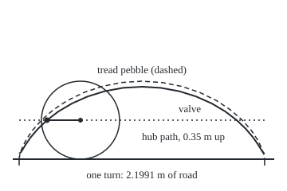

# Parametric curves: a point that moves with time

[Syllabus](../../../SYLLABUS.md) → [Geometry and trig](../README.md) → [Coordinates and Curves](../README.md#s04) → Parametric curves

---

## General Overview

A road bike rolls along a flat street. Its wheel, tyre included, is 0.35 m from hub to road. The valve sits on the rim, 0.30 m from the hub. The rider sees the valve go round in a circle. Someone at the kerb sees low arches: the valve dips to 0.05 m above the road, swings forward and up to 0.65 m, and drops again, once per turn.

The easy description of that path is not "the height at each distance". It is "where the valve is once the wheel has turned so far". One number, the turn, fixes both coordinates. A curve described this way is a **parametric curve**, and the number driving it is the **parameter**: a dial that, once set, places the point. It could as well be time: at 3.5 m/s the wheel turns once every 0.6283 s.

The card plots such a curve, removes the parameter where that can be done, and names the three shapes a rolling wheel draws: a line, a circle and a cycloid.

**A parametric curve gives a point's two coordinates as formulas in one moving number, so it records both where the curve runs and the order the point travels it.**

**What kind of fact this is:** a definition; the valve's two formulas are derived from it on this card in Why it works, on the model of a tyre that does not slip.

### The picture: one turn of the wheel

<p align="center"></p>

Drawn to scale, 1 m = 140 units. Solid: the valve. Dashed: a pebble in the tread. Dotted: the hub. The wheel is shown after a quarter turn, valve straight behind the hub.

---

## The formula

Notation first, in words. Here $x$ is metres along the road from the valve's lowest point and $y$ metres above the road. The Greek letter $\theta$, "theta", is the angle turned since then, in radians ([The unit circle](../03-Trigonometry/02-radians-and-the-unit-circle.md)): a full turn is 2π, about 6.2832. Writing $x(\theta)$ means "x, worked out from theta".

$$x(\theta) = R\,\theta - b\sin\theta, \qquad y(\theta) = R - b\cos\theta$$

**Read it aloud:** the valve is as far along as the hub has rolled, less a swing back of b sine theta, and as high as the hub, less a drop of b cosine theta.

| Symbol | Plain meaning | In our example | Push it up and the answer… |
| --- | --- | --- | --- |
| $x$ | distance along the road | 0.2498 m after a quarter turn | — |
| $y$ | height above the road | 0.35 m after a quarter turn | — |
| $\theta$ | the parameter: angle turned, radians | 0 to 6.2832 for one turn | the valve moves on |
| $R$ | the wheel's radius, hub to road | 0.35 m | longer arches, 2π R of road per turn |
| $b$ | the valve's distance from the hub | 0.30 m | taller arches: lowest R − b, highest R + b |
| $t$ | time since the valve was lowest, seconds | 0.6283 s per turn at 3.5 m/s | — |

At 3.5 m/s the hub covers 3.5t metres in t seconds, so θ = 3.5t/R: time drives the curve through the turn.

Removing the parameter leaves one shape per moving part.

- **The hub,** (Rθ, R): the height never involves θ, so y = 0.35, a line ([Lines](02-lines-slopes-and-intersections.md)).
- **The valve seen from the hub,** (−b sinθ, −b cosθ): across^2 + up^2 = b^2, a circle of radius 0.30 m ([Circles and parabolas](04-circles-and-parabolas.md)).
- **The valve seen from the kerb,** on the rising half of each arch:

$$x = R\arccos\!\Big(\frac{R - y}{b}\Big) - \sqrt{b^2 - (R - y)^2}, \qquad \text{for } 0 \le \theta \le \pi$$

Here arccos, the inverse cosine, returns the angle from 0 to π with the given cosine ([Inverse trig](../03-Trigonometry/05-inverse-trig-and-solving-equations.md)). With b equal to R the point is on the tread and the arch is a **cycloid**, named by Galileo in 1599. With b less than R it is a **curtate** (shortened) **cycloid**, never reaching the road.

### When it holds

A definition asks nothing: any two formulas in one number make a parametric curve. The valve's formulas rest on a model of the wheel.

- **No slipping.** A wheel spinning on ice advances less than the tyre turned, so the arches squash and can loop.
- **A flat road, a round wheel.** A kerb or a buckled rim lifts the hub off the line y = 0.35.
- **Radians.** Radius times angle is the arc rolled only in radians; in degrees a quarter turn "rolls" 31.5 m.
- **Half a turn at a time.** Arccos answers only from 0 to π, so the x-from-y equation covers the rising half of each arch.

---

## Why it works

### Step 0: split a hard motion into two easy ones

The valve's path is awkward; the hub's path and the spoke's swing are not. The valve's position is the hub's plus the arrow from hub to valve, and each is easy to write with θ.

### Step 1: the hub moves in a straight line

Without slipping, each centimetre of tyre that touches the road lays down one centimetre of road. After θ radians that is an arc of Rθ. The hub stays 0.35 m up, at (Rθ, R): after a quarter turn, 0.35 × 1.5708 = 0.5498 m along.

### Step 2: the valve goes round the hub in a circle

At θ = 0 the arrow from hub to valve points straight down, 0.30 m long. The bike moves right, so the wheel turns clockwise. An arrow starting down and turned clockwise by θ has across part −b sinθ and up part −b cosθ: the unit circle read from the bottom, the other way round. After a quarter turn it points straight back, (−0.30, 0).

### Step 3: add the two

Hub plus arrow gives the formula. After a quarter turn the valve is at (0.5498 − 0.30, 0.35) = (0.2498, 0.35), level with the hub and behind it, as drawn.

### Step 4: remove the parameter

To eliminate a parameter, solve one formula for it and substitute into the other, or combine the two so it cancels. The spoke's circle uses sine squared plus cosine squared equals 1 ([Trig identities](../03-Trigonometry/03-trig-identities.md)). For the valve, the height gives the cosine, arccos gives θ on the rising half, the sine follows from the cosine, and x comes out in terms of y alone.

<details>
<summary>Detailed proof: the eliminated equation, and why it stops at half a turn</summary>

From y = R − b cosθ, cosθ = (R − y)/b. For θ from 0 to π the cosine takes each value once and arccos answers from that window, so θ = arccos((R − y)/b). There the sine is not negative, so b sinθ = √(b^2 − (R − y)^2). Substituting into x = Rθ − b sinθ gives the equation above.

For θ from π to 2π the sine is negative and θ = 2π − arccos((R − y)/b), so x = R(2π − arccos((R − y)/b)) + √(b^2 − (R − y)^2). Each later arch adds 2πR. So the height 0.35 m belongs to two points per turn, 0.2498 m and 1.9493 m in the first: no one "y gives x" formula holds the whole path.

</details>

### Step 5: the cycloid, and why the top of a wheel blurs

Put b = R: a pebble in the tread. Its lowest height is 0, so it touches the road once a turn at a sharp point, a **cusp**. One arch is 8R = 2.80 m long while the bike covers 2.1991 m; Christopher Wren found that length in 1658. The proof needs [Parametric motion](../../06-Calculus%20and%20analysis/05-Curves%20and%20Solids/01-parametric-motion.md); the code checks it with 100,000 short straight pieces.

Without slipping, the point touching the road is still for an instant, so over a small turn the wheel pivots about it: a point straight above it, h metres up, moves h/R times as far as the hub. The valve at the top moves 1.8571 times as far, at the bottom 0.1429 times; the pebble at the bottom stops dead. Hence the blurred top of a wheel in photographs.

Another road: seen from the hub the valve is a polar point with fixed distance 0.30 m and changing angle ([Polar coordinates](03-polar-coordinates.md)); adding the hub's slide gives the same formulas.

---

## Worked numbers, by hand

| Step | Arithmetic | Value |
| --- | --- | --- |
| road per turn | 2π × 0.35 | 2.1991 m |
| a quarter turn | 2π ÷ 4 | 1.5708 rad |
| hub after a quarter turn | 0.35 × 1.5708 | 0.5498 m |
| valve after a quarter turn | (0.5498 − 0.30 × 1, 0.35 − 0.30 × 0) | (0.2498, 0.35) |
| after half a turn | (0.35 × 3.1416 − 0, 0.35 + 0.30) | (1.0996, 0.65) |
| after three quarters | (0.35 × 4.7124 + 0.30, 0.35) | (1.9493, 0.35) |
| after a full turn | (2.1991 − 0, 0.35 − 0.30) | (2.1991, 0.05) |
| turn at 0.50 m up | arccos((0.35 − 0.50) ÷ 0.30) | 2.0944 rad |
| x from y alone | 0.35 × 2.0944 − √(0.30^2 − 0.15^2) = 0.7330 − 0.2598 | **0.4732 m** |

The valve first reaches half a metre up when 0.4732 m down the road.

### What breaks if you drop a piece

| Mistake | Comes out at | What went wrong |
| --- | --- | --- |
| Sine sign flipped | quarter turn at 0.8498 m, not 0.2498 m | wheel turning against its roll |
| Hub left out | within 0.60 m of the start, not 2.1991 m on | the rider's circle |
| θ in degrees | hub 31.5 m on after a quarter turn, not 0.5498 m | arc = radius × angle needs radians |
| x-from-y past half a turn | 0.2498 m at 0.35 m up, not 1.9493 m | arccos answers only from 0 to π |

The code prints all four.

---

## Code, from first principles, and it actually runs

Two roads to the valve. Road one is the formula. Road two never uses it: it turns the wheel in 100,000 tiny clicks, rotating the spoke by one click's cosine and sine and rolling the hub on by one click of tyre. The eliminated equation is tested at eleven points, the pebble's arch by 100,000 short pieces against 8R, and the pivot rule by one small click at the top and bottom.

### Python

```python
# Parametric curves -- the check behind the card.  Standard library only.
# A bicycle wheel of radius R = 0.35 m rolls along a flat road; its valve sits
# b = 0.30 m from the hub.  Road one: the formula x = R th - b sin th,
# y = R - b cos th.  Road two: turn the wheel in 100000 small clicks and add up.
import math
R, b, TURN, N = 0.35, 0.30, 2 * math.pi, 100000
def valve(th, r=b):                       # road one: hub (R th, R) plus the spoke
    return R * th - r * math.sin(th), R - r * math.cos(th)
def eliminated(y):                        # x from y alone, first half turn only
    u = min(1.0, max(-1.0, (R - y) / b))
    return R * math.acos(u) - b * math.sqrt(1 - u * u)
def chord(p, q):                          # straight-line distance, Pythagoras
    return math.sqrt((q[0] - p[0]) ** 2 + (q[1] - p[1]) ** 2)
fmt = lambda p: f"({p[0]:.4f}, {p[1]:.4f})"
c, s = math.cos(TURN / N), math.sin(TURN / N)
hx, ox, oy, clicked = 0.0, 0.0, -b, [(0.0, R - b)]
for k in range(1, N + 1):                 # road two: one click at a time
    hx += R * TURN / N                    # the hub rolls on by one click of tyre
    ox, oy = ox * c + oy * s, -ox * s + oy * c   # the spoke turns one click clockwise
    if k % (N // 4) == 0:
        clicked.append((hx + ox, R + oy))
quarters = [valve(k * TURN / 4) for k in range(5)]
spoke = [(-b * math.sin(k * TURN / 360), R - b * math.cos(k * TURN / 360)) for k in range(361)]
far = max(chord(spoke[0], q) for q in spoke)   # hub left out: spoke only
th = math.acos(-0.5)
gap = max(abs(eliminated(valve(k * math.pi / 12)[1]) - valve(k * math.pi / 12)[0]) for k in range(1, 12))
pts = [valve(k * TURN / N, R) for k in range(N + 1)]
arch = sum(chord(pts[k], pts[k + 1]) for k in range(N))
ratio = lambda t, r: chord(valve(t - 0.005, r), valve(t + 0.005, r)) / (R * 0.01)
print(f"one turn rolls {R * TURN:.4f} m, taking {R * TURN / 3.5:.4f} s at 3.5 m/s")
print("quarter turns by the formula:", " ".join(fmt(p) for p in quarters))
print("quarter turns by 100000 clicks:", " ".join(fmt(p) for p in clicked))
print("quarter-turn angles, rad:", " ".join(f"{k * TURN / 4:.4f}" for k in range(5)), "| hub x, m:", " ".join(f"{R * k * TURN / 4:.4f}" for k in range(5)))
print(f"valve lowest {R - b:.4f} m, highest {quarters[2][1]:.4f} m")
print(f"eliminated: y = 0.5000 gives x = {R * th:.4f} - {b * math.sqrt(0.75):.4f} = {eliminated(0.5):.4f}; formula at theta {th:.4f} gives {fmt(valve(th))}")
print(f"eliminated and formula agree to 1e-9 at 11 points of the first half turn: {'yes' if gap < 1e-9 else 'no'}")
print(f"tread pebble (b = R): arch by {N} slices {arch:.4f} m, 8R = {8 * R:.4f} m, top {valve(math.pi, R)[1]:.4f} m")
print(f"over a 0.01 rad click: valve at top moves {ratio(math.pi, b):.4f} x the hub, height / R = {(R + b) / R:.4f}")
print(f"valve at bottom moves {ratio(0, b):.4f} x the hub, height / R = {(R - b) / R:.4f}; pebble at bottom {ratio(0, R):.4f}")
print(f"mistake, sine sign flipped: quarter-turn x {R * TURN / 4 + b:.4f} m, not {quarters[1][0]:.4f} m")
print(f"mistake, hub left out: valve stays within {far:.4f} m of the start, never reaching {R * TURN:.4f} m")
print(f"mistake, degrees for theta: hub after a quarter turn {90 * R:.4f} m, not {R * TURN / 4:.4f} m")
print(f"mistake, eliminated past half a turn: y = 0.3500 gives x = {eliminated(0.35):.4f} m, not {quarters[3][0]:.4f} m")
X, Y = lambda x: 24 + 140 * x, lambda y: 200 - 140 * y
v = quarters[1]
print(f"figure, 1 m = 140 units, road at y = 200: hub ({X(R * TURN / 4):.2f}, {Y(R):.2f}), valve ({X(v[0]):.2f}, {Y(v[1]):.2f}), turn ends x = {X(R * TURN):.2f}")
for name, r in (("valve", b), ("pebble", R)):
    print(f"figure, {name}:", " ".join(f"{X(p[0]):.1f},{Y(p[1]):.1f}" for p in (valve(k * TURN / 24, r) for k in range(25))))
assert max(chord(p, q) for p, q in zip(quarters, clicked)) < 1e-9     # two roads, one path
assert gap < 1e-9                                                     # the eliminated form holds
assert abs(arch - 8 * R) < 1e-6                                       # slices against Wren's 8R
assert abs(ratio(math.pi, b) - (R + b) / R) < 1e-4 and abs(ratio(0, b) - (R - b) / R) < 1e-4
print("ALL CHECKS PASS")
```

**Ran 2026-09-24 on macOS, Python 3.14.6, standard library only. All checks passed. Output, pasted from the run:**

```
one turn rolls 2.1991 m, taking 0.6283 s at 3.5 m/s
quarter turns by the formula: (0.0000, 0.0500) (0.2498, 0.3500) (1.0996, 0.6500) (1.9493, 0.3500) (2.1991, 0.0500)
quarter turns by 100000 clicks: (0.0000, 0.0500) (0.2498, 0.3500) (1.0996, 0.6500) (1.9493, 0.3500) (2.1991, 0.0500)
quarter-turn angles, rad: 0.0000 1.5708 3.1416 4.7124 6.2832 | hub x, m: 0.0000 0.5498 1.0996 1.6493 2.1991
valve lowest 0.0500 m, highest 0.6500 m
eliminated: y = 0.5000 gives x = 0.7330 - 0.2598 = 0.4732; formula at theta 2.0944 gives (0.4732, 0.5000)
eliminated and formula agree to 1e-9 at 11 points of the first half turn: yes
tread pebble (b = R): arch by 100000 slices 2.8000 m, 8R = 2.8000 m, top 0.7000 m
over a 0.01 rad click: valve at top moves 1.8571 x the hub, height / R = 1.8571
valve at bottom moves 0.1429 x the hub, height / R = 0.1429; pebble at bottom 0.0000
mistake, sine sign flipped: quarter-turn x 0.8498 m, not 0.2498 m
mistake, hub left out: valve stays within 0.6000 m of the start, never reaching 2.1991 m
mistake, degrees for theta: hub after a quarter turn 31.5000 m, not 0.5498 m
mistake, eliminated past half a turn: y = 0.3500 gives x = 0.2498 m, not 1.9493 m
figure, 1 m = 140 units, road at y = 200: hub (100.97, 151.00), valve (58.97, 151.00), turn ends x = 331.88
figure, valve: 24.0,193.0 26.0,191.6 28.7,187.4 32.8,180.7 38.9,172.0 47.6,161.9 59.0,151.0 73.2,140.1 90.3,130.0 109.8,121.3 131.3,114.6 154.2,110.4 177.9,109.0 201.6,110.4 224.6,114.6 246.1,121.3 265.6,130.0 282.6,140.1 296.9,151.0 308.3,161.9 316.9,172.0 323.1,180.7 327.2,187.4 329.9,191.6 331.9,193.0
figure, pebble: 24.0,200.0 24.1,198.3 25.2,193.4 27.8,185.6 32.9,175.5 40.8,163.7 52.0,151.0 66.5,138.3 84.2,126.5 104.8,116.4 127.8,108.6 152.4,103.7 177.9,102.0 203.4,103.7 228.1,108.6 251.1,116.4 271.7,126.5 289.4,138.3 303.9,151.0 315.1,163.7 323.0,175.5 328.0,185.6 330.7,193.4 331.7,198.3 331.9,200.0
ALL CHECKS PASS
```

### Rust

Same numbers, same labels, built with `rustc --edition 2021 -O`.

```rust
// Parametric curves -- the same check as the Python, in Rust.  No crates.
// A bicycle wheel of radius R = 0.35 m rolls along a flat road; its valve sits
// b = 0.30 m from the hub.  Road one: the formula x = R th - b sin th,
// y = R - b cos th.  Road two: turn the wheel in 100000 small clicks and add up.
use std::f64::consts::PI;
const R: f64 = 0.35;
const B: f64 = 0.30;
const TURN: f64 = 2.0 * PI;
const N: usize = 100000;

fn valve(th: f64, r: f64) -> (f64, f64) {          // road one: hub (R th, R) plus the spoke
    (R * th - r * th.sin(), R - r * th.cos())
}

fn eliminated(y: f64) -> f64 {                      // x from y alone, first half turn only
    let u = ((R - y) / B).max(-1.0).min(1.0);
    R * u.acos() - B * (1.0 - u * u).sqrt()
}

fn chord(p: (f64, f64), q: (f64, f64)) -> f64 {     // straight-line distance, Pythagoras
    ((q.0 - p.0).powi(2) + (q.1 - p.1).powi(2)).sqrt()
}

fn fmt(p: (f64, f64)) -> String { format!("({:.4}, {:.4})", p.0, p.1) }

fn ratio(t: f64, r: f64) -> f64 { chord(valve(t - 0.005, r), valve(t + 0.005, r)) / (R * 0.01) }

fn main() {
    let (c, s) = ((TURN / N as f64).cos(), (TURN / N as f64).sin());
    let (mut hx, mut ox, mut oy) = (0.0, 0.0, -B);
    let mut clicked = vec![(0.0, R - B)];
    for k in 1..=N {                                // road two: one click at a time
        hx += R * TURN / N as f64;                  // the hub rolls on by one click of tyre
        (ox, oy) = (ox * c + oy * s, -ox * s + oy * c);   // the spoke turns one click clockwise
        if k % (N / 4) == 0 { clicked.push((hx + ox, R + oy)) }
    }
    let quarters: Vec<(f64, f64)> = (0..5).map(|k| valve(k as f64 * TURN / 4.0, B)).collect();
    let spoke: Vec<(f64, f64)> = (0..=360).map(|k| { let a = k as f64 * TURN / 360.0; (-B * a.sin(), R - B * a.cos()) }).collect();
    let far = spoke.iter().map(|&q| chord(spoke[0], q)).fold(0.0, f64::max);   // hub left out: spoke only
    let th = (-0.5f64).acos();
    let gap = (1..12).map(|k| { let p = valve(k as f64 * PI / 12.0, B); (eliminated(p.1) - p.0).abs() })
        .fold(0.0, f64::max);
    let pts: Vec<(f64, f64)> = (0..=N).map(|k| valve(k as f64 * TURN / N as f64, R)).collect();
    let arch: f64 = (0..N).map(|k| chord(pts[k], pts[k + 1])).sum();
    let join = |v: &Vec<(f64, f64)>| v.iter().map(|&p| fmt(p)).collect::<Vec<_>>().join(" ");
    println!("one turn rolls {:.4} m, taking {:.4} s at 3.5 m/s", R * TURN, R * TURN / 3.5);
    println!("quarter turns by the formula: {}", join(&quarters));
    println!("quarter turns by 100000 clicks: {}", join(&clicked));
    let row = |f: f64| (0..5).map(|k| format!("{:.4}", f * k as f64 * TURN / 4.0)).collect::<Vec<_>>().join(" ");
    println!("quarter-turn angles, rad: {} | hub x, m: {}", row(1.0), row(R));
    println!("valve lowest {:.4} m, highest {:.4} m", R - B, quarters[2].1);
    println!("eliminated: y = 0.5000 gives x = {:.4} - {:.4} = {:.4}; formula at theta {:.4} gives {}", R * th, B * 0.75f64.sqrt(), eliminated(0.5), th, fmt(valve(th, B)));
    println!("eliminated and formula agree to 1e-9 at 11 points of the first half turn: {}", if gap < 1e-9 { "yes" } else { "no" });
    println!("tread pebble (b = R): arch by {} slices {:.4} m, 8R = {:.4} m, top {:.4} m", N, arch, 8.0 * R, valve(PI, R).1);
    println!("over a 0.01 rad click: valve at top moves {:.4} x the hub, height / R = {:.4}", ratio(PI, B), (R + B) / R);
    println!("valve at bottom moves {:.4} x the hub, height / R = {:.4}; pebble at bottom {:.4}", ratio(0.0, B), (R - B) / R, ratio(0.0, R));
    println!("mistake, sine sign flipped: quarter-turn x {:.4} m, not {:.4} m", R * TURN / 4.0 + B, quarters[1].0);
    println!("mistake, hub left out: valve stays within {:.4} m of the start, never reaching {:.4} m", far, R * TURN);
    println!("mistake, degrees for theta: hub after a quarter turn {:.4} m, not {:.4} m", 90.0 * R, R * TURN / 4.0);
    println!("mistake, eliminated past half a turn: y = 0.3500 gives x = {:.4} m, not {:.4} m", eliminated(0.35), quarters[3].0);
    let (xs, ys) = (|x: f64| 24.0 + 140.0 * x, |y: f64| 200.0 - 140.0 * y);
    let v = quarters[1];
    println!("figure, 1 m = 140 units, road at y = 200: hub ({:.2}, {:.2}), valve ({:.2}, {:.2}), turn ends x = {:.2}",
             xs(R * TURN / 4.0), ys(R), xs(v.0), ys(v.1), xs(R * TURN));
    for (name, r) in [("valve", B), ("pebble", R)] {
        let pts: Vec<String> = (0..25).map(|k| { let p = valve(k as f64 * TURN / 24.0, r); format!("{:.1},{:.1}", xs(p.0), ys(p.1)) }).collect();
        println!("figure, {}: {}", name, pts.join(" "));
    }
    assert!(quarters.iter().zip(&clicked).map(|(&p, &q)| chord(p, q)).fold(0.0, f64::max) < 1e-9);  // two roads
    assert!(gap < 1e-9);                                                  // the eliminated form holds
    assert!((arch - 8.0 * R).abs() < 1e-6);                               // slices against Wren's 8R
    assert!((ratio(PI, B) - (R + B) / R).abs() < 1e-4 && (ratio(0.0, B) - (R - B) / R).abs() < 1e-4);
    println!("ALL CHECKS PASS");
}
```

**Ran 2026-09-24 on macOS, rustc 1.98.1, no crates. All checks passed. Output, pasted from the run:**

```
one turn rolls 2.1991 m, taking 0.6283 s at 3.5 m/s
quarter turns by the formula: (0.0000, 0.0500) (0.2498, 0.3500) (1.0996, 0.6500) (1.9493, 0.3500) (2.1991, 0.0500)
quarter turns by 100000 clicks: (0.0000, 0.0500) (0.2498, 0.3500) (1.0996, 0.6500) (1.9493, 0.3500) (2.1991, 0.0500)
quarter-turn angles, rad: 0.0000 1.5708 3.1416 4.7124 6.2832 | hub x, m: 0.0000 0.5498 1.0996 1.6493 2.1991
valve lowest 0.0500 m, highest 0.6500 m
eliminated: y = 0.5000 gives x = 0.7330 - 0.2598 = 0.4732; formula at theta 2.0944 gives (0.4732, 0.5000)
eliminated and formula agree to 1e-9 at 11 points of the first half turn: yes
tread pebble (b = R): arch by 100000 slices 2.8000 m, 8R = 2.8000 m, top 0.7000 m
over a 0.01 rad click: valve at top moves 1.8571 x the hub, height / R = 1.8571
valve at bottom moves 0.1429 x the hub, height / R = 0.1429; pebble at bottom 0.0000
mistake, sine sign flipped: quarter-turn x 0.8498 m, not 0.2498 m
mistake, hub left out: valve stays within 0.6000 m of the start, never reaching 2.1991 m
mistake, degrees for theta: hub after a quarter turn 31.5000 m, not 0.5498 m
mistake, eliminated past half a turn: y = 0.3500 gives x = 0.2498 m, not 1.9493 m
figure, 1 m = 140 units, road at y = 200: hub (100.97, 151.00), valve (58.97, 151.00), turn ends x = 331.88
figure, valve: 24.0,193.0 26.0,191.6 28.7,187.4 32.8,180.7 38.9,172.0 47.6,161.9 59.0,151.0 73.2,140.1 90.3,130.0 109.8,121.3 131.3,114.6 154.2,110.4 177.9,109.0 201.6,110.4 224.6,114.6 246.1,121.3 265.6,130.0 282.6,140.1 296.9,151.0 308.3,161.9 316.9,172.0 323.1,180.7 327.2,187.4 329.9,191.6 331.9,193.0
figure, pebble: 24.0,200.0 24.1,198.3 25.2,193.4 27.8,185.6 32.9,175.5 40.8,163.7 52.0,151.0 66.5,138.3 84.2,126.5 104.8,116.4 127.8,108.6 152.4,103.7 177.9,102.0 203.4,103.7 228.1,108.6 251.1,116.4 271.7,126.5 289.4,138.3 303.9,151.0 315.1,163.7 323.0,175.5 328.0,185.6 330.7,193.4 331.7,198.3 331.9,200.0
ALL CHECKS PASS
```

The two outputs match line for line.

> [!TIP]
> **Try changing**
> Guess first, then run it.
> - **Valve on the tread.** Set `b` to `0.35`: lowest point 0.0000 m, and it stops dead at the bottom. All checks pass.
> - **Below the road.** Set `b` to `0.45`, like a train wheel's flange below the rail top. The lowest point is −0.1000 m and the pivot rule says −0.2857: it moves backwards, in a loop. A distance is never negative, so the fourth assert stops the run.
> - **Coarser slices.** Set `N` to `1000`: the arch comes out about a thousandth of a millimetre short of 2.8 m, and the third assert stops the run.

---

## The usual mistake

> [!warning]
> **Plotting y against θ.** The parameter is not an axis of the picture. Height against angle is a plain cosine wave, the same whether the bike rolls or stands on a trainer; only x(θ) paired with y(θ) draws the arches.
>
> - **Leaving out the hub.** The spoke alone is the rider's circle, 0.60 m across, never carrying the valve down the road.
> - **The wrong sense of turn.** With + b sinθ the quarter-turn valve lands at 0.8498 m, not 0.2498 m.
> - **Degrees in Rθ.** A quarter turn read as 90 puts the hub 31.5 m down the road.
> - **One elimination for the whole turn.** It sends the three-quarter point back to 0.2498 m, not 1.9493 m.

---

## Where you meet it in real life

- **Night photographs of cyclists.** A spoke light traces a curtate cycloid, so a long exposure shows arches of light, not circles.
- **Gears.** Some gear teeth follow curves drawn by a point on a rolling circle.
- **Computer drawing.** Fonts and design software store curves as pairs of formulas in one parameter, so a curve can loop and turn back.
- **Old planet models.** Ptolemy put a planet on a circle whose centre rode another circle: hub plus spoke again.

> **Say it back**
> A parametric curve gives both coordinates of a point as formulas in one number, the parameter. For a rolling wheel the parameter is the turn. The hub slides along a line, the valve circles the hub, and adding the two gives the valve's arches. Removing the parameter gives the line and the circle whole, the arches only half a turn at a time.

---

## What this builds on

- [Polar coordinates](03-polar-coordinates.md): a point fixed by distance and angle, the valve seen from the hub.

## Where this goes next

- [Parametric motion](../../06-Calculus%20and%20analysis/05-Curves%20and%20Solids/01-parametric-motion.md): velocity and arch length, exactly.
- [The brachistochrone](../../08-Differential%20equations%20and%20dynamics/12-Calculus%20of%20Variations%20and%20Optimal%20Control/02-the-brachistochrone-and-the-beltrami-identity.md): the upside-down cycloid as the fastest slide.
- Elimination: when a parameter can be removed exactly.

This card measured the arch by short pieces and the speed by one small click; getting both exactly, at every instant, is what a later card does.

---

## Sources

Verified 2026-09-24: every link below resolves to the publisher's page.

- Strang, Gilbert, Edwin Herman et al. *Calculus Volume 2*, OpenStax, Rice University. [Section 7.1, Parametric Equations](https://openstax.org/books/calculus-volume-2/pages/7-1-parametric-equations). Free; elimination and the cycloid.
- O'Connor, J. J., and E. F. Robertson. "Cycloid." MacTutor Famous Curves, University of St Andrews. [Curve page](https://mathshistory.st-andrews.ac.uk/Curves/Cycloid/). The curtate cycloid, Galileo's name, Wren's 8a.
- O'Connor, J. J., and E. F. Robertson. "Sir Christopher Wren." MacTutor Archive, University of St Andrews. [Biography](https://mathshistory.st-andrews.ac.uk/Biographies/Wren/). Dates Wren's 1658 result.
