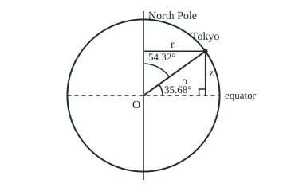

# Cylindrical and spherical coordinates: two angles and a radius in space

[Syllabus](../../../SYLLABUS.md) → [Geometry and trig](../README.md) → [Coordinates and Curves](../README.md#s04) → Cylindrical and spherical coordinates

---

## General Overview

Tokyo sits at 35.68° north, 139.69° east: an address on the globe. A GPS receiver needs another: three distances along axes at right angles through the Earth's centre, the (x, y, z) of a grid in space.

Treat the Earth as a ball 6371 km in radius, its mean size. The first axis points from the centre to where the equator meets the Greenwich meridian (a meridian is a half-circle from pole to pole; Greenwich's has longitude zero), the second to 90° east, the third to the North Pole. Tokyo is then (−3946.3, 3347.9, 3715.9), in kilometres: 3715.9 km above the equator's plane and 5175.1 km from the spin axis.

A radius and two angles name the same point: **spherical coordinates**. A distance from the axis, one angle and a height name it too: **cylindrical coordinates**. Both are built from the plane's polar coordinates ([Polar coordinates](03-polar-coordinates.md)): cylindrical uses them once, spherical twice. The difficulty is bookkeeping: latitude opens up from the equator, the mathematician's angle opens down from the pole, and one letter means different angles in different books.

**Drop a point straight down to the equator's plane: its shadow is a polar-coordinate problem and its height is one number, so a point in space is a radius and two angles, or a distance from the axis, one angle and a height.**

**What kind of fact this is:** a definition, two naming conventions for points in space; the conversion formulas between them are proved on this card in Why it works.

### The picture: Tokyo, seen edge-on

<p align="center"></p>

Drawn at 1000 km = 15 units. O is the Earth's centre. The radius ρ to Tokyo is 6371 km; its distance r from the spin axis is 5175.1 km and its height z above the equator's plane is 3715.9 km, meeting at a right angle. Latitude, 35.68°, opens up from the equator; colatitude, 54.32°, opens down from the pole.

---

## The formula

Three new letters, in words first. The Greek letter rho, $\rho$, is the distance from the centre. The Greek letter theta, $\theta$, is the angle around the axis: on Earth, the longitude. The Greek letter phi, $\phi$, is the angle down from the North Pole, called the **colatitude**, which is 90° minus the latitude. Spherical coordinates list them as (ρ, θ, φ), and cylindrical coordinates as (r, θ, z), with $r$ the distance from the axis and $z$ the height.

Spherical to grid:

$$x = \rho\sin\phi\cos\theta, \qquad y = \rho\sin\phi\sin\theta, \qquad z = \rho\cos\phi$$

**Read it aloud:** the radius times the sine of the colatitude is the distance from the axis; split that by longitude into x and y; the radius times the cosine of the colatitude is the height.

Cylindrical to grid, and the link between the two:

$$x = r\cos\theta, \qquad y = r\sin\theta, \qquad r = \rho\sin\phi$$

**Read it aloud:** the shadow on the equator's plane is plain polar coordinates, and the height rides along unchanged.

Back from the grid:

$$\rho = \sqrt{x^2 + y^2 + z^2}, \qquad \theta = \operatorname{atan2}(y, x), \qquad \phi = \operatorname{atan2}(r, z)$$

Here atan2(y, x) is the sign-aware arctangent of polar coordinates, given above −180° and up to 180°: it reads the signs of x and y separately, so it knows which quarter of the circle the direction lies in.

| Symbol | Plain meaning | In our example | Push it up and the answer… |
| --- | --- | --- | --- |
| $x$, $y$, $z$ | distances along the three axes | −3946.3, 3347.9, 3715.9 km | the point slides along that axis |
| $\rho$ | distance from the centre | 6371 km | the point moves straight out |
| $\theta$ | angle around the axis from Greenwich, east positive: longitude | 139.69° | the point travels east along its circle of latitude |
| $\phi$ | angle down from the North Pole: colatitude | 54.32° | the point travels south; past 90°, z turns negative |
| $r$ | distance from the spin axis, the radius of the circle of latitude | 5175.1 km | the point moves away from the axis at the same height |
| $\text{lat}$ | latitude, angle up from the equator, 90° − φ | 35.68° | the point travels north |
| $\operatorname{atan2}(v, u)$ | the angle of the direction u across, v up, in the right quarter | atan2(3347.9, −3946.3) = 139.69° | — |

### When it holds

- **A ball, not the real Earth.** The Earth is flattened at the poles. On WGS 84, the squashed ball GPS uses, Tokyo is (−3955.2, 3355.5, 3699.4), 20.3 km from the ball's point.
- **Off the axis.** At a pole r = 0 and every longitude names the same point, so θ has no value; at the centre neither angle has one.
- **One agreed convention.** Physics books swap θ and φ; geographers write φ for latitude. The formulas hold only with the table's meanings.
- **Axes at right angles, one unit.** Otherwise Pythagoras, which gives ρ, fails.

---

## Why it works

### Step 0: split the point into a shadow and a height

Shine a light straight down the spin axis. Tokyo's shadow on the equator's plane is a point of a flat plane, which already has polar coordinates. The shadow forgets one number, the height z.

### Step 1: cylindrical coordinates are polar coordinates with a height

The shadow lies at distance r from the centre, at angle θ from the Greenwich direction, so x = r cos θ and y = r sin θ. The height is copied. That is all of cylindrical coordinates: Tokyo's shadow is 5175.1 km out at 139.69°.

### Step 2: the meridian triangle gives r and z

Join the centre O, Tokyo, and Tokyo's shadow. The shadow-to-Tokyo line is vertical and the O-to-shadow line flat, so the right angle is at the shadow and the long side is ρ. The angle at O between ρ and the vertical axis is the colatitude φ. Sine and cosine in a right triangle ([Sine, cosine and tangent](../03-Trigonometry/01-right-triangle-trigonometry.md)) give the side next to φ as z = ρ cos φ and the side facing it as r = ρ sin φ.

South of the equator the colatitude passes 90°: Rio de Janeiro, at 22.91° south, has 112.91°. The cosine past 90° is negative ([The unit circle](../03-Trigonometry/02-radians-and-the-unit-circle.md)), so z = −2480.1 km: below the equator, with no separate rule needed. The sine stays positive up to 180°, so r stays a distance.

### Step 3: substitute

Put r = ρ sin φ into Step 1: x = ρ sin φ cos θ and y = ρ sin φ sin θ, with z = ρ cos φ from Step 2. In latitude, sin φ is cos(lat) and cos φ is sin(lat), since the two angles add to 90°.

### Step 4: going back needs Pythagoras twice and atan2

Pythagoras in the plane gives r = √(x^2 + y^2); in the meridian triangle, ρ = √(r^2 + z^2). The ratio y/x cannot give the longitude: the point opposite Tokyo across the axis flips both signs and keeps the ratio. atan2 reads the two signs separately and returns 139.69°. The colatitude is φ = atan2(r, z), between 0° and 180° because r is never negative.

<details>
<summary>Detailed proof: every point off the axis has exactly one address</summary>

Ranges: ρ > 0, θ above −180° and up to 180°, φ from 0° to 180°. Step 4's recipe gives every point an address; the question is whether it is the only one. Take a point with r = √(x^2 + y^2) > 0. The formulas give x^2 + y^2 + z^2 = ρ^2 (sin^2φ (cos^2θ + sin^2θ) + cos^2φ) = ρ^2, using sin^2 + cos^2 = 1 twice, so ρ is forced. Then cos φ = z/ρ, and between 0° and 180° the cosine takes each value from −1 to 1 exactly once, so φ is forced; sin φ > 0 there matches r > 0. Last, cos θ = x/r fixes θ up to its sign, and the sign of y picks one. So each point off the axis has exactly one address.

On the axis r = 0, so φ is 0° or 180° and x = y = 0 whatever θ is: every longitude gives the same pole. At the centre both angles are free.

</details>

---

## Worked numbers, by hand

| Step | Arithmetic | Value |
| --- | --- | --- |
| colatitude | 90° − 35.68° | 54.32° |
| distance from the axis | r = 6371 × sin 54.32° | 5175.1 km |
| height | z = 6371 × cos 54.32° | 3715.9 km |
| across | x = 5175.1 × cos 139.69° | −3946.3 km |
| up the plane | y = 5175.1 × sin 139.69° | 3347.9 km |
| Tokyo on the grid | (x, y, z) | **(−3946.3, 3347.9, 3715.9)** |
| back: radius | √(x^2 + y^2 + z^2) | 6371.0 km |
| back: longitude | atan2(3347.9, −3946.3) | 139.69° |
| back: colatitude | atan2(5175.1, 3715.9) | 54.32° |

Tokyo lies on the far side from Greenwich (x negative), toward 90° east (y positive), above the equator (z positive).

Rio de Janeiro, at 22.91° south and 43.17° west, is the second case, with west written negative: (4280.0, −4015.0, −2480.1). With both cities on one grid, the distance formula gives the straight tunnel between them: 12660.0 km, the two directions 166.99° apart at the centre, nearly opposite sides of the Earth.

### What breaks if you drop a piece

| Mistake | Comes out at | What went wrong |
| --- | --- | --- |
| Latitude in the colatitude slot | (−2833.6, 2403.9, 5175.1), latitude 54.32° | The formula wants the angle from the pole, not from the equator |
| The two angles swapped | latitude −49.69°, longitude 54.32°, the southern Indian Ocean | Longitude went where the pole angle belongs |
| Plain arctan(y / x) for the longitude | −40.31°, the North Atlantic | The ratio forgets which side of the axis; off by 180° |

---

## Code, from first principles, and it actually runs

The script converts Tokyo and Rio both ways, by two roads each way. Forward: the spherical formula against the meridian triangle followed by polar coordinates. Back: atan2 against dot products (sums of matching products of two arrows) with the Greenwich and pole directions, the sign of y settling the side. The Tokyo–Rio tunnel comes from the distance formula and again as a circle's chord, 2ρ sin(half the angle at the centre).

### Python

```python
# Cylindrical and spherical coordinates -- the check behind the card.  Standard
# library only.  Latitude and longitude become (x, y, z) by two roads, and
# (x, y, z) goes back to the angles by two more.  Earth is a ball, R = 6371 km.
from math import sin, cos, acos, atan, atan2, sqrt, radians as rad, degrees as deg
R, CITIES = 6371.0, [("Tokyo", 35.68, 139.69), ("Rio", -22.91, -43.17)]

def spherical(rho, theta, phi):         # road 1: radius, longitude, angle down from the pole
    s = rho * sin(rad(phi))
    return (s * cos(rad(theta)), s * sin(rad(theta)), rho * cos(rad(phi)))

def via_cylinder(lat, lon):             # road 2: meridian triangle, then polar in the equator
    r, z = R * cos(rad(lat)), R * sin(rad(lat))
    return (r * cos(rad(lon)), r * sin(rad(lon)), z), r, z

def back_atan2(x, y, z):                # inverse road 1: the quadrant-aware angle
    r = sqrt(x * x + y * y)
    return sqrt(r * r + z * z), deg(atan2(y, x)), deg(atan2(r, z))

def back_dot(x, y, z):                  # inverse road 2: dot products with Greenwich and the pole
    rho, r = sqrt(x * x + y * y + z * z), sqrt(x * x + y * y)
    return rho, deg(acos(x / r)) * (1 if y >= 0 else -1), deg(acos(z / rho))

pts, g = {}, lambda t: "(" + ", ".join(f"{v:.1f}" for v in t) + ")"
print(f"radius {R:.0f} km; angles in degrees; colatitude = 90 - latitude")
for name, lat, lon in CITIES:
    p1 = spherical(R, lon, 90 - lat)
    p2, r, z = via_cylinder(lat, lon)
    a, b = back_atan2(*p1), back_dot(*p1)
    pts[name] = p1
    print(f"{name}: latitude {lat:.2f}, longitude {lon:.2f}, colatitude {90 - lat:.2f}")
    print(f"  cylindrical (r, theta, z) = ({r:.1f}, {lon:.2f}, {z:.1f})")
    print(f"  (x, y, z): road 1 spherical {g(p1)}; road 2 via cylinder {g(p2)}")
    print(f"  back: atan2 road (rho, theta, phi) = ({a[0]:.1f}, {a[1]:.2f}, {a[2]:.2f}); dot road ({b[0]:.1f}, {b[1]:.2f}, {b[2]:.2f})")
    assert max(abs(u - v) for u, v in zip(p1, p2)) < 1e-9          # two forward roads
    assert max(abs(u - v) for u, v in zip(a + b, (R, lon, 90 - lat) * 2)) < 1e-9  # two inverse roads
T, S = pts["Tokyo"], pts["Rio"]
chord = sqrt(sum((u - v) ** 2 for u, v in zip(T, S)))              # distance formula in 3D
gamma = acos(sum(u * v for u, v in zip(T, S)) / (R * R))             # angle at Earth's centre
print(f"Tokyo to Rio straight through the Earth: {chord:.1f} km; angle at the centre {deg(gamma):.2f}")
assert abs(chord - 2 * R * sin(gamma / 2)) < 1e-6                    # chord of a circle, second road
a_, e2, la, lo = 6378.137, 0.00669437999014, rad(35.68), rad(139.69)
N = a_ / sqrt(1 - e2 * sin(la) ** 2)                                 # the flattened Earth (WGS 84)
E = (N * cos(la) * cos(lo), N * cos(la) * sin(lo), N * (1 - e2) * sin(la))
print(f"Tokyo on the flattened Earth {g(E)}; gap from the ball {sqrt(sum((u - v) ** 2 for u, v in zip(E, T))):.1f} km")
w1 = spherical(R, 139.69, 35.68)
print(f"mistake 1, latitude in the colatitude slot: {g(w1)}, latitude {90 - back_atan2(*w1)[2]:.2f}")
w2 = back_atan2(*spherical(R, 90 - 35.68, 139.69))
print(f"mistake 2, the two angles swapped: lands at latitude {90 - w2[2]:.2f}, longitude {w2[1]:.2f}")
x, y, _ = T
print(f"mistake 3, plain arctan(y / x) for Tokyo's longitude: {deg(atan(y / x)):.2f}")
assert abs(deg(atan(y / x)) + 180 - 139.69) < 1e-9                  # arctan is off by half a turn
k, cx, cy = 0.015, 180, 120                                          # figure scale: 1 km = 0.015 units
rr, zz = R * cos(rad(35.68)), R * sin(rad(35.68))
print(f"figure, side view: circle radius {k * R:.2f}, Tokyo at ({cx + k * rr:.2f}, {cy - k * zz:.2f})")
print("ALL CHECKS PASS")
```

**Ran 2026-09-24 on macOS, Python 3.14.6, standard library only. All checks passed. Output, pasted from the run:**

```
radius 6371 km; angles in degrees; colatitude = 90 - latitude
Tokyo: latitude 35.68, longitude 139.69, colatitude 54.32
  cylindrical (r, theta, z) = (5175.1, 139.69, 3715.9)
  (x, y, z): road 1 spherical (-3946.3, 3347.9, 3715.9); road 2 via cylinder (-3946.3, 3347.9, 3715.9)
  back: atan2 road (rho, theta, phi) = (6371.0, 139.69, 54.32); dot road (6371.0, 139.69, 54.32)
Rio: latitude -22.91, longitude -43.17, colatitude 112.91
  cylindrical (r, theta, z) = (5868.4, -43.17, -2480.1)
  (x, y, z): road 1 spherical (4280.0, -4015.0, -2480.1); road 2 via cylinder (4280.0, -4015.0, -2480.1)
  back: atan2 road (rho, theta, phi) = (6371.0, -43.17, 112.91); dot road (6371.0, -43.17, 112.91)
Tokyo to Rio straight through the Earth: 12660.0 km; angle at the centre 166.99
Tokyo on the flattened Earth (-3955.2, 3355.5, 3699.4); gap from the ball 20.3 km
mistake 1, latitude in the colatitude slot: (-2833.6, 2403.9, 5175.1), latitude 54.32
mistake 2, the two angles swapped: lands at latitude -49.69, longitude 54.32
mistake 3, plain arctan(y / x) for Tokyo's longitude: -40.31
figure, side view: circle radius 95.56, Tokyo at (257.63, 64.26)
ALL CHECKS PASS
```

### Rust

Same numbers, same labels, built with `rustc --edition 2021 -O`.

```rust
// Cylindrical and spherical coordinates -- the same check as the Python, in
// Rust.  No crates.  Latitude and longitude become (x, y, z) by two roads, and
// (x, y, z) goes back to the angles by two more.  Earth is a ball, R = 6371 km.
const R: f64 = 6371.0;
type P = (f64, f64, f64);

fn rad(d: f64) -> f64 { d.to_radians() }
fn deg(r: f64) -> f64 { r.to_degrees() }

fn spherical(rho: f64, theta: f64, phi: f64) -> P {   // road 1: radius, longitude, angle down from the pole
    let s = rho * rad(phi).sin();
    (s * rad(theta).cos(), s * rad(theta).sin(), rho * rad(phi).cos())
}

fn via_cylinder(lat: f64, lon: f64) -> (P, f64, f64) { // road 2: meridian triangle, then polar in the equator
    let (r, z) = (R * rad(lat).cos(), R * rad(lat).sin());
    ((r * rad(lon).cos(), r * rad(lon).sin(), z), r, z)
}

fn back_atan2(p: P) -> P {                             // inverse road 1: the quadrant-aware angle
    let r = (p.0 * p.0 + p.1 * p.1).sqrt();
    ((r * r + p.2 * p.2).sqrt(), deg(p.1.atan2(p.0)), deg(r.atan2(p.2)))
}

fn back_dot(p: P) -> P {                               // inverse road 2: dot products with Greenwich and the pole
    let (rho, r) = ((p.0 * p.0 + p.1 * p.1 + p.2 * p.2).sqrt(), (p.0 * p.0 + p.1 * p.1).sqrt());
    (rho, deg((p.0 / r).acos()) * if p.1 >= 0.0 { 1.0 } else { -1.0 }, deg((p.2 / rho).acos()))
}

fn g(p: P) -> String { format!("({:.1}, {:.1}, {:.1})", p.0, p.1, p.2) }
fn dist(a: P, b: P) -> f64 { ((a.0 - b.0).powi(2) + (a.1 - b.1).powi(2) + (a.2 - b.2).powi(2)).sqrt() }

fn main() {
    let cities = [("Tokyo", 35.68, 139.69), ("Rio", -22.91, -43.17)];
    let mut pts: Vec<P> = Vec::new();
    println!("radius {:.0} km; angles in degrees; colatitude = 90 - latitude", R);
    for (name, lat, lon) in cities {
        let p1 = spherical(R, lon, 90.0 - lat);
        let (p2, r, z) = via_cylinder(lat, lon);
        let (a, b) = (back_atan2(p1), back_dot(p1));
        pts.push(p1);
        println!("{}: latitude {:.2}, longitude {:.2}, colatitude {:.2}", name, lat, lon, 90.0 - lat);
        println!("  cylindrical (r, theta, z) = ({:.1}, {:.2}, {:.1})", r, lon, z);
        println!("  (x, y, z): road 1 spherical {}; road 2 via cylinder {}", g(p1), g(p2));
        println!("  back: atan2 road (rho, theta, phi) = ({:.1}, {:.2}, {:.2}); dot road ({:.1}, {:.2}, {:.2})",
                 a.0, a.1, a.2, b.0, b.1, b.2);
        assert!(dist(p1, p2) < 1e-9);                                       // two forward roads
        for q in [a, b] { assert!(dist(q, (R, lon, 90.0 - lat)) < 1e-9); }  // two inverse roads
    }
    let (t, s) = (pts[0], pts[1]);
    let chord = dist(t, s);                                                 // distance formula in 3D
    let gamma = ((t.0 * s.0 + t.1 * s.1 + t.2 * s.2) / (R * R)).acos();     // angle at Earth's centre
    println!("Tokyo to Rio straight through the Earth: {:.1} km; angle at the centre {:.2}", chord, deg(gamma));
    assert!((chord - 2.0 * R * (gamma / 2.0).sin()).abs() < 1e-6);         // chord of a circle, second road
    let (a_, e2, la, lo) = (6378.137, 0.00669437999014, rad(35.68), rad(139.69));
    let n = a_ / (1.0 - e2 * la.sin().powi(2)).sqrt();                      // the flattened Earth (WGS 84)
    let e = (n * la.cos() * lo.cos(), n * la.cos() * lo.sin(), n * (1.0 - e2) * la.sin());
    println!("Tokyo on the flattened Earth {}; gap from the ball {:.1} km", g(e), dist(e, t));
    let w1 = spherical(R, 139.69, 35.68);
    println!("mistake 1, latitude in the colatitude slot: {}, latitude {:.2}", g(w1), 90.0 - back_atan2(w1).2);
    let w2 = back_atan2(spherical(R, 90.0 - 35.68, 139.69));
    println!("mistake 2, the two angles swapped: lands at latitude {:.2}, longitude {:.2}", 90.0 - w2.2, w2.1);
    let (x, y) = (t.0, t.1);
    println!("mistake 3, plain arctan(y / x) for Tokyo's longitude: {:.2}", deg((y / x).atan()));
    assert!((deg((y / x).atan()) + 180.0 - 139.69).abs() < 1e-9);           // arctan is off by half a turn
    let (k, cx, cy) = (0.015, 180.0, 120.0);                                // figure scale: 1 km = 0.015 units
    let (rr, zz) = (R * rad(35.68).cos(), R * rad(35.68).sin());
    println!("figure, side view: circle radius {:.2}, Tokyo at ({:.2}, {:.2})", k * R, cx + k * rr, cy - k * zz);
    println!("ALL CHECKS PASS");
}
```

**Ran 2026-09-24 on macOS, rustc 1.98.1, no crates. All checks passed. Output, pasted from the run:**

```
radius 6371 km; angles in degrees; colatitude = 90 - latitude
Tokyo: latitude 35.68, longitude 139.69, colatitude 54.32
  cylindrical (r, theta, z) = (5175.1, 139.69, 3715.9)
  (x, y, z): road 1 spherical (-3946.3, 3347.9, 3715.9); road 2 via cylinder (-3946.3, 3347.9, 3715.9)
  back: atan2 road (rho, theta, phi) = (6371.0, 139.69, 54.32); dot road (6371.0, 139.69, 54.32)
Rio: latitude -22.91, longitude -43.17, colatitude 112.91
  cylindrical (r, theta, z) = (5868.4, -43.17, -2480.1)
  (x, y, z): road 1 spherical (4280.0, -4015.0, -2480.1); road 2 via cylinder (4280.0, -4015.0, -2480.1)
  back: atan2 road (rho, theta, phi) = (6371.0, -43.17, 112.91); dot road (6371.0, -43.17, 112.91)
Tokyo to Rio straight through the Earth: 12660.0 km; angle at the centre 166.99
Tokyo on the flattened Earth (-3955.2, 3355.5, 3699.4); gap from the ball 20.3 km
mistake 1, latitude in the colatitude slot: (-2833.6, 2403.9, 5175.1), latitude 54.32
mistake 2, the two angles swapped: lands at latitude -49.69, longitude 54.32
mistake 3, plain arctan(y / x) for Tokyo's longitude: -40.31
figure, side view: circle radius 95.56, Tokyo at (257.63, 64.26)
ALL CHECKS PASS
```

The two outputs match line for line.

> [!TIP]
> **Try changing**
> Guess first, then run it.
> - **The North Pole.** Set Tokyo to latitude 90. The distance from the axis falls to 0.0 and the dot road stops: it divides by r = 0, because longitude at the pole has no value.
> - **London.** Use latitude 51.51 and longitude −0.13. Guess the sign of y first: negative but small, −9.0 km, since London is just west of Greenwich.
> - **Break the sign rule.** Replace `(1 if y >= 0 else -1)` with `1`. Rio's longitude comes back as +43.17 on the dot road, and the second assert stops the run.

---

## The usual mistake

> [!warning]
> **Plugging latitude in where the formula wants colatitude.** Latitude opens up from the equator; the φ of the formula opens down from the pole. Feed Tokyo's 35.68° in as φ and the point lands at latitude 54.32°, on Tokyo's meridian but far to the north. The two angles add to 90°, so a cosine and a sine trade places.
>
> - **Two radii.** ρ, 6371 km, is from the centre; r, 5175.1 km, is from the axis. Using r for ρ drops the height.

---

## Where you meet it in real life

- **GPS.** A receiver solves for its position on an Earth-centred (x, y, z) grid, then converts to latitude, longitude and height on the WGS 84 ellipsoid.
- **The sky.** Star catalogues give each star two angles, one around the sky's equator (the Earth's equator pushed outward) and one above it: spherical coordinates without the radius.
- **Turned parts.** A lathe works in distance from its axis, angle around it and depth along it: cylindrical coordinates.

> **Say it back**
> Drop a point to the equator's plane. Its shadow has polar coordinates r and θ, and the point adds a height z: that is cylindrical. The meridian triangle turns r and z into a radius ρ and an angle φ down from the pole: that is spherical. Latitude is 90° minus φ, and mixing the two angles puts a city in the wrong ocean. Going back takes Pythagoras twice and atan2.

---

## What this builds on

- [Polar coordinates](03-polar-coordinates.md): the radius-and-angle address in a plane, used here once for the shadow and once for the meridian triangle.

## Where this goes next

- [Triangles on a sphere](../06-Beyond%20Euclid/01-triangles-on-a-sphere.md): distances along the surface, not through it, from the same two angles.
- [Triple integrals](../../06-Calculus%20and%20analysis/08-Multiple%20Integrals/02-triple-integrals.md): volumes of balls and cylinders, summed slice by slice in these coordinates.
- Hydrogen in outline: an atom's electron shapes, written in a radius and two angles.
- The Laplacian in round coordinates, and the modes it splits into: the equations of heat and gravity rewritten for round problems.

---

## Sources

Verified 2026-09-24: every link below resolves to the publisher's page.

- OpenStax. *Calculus Volume 3*, section 2.7, "Cylindrical and Spherical Coordinates." [Publisher page](https://openstax.org/books/calculus-volume-3/pages/2-7-cylindrical-and-spherical-coordinates). Free; the conversion formulas and the right-triangle construction, with the same θ and φ as this card.
- National Geospatial-Intelligence Agency. *Department of Defense World Geodetic System 1984*, NGA.STND.0036_1.0.0_WGS84, 2014. [Standard (PDF)](https://earth-info.nga.mil/php/download.php?file=coord-wgs84). The ellipsoid's size and flattening, and the Earth-centred grid GPS uses.
