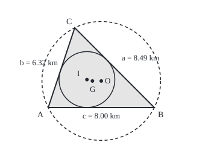

# Triangle centres: centroid, circumcentre and incentre, and the different questions they answer

[Syllabus](../../../SYLLABUS.md) → [Geometry and trig](../../../SYLLABUS.md#w05) → [Coordinates and Curves](../../../SYLLABUS.md#w05-s04) → Triangle centres

---

## General Overview

Three farms share one new well. On a map grid in kilometres, farm A sits at (0, 0), B at (8, 0) and C at (2, 6); straight roads join them. Each pays an equal share, so each wants the same length of pipe. Where does the well go?

"The middle of the triangle" is at least three places. Equal pipes need the well at (4.00, 2.00), the **circumcentre**, every pipe 4.47 km. The average of the farm positions, (3.33, 2.00), is the **centroid**, where equal weights on the farms would balance; as a well it gives pipes of 3.89, 5.08 and 4.22 km. The inside point whose nearest road is furthest away, (2.92, 2.10), is the **incentre**, centre of the largest round pond that fits between them, radius 2.10 km.

**The centroid averages the corners, the circumcentre is where the perpendicular bisectors cross (lines through each side's midpoint, square to it), and the incentre is where the angle bisectors cross (lines halving each corner angle); each time two lines fix the point and the third passes through it for free.**

**What kind of fact this is:** a theorem, three times over (each kind of line meets at one point), proved on this card in Why it works; the names are definitions.

### The picture: the farms, the pipe circle and the pond

<p align="center"></p>

Drawn at 1 km = 22 units. Dashed: the circle through the farms, centre O. Solid: the largest pond, centre I.

---

## The formula

Notation first, in words. Adding points, or multiplying one by a number, acts on each coordinate separately, as with vectors. Bars, as in $\lvert O - A\rvert$, mean the straight-line distance between two points ([Distance and midpoint](01-distance-and-midpoint.md)). Each road takes the small letter of the farm it faces: road $a$ runs from B to C.

$$G = \frac{A + B + C}{3}$$

**Read it aloud:** the centroid is the plain average of the three corners.

$$\lvert O - A\rvert = \lvert O - B\rvert = \lvert O - C\rvert = R$$

**Read it aloud:** the circumcentre is the one point equally far from all three corners, the circumradius away.

$$I = \frac{aA + bB + cC}{a + b + c}, \qquad r = \frac{K}{s}$$

**Read it aloud:** the incentre averages the corners, each counted by the road facing it; its distance to every road, the inradius, is the area over half the perimeter.

| Symbol | Plain meaning | In our example | Push it up and the answer… |
| --- | --- | --- | --- |
| $A$, $B$, $C$; $x_A$, $y_A$ | the farms as grid points; A's two coordinates | (0, 0), (8, 0), (2, 6) km | every centre moves |
| $a$, $b$, $c$ | each road's length, named for the farm it faces | 8.49, 6.32, 8.00 km | pulls I towards the farm it faces |
| $G$ | centroid: the average of the corners | (3.33, 2.00) | — |
| $O$ | circumcentre: equally far from the corners | (4.00, 2.00) | — |
| $R$ | the circumradius: the common pipe length | 4.47 km | longer pipes |
| $I$ | incentre: equally far from the roads | (2.92, 2.10) | — |
| $r$ | the inradius: the pond's radius | 2.1044 km | a bigger pond |
| $K$, $s$ | the area, and half the perimeter | 24.00 km^2 and 11.4049 km | K up: bigger pond; s up: smaller |

### When it holds

- **Farms not in a row.** In a row, the perpendicular bisectors are parallel and O does not exist; the code divides by zero.
- **Straight pipes on flat ground.** Pipes along roads or over hills move the fair point.
- **Equal weights, for balance.** Unequal weights need a weighted average.
- **No corner angle over 90°, for O inside.** At exactly 90°, O is the longest road's midpoint. Farms at (0, 0), (8, 0) and (2, 2) put O at (4.00, −2.00), outside the triangle.

---

## Why it works

### Step 0: two lines fix the point, and the third comes free

The circumcentre is equally far from three farms, the incentre from three roads. Equal from the first two is one straight line (for roads, the one running inside the triangle); from the first and third, another. Two non-parallel lines cross at exactly one point ([Lines](02-lines-slopes-and-intersections.md)). There the second and third are equal too, both being equal to the first, so the third line passes through the same point.

### Step 1: the centroid sits two-thirds along every median

A **median** runs from a corner to the midpoint of the opposite side. From farm A it reaches (5, 3); two-thirds of the way is (3.33, 2.00). In general A + (2/3)((B + C)/2 − A) works out to (A + B + C)/3, the same from every corner, so G lies on all three medians.

Equal weights at the corners balance at their average position. An evenly thick sheet, cut into strips parallel to road $a$, balances strip by strip on the median from A, so on every median: at G. G also has the least total of squared distances to the corners: 58.67, against 60.00 at O.

<details>
<summary>The algebra behind this, if you want it</summary>

Write each corner's gap from a point P as (P − G) + (G − V), for V in A, B, C, square with the dot product, and add:

$$\lvert P - A\rvert^2 + \lvert P - B\rvert^2 + \lvert P - C\rvert^2 = 3\lvert P - G\rvert^2 + \bigl(\text{the same total at } G\bigr),$$

because the cross terms carry 2(P − G) · ((G − A) + (G − B) + (G − C)), and that sum is 3G − (A + B + C) = 0. The total is smallest at P = G.

</details>

### Step 2: equal distance from two farms is a straight line

A well at (x, y) is equally far from A and B when the squared distances match. Both contain x^2 + y^2, which cancels, leaving

$$2(x_B - x_A)\,x + 2(y_B - y_A)\,y = x_B^2 + y_B^2 - x_A^2 - y_A^2,$$

with $x_A$ and $y_A$ farm A's coordinates, likewise for B. That is a straight line, through the midpoint of road AB at right angles to it: the **perpendicular bisector**.

For the farms, A and B give 16x = 64, so x = 4; A and C give 4x + 12y = 40, so y = 2. The lines cross at O = (4.00, 2.00), where the third bisector passes too. The circle of radius 4.47 km about O, through all three farms, is the **circumcircle**. Nothing keeps O inside the triangle.

### Step 3: equal distance from two roads is an angle bisector

Distance to a road means the shortest distance, at right angles to it. From a point inside the triangle, equally far from the two roads at farm A, drop those two shortest lines. The two right triangles share their hypotenuse and have another side equal, so they are congruent by RHS ([Congruent triangles](../01-Angles%2C%20Triangles%20and%20Congruence/03-congruent-triangles.md)): the point lies on the **angle bisector**, halving angle A. Run backwards, the same congruence shows every point of that bisector is equally far from both roads. Two bisectors cross at I, the third passes too, and every road is 2.10 km away.

The weights come from the point D where the bisector from A meets road $a$: it splits that road in the ratio c to b.

<details>
<summary>Detailed proof</summary>

**The split.** Triangles ABD and ACD share the height from A to road $a$, so their areas are as BD to DC. D, on the bisector, is equally far from roads $c$ and $b$, so the same areas are as c to b. Hence BD : DC = c : b, D = (bB + cC)/(b + c), and BD = ac/(b + c).

**Where I sits on AD.** The bisector from B crosses AD at I, so by the same fact in triangle ABD, AI : ID = c : ac/(b + c) = (b + c) : a.

**Together.** That point is (aA + (b + c)D)/(a + b + c) = (aA + bB + cC)/(a + b + c).

</details>

### Step 4: the largest pond has radius area over half-perimeter

Join any inside point P to the three farms. Each of the three pieces has area half its road times P's distance to that road ([Area](../01-Angles%2C%20Triangles%20and%20Congruence/06-area-of-triangles-and-polygons.md)). A pond centred at P fits only if every distance is at least its radius, so K is at least radius times s, and no radius exceeds K over s. At I all three distances equal r, so the pond there reaches that ceiling: 2.1044 km.

---

## Worked numbers, by hand

| Step | Arithmetic | Value |
| --- | --- | --- |
| road lengths | distance formula | a = 8.49, b = 6.32, c = 8.00 km |
| centroid | ((0 + 8 + 2)/3, (0 + 0 + 6)/3) | **G = (3.33, 2.00)** |
| bisector of A and B | 16x = 64 | x = 4 |
| bisector of A and C | 4x + 12y = 40, with x = 4 | y = 2 |
| equal pipes | distance from (4, 2) to each farm | **R = 4.47 km** |
| area and half-perimeter | 8 × 6 / 2; (8.49 + 6.32 + 8.00)/2 | 24.00 km^2; 11.4049 km |
| incentre | (8.49 × A + 6.32 × B + 8.00 × C) / (a + b + c) | **I = (2.92, 2.10)** |
| largest pond | 24.00 / 11.4049 | **r = 2.1044 km** |

The well goes at (4.00, 2.00), with 4.47 km of pipe to each farm.

### What breaks if you drop a piece

| Mistake | Comes out at | What went wrong |
| --- | --- | --- |
| Well at the centroid | pipes 3.89, 5.08, 4.22 km | averaging does not equalise distances |
| Pond at the centroid | clearances 2.00, 1.89, 2.53 km | averaging ignores the roads |
| Equal pipes, obtuse farms | O at (4.00, −2.00), 2.00 km outside road AB | O may leave the triangle |
| O as least total | 60.00 at O, 58.67 at G | that is the centroid's job |


---

## Code, from first principles, and it actually runs

Nothing is imported. Each centre is found twice. Road one is the card's formulas, with Cramer's rule (a ratio of cross-multiplied coefficients) solving the bisector equations. Road two is a blind zoom search: score a grid of trial points on the centre's defining property, keep the best, shrink the grid round it, repeat. For the incentre it seeks the point whose nearest road is furthest away, testing the largest-pond claim directly.

### Python

```python
# Triangle centres -- the check behind the card.  Nothing is imported.  Farms in km:
# A = (0, 0), B = (8, 0), C = (2, 6).  Each centre is found twice: by its formula, and by
# a blind zoom search for the point with the centre's defining property.  Then an obtuse case.
def dist(p, q): return ((p[0] - q[0]) ** 2 + (p[1] - q[1]) ** 2) ** 0.5
def side(p, u, v):                        # distance from p to the road u-v,
    cr = (v[0] - u[0]) * (p[1] - u[1]) - (v[1] - u[1]) * (p[0] - u[0])
    return cr / dist(u, v)                # signed: positive on the triangle's side
def zoom(f, x=0.0, y=0.0, w=40.0):        # road two: best point of a 21 x 21 grid,
    for _ in range(70):                   # then a smaller grid round it, repeated
        pts = [(x + w * i / 10, y + w * j / 10) for i in range(-10, 11) for j in range(-10, 11)]
        x, y = min(pts, key=f)
        w *= 0.7
    return (x, y)
def centres(A, B, C):                     # road one: the formulas on the card
    a, b, c = dist(B, C), dist(C, A), dist(A, B)
    G = ((A[0] + B[0] + C[0]) / 3, (A[1] + B[1] + C[1]) / 3)
    (p1, q1, k1), (p2, q2, k2) = [(2 * (Q[0] - A[0]), 2 * (Q[1] - A[1]),  # perpendicular
             Q[0] ** 2 + Q[1] ** 2 - A[0] ** 2 - A[1] ** 2) for Q in (B, C)]  # bisectors
    det = p1 * q2 - q1 * p2                               # Cramer's rule
    O = ((k1 * q2 - q1 * k2) / det, (p1 * k2 - k1 * p2) / det)
    n = a + b + c
    I = ((a * A[0] + b * B[0] + c * C[0]) / n, (a * A[1] + b * B[1] + c * C[1]) / n)
    return (a, b, c), G, O, I

def pt(p): return f"({p[0]:.2f}, {p[1]:.2f})"
def three(xs): return ", ".join(f"{x:.2f}" for x in xs)

A, B, C = (0.0, 0.0), (8.0, 0.0), (2.0, 6.0)
(a, b, c), G, O, I = centres(A, B, C)
K, s = c * (C[1] - A[1]) / 2, (a + b + c) / 2            # AB is level: height is C's rise
roads = lambda p: [side(p, A, B), side(p, B, C), side(p, C, A)]
sq = lambda p: sum(dist(p, F) ** 2 for F in (A, B, C))
G2 = zoom(sq)                                             # least total squared distance
O2 = zoom(lambda p: (dist(p, A) ** 2 - dist(p, B) ** 2) ** 2 + (dist(p, A) ** 2 - dist(p, C) ** 2) ** 2)
I2 = zoom(lambda p: -min(roads(p)))                       # furthest from the nearest road
print(f"farms A {pt(A)}, B {pt(B)}, C {pt(C)} km; sides a = {a:.2f}, b = {b:.2f}, c = {c:.2f} km")
print(f"area K = {K:.2f} km^2; half-perimeter s = {s:.4f} km; r = K / s = {K / s:.4f} km")
print(f"centroid G: by averaging {pt(G)}; by least total squared distance {pt(G2)}")
print(f"circumcentre O: by two bisectors {pt(O)}; by equal-distance search {pt(O2)}")
print(f"incentre I: by side weights {pt(I)}; by furthest-from-roads search {pt(I2)}")
print(f"O to farms A, B, C: {three(dist(O, F) for F in (A, B, C))} km")
print(f"I to roads AB, BC, CA: {three(roads(I))} km; largest pond found: radius {min(roads(I2)):.4f} km")
print(f"G to farms A, B, C: {three(dist(G, F) for F in (A, B, C))} km")
print(f"G to roads AB, BC, CA: {three(roads(G))} km")
print(f"total squared distance to the farms: at G {sq(G):.2f}, at O {sq(O):.2f}, at I {sq(I):.2f}")
A3, B3, C3 = (0.0, 0.0), (8.0, 0.0), (2.0, 2.0)          # second case: an obtuse layout
_, _, O3, _ = centres(A3, B3, C3)
O4 = zoom(lambda p: (dist(p, A3) ** 2 - dist(p, B3) ** 2) ** 2 + (dist(p, A3) ** 2 - dist(p, C3) ** 2) ** 2)
M3 = ((A3[0] + B3[0]) / 2, (A3[1] + B3[1]) / 2)
print(f"obtuse farms {pt(A3)}, {pt(B3)}, {pt(C3)}: O by bisectors {pt(O3)}, by search {pt(O4)}")
print(f"obtuse: O to farms {three(dist(O3, F) for F in (A3, B3, C3))} km; O to road AB {side(O3, A3, B3):.2f} km")
print(f"obtuse: midpoint of AB {pt(M3)} to farms {three(dist(M3, F) for F in (A3, B3, C3))} km")
svg = lambda p: f"({80 + 22 * p[0]:.2f}, {178 - 22 * p[1]:.2f})"
print(f"figure, 1 km = 22 units: A {svg(A)}, B {svg(B)}, C {svg(C)}, G {svg(G)}, O {svg(O)}, I {svg(I)}, "
      f"R {22 * dist(O, A):.2f}, r {22 * K / s:.2f}")
assert dist(G, G2) < 1e-6 and dist(O, O2) < 1e-6 and dist(I, I2) < 1e-6   # two roads each
assert abs(min(roads(I2)) - K / s) < 1e-6                 # largest pond = area / half-perimeter
assert max(dist(O3, F) for F in (A3, B3, C3)) - min(dist(O3, F) for F in (A3, B3, C3)) < 1e-9
assert dist(O3, O4) < 1e-6 and side(O3, A3, B3) < 0      # obtuse: the well leaves the triangle
print("ALL CHECKS PASS")
```

**Ran 2026-09-24 on macOS, Python 3.14.6, standard library only. All checks passed. Output, pasted from the run:**

```
farms A (0.00, 0.00), B (8.00, 0.00), C (2.00, 6.00) km; sides a = 8.49, b = 6.32, c = 8.00 km
area K = 24.00 km^2; half-perimeter s = 11.4049 km; r = K / s = 2.1044 km
centroid G: by averaging (3.33, 2.00); by least total squared distance (3.33, 2.00)
circumcentre O: by two bisectors (4.00, 2.00); by equal-distance search (4.00, 2.00)
incentre I: by side weights (2.92, 2.10); by furthest-from-roads search (2.92, 2.10)
O to farms A, B, C: 4.47, 4.47, 4.47 km
I to roads AB, BC, CA: 2.10, 2.10, 2.10 km; largest pond found: radius 2.1044 km
G to farms A, B, C: 3.89, 5.08, 4.22 km
G to roads AB, BC, CA: 2.00, 1.89, 2.53 km
total squared distance to the farms: at G 58.67, at O 60.00, at I 59.21
obtuse farms (0.00, 0.00), (8.00, 0.00), (2.00, 2.00): O by bisectors (4.00, -2.00), by search (4.00, -2.00)
obtuse: O to farms 4.47, 4.47, 4.47 km; O to road AB -2.00 km
obtuse: midpoint of AB (4.00, 0.00) to farms 4.00, 4.00, 2.83 km
figure, 1 km = 22 units: A (80.00, 178.00), B (256.00, 178.00), C (124.00, 46.00), G (153.33, 134.00), O (168.00, 134.00), I (144.23, 131.70), R 98.39, r 46.30
ALL CHECKS PASS
```

### Rust

Same numbers, same labels, built with `rustc --edition 2021 -O`.

```rust
// Triangle centres -- the same check as the Python, in Rust.  No crates.  Farms in km:
// A = (0, 0), B = (8, 0), C = (2, 6).  Each centre is found twice: by its formula, and by
// a blind zoom search for the point with the centre's defining property.  Then an obtuse case.
type P = (f64, f64);
fn dist(p: P, q: P) -> f64 { ((p.0 - q.0).powi(2) + (p.1 - q.1).powi(2)).sqrt() }
fn side(p: P, u: P, v: P) -> f64 { // distance from p to the road u-v, signed:
    ((v.0 - u.0) * (p.1 - u.1) - (v.1 - u.1) * (p.0 - u.0)) / dist(u, v) // + on the triangle's side
}
fn zoom(f: &dyn Fn(P) -> f64) -> P { // road two: best point of a 21 x 21 grid, then a
    let (mut x, mut y, mut w) = (0.0, 0.0, 40.0); // smaller grid round it, repeated
    for _ in 0..70 {
        let (mut best, mut fb) = ((x, y), f64::INFINITY);
        for i in -10..=10 { for j in -10..=10 {
            let q = (x + w * i as f64 / 10.0, y + w * j as f64 / 10.0);
            let v = f(q);
            if v < fb { best = q; fb = v }
        } }
        (x, y) = best;
        w *= 0.7;
    }
    (x, y)
}
fn centres(a_: P, b_: P, c_: P) -> ((f64, f64, f64), P, P, P) { // road one: the formulas
    let (a, b, c) = (dist(b_, c_), dist(c_, a_), dist(a_, b_));
    let g = ((a_.0 + b_.0 + c_.0) / 3.0, (a_.1 + b_.1 + c_.1) / 3.0);
    let row = |q: P| (2.0 * (q.0 - a_.0), 2.0 * (q.1 - a_.1), q.0 * q.0 + q.1 * q.1 - a_.0 * a_.0 - a_.1 * a_.1);
    let ((p1, q1, k1), (p2, q2, k2)) = (row(b_), row(c_)); // perpendicular bisectors
    let det = p1 * q2 - q1 * p2; // Cramer's rule
    let o = ((k1 * q2 - q1 * k2) / det, (p1 * k2 - k1 * p2) / det);
    let n = a + b + c;
    let i = ((a * a_.0 + b * b_.0 + c * c_.0) / n, (a * a_.1 + b * b_.1 + c * c_.1) / n);
    ((a, b, c), g, o, i)
}
fn pt(p: P) -> String { format!("({:.2}, {:.2})", p.0, p.1) }
fn three(x: [f64; 3]) -> String { format!("{:.2}, {:.2}, {:.2}", x[0], x[1], x[2]) }
fn equal(a_: P, b_: P, c_: P) -> impl Fn(P) -> f64 {
    move |p| (dist(p, a_).powi(2) - dist(p, b_).powi(2)).powi(2) + (dist(p, a_).powi(2) - dist(p, c_).powi(2)).powi(2)
}
fn main() {
    let (fa, fb, fc) = ((0.0, 0.0), (8.0, 0.0), (2.0, 6.0));
    let ((a, b, c), g, o, i) = centres(fa, fb, fc);
    let (k, s) = (c * (fc.1 - fa.1) / 2.0, (a + b + c) / 2.0); // AB is level: height is C's rise
    let roads = |p: P| [side(p, fa, fb), side(p, fb, fc), side(p, fc, fa)];
    let farms = |p: P| [dist(p, fa), dist(p, fb), dist(p, fc)];
    let sq = |p: P| farms(p).iter().map(|d| d * d).sum::<f64>();
    let g2 = zoom(&sq); // least total squared distance
    let o2 = zoom(&equal(fa, fb, fc));
    let i2 = zoom(&|p: P| -roads(p).iter().cloned().fold(f64::INFINITY, f64::min)); // furthest from nearest road
    let r2 = roads(i2).iter().cloned().fold(f64::INFINITY, f64::min);
    println!("farms A {}, B {}, C {} km; sides a = {:.2}, b = {:.2}, c = {:.2} km", pt(fa), pt(fb), pt(fc), a, b, c);
    println!("area K = {:.2} km^2; half-perimeter s = {:.4} km; r = K / s = {:.4} km", k, s, k / s);
    println!("centroid G: by averaging {}; by least total squared distance {}", pt(g), pt(g2));
    println!("circumcentre O: by two bisectors {}; by equal-distance search {}", pt(o), pt(o2));
    println!("incentre I: by side weights {}; by furthest-from-roads search {}", pt(i), pt(i2));
    println!("O to farms A, B, C: {} km", three(farms(o)));
    println!("I to roads AB, BC, CA: {} km; largest pond found: radius {:.4} km", three(roads(i)), r2);
    println!("G to farms A, B, C: {} km", three(farms(g)));
    println!("G to roads AB, BC, CA: {} km", three(roads(g)));
    println!("total squared distance to the farms: at G {:.2}, at O {:.2}, at I {:.2}", sq(g), sq(o), sq(i));
    let (a3, b3, c3) = ((0.0, 0.0), (8.0, 0.0), (2.0, 2.0)); // second case: an obtuse layout
    let (_, _, o3, _) = centres(a3, b3, c3);
    let o4 = zoom(&equal(a3, b3, c3));
    let m3 = ((a3.0 + b3.0) / 2.0, (a3.1 + b3.1) / 2.0);
    let f3 = |p: P| [dist(p, a3), dist(p, b3), dist(p, c3)];
    println!("obtuse farms {}, {}, {}: O by bisectors {}, by search {}", pt(a3), pt(b3), pt(c3), pt(o3), pt(o4));
    println!("obtuse: O to farms {} km; O to road AB {:.2} km", three(f3(o3)), side(o3, a3, b3));
    println!("obtuse: midpoint of AB {} to farms {} km", pt(m3), three(f3(m3)));
    let svg = |p: P| format!("({:.2}, {:.2})", 80.0 + 22.0 * p.0, 178.0 - 22.0 * p.1);
    println!("figure, 1 km = 22 units: A {}, B {}, C {}, G {}, O {}, I {}, R {:.2}, r {:.2}",
             svg(fa), svg(fb), svg(fc), svg(g), svg(o), svg(i), 22.0 * dist(o, fa), 22.0 * k / s);
    assert!(dist(g, g2) < 1e-6 && dist(o, o2) < 1e-6 && dist(i, i2) < 1e-6); // two roads each
    assert!((r2 - k / s).abs() < 1e-6); // largest pond = area / half-perimeter
    let d3 = f3(o3);
    assert!(d3.iter().cloned().fold(f64::MIN, f64::max) - d3.iter().cloned().fold(f64::INFINITY, f64::min) < 1e-9);
    assert!(dist(o3, o4) < 1e-6 && side(o3, a3, b3) < 0.0); // obtuse: the well leaves the triangle
    println!("ALL CHECKS PASS");
}
```

**Ran 2026-09-24 on macOS, rustc 1.98.1, no crates. All checks passed. Output, pasted from the run:**

```
farms A (0.00, 0.00), B (8.00, 0.00), C (2.00, 6.00) km; sides a = 8.49, b = 6.32, c = 8.00 km
area K = 24.00 km^2; half-perimeter s = 11.4049 km; r = K / s = 2.1044 km
centroid G: by averaging (3.33, 2.00); by least total squared distance (3.33, 2.00)
circumcentre O: by two bisectors (4.00, 2.00); by equal-distance search (4.00, 2.00)
incentre I: by side weights (2.92, 2.10); by furthest-from-roads search (2.92, 2.10)
O to farms A, B, C: 4.47, 4.47, 4.47 km
I to roads AB, BC, CA: 2.10, 2.10, 2.10 km; largest pond found: radius 2.1044 km
G to farms A, B, C: 3.89, 5.08, 4.22 km
G to roads AB, BC, CA: 2.00, 1.89, 2.53 km
total squared distance to the farms: at G 58.67, at O 60.00, at I 59.21
obtuse farms (0.00, 0.00), (8.00, 0.00), (2.00, 2.00): O by bisectors (4.00, -2.00), by search (4.00, -2.00)
obtuse: O to farms 4.47, 4.47, 4.47 km; O to road AB -2.00 km
obtuse: midpoint of AB (4.00, 0.00) to farms 4.00, 4.00, 2.83 km
figure, 1 km = 22 units: A (80.00, 178.00), B (256.00, 178.00), C (124.00, 46.00), G (153.33, 134.00), O (168.00, 134.00), I (144.23, 131.70), R 98.39, r 46.30
ALL CHECKS PASS
```

The two outputs match line for line.

> [!TIP]
> **Try changing**
> Guess first, then run it.
> - **Line the farms up.** Set `C` (in Rust, `fc`) to `(4.0, 0.0)`. Python stops on a division by zero; in Rust the first assert stops it. No equal-pipe point exists.
> - **Wrong weights.** In the incentre, swap the weights `a` and `c`. The point leaves the search's (2.92, 2.10) and the first assert stops it.
> - **Average over two.** Divide the centroid by 2. The search still finds (3.33, 2.00), and the first assert stops it.

---

## The usual mistake

> [!warning]
> **Calling one point "the centre" before naming the question.** The average of the farms is the natural guess for a fair well, and gives pipes of 3.89, 5.08 and 4.22 km. Balance, equal distance to the corners and equal distance to the sides are different demands, met by one point only when all three sides are equal.
>
> - **Equal pipes read as short pipes.** For the obtuse farms, O's pipes are all 4.47 km, but a well at the midpoint of road AB, (4.00, 0.00), needs at most 4.00 km.
> - **Averaging the corners for the pond.** The centroid clears road $a$ by 1.89 km, less than the 2.1044 km pond at I.

---

## Where you meet it in real life

- **Nearest-site maps.** Maps giving each spot to its nearest mast have borders along perpendicular bisectors, meeting in threes at circumcentres.
- **Round things from three marks.** Three points on a broken plate's rim fix the circle through them, centred at their circumcentre ([Circles and parabolas](04-circles-and-parabolas.md)).
- **Plates and offcuts.** An evenly thick triangular plate hangs level from its centroid; the largest disc cut from a triangular offcut is centred at its incentre.

> **Say it back**
> A triangle has several centres, each answering its own question. The centroid averages the corners, and equal weights there balance. The circumcentre, where perpendicular bisectors cross, is equally far from the corners and can lie outside. The incentre, where angle bisectors cross, is equally far from the sides and centres the largest circle inside. Two equalities force the third, so the third line always joins the crossing.

---

## What this builds on

- [Lines](02-lines-slopes-and-intersections.md): two non-parallel lines cross at exactly one point, found by solving two equations.

## Where this goes next

The sibling [Circles and parabolas](04-circles-and-parabolas.md) writes the circumcircle as an equation.

Every answer here assumed flat ground; asked of three towns on the curved Earth, "equally far" has different answers, which is where [Triangles on a sphere](../06-Beyond%20Euclid/01-triangles-on-a-sphere.md) takes geometry off the plane.

---

## Sources

Verified 2026-09-24: every link below resolves to the publisher's page.

- Euclid, *Elements*, Book IV, [Proposition 4](https://mathcs.clarku.edu/~djoyce/elements/bookIV/propIV4.html) and [Proposition 5](https://mathcs.clarku.edu/~djoyce/elements/bookIV/propIV5.html), D. E. Joyce's edition, Clark University. The incircle and the circumcircle, constructed and proved.
- Euclid, *Elements*, Book VI, [Proposition 3](https://mathcs.clarku.edu/~djoyce/elements/bookVI/propVI3.html), same edition. The angle-bisector split used in Step 3.
- Coxeter, H. S. M., and S. L. Greitzer. *Geometry Revisited*. MAA, 1967. [Publisher page](https://bookstore.ams.org/nml-19). Chapter 1: medians, circumcircle and incircle.
- Kimberling, Clark. [*Encyclopedia of Triangle Centers*](https://faculty.evansville.edu/ck6/encyclopedia/ETC.html), University of Evansville. Lists the incentre, centroid and circumcentre first, among tens of thousands of centres.
