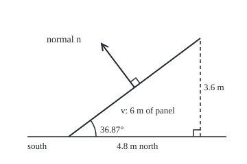

# Cross product: a vector perpendicular to two others, with the parallelogram's area as its length

[Syllabus](../../../SYLLABUS.md) → [Geometry and trig](../../../SYLLABUS.md#w05) → [Vectors in Space](../../../SYLLABUS.md#w05-s05) → Cross product

---

## General Overview

A solar panel is 10 m long and 6 m wide. Its bottom edge lies level, running due east. Its other edge climbs north: 4.8 m north and 3.6 m up over its 6 m. An installer asks how much surface catches light, and which way it faces.

The first answer is 60 square metres. The second is a direction: up and to the south, 36.87° off vertical. That direction is the panel's **normal**, an arrow standing square to its surface.

One calculation gives both. Feed in the two edges as arrows; out comes one arrow along the normal whose length equals the area: the **cross product**. Swap the edges and the arrow reverses, same area, facing the ground. So order carries the **orientation**: which face is the front.

**The cross product turns two ordered edges into an arrow square to both, whose length is the area of their parallelogram and whose direction names the front face.**

**What kind of fact this is:** a definition; that the result is square to both edges, that its length is the area, and that it follows the right-hand rule are theorems, proved on this card in Why it works.

### The picture: the panel seen from the east, edge on

<p align="center"></p>

Scale 1 m = 40 units. The 10 m edge points out of the page. The arc marks the slope's 36.87° from level; the normal leans the same 36.87° from vertical. The normal is drawn 2 m long from the panel's middle; small squares mark right angles.

---

## The formula

Notation first, in words. A vector here has three parts: east, north, up. The bottom edge is $u$ = (10, 0, 0) and the sloping edge $v$ = (0, 4.8, 3.6), in metres. Their parts are numbered: $u_1$ east, $u_2$ north, $u_3$ up. The sign ×, read "cross", makes a new vector from two:

$$u \times v = (u_2 v_3 - u_3 v_2,\; u_3 v_1 - u_1 v_3,\; u_1 v_2 - u_2 v_1)$$

**Read it aloud:** each part is a two-by-two determinant of the other two directions, taken round the cycle east, north, up, east.

Call the answer $w$. Bars mean length, as on [The dot product](../../03-Algebra/06-Dot%20Products%20and%20Best%20Fits/01-dot-product.md). With $\theta$ the angle between the edges, three facts, proved below:

$$w \cdot u = 0, \qquad w \cdot v = 0, \qquad \lvert w\rvert = \lvert u\rvert\,\lvert v\rvert \sin\theta$$

**Read it aloud:** the new arrow is square to both edges, and its length is one edge times the other's height above it: the parallelogram's area.

Dividing $w$ by its length gives the **unit normal** $n$, length 1, same direction.

| Symbol | Plain meaning | In our example | Push it up and the answer… |
| --- | --- | --- | --- |
| $u$, $v$ | the two edges from one corner, in order | (10, 0, 0) and (0, 4.8, 3.6) m | bigger area; swap them and $w$ reverses |
| $u_1$, $u_2$, $u_3$, $v_1$, $v_2$, $v_3$ | east, north, up parts | 10, 0, 0 and 0, 4.8, 3.6 | each feeds two parts of $w$ |
| $w$ | the cross product: the area vector | (0, −36, 48) square metres | — |
| $\lvert w\rvert$ | its length: the area | 60 square metres | — |
| $\lvert u\rvert$, $\lvert v\rvert$ | the edge lengths | 10 m and 6 m | area grows in step |
| $\theta$ | angle between the edges | 90°, sine 1 | area peaks at 90° |
| $u \cdot v$ | dot product: matching parts multiplied, added | 0 | alignment, not area |
| $n$ | unit normal | (0, −0.6, 0.8) | direction only |

### When it holds

- **Three dimensions.** In a flat plane only the third part survives, one signed number ([Shoelace formula](../07-Points%2C%20Convexity%20and%20Fractals/01-polygon-area-and-orientation.md)). In four dimensions there is no single square-on direction.
- **Right-handed axes.** Curl the right hand's fingers from east to north and the thumb points up. Software with left-handed axes gets the same numbers but an arrow facing the other way.
- **Edges not parallel.** Parallel edges give (0, 0, 0): no area, no normal. Nearly parallel edges give a tiny arrow that small errors swing.
- **Units multiply.** Metres times metres gives square metres; lever arm times force gives a turning effect.

---

## Why it works

### Step 0: each part is a shadow, and a shadow's area is a two-by-two determinant

Shine a light straight down. The edges' shadows on the ground keep only east and north: (10, 0) and (0, 4.8). A flat parallelogram on edges (a, c) and (b, d) has signed area ad − bc ([Determinants](../../03-Algebra/05-Solving%20Systems/04-determinants.md)). The ground shadow: 10 × 4.8 − 0 × 0 = 48, the third part.

Light from the east throws a shadow on the north–up wall, parts taken north then up: the first part. Light from the north uses the up–east wall, and the cycle says up then east: $u_3 v_1 - u_1 v_3$. The middle part only looks reversed; it follows the cycle.

Steps 1 to 3 prove these three shadow areas form an arrow square to the panel whose length is its area.

### Step 1: the arrow is square to both edges

Two arrows are square when their dot product is 0. On the panel, $w \cdot v$ = −36 × 4.8 + 48 × 3.6 = −172.8 + 172.8 = 0. In general $w \cdot u$ expands to six products:

$$u_1 u_2 v_3 - u_1 u_3 v_2 + u_2 u_3 v_1 - u_2 u_1 v_3 + u_3 u_1 v_2 - u_3 u_2 v_1$$

Each appears once with plus, once with minus: the sum is 0. Likewise $w \cdot v$. Square to both edges means square to the whole panel.

### Step 2: the length is base times height

Geometry first. Area is base $\lvert u\rvert$ times height, the part of $v$ left after removing its part along $u$ ([Projection](../../03-Algebra/06-Dot%20Products%20and%20Best%20Fits/02-orthogonal-projection.md)). That part has length $u \cdot v / \lvert u\rvert$, so Pythagoras gives the height, and

$$\text{area}^2 = \lvert u\rvert^2 \lvert v\rvert^2 - (u \cdot v)^2$$

Algebra second. The squares of the three parts of $w$ add to the same right-hand side (folded below). Neither side is negative, so the length of $w$ is the area. In shadows: the area squared is the sum of the shadow areas squared.

<details>
<summary>Detailed proof: the squared parts add to the same thing</summary>

Multiply out the product of the two squared lengths: nine terms. Square the dot product: three squares such as $u_1^2 v_1^2$ and three doubled terms such as $2 u_1 v_1 u_2 v_2$.

Subtract. The matching squares cancel. Group the rest by pairs of directions: $u_1^2 v_2^2 + u_2^2 v_1^2 - 2 u_1 v_1 u_2 v_2 = (u_1 v_2 - u_2 v_1)^2$, and the same for (north, up) and (up, east). These are the squares of the parts of $w$. On the panel: $0^2 + 36^2 + 48^2 = 3600 = 60^2$.

</details>

### Step 3: the sine form

The dot product gives $u \cdot v = \lvert u\rvert\,\lvert v\rvert \cos\theta$. Put that into Step 2 and use $\cos^2\theta + \sin^2\theta = 1$ ([Sine, cosine and tangent](../03-Trigonometry/01-right-triangle-trigonometry.md)). The sine is never negative from 0° to 180°, so the length is $\lvert u\rvert\,\lvert v\rvert \sin\theta$: here 10 × 6 × 1 = 60.

### Step 4: the direction follows the right-hand rule

A normal could point either way; the formula picks one. Stack $u$, $v$, $w$ as the rows of a three-by-three. Along the bottom row its cofactors (minors with alternating signs) are the parts of $w$, so the determinant is $w \cdot w$: positive unless the edges are parallel. Positive means the three keep the handedness of east, north, up ([Determinants](../../03-Algebra/05-Solving%20Systems/04-determinants.md)). The check expands along the top row instead: 3600.

In the hand: fingers along $u$, curl towards $v$, thumb along $w$: up and south here. Swapping the edges flips every sign: $v \times u$ = (0, 36, −48).

With any third edge in the bottom row, the same determinant is a box's volume: [Triple product](03-triple-product-and-volume.md) (Triple product).

---

## Worked numbers, by hand

| Step | Arithmetic | Value |
| --- | --- | --- |
| first part, north–up shadow | 0 × 3.6 − 0 × 4.8 | 0 |
| second part, up–east shadow | 0 × 0 − 10 × 3.6 | −36 |
| third part, ground shadow | 10 × 4.8 − 0 × 0 | 48 |
| area vector | collect the parts | **(0, −36, 48) square metres** |
| its length | square root of 3600, the parts' squares added | **60 square metres** |
| square to the slope | −36 × 4.8 + 48 × 3.6 | 0 |
| unit normal | (0, −36, 48) ÷ 60 | **(0, −0.6, 0.8)** |
| normal's tilt from vertical | the slope's: rise 3.6 over run 4.8 | 36.87° |

The panel catches light on 60 square metres, and its front faces up and south: the right way round north of the equator.

The code's second case turns the panel to run 8 m east, 6 m north. All three parts come alive, (21.6, −28.8, 48); the length stays 60.

### What breaks if you drop a piece

| Mistake | Comes out at | What went wrong |
| --- | --- | --- |
| Middle part written $u_1 v_3 - u_3 v_1$ | (0, 36, 48); dot with $v$ is 345.6 | cycle broken: not square to the panel |
| Edges taken in the other order | (0, 36, −48) | same area, front facing the ground |
| Dot product used as the area | 0 | square edges: dot product 0, full area |
| Half-panel triangle left unhalved | 60 instead of 30 square metres | a triangle is half the parallelogram |

The code prints all four.

---

## Code, from first principles, and it actually runs

Only square root, arctangent and degrees are imported. Road 1 is the component formula. Road 2 never forms a cross product: area as base times height, and the normal built from the tilt (rise and run of the slope). The determinant, expanded along its top row, checks the orientation.

### Python

```python
# Cross product and oriented area -- the check behind the card.  Only square root,
# arctangent and degrees are imported.  A 10 m by 6 m solar panel: bottom edge u, sloping edge v,
# in metres east, north, up.  Road 1 is the component formula.  Road 2 never forms a
# cross product: base times height for the area, the panel's tilt for the normal.
from math import sqrt, atan2, degrees

def cross(u, v):
    return (u[1]*v[2] - u[2]*v[1], u[2]*v[0] - u[0]*v[2], u[0]*v[1] - u[1]*v[0])

def dot(u, v):
    return u[0]*v[0] + u[1]*v[1] + u[2]*v[2]

def f(x):                                   # two decimals, and never "-0.00"
    return f"{(x if abs(x) > 5e-10 else 0.0):.2f}"

def vec(a):
    return "(" + ", ".join(f(x) for x in a) + ")"

def det3(a, b, c):                          # rows a, b, c; cofactors along the top row
    return (a[0]*(b[1]*c[2] - b[2]*c[1]) - a[1]*(b[0]*c[2] - b[2]*c[0])
            + a[2]*(b[0]*c[1] - b[1]*c[0]))

cases = [("case 1, bottom edge due east", (10.0, 0.0, 0.0), (0.0, 4.8, 3.6)),
         ("case 2, the same panel turned", (8.0, 6.0, 0.0), (-2.88, 3.84, 3.6))]
for label, u, v in cases:
    w = cross(u, v)                         # road 1
    area = sqrt(dot(w, w))
    n = tuple(x / area for x in w)
    k = dot(u, v) / dot(u, u)               # road 2: drop v's part along u, keep the height
    h = tuple(v[i] - k * u[i] for i in range(3))
    base, height = sqrt(dot(u, u)), sqrt(dot(h, h))
    run, rise = sqrt(h[0]**2 + h[1]**2), h[2]   # u is level, so h climbs straight up the slope
    tilt_n = (-h[0] / run * rise / height, -h[1] / run * rise / height, run / height)
    d = det3(u, v, w)
    print(f"{label}: u = {vec(u)}, v = {vec(v)}")
    print(f"  road 1, components: w = u x v = {vec(w)}, length {f(area)} m^2")
    print(f"  road 2, base times height: {f(base)} m x {f(height)} m = {f(base * height)} m^2")
    print(f"  unit normal by components {vec(n)}; by the tilt {vec(tilt_n)}")
    print(f"  w.u = {f(dot(w, u))}, w.v = {f(dot(w, v))}; det of rows u, v, w = {f(d)}")
    assert abs(area - base * height) < 1e-9                        # area, two roads
    assert all(abs(n[i] - tilt_n[i]) < 1e-12 for i in range(3))    # normal, two roads
    assert abs(dot(w, u)) < 1e-9 and abs(dot(w, v)) < 1e-9          # perpendicular to both
    assert d > 0 and abs(d - (w[0]**2 + w[1]**2 + w[2]**2)) < 1e-9  # right-handed
u, v = cases[0][1], cases[0][2]
w, bad = cross(u, v), (u[1]*v[2] - u[2]*v[1], u[0]*v[2] - u[2]*v[0], u[0]*v[1] - u[1]*v[0])
A = sqrt(dot(w, w))
print(f"tilt from level {degrees(atan2(v[2], v[1])):.2f} degrees; sin of the edge angle = {f(A / sqrt(dot(u, u) * dot(v, v)))}")
print(f"shadows: ground {f(w[2])}, east-west wall {f(w[1])}, north-south wall {f(w[0])}; squares add to {f(dot(w, w))}")
print(f"order swapped: v x u = {vec(cross(v, u))}, length {f(A)} m^2, facing down")
print(f"mistake, middle sign unflipped: {vec(bad)}; dot with v = {f(dot(bad, v))}, not 0")
print(f"mistake, dot product read as area: u.v = {f(dot(u, v))}, not {f(A)}")
print(f"mistake, triangle half-panel left unhalved: {f(A)} instead of {f(A / 2)} m^2")
print(f"figure, 1 m = 40 units: foot (100, 200), top ({100 + 40 * v[1]:.0f}, {200 - 40 * v[2]:.0f}), "
      f"normal ({100 + 20 * v[1]:.0f}, {200 - 20 * v[2]:.0f}) to ({100 + 20 * v[1] + 80 * w[1] / A:.0f}, {200 - 20 * v[2] - 80 * w[2] / A:.0f})")
print("ALL CHECKS PASS")
```

**Ran 2026-09-24 on macOS, Python 3.14.6, standard library only. All checks passed. Output, pasted from the run:**

```
case 1, bottom edge due east: u = (10.00, 0.00, 0.00), v = (0.00, 4.80, 3.60)
  road 1, components: w = u x v = (0.00, -36.00, 48.00), length 60.00 m^2
  road 2, base times height: 10.00 m x 6.00 m = 60.00 m^2
  unit normal by components (0.00, -0.60, 0.80); by the tilt (0.00, -0.60, 0.80)
  w.u = 0.00, w.v = 0.00; det of rows u, v, w = 3600.00
case 2, the same panel turned: u = (8.00, 6.00, 0.00), v = (-2.88, 3.84, 3.60)
  road 1, components: w = u x v = (21.60, -28.80, 48.00), length 60.00 m^2
  road 2, base times height: 10.00 m x 6.00 m = 60.00 m^2
  unit normal by components (0.36, -0.48, 0.80); by the tilt (0.36, -0.48, 0.80)
  w.u = 0.00, w.v = 0.00; det of rows u, v, w = 3600.00
tilt from level 36.87 degrees; sin of the edge angle = 1.00
shadows: ground 48.00, east-west wall -36.00, north-south wall 0.00; squares add to 3600.00
order swapped: v x u = (0.00, 36.00, -48.00), length 60.00 m^2, facing down
mistake, middle sign unflipped: (0.00, 36.00, 48.00); dot with v = 345.60, not 0
mistake, dot product read as area: u.v = 0.00, not 60.00
mistake, triangle half-panel left unhalved: 60.00 instead of 30.00 m^2
figure, 1 m = 40 units: foot (100, 200), top (292, 56), normal (196, 128) to (148, 64)
ALL CHECKS PASS
```

### Rust

Same numbers, same labels, built with `rustc --edition 2021 -O`.

```rust
// Cross product and oriented area -- the same check as the Python, in Rust.  No crates.
// A 10 m by 6 m solar panel: bottom edge u, sloping edge v, in metres east, north, up.
// Road 1 is the component formula.  Road 2 never forms a cross product: base times
// height for the area, the panel's tilt for the normal.
type V = [f64; 3];

fn cross(u: V, v: V) -> V {
    [u[1] * v[2] - u[2] * v[1], u[2] * v[0] - u[0] * v[2], u[0] * v[1] - u[1] * v[0]]
}

fn dot(u: V, v: V) -> f64 { u[0] * v[0] + u[1] * v[1] + u[2] * v[2] }

fn f(x: f64) -> String {                    // two decimals, and never "-0.00"
    format!("{:.2}", if x.abs() > 5e-10 { x } else { 0.0 })
}

fn vec(a: V) -> String { format!("({}, {}, {})", f(a[0]), f(a[1]), f(a[2])) }

fn det3(a: V, b: V, c: V) -> f64 {          // rows a, b, c; cofactors along the top row
    a[0] * (b[1] * c[2] - b[2] * c[1]) - a[1] * (b[0] * c[2] - b[2] * c[0])
        + a[2] * (b[0] * c[1] - b[1] * c[0])
}

fn main() {
    let cases: [(&str, V, V); 2] = [
        ("case 1, bottom edge due east", [10.0, 0.0, 0.0], [0.0, 4.8, 3.6]),
        ("case 2, the same panel turned", [8.0, 6.0, 0.0], [-2.88, 3.84, 3.6]),
    ];
    for (label, u, v) in cases {
        let w = cross(u, v);                // road 1
        let area = dot(w, w).sqrt();
        let n = w.map(|x| x / area);
        let k = dot(u, v) / dot(u, u);      // road 2: drop v's part along u, keep the height
        let h: V = [v[0] - k * u[0], v[1] - k * u[1], v[2] - k * u[2]];
        let (base, height) = (dot(u, u).sqrt(), dot(h, h).sqrt());
        let (run, rise) = ((h[0] * h[0] + h[1] * h[1]).sqrt(), h[2]); // u is level
        let tilt_n: V = [-h[0] / run * rise / height, -h[1] / run * rise / height, run / height];
        let d = det3(u, v, w);
        println!("{}: u = {}, v = {}", label, vec(u), vec(v));
        println!("  road 1, components: w = u x v = {}, length {} m^2", vec(w), f(area));
        println!("  road 2, base times height: {} m x {} m = {} m^2", f(base), f(height), f(base * height));
        println!("  unit normal by components {}; by the tilt {}", vec(n), vec(tilt_n));
        println!("  w.u = {}, w.v = {}; det of rows u, v, w = {}", f(dot(w, u)), f(dot(w, v)), f(d));
        assert!((area - base * height).abs() < 1e-9);                     // area, two roads
        assert!((0..3).all(|i| (n[i] - tilt_n[i]).abs() < 1e-12));        // normal, two roads
        assert!(dot(w, u).abs() < 1e-9 && dot(w, v).abs() < 1e-9);         // perpendicular
        assert!(d > 0.0 && (d - (w[0] * w[0] + w[1] * w[1] + w[2] * w[2])).abs() < 1e-9);
    }
    let (u, v) = (cases[0].1, cases[0].2);
    let w = cross(u, v);
    let bad: V = [u[1] * v[2] - u[2] * v[1], u[0] * v[2] - u[2] * v[0], u[0] * v[1] - u[1] * v[0]];
    let a = dot(w, w).sqrt();
    println!("tilt from level {:.2} degrees; sin of the edge angle = {}",
             v[2].atan2(v[1]).to_degrees(), f(a / (dot(u, u) * dot(v, v)).sqrt()));
    println!("shadows: ground {}, east-west wall {}, north-south wall {}; squares add to {}",
             f(w[2]), f(w[1]), f(w[0]), f(dot(w, w)));
    println!("order swapped: v x u = {}, length {} m^2, facing down", vec(cross(v, u)), f(a));
    println!("mistake, middle sign unflipped: {}; dot with v = {}, not 0", vec(bad), f(dot(bad, v)));
    println!("mistake, dot product read as area: u.v = {}, not {}", f(dot(u, v)), f(a));
    println!("mistake, triangle half-panel left unhalved: {} instead of {} m^2", f(a), f(a / 2.0));
    println!("figure, 1 m = 40 units: foot (100, 200), top ({:.0}, {:.0}), normal ({:.0}, {:.0}) to ({:.0}, {:.0})",
             100.0 + 40.0 * v[1], 200.0 - 40.0 * v[2], 100.0 + 20.0 * v[1], 200.0 - 20.0 * v[2],
             100.0 + 20.0 * v[1] + 80.0 * w[1] / a, 200.0 - 20.0 * v[2] - 80.0 * w[2] / a);
    println!("ALL CHECKS PASS");
}
```

**Ran 2026-09-24 on macOS, rustc 1.98.1, no crates. All checks passed. Output, pasted from the run:**

```
case 1, bottom edge due east: u = (10.00, 0.00, 0.00), v = (0.00, 4.80, 3.60)
  road 1, components: w = u x v = (0.00, -36.00, 48.00), length 60.00 m^2
  road 2, base times height: 10.00 m x 6.00 m = 60.00 m^2
  unit normal by components (0.00, -0.60, 0.80); by the tilt (0.00, -0.60, 0.80)
  w.u = 0.00, w.v = 0.00; det of rows u, v, w = 3600.00
case 2, the same panel turned: u = (8.00, 6.00, 0.00), v = (-2.88, 3.84, 3.60)
  road 1, components: w = u x v = (21.60, -28.80, 48.00), length 60.00 m^2
  road 2, base times height: 10.00 m x 6.00 m = 60.00 m^2
  unit normal by components (0.36, -0.48, 0.80); by the tilt (0.36, -0.48, 0.80)
  w.u = 0.00, w.v = 0.00; det of rows u, v, w = 3600.00
tilt from level 36.87 degrees; sin of the edge angle = 1.00
shadows: ground 48.00, east-west wall -36.00, north-south wall 0.00; squares add to 3600.00
order swapped: v x u = (0.00, 36.00, -48.00), length 60.00 m^2, facing down
mistake, middle sign unflipped: (0.00, 36.00, 48.00); dot with v = 345.60, not 0
mistake, dot product read as area: u.v = 0.00, not 60.00
mistake, triangle half-panel left unhalved: 60.00 instead of 30.00 m^2
figure, 1 m = 40 units: foot (100, 200), top (292, 56), normal (196, 128) to (148, 64)
ALL CHECKS PASS
```

The two outputs match line for line.

> [!TIP]
> **Try changing**
> Guess first, then run it.
> - **Slide the top edge along the bottom.** Set case 1's `v` to `(3.0, 4.8, 3.6)`, a leaning parallelogram. The height is unchanged, so the area stays 60 and $w$ stays (0, −36, 48); every assert passes.
> - **Swap the edges.** Exchange `u` and `v` in case 1: $w$ becomes (0, 36, −48), area 60. The second assert stops the run, because the tilt road assumes the first edge is level.
> - **Break the cycle.** Write the middle part of `cross` as `u[0]*v[2] - u[2]*v[0]`. The length is still 60, but $w$ = (0, 36, 48) faces north and the second assert stops the run.

---

## The usual mistake

> [!warning]
> **Treating the cross product as a number.** It is an arrow: length for area, direction for the front face. For area alone take the length, and edge order stops mattering. For facing, keep the order: swapped, (0, −36, 48) becomes (0, 36, −48).
>
> - **Middle part in alphabetical order**, the dot product as area, no half for a triangle: all in the table above.
> - **Normalising a zero arrow.** Parallel edges give (0, 0, 0), and dividing by length 0 has no answer.

---

## Where you meet it in real life

- **Solar design.** The unit normal, dotted with the sun's direction, says how squarely light strikes a panel.
- **3D graphics.** Each triangle in a game mesh takes its normal from the cross product of two edges; the order of its corners decides which face is drawn.
- **Turning effects.** Torque is lever arm cross force: length the turning strength, direction the axis. Feynman builds its parts as turning effects in the three coordinate planes (sources).
- **Planes in space.** A point and a normal fix a plane: [Lines and planes](02-lines-and-planes-in-space.md) (Lines and planes).

> **Say it back**
> The cross product turns two ordered edges into one arrow. Its parts are the edges' shadow areas on the three coordinate walls. The arrow is square to both edges, and its length is base times height. Swapping the edges reverses it. The panel gives (0, −36, 48): 60 square metres, facing up and south.

---

## What this builds on

- [Vectors](../../03-Algebra/03-Vectors/01-vectors.md): edges as arrows with east, north and up parts.
- [Determinants](../../03-Algebra/05-Solving%20Systems/04-determinants.md): ad − bc as signed area, and a determinant's sign as handedness.

The card also leans on the dot product for lengths and right angles ([The dot product](../../03-Algebra/06-Dot%20Products%20and%20Best%20Fits/01-dot-product.md)).

## Where this goes next

- [Lines and planes](02-lines-and-planes-in-space.md): the normal becomes a plane's equation.
- [Moving shapes with matrices](04-transformations-with-matrices.md): turning the panel with a matrix.
- [Shoelace formula](../07-Points%2C%20Convexity%20and%20Fractals/01-polygon-area-and-orientation.md): the third part alone, for flat polygons.
- [Divergence and curl](../../06-Calculus%20and%20analysis/09-Vector%20Calculus/03-divergence-and-curl.md): how a flow swirls.
- [Surface integrals](../../06-Calculus%20and%20analysis/09-Vector%20Calculus/05-surface-integrals-and-flux.md): area vectors of small patches, added over a surface.
- Magnetic fields: the push on a moving charge, square to motion and field.
- Precession: torque turning a spinning axis.
- Frenet-Serret frame: a curve's third frame direction from the first two.
- Differential form: the shadows kept as they are, in any dimension.

The panel now has a normal and an area, but nothing yet says which points in space lie on its plane or where a straight flight path would strike it; that is [Lines and planes](02-lines-and-planes-in-space.md).

---

## Sources

Verified 2026-09-24: every link below resolves to the publisher's page.

- Strang, Gilbert, Edwin Herman et al. *Calculus Volume 3*, OpenStax, Rice University, 2016. [Section 2.4, The Cross Product](https://openstax.org/books/calculus-volume-3/pages/2-4-the-cross-product). Components, the sine form with proof, the right-hand rule; free.
- Feynman, Richard P., Robert B. Leighton and Matthew Sands. *The Feynman Lectures on Physics*, Volume I, Chapter 20, "Rotation in Space." Caltech. [Section 20–1, Torques in three dimensions](https://www.feynmanlectures.caltech.edu/I_20.html). Torque's parts as turning in the three coordinate planes: the shadow reading.
