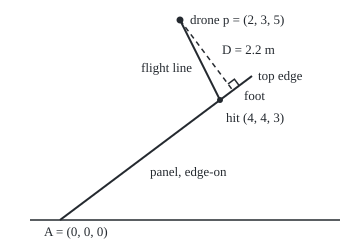

# Lines and planes: a point plus a direction, a point plus a normal

[Syllabus](../../../SYLLABUS.md) → [Geometry and trig](../../../SYLLABUS.md#w05) → [Vectors in Space](../../../SYLLABUS.md#w05-s05) → Lines and planes

---

## General Overview

A drone hovers 5 m up. Below it lies a 10 m by 6 m solar panel: one long edge on the ground, the far edge propped 3.6 m up and 4.8 m back. The drone dives straight at the panel. Where does it touch down, and how close was it before it set off?

On a grid in metres, the panel's low corner is (0, 0, 0). Its 10 m edge runs along x; its 6 m edge runs 4.8 m along y while rising 3.6 m in z, the height. The drone starts at (2, 3, 5); each second of the dive moves it 2 m along x, 1 m along y and 2 m down.

A straight line is a start point and a direction to repeat. A flat surface is a point on it and one arrow standing straight out of it, its **normal** (perpendicular to the whole surface). Put the line into the plane's test and the touchdown time falls out; the normal also gives the shortest distance to the plane.

**A line is a point plus any multiple of a direction; a plane is every point whose offset from a known point is perpendicular to a normal; substitution finds where they meet, and the normal measures how far off a point sits.**

**What kind of fact this is:** a method built on two definitions; its claims (one meeting point unless the line runs level, the perpendicular as the shortest route) are proved on this card in Why it works.

### The picture: the dive, seen from the side

<p align="center"></p>

Drawn at 1 m = 40 units, looking along the 10 m edge: across is y, up is z. The panel shows edge-on, so the dashed 2.2 m perpendicular keeps its true length and right angle; the flight line also moves 2 m along x, out of the page, so it looks shorter than its true 3 m.

---

## The formula

A point or an arrow in space is a list of three numbers ([Vectors](../../03-Algebra/03-Vectors/01-vectors.md)). Reminders: $a \cdot b$, the dot product, is zero exactly at a right angle ([The dot product](../../03-Algebra/06-Dot%20Products%20and%20Best%20Fits/01-dot-product.md)); $a \times b$, the cross product, is perpendicular to both, its length their parallelogram's area ([Cross product](01-cross-product-and-oriented-area.md)). Bars give a length: $\lvert a\rvert = \sqrt{a \cdot a}$.

$$X = p + t\,d \qquad\qquad n \cdot X = c, \quad c = n \cdot A, \quad n = u \times v$$

**Read it aloud:** the line is the drone plus any multiple of the direction; the plane is every point whose dot product with the normal matches the corner's.

Substitution and the normal give three working formulas:

$$t = \frac{c - n \cdot p}{n \cdot d}, \qquad D = \frac{\lvert n \cdot p - c\rvert}{\lvert n\rvert}, \qquad E = \frac{\lvert (q - p) \times d\rvert}{\lvert d\rvert}$$

**Read it aloud:** meeting time is the gap to close over the gap closed per step; distance to the plane is the gap over the normal's length; distance to a line is area over base.

| Symbol | Plain meaning | In our example | Push it up and the answer… |
| --- | --- | --- | --- |
| $X$, $Y$ | any point, coordinates (x, y, z) in metres | touchdown (4, 4, 3) | — |
| $p$, $d$ | the line's start, and its step per unit of t | drone (2, 3, 5); dive (2, 1, -2), 3 m long | a longer step meets the panel at a smaller t |
| $t$ | how many steps of $d$ from $p$ | 1 at touchdown | slides the point along the line |
| $A$, $u$, $v$ | the panel's low corner and two edges | (0, 0, 0); (10, 0, 0), (0, 4.8, 3.6) | a steeper $v$ tilts the plane |
| $n$ | the normal, $u \times v$ | (0, -36, 48), length 60 | scaling changes nothing: (0, -3, 4) is the same plane |
| $c$ | the plane's level, $n \cdot A$ | 0 | shifts the plane along $n$ |
| $D$, $F$ | drone-to-plane distance, and the foot where it lands | 2.2 m; (2, 4.32, 3.24) | — |
| $q$, $E$ | a camera mast's tip, and its distance to the flight line | (5, 1.5, 5); 3 m | — |

### When it holds

- **A direction and a normal that are not all zeros.** A zero $d$ never leaves $p$; parallel edges give a zero $n$, which every point passes.
- **A line not level with the plane.** When $n \cdot d = 0$ the formula for t divides by zero: the flight (1, 4, 3) stays 2.2 m off for ever.
- **An endless sheet, a two-way line.** The formulas ignore the panel's edges and allow negative t, behind the drone; a real touchdown needs t ≥ 0 and a point inside the rectangle.
- **Square axes in one unit.** Otherwise the dot product misreads right angles and lengths.

---

## Why it works

### Step 0: fix a place, then a way of facing

A point fixes where; one arrow fixes which way: where a line goes next, or which way a plane faces. Everything after is the dot product's right-angle test.

### Step 1: the plane is exactly the points that pass the test

An arrow from the corner $A$ to a panel point lies flat, so its dot product with $n$ is zero. Conversely, $u$, $v$ and $n$ point three independent ways, so every arrow is a mix of them; one perpendicular to $n$ has no share of $n$, so it is a mix of $u$ and $v$ alone and lies in the panel's plane. Expanding $n \cdot (X - A) = 0$ gives $n \cdot X = c$.

Here $c = 0$, and $n$ divided by 12 gives the plane $-3y + 4z = 0$: height is three quarters of the distance back.

### Step 2: substitute the line and solve for t

A line point is on the plane when $n \cdot (p + t\,d) = c$:

$$n \cdot p + t\,(n \cdot d) = c.$$

One equation in t, three cases:

- $n \cdot d$ not zero: exactly one t. The drone's gap is 132 and falls by 132 per step, so $t = 1$.
- $n \cdot d$ zero and $n \cdot p = c$: 0 = 0 for every t. The line lies in the plane.
- $n \cdot d$ zero and $n \cdot p$ not $c$: zero must equal something else. The line never meets.

### Step 3: the shortest way to the plane runs along the normal

Move from the drone along the normal until the test is passed, reaching the **foot** of the perpendicular:

$$F = p - \frac{n \cdot p - c}{n \cdot n}\, n$$

It passes the test, and its distance from the drone is the gap over $\lvert n\rvert$: that is $D$. Any other point of the plane is further, by Pythagoras ([Pythagoras](../01-Angles%2C%20Triangles%20and%20Congruence/05-pythagoras-and-its-converse.md)): the route to it is a leg along the normal plus a leg in the plane, at right angles.

<details>
<summary>Detailed proof: the foot is closest, and D ignores the normal's size</summary>

Write $g = n \cdot p - c$, so $F = p - (g / (n \cdot n))\,n$ and $n \cdot F = n \cdot p - g = c$.

Take any $Y$ with $n \cdot Y = c$. Then $n \cdot (Y - F) = 0$, so $Y - F$ is perpendicular to $p - F$, a multiple of $n$. Splitting $p - Y = (p - F) + (F - Y)$ and dotting it with itself, the cross term vanishes:

$\lvert p - Y\rvert^2 = \lvert p - F\rvert^2 + \lvert F - Y\rvert^2 \ge \lvert p - F\rvert^2$,

with equality only at $Y = F$. And $\lvert p - F\rvert = (\lvert g\rvert / (n \cdot n))\,\lvert n\rvert = \lvert g\rvert / \lvert n\rvert = D$.

Scaling $n$ and $c$ by a non-zero number scales the gap and the length alike, so $D$ is unchanged.

</details>

### Step 4: the distance to a line is area over base

A camera mast's tip is at $q$ = (5, 1.5, 5). Stand $q - p$ and $d$ at the drone: they span a parallelogram with base $d$ and height the mast tip's distance from the line. The cross product's length is the area, so area over base is height: $E = 9 / 3 = 3$ m, reached at $t = 0.5$.

Projecting $q - p$ onto $d$ is a second route, in [Projection](../../03-Algebra/06-Dot%20Products%20and%20Best%20Fits/02-orthogonal-projection.md).

---

## Worked numbers, by hand

| Step | Arithmetic | Value |
| --- | --- | --- |
| normal from the edges | (10, 0, 0) × (0, 4.8, 3.6) | (0, -36, 48), length 60 |
| drone's gap, $n \cdot p - c$ | -36 × 3 + 48 × 5 - 0 | 132 |
| gap per step, $n \cdot d$ | -36 × 1 + 48 × (-2) | -132 |
| touchdown | t = (0 - 132) / (-132) = 1; (2, 3, 5) + (2, 1, -2) | **(4, 4, 3)** |
| on the panel? | 4 m along the 10 m edge, 5 m up the 6 m edge | yes |
| drone to plane | 132 / 60 | **D = 2.2 m** |
| mast to flight line | (3, -1.5, 0) × (2, 1, -2) = (3, 6, 6), length 9, over 3 | **E = 3 m** |

The drone lands at (4, 4, 3) after 3 m of flight, inside the panel; it started 2.2 m from its plane.

### What breaks if you drop a piece

| Mistake | Comes out at | What went wrong |
| --- | --- | --- |
| The raw gap read as a distance | 132 instead of 2.2 m | not divided by the normal's length, 60 |
| t read as metres flown | 1 instead of 3 m | t counts steps of $d$, each 3 m |
| Straight down taken as shortest | 2.75 instead of 2.2 m | on a tilted panel, down is not along the normal |

---

## Code, from first principles, and it actually runs

Nothing is imported. Each answer is reached twice: touchdown by the formula and by halving a bracket on the gap's sign 80 times; the plane distance by the formula and by a 5 cm grid of 24,321 panel points; the mast distance by the cross product and by scanning the line in steps of 0.001.

### Python

```python
# Lines and planes in space -- the check behind the card.  Nothing is imported.
# A drone at p = (2, 3, 5) flies along d = (2, 1, -2).  Below it a 10 m by 6 m
# solar panel has corner A = (0, 0, 0) and edges u = (10, 0, 0), v = (0, 4.8, 3.6).
# Each answer is reached twice: by the formula, and by a search that never uses it.
def dot(a, b): return a[0] * b[0] + a[1] * b[1] + a[2] * b[2]
def cross(a, b): return (a[1] * b[2] - a[2] * b[1], a[2] * b[0] - a[0] * b[2], a[0] * b[1] - a[1] * b[0])
def at(p, t, d): return (p[0] + t * d[0], p[1] + t * d[1], p[2] + t * d[2])
def sub(a, b): return (a[0] - b[0], a[1] - b[1], a[2] - b[2])
def length(a): return dot(a, a) ** 0.5
def f3(a): return "(" + ", ".join(f"{x:.3f}" for x in a) + ")"

p, d, q = (2, 3, 5), (2, 1, -2), (5, 1.5, 5)          # drone, flight direction, mast tip
A, u, v = (0, 0, 0), (10, 0, 0), (0, 4.8, 3.6)          # panel corner and its two edges
n = cross(u, v)                                         # the panel's normal
c = dot(n, A)
def gap(X): return dot(n, X) - c                        # zero on the plane; sign gives the side
t = (c - dot(n, p)) / dot(n, d)                         # road 1: substitute the line
lo, hi = 0.0, 5.0                                       # road 2: halve a bracket on the sign
for _ in range(80):
    mid = (lo + hi) / 2
    if gap(at(p, mid, d)) > 0: lo = mid
    else: hi = mid
hit = at(p, t, d)
def panel_coords(X): return dot(sub(X, A), u) / length(u), dot(sub(X, A), v) / length(v)
D = abs(gap(p)) / length(n)                             # road 1: the distance formula
foot = at(p, -gap(p) / dot(n, n), n)
grid = min((length(sub(p, at(at(A, i / 200, u), j / 120, v))), i / 20, j / 20)
           for i in range(201) for j in range(121))     # road 2: every 5 cm of the panel
m = (0, -3, 4)                                          # the normal divided by 12
Dm = abs(dot(m, p) - dot(m, A)) / length(m)
E = length(cross(sub(q, p), d)) / length(d)             # road 1: area over base
scan = min((length(sub(q, at(p, k / 1000, d))), k / 1000) for k in range(-2000, 3001))
d2 = (1, 4, 3)                                          # a flight that runs level with the panel
drop = p[2] - p[1] * (-n[1] / n[2])                     # straight down to the panel, at y = 3
def svg(X): return f"({60 + 40 * X[1]:.1f},{220 - 40 * X[2]:.1f})"
print(f"normal n = u x v = {f3(n)}, |n| = {length(n):.3f}, c = n.A = {c:.3f}")
print(f"road 1, substitute the line: t = {c - dot(n, p):.3f} / {dot(n, d):.3f} = {t:.6f}")
print(f"road 2, halve the bracket 80 times: t = {lo:.6f}")
print(f"hit = {f3(hit)}, %.3f m along the 10 m edge, %.3f m up the 6 m edge" % panel_coords(hit))
print(f"flight to the hit: t x |d| = {t:.3f} x {length(d):.3f} = {t * length(d):.3f} m")
print(f"road 1, distance formula: D = |{gap(p):.3f}| / {length(n):.3f} = {D:.3f} m")
print(f"road 2, closest of 24321 panel grid points: {grid[0]:.3f} m at {grid[1]:.3f} m along, {grid[2]:.3f} m up")
print(f"foot = {f3(foot)}; normal (0, -3, 4): D = {abs(dot(m, p)):.3f} / {length(m):.3f} = {Dm:.3f} m")
print(f"mast tip q = (5, 1.5, 5): road 1, |(q - p) x d| / |d| = {length(cross(sub(q, p), d)):.3f} / {length(d):.3f} = {E:.3f} m")
print(f"road 2, scanning t from -2 to 3 in steps of 0.001: {scan[0]:.3f} m at t = {scan[1]:.3f}")
print(f"level flight d = (1, 4, 3): n.d = {dot(n, d2):.3f}, gap stays {abs(gap(at(p, 7, d2))) / length(n):.3f} m, no hit")
print(f"mistake 1, raw gap as distance: {abs(gap(p)):.3f} instead of {D:.3f} m")
print(f"mistake 2, t read as metres: {t:.3f} instead of {t * length(d):.3f} m")
print(f"mistake 3, straight-down drop as distance: {drop:.3f} instead of {D:.3f} m")
print(f"figure, 1 m = 40 units: panel {svg(A)}-{svg(at(A, 1, v))}, drone {svg(p)}, hit {svg(hit)}, foot {svg(foot)}")
assert abs(lo - t) < 1e-9                                # two roads to the meeting point
assert abs(grid[0] - D) < 1e-9 and abs(dot(m, foot)) < 1e-12 and max(abs(g - f) for g, f in zip(grid[1:], panel_coords(foot))) < 1e-9
assert abs(scan[0] - E) < 1e-6 and abs(Dm - D) < 1e-12   # line distance; normal's scale is irrelevant
assert abs(dot(m, hit)) < 1e-12 and 0 <= panel_coords(hit)[0] <= 10 and 0 <= panel_coords(hit)[1] <= 6
print("ALL CHECKS PASS")
```

**Ran 2026-09-24 on macOS, Python 3.14.6, standard library only. All checks passed. Output, pasted from the run:**

```
normal n = u x v = (0.000, -36.000, 48.000), |n| = 60.000, c = n.A = 0.000
road 1, substitute the line: t = -132.000 / -132.000 = 1.000000
road 2, halve the bracket 80 times: t = 1.000000
hit = (4.000, 4.000, 3.000), 4.000 m along the 10 m edge, 5.000 m up the 6 m edge
flight to the hit: t x |d| = 1.000 x 3.000 = 3.000 m
road 1, distance formula: D = |132.000| / 60.000 = 2.200 m
road 2, closest of 24321 panel grid points: 2.200 m at 2.000 m along, 5.400 m up
foot = (2.000, 4.320, 3.240); normal (0, -3, 4): D = 11.000 / 5.000 = 2.200 m
mast tip q = (5, 1.5, 5): road 1, |(q - p) x d| / |d| = 9.000 / 3.000 = 3.000 m
road 2, scanning t from -2 to 3 in steps of 0.001: 3.000 m at t = 0.500
level flight d = (1, 4, 3): n.d = 0.000, gap stays 2.200 m, no hit
mistake 1, raw gap as distance: 132.000 instead of 2.200 m
mistake 2, t read as metres: 1.000 instead of 3.000 m
mistake 3, straight-down drop as distance: 2.750 instead of 2.200 m
figure, 1 m = 40 units: panel (60.0,220.0)-(252.0,76.0), drone (180.0,20.0), hit (220.0,100.0), foot (232.8,90.4)
ALL CHECKS PASS
```

### Rust

Same numbers, same labels, built with `rustc --edition 2021 -O`.

```rust
// Lines and planes in space -- the same check as the Python, in Rust.  No crates.
// A drone at p = (2, 3, 5) flies along d = (2, 1, -2).  Below it a 10 m by 6 m
// solar panel has corner A = (0, 0, 0) and edges u = (10, 0, 0), v = (0, 4.8, 3.6).
// Each answer is reached twice: by the formula, and by a search that never uses it.
type V = [f64; 3];
fn dot(a: V, b: V) -> f64 { a[0] * b[0] + a[1] * b[1] + a[2] * b[2] }
fn cross(a: V, b: V) -> V { [a[1] * b[2] - a[2] * b[1], a[2] * b[0] - a[0] * b[2], a[0] * b[1] - a[1] * b[0]] }
fn at(p: V, t: f64, d: V) -> V { [p[0] + t * d[0], p[1] + t * d[1], p[2] + t * d[2]] }
fn sub(a: V, b: V) -> V { [a[0] - b[0], a[1] - b[1], a[2] - b[2]] }
fn length(a: V) -> f64 { dot(a, a).sqrt() }
fn f3(a: V) -> String { format!("({:.3}, {:.3}, {:.3})", a[0], a[1], a[2]) }
fn svg(x: V) -> String { format!("({:.1},{:.1})", 60.0 + 40.0 * x[1], 220.0 - 40.0 * x[2]) }

fn main() {
    let (p, d, q): (V, V, V) = ([2.0, 3.0, 5.0], [2.0, 1.0, -2.0], [5.0, 1.5, 5.0]);   // drone, direction, mast tip
    let (a, u, v): (V, V, V) = ([0.0; 3], [10.0, 0.0, 0.0], [0.0, 4.8, 3.6]);          // panel corner and edges
    let n = cross(u, v);                                       // the panel's normal
    let c = dot(n, a);
    let gap = |x: V| dot(n, x) - c;                            // zero on the plane; sign gives the side
    let t = (c - dot(n, p)) / dot(n, d);                       // road 1: substitute the line
    let (mut lo, mut hi) = (0.0_f64, 5.0_f64);                 // road 2: halve a bracket on the sign
    for _ in 0..80 {
        let mid = (lo + hi) / 2.0;
        if gap(at(p, mid, d)) > 0.0 { lo = mid } else { hi = mid }
    }
    let hit = at(p, t, d);
    let pc = |x: V| (dot(sub(x, a), u) / length(u), dot(sub(x, a), v) / length(v));
    let dd = gap(p).abs() / length(n);                         // road 1: the distance formula
    let foot = at(p, -gap(p) / dot(n, n), n);
    let mut grid = (f64::INFINITY, 0.0, 0.0);                  // road 2: every 5 cm of the panel
    for i in 0..=200 {
        for j in 0..=120 {
            let dist = length(sub(p, at(at(a, i as f64 / 200.0, u), j as f64 / 120.0, v)));
            if dist < grid.0 { grid = (dist, i as f64 / 20.0, j as f64 / 20.0) }
        }
    }
    let m: V = [0.0, -3.0, 4.0];                               // the normal divided by 12
    let dm = (dot(m, p) - dot(m, a)).abs() / length(m);
    let e = length(cross(sub(q, p), d)) / length(d);           // road 1: area over base
    let mut scan = (f64::INFINITY, 0.0);
    for k in -2000..=3000 {
        let dist = length(sub(q, at(p, k as f64 / 1000.0, d)));
        if dist < scan.0 { scan = (dist, k as f64 / 1000.0) }
    }
    let d2: V = [1.0, 4.0, 3.0];                               // a flight that runs level with the panel
    let drop = p[2] - p[1] * (-n[1] / n[2]);                   // straight down to the panel, at y = 3
    let (ha, hb) = pc(hit);
    println!("normal n = u x v = {}, |n| = {:.3}, c = n.A = {:.3}", f3(n), length(n), c);
    println!("road 1, substitute the line: t = {:.3} / {:.3} = {:.6}", c - dot(n, p), dot(n, d), t);
    println!("road 2, halve the bracket 80 times: t = {:.6}", lo);
    println!("hit = {}, {:.3} m along the 10 m edge, {:.3} m up the 6 m edge", f3(hit), ha, hb);
    println!("flight to the hit: t x |d| = {:.3} x {:.3} = {:.3} m", t, length(d), t * length(d));
    println!("road 1, distance formula: D = |{:.3}| / {:.3} = {:.3} m", gap(p), length(n), dd);
    println!("road 2, closest of 24321 panel grid points: {:.3} m at {:.3} m along, {:.3} m up", grid.0, grid.1, grid.2);
    println!("foot = {}; normal (0, -3, 4): D = {:.3} / {:.3} = {:.3} m", f3(foot), dot(m, p).abs(), length(m), dm);
    println!("mast tip q = (5, 1.5, 5): road 1, |(q - p) x d| / |d| = {:.3} / {:.3} = {:.3} m",
             length(cross(sub(q, p), d)), length(d), e);
    println!("road 2, scanning t from -2 to 3 in steps of 0.001: {:.3} m at t = {:.3}", scan.0, scan.1);
    println!("level flight d = (1, 4, 3): n.d = {:.3}, gap stays {:.3} m, no hit", dot(n, d2), gap(at(p, 7.0, d2)).abs() / length(n));
    println!("mistake 1, raw gap as distance: {:.3} instead of {:.3} m", gap(p).abs(), dd);
    println!("mistake 2, t read as metres: {:.3} instead of {:.3} m", t, t * length(d));
    println!("mistake 3, straight-down drop as distance: {:.3} instead of {:.3} m", drop, dd);
    println!("figure, 1 m = 40 units: panel {}-{}, drone {}, hit {}, foot {}", svg(a), svg(at(a, 1.0, v)), svg(p), svg(hit), svg(foot));
    assert!((lo - t).abs() < 1e-9);                                    // two roads to the meeting point
    assert!((grid.0 - dd).abs() < 1e-9 && dot(m, foot).abs() < 1e-12 && (grid.1 - pc(foot).0).abs() < 1e-9 && (grid.2 - pc(foot).1).abs() < 1e-9);
    assert!((scan.0 - e).abs() < 1e-6 && (dm - dd).abs() < 1e-12);     // line distance; normal's scale is irrelevant
    assert!(dot(m, hit).abs() < 1e-12 && ha >= 0.0 && ha <= 10.0 && hb >= 0.0 && hb <= 6.0);
    println!("ALL CHECKS PASS");
}
```

**Ran 2026-09-24 on macOS, rustc 1.98.1, no crates. All checks passed. Output, pasted from the run:**

```
normal n = u x v = (0.000, -36.000, 48.000), |n| = 60.000, c = n.A = 0.000
road 1, substitute the line: t = -132.000 / -132.000 = 1.000000
road 2, halve the bracket 80 times: t = 1.000000
hit = (4.000, 4.000, 3.000), 4.000 m along the 10 m edge, 5.000 m up the 6 m edge
flight to the hit: t x |d| = 1.000 x 3.000 = 3.000 m
road 1, distance formula: D = |132.000| / 60.000 = 2.200 m
road 2, closest of 24321 panel grid points: 2.200 m at 2.000 m along, 5.400 m up
foot = (2.000, 4.320, 3.240); normal (0, -3, 4): D = 11.000 / 5.000 = 2.200 m
mast tip q = (5, 1.5, 5): road 1, |(q - p) x d| / |d| = 9.000 / 3.000 = 3.000 m
road 2, scanning t from -2 to 3 in steps of 0.001: 3.000 m at t = 0.500
level flight d = (1, 4, 3): n.d = 0.000, gap stays 2.200 m, no hit
mistake 1, raw gap as distance: 132.000 instead of 2.200 m
mistake 2, t read as metres: 1.000 instead of 3.000 m
mistake 3, straight-down drop as distance: 2.750 instead of 2.200 m
figure, 1 m = 40 units: panel (60.0,220.0)-(252.0,76.0), drone (180.0,20.0), hit (220.0,100.0), foot (232.8,90.4)
ALL CHECKS PASS
```

The two outputs match line for line.

> [!TIP]
> **Try changing**
> Guess first, then run it.
> - **Double the dive.** Set `d` to `(4, 2, -4)`. t halves to 0.5; the touchdown stays (4, 4, 3) and every assert holds.
> - **Fly level.** Set `d` to `(1, 4, 3)`. Now $n \cdot d$ is 0, so the line that sets `t` divides by zero and Python stops: there is no touchdown.
> - **Forget the length.** Delete ` / length(n)` from the line that sets `D`. The formula now says 132, the grid still says 2.2, and the second assert stops the run.

---

## The usual mistake

> [!warning]
> **Measuring the gap straight down.** On a tilted panel the shortest way runs along the normal, not the vertical. Straight down, the panel is 2.75 m from the drone; along the normal, 2.2 m. Only a level panel makes the two agree.
>
> - **Skipping the division by the normal's length.** The gap $n \cdot p - c$ is 132 with the raw cross product and 11 with (0, -3, 4); the distance is 2.2 m either way.
> - **Calling a zero $n \cdot d$ "no meeting".** If the start point passes the plane's test, the whole line lies in the plane.
> - **Forgetting the panel's edges.** The plane is endless; a touchdown past the 10 m edge is on the plane and off the panel.

---

## Where you meet it in real life

- **Graphics and games.** A ray traced from a camera is a line, tested against each triangle's plane, then its edges. Placing and viewing scenes is [Moving shapes with matrices](04-transformations-with-matrices.md) and [Perspective](05-perspective-and-projective-coordinates.md).
- **Drones and robots.** Clearance from a wall or roof is a point-to-plane distance, the plane built from three measured points.
- **Surveying and machining.** A measured point's gap along the normal from a reference surface is its flatness error.

> **Say it back**
> A line is a point plus any multiple of a direction. A plane is every point whose arrow from a known point is perpendicular to a normal, found from two edges by the cross product. Substituting the line into the plane's test leaves one equation in t: one answer, every t, or none. The shortest way to a plane runs along the normal, the gap over the normal's length; to a line, area over base.

---

## What this builds on

- [Cross product](01-cross-product-and-oriented-area.md): the normal from two edges, and the area behind the point-to-line distance.
- [The dot product](../../03-Algebra/06-Dot%20Products%20and%20Best%20Fits/01-dot-product.md): the right-angle test that defines a plane, and every length.

## Where this goes next

- [Triple product](03-triple-product-and-volume.md): the normal dotted with a third arrow, a signed volume.
- Regular surface: a curved surface has a plane like this one at every point, its tangent plane.

The gap $n \cdot p - c$ is secretly a box's volume; why, and what it says about three arrows lying flat, is the triple product.

---

## Sources

Verified 24 Sep 2026: every link below resolves to the publisher's page.

- OpenStax. *Calculus Volume 3*, §2.5, "Equations of Lines and Planes in Space." [Publisher page](https://openstax.org/books/calculus-volume-3/pages/2-5-equations-of-lines-and-planes-in-space). Free; both vector forms and both distances.
- Apostol, Tom M. *Calculus, Volume 1*, 2nd ed. Wiley, 1967. [Publisher page](https://www.wiley.com/en-us/Calculus%2C+Volume+1%2C+2nd+Edition-p-9780471000051). Chapter 13 builds lines and planes from vector algebra, with proofs.
- Strang, Gilbert. *Introduction to Linear Algebra*, 6th ed. Wellesley-Cambridge Press, 2023. [Book page](https://math.mit.edu/~gs/linearalgebra/ila6/indexila6.html). Planes as solution sets of one linear equation, and the three cases of Step 2.
