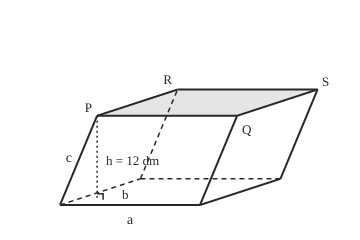

# Triple product: the volume of a slanted box and a test for four points in one plane

[Syllabus](../../../SYLLABUS.md) → [Geometry and trig](../../../SYLLABUS.md#w05) → [Vectors in Space](../../../SYLLABUS.md#w05-s05) → Triple product

---

## General Overview

A shipping crate comes off a forklift knocked out of square. Its floor is now a slanted parallelogram and all four corner posts lean the same way, but every face is still flat. How much does it hold?

Measure three edges from one bottom corner in decimetres (tenths of a metre): a cube one decimetre on a side holds one litre. Edge a runs 20 dm along the floor. Edge b crosses the floor, 15 dm deep and 5 dm sideways. Edge c, a corner post, climbs 12 dm while leaning 4 dm sideways and 3 dm back. Multiplying the three edge lengths gives 4110.96 litres. The crate holds 3600 litres.

A box whose six faces are parallelograms is a **parallelepiped**. The triple product turns its three edges into its volume, signed by the edges' order. Zero means the edges lie flat, which tests whether four points, such as a lid's corners, share a plane.

**Cross two edges to get the floor as an arrow; dot it with the third edge to multiply by the height; the result is the box's signed volume, the determinant of the three edges.**

**What kind of fact this is:** a theorem, proved on this card in Why it works; the triple product itself is a definition.

### The picture: the knocked crate, drawn to scale

<p align="center"></p>

Scale 1 dm = 7 units across and up; depth at half scale on a 30° slant. Dashed edges are hidden; the dotted line is the height; the shaded face is the lid.

---

## The formula

Notation first, in words. An edge is a vector, a list of three numbers: how far it runs sideways, back and up. Its entries are $a_1$, $a_2$, $a_3$, position labels, not powers. The dot · is the dot product: pair the entries, multiply, add. The cross × is the cross product of [Cross product](01-cross-product-and-oriented-area.md): $a \times b$ is an arrow square to both edges whose length is the area of the parallelogram they span.

$$V = (a \times b) \cdot c$$

**Read it aloud:** cross the two floor edges to get the floor as an arrow, then dot that arrow with the third edge.

Entry by entry, it is the determinant of $M$, the 3 by 3 matrix whose rows are the edges ([Determinants](../../03-Algebra/05-Solving%20Systems/04-determinants.md)):

$$V = \det M = a_1(b_2 c_3 - b_3 c_2) - a_2(b_1 c_3 - b_3 c_1) + a_3(b_1 c_2 - b_2 c_1)$$

**Read it aloud:** each entry of a times the 2 by 2 determinant left when its row and column are covered; add, take away, add.

Capacity is $V$ with its sign dropped. Four points $P$, $Q$, $R$, $S$ share a plane exactly when the box on the edges from $P$ is flat:

$$\big((Q - P) \times (R - P)\big) \cdot (S - P) = 0$$

| Symbol | Plain meaning | In our example | Push it up and the answer… |
| --- | --- | --- | --- |
| $a$, $b$, $c$ | the edges from one corner | (20, 0, 0), (5, 15, 0), (4, 3, 12) dm | doubling one doubles the volume |
| $a_1$, $a_2$, $a_3$ | a's entries; likewise b's and c's | 20, 0, 0 | depends on the entry |
| $a \times b$ | the floor as an arrow: square to a and b, as long as its area | (0, 0, 300) | more floor, more volume |
| $h$ | height, measured square to the floor | 12 dm | volume rises in step |
| $V$ | the triple product: signed volume | 3600 litres | — |
| $M$ | the 3 by 3 with rows a, b, c | `[[20, 0, 0], [5, 15, 0], [4, 3, 12]]` | — |
| $P$, $Q$, $R$, $S$ | four points tested for one plane | the lid's corners | S off the plane: non-zero |

### When it holds

- **Flat faces.** A crate whose sides bulge is no parallelepiped; the formula then measures the box on its corner edges, not the crate.
- **One shared corner.** Edges taken from different corners describe a different box.
- **One unit, square axes.** On slanted axes the dot product no longer measures lengths. The answer is in the unit cubed.
- **A tolerance for measurements.** A real lid never gives exactly 0; divide by the base area and compare the gap with the measuring error.

---

## Why it works

### Step 0: a leaning box holds floor area times height

Slice the crate into thin horizontal layers. Each is a copy of the floor, slid sideways by the lean, so the crate holds what an upright crate on the same floor and height holds: floor area times height. Euclid proves it for boxes (*Elements* XI.31), as does [Prisms and cylinders](../02-Circles%20and%20Solids/04-prisms-and-cylinders.md). The task is to get both from the edges.

### Step 1: the cross product delivers the floor

The floor is the parallelogram on a and b. Their cross product, (0, 0, 300), points straight up, and its length is the floor's area, 300 dm^2. One calculation gives the area and the direction height is measured in.

### Step 2: the dot product picks out the height

The dot product of two arrows is their lengths times the cosine of the angle between them. The post c is 13 dm long, and its length times the cosine of its angle with the floor arrow is its rise square to the floor, the height 12 dm. So $(a \times b) \cdot c$ = floor area × height = 300 × 12 = 3600.

The sign comes free. Curl the right hand's fingers from a towards b; the thumb points along $a \times b$. A post rising on the thumb's side gives a positive height. Swapping a and b turns the arrow over: −3600, same box, opposite order.

### Step 3: the formula is a determinant

Write $a \times b$ out entry by entry and dot it with c. Six products appear, three added and three taken away: the six terms of the determinant. Cycling the order to b, c, a keeps them; swapping two edges flips every sign.

<details>
<summary>Detailed proof: the six terms match</summary>

Write $a$ = (a1, a2, a3), and so on. The cross product is $a \times b$ = (a2 b3 − a3 b2, a3 b1 − a1 b3, a1 b2 − a2 b1). Dotting with c gives

c1 a2 b3 − c1 a3 b2 + c2 a3 b1 − c2 a1 b3 + c3 a1 b2 − c3 a2 b1.

The determinant formula above, multiplied out, is

a1 b2 c3 − a1 b3 c2 − a2 b1 c3 + a2 b3 c1 + a3 b1 c2 − a3 b2 c1.

Each term of one line is in the other with the same sign (c1 a2 b3 is a2 b3 c1). So $(a \times b) \cdot c$ = det M for any three edges. Renaming a → b → c → a sends each term to another of the same sign, so cyclic orders agree.

</details>

### Step 4: zero means flat

The triple product is zero exactly when the box has no height: c lies in the plane of a and b, or a and b share a line. So four points share a plane when the edges from one of them span no volume. The lid's corners are P = (4, 3, 12), Q = P + a, R = P + b, S = P + a + b; the edges from P are a, b and a + b, and the triple product is 0.

Let S sag to height 11.5. The third edge becomes (25, 15, −0.5) and the triple product −150. Divided by the lid's area, 300, that is −0.5 dm: S sits 5 cm below the plane of the other three.

A road with no cross product: count small cubes inside the crate, as the code does. Another reads the determinant as the volume scale of the rows' matrix ([Determinants](../../03-Algebra/05-Solving%20Systems/04-determinants.md)).

---

## Worked numbers, by hand

| Step | Arithmetic | Value |
| --- | --- | --- |
| floor arrow | a × b = (0 × 0 − 0 × 15, 0 × 5 − 20 × 0, 20 × 15 − 0 × 5) | (0, 0, 300) |
| floor area | length of (0, 0, 300) | 300 dm^2 |
| dot with the post | 0 × 4 + 0 × 3 + 300 × 12 | **3600 litres** |
| determinant, top row | 20(15 × 12 − 0 × 3) − 0 + 0 | 3600 |
| height | 3600 / 300 | 12 dm |
| edges in order b, a, c | the floor arrow turns over | −3600 |
| lid with S sagging | edges (20, 0, 0), (5, 15, 0), (25, 15, −0.5) | −150, a gap of −0.5 dm |

The knocked crate holds 3600 litres, the same as an upright 20 by 15 by 12 dm crate.

### What breaks if you drop a piece

| Mistake | Comes out at | What went wrong |
| --- | --- | --- |
| Edge lengths multiplied | 20 × 15.811388 × 13 = 4110.96 | Slanted edges are longer than what they span |
| Floor area times the post's length | 300 × 13 = 3900 | The post is 13 dm long but rises only 12 |
| Positions of Q, R, S as edges, flat lid | −3600, "not flat" | Edges must start at P |
| Edges taken in the order b, a, c | −3600 litres | The sign is order, not size |

The code prints all four.

---

## Code, from first principles, and it actually runs

Nothing is imported. The capacity is found three ways: cross then dot; a determinant expanded along its top row; and a count of quarter-decimetre cubes whose centres fall inside the crate, tested by undoing the lean one edge at a time (this works because a lies along the first axis and b in the floor). A second box, with no zero in its top row, checks the determinant where every sign counts. The plane test runs two ways: the triple product, and walking from P along two edges to stand under S and reading the height left over. That leftover times the base's shadow on the floor must equal the triple product, for the level lid and for the leaning front panel with one corner pushed 0.5 dm forward.

### Python

```python
# Triple product and volume -- the check behind the card.  Nothing is imported.
# A crate knocked out of square, measured in decimetres, so 1 dm^3 = 1 litre.  Its
# capacity is found three ways: cross then dot, a 3 by 3 determinant, and a count of
# small cubes.  Then sets of four corners are tested for lying in one plane, two ways.
a, b, c = (20.0, 0.0, 0.0), (5.0, 15.0, 0.0), (4.0, 3.0, 12.0)

def add(u, v): return tuple(x + y for x, y in zip(u, v))
def sub(u, v): return tuple(x - y for x, y in zip(u, v))
def dot(u, v): return sum(x * y for x, y in zip(u, v))
def cross(u, v): return (u[1] * v[2] - u[2] * v[1], u[2] * v[0] - u[0] * v[2], u[0] * v[1] - u[1] * v[0])
def triple(u, v, w): return dot(cross(u, v), w)       # road 1: floor arrow, then height
def det(m):                                           # road 2: cofactor expansion, top row
    if len(m) == 1: return m[0][0]
    return sum((-1) ** j * m[0][j] * det([r[:j] + r[j + 1:] for r in m[1:]]) for j in range(len(m)))
def inside(p):                                        # road 3: undo c, then b, then read a
    t = p[2] / c[2]; s = (p[1] - t * c[1]) / b[1]; r = (p[0] - t * c[0] - s * b[0]) / a[0]
    return 0 <= r <= 1 and 0 <= s <= 1 and 0 <= t <= 1
def show(v): return "(" + ", ".join(f"{x:.1f}" for x in v) + ")"
def length(v): return dot(v, v) ** 0.5

V, D = triple(a, b, c), det([list(a), list(b), list(c)])
h = 0.25                                              # cube edge in dm; the box spans 29 x 18 x 12
n = sum(inside(((i + .5) * h, (j + .5) * h, (k + .5) * h)) for i in range(116) for j in range(72) for k in range(48))
def step(P, Q, R, S):                                 # plane road: reach S along two edges; what is left
    u, v, d = sub(Q, P), sub(R, P), sub(S, P); k = u[0] * v[1] - u[1] * v[0]
    s, t = (d[0] * v[1] - d[1] * v[0]) / k, (u[0] * d[1] - u[1] * d[0]) / k
    return k, d[2] - (s * u[2] + t * v[2])            # floor shadow of the base, height left over
O, P, Q, R = (0.0, 0.0, 0.0), c, add(c, a), add(c, b)  # corner at the floor, three lid corners
cases = (("flat lid", P, Q, R, add(Q, b)), ("sagging lid", P, Q, R, (29.0, 18.0, 11.5)),
         ("bent front", O, a, c, (24.0, 2.5, 12.0)))

print(f"edges in dm: a {show(a)}, b {show(b)}, c {show(c)}")
print(f"floor arrow a x b = {show(cross(a, b))}, floor area {length(cross(a, b)):.1f} dm^2")
print(f"road 1, (a x b) . c = {V:.1f} litres")
print(f"road 2, determinant with rows a, b, c = {D:.1f} litres")
print(f"road 3, {n} cubes of 1/64 litre inside = {n * h ** 3:.2f} litres")
print(f"a . (b x c) = {dot(a, cross(b, c)):.1f}; (b x a) . c = {triple(b, a, c):.1f}")
print(f"height straight up: {V:.1f} / {length(cross(a, b)):.1f} = {V / length(cross(a, b)):.1f} dm")
print(f"mistake 1, edge lengths multiplied: {length(a):.0f} x {length(b):.6f} x {length(c):.0f}"
      f" = {length(a) * length(b) * length(c):.2f}")
print(f"mistake 2, floor area x slanted edge: {length(cross(a, b)) * length(c):.1f}")
for name, p, q, r, S in cases:
    T, (k, z) = triple(sub(q, p), sub(r, p), sub(S, p)), step(p, q, r, S)
    print(f"{name} S {show(S)}: triple {T:.1f}; shadow {k:.1f} x leftover {z:.2f} = {k * z:.1f};"
          f" gap {T / length(cross(sub(q, p), sub(r, p))):.3f} dm")
print(f"mistake 3, corner positions Q, R, S of the flat lid as edges: {triple(Q, R, cases[0][4]):.1f}")
f = [(60 + 7 * (p[0] + p[1] * 3 ** 0.5 / 4), 205 - 7 * (p[2] + p[1] / 4)) for p in
     ((0, 0, 0), a, b, c, add(a, b), add(a, c), add(b, c), add(add(a, b), c), (4, 3, 0))]
G = ((1.0, 2.0, 3.0), (2.0, -1.0, 1.0), (0.0, 3.0, 1.0))  # a second box, every top-row term live
print(f"second box, rows {show(G[0])} {show(G[1])} {show(G[2])}: triple {triple(*G):.1f},"
      f" determinant {det([list(g) for g in G]):.1f}")
print(f"try changing: c (0, 0, 12) {triple(a, b, (0, 0, 12)):.1f}; c (4, 3, 6) {triple(a, b, (4, 3, 6)):.1f};"
      f" corner at 11.0: triple {triple(a, b, (25, 15, -1.0)):.1f}, gap {triple(a, b, (25, 15, -1.0)) / 300:.2f} dm")
print("figure, " + " ".join(f"{x:.2f},{y:.2f}" for x, y in f))
assert D == V and det([list(g) for g in G]) == triple(*G)  # two expansions, one number
assert abs(n * h ** 3 - V) < 0.01 * V                  # the cube count lands within 1%
assert triple(b, a, c) == -V                           # swapping two edges flips the sign
assert all(abs(triple(sub(q, p), sub(r, p), sub(S, p)) - step(p, q, r, S)[0] * step(p, q, r, S)[1]) < 1e-9
           for _, p, q, r, S in cases)                  # box volume = shadow x leftover height
print("ALL CHECKS PASS")
```

**Ran 2026-09-24 on macOS, Python 3.14.6, standard library only. All checks passed. Output, pasted from the run:**

```
edges in dm: a (20.0, 0.0, 0.0), b (5.0, 15.0, 0.0), c (4.0, 3.0, 12.0)
floor arrow a x b = (0.0, 0.0, 300.0), floor area 300.0 dm^2
road 1, (a x b) . c = 3600.0 litres
road 2, determinant with rows a, b, c = 3600.0 litres
road 3, 230400 cubes of 1/64 litre inside = 3600.00 litres
a . (b x c) = 3600.0; (b x a) . c = -3600.0
height straight up: 3600.0 / 300.0 = 12.0 dm
mistake 1, edge lengths multiplied: 20 x 15.811388 x 13 = 4110.96
mistake 2, floor area x slanted edge: 3900.0
flat lid S (29.0, 18.0, 12.0): triple 0.0; shadow 300.0 x leftover 0.00 = 0.0; gap 0.000 dm
sagging lid S (29.0, 18.0, 11.5): triple -150.0; shadow 300.0 x leftover -0.50 = -150.0; gap -0.500 dm
bent front S (24.0, 2.5, 12.0): triple 120.0; shadow 60.0 x leftover 2.00 = 120.0; gap 0.485 dm
mistake 3, corner positions Q, R, S of the flat lid as edges: -3600.0
second box, rows (1.0, 2.0, 3.0) (2.0, -1.0, 1.0) (0.0, 3.0, 1.0): triple 10.0, determinant 10.0
try changing: c (0, 0, 12) 3600.0; c (4, 3, 6) 1800.0; corner at 11.0: triple -300.0, gap -1.00 dm
figure, 60.00,205.00 200.00,205.00 140.47,178.75 97.09,115.75 280.47,178.75 237.09,115.75 177.56,89.50 317.56,89.50 97.09,199.75
ALL CHECKS PASS
```

### Rust

```rust
// Triple product and volume -- the check behind the card.  Standard library only.
// A crate knocked out of square, measured in decimetres, so 1 dm^3 = 1 litre.  Its
// capacity is found three ways: cross then dot, a 3 by 3 determinant, and a count of
// small cubes.  Then sets of four corners are tested for lying in one plane, two ways.
type V3 = [f64; 3];
const A: V3 = [20.0, 0.0, 0.0];
const B: V3 = [5.0, 15.0, 0.0];
const C: V3 = [4.0, 3.0, 12.0];

fn add(u: V3, v: V3) -> V3 { [u[0] + v[0], u[1] + v[1], u[2] + v[2]] }
fn sub(u: V3, v: V3) -> V3 { [u[0] - v[0], u[1] - v[1], u[2] - v[2]] }
fn dot(u: V3, v: V3) -> f64 { u[0] * v[0] + u[1] * v[1] + u[2] * v[2] }
fn cross(u: V3, v: V3) -> V3 { [u[1] * v[2] - u[2] * v[1], u[2] * v[0] - u[0] * v[2], u[0] * v[1] - u[1] * v[0]] }
fn triple(u: V3, v: V3, w: V3) -> f64 { dot(cross(u, v), w) } // road 1: floor arrow, then height
fn det(m: &Vec<Vec<f64>>) -> f64 {                               // road 2: cofactor expansion, top row
    if m.len() == 1 { return m[0][0]; }
    (0..m.len()).map(|j| {
        let minor: Vec<Vec<f64>> = m[1..].iter().map(|r| [&r[..j], &r[j + 1..]].concat()).collect();
        if j % 2 == 0 { m[0][j] * det(&minor) } else { -m[0][j] * det(&minor) }
    }).sum()
}
fn inside(p: V3) -> bool {                                       // road 3: undo c, then b, then read a
    let t = p[2] / C[2]; let s = (p[1] - t * C[1]) / B[1]; let r = (p[0] - t * C[0] - s * B[0]) / A[0];
    (0.0..=1.0).contains(&r) && (0.0..=1.0).contains(&s) && (0.0..=1.0).contains(&t)
}
fn show(v: V3) -> String { format!("({:.1}, {:.1}, {:.1})", v[0], v[1], v[2]) }
fn length(v: V3) -> f64 { dot(v, v).sqrt() }
fn step(p: V3, q: V3, r: V3, s: V3) -> (f64, f64) {             // plane road: reach S along two edges; what is left
    let (u, v, d) = (sub(q, p), sub(r, p), sub(s, p)); let k = u[0] * v[1] - u[1] * v[0];
    let (a, b) = ((d[0] * v[1] - d[1] * v[0]) / k, (u[0] * d[1] - u[1] * d[0]) / k);
    (k, d[2] - (a * u[2] + b * v[2]))                            // floor shadow of the base, height left over
}

fn main() {
    let v = triple(A, B, C);
    let d = det(&vec![A.to_vec(), B.to_vec(), C.to_vec()]);
    let h = 0.25;                                                // cube edge in dm; the box spans 29 x 18 x 12
    let mut n = 0u64;
    for i in 0..116 { for j in 0..72 { for k in 0..48 {
        if inside([(i as f64 + 0.5) * h, (j as f64 + 0.5) * h, (k as f64 + 0.5) * h]) { n += 1; }
    } } }
    let (o, p, q, r) = ([0.0; 3], C, add(C, A), add(C, B));       // corner at the floor, three lid corners
    let cases = [("flat lid", p, q, r, add(q, B)), ("sagging lid", p, q, r, [29.0, 18.0, 11.5]),
                 ("bent front", o, A, C, [24.0, 2.5, 12.0])];
    let floor = length(cross(A, B));
    println!("edges in dm: a {}, b {}, c {}", show(A), show(B), show(C));
    println!("floor arrow a x b = {}, floor area {:.1} dm^2", show(cross(A, B)), floor);
    println!("road 1, (a x b) . c = {:.1} litres", v);
    println!("road 2, determinant with rows a, b, c = {:.1} litres", d);
    println!("road 3, {} cubes of 1/64 litre inside = {:.2} litres", n, n as f64 * h * h * h);
    println!("a . (b x c) = {:.1}; (b x a) . c = {:.1}", dot(A, cross(B, C)), triple(B, A, C));
    println!("height straight up: {:.1} / {:.1} = {:.1} dm", v, floor, v / floor);
    println!("mistake 1, edge lengths multiplied: {:.0} x {:.6} x {:.0} = {:.2}",
             length(A), length(B), length(C), length(A) * length(B) * length(C));
    println!("mistake 2, floor area x slanted edge: {:.1}", floor * length(C));
    for (name, p, q, r, s) in cases {
        let (t, (k, z)) = (triple(sub(q, p), sub(r, p), sub(s, p)), step(p, q, r, s));
        println!("{} S {}: triple {:.1}; shadow {:.1} x leftover {:.2} = {:.1}; gap {:.3} dm",
                 name, show(s), t, k, z, k * z, t / length(cross(sub(q, p), sub(r, p))));
    }
    println!("mistake 3, corner positions Q, R, S of the flat lid as edges: {:.1}", triple(q, r, cases[0].4));
    let g: [V3; 3] = [[1.0, 2.0, 3.0], [2.0, -1.0, 1.0], [0.0, 3.0, 1.0]]; // a second box, every top-row term live
    let dg = det(&g.iter().map(|x| x.to_vec()).collect());
    println!("second box, rows {} {} {}: triple {:.1}, determinant {:.1}", show(g[0]), show(g[1]), show(g[2]),
             triple(g[0], g[1], g[2]), dg);
    println!("try changing: c (0, 0, 12) {:.1}; c (4, 3, 6) {:.1}; corner at 11.0: triple {:.1}, gap {:.2} dm",
             triple(A, B, [0.0, 0.0, 12.0]), triple(A, B, [4.0, 3.0, 6.0]), triple(A, B, [25.0, 15.0, -1.0]),
             triple(A, B, [25.0, 15.0, -1.0]) / 300.0);
    let pts = [[0.0, 0.0, 0.0], A, B, C, add(A, B), add(A, C), add(B, C), add(add(A, B), C), [4.0, 3.0, 0.0]];
    let f: Vec<String> = pts.iter().map(|p| format!("{:.2},{:.2}",
        60.0 + 7.0 * (p[0] + p[1] * 3f64.sqrt() / 4.0), 205.0 - 7.0 * (p[2] + p[1] / 4.0))).collect();
    println!("figure, {}", f.join(" "));
    assert!(d == v && dg == triple(g[0], g[1], g[2]));            // two expansions, one number
    assert!((n as f64 * h * h * h - v).abs() < 0.01 * v);        // the cube count lands within 1%
    assert!(triple(B, A, C) == -v);                              // swapping two edges flips the sign
    assert!(cases.iter().all(|&(_, p, q, r, s)| {                // box volume = shadow x leftover height
        let (k, z) = step(p, q, r, s); (triple(sub(q, p), sub(r, p), sub(s, p)) - k * z).abs() < 1e-9 }));
    println!("ALL CHECKS PASS");
}
```

**Ran 2026-09-24 on macOS, rustc 1.98.1, no crates. All checks passed. Output, pasted from the run:**

```
edges in dm: a (20.0, 0.0, 0.0), b (5.0, 15.0, 0.0), c (4.0, 3.0, 12.0)
floor arrow a x b = (0.0, 0.0, 300.0), floor area 300.0 dm^2
road 1, (a x b) . c = 3600.0 litres
road 2, determinant with rows a, b, c = 3600.0 litres
road 3, 230400 cubes of 1/64 litre inside = 3600.00 litres
a . (b x c) = 3600.0; (b x a) . c = -3600.0
height straight up: 3600.0 / 300.0 = 12.0 dm
mistake 1, edge lengths multiplied: 20 x 15.811388 x 13 = 4110.96
mistake 2, floor area x slanted edge: 3900.0
flat lid S (29.0, 18.0, 12.0): triple 0.0; shadow 300.0 x leftover 0.00 = 0.0; gap 0.000 dm
sagging lid S (29.0, 18.0, 11.5): triple -150.0; shadow 300.0 x leftover -0.50 = -150.0; gap -0.500 dm
bent front S (24.0, 2.5, 12.0): triple 120.0; shadow 60.0 x leftover 2.00 = 120.0; gap 0.485 dm
mistake 3, corner positions Q, R, S of the flat lid as edges: -3600.0
second box, rows (1.0, 2.0, 3.0) (2.0, -1.0, 1.0) (0.0, 3.0, 1.0): triple 10.0, determinant 10.0
try changing: c (0, 0, 12) 3600.0; c (4, 3, 6) 1800.0; corner at 11.0: triple -300.0, gap -1.00 dm
figure, 60.00,205.00 200.00,205.00 140.47,178.75 97.09,115.75 280.47,178.75 237.09,115.75 177.56,89.50 317.56,89.50 97.09,199.75
ALL CHECKS PASS
```

The outputs agree line for line. The cube count is exact here: every row of cubes across the crate spans 20 dm and every layer 15 dm, so each layer holds 80 × 60 cubes whatever the lean. The front panel's gap, 0.485 dm, is less than the 0.5 dm push because the panel leans.

> [!TIP]
> **Try changing**
> - Guess first: stand the post straight up, c = (0, 0, 12). The capacity stays 3600 litres; leaning never changed it.
> - Guess first: halve the post's height, c = (4, 3, 6). The capacity halves to 1800 litres.
> - Guess first: let corner S sag to 11.0 instead of 11.5. The triple product doubles to −300 and the gap to −1.00 dm.

---

## The usual mistake

> [!warning]
> **Multiplying the three edge lengths.** That works only when the edges meet at right angles. A leaning edge is longer than the height it gives: 4110.96 litres for a crate that holds 3600.
>
> - **The slanted post as the height.** 300 × 13 gives 3900 litres; the post rises only 12 dm.
> - **A negative volume read as an error.** −3600 means the edges were listed in the other order.
> - **Corner positions instead of edges.** Q, R and S of a perfectly flat lid give −3600.
> - **Demanding exactly zero from measurements.** Compare the gap with the tape's accuracy.

---

## Where you meet it in real life

- **Freight.** A slumped pallet of sheets or a crate knocked out of square holds floor area times height, both read from three measured edges.
- **Building.** Four bolt holes for a machine base must lie in one plane; the triple product over the base area is the gap to shim.
- **Computer graphics.** The triple product's sign says which side of a triangle's plane a point lies on, the core of collision tests.
- **Crystals.** A crystal repeats one slanted box of atoms; the triple product of its three repeat edges is the box's volume, and so the crystal's density.

> **Say it back**
> A leaning box holds its floor area times its height. The cross product of two edges is the floor as an arrow square to it. Dotting that arrow with the third edge multiplies by the height. The result is the determinant of the three edges, signed by their order. It is zero exactly when the edges lie flat, so four points share a plane when the edges from one of them give zero.

---

## What this builds on

- [Lines and planes](02-lines-and-planes-in-space.md): the plane through three points and its square-on arrow, reused by the four-point test.
- [Determinants](../../03-Algebra/05-Solving%20Systems/04-determinants.md): the 3 by 3 determinant and its meaning as a volume scale.

## Where this goes next

The triple product measures one box; what a matrix does to every box at once, scaling all volumes by one factor, is [Moving shapes with matrices](04-transformations-with-matrices.md).

---

## Sources

Verified 2026-09-24: every link below resolves to the publisher's page.

- Strang, Gilbert, Edwin Herman et al. *Calculus Volume 3*, section 2.4, "The Cross Product." OpenStax. [Section page](https://openstax.org/books/calculus-volume-3/pages/2-4-the-cross-product). The triple product as a determinant, the cyclic orders, and the volume of a parallelepiped.
- Euclid. *Elements*, Book XI, Proposition 31, ed. D. E. Joyce, Clark University. [Proposition 31](https://mathcs.clarku.edu/~djoyce/java/elements/bookXI/propXI31.html). Boxes on equal bases and of one height hold the same, upright or leaning.
- Strang, Gilbert. *Introduction to Linear Algebra*, 6th ed. Wellesley-Cambridge Press, 2023. [Book page](https://math.mit.edu/~gs/linearalgebra/ila6/indexila6.html). The determinant as the volume of the box on its rows, with its sign.
