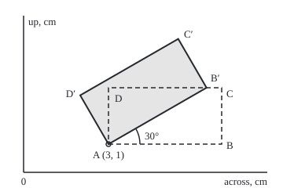

# Moving shapes with matrices: rotate, reflect, scale and shift with one multiplication

Geometry and trig → Vectors in Space → Homogeneous coordinates → Moving shapes with matrices

---

## General Overview

A logo on a page is a rectangle 4 cm wide and 2 cm tall. Its lower-left corner, A, sits 3 cm across and 1 cm up from the page's corner: the point (3, 1). The designer wants it tilted 30° anticlockwise, pinned at A, the way a card turns under a thumb.

The other corners start at B (7, 1), C (7, 3) and D (3, 3). After the turn they sit at B′ (6.464102, 3), C′ (5.464102, 4.732051) and D′ (2, 2.732051); A stays. One table of numbers, multiplied into each corner, gives all of them.

A turn, a mirror and a resize each fit in a matrix, a grid of numbers that moves every point by one multiplication. A slide does not: a matrix always leaves the page corner (0, 0) where it was. One extra coordinate fixes that, and "slide A to the page corner, turn, slide back" becomes one matrix.

**Write each point with a third coordinate equal to 1, and every rotation, reflection, scaling and shift becomes a 3 × 3 matrix, so any chain of moves is one matrix product, applied right to left.**

**What kind of fact this is:** a method; the facts it rests on (a rotation keeps lengths and area, a mirror flips the area's sign) are theorems, proved on this card in Why it works.

### The picture: the logo before and after the turn

<p align="center"></p>

Drawn at 1 cm = 36 units, page corner at the lower left. Dashed: the logo before. Shaded: after the turn about A.

---

## The formula

Notation first. A point (x, y) gets a third coordinate, $w$, and is written as a column of three numbers, x, y and 1: these are **homogeneous coordinates** (homogeneous: every point carries the same extra entry). A direction, such as the logo's "up" arrow, gets 0 there instead. The four moves are these matrices:

$$R(\theta)=\begin{pmatrix}\cos\theta&-\sin\theta&0\\ \sin\theta&\cos\theta&0\\ 0&0&1\end{pmatrix}\qquad T(a,b)=\begin{pmatrix}1&0&a\\ 0&1&b\\ 0&0&1\end{pmatrix}$$

$$F=\begin{pmatrix}-1&0&0\\ 0&1&0\\ 0&0&1\end{pmatrix}\qquad S(k)=\begin{pmatrix}k&0&0\\ 0&k&0\\ 0&0&1\end{pmatrix}$$

**Read it aloud:** R turns by θ anticlockwise about the page corner; T slides a across and b up; F mirrors in the up-axis; S scales by k from the page corner.

Moves chain by multiplying, and the move made first sits on the right. Turning about the corner (p, q) instead of the page corner is three moves:

$$H = T(p,q)\;R(\theta)\;T(-p,-q)$$

**Read it aloud:** slide the pivot to the page corner, turn there, slide it back; the product H does all three at once.

For the logo, H's top two rows are `0.866025 -0.500000 0.901924` and `0.500000 0.866025 -1.366025`; its bottom row stays `0 0 1`.

| Symbol | Plain meaning | In our example | Push it up and the answer… |
| --- | --- | --- | --- |
| $x$, $y$, $r$, $\varphi$ | a point across and up, in cm; or its distance and angle (phi) from a centre | B is (7, 1): 4 cm from A, at 0° | the point starts further out |
| $\theta$ | the turning angle, anticlockwise (theta) | 30° | the logo tips further |
| $R$ | the rotation matrix | cos 30° = 0.866025, sin 30° = 0.5 | — |
| $T$, $a$, $b$ | the shift matrix; how far across and up it slides | slides of (−3, −1), then (3, 1) | every point moves the same distance |
| $F$, $S$, $k$ | the mirror and the scale matrices; the scale factor | k = 1.5 | the logo grows, area by k × k |
| $p$, $q$ | the pivot's coordinates | A = (3, 1) | the turn swings round a new pin |
| $H$ | the whole move as one matrix | rows above | — |
| $w$ | the third coordinate: 1 for a point, 0 for a direction | 1 for each corner | at 0 the shift column is ignored |

### When it holds

- **Axes at right angles, same unit both ways.** Pixels taller than wide stretch one axis, and the turn skews the logo.
- **Up is up.** On a screen that counts y downwards, the same matrix turns clockwise.
- **The angle in radians inside code.** Feeding the sine 30 sends B to (3.617006, −2.952126).
- **A 1 on every point.** A corner written with 0 acts as a direction and ignores every shift.
- **Bottom row `0 0 1`.** Any other bottom row makes a perspective map, which needs a division ([perspective-and-projective-coordinates](05-perspective-and-projective-coordinates.md)).

---

## Why it works

### Step 0: a matrix cannot move the origin, so give it a spare coordinate

Multiply any matrix into the zero vector and zero comes out. A slide by (a, b) must send (0, 0) to (a, b), so no 2 × 2 matrix can do it. Put a 1 under every point and the third column of T multiplies that 1: it adds a to x and b to y, whatever x and y are. The 1 is a handle the matrix can hold.

### Step 1: the rotation matrix comes from where the axis arrows go

A matrix's columns are where it sends the axis arrows (1, 0) and (0, 1) ([linear-maps-as-matrices](../../03-Algebra/04-Matrices/04-linear-maps-as-matrices.md)). Turn (1, 0) by θ: it lands on the unit circle at (cos θ, sin θ). Turn (0, 1), which already sits a quarter turn ahead: it lands at (−sin θ, cos θ). Those are the two columns of R.

Polar coordinates give the same matrix. A point at distance $r$ and angle $\varphi$ is (r cos φ, r sin φ); turning adds θ to the angle, and the addition formulas ([trig-identities](../03-Trigonometry/03-trig-identities.md)) expand the result to x cos θ − y sin θ and x sin θ + y cos θ. That is R times (x, y), and the code's second road.

F keeps y and negates x; S multiplies both by k. Each is read off from where the axis arrows go.

### Step 2: chaining moves is multiplying, first move on the right

Apply T(−p, −q), then R, then T(p, q). Matrix products can be regrouped without changing the answer, so the three steps equal one matrix, H.

Check A. The first slide sends (3, 1) to (0, 0), the turn leaves it there, the second slide returns it to (3, 1). The pin stays put. B, 4 cm from A at angle 0°, ends 4 cm from A at 30°, offset (3.464102, 2).

<details>
<summary>The algebra behind H</summary>

Multiply the three matrices. The top-left block stays cos θ, −sin θ, sin θ, cos θ. The third column becomes
p − p cos θ + q sin θ and q − p sin θ − q cos θ.
With p = 3, q = 1, θ = 30°, these are 0.901924 and −1.366025. They are exactly the slide that takes R's image of A, the point (2.098076, 2.366025), back to (3, 1).

</details>

### Step 3: what the move keeps

R's columns are each 1 long (cos^2θ + sin^2θ = 1) and at right angles (dot product −cos θ sin θ + sin θ cos θ = 0), so R keeps lengths; a shift cancels in any difference of two points. H keeps the sides at 4 cm and 2 cm.

Area follows the determinant of the top-left block ([cross-product-and-oriented-area](01-cross-product-and-oriented-area.md)): cos^2θ + sin^2θ = 1 for R, so 8 square cm stays 8 square cm. A move that keeps every distance, like R, F or H, is an **isometry**. For S(k) it is k × k: scaling by 1.5 gives 18 square cm. For F it is −1: the mirrored logo's corners run clockwise and its signed area reads −8 square cm.

<details>
<summary>Detailed proof: a rotation keeps every distance</summary>

Two points differ by (u, v). R sends that difference to (u cos θ − v sin θ, u sin θ + v cos θ). Square and add: the cross terms −2uv cos θ sin θ and +2uv sin θ cos θ cancel, and the rest groups as u^2(cos^2θ + sin^2θ) + v^2(sin^2θ + cos^2θ) = u^2 + v^2. The squared distance is unchanged. H adds one shift to both points, which cancels in the difference, so H keeps distances too.

</details>

In three dimensions the same construction uses 4 × 4 matrices, and the turns themselves are the subject of rotations-so3-and-quaternions.

---

## Worked numbers, by hand

Take each corner's offset from A, turn it, add A back: the three steps H performs.

| Step | Arithmetic | Value |
| --- | --- | --- |
| the turn's numbers | cos 30°, sin 30° | 0.866025, 0.5 |
| B's offset from A | (7 − 3, 1 − 1) | (4, 0) |
| turned | (4 × 0.866025, 4 × 0.5) | (3.464102, 2) |
| B′ | (3 + 3.464102, 1 + 2) | **(6.464102, 3)** |
| C's offset, turned | (4 × 0.866025 − 2 × 0.5, 4 × 0.5 + 2 × 0.866025) | (2.464102, 3.732051) |
| C′ | add (3, 1) | **(5.464102, 4.732051)** |
| D's offset, turned | (0 − 2 × 0.5, 0 + 2 × 0.866025) | (−1, 1.732051) |
| D′ | add (3, 1) | **(2, 2.732051)** |
| sides and area after | lengths A to B′, A to D′; 4 × 2 | 4 cm, 2 cm, 8 square cm |

The logo now leans 30° with its corner pinned at (3, 1), no larger and no smaller.

### What breaks if you drop a piece

| Mistake | Comes out at | What went wrong |
| --- | --- | --- |
| Turn about the page corner, no slides | A at (2.098076, 2.366025) | The pin moved: R turns about (0, 0) only |
| Slides multiplied in the wrong order | A at (1.196152, 3.732051) | The first move must sit on the right |
| 30 fed to the sine as radians | B at (3.617006, −2.952126) | 30 radians is nearly five whole turns |
| Signs of the sines swapped | B at (6.464102, −1) | That matrix turns 30° clockwise |

The code prints all four.

---

## Code, from first principles, and it actually runs

Two roads that share no step move the four corners. Road one builds H from three 3 × 3 matrices and multiplies it into each (x, y, 1). Road two forms no matrix: each corner's distance and angle from A, angle plus 30°, converted back. Then come the kept lengths and area, a second case (scale 1.5 and a mirror, both about A), the four mistakes and the figure's coordinates.

### Python

```python
# Moving shapes with matrices -- the check behind the card.  Standard library
# only.  A 4 cm by 2 cm logo, lower-left corner A at (3, 1) cm, turns 30
# degrees anticlockwise about A.  Road one: 3 x 3 matrices acting on (x, y, 1).
# Road two: each corner's distance and angle from A, angle plus 30, and back.
from math import cos, sin, atan2, hypot, radians

def mul(m, n):                       # 3 x 3 times 3 x 3, or times a column of 3
    if not isinstance(n[0], list):
        return [sum(m[i][k] * n[k] for k in range(3)) for i in range(3)]
    return [[sum(m[i][k] * n[k][j] for k in range(3)) for j in range(3)] for i in range(3)]
def shift(a, b): return [[1, 0, a], [0, 1, b], [0, 0, 1]]
def turn(t): return [[cos(t), -sin(t), 0], [sin(t), cos(t), 0], [0, 0, 1]]
def about_a(m): return mul(shift(3, 1), mul(m, shift(-3, -1)))
def area(pts):                       # shoelace: signed area, positive anticlockwise
    return sum(p[0] * q[1] - q[0] * p[1] for p, q in zip(pts, pts[1:] + pts[:1])) / 2
def move(m, pts): return [mul(m, [x, y, 1])[:2] for x, y in pts]
def pt(v): return f"({v[0]:.6f}, {v[1]:.6f})"

p, q, logo, names = 3, 1, [(3, 1), (7, 1), (7, 3), (3, 3)], "ABCD"
H = about_a(turn(radians(30)))
road1 = move(H, logo)
road2 = []
for x, y in logo:                    # polar about A: same distance, angle + 30
    r, ang = hypot(x - p, y - q), atan2(y - q, x - p) + radians(30)
    road2.append([p + r * cos(ang), q + r * sin(ang)])
print(f"cos 30 = {cos(radians(30)):.6f}, sin 30 = {sin(radians(30)):.6f}")
for i in range(2):
    print(f"H row {i + 1}: {H[i][0]:.6f} {H[i][1]:.6f} {H[i][2]:.6f}")
for n, (x, y), a, b in zip(names, logo, road1, road2):
    print(f"{n} ({x}, {y}) -> {pt(a)} by matrix, {pt(b)} by angle")
print("offsets from A after the turn: " + " ".join(f"{n} {pt((a[0] - p, a[1] - q))}" for n, a in zip(names[1:], road1[1:])))
d = lambda u, v: hypot(u[0] - v[0], u[1] - v[1])
print(f"after the turn: sides {d(road1[0], road1[1]):.6f} and {d(road1[0], road1[3]):.6f} cm, area {area(road1):.6f} cm^2")
up = mul(H, [0, 1, 0])
print(f"direction (0, 1, 0) -> ({up[0]:.6f}, {up[1]:.6f}, {abs(up[2]):.0f}): the shift never touches it")
big = move(about_a([[1.5, 0, 0], [0, 1.5, 0], [0, 0, 1]]), logo)
mir = move(about_a([[-1, 0, 0], [0, 1, 0], [0, 0, 1]]), logo)
print(f"scale 1.5 about A: C -> {pt(big[2])}, area {area(big):.6f} cm^2")
print(f"mirror in the line x = 3: B -> {pt(mir[1])}, signed area {area(mir):.6f} cm^2")
print(f"mistake, turn about (0, 0): A -> {pt(move(turn(radians(30)), logo)[0])}")
wrong = mul(shift(-3, -1), mul(turn(radians(30)), shift(3, 1)))
print(f"mistake, shifts in the wrong order: A -> {pt(move(wrong, logo)[0])}")
print(f"mistake, 30 read as radians: B -> {pt(move(about_a(turn(30)), logo)[1])}")
print(f"mistake, sine signs swapped: B -> {pt(move(about_a(turn(radians(-30))), logo)[1])}")
svg = [(30 + 36 * x, 220 - 36 * y) for x, y in road1]
print("figure, 1 cm = 36 units, " + " ".join(f"{n}' ({X:.2f}, {Y:.2f})" for n, (X, Y) in zip(names, svg)))
assert max(abs(a[k] - b[k]) for a, b in zip(road1, road2) for k in range(2)) < 1e-12
assert abs(road1[0][0] - p) < 1e-12 and abs(road1[0][1] - q) < 1e-12   # the pivot stays
assert abs(d(road1[0], road1[1]) - 4) < 1e-12 and abs(area(road1) - 4 * 2) < 1e-12
assert abs(area(big) - (4 * 1.5) * (2 * 1.5)) < 1e-12 and abs(area(mir) + 8) < 1e-12
print("ALL CHECKS PASS")
```

**Ran 2026-09-24 on macOS, Python 3.14.6, standard library only. All checks passed. Output, pasted from the run:**

```
cos 30 = 0.866025, sin 30 = 0.500000
H row 1: 0.866025 -0.500000 0.901924
H row 2: 0.500000 0.866025 -1.366025
A (3, 1) -> (3.000000, 1.000000) by matrix, (3.000000, 1.000000) by angle
B (7, 1) -> (6.464102, 3.000000) by matrix, (6.464102, 3.000000) by angle
C (7, 3) -> (5.464102, 4.732051) by matrix, (5.464102, 4.732051) by angle
D (3, 3) -> (2.000000, 2.732051) by matrix, (2.000000, 2.732051) by angle
offsets from A after the turn: B (3.464102, 2.000000) C (2.464102, 3.732051) D (-1.000000, 1.732051)
after the turn: sides 4.000000 and 2.000000 cm, area 8.000000 cm^2
direction (0, 1, 0) -> (-0.500000, 0.866025, 0): the shift never touches it
scale 1.5 about A: C -> (9.000000, 4.000000), area 18.000000 cm^2
mirror in the line x = 3: B -> (-1.000000, 1.000000), signed area -8.000000 cm^2
mistake, turn about (0, 0): A -> (2.098076, 2.366025)
mistake, shifts in the wrong order: A -> (1.196152, 3.732051)
mistake, 30 read as radians: B -> (3.617006, -2.952126)
mistake, sine signs swapped: B -> (6.464102, -1.000000)
figure, 1 cm = 36 units, A' (138.00, 184.00) B' (262.71, 112.00) C' (226.71, 49.65) D' (102.00, 121.65)
ALL CHECKS PASS
```

### Rust

Same numbers, same labels, built with `rustc --edition 2021 -O`.

```rust
// Moving shapes with matrices -- the same check as the Python, in Rust, std
// only.  A 4 cm by 2 cm logo, lower-left corner A at (3, 1) cm, turns 30
// degrees anticlockwise about A.  Road one: 3 x 3 matrices acting on (x, y, 1).
// Road two: each corner's distance and angle from A, angle plus 30, and back.
type M = [[f64; 3]; 3];

fn mul(m: &M, n: &M) -> M {
    let mut o = [[0.0; 3]; 3];
    for i in 0..3 { for j in 0..3 { for k in 0..3 { o[i][j] += m[i][k] * n[k][j]; } } }
    o
}
fn apply(m: &M, v: [f64; 3]) -> [f64; 3] {
    let mut o = [0.0; 3];
    for i in 0..3 { for k in 0..3 { o[i] += m[i][k] * v[k]; } }
    o
}
fn shift(a: f64, b: f64) -> M { [[1.0, 0.0, a], [0.0, 1.0, b], [0.0, 0.0, 1.0]] }
fn turn(t: f64) -> M { [[t.cos(), -t.sin(), 0.0], [t.sin(), t.cos(), 0.0], [0.0, 0.0, 1.0]] }
fn about_a(m: &M) -> M { mul(&shift(3.0, 1.0), &mul(m, &shift(-3.0, -1.0))) }
fn area(p: &[[f64; 2]]) -> f64 {          // shoelace: signed area, positive anticlockwise
    let n = p.len();
    (0..n).map(|i| p[i][0] * p[(i + 1) % n][1] - p[(i + 1) % n][0] * p[i][1]).sum::<f64>() / 2.0
}
fn mv(m: &M, pts: &[[f64; 2]]) -> Vec<[f64; 2]> {
    pts.iter().map(|&[x, y]| { let o = apply(m, [x, y, 1.0]); [o[0], o[1]] }).collect()
}
fn pt(v: [f64; 2]) -> String { format!("({:.6}, {:.6})", v[0], v[1]) }
fn d(u: [f64; 2], v: [f64; 2]) -> f64 { (u[0] - v[0]).hypot(u[1] - v[1]) }

fn main() {
    let (p, q, names) = (3.0_f64, 1.0_f64, ["A", "B", "C", "D"]);
    let logo = [[3.0, 1.0], [7.0, 1.0], [7.0, 3.0], [3.0, 3.0]];
    let r30 = 30.0_f64.to_radians();
    let h = about_a(&turn(r30));
    let road1 = mv(&h, &logo);
    let road2: Vec<[f64; 2]> = logo.iter().map(|&[x, y]| {  // polar about A: same distance, angle + 30
        let (r, ang) = ((x - p).hypot(y - q), (y - q).atan2(x - p) + r30);
        [p + r * ang.cos(), q + r * ang.sin()]
    }).collect();
    println!("cos 30 = {:.6}, sin 30 = {:.6}", r30.cos(), r30.sin());
    for i in 0..2 { println!("H row {}: {:.6} {:.6} {:.6}", i + 1, h[i][0], h[i][1], h[i][2]); }
    for i in 0..4 {
        println!("{} ({}, {}) -> {} by matrix, {} by angle", names[i], logo[i][0], logo[i][1], pt(road1[i]), pt(road2[i]));
    }
    let offs: Vec<String> = (1..4).map(|i| format!("{} {}", names[i], pt([road1[i][0] - p, road1[i][1] - q]))).collect();
    println!("offsets from A after the turn: {}", offs.join(" "));
    println!("after the turn: sides {:.6} and {:.6} cm, area {:.6} cm^2", d(road1[0], road1[1]), d(road1[0], road1[3]), area(&road1));
    let up = apply(&h, [0.0, 1.0, 0.0]);
    println!("direction (0, 1, 0) -> ({:.6}, {:.6}, {:.0}): the shift never touches it", up[0], up[1], up[2].abs());
    let big = mv(&about_a(&[[1.5, 0.0, 0.0], [0.0, 1.5, 0.0], [0.0, 0.0, 1.0]]), &logo);
    let mir = mv(&about_a(&[[-1.0, 0.0, 0.0], [0.0, 1.0, 0.0], [0.0, 0.0, 1.0]]), &logo);
    println!("scale 1.5 about A: C -> {}, area {:.6} cm^2", pt(big[2]), area(&big));
    println!("mirror in the line x = 3: B -> {}, signed area {:.6} cm^2", pt(mir[1]), area(&mir));
    println!("mistake, turn about (0, 0): A -> {}", pt(mv(&turn(r30), &logo)[0]));
    let wrong = mul(&shift(-3.0, -1.0), &mul(&turn(r30), &shift(3.0, 1.0)));
    println!("mistake, shifts in the wrong order: A -> {}", pt(mv(&wrong, &logo)[0]));
    println!("mistake, 30 read as radians: B -> {}", pt(mv(&about_a(&turn(30.0)), &logo)[1]));
    println!("mistake, sine signs swapped: B -> {}", pt(mv(&about_a(&turn(-r30)), &logo)[1]));
    let fig: Vec<String> = (0..4).map(|i| format!("{}' ({:.2}, {:.2})", names[i], 30.0 + 36.0 * road1[i][0], 220.0 - 36.0 * road1[i][1])).collect();
    println!("figure, 1 cm = 36 units, {}", fig.join(" "));
    let gap = (0..4).map(|i| (road1[i][0] - road2[i][0]).abs().max((road1[i][1] - road2[i][1]).abs())).fold(0.0, f64::max);
    assert!(gap < 1e-12);
    assert!((road1[0][0] - p).abs() < 1e-12 && (road1[0][1] - q).abs() < 1e-12); // the pivot stays
    assert!((d(road1[0], road1[1]) - 4.0).abs() < 1e-12 && (area(&road1) - 4.0 * 2.0).abs() < 1e-12);
    assert!((area(&big) - (4.0 * 1.5) * (2.0 * 1.5)).abs() < 1e-12 && (area(&mir) + 8.0).abs() < 1e-12);
    println!("ALL CHECKS PASS");
}
```

**Ran 2026-09-24 on macOS, rustc 1.98.1, no crates. All checks passed. Output, pasted from the run:**

```
cos 30 = 0.866025, sin 30 = 0.500000
H row 1: 0.866025 -0.500000 0.901924
H row 2: 0.500000 0.866025 -1.366025
A (3, 1) -> (3.000000, 1.000000) by matrix, (3.000000, 1.000000) by angle
B (7, 1) -> (6.464102, 3.000000) by matrix, (6.464102, 3.000000) by angle
C (7, 3) -> (5.464102, 4.732051) by matrix, (5.464102, 4.732051) by angle
D (3, 3) -> (2.000000, 2.732051) by matrix, (2.000000, 2.732051) by angle
offsets from A after the turn: B (3.464102, 2.000000) C (2.464102, 3.732051) D (-1.000000, 1.732051)
after the turn: sides 4.000000 and 2.000000 cm, area 8.000000 cm^2
direction (0, 1, 0) -> (-0.500000, 0.866025, 0): the shift never touches it
scale 1.5 about A: C -> (9.000000, 4.000000), area 18.000000 cm^2
mirror in the line x = 3: B -> (-1.000000, 1.000000), signed area -8.000000 cm^2
mistake, turn about (0, 0): A -> (2.098076, 2.366025)
mistake, shifts in the wrong order: A -> (1.196152, 3.732051)
mistake, 30 read as radians: B -> (3.617006, -2.952126)
mistake, sine signs swapped: B -> (6.464102, -1.000000)
figure, 1 cm = 36 units, A' (138.00, 184.00) B' (262.71, 112.00) C' (226.71, 49.65) D' (102.00, 121.65)
ALL CHECKS PASS
```

> [!TIP]
> **Try changing**
> - Guess first: in `about_a`, swap the two slides. A leaves its place and lands at (1.196152, 3.732051), the second mistake above; the pivot assert fails.
> - Guess first: in the line that builds H, turn by −30° instead of 30°. B lands at (6.464102, −1), off the bottom of the page, and road two no longer agrees with road one.
> - Guess first: in `move`, write 0 where the 1 goes. H then ignores its slides and turns A about the page corner, to (2.098076, 2.366025).

---

## The usual mistake

> [!warning]
> **Using R alone to turn a shape about its own corner.** R turns about the page corner (0, 0), wherever the logo is. It swings A from (3, 1) to (2.098076, 2.366025) and the logo drifts. The fix: slide the pivot to the origin, turn, slide back.
>
> - **A point written with 0 underneath.** It acts as a direction: the up arrow (0, 1, 0) turns to (−0.5, 0.866025, 0) and never shifts, right for an arrow, wrong for a corner.

---

## Where you meet it in real life

- **Graphics files.** An SVG file's `matrix(a b c d e f)` transform is H's top two rows read column by column; this logo's turn is `matrix(0.866025 0.5 -0.5 0.866025 0.901924 -1.366025)`. SVG counts y downwards, so on screen it turns clockwise.
- **Games, robot arms and drones.** A pose is a chain of matrices, shoulder to elbow to hand, multiplied into one; in space each is 4 × 4.
- **Tilings and patterns.** The turns and mirrors that map a wallpaper onto itself are these matrices ([symmetry-and-tilings](../06-Beyond%20Euclid/04-symmetry-and-tilings.md)).

> **Say it back**
> A turn, a mirror and a resize are matrices, but a slide is not, because a matrix cannot move the origin. Give every point a third coordinate of 1 and the slide becomes a matrix too. Moves chain by multiplication, first move on the right, so turning about a corner is slide, turn, slide back, all in one matrix. A turn keeps lengths and area, a mirror flips the area's sign, a scale by k multiplies area by k twice.

---

## What this builds on

- [cross-product-and-oriented-area](01-cross-product-and-oriented-area.md): signed area, whose sign is how a mirror shows up.
- [linear-maps-as-matrices](../../03-Algebra/04-Matrices/04-linear-maps-as-matrices.md): columns as the images of the axis arrows, and composition as a product with the first move on the right.

## Where this goes next

- [perspective-and-projective-coordinates](05-perspective-and-projective-coordinates.md): a bottom row other than `0 0 1`, and the division that makes far things small.
- [symmetry-and-tilings](../06-Beyond%20Euclid/04-symmetry-and-tilings.md): the moves that leave a pattern unchanged, and how they combine.
- spin-and-two-state-systems: rotation matrices acting on a quantum state instead of a logo.
- rotations-so3-and-quaternions: turns in three dimensions, and a four-number shortcut for chaining them.

---

## Sources

Verified 2026-09-24: every link below resolves to the publisher's page.

- James, Doug. "2D Geometric Transformations", Lecture 6, CS4620, Cornell University, 2009. [Lecture slides](https://www.cs.cornell.edu/courses/cs4620/2009fa/lectures/06transforms2d.pdf). Homogeneous coordinates, the four matrices, and composing them.
- Marschner, Steve, and Peter Shirley. *Fundamentals of Computer Graphics*, 5th ed. A K Peters/CRC Press, 2021. [Publisher page](https://www.routledge.com/Fundamentals-of-Computer-Graphics/Marschner-Shirley/p/book/9780367505035). The chapter on transformation matrices, from turns in the plane to homogeneous coordinates for shifts.
- Strang, Gilbert. *Introduction to Linear Algebra*, 6th ed. Wellesley-Cambridge Press, 2023. [Book page](https://math.mit.edu/~gs/linearalgebra/). Linear transformations and their matrices: the columns-as-images view Step 1 uses.
