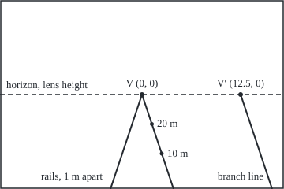

# Perspective: why parallel lines meet in a photograph, and the coordinates that make that legal

[Syllabus](../../../SYLLABUS.md) → [Geometry and trig](../../../SYLLABUS.md#w05) → [Vectors in Space](../../../SYLLABUS.md#w05-s05) → Perspective

---

## General Overview

A camera stands between the rails of a metre-gauge railway, level, 1.5 m up, pointing down the line. The rails stay 1 m apart. On the photo, through a 50 mm lens, the left rail sits 2.5 mm left of centre 10 m out, 1.25 mm left 20 m out; the right rail mirrors it. They close on one point of the horizon, the **vanishing point**, where parallel lines appear to meet.

Ordinary geometry says parallel lines never meet. Give every point one extra number, and let any multiple of the list name the same point: directions become points at infinity, and the rails genuinely meet at one. The camera carries it to a finite spot on the photo.

**Write a point as a list of numbers that may be scaled freely, and perspective is one matrix product and one division; parallel lines share a point at infinity, which the camera sends to the vanishing point.**

**What kind of fact this is:** a method; under it sits a theorem, that two distinct lines of the projective plane meet in exactly one point, proved on this card in Why it works.

### The picture: the photo, drawn from the numbers

<p align="center"></p>

Drawn at 1 mm = 10 units on a 36 mm by 24 mm sensor (the rectangle behind the lens that records the photo), centre (180, 120). The rails enter 6.25 m out and meet at V; a branch line, 1 m across per 4 m ahead, vanishes at V′. Dots: the right rail 10 m and 20 m out.

---

## The formula

Notation first. [Moving shapes with matrices](04-transformations-with-matrices.md) gave each point an extra coordinate, 1 for a point and 0 for a direction. Now any nonzero multiple names the same point: $(s, t, w)$ and $(\lambda s, \lambda t, \lambda w)$ are one point, written $(s : t : w)$. These are **homogeneous coordinates**; all such points together make the **projective plane**.

A camera with its lens at the origin, looking along the $Z$ axis, takes a scene point $(X, Y, Z)$ to the sensor:

$$\begin{pmatrix}s\\ t\\ w\end{pmatrix}=\begin{pmatrix}f&0&0&0\\ 0&f&0&0\\ 0&0&1&0\end{pmatrix}\begin{pmatrix}X\\ Y\\ Z\\ 1\end{pmatrix},\qquad u=\frac{s}{w}=\frac{fX}{Z},\quad v=\frac{t}{w}=\frac{fY}{Z}$$

**Read it aloud:** multiply by the camera matrix, then divide by the last entry; dividing by distance is the whole of perspective.

A photo line $au + bv + c = 0$ is stored as the triple $\ell = (a, b, c)$; a point $p$ lies on it when the dot product $\ell \cdot p$ is zero. Joining and meeting are cross products ([Cross product](01-cross-product-and-oriented-area.md)):

$$\ell = p_1 \times p_2,\qquad p = \ell_1 \times \ell_2,\qquad \text{vanishing point of direction } d:\ P\begin{pmatrix}d_X\\ d_Y\\ d_Z\\ 0\end{pmatrix}=\begin{pmatrix}f d_X\\ f d_Y\\ d_Z\end{pmatrix}$$

**Read it aloud:** the line through two points is their cross product, the point on two lines is theirs, and a direction, last entry 0, goes through the camera like any point.

| Symbol | Plain meaning | In our example | Push it up and the answer… |
| --- | --- | --- | --- |
| $X$, $Y$, $Z$ | a scene point, metres right, up from the lens, ahead | left rail, 10 m: (−0.5, −1.5, 10) | larger $Z$: nearer V |
| $h$ | lens height; the ground is $Y = -h$ | 1.5 m | rails steeper; V stays |
| $f$ | focal length, lens to sensor, mm | 50 mm | the picture spreads out |
| $u$, $v$ | sensor position, mm right of and above centre | left rail 10 m out: (−2.5, −7.5) | — |
| $s$, $t$, $w$, $\lambda$ | a photo point's homogeneous triple; $\lambda$ a nonzero scale | (−25, −75, 10); λ = 1/10 gives (−2.5, −7.5, 1) | changing λ changes nothing |
| $P$, $G$ | camera matrix, 3 by 4; ground-to-photo matrix, 3 by 3 | $f$ = 50 on the diagonal; $G$ in Step 4 | — |
| $d$ | the direction parallel lines share | rails (0, 0, 1); branch line (1, 0, 4) | V slides along the horizon |
| $\ell$, $\ell_1$, $\ell_2$, $a$, $b$, $c$, $p$ | a photo line as a triple; $p$ a photo point | left rail's image: (−3.75, 1.25, 0) | — |

### When it holds

- **A pinhole camera.** Real lenses bow straight lines near the frame's edge, and the cross products miss slightly.
- **A level camera, for the horizon claim.** Tilted down, the horizon rises above the centre; the method still holds.
- **A direction not parallel to the sensor.** If $d_Z = 0$, lines across the view stay parallel on the photo.
- **Points in front of the lens, $Z > 0$.** At $Z = 0$ the division fails; behind the lens the formula still gives a spot that no camera records.
- **Never (0, 0, 0).** It names no point.

---

## Why it works

### Step 0: a photograph records rays, not distances

Every point on one ray through the lens lands on the same spot. The left rail 10 m out, (−0.5, −1.5, 10), goes to (−25, −75, 10); the point twice as far along its ray, (−1, −3, 20), to (−50, −150, 20). Both divide to (−2.5, −7.5). A spot on a photo is a ray, three numbers up to scale. A negative multiple turns the ray round and names the same point, so the projective plane is the set of whole lines through the lens; the photo is one flat slice, and rays parallel to the sensor, with $w = 0$, miss it.

### Step 1: similar triangles give the division

From the side, the image sits on a small right triangle with legs $f$ and $v$, the scene point on a large one with legs $Z$ and $Y$, sharing the angle at the lens. So $v / f = Y / Z$, and likewise $u / f = X / Z$: the matrix's division.

### Step 2: parallel lines share one point at infinity

The left rail's points are (−0.5, −1.5, k, 1) for distance k. Dividing by k names the same point, (−0.5/k, −1.5/k, 1, 1/k), which comes ever closer to (0, 0, 1, 0), the rails' direction with last entry 0. The right rail heads for the same list: only the direction survives. On the photo the left rail sits at u = −0.25 mm 100 m out, −0.025 mm at 1,000 m, −0.000025 mm at 1,000,000 m.

So the rails share the point (0 : 0 : 1 : 0), the same rule in space with four numbers, as legal as any other; the camera sends it to (0, 0, 1), the photo's centre.

### Step 3: two lines meet in exactly one point, found by a cross product

The left rail's image passes through (−2.5, −7.5, 1) and (−1.25, −3.75, 1). Their cross product, (−3.75, 1.25, 0), is at right angles to both, so both lie on it: v = 3u. The right rail gives (−3.75, −1.25, 0), v = −3u. Crossing the two lines gives (0, 0, 9.375), which divides to (0, 0): Step 2's point, by a road that never used the direction.

Parallel photo lines u = 1 and u = 2, stored as (1, 0, −1) and (1, 0, −2), meet at (0, 1, 0): a point at infinity, not a failure.

<details>
<summary>Detailed proof: two distinct lines meet in exactly one point</summary>

Let $\ell_1$ and $\ell_2$ be triples, neither a multiple of the other. A point on both solves $\ell_1 \cdot p = 0$ and $\ell_2 \cdot p = 0$.

**Existence.** Put $p = \ell_1 \times \ell_2$. Then $\ell_1 \cdot (\ell_1 \times \ell_2)$ is a determinant with two equal rows, so it is 0 ([Triple product](03-triple-product-and-volume.md)); likewise for $\ell_2$. Its length is the area of the parallelogram on the two triples, zero only when one is a multiple of the other, so $p$ is not (0, 0, 0).

**Uniqueness.** Two independent equations in three unknowns leave one free choice: every solution is a multiple of one, and all multiples name one point.

**Dually**, two distinct points lie on exactly one line. The ordinary plane's exception, parallel lines, is gone.

</details>

### Step 4: the ground, made legal, and the horizon

On the ground, $X$ across and $Z$ ahead, the rails X = −0.5 and X = 0.5 are the triples (1, 0, 0.5) and (1, 0, −0.5). Their cross product is (0, 1, 0), the ground's point at infinity straight ahead: the rails meet on the ground itself.

Ground points have $Y = -h$, so the camera shrinks to a 3 by 3 map $G$ from ground triples $(X : Z : w)$ to the photo, rows `(50, 0, 0)`, `(0, 0, −75)`, `(0, 1, 0)` (the −75 is −f times h). It sends (0, 1, 0) to (0, 0, 1), the centre: a third route to V.

A level direction $(d_X : d_Z : 0)$ goes to $(f d_X, 0, d_Z)$: every one vanishes on the line v = 0, at lens height. The branch line's goes to (50, 0, 4), the point (12.5, 0). The line through both vanishing points is (0, 0, 1) × (12.5, 0, 1) = (0, 12.5, 0), again v = 0: the **horizon**, image of the ground's line at infinity.

---

## Worked numbers, by hand

| Step | Arithmetic | Value |
| --- | --- | --- |
| left rail, 10 m and 20 m | $P$ times (−0.5, −1.5, 10, 1) = (−25, −75, 10), over 10; then −25/20, −75/20 | (−2.5, −7.5), (−1.25, −3.75) |
| left rail's image line | (−2.5, −7.5, 1) × (−1.25, −3.75, 1) | (−3.75, 1.25, 0) |
| right rail's image line | (2.5, −7.5, 1) × (1.25, −3.75, 1) | (−3.75, −1.25, 0) |
| road 1: meet the lines | last slot (−3.75)(−1.25) − (1.25)(−3.75) | (0, 0, 9.375) → **(0, 0)** |
| road 2: the direction | $P$ times (0, 0, 1, 0) | (0, 0, 1) → **(0, 0)** |
| road 3: the ground | $G$ times (0, 1, 0), the rails' ground meet | (0, 0, 1) → **(0, 0)** |
| branch line | $P$ times (1, 0, 4, 0) = (50, 0, 4) | **(12.5, 0)** |
| horizon | (0, 0, 1) × (12.5, 0, 1) | (0, 12.5, 0): v = 0 |

The rails vanish at the photo's centre; every level direction vanishes on the horizon through it.

### What breaks if you drop a piece

| Mistake | Comes out at | What went wrong |
| --- | --- | --- |
| Skip the divide | left rail at u = −25 mm, 10 m and 20 m out | No division by distance: the rails never meet |
| Photo midpoint as ground midpoint | v = −5.625, not −5, for the sleeper 15 m out | Perspective keeps lines, not midpoints |
| Joining (2.5, −7.5, 1) to (5, −15, 2) | (0, 0, 0), no line | They are one point |

The code prints all three.

---

## Code, from first principles, and it actually runs

Nothing is imported. Three roads sharing no step reach the vanishing point: the meet of the rails' image lines, the camera matrix on their direction, and $G$ on their ground meet. A march along the left rail closes on it. The branch line is found from its direction and from its rails' image lines.

### Python

```python
# Perspective and projective coordinates -- the check behind the card.  Nothing
# imported.  A camera, lens 1.5 m above the ground, looks level along a track
# whose rails run at X = -0.5 and 0.5 m.  Focal length 50 mm.  Three roads to the
# vanishing point: meet the rails' image lines, project their shared direction,
# and send the rails' meeting point on the ground through a ground-to-photo map.
F, H = 50.0, 1.5
P = [[F, 0, 0, 0], [0, F, 0, 0], [0, 0, 1, 0]]          # camera matrix, 3 x 4
G = [[F, 0, 0], [0, 0, -F * H], [0, 1, 0]]              # ground (x, z, w) to photo

def apply(m, v): return [sum(r[i] * v[i] for i in range(len(v))) for r in m]
def cross(a, b): return [a[1]*b[2] - a[2]*b[1], a[2]*b[0] - a[0]*b[2], a[0]*b[1] - a[1]*b[0]]
def photo(q): return [q[0] / q[2], q[1] / q[2]]           # divide by the last entry
def shot(x, z): return apply(P, [x, -H, z, 1])            # a ground point, X across, Z ahead
def pt(x, z): return photo(shot(x, z)) + [1.0]            # its image as (u, v, 1)
def line(x0, x1, z0, z1): return cross(pt(x0, z0), pt(x1, z1))
def num(x):
    s = f"{x:.6f}".rstrip("0").rstrip(".")
    return "0" if s == "-0" else s
def tri(v): return "(" + ", ".join(num(x) for x in v) + ")"
def close(a, b): return all(abs(p - q) < 1e-9 for p, q in zip(a, b))

print(f"camera: f = {num(F)} mm, lens {num(H)} m above the ground, rails at X = -0.5 and 0.5 m, sensor 36 x 24 mm")
print(f"left rail at 10 m: {tri(shot(-0.5, 10))} -> {tri(photo(shot(-0.5, 10)))}; twice as far along "
      f"its ray, {tri(apply(P, [-1, -3, 20, 1]))} -> {tri(photo(apply(P, [-1, -3, 20, 1])))}")
print(f"left rail at 20 m -> {tri(pt(-0.5, 20)[:2])}; right rail at 10 m -> "
      f"{tri(pt(0.5, 10)[:2])}, at 20 m -> {tri(pt(0.5, 20)[:2])}")
left, right = line(-0.5, -0.5, 10, 20), line(0.5, 0.5, 10, 20)
print(f"image lines: left {tri(left)}, right {tri(right)}")
road1 = cross(left, right)
print(f"road 1, meet of the image lines: {tri(road1)} -> {tri(photo(road1))}")
print(f"photo lines u = 1 and u = 2 meet at {tri(cross([1, 0, -1], [1, 0, -2]))}: at infinity")
road2 = apply(P, [0, 0, 1, 0])
print(f"road 2, camera matrix on the direction (0, 0, 1, 0): {tri(road2)} -> {tri(photo(road2))}")
ground = cross([1, 0, 0.5], [1, 0, -0.5])              # X = -0.5 and X = 0.5 on the ground
road3 = apply(G, ground)
print(f"road 3, rails meet on the ground at {tri(ground)}; ground-to-photo sends it to {tri(road3)} -> {tri(photo(road3))}")
far = [photo(shot(-0.5, z))[0] for z in (100, 1000, 1000000)]
print(f"left rail farther out, u at 100, 1000 and 1000000 m: {' '.join(num(u) for u in far)}")
branch_hom = apply(P, [1, 0, 4, 0])
branch_dir = photo(branch_hom)                          # 1 m across for every 4 m ahead
branch_meet = photo(cross(line(2.5, 4.5, 8, 16), line(3.5, 5.5, 8, 16)))
print(f"branch line, camera matrix on the direction (1, 0, 4, 0): {tri(branch_hom)} -> {tri(branch_dir)}")
print(f"branch line, meet of its two rails' image lines -> {tri(branch_meet)}")
print(f"horizon, the line through both vanishing points: {tri(cross(photo(road2) + [1], branch_dir + [1]))}")
print(f"mistake, no divide: left rail u = {num(F * -0.5)} at 10 m and at 20 m, so the rails never meet")
print(f"mistake, midpoints: the sleeper at 15 m sits at v = {num(pt(0, 15)[1])}; halfway on the photo "
      f"between 10 m and 20 m is v = {num((pt(0, 10)[1] + pt(0, 20)[1]) / 2)}")
print(f"mistake, joining (2.5, -7.5, 1) to (5, -15, 2): {tri(cross([2.5, -7.5, 1], [5, -15, 2]))}, no line")
fig = lambda q: f"({num(180 + 10 * q[0])}, {num(120 - 10 * q[1])})"
print(f"figure, 1 mm = 10 units: V {fig(photo(road1))} V' {fig(branch_dir)} rails enter 6.25 m out at {fig(pt(-0.5, 6.25))} "
      f"{fig(pt(0.5, 6.25))} branch from {fig(pt(2.0625, 6.25))} marks at 10 m {fig(pt(0.5, 10))} 20 m {fig(pt(0.5, 20))}")
assert close(photo(shot(-0.5, 10)), [F * -0.5 / 10, F * -H / 10])   # matrix = u = fX/Z, v = fY/Z
assert close(photo(road1), photo(road2)) and ground[2] == 0 and close(photo(road3), photo(road1))
assert close(branch_meet, branch_dir) and abs(branch_dir[1]) < 1e-12
assert abs(far[2]) < 1e-4 and abs(far[2]) < abs(far[1]) < abs(far[0])
print("ALL CHECKS PASS")
```

**Ran 2026-09-24 on macOS, Python 3.14.6, standard library only. All checks passed. Output, pasted from the run:**

```
camera: f = 50 mm, lens 1.5 m above the ground, rails at X = -0.5 and 0.5 m, sensor 36 x 24 mm
left rail at 10 m: (-25, -75, 10) -> (-2.5, -7.5); twice as far along its ray, (-50, -150, 20) -> (-2.5, -7.5)
left rail at 20 m -> (-1.25, -3.75); right rail at 10 m -> (2.5, -7.5), at 20 m -> (1.25, -3.75)
image lines: left (-3.75, 1.25, 0), right (-3.75, -1.25, 0)
road 1, meet of the image lines: (0, 0, 9.375) -> (0, 0)
photo lines u = 1 and u = 2 meet at (0, 1, 0): at infinity
road 2, camera matrix on the direction (0, 0, 1, 0): (0, 0, 1) -> (0, 0)
road 3, rails meet on the ground at (0, 1, 0); ground-to-photo sends it to (0, 0, 1) -> (0, 0)
left rail farther out, u at 100, 1000 and 1000000 m: -0.25 -0.025 -0.000025
branch line, camera matrix on the direction (1, 0, 4, 0): (50, 0, 4) -> (12.5, 0)
branch line, meet of its two rails' image lines -> (12.5, 0)
horizon, the line through both vanishing points: (0, 12.5, 0)
mistake, no divide: left rail u = -25 at 10 m and at 20 m, so the rails never meet
mistake, midpoints: the sleeper at 15 m sits at v = -5; halfway on the photo between 10 m and 20 m is v = -5.625
mistake, joining (2.5, -7.5, 1) to (5, -15, 2): (0, 0, 0), no line
figure, 1 mm = 10 units: V (180, 120) V' (305, 120) rails enter 6.25 m out at (140, 240) (220, 240) branch from (345, 240) marks at 10 m (205, 195) 20 m (192.5, 157.5)
ALL CHECKS PASS
```

### Rust

Same numbers, same labels, built with `rustc --edition 2021 -O`.

```rust
// Perspective and projective coordinates -- the same check as the Python, in
// Rust, std only.  A camera, lens 1.5 m above the ground, looks level along a
// track whose rails run at X = -0.5 and 0.5 m.  Focal length 50 mm.  Three roads
// to the vanishing point: meet the rails' image lines, project their shared
// direction, and send the rails' meeting point on the ground through a map.
const F: f64 = 50.0;
const H: f64 = 1.5;
const P: [[f64; 4]; 3] = [[F, 0.0, 0.0, 0.0], [0.0, F, 0.0, 0.0], [0.0, 0.0, 1.0, 0.0]];
const G: [[f64; 3]; 3] = [[F, 0.0, 0.0], [0.0, 0.0, -F * H], [0.0, 1.0, 0.0]];

fn apply<const N: usize>(m: &[[f64; N]; 3], v: [f64; N]) -> [f64; 3] {
    let mut out = [0.0; 3];
    for r in 0..3 { for i in 0..N { out[r] += m[r][i] * v[i] } }
    out
}
fn cross(a: [f64; 3], b: [f64; 3]) -> [f64; 3] {
    [a[1] * b[2] - a[2] * b[1], a[2] * b[0] - a[0] * b[2], a[0] * b[1] - a[1] * b[0]]
}
fn photo(q: [f64; 3]) -> [f64; 2] { [q[0] / q[2], q[1] / q[2]] }   // divide by the last entry
fn shot(x: f64, z: f64) -> [f64; 3] { apply(&P, [x, -H, z, 1.0]) } // X across, Z ahead
fn pt(x: f64, z: f64) -> [f64; 3] { let p = photo(shot(x, z)); [p[0], p[1], 1.0] }
fn line(x0: f64, x1: f64, z0: f64, z1: f64) -> [f64; 3] { cross(pt(x0, z0), pt(x1, z1)) }
fn num(x: f64) -> String {
    let s = format!("{:.6}", x);
    let s = s.trim_end_matches('0').trim_end_matches('.');
    if s == "-0" { "0".to_string() } else { s.to_string() }
}
fn tri(v: &[f64]) -> String { format!("({})", v.iter().map(|&x| num(x)).collect::<Vec<_>>().join(", ")) }
fn close(a: [f64; 2], b: [f64; 2]) -> bool { (a[0] - b[0]).abs() < 1e-9 && (a[1] - b[1]).abs() < 1e-9 }
fn fig(q: [f64; 2]) -> String { format!("({}, {})", num(180.0 + 10.0 * q[0]), num(120.0 - 10.0 * q[1])) }
fn two(q: [f64; 3]) -> [f64; 2] { [q[0], q[1]] }

fn main() {
    println!("camera: f = {} mm, lens {} m above the ground, rails at X = -0.5 and 0.5 m, sensor 36 x 24 mm", num(F), num(H));
    let ray = apply(&P, [-1.0, -3.0, 20.0, 1.0]);
    println!("left rail at 10 m: {} -> {}; twice as far along its ray, {} -> {}",
             tri(&shot(-0.5, 10.0)), tri(&photo(shot(-0.5, 10.0))), tri(&ray), tri(&photo(ray)));
    println!("left rail at 20 m -> {}; right rail at 10 m -> {}, at 20 m -> {}",
             tri(&pt(-0.5, 20.0)[..2]), tri(&pt(0.5, 10.0)[..2]), tri(&pt(0.5, 20.0)[..2]));
    let (left, right) = (line(-0.5, -0.5, 10.0, 20.0), line(0.5, 0.5, 10.0, 20.0));
    println!("image lines: left {}, right {}", tri(&left), tri(&right));
    let road1 = cross(left, right);
    println!("road 1, meet of the image lines: {} -> {}", tri(&road1), tri(&photo(road1)));
    println!("photo lines u = 1 and u = 2 meet at {}: at infinity", tri(&cross([1.0, 0.0, -1.0], [1.0, 0.0, -2.0])));
    let road2 = apply(&P, [0.0, 0.0, 1.0, 0.0]);
    println!("road 2, camera matrix on the direction (0, 0, 1, 0): {} -> {}", tri(&road2), tri(&photo(road2)));
    let ground = cross([1.0, 0.0, 0.5], [1.0, 0.0, -0.5]);     // X = -0.5 and X = 0.5 on the ground
    let road3 = apply(&G, ground);
    println!("road 3, rails meet on the ground at {}; ground-to-photo sends it to {} -> {}",
             tri(&ground), tri(&road3), tri(&photo(road3)));
    let far: Vec<f64> = [100.0, 1000.0, 1000000.0].iter().map(|&z| photo(shot(-0.5, z))[0]).collect();
    println!("left rail farther out, u at 100, 1000 and 1000000 m: {}",
             far.iter().map(|&u| num(u)).collect::<Vec<_>>().join(" "));
    let branch_hom = apply(&P, [1.0, 0.0, 4.0, 0.0]);
    let branch_dir = photo(branch_hom);                  // 1 m across for every 4 m ahead
    let branch_meet = photo(cross(line(2.5, 4.5, 8.0, 16.0), line(3.5, 5.5, 8.0, 16.0)));
    println!("branch line, camera matrix on the direction (1, 0, 4, 0): {} -> {}", tri(&branch_hom), tri(&branch_dir));
    println!("branch line, meet of its two rails' image lines -> {}", tri(&branch_meet));
    let v1 = photo(road2);
    println!("horizon, the line through both vanishing points: {}",
             tri(&cross([v1[0], v1[1], 1.0], [branch_dir[0], branch_dir[1], 1.0])));
    println!("mistake, no divide: left rail u = {} at 10 m and at 20 m, so the rails never meet", num(F * -0.5));
    println!("mistake, midpoints: the sleeper at 15 m sits at v = {}; halfway on the photo between 10 m and 20 m is v = {}",
             num(pt(0.0, 15.0)[1]), num((pt(0.0, 10.0)[1] + pt(0.0, 20.0)[1]) / 2.0));
    println!("mistake, joining (2.5, -7.5, 1) to (5, -15, 2): {}, no line",
             tri(&cross([2.5, -7.5, 1.0], [5.0, -15.0, 2.0])));
    println!("figure, 1 mm = 10 units: V {} V' {} rails enter 6.25 m out at {} {} branch from {} marks at 10 m {} 20 m {}",
             fig(photo(road1)), fig(branch_dir), fig(two(pt(-0.5, 6.25))), fig(two(pt(0.5, 6.25))),
             fig(two(pt(2.0625, 6.25))), fig(two(pt(0.5, 10.0))), fig(two(pt(0.5, 20.0))));
    assert!(close(photo(shot(-0.5, 10.0)), [F * -0.5 / 10.0, F * -H / 10.0])); // matrix = u = fX/Z, v = fY/Z
    assert!(close(photo(road1), photo(road2)) && ground[2] == 0.0 && close(photo(road3), photo(road1)));
    assert!(close(branch_meet, branch_dir) && branch_dir[1].abs() < 1e-12);
    assert!(far[2].abs() < 1e-4 && far[2].abs() < far[1].abs() && far[1].abs() < far[0].abs());
    println!("ALL CHECKS PASS");
}
```

**Ran 2026-09-24 on macOS, rustc 1.98.1, no crates. All checks passed. Output, pasted from the run:**

```
camera: f = 50 mm, lens 1.5 m above the ground, rails at X = -0.5 and 0.5 m, sensor 36 x 24 mm
left rail at 10 m: (-25, -75, 10) -> (-2.5, -7.5); twice as far along its ray, (-50, -150, 20) -> (-2.5, -7.5)
left rail at 20 m -> (-1.25, -3.75); right rail at 10 m -> (2.5, -7.5), at 20 m -> (1.25, -3.75)
image lines: left (-3.75, 1.25, 0), right (-3.75, -1.25, 0)
road 1, meet of the image lines: (0, 0, 9.375) -> (0, 0)
photo lines u = 1 and u = 2 meet at (0, 1, 0): at infinity
road 2, camera matrix on the direction (0, 0, 1, 0): (0, 0, 1) -> (0, 0)
road 3, rails meet on the ground at (0, 1, 0); ground-to-photo sends it to (0, 0, 1) -> (0, 0)
left rail farther out, u at 100, 1000 and 1000000 m: -0.25 -0.025 -0.000025
branch line, camera matrix on the direction (1, 0, 4, 0): (50, 0, 4) -> (12.5, 0)
branch line, meet of its two rails' image lines -> (12.5, 0)
horizon, the line through both vanishing points: (0, 12.5, 0)
mistake, no divide: left rail u = -25 at 10 m and at 20 m, so the rails never meet
mistake, midpoints: the sleeper at 15 m sits at v = -5; halfway on the photo between 10 m and 20 m is v = -5.625
mistake, joining (2.5, -7.5, 1) to (5, -15, 2): (0, 0, 0), no line
figure, 1 mm = 10 units: V (180, 120) V' (305, 120) rails enter 6.25 m out at (140, 240) (220, 240) branch from (345, 240) marks at 10 m (205, 195) 20 m (192.5, 157.5)
ALL CHECKS PASS
```

The two outputs match line for line.

> [!TIP]
> **Try changing**
> Guess first, then run it.
> - **Raise the camera.** Set `H` to `3.0`: the image lines steepen to v = ±6u; V stays put and every check passes.
> - **Swing the branch.** Change `[1, 0, 4, 0]` to `[1, 0, 2, 0]`: V′ moves to (25, 0), off the frame; the third assert stops the run, as the branch rails still run 1 in 4.
> - **Make the rails converge.** Change `[1, 0, -0.5]` to `[1, 0.1, -0.5]`: they cross 10 m ahead, the ground meet ends in 0.1, and the second assert stops the run.

---

## The usual mistake

> [!warning]
> **Reading the vanishing point as where the rails touch.** They never touch. V is the image of their shared direction, (0 : 0 : 1 : 0). At 1,000 m they are still 1 m apart, and the left rail's image is 0.025 mm short of V.

---

## Where you meet it in real life

- **Graphics cards.** A 3D game multiplies each corner by a 4 by 4 matrix and divides by the last entry, the perspective divide, after the moves of [Moving shapes with matrices](04-transformations-with-matrices.md).
- **Driver-assistance cameras.** Parallel lane markings vanish at one point, which tells the software how the camera tilts.

> **Say it back**
> A photograph records rays, so a point on it is three numbers that may be scaled freely. Taking the photo is a matrix product and a division by distance. Parallel rails share a direction, and with last entry 0 that direction is a genuine point where they meet. The camera sends it to the vanishing point; level directions land on the horizon. Any two lines meet in exactly one point, found by a cross product.

---

## What this builds on

- [Moving shapes with matrices](04-transformations-with-matrices.md): the extra coordinate, 1 for a point and 0 for a direction, and moves as matrix products.

## Where this goes next

- Projective space: projective space in any dimension, and shapes cut out by its equations.

Here the points at infinity came from a camera; whether projective space stands as a geometry on its own, with no favoured slice, is what a later card settles.

---

## Sources

Verified 2026-09-24: every link below resolves to the publisher's page.

- Hartley, Richard, and Andrew Zisserman. *Multiple View Geometry in Computer Vision*, 2nd ed. Cambridge University Press, 2004. [Publisher page](https://www.cambridge.org/core/books/multiple-view-geometry-in-computer-vision/0B6F289C78B2B23F596CAA76D3D43F7A). Camera matrix, joins and meets, vanishing points.
- Richter-Gebert, Jürgen. *Perspectives on Projective Geometry*. Springer, 2011. [Publisher page](https://link.springer.com/book/10.1007/978-3-642-17286-1). The projective plane from homogeneous coordinates, with proofs.
- Marschner, Steve, and Peter Shirley. *Fundamentals of Computer Graphics*, 5th ed. A K Peters/CRC Press, 2021. [Publisher page](https://www.routledge.com/Fundamentals-of-Computer-Graphics/Marschner-Shirley/p/book/9780367505035). The perspective matrix and divide in graphics.
