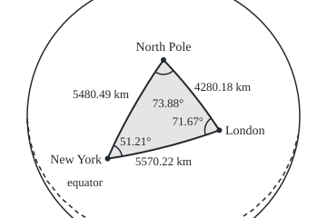

# Triangles on a sphere: angles add to more than 180 and the excess is the area

Geometry and trig → Beyond Euclid → Spherical trigonometry → Triangles on a sphere

---

## General Overview

London sits at 51.5074° north, 0.1278° west; New York at 40.7128° north, 74.0060° west. On a round Earth of radius 6371 km, the shortest surface route between them is 5570.22 km. It leaves London heading 71.67° west of north, though New York lies 10.79° of latitude further south.

It runs along a **great circle**: a circle on the sphere centred at the sphere's centre, such as the equator or a meridian. Join London, New York and the North Pole by great-circle pieces and the globe carries a triangle. Its corners are 71.67° at London, 51.21° at New York and 73.88° at the pole. They add to 196.76°.

The extra 16.76° is no error. It measures the ground enclosed: 11873957 km^2, 2.33% of the Earth's surface.

**On a sphere a side is an angle seen from the centre, the flat laws of cosines and sines have exact curved versions, and the angles overshoot 180° by an amount proportional to the area.**

**What kind of fact this is:** three theorems about an exact sphere, proved on this card in Why it works; the Earth as a sphere is a model, good to a fraction of a percent.

### The picture: the triangle on the globe

<p align="center"></p>

To scale, seen from far above the triangle's middle: the Earth's 6371 km radius is 150 units. The dashed curve is the equator. The sides look bent because the globe curves away.

---

## The formula

Notation first, in words. The corners are A (London), B (New York) and C (the pole), and each side takes the small letter of the corner it faces. A side is measured as a **central angle**: the angle at the sphere's centre between the arrows to its two ends. Its length on the surface is the radius times that angle in radians ([radians-arcs-and-sectors](../02-Circles%20and%20Solids/02-radians-arcs-and-sectors.md)):

$$s = R\,c$$

$$\cos c = \cos a\cos b + \sin a\sin b\cos C$$

**Read it aloud:** the third side's cosine is the other two sides' cosines multiplied, plus their sines multiplied times the cosine of the angle between them.

$$\frac{\sin A}{\sin a} = \frac{\sin B}{\sin b} = \frac{\sin C}{\sin c}$$

**Read it aloud:** each corner's sine over the sine of the side facing it gives one shared number.

$$K = R^2\,E, \qquad E = A + B + C - \pi$$

**Read it aloud:** the area is the radius squared times the excess, the amount by which the angles, in radians, overshoot π radians, which is 180°.

| Symbol | Plain meaning | In our example | Push it up and the answer… |
| --- | --- | --- | --- |
| $R$ | the sphere's radius | 6371 km | lengths grow, areas grow as its square |
| $a$, $b$ | sides from the pole to New York and to London: 90° minus the latitude | 49.2872° and 38.4926° (5480.49 km, 4280.18 km) | the route lengthens |
| $C$ | the angle at the pole: the gap in longitude | 73.8782° | the route lengthens |
| $c$ | the route's central angle | 50.094212° = 0.874309 rad | — |
| $s$ | the route's length on the surface | 5570.22 km | — |
| $A$, $B$ | the corner angles at London and New York | 71.67° and 51.21° | — |
| $E$ | the excess: angle sum minus 180°, in radians | 16.76° = 0.292537 rad | the area grows in step |
| $K$ | the area enclosed | 11873957 km^2 | — |

The pole makes the inputs easy to read off a map ([cylindrical-and-spherical-coordinates](../04-Coordinates%20and%20Curves/07-cylindrical-and-spherical-coordinates.md)); the laws hold for any corners.

### When it holds

- **An exact sphere.** The Earth bulges at the equator, so sphere distances are off by a fraction of a percent; surveyors use an ellipsoid, a flattened sphere.
- **Sides the short way round**, each under 180°. Opposite points have endless shortest routes.
- **Routes longer than a few metres.** For tiny c, cos c is so near 1 that rounding swamps it; software uses an equivalent form, the haversine formula.
- **Radians in the length and the area.** Degrees in K = R^2 E make the triangle outgrow the Earth.

---

## Why it works

### Step 0: a side is an angle at the centre

Arrows from the Earth's centre to London and New York meet at 50.094212°. The route is the arc they cut from a great circle: 6371 × 0.874309 = 5570.22 km, so each degree of central angle is 111.19 km. Backwards, a surface distance over the radius is a central angle. A spherical triangle is thus about three arrows from the centre, which the dot product handles.

### Step 1: the law of cosines, from one dot product

Turn the globe so C sits at the pole and A on longitude 0. On a sphere of radius 1 the arrows are C = (0, 0, 1), A = (sin b, 0, cos b) at colatitude b (90° minus latitude), and B = (sin a cos C, sin a sin C, cos a) at colatitude a and longitude C. The directions leaving the pole along those meridians are (1, 0, 0) and (cos C, sin C, 0), so the pole's corner is C.

The dot product of two unit arrows is the cosine of the angle between them, here side c:

cos c = sin b × sin a cos C + 0 + cos b × cos a.

That is the law, and any triangle can be turned to put a corner at the pole.

### Step 2: the law of sines, from one volume

The three arrows span a slanted box; its volume is the determinant of their coordinates ([triple-product-and-volume](../05-Vectors%20in%20Space/03-triple-product-and-volume.md)). Turning the globe does not change it. With C at the pole it works out to sin a sin b sin C; with A there, sin b sin c sin A; with B there, sin c sin a sin B. Divide each by sin a sin b sin c and the ratios agree: 1.252344 each here.

<details>
<summary>The algebra behind this</summary>

With C at the pole the rows are (0, 0, 1), (sin b, 0, cos b) and (sin a cos C, sin a sin C, cos a). Expanding along the first row leaves 1 times sin b × sin a sin C − 0 × sin a cos C, which is sin a sin b sin C. Putting A at the pole relabels C as A and the sides a, b as b, c.

</details>

### Step 3: the excess is the area

Two great circles through opposite points cut out a slice like an orange segment, a **lune**. A lune with corner angle A radians is the share A / 2π of the sphere, whose area is 4πR^2 ([pyramids-cones-and-spheres](../02-Circles%20and%20Solids/05-pyramids-cones-and-spheres.md)): 2AR^2.

Extend the sides to full great circles. At each corner take the lune holding the triangle, plus its twin on the far side of the globe. The six lunes cover the sphere once, except the triangle and its far-side mirror, each covered three times. Counting areas both ways gives K = R^2 (A + B + C − π).

<details>
<summary>Detailed proof</summary>

At corner A the two sides, extended, meet again at the point opposite A, bounding a lune of angle A that holds the triangle. Its twin holds the mirror: the points opposite the triangle's. The pair has area 4AR^2; likewise 4BR^2 and 4CR^2.

Each great circle splits the sphere into two halves. A point of the triangle lies in all three corner lunes; a point of the mirror, in all three twins. Any other point off the circles lies on the triangle's side of some circles and the far side of the rest. So exactly one pair of circles has it on the triangle's side of both, or the far side of both, and exactly one of the six lunes holds it.

So the lunes add to the sphere plus two extra copies each of the triangle and its mirror, both of area K: 4AR^2 + 4BR^2 + 4CR^2 = 4πR^2 + 4K. Divide by 4 and rearrange; the circles have no area. This is Albert Girard's theorem of 1629.

</details>

A check: the equator and two meridians 90° apart cut the sphere into eight equal **octants**, each with three 90° corners. The excess, π/2 radians, times R^2 is one eighth of 4πR^2: 63758059 km^2.

### Step 4: small triangles look flat

The excess is area over R^2. On a triangle a few kilometres across it is far too small to measure, so the angles add to 180° as far as anyone can tell ([triangle-angle-sum-and-inequality](../01-Angles%2C%20Triangles%20and%20Congruence/02-triangle-angle-sum-and-inequality.md)). Flat trigonometry is the small end of spherical trigonometry.

---

## Worked numbers, by hand

| Step | Arithmetic | Value |
| --- | --- | --- |
| side from the pole to London | 90 − 51.5074 | b = 38.4926° |
| side from the pole to New York | 90 − 40.7128 | a = 49.2872° |
| angle at the pole | 74.0060 − 0.1278 | C = 73.8782° |
| route's central angle | inverse cosine of cos a cos b + sin a sin b cos C | c = 50.094212° = 0.874309 rad |
| distance | 6371 × 0.874309 | **5570.22 km** |
| corner at London | cos A = (cos a − cos b cos c) / (sin b sin c) | A = 71.67° |
| corner at New York | the same with a and b swapped | B = 51.21° |
| excess | 71.67 + 51.21 + 73.88 − 180 | 16.76° = 0.292537 rad |
| area | 6371^2 × 0.292536647 (the excess to 9 places) | **11873957 km^2** |

### What breaks if you drop a piece

| Mistake | Comes out at | What went wrong |
| --- | --- | --- |
| Flat law of cosines on sides of 5480.49 and 4280.18 km | 5943.76 km | A flat triangle is another shape |
| Straight line between the two places | 5394.49 km | The chord: a tunnel |
| Angles taken to sum to 180° | 34.45° at New York | The true corner is 51.21° |
| Excess left in degrees in K = R^2 E | 680327650 km^2 | More than the whole Earth |

---

## Code, from first principles, and it actually runs

The code solves the London triangle and the octant by two roads each. The route: the cosine law, and the straight chord's length k, since on a unit sphere a chord of length k spans the central angle 2 × arcsin(k/2), arcsin being the inverse of sine. The corners: the rearranged cosine law, and the surface directions leaving each corner, compared by dot and cross products ([cross-product-and-oriented-area](../05-Vectors%20in%20Space/01-cross-product-and-oriented-area.md)). The area: Girard, and 262144 small flat triangles with corners on the sphere; each quartering shrinks their gap to Girard about fourfold.

### Python

```python
# Triangles on a sphere -- the check behind the card.  Standard library only.
# London, New York and the North Pole on a round Earth of radius 6371 km, then
# a second case, the octant.  Distance, corner angles and area: two roads each.
from math import sin, cos, acos, asin, atan2, sqrt, radians, degrees, pi
R = 6371.0
def dot(u, v): return sum(x * y for x, y in zip(u, v))
def cross(u, v): return [u[1]*v[2] - u[2]*v[1], u[2]*v[0] - u[0]*v[2], u[0]*v[1] - u[1]*v[0]]
def less(u, v, k=1.0): return [x - k * y for x, y in zip(u, v)]
def length(u): return sqrt(dot(u, u))
def unit(u): return [x / length(u) for x in u]
def point(lat, lon):                    # latitude, longitude in degrees -> unit arrow
    la, lo = radians(lat), radians(lon)
    return [cos(la) * cos(lo), cos(la) * sin(lo), sin(la)]
def corner(p, q, r):                    # road two to an angle: directions leaving p
    t, s = less(q, p, dot(p, q)), less(r, p, dot(p, r))
    return atan2(length(cross(t, s)), dot(t, s))
def flat_area(p, q, r, k):              # road two to the area: 4^k flat triangles
    if k == 0: return length(cross(less(q, p), less(r, p))) / 2
    m, n, o = unit(less(p, q, -1)), unit(less(q, r, -1)), unit(less(r, p, -1))
    return (flat_area(p, m, o, k-1) + flat_area(m, q, n, k-1)
            + flat_area(o, n, r, k-1) + flat_area(m, n, o, k-1))

def solve(lat1, lon1, lat2, lon2):      # A = first place, B = second, C = North Pole
    a, b, C = radians(90 - lat2), radians(90 - lat1), radians(abs(lon1 - lon2))
    c = acos(cos(a) * cos(b) + sin(a) * sin(b) * cos(C))       # road one: cosine law
    PA, PB, PC = point(lat1, lon1), point(lat2, lon2), [0.0, 0.0, 1.0]
    chord = length(less(PA, PB))                               # road two: straight chord
    A = acos((cos(a) - cos(b) * cos(c)) / (sin(b) * sin(c)))
    B = acos((cos(b) - cos(a) * cos(c)) / (sin(a) * sin(c)))
    tangents = [corner(PA, PB, PC), corner(PB, PC, PA), corner(PC, PA, PB)]
    girard = R * R * (A + B + C - pi)
    return a, b, C, c, 2 * asin(chord / 2), chord, [A, B, C], tangents, girard, R * R * flat_area(PA, PB, PC, 9), (PA, PB, PC)

d = lambda x: f"{degrees(x):.2f}"
a, b, C, c, c2, chord, ang, tan, girard, flat, pts = solve(51.5074, -0.1278, 40.7128, -74.0060)
ratios = [sin(ang[0]) / sin(a), sin(ang[1]) / sin(b), sin(C) / sin(c)]
print(f"sides to the pole: a (New York) {degrees(a):.4f} deg = {R * a:.2f} km, b (London) {degrees(b):.4f} deg = {R * b:.2f} km")
print(f"angle C at the pole {degrees(C):.4f} deg; route c by the cosine law {degrees(c):.6f} deg = {c:.6f} rad")
print(f"route c by the straight chord: {degrees(c2):.6f} deg (chord {R * chord:.2f} km)")
print(f"surface distance R x c = {R * c:.2f} km; 1 deg of central angle = {R * pi / 180:.2f} km")
print("corner angles A (London), B (New York), C, by the cosine law:", ", ".join(map(d, ang)))
print("the same corners, by tangent directions:", ", ".join(map(d, tan)))
print(f"sine law ratios: {ratios[0]:.6f}, {ratios[1]:.6f}, {ratios[2]:.6f}")
print(f"angle sum {d(sum(ang))} deg; excess {d(sum(ang) - pi)} deg = {sum(ang) - pi:.6f} rad")
print(f"area by Girard, R^2 x excess: {girard:.0f} km^2; by 262144 flat triangles: {flat:.0f} km^2")
print(f"share of Earth's surface ({4 * pi * R * R:.0f} km^2): {girard / (4 * pi * R * R):.2%}")
oa, ob, oC, oc, oc2, _, oang, otan, ogirard, oflat, _ = solve(0, 90, 0, 0)
print(f"octant: corners {', '.join(map(d, oang))}, sum {d(sum(oang))}; area {ogirard:.0f} km^2, flat triangles {oflat:.0f}, one eighth of 4 pi R^2 {pi * R * R / 2:.0f}")
flat_c = sqrt((R*a)**2 + (R*b)**2 - 2 * (R*a) * (R*b) * cos(C))
print(f"mistakes: flat law of cosines {flat_c:.2f} km; flat 180 deg at New York {d(pi - ang[0] - C)}; "
      f"excess left in degrees {R * R * degrees(sum(ang) - pi):.0f} km^2")
V = unit([x + y + z for x, y, z in zip(*pts)])
up = unit(less([0, 0, 1], V, V[2])); right = cross(up, V)
fig = [f"{180 + 150 * dot(p, right):.1f},{128 - 150 * dot(p, up):.1f}" for p in pts]
print(f"figure, 150 units = 6371 km: London {fig[0]}, New York {fig[1]}, pole {fig[2]}")
assert abs(c - c2) < 1e-12 and abs(oc - oc2) < 1e-12           # cosine law = chord road
assert max(abs(x - y) for x, y in zip(ang + oang, tan + otan)) < 1e-9   # two roads to corners
assert max(ratios) - min(ratios) < 1e-12                       # the sine law holds
assert abs(flat / girard - 1) < 1e-5 and abs(oflat / (pi * R * R / 2) - 1) < 1e-5
print("ALL CHECKS PASS")
```

**Ran 2026-09-24 on macOS, Python 3.14.6, standard library only. All checks passed. Output, pasted from the run:**

```
sides to the pole: a (New York) 49.2872 deg = 5480.49 km, b (London) 38.4926 deg = 4280.18 km
angle C at the pole 73.8782 deg; route c by the cosine law 50.094212 deg = 0.874309 rad
route c by the straight chord: 50.094212 deg (chord 5394.49 km)
surface distance R x c = 5570.22 km; 1 deg of central angle = 111.19 km
corner angles A (London), B (New York), C, by the cosine law: 71.67, 51.21, 73.88
the same corners, by tangent directions: 71.67, 51.21, 73.88
sine law ratios: 1.252344, 1.252344, 1.252344
angle sum 196.76 deg; excess 16.76 deg = 0.292537 rad
area by Girard, R^2 x excess: 11873957 km^2; by 262144 flat triangles: 11873951 km^2
share of Earth's surface (510064472 km^2): 2.33%
octant: corners 90.00, 90.00, 90.00, sum 270.00; area 63758059 km^2, flat triangles 63757861, one eighth of 4 pi R^2 63758059
mistakes: flat law of cosines 5943.76 km; flat 180 deg at New York 34.45; excess left in degrees 680327650 km^2
figure, 150 units = 6371 km: London 241.5,143.4, New York 118.5,174.6, pole 180.0,66.0
ALL CHECKS PASS
```

### Rust

```rust
// Triangles on a sphere -- the same check as the Python, in Rust.  No crates.
// London, New York and the North Pole on a round Earth of radius 6371 km, then
// a second case, the octant.  Distance, corner angles and area: two roads each.
use std::f64::consts::PI;
const R: f64 = 6371.0;
type V = [f64; 3];
fn dot(u: V, v: V) -> f64 { u[0] * v[0] + u[1] * v[1] + u[2] * v[2] }
fn cross(u: V, v: V) -> V { [u[1]*v[2] - u[2]*v[1], u[2]*v[0] - u[0]*v[2], u[0]*v[1] - u[1]*v[0]] }
fn less(u: V, v: V, k: f64) -> V { [u[0] - k * v[0], u[1] - k * v[1], u[2] - k * v[2]] }
fn length(u: V) -> f64 { dot(u, u).sqrt() }
fn unit(u: V) -> V { u.map(|x| x / length(u)) }
fn point(lat: f64, lon: f64) -> V {                // latitude, longitude in degrees -> unit arrow
    let (la, lo) = (lat.to_radians(), lon.to_radians());
    [la.cos() * lo.cos(), la.cos() * lo.sin(), la.sin()]
}
fn corner(p: V, q: V, r: V) -> f64 {               // road two to an angle: directions leaving p
    let (t, s) = (less(q, p, dot(p, q)), less(r, p, dot(p, r)));
    length(cross(t, s)).atan2(dot(t, s))
}
fn flat_area(p: V, q: V, r: V, k: u32) -> f64 {    // road two to the area: 4^k flat triangles
    if k == 0 { return length(cross(less(q, p, 1.0), less(r, p, 1.0))) / 2.0 }
    let (m, n, o) = (unit(less(p, q, -1.0)), unit(less(q, r, -1.0)), unit(less(r, p, -1.0)));
    flat_area(p, m, o, k - 1) + flat_area(m, q, n, k - 1) + flat_area(o, n, r, k - 1) + flat_area(m, n, o, k - 1)
}
struct Tri { a: f64, b: f64, c_ang: f64, c: f64, c2: f64, chord: f64, ang: V, tan: V, girard: f64, flat: f64, pts: [V; 3] }
fn solve(lat1: f64, lon1: f64, lat2: f64, lon2: f64) -> Tri {   // A, B the places, C the pole
    let (a, b, cc) = ((90.0 - lat2).to_radians(), (90.0 - lat1).to_radians(), (lon1 - lon2).abs().to_radians());
    let c = (a.cos() * b.cos() + a.sin() * b.sin() * cc.cos()).acos();      // road one: cosine law
    let (pa, pb, pc) = (point(lat1, lon1), point(lat2, lon2), [0.0, 0.0, 1.0]);
    let chord = length(less(pa, pb, 1.0));                                  // road two: straight chord
    let aa = ((a.cos() - b.cos() * c.cos()) / (b.sin() * c.sin())).acos();
    let bb = ((b.cos() - a.cos() * c.cos()) / (a.sin() * c.sin())).acos();
    Tri { a, b, c_ang: cc, c, c2: 2.0 * (chord / 2.0).asin(), chord, ang: [aa, bb, cc],
          tan: [corner(pa, pb, pc), corner(pb, pc, pa), corner(pc, pa, pb)],
          girard: R * R * (aa + bb + cc - PI), flat: R * R * flat_area(pa, pb, pc, 9), pts: [pa, pb, pc] }
}
fn d(x: f64) -> String { format!("{:.2}", x.to_degrees()) }
fn ds(v: V) -> String { v.iter().map(|&x| d(x)).collect::<Vec<_>>().join(", ") }

fn main() {
    let t = solve(51.5074, -0.1278, 40.7128, -74.0060);
    let (a, b, cc, c) = (t.a, t.b, t.c_ang, t.c);
    let ratios = [t.ang[0].sin() / a.sin(), t.ang[1].sin() / b.sin(), cc.sin() / c.sin()];
    let sum: f64 = t.ang.iter().sum();
    let earth = 4.0 * PI * R * R;
    println!("sides to the pole: a (New York) {:.4} deg = {:.2} km, b (London) {:.4} deg = {:.2} km", a.to_degrees(), R * a, b.to_degrees(), R * b);
    println!("angle C at the pole {:.4} deg; route c by the cosine law {:.6} deg = {:.6} rad", cc.to_degrees(), c.to_degrees(), c);
    println!("route c by the straight chord: {:.6} deg (chord {:.2} km)", t.c2.to_degrees(), R * t.chord);
    println!("surface distance R x c = {:.2} km; 1 deg of central angle = {:.2} km", R * c, R * PI / 180.0);
    println!("corner angles A (London), B (New York), C, by the cosine law: {}", ds(t.ang));
    println!("the same corners, by tangent directions: {}", ds(t.tan));
    println!("sine law ratios: {:.6}, {:.6}, {:.6}", ratios[0], ratios[1], ratios[2]);
    println!("angle sum {} deg; excess {} deg = {:.6} rad", d(sum), d(sum - PI), sum - PI);
    println!("area by Girard, R^2 x excess: {:.0} km^2; by 262144 flat triangles: {:.0} km^2", t.girard, t.flat);
    println!("share of Earth's surface ({:.0} km^2): {:.2}%", earth, 100.0 * t.girard / earth);
    let o = solve(0.0, 90.0, 0.0, 0.0);
    let eighth = PI * R * R / 2.0;
    println!("octant: corners {}, sum {}; area {:.0} km^2, flat triangles {:.0}, one eighth of 4 pi R^2 {:.0}",
             ds(o.ang), d(o.ang.iter().sum()), o.girard, o.flat, eighth);
    let flat_c = ((R * a).powi(2) + (R * b).powi(2) - 2.0 * (R * a) * (R * b) * cc.cos()).sqrt();
    println!("mistakes: flat law of cosines {:.2} km; flat 180 deg at New York {}; excess left in degrees {:.0} km^2",
             flat_c, d(PI - t.ang[0] - cc), R * R * (sum - PI).to_degrees());
    let p = t.pts;
    let v = unit([p[0][0] + p[1][0] + p[2][0], p[0][1] + p[1][1] + p[2][1], p[0][2] + p[1][2] + p[2][2]]);
    let up = unit(less([0.0, 0.0, 1.0], v, v[2]));
    let right = cross(up, v);
    let f: Vec<String> = p.iter().map(|&q| format!("{:.1},{:.1}", 180.0 + 150.0 * dot(q, right), 128.0 - 150.0 * dot(q, up))).collect();
    println!("figure, 150 units = 6371 km: London {}, New York {}, pole {}", f[0], f[1], f[2]);
    assert!((c - t.c2).abs() < 1e-12 && (o.c - o.c2).abs() < 1e-12);                 // cosine law = chord road
    assert!((0..3).all(|i| (t.ang[i] - t.tan[i]).abs() < 1e-9 && (o.ang[i] - o.tan[i]).abs() < 1e-9));
    assert!(ratios.iter().cloned().fold(f64::MIN, f64::max) - ratios.iter().cloned().fold(f64::MAX, f64::min) < 1e-12);
    assert!((t.flat / t.girard - 1.0).abs() < 1e-5 && (o.flat / eighth - 1.0).abs() < 1e-5);
    println!("ALL CHECKS PASS");
}
```

**Ran 2026-09-24 on macOS, rustc 1.98.1, no crates. All checks passed. Output, pasted from the run:**

```
sides to the pole: a (New York) 49.2872 deg = 5480.49 km, b (London) 38.4926 deg = 4280.18 km
angle C at the pole 73.8782 deg; route c by the cosine law 50.094212 deg = 0.874309 rad
route c by the straight chord: 50.094212 deg (chord 5394.49 km)
surface distance R x c = 5570.22 km; 1 deg of central angle = 111.19 km
corner angles A (London), B (New York), C, by the cosine law: 71.67, 51.21, 73.88
the same corners, by tangent directions: 71.67, 51.21, 73.88
sine law ratios: 1.252344, 1.252344, 1.252344
angle sum 196.76 deg; excess 16.76 deg = 0.292537 rad
area by Girard, R^2 x excess: 11873957 km^2; by 262144 flat triangles: 11873951 km^2
share of Earth's surface (510064472 km^2): 2.33%
octant: corners 90.00, 90.00, 90.00, sum 270.00; area 63758059 km^2, flat triangles 63757861, one eighth of 4 pi R^2 63758059
mistakes: flat law of cosines 5943.76 km; flat 180 deg at New York 34.45; excess left in degrees 680327650 km^2
figure, 150 units = 6371 km: London 241.5,143.4, New York 118.5,174.6, pole 180.0,66.0
ALL CHECKS PASS
```

The two outputs match line for line.

> [!TIP]
> **Try changing**
> Guess first, then run it.
> - **Halve the Earth.** Set `R = 3185.5`: distances halve, the area quarters, every angle stays put.
> - **A thinner slice.** Change the octant to `solve(0, 60, 0, 0)`: corners of 60°, 90° and 90°, area one twelfth of the Earth's. The last assert stops the run; it still expects one eighth.
> - **Flip a sign.** Make the `+` in the cosine law a `-`: the route no longer matches the chord, and the first assert stops the run.

---

## The usual mistake

> [!warning]
> **Treating the globe as a flat sheet.** Flat trigonometry on the true side lengths gives 5943.76 km, and a 180° angle sum puts a 34.45° corner at New York. On the curved surface the route is 5570.22 km, the corner 51.21°, the sum 196.76°.
>
> - **Mixing three quantities.** A corner angle lies on the surface; a side is an angle at the centre; a distance is radius times side, in radians.
> - **Degrees in the area:** 680327650 km^2, larger than the Earth.
> - **The sine law for a corner.** A sine cannot tell an angle from 180° minus it; the rearranged cosine law can ([law-of-sines-and-the-ambiguous-case](../03-Trigonometry/07-law-of-sines-and-the-ambiguous-case.md)).

---

## Where you meet it in real life

- **Flight planning.** Long-haul routes follow great circles, bowing poleward on a flat map.
- **Large surveys.** On triangles tens of kilometres across, surveyors take a third of the excess off each angle, then use flat formulas: Legendre's theorem.
- **Other geometries.** The sphere is the surface where angle sums overshoot; setting it beside the plane and a surface where they fall short is [spherical-and-hyperbolic-geometry](02-spherical-and-hyperbolic-geometry.md).

> **Say it back**
> On a sphere a side is an angle at the centre; its length is the radius times that angle in radians. One dot product gives the spherical law of cosines; one volume, found three ways, gives the law of sines. The angles add to more than 180°, and the surplus in radians times the radius squared is the area. London, New York and the pole enclose 196.76° and 11873957 km^2.

---

## What this builds on

- [law-of-cosines](../03-Trigonometry/06-law-of-cosines.md): the flat law this card curves; two sides and their angle give the third.
- [cylindrical-and-spherical-coordinates](../04-Coordinates%20and%20Curves/07-cylindrical-and-spherical-coordinates.md): latitude and longitude turned into an arrow from the centre.

## Where this goes next

- [spherical-and-hyperbolic-geometry](02-spherical-and-hyperbolic-geometry.md): the sphere beside the plane and a surface where triangles fall short.
- topological-manifolds: spaces that look flat up close, as a small patch of globe does.
- theorema-egregium: curvature measured from inside a surface.
- model-spaces-of-constant-curvature: excess per unit area, 1/R^2, as curvature.

The excess reveals curvature from inside the surface; whether a surface can curve the other way, so triangles fall short of 180°, is the next card's question.

---

## Sources

Verified 2026-09-24: every link below resolves to the named page.

- Todhunter, Isaac. *Spherical Trigonometry: For the Use of Colleges and Schools*. [Project Gutenberg](https://www.gutenberg.org/ebooks/19770). Both laws and the area, classically.
- Van Brummelen, Glen. *Heavenly Mathematics: The Forgotten Art of Spherical Trigonometry*. Princeton University Press, 2013. [Publisher page](https://press.princeton.edu/books/hardcover/9780691148922/heavenly-mathematics). Through navigation and astronomy.
- Polking, John C. "The area of a spherical triangle. Girard's Theorem." *Geometry of the Sphere*. [University-hosted page](https://www.math.csi.cuny.edu/~ikofman/Polking/gos4.html). The six-lune argument of Step 3.
- "Spherical trigonometry." *Positional Astronomy* lecture notes, University of St Andrews. [Lecture notes](http://www-star.st-andrews.ac.uk/~fv/webnotes/chapter2.htm). The cosine and sine rules derived with coordinates.
