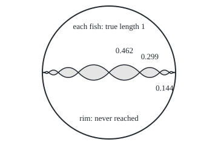
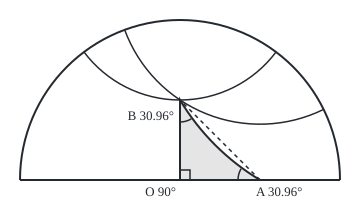

# Three geometries: what changes when the parallel postulate is dropped

Geometry and trig → Beyond Euclid → Curved worlds → Three geometries

---

## General Overview

M. C. Escher's 1959 woodcut *Circle Limit III* shows fish swimming in queues inside a circle. Central fish are large; toward the rim they shrink, never reaching it. In the world it shows, every fish is the same size; only the drawing squeezes them.

Lay fish nose to tail along a line through the centre, each 1 unit long in its own world. On the drawing, rim radius 1, they cover 0.462, 0.299, 0.144, 0.059 of the way. Infinitely many fit.

That world is the **hyperbolic plane**, and the circle is its standard map, the **Poincaré disc**. It keeps Euclid's rules except the one on parallel lines. Through a point off a line, flat geometry has exactly one parallel, a sphere none, the hyperbolic plane infinitely many. Triangle angles and circle rims change with it.

**Change the parallel rule and triangles, parallels and circles change together: on a sphere, angles add to more than 180°, circles grow slower than flat ones and no lines are parallel; in the hyperbolic plane, angles add to less than 180°, circles grow faster and parallels are endless.**

**What kind of fact this is:** theorems, proved on this card for its examples; the disc's ruler is a definition, its distance formula is checked by slices, not proved, and the general angle-sum rules are proved on [triangles-on-a-sphere](01-triangles-on-a-sphere.md) and model-spaces-of-constant-curvature.

### The picture: ten equal fish on one line through the disc

<p align="center"></p>

To scale: rim radius 1 = 110 units, centre (180, 120), fish ends at x = 230.8, 263.8, 279.6, 286.0, 288.5, mirrored left.

---

## The formula

A half-turn is $\pi$ radians, about 3.14159 ([radians-arcs-and-sectors](../02-Circles%20and%20Solids/02-radians-arcs-and-sectors.md)). $e$, about 2.718, is the base of the natural log $\ln$ ([logarithms](../../01-Foundations/03-Powers%2C%20Roots%20and%20Logarithms/05-logarithms.md)).

New here: (e^ρ − e^(−ρ))/2 is written $\sinh$, the **hyperbolic sine**.

A circle of true radius $\rho$ (rho), measured inside the world, has rim, or circumference, $C$:

$$C = 2\pi\rho \ \text{(flat)}, \qquad C = 2\pi\sin\rho \ \text{(sphere of radius 1)}, \qquad C = 2\pi\sinh\rho \ \text{(hyperbolic)}$$

**Read it aloud:** the same circle has a rim of two pi times its radius on flat ground, less on a ball, more in the hyperbolic plane.

The disc's ruler is a definition. A short drawn piece at drawn distance $r$ from the centre counts 2/(1 − r^2) times its drawn length: 2 at the centre, growing without limit toward the rim. Adding thin slices outward gives the true distance $d$:

$$d = \ln\frac{1+r}{1-r}, \qquad r = \frac{e^{d}-1}{e^{d}+1}$$

**Read it aloud:** true distance is the log of one plus the drawn distance over one minus it; the second form turns that round.

A triangle whose sides are the world's straight lines has angle sum $S$:

$$S = 180^\circ \ \text{(flat)}, \qquad S > 180^\circ \ \text{(sphere)}, \qquad S < 180^\circ \ \text{(hyperbolic)}$$

| Symbol | Plain meaning | In our example | Push it up and the answer… |
| --- | --- | --- | --- |
| $\rho$ | true radius of a circle | 1, 2, 3 fish lengths | hyperbolic rims grow fastest |
| $C$ | circumference: length of the rim | 62.94 at radius 3, hyperbolic | — |
| $\sin$, $\sinh$ | sine; hyperbolic sine | sinh 3 = 10.02 | sinh never turns back |
| $r$ | drawn distance from the disc's centre, rim at 1 | 0.462 at the first fish's end | the ruler's factor grows |
| $d$ | true distance from the disc's centre | 1 at the first fish's end | $r$ nears 1, never reaching it |
| $e$, $\ln$ | 2.718; the log that undoes powers of $e$ | e^3 = 20.086 | — |
| $S$ | a triangle's three angles added | 151.93° in the disc | — |
| $\pi$ | a half-turn in radians | 2π × 3 = 18.85 | — |

### When it holds

- **Straight in the world.** Sphere lines are great circles; disc lines are diameters and arcs meeting the rim square. A drawn chord gives back 180°.
- **Equal bending everywhere.** A potato or a saddle bends unevenly, and the formulas hold only roughly.
- **The world's own units.** On the ball $\rho$ is the angle at its centre in radians; in the disc $d$ is true distance.
- **Sphere triangles inside a half-sphere.** Opposite points, such as the poles, lie on endless great circles, so a side between them is not pinned down.

---

## Why it works

### Step 0: only the parallel rule changes

Euclid's fifth rule gives one parallel through a point ([angles-and-parallel-lines](../01-Angles%2C%20Triangles%20and%20Congruence/01-angles-and-parallel-lines.md)); the flat 180° proof copies two angles onto it ([triangle-angle-sum-and-inequality](../01-Angles%2C%20Triangles%20and%20Congruence/02-triangle-angle-sum-and-inequality.md)). Around 1830 Bolyai and Lobachevsky built a geometry that keeps every other rule and breaks this one. In 1868 Beltrami showed it is as free of contradiction as Euclid's.

### Step 1: on a sphere, no parallels and fat triangles

A great circle is where a plane through the ball's centre cuts the surface. Two such planes meet in a line through the centre, so any two great circles cross: no parallels.

The north pole and two equator points a quarter-turn apart make a triangle of three right angles: 270°. The excess over 180°, in radians, is its area on a ball of radius 1 ([triangles-on-a-sphere](01-triangles-on-a-sphere.md)).

A circle of true radius $\rho$ round the pole lies sin ρ from the pole-to-pole axis, the unit-circle sine, valid past a quarter-turn too ([radians-and-the-unit-circle](../03-Trigonometry/02-radians-and-the-unit-circle.md)). So its rim is 2π sin ρ: 0.89 at ρ = 3, past the equator.

### Step 2: the disc keeps angles and rescales lengths

The disc's straight lines are diameters and circle arcs meeting the rim at right angles. Drawn angles are true angles; drawn lengths are rescaled by 2/(1 − r^2).

Adding thin slices outward gives d = ln((1 + r)/(1 − r)); the code's slices recover 1 to 5 at the fish ends. Solving, e^d = (1 + r)/(1 − r), so e^d − r e^d = 1 + r and r = (e^d − 1)/(e^d + 1). At d = 1: 1.718/3.718 = 0.462.

### Step 3: circles grow like sinh

A circle of true radius ρ about the centre is drawn as a circle of drawn radius r, every point with the same factor, so its true rim is 2πr × 2/(1 − r^2).

Write E for e^ρ, so r = (E − 1)/(E + 1) and 1 − r^2 = 4E/(E + 1)^2. Then

2r/(1 − r^2) = 2(E − 1)/(E + 1) × (E + 1)^2/(4E) = (E^2 − 1)/(2E) = (E − 1/E)/2 = sinh ρ.

So C = 2π sinh ρ. For large ρ, sinh ρ is nearly half of e^ρ, so each extra fish length of radius multiplies the rim by about 2.718: Escher's outer rings are crowded.

### The picture: a triangle and two parallels in the disc

<p align="center"></p>

To scale: rim radius 1 = 160 units, O at (180, 180), A at (260, 180), B at (180, 100), upper half only. Side AB is an arc of radius 233.2; the dashed chord is not a disc line. The arcs through B, radii 120.0 and 144.2, never meet the diameter.

### Step 4: a disc triangle falls short of 180°

Put fish noses at O, the centre, A, 0.5 right, and B, 0.5 up. OA and OB lie on diameters, meeting at 90°.

Side AB is an arc meeting the rim square; by symmetry its centre is at (h, h). Two circles meet square when their radii at the crossing are perpendicular, so Pythagoras gives h^2 + h^2 = 1 + k^2, with k the arc's drawn radius. Through A: (0.5 − h)^2 + h^2 = k^2. Subtracting, h − 0.25 = 1, so h = 1.25 and k = 1.457738.

The radius to A runs (−0.75, −1.25), so the arc leaves A along (−1.25, 0.75), square to it. Against the way back to O, the tangent of that angle is 0.75/1.25 = 3/5: 30.963757°. B matches. The sum is 151.927513°, short by 28.072487°; that shortfall, in radians, is the triangle's true area.

<details>
<summary>Detailed proof: every such triangle falls short, and small ones barely</summary>

Put A and B at drawn distance a along the two diameters, a between 0 and 1. The same two equations give h = (1 + a^2)/(2a), and the angle at A has tangent (h − a)/h = (1 − a^2)/(1 + a^2).

That ratio is strictly between 0 and 1, so the angles at A and B are each under 45° and the sum under 180°. As a shrinks the ratio nears 1: at a = 0.05 the sum is 179.713522°, nearly flat.

That every hyperbolic triangle falls short by its area needs curvature; model-spaces-of-constant-curvature proves it.

</details>

### Step 5: endless parallels through one point

Take the diameter OA as the given line and B as the point. For any u between −1 and 1, the circle centred at (u, 1.25) through B has squared radius u^2 + 0.5625. The centre's squared distance from O, less that, is exactly 1, so by Step 4's test it is a disc line.

Its radius is under 1.25, so its lowest point stays above the diameter: 0.5 at u = 0, 0.348612 at u = 0.5. Each u gives a different line through B: infinitely many parallels.

The disc's factor 2/(1 − r^2) is one example of a metric, a length rule set point by point, the subject of riemannian-metrics.

---

## Worked numbers, by hand

| Step | Arithmetic | Value |
| --- | --- | --- |
| first fish's far end | (e − 1)/(e + 1) = 1.718/3.718 | 0.462117 |
| second fish's far end | (e^2 − 1)/(e^2 + 1) = 6.389/8.389 | 0.761594 |
| second fish, drawn | 0.761594 − 0.462117 | 0.299 |
| ring at radius 3, hyperbolic | sinh 3 = (20.086 − 0.050)/2 = 10.02; 2π × 10.02 | 62.94 |
| ring at radius 3, sphere | 2π × sin 3 = 2π × 0.141 | 0.89 |
| disc angle at A | tangent 0.75/1.25 | 30.96° |
| disc triangle | 90 + 30.96 + 30.96 | **151.93°** |

A ring three fish lengths out holds 62.94 fish in Escher's world, 18.85 on flat ground.

### What breaks if you drop a piece

| Mistake | Comes out at | What went wrong |
| --- | --- | --- |
| Side AB taken as the drawn chord | 180.000000° | The chord is no disc line |
| Flat ring formula in the hyperbolic plane | 18.85 fish, not 62.94 | The ruler's factor was dropped |
| Drawn distance 0.964028 read as true | 0.964, not 4.000000 | The ruler's factor was ignored |

---

## Code, from first principles, and it actually runs

Two roads to each number. Fish ends: the closed form, then 200,000 thin slices of the ruler added back up. Rims: 2π sinh ρ or 2π sin ρ, then a 20,000-sided polygon, rescaled on the disc, straight chords on the ball. Arc AB: the circle through A, B and A's mirror in the rim, (2, 0), which every rim-square circle through A also passes; its angle is checked against atan(3/5). Parallels: where each circle through B crosses the rim, the two radii must be square. Four asserts compare them.

### Python

```python
# Three geometries -- the check behind the card.  Standard library only.
# Escher's fish in the Poincare disc: each fish is 1 unit long, drawn smaller near the rim.
# Every number is reached twice: a closed form, and a road that never uses it
# (thin slices, a many-sided polygon, or a circle solved from three points).
from math import exp, sin, cos, pi, sqrt, acos, atan
DEG, N = 180 / pi, 200000
def drawn(d): return (exp(d) - 1) / (exp(d) + 1)        # true distance from centre -> drawn radius
def by_slices(r):                                        # add 2 x slice / (1 - s^2) over thin slices
    return sum(2 * (r / N) / (1 - ((i + 0.5) * r / N) ** 2) for i in range(N))
def dot(u, v): return sum(a * b for a, b in zip(u, v))
def ang(u, v): return acos(max(-1.0, min(1.0, dot(u, v) / sqrt(dot(u, u) * dot(v, v))))) * DEG
def tangent(p, q): return [b - dot(p, q) * a for a, b in zip(p, q)]  # sphere: direction from p toward q
def dist(p, q): return sqrt(sum((a - b) ** 2 for a, b in zip(p, q)))
def ring(pts, scale): return sum(dist(p, q) * scale(p, q) for p, q in zip(pts, pts[1:]))
def disc_ring(rho, n=20000):                             # polygon on the drawn circle, pieces rescaled
    r = drawn(rho); pts = [(r * cos(2 * pi * i / n), r * sin(2 * pi * i / n)) for i in range(n + 1)]
    return ring(pts, lambda p, q: 2 / (1 - ((p[0] + q[0]) ** 2 + (p[1] + q[1]) ** 2) / 4))
def ball_ring(rho, n=20000):                             # polygon on a ball of radius 1, straight 3-D chords
    pts = [(sin(rho) * cos(2 * pi * i / n), sin(rho) * sin(2 * pi * i / n), cos(rho)) for i in range(n + 1)]
    return ring(pts, lambda p, q: 1)
def f(xs, k=6): return ", ".join(f"{x:.{k}f}" for x in xs)
ends = [drawn(k) for k in range(6)]
lengths = [b - a for a, b in zip(ends, ends[1:])]
back = [by_slices(r) for r in ends[1:]]
sinh = [(exp(p) - exp(-p)) / 2 for p in (1, 2, 3)]
hyp, hyp_poly = [2 * pi * s for s in sinh], [disc_ring(p) for p in (1, 2, 3)]
ball, ball_poly = [2 * pi * sin(p) for p in (1, 2, 3)], [ball_ring(p) for p in (1, 2, 3)]
O, A, B, Astar = (0, 0), (0.5, 0), (0, 0.5), (2, 0)      # Astar: A's mirror in the rim, 1 / 0.5 = 2
# road one to the side AB: the circle through A, B and Astar, solved as two straight-line equations
cx = (Astar[0] ** 2 - A[0] ** 2) / (2 * (Astar[0] - A[0])); cy = (B[1] ** 2 - A[0] ** 2 + 2 * A[0] * cx) / (2 * B[1])
rad = sqrt((A[0] - cx) ** 2 + cy ** 2)
at_A = ang((-1, 0), (-cy, cx - A[0]))                   # tangent at A is square to the radius
flat = [ang((1, 0), (0, 1)), ang((-1, 0), (-0.5, 0.5)), ang((0, -1), (0.5, -0.5))]
V = [(0, 0, 1), (1, 0, 0), (0, 1, 0)]                   # north pole and two equator points a quarter-turn apart
octant = [ang(tangent(V[i], V[(i + 1) % 3]), tangent(V[i], V[(i + 2) % 3])) for i in range(3)]
total = 90 + 2 * at_A
lines = [(u, cy, dist((u, cy), B)) for u in (0, 0.5)]    # circles through B, centre (u, h), h from road one
print("fish far ends, true 1..5, drawn at:", f(ends[1:]))
print("fish drawn lengths:", f(lengths, 3))
print("fish far ends, true, recovered by thin slices:", f(back))
print("ring, true radius 1, 2, 3: flat", f([2 * pi * p for p in (1, 2, 3)], 2), "| hyperbolic 2 pi sinh", f(hyp, 2))
print("ring, hyperbolic by disc polygon:", f(hyp_poly, 2), "| ball 2 pi sin", f(ball, 2), "| ball polygon", f(ball_poly, 2))
print("by hand: e^1..3", f([exp(p) for p in (1, 2, 3)], 3), "| sinh 1..3", f(sinh, 2), "| sin 3", f([sin(3)], 3))
print("flat triangle O, A, B:", f(flat), "sum", f([sum(flat)]), "| octant on a ball:", f(octant), "sum", f([sum(octant)]))
print(f"disc side AB: circle through A, B, A* centre ({cx:.6f}, {cy:.6f}), radius {rad:.6f}")
print(f"disc angle at A: tangent road {at_A:.6f}, atan(3/5) road {atan(0.6) * DEG:.6f}")
print(f"disc triangle sum {total:.6f}, short of 180 by {180 - total:.6f}; at a = 0.05, {90 + 2 * atan((1 - 0.05 ** 2) / (1 + 0.05 ** 2)) * DEG:.6f}")
for u, v, p in lines:
    print(f"line through B, centre ({u:.1f}, {v:.2f}): radius {p:.6f}, rim test {u * u + v * v - p * p:.6f}, lowest y {v - p:.6f}")
def rim(u, v, p):                                        # where the circle centre (u, v), radius p, crosses the rim
    c, m = u * u + v * v, (1 + u * u + v * v - p * p) / 2; w = sqrt(c - m * m); return [((m * u + s * v * w) / c, (m * v - s * u * w) / c) for s in (-1, 1)]
def scr(p): return f"({180 + 160 * p[0]:.1f}, {180 - 160 * p[1]:.1f})"
print("figure 1, disc centre (180, 120), radius 110; fish ends x:", f([180 + 110 * r for r in ends[1:]], 1))
print("figure 2, centre (180, 180), radius 160; A", scr(A), "B", scr(B), "arcs radius", f([160 * r for r in [rad] + [p for _, _, p in lines]], 1), "| rim ends", " ".join(scr(q) for u, v, p in lines for q in rim(u, v, p)))
print(f"mistakes: chord triangle {sum(flat):.6f}; flat ring at 3 is {2 * pi * 3:.2f} not {hyp[2]:.2f}; drawn {ends[4]:.6f} is true {by_slices(ends[4]):.6f}")
assert all(abs(b - k) < 1e-6 for b, k in zip(back, range(1, 6)))                # slices undo the closed form
assert all(abs(a - b) < 1e-3 for a, b in zip(hyp + ball, hyp_poly + ball_poly))  # polygons match 2 pi sinh, 2 pi sin
assert abs(at_A - atan(0.6) * DEG) < 1e-9 and abs(sum(octant) - 270) < 1e-9     # two roads to the disc angle; octant
assert all(abs(dot(q, (q[0] - u, q[1] - v))) < 1e-12 and v - p > 0 for u, v, p in lines for q in rim(u, v, p))  # radii square at rim; miss OA
print("ALL CHECKS PASS")
```

**Ran 2026-09-24 on macOS, Python 3.14.6, standard library only. All checks passed. Output, pasted from the run:**

```
fish far ends, true 1..5, drawn at: 0.462117, 0.761594, 0.905148, 0.964028, 0.986614
fish drawn lengths: 0.462, 0.299, 0.144, 0.059, 0.023
fish far ends, true, recovered by thin slices: 1.000000, 2.000000, 3.000000, 4.000000, 5.000000
ring, true radius 1, 2, 3: flat 6.28, 12.57, 18.85 | hyperbolic 2 pi sinh 7.38, 22.79, 62.94
ring, hyperbolic by disc polygon: 7.38, 22.79, 62.94 | ball 2 pi sin 5.29, 5.71, 0.89 | ball polygon 5.29, 5.71, 0.89
by hand: e^1..3 2.718, 7.389, 20.086 | sinh 1..3 1.18, 3.63, 10.02 | sin 3 0.141
flat triangle O, A, B: 90.000000, 45.000000, 45.000000 sum 180.000000 | octant on a ball: 90.000000, 90.000000, 90.000000 sum 270.000000
disc side AB: circle through A, B, A* centre (1.250000, 1.250000), radius 1.457738
disc angle at A: tangent road 30.963757, atan(3/5) road 30.963757
disc triangle sum 151.927513, short of 180 by 28.072487; at a = 0.05, 179.713522
line through B, centre (0.0, 1.25): radius 0.750000, rim test 1.000000, lowest y 0.500000
line through B, centre (0.5, 1.25): radius 0.901388, rim test 1.000000, lowest y 0.348612
figure 1, disc centre (180, 120), radius 110; fish ends x: 230.8, 263.8, 279.6, 286.0, 288.5
figure 2, centre (180, 180), radius 160; A (260.0, 180.0) B (180.0, 100.0) arcs radius 233.2, 120.0, 144.2 | rim ends (84.0, 52.0) (276.0, 52.0) (124.7, 29.9) (323.6, 109.4)
mistakes: chord triangle 180.000000; flat ring at 3 is 18.85 not 62.94; drawn 0.964028 is true 4.000000
ALL CHECKS PASS
```

### Rust

```rust
// Three geometries -- the same check as the Python, in Rust.  No crates.
// Escher's fish in the Poincare disc: each fish is 1 unit long, drawn smaller near the rim.
// Every number is reached twice: a closed form, and a road that never uses it
// (thin slices, a many-sided polygon, or a circle solved from three points).
use std::f64::consts::PI;
const DEG: f64 = 180.0 / PI;
const N: usize = 200000;
fn drawn(d: f64) -> f64 { (d.exp() - 1.0) / (d.exp() + 1.0) }   // true distance -> drawn radius
fn by_slices(r: f64) -> f64 {                                    // add 2 x slice / (1 - s^2) over thin slices
    let h = r / N as f64;
    (0..N).map(|i| { let s = (i as f64 + 0.5) * h; 2.0 * h / (1.0 - s * s) }).sum()
}
fn dot(u: &[f64], v: &[f64]) -> f64 { u.iter().zip(v).map(|(a, b)| a * b).sum() }
fn ang(u: &[f64], v: &[f64]) -> f64 { (dot(u, v) / (dot(u, u) * dot(v, v)).sqrt()).clamp(-1.0, 1.0).acos() * DEG }
fn tangent(p: &[f64], q: &[f64]) -> Vec<f64> { let d = dot(p, q); p.iter().zip(q).map(|(a, b)| b - d * a).collect() }
fn dist(p: &[f64], q: &[f64]) -> f64 { p.iter().zip(q).map(|(a, b)| (a - b) * (a - b)).sum::<f64>().sqrt() }
fn disc_ring(rho: f64) -> f64 {                                  // polygon on the drawn circle, pieces rescaled
    let (r, n) = (drawn(rho), 20000);
    let pts: Vec<[f64; 2]> = (0..=n).map(|i| { let t = 2.0 * PI * i as f64 / n as f64; [r * t.cos(), r * t.sin()] }).collect();
    pts.windows(2).map(|w| { let (mx, my) = ((w[0][0] + w[1][0]) / 2.0, (w[0][1] + w[1][1]) / 2.0);
        dist(&w[0], &w[1]) * 2.0 / (1.0 - mx * mx - my * my) }).sum()
}
fn ball_ring(rho: f64) -> f64 {                                  // polygon on a ball of radius 1, straight 3-D chords
    let n = 20000;
    let pts: Vec<[f64; 3]> = (0..=n).map(|i| { let t = 2.0 * PI * i as f64 / n as f64; [rho.sin() * t.cos(), rho.sin() * t.sin(), rho.cos()] }).collect();
    pts.windows(2).map(|w| dist(&w[0], &w[1])).sum()
}
fn f(xs: &[f64], k: usize) -> String { xs.iter().map(|x| format!("{:.*}", k, x)).collect::<Vec<_>>().join(", ") }
fn scr(p: (f64, f64)) -> String { format!("({:.1}, {:.1})", 180.0 + 160.0 * p.0, 180.0 - 160.0 * p.1) }
fn rim(u: f64, v: f64, p: f64) -> Vec<(f64, f64)> {              // where the circle centre (u, v), radius p, crosses the rim
    let (c, m) = (u * u + v * v, (1.0 + u * u + v * v - p * p) / 2.0); let w = (c - m * m).sqrt();
    [-1.0, 1.0].iter().map(|s| ((m * u + s * v * w) / c, (m * v - s * u * w) / c)).collect()
}
fn main() {
    let ends: Vec<f64> = (0..6).map(|k| drawn(k as f64)).collect();
    let lengths: Vec<f64> = ends.windows(2).map(|w| w[1] - w[0]).collect();
    let back: Vec<f64> = ends[1..].iter().map(|&r| by_slices(r)).collect();
    let rs = [1.0f64, 2.0, 3.0];
    let hyp: Vec<f64> = rs.iter().map(|p| 2.0 * PI * (p.exp() - (-p).exp()) / 2.0).collect();
    let hyp_poly: Vec<f64> = rs.iter().map(|&p| disc_ring(p)).collect();
    let ball: Vec<f64> = rs.iter().map(|p| 2.0 * PI * p.sin()).collect();
    let ball_poly: Vec<f64> = rs.iter().map(|&p| ball_ring(p)).collect();
    let (a0, b1, astar) = (0.5f64, 0.5, 2.0);                    // A = (0.5, 0), B = (0, 0.5), A* = (2, 0)
    let cx = (astar * astar - a0 * a0) / (2.0 * (astar - a0));
    let cy = (b1 * b1 - a0 * a0 + 2.0 * a0 * cx) / (2.0 * b1);
    let rad = ((a0 - cx) * (a0 - cx) + cy * cy).sqrt();
    let at_a = ang(&[-1.0, 0.0], &[-cy, cx - a0]);
    let flat = [ang(&[1.0, 0.0], &[0.0, 1.0]), ang(&[-1.0, 0.0], &[-0.5, 0.5]), ang(&[0.0, -1.0], &[0.5, -0.5])];
    let v = [[0.0, 0.0, 1.0], [1.0, 0.0, 0.0], [0.0, 1.0, 0.0]]; // north pole, two equator points
    let octant: Vec<f64> = (0..3).map(|i| ang(&tangent(&v[i], &v[(i + 1) % 3]), &tangent(&v[i], &v[(i + 2) % 3]))).collect();
    let total = 90.0 + 2.0 * at_a;
    let lines: Vec<(f64, f64, f64)> = [0.0f64, 0.5].iter().map(|&u| (u, cy, (u * u + (cy - b1) * (cy - b1)).sqrt())).collect(); // through B, h from road one
    let (fs, os): (f64, f64) = (flat.iter().sum(), octant.iter().sum());
    println!("fish far ends, true 1..5, drawn at: {}", f(&ends[1..], 6));
    println!("fish drawn lengths: {}", f(&lengths, 3));
    println!("fish far ends, true, recovered by thin slices: {}", f(&back, 6));
    println!("ring, true radius 1, 2, 3: flat {} | hyperbolic 2 pi sinh {}", f(&rs.map(|p| 2.0 * PI * p), 2), f(&hyp, 2));
    println!("ring, hyperbolic by disc polygon: {} | ball 2 pi sin {} | ball polygon {}", f(&hyp_poly, 2), f(&ball, 2), f(&ball_poly, 2));
    let sh: Vec<f64> = rs.iter().map(|p| (p.exp() - (-p).exp()) / 2.0).collect();
    println!("by hand: e^1..3 {} | sinh 1..3 {} | sin 3 {:.3}", f(&rs.map(|p| p.exp()), 3), f(&sh, 2), 3.0f64.sin());
    println!("flat triangle O, A, B: {} sum {} | octant on a ball: {} sum {}", f(&flat, 6), f(&[fs], 6), f(&octant, 6), f(&[os], 6));
    println!("disc side AB: circle through A, B, A* centre ({:.6}, {:.6}), radius {:.6}", cx, cy, rad);
    println!("disc angle at A: tangent road {:.6}, atan(3/5) road {:.6}", at_a, 0.6f64.atan() * DEG);
    let sm = 0.05f64;
    println!("disc triangle sum {:.6}, short of 180 by {:.6}; at a = 0.05, {:.6}", total, 180.0 - total, 90.0 + 2.0 * ((1.0 - sm * sm) / (1.0 + sm * sm)).atan() * DEG);
    for &(u, c, p) in &lines {
        println!("line through B, centre ({:.1}, {:.2}): radius {:.6}, rim test {:.6}, lowest y {:.6}", u, c, p, u * u + c * c - p * p, c - p);
    }
    let fx: Vec<f64> = ends[1..].iter().map(|r| 180.0 + 110.0 * r).collect();
    println!("figure 1, disc centre (180, 120), radius 110; fish ends x: {}", f(&fx, 1));
    let ends_s: Vec<String> = lines.iter().flat_map(|&(u, c, p)| rim(u, c, p)).map(scr).collect();
    let arcs: Vec<f64> = [rad].iter().chain(lines.iter().map(|l| &l.2)).map(|r| 160.0 * r).collect();
    println!("figure 2, centre (180, 180), radius 160; A {} B {} arcs radius {} | rim ends {}", scr((a0, 0.0)), scr((0.0, b1)), f(&arcs, 1), ends_s.join(" "));
    println!("mistakes: chord triangle {:.6}; flat ring at 3 is {:.2} not {:.2}; drawn {:.6} is true {:.6}", fs, 2.0 * PI * 3.0, hyp[2], ends[4], by_slices(ends[4]));
    assert!(back.iter().enumerate().all(|(k, b)| (b - (k + 1) as f64).abs() < 1e-6));        // slices undo the closed form
    assert!(hyp.iter().chain(&ball).zip(hyp_poly.iter().chain(&ball_poly)).all(|(a, b)| (a - b).abs() < 1e-3));
    assert!((at_a - 0.6f64.atan() * DEG).abs() < 1e-9 && (os - 270.0).abs() < 1e-9); // two roads to the disc angle; octant
    assert!(lines.iter().all(|&(u, c, p)| c - p > 0.0 && rim(u, c, p).iter().all(|q| (q.0 * (q.0 - u) + q.1 * (q.1 - c)).abs() < 1e-12))); // radii square at rim; miss OA
    println!("ALL CHECKS PASS");
}
```

**Ran 2026-09-24 on macOS, rustc 1.98.1, no crates. All checks passed. Output, pasted from the run:**

```
fish far ends, true 1..5, drawn at: 0.462117, 0.761594, 0.905148, 0.964028, 0.986614
fish drawn lengths: 0.462, 0.299, 0.144, 0.059, 0.023
fish far ends, true, recovered by thin slices: 1.000000, 2.000000, 3.000000, 4.000000, 5.000000
ring, true radius 1, 2, 3: flat 6.28, 12.57, 18.85 | hyperbolic 2 pi sinh 7.38, 22.79, 62.94
ring, hyperbolic by disc polygon: 7.38, 22.79, 62.94 | ball 2 pi sin 5.29, 5.71, 0.89 | ball polygon 5.29, 5.71, 0.89
by hand: e^1..3 2.718, 7.389, 20.086 | sinh 1..3 1.18, 3.63, 10.02 | sin 3 0.141
flat triangle O, A, B: 90.000000, 45.000000, 45.000000 sum 180.000000 | octant on a ball: 90.000000, 90.000000, 90.000000 sum 270.000000
disc side AB: circle through A, B, A* centre (1.250000, 1.250000), radius 1.457738
disc angle at A: tangent road 30.963757, atan(3/5) road 30.963757
disc triangle sum 151.927513, short of 180 by 28.072487; at a = 0.05, 179.713522
line through B, centre (0.0, 1.25): radius 0.750000, rim test 1.000000, lowest y 0.500000
line through B, centre (0.5, 1.25): radius 0.901388, rim test 1.000000, lowest y 0.348612
figure 1, disc centre (180, 120), radius 110; fish ends x: 230.8, 263.8, 279.6, 286.0, 288.5
figure 2, centre (180, 180), radius 160; A (260.0, 180.0) B (180.0, 100.0) arcs radius 233.2, 120.0, 144.2 | rim ends (84.0, 52.0) (276.0, 52.0) (124.7, 29.9) (323.6, 109.4)
mistakes: chord triangle 180.000000; flat ring at 3 is 18.85 not 62.94; drawn 0.964028 is true 4.000000
ALL CHECKS PASS
```

The two outputs match line for line.

> [!TIP]
> **Try changing**
> Guess first, then run it.
> - **A sixth fish.** Change `range(6)` to `range(7)`: it is drawn under 0.01 long, still short of the rim.
> - **A smaller triangle.** A at (0.05, 0), B at (0, 0.05), mirror at (20, 0): the sum climbs to 179.713522°, and the third assert, pinned to atan(3/5), stops the run.
> - **A failing line.** Add `1.2` to the values of `u`: the circle dips below the diameter and the fourth assert stops the run.

---

## The usual mistake

> [!warning]
> **Believing the drawing's sizes.** Rim fish look small and the rim looks 1 unit away. Every fish is 1 true unit long, and the rim is infinitely far: the fourth fish's end, drawn at 0.964, is 4 true units out.
>
> - **Flat circle formula off the flat.** At radius 3 it predicts 18.85 fish; the hyperbolic ring holds 62.94, a ball of radius 1 only 0.89.
> - **Escher's arcs as disc lines.** They meet the rim at 80°, not 90°, as Coxeter showed.
> - **"A sphere only drops the parallel rule."** Opposite points also share endless great circles.

---

## Where you meet it in real life

- **Flights and shipping.** Routes follow great circles, and no two are parallel ([triangles-on-a-sphere](01-triangles-on-a-sphere.md)).
- **Escher's Circle Limit prints.** Equal copies tiling the disc, the hyperbolic cousins of wallpaper ([symmetry-and-tilings](04-symmetry-and-tilings.md)).
- **Networks.** Trees gain members exponentially with distance, as hyperbolic rims do, so they fit the hyperbolic plane uncrowded.

> **Say it back**
> Euclid's parallel rule can be replaced. On a sphere no lines are parallel, triangles exceed 180°, and circles have less rim than flat ones. In the hyperbolic plane, mapped as the Poincaré disc, parallels are endless, triangles fall short of 180°, and rims grow exponentially. The disc keeps angles true and shrinks lengths toward the rim, so Escher's equal fish look smaller there.

---

## What this builds on

- [triangles-on-a-sphere](01-triangles-on-a-sphere.md): great circles and the sphere's angle excess.

## Where this goes next

- riemannian-metrics: the disc's factor 2/(1 − r^2) as one length rule set point by point.
- model-spaces-of-constant-curvature: the three worlds of constant curvature, with the angle-sum rules proved in general.

This card never said what curvature is; later cards define it and show that one number fixes angle sums, parallels and circle growth together.

---

## Sources

Verified 24 Sep 2026: every link below resolves to the publisher's page.

- Hitchman, Michael P. *Geometry with an Introduction to Cosmic Topology*, §5.3. LibreTexts. [Section page](https://math.libretexts.org/Bookshelves/Geometry/Geometry_with_an_Introduction_to_Cosmic_Topology_(Hitchman)/05%3A_Hyperbolic_Geometry/5.03%3A_Measurement_in_Hyperbolic_Geometry). The length factor and the distance formula.
- Anderson, James W. *Hyperbolic Geometry*, 2nd ed. Springer, 2005. [Publisher page](https://link.springer.com/book/10.1007/1-84628-220-9). Disc lines, angles, and area as angle shortfall.
- Coxeter, H. S. M. "The Non-Euclidean Symmetry of Escher's Picture 'Circle Limit III'." *Leonardo* 12, no. 1 (1979): 19–25. [DOI](https://doi.org/10.2307/1574078). Why the fish arcs meet the rim at 80°.
- O'Connor, J. J., and E. F. Robertson. "Non-Euclidean geometry." MacTutor, University of St Andrews. [History page](https://mathshistory.st-andrews.ac.uk/HistTopics/Non-Euclidean_geometry/). Bolyai, Lobachevsky and the parallel rule.
