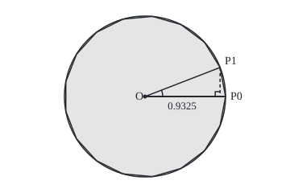
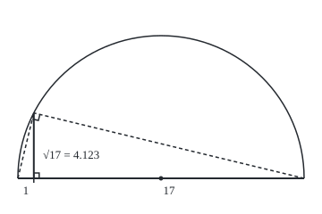

# Ruler and compass: what can be built, and the three ancient problems that cannot

[Syllabus](../../../SYLLABUS.md) → [Geometry and trig](../../../SYLLABUS.md#w05) → [Beyond Euclid](../../../SYLLABUS.md#w05-s06) → Ruler and compass

---

## General Overview

A **ruler** here is an unmarked straightedge: it draws the line through two known points. A **compass** draws the circle about one known point through another. New points are crossings. A figure reached this way in finitely many steps is **constructible**.

A regular 17-gon, seventeen equal sides round a circle, is constructible; Gauss found how in 1796. A regular 7-gon is proved not to be. Pierre Wantzel's 1837 proof also ends two ancient Greek problems, cutting any angle in three and building a cube of twice a given volume; the third, a square of a given circle's area, fell in 1882.

Each crossing solves an equation of degree at most two, so adds at most one square root. On a circle of radius 1, drop a perpendicular from the 17-gon's first corner to the starting radius: its foot lies 0.932472 from the centre, four square roots deep. The 7-gon's foot lies 0.623490 out, a root of a **cubic** (an equation whose highest power is the cube) that no chain of square roots reaches.

**Ruler and compass build exactly the numbers reachable from 1 by adding, subtracting, multiplying, dividing and taking square roots; a length that solves a cubic with fraction coefficients and no fraction root, such as the 7-gon's, can never be built.**

**What kind of fact this is:** a theorem, proved on this card in Why it works, except π's case, Lindemann's 1882 theorem, stated without proof.

### The picture: the 17-gon's first corner

<p align="center"></p>

To scale, 1 = 100 units. The arc at O marks 360°/17. The foot of P1 lies 0.9325 from O; P1 sits at (273.2, 83.9).

---

## The formula

Write $n$ for the number of sides and $c$ for the cosine of 360°/n: on a circle of radius 1, the distance from the centre to the foot of the first corner. Drawing $c$ is the whole job: the perpendicular there meets the circle at the first corner, and the compass steps off the rest. A **field** is a set of numbers closed under adding, subtracting, multiplying and dividing by anything but zero ([Fields](../../03-Algebra/09-Rings%20and%20Fields/02-fields.md)); $F$ is the field of numbers built so far, starting with the fractions.

One construction step can only do this:

$$\text{new number} = p + q\sqrt{k}, \qquad p,\ q,\ k \text{ in } F$$

**Read it aloud:** each step makes an old number plus an old number times the square root of an old number.

For the 17-gon, four such steps suffice, each a quadratic whose coefficients come from the step before:

$$A,\ B = \frac{-1 \pm \sqrt{17}}{2}, \qquad A_1 = \frac{A + \sqrt{A^2 + 4}}{2}, \qquad B_1 = \frac{B + \sqrt{B^2 + 4}}{2}, \qquad 2c = \frac{A_1 + \sqrt{A_1^2 - 4B_1}}{2}$$

**Read it aloud:** the square root of 17, two more roots built on it, one last root, and half the result is the 17-gon's cosine.

| Symbol | Plain meaning | In our example | Push it up and the answer… |
| --- | --- | --- | --- |
| $n$ | number of equal sides | 17, and 7 | corners closer together |
| $c$ | cosine of 360°/n, on a unit circle | 0.932472 for 17; 0.623490 for 7 | corner nearer the start |
| $F$ | the field of numbers built so far | fractions, then with √17 added | more in reach |
| $p$, $q$, $k$ | numbers already in $F$; $k$ goes under the new root | $k$ = 17 at the first step | — |
| $A$, $B$ | each twice a sum of four cosines | 1.561553 and −2.561553 | — |
| $A_1$, $B_1$ | each twice a sum of two cosines | 2.049481 and 0.344151 | — |
| $x$ | the unknown in a cubic | cos 20°, or the cube root of 2 | — |

The full test, from Gauss and Wantzel: an n-gon can be built exactly when n is a power of 2 times distinct **Fermat primes**, primes of the form 2^(2^j) + 1 for a whole number j, such as 3, 5 and 17. From 3 to 20 that allows 3, 4, 5, 6, 8, 10, 12, 15, 16, 17 and 20, and rules out 7, 9, 11, 13, 14, 18 and 19.

### When it holds

- **An unmarked ruler.** Two marks on the edge, slid into place, let Archimedes trisect any angle.
- **Finitely many exact steps.** Doubled polygons approach π but never reach it; a 7-gon drawn 0.20% off is not a construction.
- **"Any angle", not "some angle".** 180° splits into three 60° corners; no recipe works for every angle, and 60° is the witness.

---

## Why it works

### Step 0: every step solves a quadratic at worst

Put the page on a grid, known points at coordinates in $F$; lines and circles through them have equations with coefficients in $F$. Two lines cross where two linear equations agree, inside $F$. A line meets a circle where a quadratic is zero, and the quadratic formula ([The quadratic formula](../../03-Algebra/02-Polynomials/03-quadratic-formula.md)) gives $p + q\sqrt{k}$. Subtracting two circles' equations cancels the squared terms and leaves a line, so two circles are the line-and-circle case again.

### Step 1: the tools reach every field operation and every square root

Adding is laying lengths end to end. Multiplying uses parallel lines ([Angles](../01-Angles%2C%20Triangles%20and%20Congruence/01-angles-and-parallel-lines.md)): mark 1 and b on one arm of an angle and a on the other, join 1 to a, and the parallel through b meets the second arm at ab, by similar triangles ([Similar triangles](../01-Angles%2C%20Triangles%20and%20Congruence/04-similar-triangles-and-scale.md)).

For a square root, lay 1 and 17 end to end, draw the half-circle on the whole 18, and raise a perpendicular at the join. Its top sees the diameter at a right angle ([Angles at a circle](../02-Circles%20and%20Solids/03-angles-in-a-circle.md)), so the two small triangles are similar and the height h has h × h = 1 × 17.

<p align="center"></p>

To scale, the base of 18 spans 320 units: the join sits at x = 37.8, the top at y = 126.7.

Halving: circles about each end of a segment, through the other end, cross twice, and the line through both crossings meets the segment at its midpoint. To halve an angle, mark equal distances on both arms and halve the segment between them.

### Step 2: the 17-gon splits into halves, four times

Write c1 to c8 for the cosines of 1, 2, …, 8 times 360°/17. For any odd n, the cosines of the first (n − 1)/2 multiples of 360°/n add to −1/2.

<details>
<summary>The algebra behind this, if you want it</summary>

Let t = 360°/n. By 2 sin(t/2) cos(jt) = sin((j + 1/2)t) − sin((j − 1/2)t) ([Trig identities](../03-Trigonometry/03-trig-identities.md)), the sum over j = 1 to (n − 1)/2 collapses to sin(nt/2) − sin(t/2) = sin 180° − sin(t/2). Divide by 2 sin(t/2): −1/2.

</details>

Gauss grouped them: A = 2(c1 + c2 + c4 + c8) and B = 2(c3 + c5 + c6 + c7). The sum rule gives A + B = −1. Multiplying out with 2 cos u × 2 cos v = 2 cos(u + v) + 2 cos(u − v) gives 32 terms, each cosine four times, so A × B = −4. Numbers with sum −1 and product −4 solve y^2 + y − 4 = 0: one square root of 17.

Halve again. A1 = 2(c1 + c4) and its partner 2(c2 + c8) add to A and multiply to −1; B1 = 2(c3 + c5) and its partner likewise with B. Last, 2c1 and 2c4 add to A1 and multiply to 2c5 + 2c3 = B1. Four quadratics, and c1 is the 17-gon's $c$. It works because 17 − 1 = 16 halves four times.

### Step 3: the 7-gon leaves a cubic

7 − 1 = 6 has a factor 3, so halving stalls. The sum rule gives 1 + 2(c + cos 2t + cos 3t) = 0 with t = 360°/7; with cos 2t = 2c^2 − 1 and cos 3t = 4c^3 − 3c:

8c^3 + 4c^2 − 4c − 1 = 0.

If a fraction p/q in lowest terms were a root, multiplying through by q^3 shows p divides 1 and q divides 8 ([Roots and factors](../../03-Algebra/02-Polynomials/05-roots-and-the-factor-theorem.md)). The candidates ±1, ±1/2, ±1/4, ±1/8 all fail. And a cubic with fraction coefficients and no fraction root has no root that square roots reach.

<details>
<summary>Detailed proof: square roots never reach a root of such a cubic</summary>

Take the first field $F$ in the tower that holds a root: $p + q\sqrt{k}$, with $p$, $q$, $k$ in the field below, $q$ not zero, $\sqrt{k}$ not below. Substituting gives X + Y√k = 0 with X, Y below; Y must be 0, or √k = −X/Y would lie below, so X = 0 too.

Then $p - q\sqrt{k}$ gives X − Y√k = 0: a second root. A cubic's three roots add to minus its x^2 coefficient over its x^3 one, here −1/2, so the third is −1/2 − 2p, in the field below, against the choice of $F$. Descending ends at a fraction root, which the candidates excluded.

</details>

### Step 4: the three ancient problems

- **Trisecting 60°.** The target x = cos 20° solves 4x^3 − 3x = cos 60° = 1/2, so 8x^3 − 6x − 1 = 0. No candidate works: 20°, 0.939693 as a cosine, is out of reach from 60°.
- **Doubling the cube.** The side x of a cube of volume 2 solves x^3 − 2 = 0; ±1 and ±2 fail. The side, 1.259921, is out of reach.
- **Squaring the circle.** A unit circle has area π, so the square needs side √π = 1.772454. Lindemann proved in 1882 that π solves no polynomial with fraction coefficients at all.

Every built length solves such a polynomial, found by squaring away its roots one at a time, so √π cannot be built. The route by field degrees, which proves the full n-gon test, is Straightedge and compass.

---

## Worked numbers, by hand

| Step | Arithmetic | Value |
| --- | --- | --- |
| square root of 17 | half-circle on 1 + 17 | 4.123106 |
| A, B | (−1 ± 4.123106) ÷ 2 | 1.561553 and −2.561553 |
| A1 | (1.561553 + √(1.561553^2 + 4)) ÷ 2 | 2.049481 |
| B1 | (−2.561553 + √(2.561553^2 + 4)) ÷ 2 | 0.344151 |
| c | (2.049481 + √(2.049481^2 − 4 × 0.344151)) ÷ 4 | **0.932472** |
| check | bisection on the sum of eight cosines | **0.932472** |

A perpendicular at 0.932472 of the radius, then sixteen compass steps, complete the polygon.

### What breaks if you drop a piece

| Mistake | Comes out at | What went wrong |
| --- | --- | --- |
| Smaller root at the last step | 0.092268 | That is c4, the corner four steps round |
| Cutting the 60° chord in three equal parts | 19.107°, 21.787°, 19.107° | Equal chord pieces are not equal angles |
| Near-miss 7-gon side of √3/2 | 0.866025 against 0.867767 | 0.20% short: close, not exact |

The code prints all three.

---

## Code, from first principles, and it actually runs

Nothing is imported. The 17-gon's cosine is reached by two roads sharing no step: the tower, and bisection on the sum-of-cosines rule, whose cosines then test Gauss's pairing. Cubics are hunted for fraction roots; the 180° control must find some.

### Python

```python
# Ruler and compass -- the check behind the card.  Nothing is imported.  cos(360/17 deg) by four square
# roots and by bisection on the cosine sum; the cubics that block the 7-gon hunted for rational roots.
def sqrt(a):                              # Newton's method, written out here
    x = max(a, 1.0)
    for _ in range(80): x = (x + a / x) / 2
    return x
def cheb(c, k):                           # cos(k t) from c = cos t: cos((k+1)t) = 2c cos(kt) - cos((k-1)t)
    lo, hi = 1.0, c
    for _ in range(k - 1): lo, hi = hi, 2 * c * hi - lo
    return hi if k else 1.0
def bisect(f, lo, hi):                    # a root between lo and hi, where f changes sign
    for _ in range(200): lo, hi = (m, hi) if (f(lo) > 0) == (f(m := (lo + hi) / 2) > 0) else (lo, m)
    return (lo + hi) / 2
def rational_roots(a):                    # a = [a0, a1, a2, a3], a0 not 0: every p/q with p | a0, q | a3
    ds = lambda m: [d for d in range(1, abs(m) + 1) if m % d == 0]
    return [f"{s * p}" if q == 1 else f"{s * p}/{q}" for p in ds(a[0]) for q in ds(a[3]) for s in (-1, 1)
            if sum(a[i] * (s * p) ** i * q ** (3 - i) for i in range(4)) == 0 and all(p % d or q % d for d in range(2, q + 1))]
def buildable(n):                         # 2^k times distinct primes p with p - 1 a power of 2
    while n % 2 == 0: n //= 2
    for p in range(3, n + 1):
        if n % p == 0 and all(p % d for d in range(2, p)):
            n //= p
            if n % p == 0 or (p - 1) & (p - 2): return False
    return True

r17 = sqrt(17)
A, B = (-1 + r17) / 2, (-1 - r17) / 2                            # t^2 + t - 4 = 0
A1, B1 = (A + sqrt(A * A + 4)) / 2, (B + sqrt(B * B + 4)) / 2    # t^2 - A t - 1 = 0 and t^2 - B t - 1 = 0
tower, small = (A1 + sqrt(A1 * A1 - 4 * B1)) / 4, (A1 - sqrt(A1 * A1 - 4 * B1)) / 4   # t^2 - A1 t + B1 = 0, t = 2c
c17, c7 = [bisect(lambda c: 1 + 2 * sum(cheb(c, k) for k in range(1, m)), lo, 0.99) for m, lo in ((9, 0.8), (4, 0.3))]
ck = [cheb(c17, k) for k in range(9)]
A2, B2 = 2 * (ck[1] + ck[2] + ck[4] + ck[8]), 2 * (ck[3] + ck[5] + ck[6] + ck[7])
cubics = [("8c^3 + 4c^2 - 4c - 1 (7-gon)", [-1, -4, 4, 8]), ("8x^3 - 6x - 1 (trisect 60 deg)", [-1, -6, 0, 8]),
          ("x^3 - 2 (double the cube)", [-2, 0, 0, 1]), ("4x^3 - 3x + 1 (trisect 180 deg)", [1, -3, 0, 4])]
c20, cube2 = bisect(lambda x: 8 * x ** 3 - 6 * x - 1, 0.5, 1.0), bisect(lambda x: x ** 3 - 2, 1.0, 2.0)
s = 1.0                                   # Archimedes: side of a 6 x 2^k-gon in a unit circle
for _ in range(30): s = s / sqrt(2 + sqrt(4 - s * s))
pi, fact = 3 * 2 ** 30 * s, lambda m: 1 if m < 2 else m * fact(m - 1)
cosd = lambda d: sum((-1) ** j * (d * pi / 180) ** (2 * j) / fact(2 * j) for j in range(30))   # own cosine
t1, t2 = [bisect(lambda d: cosd(d) - x / sqrt(x * x + y * y), 0.0, 90.0) for x, y in ((5 / 6, sqrt(3) / 6), (2 / 3, sqrt(3) / 3))]
print(f"17-gon, road one, four square roots: cos(360/17 deg) = {tower:.12f}")
print(f"17-gon, road two, bisection on the cosine sum: {c17:.12f}")
print(f"tower: sqrt 17 = {r17:.6f}, A = {A:.6f}, B = {B:.6f}, A1 = {A1:.6f}, B1 = {B1:.6f}")
print(f"road two's cosines: A + B = {A2 + B2:.6f}, A x B = {A2 * B2:.6f}, 17 turns give cos = {cheb(c17, 17):.6f}")
print(f"7-gon: cos(360/7 deg) = {c7:.12f}, 7 turns give cos = {cheb(c7, 7):.6f}")
for name, a in cubics: print(f"rational roots of {name}: {', '.join(rational_roots(a)) or 'none'}")
print(f"cos 20 deg = {c20:.6f}, own cosine of 20 deg = {cosd(20):.6f}, cube root of 2 = {cube2:.6f}, "
      f"pi by Archimedes = {pi:.6f}, square side for a unit circle sqrt(pi) = {sqrt(pi):.6f}")
print(f"buildable n-gons, n = 3 to 20: {[n for n in range(3, 21) if buildable(n)]}; "
      f"not buildable: {[n for n in range(3, 21) if not buildable(n)]}")
print(f"mistake, smaller root at the last step: {small:.6f} = cos(4 x 360/17 deg) = {ck[4]:.6f}")
print(f"mistake, chord of 60 deg cut in three: angles {t1:.3f}, {t2 - t1:.3f}, {60 - t2:.3f} deg")
print(f"mistake, near-miss 7-gon side sqrt(3)/2 = {sqrt(3) / 2:.6f}, true {sqrt(2 - 2 * c7):.6f}, short by {100 * (1 - sqrt(3) / 2 / sqrt(2 - 2 * c7)):.2f}%")
print(f"figure, 17-gon: centre (180, 120), radius 100, P1 ({180 + 100 * c17:.1f}, {120 - 100 * sqrt(1 - c17 * c17):.1f})")
print(f"figure, root: base (20, 200) to (340, 200), foot x {20 + 320 / 18:.1f}, top y {200 - 320 / 18 * r17:.1f}")
assert abs(tower - c17) < 1e-12 and abs(small - ck[4]) < 1e-12            # two roads, both roots
assert abs(A2 + B2 + 1) < 1e-9 and abs(A2 * B2 + 4) < 1e-9                 # the first pairing, checked by road two
assert [rational_roots(a) for _, a in cubics] == [[], [], [], ["-1", "1/2"]]  # the control finds its roots
assert abs(cheb(c7, 7) - 1) < 1e-9 and abs(cosd(20) - c20) < 1e-9          # 7 turns close; the cubic gives cos 20
print("ALL CHECKS PASS")
```

**Ran 2026-09-24 on macOS, Python 3.14.6, standard library only. All checks passed. Output, pasted from the run:**

```
17-gon, road one, four square roots: cos(360/17 deg) = 0.932472229404
17-gon, road two, bisection on the cosine sum: 0.932472229404
tower: sqrt 17 = 4.123106, A = 1.561553, B = -2.561553, A1 = 2.049481, B1 = 0.344151
road two's cosines: A + B = -1.000000, A x B = -4.000000, 17 turns give cos = 1.000000
7-gon: cos(360/7 deg) = 0.623489801859, 7 turns give cos = 1.000000
rational roots of 8c^3 + 4c^2 - 4c - 1 (7-gon): none
rational roots of 8x^3 - 6x - 1 (trisect 60 deg): none
rational roots of x^3 - 2 (double the cube): none
rational roots of 4x^3 - 3x + 1 (trisect 180 deg): -1, 1/2
cos 20 deg = 0.939693, own cosine of 20 deg = 0.939693, cube root of 2 = 1.259921, pi by Archimedes = 3.141593, square side for a unit circle sqrt(pi) = 1.772454
buildable n-gons, n = 3 to 20: [3, 4, 5, 6, 8, 10, 12, 15, 16, 17, 20]; not buildable: [7, 9, 11, 13, 14, 18, 19]
mistake, smaller root at the last step: 0.092268 = cos(4 x 360/17 deg) = 0.092268
mistake, chord of 60 deg cut in three: angles 19.107, 21.787, 19.107 deg
mistake, near-miss 7-gon side sqrt(3)/2 = 0.866025, true 0.867767, short by 0.20%
figure, 17-gon: centre (180, 120), radius 100, P1 (273.2, 83.9)
figure, root: base (20, 200) to (340, 200), foot x 37.8, top y 126.7
ALL CHECKS PASS
```

### Rust

Same numbers, same labels, built with `rustc --edition 2021 -O`.

```rust
// Ruler and compass -- the same check as the Python, in Rust.  No crates.  cos(360/17 deg) by four square
// roots and by bisection on the cosine sum; the cubics that block the 7-gon hunted for rational roots.
fn sqrt(a: f64) -> f64 {                          // Newton's method, written out here
    let mut x = a.max(1.0); for _ in 0..80 { x = (x + a / x) / 2.0 }
    x
}
fn cheb(c: f64, k: usize) -> f64 {                // cos(k t) from c = cos t
    if k == 0 { return 1.0 }
    let (mut lo, mut hi) = (1.0, c);
    for _ in 1..k { (lo, hi) = (hi, 2.0 * c * hi - lo) }
    hi
}
fn bisect(f: &dyn Fn(f64) -> f64, mut lo: f64, mut hi: f64) -> f64 {   // a root where f changes sign
    for _ in 0..200 { let m = (lo + hi) / 2.0; if (f(lo) > 0.0) == (f(m) > 0.0) { lo = m } else { hi = m } }
    (lo + hi) / 2.0
}
fn rational_roots(a: [i64; 4]) -> Vec<String> {   // every p/q with p | a0 and q | a3, in lowest terms
    let ds = |m: i64| (1..=m.abs()).filter(|d| m % d == 0).collect::<Vec<i64>>();
    let mut out = Vec::new();
    for p in ds(a[0]) { for q in ds(a[3]) { for s in [-1, 1] {
        let v: i64 = (0..4).map(|i| a[i] * (s * p).pow(i as u32) * q.pow(3 - i as u32)).sum();
        if v == 0 && (2..=q).all(|d| p % d != 0 || q % d != 0) {
            out.push(if q == 1 { format!("{}", s * p) } else { format!("{}/{}", s * p, q) })
        }
    } } }
    out
}
fn buildable(mut n: u64) -> bool {                // 2^k times distinct primes p with p - 1 a power of 2
    while n % 2 == 0 { n /= 2 }
    for p in 3..=n {
        if n % p == 0 && (2..p).all(|d| p % d != 0) {
            n /= p; if n % p == 0 || (p - 1) & (p - 2) != 0 { return false }
        }
    }
    true
}
fn main() {
    let r17 = sqrt(17.0);
    let (a, b) = ((-1.0 + r17) / 2.0, (-1.0 - r17) / 2.0);
    let (a1, b1) = ((a + sqrt(a * a + 4.0)) / 2.0, (b + sqrt(b * b + 4.0)) / 2.0);
    let (tower, small) = ((a1 + sqrt(a1 * a1 - 4.0 * b1)) / 4.0, (a1 - sqrt(a1 * a1 - 4.0 * b1)) / 4.0);
    let sum_root = |m: usize, lo: f64| bisect(&|c| 1.0 + 2.0 * (1..m).map(|k| cheb(c, k)).sum::<f64>(), lo, 0.99);
    let (c17, c7) = (sum_root(9, 0.8), sum_root(4, 0.3));
    let ck: Vec<f64> = (0..9).map(|k| cheb(c17, k)).collect();
    let (a2, b2) = (2.0 * (ck[1] + ck[2] + ck[4] + ck[8]), 2.0 * (ck[3] + ck[5] + ck[6] + ck[7]));
    let cubics = [("8c^3 + 4c^2 - 4c - 1 (7-gon)", [-1, -4, 4, 8]), ("8x^3 - 6x - 1 (trisect 60 deg)", [-1, -6, 0, 8]),
                  ("x^3 - 2 (double the cube)", [-2, 0, 0, 1]), ("4x^3 - 3x + 1 (trisect 180 deg)", [1, -3, 0, 4])];
    let (c20, cube2) = (bisect(&|x| 8.0 * x * x * x - 6.0 * x - 1.0, 0.5, 1.0), bisect(&|x| x * x * x - 2.0, 1.0, 2.0));
    let mut s = 1.0;                              // Archimedes: side of a 6 x 2^k-gon in a unit circle
    for _ in 0..30 { s = s / sqrt(2.0 + sqrt(4.0 - s * s)) }
    let pi = 3.0 * 2f64.powi(30) * s;
    let cosd = |d: f64| { let (x, mut term, mut sum) = (d * pi / 180.0, 1.0, 0.0);   // own cosine
        for j in 0..30 { sum += term; term *= -x * x / (((2 * j + 1) * (2 * j + 2)) as f64) } sum };
    let ang = |x: f64, y: f64| bisect(&|d| cosd(d) - x / sqrt(x * x + y * y), 0.0, 90.0);
    let (t1, t2) = (ang(5.0 / 6.0, sqrt(3.0) / 6.0), ang(2.0 / 3.0, sqrt(3.0) / 3.0));
    let (yes, no): (Vec<u64>, Vec<u64>) = (3..21).partition(|&n| buildable(n));
    println!("17-gon, road one, four square roots: cos(360/17 deg) = {:.12}", tower);
    println!("17-gon, road two, bisection on the cosine sum: {:.12}", c17);
    println!("tower: sqrt 17 = {:.6}, A = {:.6}, B = {:.6}, A1 = {:.6}, B1 = {:.6}", r17, a, b, a1, b1);
    println!("road two's cosines: A + B = {:.6}, A x B = {:.6}, 17 turns give cos = {:.6}", a2 + b2, a2 * b2, cheb(c17, 17));
    println!("7-gon: cos(360/7 deg) = {:.12}, 7 turns give cos = {:.6}", c7, cheb(c7, 7));
    for (name, c) in &cubics { let r = rational_roots(*c);
        println!("rational roots of {}: {}", name, if r.is_empty() { "none".to_string() } else { r.join(", ") }) }
    println!("cos 20 deg = {:.6}, own cosine of 20 deg = {:.6}, cube root of 2 = {:.6}, pi by Archimedes = {:.6}, square side for a unit circle sqrt(pi) = {:.6}", c20, cosd(20.0), cube2, pi, sqrt(pi));
    println!("buildable n-gons, n = 3 to 20: {:?}; not buildable: {:?}", yes, no);
    println!("mistake, smaller root at the last step: {:.6} = cos(4 x 360/17 deg) = {:.6}", small, ck[4]);
    println!("mistake, chord of 60 deg cut in three: angles {:.3}, {:.3}, {:.3} deg", t1, t2 - t1, 60.0 - t2);
    let (near, side7) = (sqrt(3.0) / 2.0, sqrt(2.0 - 2.0 * c7));
    println!("mistake, near-miss 7-gon side sqrt(3)/2 = {:.6}, true {:.6}, short by {:.2}%", near, side7, 100.0 * (1.0 - near / side7));
    println!("figure, 17-gon: centre (180, 120), radius 100, P1 ({:.1}, {:.1})", 180.0 + 100.0 * c17, 120.0 - 100.0 * sqrt(1.0 - c17 * c17));
    println!("figure, root: base (20, 200) to (340, 200), foot x {:.1}, top y {:.1}", 20.0 + 320.0 / 18.0, 200.0 - 320.0 / 18.0 * r17);
    assert!((tower - c17).abs() < 1e-12 && (small - ck[4]).abs() < 1e-12);       // two roads, both roots
    assert!((a2 + b2 + 1.0).abs() < 1e-9 && (a2 * b2 + 4.0).abs() < 1e-9);         // the first pairing, by road two
    let found: Vec<Vec<String>> = cubics.iter().map(|(_, c)| rational_roots(*c)).collect();
    assert!(found == vec![vec![], vec![], vec![], vec!["-1".to_string(), "1/2".to_string()]]);  // control finds its roots
    assert!((cheb(c7, 7) - 1.0).abs() < 1e-9 && (cosd(20.0) - c20).abs() < 1e-9);  // 7 turns close; cubic gives cos 20
    println!("ALL CHECKS PASS");
}
```

**Ran 2026-09-24 on macOS, rustc 1.98.1, no crates. All checks passed. Output, pasted from the run:**

```
17-gon, road one, four square roots: cos(360/17 deg) = 0.932472229404
17-gon, road two, bisection on the cosine sum: 0.932472229404
tower: sqrt 17 = 4.123106, A = 1.561553, B = -2.561553, A1 = 2.049481, B1 = 0.344151
road two's cosines: A + B = -1.000000, A x B = -4.000000, 17 turns give cos = 1.000000
7-gon: cos(360/7 deg) = 0.623489801859, 7 turns give cos = 1.000000
rational roots of 8c^3 + 4c^2 - 4c - 1 (7-gon): none
rational roots of 8x^3 - 6x - 1 (trisect 60 deg): none
rational roots of x^3 - 2 (double the cube): none
rational roots of 4x^3 - 3x + 1 (trisect 180 deg): -1, 1/2
cos 20 deg = 0.939693, own cosine of 20 deg = 0.939693, cube root of 2 = 1.259921, pi by Archimedes = 3.141593, square side for a unit circle sqrt(pi) = 1.772454
buildable n-gons, n = 3 to 20: [3, 4, 5, 6, 8, 10, 12, 15, 16, 17, 20]; not buildable: [7, 9, 11, 13, 14, 18, 19]
mistake, smaller root at the last step: 0.092268 = cos(4 x 360/17 deg) = 0.092268
mistake, chord of 60 deg cut in three: angles 19.107, 21.787, 19.107 deg
mistake, near-miss 7-gon side sqrt(3)/2 = 0.866025, true 0.867767, short by 0.20%
figure, 17-gon: centre (180, 120), radius 100, P1 (273.2, 83.9)
figure, root: base (20, 200) to (340, 200), foot x 37.8, top y 126.7
ALL CHECKS PASS
```

The outputs match line for line.

> [!TIP]
> **Try changing**
> Guess first, then run the Python.
> - **Widen road two's bracket.** Change `(9, 0.8)` to `(9, 0.5)`. Bisection lands on 0.739009, the second corner's cosine, and the first assert stops the run.
> - **An eightfold cube.** Change `[-2, 0, 0, 1]` to `[-8, 0, 0, 1]`. The hunt finds the root 2, a buildable side, and the third assert stops the run.
> - **Further Fermat primes.** Change both `range(3, 21)` to `range(3, 258)`. The buildable list ends 240, 255, 256, 257; 257 is the next Fermat prime.

---

## The usual mistake

> [!warning]
> **Reading "cannot be constructed" as "not found yet".** Constructions make only stacked square roots, and the 7-gon, the trisected 60° and the doubled cube lie outside that set. Searching harder cannot help; a close drawing, like the 7-gon side 0.20% short, is still not one.

---

## Where you meet it in real life

- **Drafting.** Hexagons, octagons and 12-gons are set out exactly with compass and straightedge; a seven-sided outline, such as the UK 50p coin's, needs computed coordinates.
- **Tilings.** Which regular polygons tile a floor is on [Symmetry](04-symmetry-and-tilings.md).
- **Impossibility proofs.** Find what every allowed move preserves and show the target lacks it; the proof that no root formula solves every degree-5 equation works the same way.

> **Say it back**
> Ruler and compass make points where lines and circles cross, each crossing solves at worst a quadratic, so every length built is reached by square roots. The 17-gon's cosine, 0.932472, is four roots deep, because 17 − 1 = 16 halves four times. The 7-gon's cosine solves a cubic with no fraction root, which square roots never reach. Trisecting 60° and doubling the cube fail the same way; squaring the circle fails because π solves no polynomial at all.

---

## What this builds on

- [Angles](../01-Angles%2C%20Triangles%20and%20Congruence/01-angles-and-parallel-lines.md): the parallel lines that multiply and divide lengths.
- [Fields](../../03-Algebra/09-Rings%20and%20Fields/02-fields.md): the closed set of numbers each step extends.

## Where this goes next

- Straightedge and compass: field degrees, the full n-gon test, and π out of reach.

The cubic argument settles 7 but not why Fermat primes always work; field degrees answer that next.

---

## Sources

Verified 2026-09-24: every link below resolves to the publisher's page.

- Wantzel, Pierre Laurent. "Recherches sur les moyens de reconnaître si un Problème de Géométrie peut se résoudre avec la règle et le compas." *Journal de Mathématiques Pures et Appliquées*, series 1, vol. 2 (1837), 366–372. [Numdam](http://www.numdam.org/item/JMPA_1837_1_2__366_0/). The original impossibility proofs.
- Hartshorne, Robin. *Geometry: Euclid and Beyond*. Springer, 2000. [Publisher page](https://link.springer.com/book/10.1007/978-0-387-22676-7). From Euclid's rules to fields and the 17-gon.
- O'Connor, J. J., and E. F. Robertson. "Johann Carl Friedrich Gauss." MacTutor Archive, University of St Andrews. [Biography](https://mathshistory.st-andrews.ac.uk/Biographies/Gauss/). The 17-gon and its publication.
