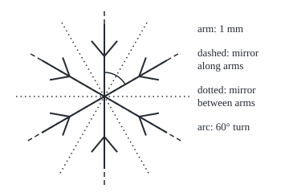

# Symmetry: the moves that leave a shape unchanged, and the seventeen ways to tile a wall

[Syllabus](../../../SYLLABUS.md) → [Geometry and trig](../../../SYLLABUS.md#w05) → [Beyond Euclid](../../../SYLLABUS.md#w05-s06) → Symmetry

---

## General Overview

A snowflake under a microscope has six arms, each about 1 mm long, all branching alike. Turn it by 60° about its centre and it looks the same. So do turns by 120°, 180°, 240°, 300° and no turn: six turns. It can also be flipped over six mirror lines, three along arms and three between them. Twelve moves in all.

A move that keeps every distance and lands a shape on itself is a **symmetry**. Symmetries combine and undo, so the twelve form a group ([Groups](../../03-Algebra/08-Groups/01-groups.md)). The same idea sorts repeating patterns: a border along a strip has one of 7 kinds of symmetry, a wallpaper one of 17. The snowflake's 60° turn fits on a wall; a five-armed star's 72° turn does not.

**A symmetry is a distance-keeping move that lands a shape on itself; symmetries form a group, and for repeating patterns the group's rules leave only 7 kinds of strip and 17 kinds of wall.**

**What kind of fact this is:** a theorem. The twelve moves, the seven strips and the allowed wall turns are proved in Why it works; the 17 applies Conway's magic theorem, proved in *The Symmetries of Things* (Sources).

### The picture: one snowflake, six mirrors, one turn

<p align="center"></p>

To scale, 1 mm = 90 units, centre (130, 120); the tips are the `figure,` line of both runs. The arc turns the top arm onto its neighbour.

---

## The formula

Notation, in words first. $R_\theta$ is the anticlockwise turn by angle $\theta$ about the centre. $F_\varphi$ is the flip in the mirror line through the centre at angle $\varphi$ above the horizontal. Two moves side by side act right to left, the way matrices multiply ([Moving shapes with matrices](../05-Vectors%20in%20Space/04-transformations-with-matrices.md)): in $F_\psi F_\varphi$, $F_\varphi$ acts first.

$$R_\theta = \begin{pmatrix}\cos\theta & -\sin\theta\\ \sin\theta & \cos\theta\end{pmatrix}, \qquad F_\varphi = \begin{pmatrix}\cos 2\varphi & \sin 2\varphi\\ \sin 2\varphi & -\cos 2\varphi\end{pmatrix}$$

$$D_6 = \{\,R_{60k},\; F_{30k} \;:\; k = 0, 1, \dots, 5\,\}, \qquad F_\psi F_\varphi = R_{2(\psi - \varphi)}$$

**Read it aloud:** the snowflake has six turns by multiples of 60° and six flips in lines 30° apart; two flips make a turn by twice the angle between their mirrors.

For a repeating pattern one more line decides which turns can occur. The **trace** of a matrix, written tr, is the sum of its two diagonal entries:

$$\operatorname{tr} R_{360°/n} = 2\cos(360°/n) \in \{-2, -1, 0, 1, 2\} \quad\Longrightarrow\quad n \in \{1, 2, 3, 4, 6\}$$

**Read it aloud:** on a wall, twice the cosine of the smallest turn is whole, so that turn is a full, half, third, quarter or sixth of a revolution.

| Symbol | Plain meaning | In our example | Push it up and the answer… |
| --- | --- | --- | --- |
| $R_\theta$, $R_{60}$ | the turn by angle θ | $R_{60}$: arm to next arm | past 360° it repeats |
| $F_\varphi$, $F_\psi$, $F_0$, $F_{30}$ | the flip in the mirror at that angle | $F_0$ between arms, $F_{30}$ along one | past 180° the same line |
| $\theta$ | a turn angle, in degrees | 60° | — |
| $\varphi$, $\psi$ | two mirror angles | 0° and 30° | a wider gap, a bigger turn |
| $D_6$, $D_{12}$; $k$ | the twelve moves' group, two names in use; k counts 0 to 5 | 6 turns, 6 flips | — |
| $n$ | the fold: a turn by 360°/n comes home after n goes | 6 | 5 or 7 breaks the lattice |
| $\operatorname{tr}$ | trace: the diagonal entries added | tr of $R_{60}$ is 0.5 + 0.5 = 1 | — |

### When it holds

- **Rigid moves.** Allow bending and the moves are endless.
- **A fixed centre, for the twelve.** A finite shape's symmetries fix one point; patterns also slide and glide.
- **A shortest repeat, for 1, 2, 3, 4, 6.** A Penrose tiling never repeats, and five-fold turns return.
- **A flat plane, for 7 and 17.** On a sphere or saddle the costs of Step 5 do not total 2 ([Three geometries](02-spherical-and-hyperbolic-geometry.md)).

---

## Why it works

### Step 0: moves that change nothing form a group

Two symmetries in a row still keep distances and land the flake on itself; each has a reverse; doing nothing is one. Those are the group rules.

### Step 1: twelve moves, counted by the tips

A distance-keeping move that fixes the centre is pinned by where two neighbouring tips go, since every point is pinned by its distances to them and the centre. The top tip can go to 6 places. Its neighbour must stay a neighbour, on one side or the other: 2 choices. So 6 × 2 = 12 moves.

### Step 2: two flips make a turn

Give each point a direction, an angle from the horizontal. The flip $F_\varphi$ sends direction α to 2φ − α, since the mirror sits halfway between a point and its image. Flip again in $F_\psi$: 2ψ − (2φ − α) = α + 2(ψ − φ). Every direction moves by the same amount, so the pair is a turn by 2(ψ − φ).

Mirrors at 0° and 30° give 60°; in the other order, −60°, that is 300°. Order matters. The turns are half the group; the flips are the other block ([Cosets and Lagrange's theorem](../../03-Algebra/08-Groups/04-cosets-and-lagranges-theorem.md)).

### Step 3: a strip has seven kinds

A **frieze** repeats along a strip, like a ceiling border. Besides the slide by one repeat, four moves can occur: a mirror across the strip (V), the mirror along its centre line (H), a half-turn (R), and a **glide** (G): slide half a repeat and flip over the centre line, as footprints do.

They do not switch on freely. A mirror across sends (x, y) to (−x, y); the centre-line mirror then gives (−x, −y), a half-turn: V and H force R. Likewise H and R force V, V and G force R, R and G force V, and V and R force H or G. H with a glide makes a slide shorter than the repeat, so they exclude each other. Of 16 on-off lists, 7 survive.

| Kind | Moves besides the slide | Letters |
| --- | --- | --- |
| - | none | `LLLL` |
| G | glide | `bpbp` |
| V | mirrors across | `VVVV` |
| H | mirror along | `DDDD` |
| R | half-turns | `NNNN` |
| VRG | across, half-turn, glide | `VΛVΛ` |
| VHR | across, along, half-turn | `HHHH` |

### Step 4: a wall turns only by a half, third, quarter or sixth

A wallpaper's slides are the whole-number combinations of two shortest slides, **a** and **b**: a **lattice**, a grid that may lean. A symmetry turn maps the lattice to itself, so it sends **a** and **b** to whole-number combinations of **a** and **b**. On those axes its matrix has whole entries, and so does its trace.

The trace does not depend on the axes. On the usual axes it is 2 cos θ, so 2 cos θ is a whole number from −2 to 2: cos θ is −1, −½, 0, ½ or 1, turns of 180°, 120°, 90°, 60° or 360°. A five-fold turn has 2 cos 72° = 0.6180: no wallpaper has it.

<details>
<summary>Detailed proof: the trace ignores the axes</summary>

New axes turn a matrix `M` into `P^-1 M P`, where `P` holds the new axes as columns. For 2 × 2 matrices, `AB` and `BA` have equal traces: written out, both are the same four products added. With `A = P^-1` and `B = M P`, the trace of `P^-1 M P` equals that of `M P P^-1`, which is `M`'s.

</details>

### Step 5: seventeen walls, by Conway's costs

Fold a wallpaper so that points a symmetry swaps become one point. What remains is a surface with marks, an **orbifold**, each mark with a cost:

- a turn centre of fold n off every mirror, written n: (n − 1)/n;
- a mirror line, written `*`: 1; a turn centre of fold n where mirrors cross, written n after the `*`: (n − 1)/(2n);
- a glide with no mirror, written `×`: 1; a handle, the hole of a doughnut, written `∘`: 2.

Conway's **magic theorem**: a set of marks describes a flat wall exactly when the costs total 2. Flakes on a honeycomb grid make `*632`: 1 + 5/12 + 1/3 + 1/4 = 2. Every set costing exactly 2, listed, gives 17, using only folds 2, 3, 4 and 6, as Step 4 demands.

<details>
<summary>Detailed proof: why 2, and the hand count</summary>

Euler's count, corners minus edges plus faces ([Polyhedra](../02-Circles%20and%20Solids/06-polyhedra-and-eulers-formula.md)), is 2 for a sphere. Glue one repeat's opposite edges and a doughnut results, with count 1 − 2 + 1 = 0. The folded wall is that doughnut shared out evenly, so its count, in fractions, is 0 as well. Each mark lowers a sphere's 2 by its cost, so the costs total 2; Conway, Burgiel and Goodman-Strauss give the full proof.

The count: `∘`; `××`, `*×`, `**`; turn centres alone, `2222`, `333`, `442`, `632`; a glide with turns, `22×`; one mirror, `*2222`, `*333`, `*442`, `*632`, `2*22`, `3*3`, `4*2`, `22*`.

</details>

The classical route counts lattice shapes and the turn-and-flip groups each carries, then adds glides (Armstrong, Sources).

---

## Worked numbers, by hand

| Step | Arithmetic | Value |
| --- | --- | --- |
| where the top tip goes, then its neighbour | 6 × 2 | **12 moves** |
| flip at 0°, then at 30° | 2 × (30° − 0°) | a turn by 60° |
| trace of $R_{60}$ | 2 cos 60° = 0.5000 + 0.5000 | 1.0000, whole: fits a wall |
| a five-fold turn's trace | 2 cos 72° | 0.6180, not whole |
| the snowflake wall `*632` | 1 + 0.4167 + 0.3333 + 0.2500 | 2.0000 |
| sets of marks costing 2 | the hand count | **17** |

### What breaks if you drop a piece

| Mistake | Comes out at | What went wrong |
| --- | --- | --- |
| Count only the turns | 6 moves, not 12 | The flips are symmetries too |
| Treat V, H, R, G as free switches | 16 strip kinds, not 7 | Two moves force a third |
| Allow a five-fold turn on a wall | trace 0.6180 | A lattice turn's trace is whole |

---

## Code, from first principles, and it actually runs

Only math's cos, sin, atan2 and degree conversions are imported. Four counts, two roads each: 12 moves by multiplying $R_{60}$ and $F_0$, and by 46656 tip relabellings; 7 strips from all 4096 strips two cells tall and six long, and from Step 3's rules; the turns by whole matrices of determinant 1, and by the trace; 17 walls by Conway's costs, their folds checked against the matrices. In the output `o` is `∘`, `x` is `×`.

### Python

```python
# Symmetry and tilings: four counts, two roads each.  Standard library only; math gives cos, sin, atan2.
from math import cos, sin, atan2, radians, degrees
def turn(t): c, s = cos(radians(t)), sin(radians(t)); return (c, -s, s, c)          # R_theta
def flip(p): c, s = cos(radians(2 * p)), sin(radians(2 * p)); return (c, s, s, -c)  # F_phi
def mul(a, b):  # the 2 x 2 matrix a times b, entries row by row: b acts first, then a
    return (a[0]*b[0] + a[1]*b[2], a[0]*b[1] + a[1]*b[3], a[2]*b[0] + a[3]*b[2], a[2]*b[1] + a[3]*b[3])
def key(m): return tuple(round(v * 1e6) for v in m)
def imp(a, b): return b or not a
moves, todo = {key(turn(0)): turn(0)}, [turn(0)]         # road 1: close up R_60 and F_0
while todo:
    q = todo.pop()
    for m in (mul(turn(60), q), mul(flip(0), q)):
        if key(m) not in moves: moves[key(m)] = m; todo.append(m)
tipmaps = sum(1 for f in ([c // 6 ** i % 6 for i in range(6)] for c in range(6 ** 6))  # road 2: relabel tips
              if len(set(f)) == 6 and all((f[(i + 1) % 6] - f[i]) % 6 in (1, 5) for i in range(6)))
W, found, rules = 6, set(), set()                         # strips: 6 cells long, 2 rows, repeating
def img(S, fx, fy): return frozenset((fx(x) % W, fy(y)) for x, y in S)
def has(S, fx, fy, cs): return any(img(S, lambda x: fx(x, c), fy) == S for c in cs)
same, over, slide, mirror = (lambda y: y), (lambda y: 1 - y), (lambda x, c: x + c), (lambda x, c: c - x)
for code in range(2 ** (2 * W)):                          # road 1: every strip, its symmetries read off
    S = frozenset((i % W, i // W) for i in range(2 * W) if code >> i & 1)
    p = min(d for d in (1, 2, 3, 6) if has(S, slide, same, [d]))
    found.add((has(S, mirror, same, range(W)), has(S, slide, over, [0]), has(S, mirror, over, range(W)),
               has(S, slide, over, [t for t in range(1, W) if t % p])))
for V, H, R, G in [tuple(bool(code >> i & 1) for i in range(4)) for code in range(16)]:  # road 2: rules
    if not (H and G) and imp(V and H, R) and imp(H and R, V) and imp(V and R, H or G) and imp(V and G, R) and imp(R and G, V):
        rules.add((V, H, R, G))
def name(k): return "".join(l for l, f in zip("VHRG", k) if f) or "-"
def pw(m, k): return m if k == 1 else mul(m, pw(m, k - 1))
def order(m): return next((k for k in range(1, 13) if pw(m, k) == (1, 0, 0, 1)), 0)
lattice = sorted({order((a, b, c, d)) for a in range(-2, 3) for b in range(-2, 3) for c in range(-2, 3)
                  for d in range(-2, 3) if a * d - b * c == 1} - {0})       # every whole-number turn matrix
trace = [n for n in range(1, 13) if abs(2 * cos(radians(360 / n)) - round(2 * cos(radians(360 / n)))) < 1e-9]
L, walls = 55440, []                                      # costs counted in 55440ths: whole numbers
pre, post = (lambda n: L * (n - 1) // n), (lambda n: L * (n - 1) // (2 * n))  # turn centre off / on mirrors
def bags(cost, budget, low=2):  # every multiset of turn orders >= low whose costs fit the budget
    return [((), 0)] + [((n,) + b, cost(n) + k) for n in range(low, 13) if cost(n) <= budget for b, k in bags(cost, budget - cost(n), n)]
for h, s, x, left in [(h, s, x, L * (2 - 2 * h - s - x)) for h in (0, 1) for s in (0, 1, 2) for x in (0, 1, 2) if 2 * h + s + x <= 2]:
    for a, ca in bags(pre, left):
        for b, cb in (bags(post, left - ca) if s == 1 else [((), 0)]):
            if ca + cb == left: walls.append("o" * h + "".join(map(str, a[::-1])) + "*" * s + "".join(map(str, b[::-1])) + "x" * x)
digits, top = sorted({int(ch) for w in walls for ch in w if ch.isdigit()}), [max([int(ch) for ch in w if ch.isdigit()] + [1]) for w in walls]
f60, f300 = (round(degrees(atan2(m[2], m[0]))) % 360 for m in (mul(flip(30), flip(0)), mul(flip(0), flip(30))))
turns = sum(1 for m in moves.values() if m[0] * m[3] - m[1] * m[2] > 0)       # a turn keeps the clockwise order
print(f"snowflake moves, closing up R_60 and F_0: {len(moves)} ({turns} turns, {len(moves) - turns} flips)",
      f"tip relabellings keeping neighbours, of 6^6 = {6 ** 6}: {tipmaps}",
      f"R_60 = ({turn(60)[0]:.4f}, {turn(60)[1]:.4f}; {turn(60)[2]:.4f}, {turn(60)[3]:.4f}), trace {turn(60)[0] + turn(60)[3]:.4f}",
      f"F_0 then F_30: turn by {f60} deg; F_30 then F_0: turn by {f300} deg",
      f"strip kinds from all {2 ** (2 * W)} strips: {len(found)}: {', '.join(sorted(map(name, found)))}",
      f"strip kinds from the rules, of 16 on-off lists: {len(rules)}: {', '.join(sorted(map(name, rules)))}", sep="\n")
print(f"turn orders of whole-number matrices: {lattice}; by the trace 2cos: {trace}",
      f"5-fold: 2cos(72 deg) = {2 * cos(radians(72)):.4f}, not whole", f"cost of 632 = {pre(6) / L:.4f} + {pre(3) / L:.4f} + {pre(2) / L:.4f} = {(pre(6) + pre(3) + pre(2)) / L:.4f}; of *632 = 1 + {post(6) / L:.4f} + {post(3) / L:.4f} + {post(2) / L:.4f} = {1 + (post(6) + post(3) + post(2)) / L:.4f}", sep="\n")
print(f"wall signatures costing exactly 2: {len(walls)}", "  " + " ".join(sorted(walls)),
      f"turn orders used: {digits}; count by largest turn: " + ", ".join(f"{n}: {top.count(n)}" for n in (1, 2, 3, 4, 6)),
      "figure, centre (130, 120), 1 mm = 90 units, tips " + " ".join(f"({130 + 90 * cos(radians(90 + 60 * k)):.2f}, {120 - 90 * sin(radians(90 + 60 * k)):.2f})" for k in range(6)), sep="\n")
assert len(moves) == tipmaps == 12                         # matrices against relabelled tips
assert found == rules and len(rules) == 7                  # brute force against the rules
assert lattice == trace == [1, 2, 3, 4, 6]                 # whole-number matrices against the trace
assert len(walls) == 17 and digits == [n for n in lattice if n > 1]   # costs against the lattice
print("ALL CHECKS PASS")
```

**Ran 2026-09-24 on macOS, Python 3.14.6, standard library only. All checks passed. Output, pasted from the run:**

```
snowflake moves, closing up R_60 and F_0: 12 (6 turns, 6 flips)
tip relabellings keeping neighbours, of 6^6 = 46656: 12
R_60 = (0.5000, -0.8660; 0.8660, 0.5000), trace 1.0000
F_0 then F_30: turn by 60 deg; F_30 then F_0: turn by 300 deg
strip kinds from all 4096 strips: 7: -, G, H, R, V, VHR, VRG
strip kinds from the rules, of 16 on-off lists: 7: -, G, H, R, V, VHR, VRG
turn orders of whole-number matrices: [1, 2, 3, 4, 6]; by the trace 2cos: [1, 2, 3, 4, 6]
5-fold: 2cos(72 deg) = 0.6180, not whole
cost of 632 = 0.8333 + 0.6667 + 0.5000 = 2.0000; of *632 = 1 + 0.4167 + 0.3333 + 0.2500 = 2.0000
wall signatures costing exactly 2: 17
  ** *2222 *333 *442 *632 *x 2*22 22* 2222 22x 3*3 333 4*2 442 632 o xx
turn orders used: [2, 3, 4, 6]; count by largest turn: 1: 4, 2: 5, 3: 3, 4: 3, 6: 2
figure, centre (130, 120), 1 mm = 90 units, tips (130.00, 30.00) (52.06, 75.00) (52.06, 165.00) (130.00, 210.00) (207.94, 165.00) (207.94, 75.00)
ALL CHECKS PASS
```

### Rust

Same numbers, same labels, built with `rustc --edition 2021 -O`.

```rust
// Symmetry and tilings: the same four counts as the Python, two roads each.  No crates.
use std::collections::BTreeSet;
type M = [f64; 4];
fn turn(t: f64) -> M { let (s, c) = t.to_radians().sin_cos(); [c, -s, s, c] }          // R_theta
fn flip(p: f64) -> M { let (s, c) = (2.0 * p).to_radians().sin_cos(); [c, s, s, -c] }  // F_phi
fn mul(a: M, b: M) -> M { [a[0]*b[0] + a[1]*b[2], a[0]*b[1] + a[1]*b[3], a[2]*b[0] + a[3]*b[2], a[2]*b[1] + a[3]*b[3]] }
fn imul(a: [i64; 4], b: [i64; 4]) -> [i64; 4] { [a[0]*b[0] + a[1]*b[2], a[0]*b[1] + a[1]*b[3], a[2]*b[0] + a[3]*b[2], a[2]*b[1] + a[3]*b[3]] }
fn key(m: M) -> [i64; 4] { m.map(|v| (v * 1e6).round() as i64) }
fn angle(m: M) -> i64 { (m[2].atan2(m[0]).to_degrees().round() as i64).rem_euclid(360) }
fn imp(a: bool, b: bool) -> bool { b || !a }
fn has(s: u32, g: fn(i64, i64, i64) -> (i64, i64), cs: &[i64]) -> bool {   // is strip s unchanged by g, for some c?
    cs.iter().any(|&c| { let mut o = 0u32;
        for i in 0..12i64 { if s >> i & 1 == 1 { let (x, y) = g(i % 6, i / 6, c); o |= 1u32 << (y * 6 + x.rem_euclid(6)); } }
        o == s })
}
fn name(k: [bool; 4]) -> String { let s: String = "VHRG".chars().zip(k).filter(|p| p.1).map(|p| p.0).collect(); if s.is_empty() { "-".into() } else { s } }
fn order(m: [i64; 4]) -> i64 { let mut q = m; for k in 1..13 { if q == [1, 0, 0, 1] { return k } q = imul(m, q) } 0 }
const L: i64 = 55440;                                                   // costs counted in 55440ths
fn cost(n: i64, on: bool) -> i64 { if on { L * (n - 1) / (2 * n) } else { L * (n - 1) / n } }  // centre on / off mirrors
fn bags(on: bool, budget: i64, low: i64) -> Vec<(Vec<i64>, i64)> {     // multisets of turn orders fitting the budget
    let mut out = vec![(vec![], 0)];
    for n in low..13 { if cost(n, on) <= budget { for (b, k) in bags(on, budget - cost(n, on), n) {
        let mut v = vec![n]; v.extend(b); out.push((v, cost(n, on) + k)); } } }
    out
}
fn digits(v: &[i64]) -> String { v.iter().rev().map(|d| d.to_string()).collect() }
fn main() {
    let (mut moves, mut todo) = (vec![(key(turn(0.0)), turn(0.0))], vec![turn(0.0)]);   // road 1: close up R_60, F_0
    while let Some(q) = todo.pop() {
        for m in [mul(turn(60.0), q), mul(flip(0.0), q)] { if !moves.iter().any(|e| e.0 == key(m)) { moves.push((key(m), m)); todo.push(m); } }
    }
    let turns = moves.iter().filter(|e| e.1[0] * e.1[3] - e.1[1] * e.1[2] > 0.0).count();  // a turn keeps clockwise order
    let tipmaps = (0..46656i64).filter(|c| { let f: Vec<i64> = (0..6).map(|i| c / 6i64.pow(i) % 6).collect();   // road 2
        f.iter().collect::<BTreeSet<_>>().len() == 6 && (0..6).all(|i| [1, 5].contains(&(f[(i + 1) % 6] - f[i]).rem_euclid(6))) }).count();
    let mut found = BTreeSet::new();                                    // strips: 6 cells long, 2 rows, repeating
    for s in 0..4096u32 {                                               // road 1: every strip, read off
        let p = [1, 2, 3, 6].into_iter().find(|&d| has(s, |x, y, c| (x + c, y), &[d])).unwrap();
        let glides: Vec<i64> = (1..6).filter(|t| t % p != 0).collect();
        found.insert([has(s, |x, y, c| (c - x, y), &[0, 1, 2, 3, 4, 5]), has(s, |x, y, c| (x + c, 1 - y), &[0]),
                      has(s, |x, y, c| (c - x, 1 - y), &[0, 1, 2, 3, 4, 5]), has(s, |x, y, c| (x + c, 1 - y), &glides)]);
    }
    let mut rules = BTreeSet::new();                                    // road 2: the composition rules alone
    for code in 0..16 { let [v, h, r, g] = [0, 1, 2, 3].map(|i| code >> i & 1 == 1);
        if !(h && g) && imp(v && h, r) && imp(h && r, v) && imp(v && r, h || g) && imp(v && g, r) && imp(r && g, v) { rules.insert([v, h, r, g]); } }
    let names = |k: &BTreeSet<[bool; 4]>| { let mut n: Vec<String> = k.iter().map(|&x| name(x)).collect(); n.sort(); n.join(", ") };
    let mut lat = BTreeSet::new();                                      // every whole-number turn matrix
    for a in -2..3 { for b in -2..3 { for c in -2..3 { for d in -2..3 { if a * d - b * c == 1 && order([a, b, c, d]) > 0 { lat.insert(order([a, b, c, d])); } } } } }
    let lattice: Vec<i64> = lat.into_iter().collect();
    let trace: Vec<i64> = (1..13).filter(|&n| { let t = 2.0 * (360.0 / n as f64).to_radians().cos(); (t - t.round()).abs() < 1e-9 }).collect();
    let mut walls: Vec<String> = Vec::new();
    for h in 0..2 { for s in 0..3 { for x in 0..3 { if 2 * h + s + x > 2 { continue } let left = L * (2 - 2 * h - s - x);
        for (a, ca) in bags(false, left, 2) { for (b, cb) in if s == 1 { bags(true, left - ca, 2) } else { vec![(vec![], 0)] } {
            if ca + cb == left { walls.push(format!("{}{}{}{}{}", "o".repeat(h as usize), digits(&a), "*".repeat(s as usize), digits(&b), "x".repeat(x as usize))); } } } } } }
    walls.sort();
    let used: Vec<i64> = walls.iter().flat_map(|w| w.chars().filter_map(|c| c.to_digit(10))).map(|d| d as i64).collect::<BTreeSet<_>>().into_iter().collect();
    let top: Vec<i64> = walls.iter().map(|w| w.chars().filter_map(|c| c.to_digit(10)).max().unwrap_or(1) as i64).collect();
    let (r60, f) = (turn(60.0), |n: i64, on: bool| cost(n, on) as f64 / L as f64);
    println!("snowflake moves, closing up R_60 and F_0: {} ({} turns, {} flips)", moves.len(), turns, moves.len() - turns);
    println!("tip relabellings keeping neighbours, of 6^6 = 46656: {}", tipmaps);
    println!("R_60 = ({:.4}, {:.4}; {:.4}, {:.4}), trace {:.4}", r60[0], r60[1], r60[2], r60[3], r60[0] + r60[3]);
    println!("F_0 then F_30: turn by {} deg; F_30 then F_0: turn by {} deg", angle(mul(flip(30.0), flip(0.0))), angle(mul(flip(0.0), flip(30.0))));
    println!("strip kinds from all 4096 strips: {}: {}", found.len(), names(&found));
    println!("strip kinds from the rules, of 16 on-off lists: {}: {}", rules.len(), names(&rules));
    println!("turn orders of whole-number matrices: {:?}; by the trace 2cos: {:?}", lattice, trace);
    println!("5-fold: 2cos(72 deg) = {:.4}, not whole", 2.0 * 72f64.to_radians().cos());
    println!("cost of 632 = {:.4} + {:.4} + {:.4} = {:.4}; of *632 = 1 + {:.4} + {:.4} + {:.4} = {:.4}", f(6, false), f(3, false), f(2, false),
             (cost(6, false) + cost(3, false) + cost(2, false)) as f64 / L as f64, f(6, true), f(3, true), f(2, true), 1.0 + (cost(6, true) + cost(3, true) + cost(2, true)) as f64 / L as f64);
    println!("wall signatures costing exactly 2: {}\n  {}", walls.len(), walls.join(" "));
    println!("turn orders used: {:?}; count by largest turn: {}", used, [1, 2, 3, 4, 6].map(|n| format!("{}: {}", n, top.iter().filter(|&&t| t == n).count())).join(", "));
    println!("figure, centre (130, 120), 1 mm = 90 units, tips {}", (0..6).map(|k| { let a = (90.0 + 60.0 * k as f64).to_radians();
        format!("({:.2}, {:.2})", 130.0 + 90.0 * a.cos(), 120.0 - 90.0 * a.sin()) }).collect::<Vec<_>>().join(" "));
    assert!(moves.len() == 12 && tipmaps == 12);                        // matrices against relabelled tips
    assert!(found == rules && rules.len() == 7);                        // brute force against the rules
    assert!(lattice == trace && lattice == vec![1, 2, 3, 4, 6]);         // whole-number matrices against the trace
    assert!(walls.len() == 17 && used == lattice[1..].to_vec());        // costs against the lattice
    println!("ALL CHECKS PASS");
}
```

**Ran 2026-09-24 on macOS, rustc 1.98.1, no crates. All checks passed. Output, pasted from the run:**

```
snowflake moves, closing up R_60 and F_0: 12 (6 turns, 6 flips)
tip relabellings keeping neighbours, of 6^6 = 46656: 12
R_60 = (0.5000, -0.8660; 0.8660, 0.5000), trace 1.0000
F_0 then F_30: turn by 60 deg; F_30 then F_0: turn by 300 deg
strip kinds from all 4096 strips: 7: -, G, H, R, V, VHR, VRG
strip kinds from the rules, of 16 on-off lists: 7: -, G, H, R, V, VHR, VRG
turn orders of whole-number matrices: [1, 2, 3, 4, 6]; by the trace 2cos: [1, 2, 3, 4, 6]
5-fold: 2cos(72 deg) = 0.6180, not whole
cost of 632 = 0.8333 + 0.6667 + 0.5000 = 2.0000; of *632 = 1 + 0.4167 + 0.3333 + 0.2500 = 2.0000
wall signatures costing exactly 2: 17
  ** *2222 *333 *442 *632 *x 2*22 22* 2222 22x 3*3 333 4*2 442 632 o xx
turn orders used: [2, 3, 4, 6]; count by largest turn: 1: 4, 2: 5, 3: 3, 4: 3, 6: 2
figure, centre (130, 120), 1 mm = 90 units, tips (130.00, 30.00) (52.06, 75.00) (52.06, 165.00) (130.00, 210.00) (207.94, 165.00) (207.94, 75.00)
ALL CHECKS PASS
```

> [!TIP]
> **Try changing**
> Guess first, then run it.
> - **A square tile.** Replace `turn(60)` with `turn(90)` in the first road. Guess: 8 moves, 4 turns and 4 flips. The first assert stops it: the tips still give 12.
> - **A shorter strip.** Set `W` to 4 and the repeat list to `(1, 2, 4)`. Only 5 kinds appear, so the second assert stops it: in 4 cells a lone glide or a lone centre-line mirror always brings a cross mirror too.

---

## The usual mistake

> [!warning]
> **Counting pictures instead of symmetries.** Wallpaper designs are endless; wallpaper groups are 17. Ducks and stars can share one group.
>
> - **Forgetting the flips.** A snowflake has 12 symmetries, not 6; a pinwheel, being one-handed, keeps just its turns.
> - **Reading a product left to right.** $F_{30}F_0$ means $F_0$ first; read backwards it gives 300°, not 60°.
> - **Taking a glide for a mirror.** Footprints flipped over the centre line land between two others; the half-repeat slide completes the move.

---

## Where you meet it in real life

- **Snow and crystals.** Ice builds on a six-fold lattice, so flakes grow six arms. In three dimensions the count is 230 space groups, the language of X-ray crystallography.
- **Quasicrystals.** In 1982 Dan Shechtman saw five-fold symmetry in an alloy: ordered atoms that never repeat, so Step 4 does not apply. It won the 2011 Nobel Prize in Chemistry.
- **Tilework.** The Alhambra shows many of the 17. Costs below 2 give polyhedra, above 2 Escher's *Circle Limit* prints ([Three geometries](02-spherical-and-hyperbolic-geometry.md)). Drawing the snowflake's hexagon without a protractor is [Ruler and compass](03-ruler-and-compass-constructions.md).

> **Say it back**
> A symmetry keeps distances and lands a shape on itself; symmetries form a group. A snowflake has six turns and six flips; two flips make a turn. A strip mixes its moves in 7 ways, since two force a third. A wall turns only by a half, third, quarter or sixth, since its turns have whole traces. Conway's costs, totalling 2, leave 17 walls.

---

## What this builds on

- [Moving shapes with matrices](../05-Vectors%20in%20Space/04-transformations-with-matrices.md): turns and flips as 2 × 2 matrices, multiplied right to left.
- [Groups](../../03-Algebra/08-Groups/01-groups.md): the four rules the twelve moves obey.

## Where this goes next

- Orientability: the folded wall `××` is a one-sided Klein bottle.
- Modular forms: functions unchanged by symmetries of the saddle-shaped plane.
- Sphere, torus and projective plane: the torus a plain repeating wall, `∘`, folds into.

A wall folded by its symmetries is a surface, a torus or a Klein bottle; which surfaces exist, and which have one side, the orientability card answers.

---

## Sources

Verified 2026-09-24: every link below resolves to the publisher's page.

- Conway, John H., Heidi Burgiel and Chaim Goodman-Strauss. *The Symmetries of Things*. A K Peters / CRC Press, 2008. [Publisher page](https://www.routledge.com/The-Symmetries-of-Things/Conway-Burgiel-Goodman-Strauss/p/book/9781568812205). The magic theorem with proof; the 7 friezes and 17 walls.
- Armstrong, M. A. *Groups and Symmetry*. Springer, 1988. [Publisher page](https://link.springer.com/book/10.1007/978-1-4757-4034-9). The turn restriction and the classical count.
- Judson, Thomas W. *Abstract Algebra: Theory and Applications*, 2020. [Publisher page and full text](https://scholarworks.sfasu.edu/ebooks/23/). Free; symmetry as matrices, and the wallpaper groups.
- Weyl, Hermann. *Symmetry*. Princeton University Press, 1952. [Publisher page](https://press.princeton.edu/books/paperback/9780691173252/symmetry). Ornament, crystals and groups in one essay.
