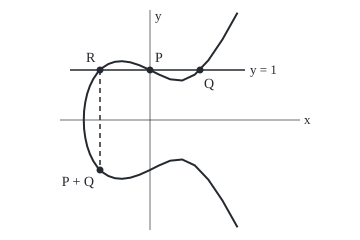
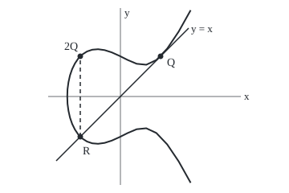

# Elliptic curves: a cubic curve whose points can be added like numbers

Geometry and trig → Beyond Euclid → Arithmetic on a cubic → Elliptic curves

---

## General Overview

Take the curve of points where y squared equals x cubed minus x plus 1. Two of its points with whole-number coordinates are P at (0, 1) and Q at (1, 1). Adding their coordinates gives (1, 2), which is off the curve.

A drawing gives a rule that stays on it. Draw the straight line through P and Q, here the level line at height 1. It meets the curve a third time, at (−1, 1). Reflect that point in the x-axis: (−1, −1). That reflected point is P + Q. To add a point to itself, use the line that touches the curve there, the tangent: Q + Q is (−1, 1).

Adding Q again and again gives (0, −1), (3, −5), (5, 11), then (1/4, 7/8), and by nine copies (56, −419). The rule only adds, subtracts, multiplies and divides, so fractions in give fractions out: rational points. A curve of this shape is an **elliptic curve**. The name is inherited from measuring arcs of ellipses; the curve is no ellipse.

**Chord, third crossing, reflection: that rule adds any two points of an elliptic curve and lands on the curve, and with one extra point as zero it obeys the laws of ordinary addition.**

**What kind of fact this is:** a theorem. The rule is a definition; that it obeys the group laws is proved in Why it works, except associativity: checked in code, proved in Step 4 for points in general position, in full in elliptic-curves-and-the-group-law.

### The picture: adding P and Q

<p align="center"></p>

Drawn at 1 unit = 50 drawing units. The curve meets the x-axis once, at x = −1.3247, and mirrors itself across it. The dashed reflection carries R to P + Q.

---

## The formula

An elliptic curve here is $y^2 = x^3 + ax + b$, with fixed numbers $a$ and $b$; on this card $a$ is −1 and $b$ is 1. To add $P$ at $(x_1, y_1)$ and $Q$ at $(x_2, y_2)$, first find the slope $m$ of the chord, or of the tangent when the points agree:

$$m = \frac{y_2 - y_1}{x_2 - x_1} \quad\text{or}\quad m = \frac{3x_1^2 + a}{2y_1}$$

Then the sum $P + Q$ is the point $(x_3, y_3)$:

$$x_3 = m^2 - x_1 - x_2, \qquad y_3 = m(x_1 - x_3) - y_1$$

**Read it aloud:** square the slope and take away both starting x-coordinates; follow the line to that x, then flip the sign of the height.

One extra point, $O$, is the zero: $P + O = P$, the reflection $(x, -y)$ is $-P$, and $P + (-P) = O$.

| Symbol | Plain meaning | In our example | Push it up and the answer… |
| --- | --- | --- | --- |
| $a$, $b$ | the curve's fixed numbers | −1 and 1 | a different curve |
| $P$, $Q$, $W$ | points on the curve; $W$ a third, for grouping | (0, 1), (1, 1) | — |
| $x_1$, $y_1$, $x_2$, $y_2$ | coordinates of $P$ and $Q$ | 0, 1 and 1, 1 | the sum moves |
| $m$ | slope of the chord or tangent | 0 for P + Q; 1 for Q + Q | $m^2$ grows (for $m$ above 0): third crossing moves right |
| $k$ | height where the line $y = mx + k$ meets the y-axis | 1 | — |
| $R$ | the line's third crossing, before reflecting | (−1, 1) | — |
| $x_3$, $y_3$ | coordinates of the sum | −1, −1 | — |
| $O$, $nQ$ | the zero point; $Q$ added to itself n times | 9Q is (56, −419) | longer fractions as n grows |

### When it holds

- **No cusp or self-crossing.** $4a^3 + 27b^2$ must not be zero; here it is 23. For y squared equals x cubed it is zero: a sharp point at the origin, where the tangent rule fails.
- **One curve.** Both points must lie on the same curve; the formulas never check this.
- **Vertical lines go to O.** When $x_1 = x_2$ and $y_1 = -y_2$, the slope would divide by zero; the answer is $O$.
- **Division must work.** Fractions, or remainders mod a prime such as 7. Mod 2 and mod 3 need a longer equation.

---

## Why it works

### Step 0: a line meets a cubic three times

A line put into the curve's equation gives a cubic in x. Two known crossings are two of its roots, and they force the third. Taken as the sum, that third point leaves nothing acting as zero; Step 3 shows why reflecting fixes this.

### Step 1: the third crossing, from the sum of the roots

Put the line $y = mx + k$ into $y^2 = x^3 + ax + b$ and collect terms:

$$x^3 - m^2x^2 + (a - 2mk)\,x + (b - k^2) = 0$$

The crossings are its roots $x_1$, $x_2$, $x_3$, so the left side is $(x - x_1)(x - x_2)(x - x_3)$, whose $x^2$ term is minus the sum of the roots. So $x_1 + x_2 + x_3 = m^2$: the formula for $x_3$. $R$ has height $mx_3 + k$, which is $y_1 + m(x_3 - x_1)$; reflecting flips the sign, giving $y_3$. Only the four operations appear, so rational points give rational sums: the rule is closed.

### Step 2: the tangent slope, without calculus

Doubling has no second point for a chord. Write the curve's equation at a point $(x, y)$ and at $P$, and subtract:

$$(y - y_1)(y + y_1) = (x - x_1)(x^2 + x\,x_1 + x_1^2 + a)$$

On a line through $P$, $y - y_1$ is $m(x - x_1)$. Cancel $x - x_1$, the crossing at $P$ itself; every other crossing satisfies $m(y + y_1) = x^2 + x\,x_1 + x_1^2 + a$. The line touches at $P$ when $P$ is a crossing twice over: when $P$ also satisfies this equation. Put in $P$: $2y_1m = 3x_1^2 + a$, the tangent slope. At Q it is 1: the line y = x.

### The picture: doubling Q

<p align="center"></p>

Same scale. The tangent at Q crosses again at R (−1, −1); reflected, Q + Q is (−1, 1).

### Step 3: the extra point O, and why the reflection

A vertical line meets the curve in only two ordinary points, a point and its mirror image. Add one point $O$ on every vertical line, pictured infinitely far up and down; now every line meets the curve three times. The line through $P$ and $O$ is the vertical at $P$; its third crossing is $-P$, and reflecting gives back $P$. So $P + O = P$. Without the reflection the answer would be $-P$, and nothing would act as zero. The vertical through $P$ and $-P$ meets $O$, its own reflection, so $P + (-P) = O$. A point of height zero is its own mirror image, and doubling it gives $O$.

### Step 4: the group laws

A group ([groups](../../03-Algebra/08-Groups/01-groups.md)) needs closure (Step 1), a zero and an undo (Step 3), and associativity. Order does not matter either: the line through $P$ and $Q$ is the line through $Q$ and $P$. Associativity says

$$(P + Q) + W = P + (Q + W)$$

for any third point $W$. It holds on every elliptic curve, but no single drawing shows it. The code checks 216 rational triples: evidence, not proof.

<details>
<summary>Detailed proof</summary>

For points in general position (no two equal). Write S for P + Q and T for Q + W. Three lines: through P, Q, −S; through S, W, −(S + W); the vertical through T, −T, O. Three more: through Q, W, −T; the vertical through S, −S, O; through P, T, −(P + T).

Each set of three lines is one cubic curve (multiply their equations). Both pass through the eight points P, Q, W, O, S, −S, T, −T. The Cayley–Bacharach theorem: when two cubics meet in exactly nine points, any cubic through eight of them passes through the ninth. The elliptic curve meets the first cubic in the eight and in −(S + W), so the second cubic passes through −(S + W) too. Its ninth point on the elliptic curve is −(P + T), so the two agree; reflect. Coinciding points need the algebraic proof in the MIT notes.

</details>

### Step 5: a small curve where every case can be checked

The rule uses only the four operations, so it runs on remainders mod 7, where dividing by a number means multiplying by its partner: the number whose product with it leaves remainder 1. There $4a^3 + 27b^2$ is 23, remainder 2, not zero, so no cusp. The same equation mod 7 has 12 points, $O$ included: (0,1), (0,6), (1,1), (1,6), (2,0), (3,2), (3,5), (5,3), (5,4), (6,1), (6,6). Here 6 stands for −1, so (0,6) mirrors (0,1), and (2,0) mirrors itself. The code tries all 1728 triples. With finitely many points, that exhaustive check proves associativity for this one curve.

The other road is algebra: expand both sides with the formulas, as elliptic-curves-and-the-group-law does.

---

## Worked numbers, by hand

| Step | Arithmetic | Value |
| --- | --- | --- |
| curve test | $4(-1)^3 + 27(1)^2$ | 23, not zero |
| chord slope, P + Q | $(1 - 1) \div (1 - 0)$ | 0 |
| x and y | $0 - 0 - 1$; $0 - 1$ | **P + Q = (−1, −1)** |
| tangent slope at Q | $(3 - 1) \div 2$ | 1 |
| x and y | $1 - 1 - 1$; $1 \times 2 - 1$ | **Q + Q = (−1, 1)** |
| tangent slope at P | $(0 - 1) \div 2$ | −1/2 |
| x and y | $1/4 - 0 - 0$; $-\tfrac12(0 - 1/4) - 1$ | **P + P = (1/4, −7/8)** |
| on the curve? | $(-7/8)^2$ and $(1/4)^3 - 1/4 + 1$ | 49/64 both |

### What breaks if you drop a piece

| Mistake | Comes out at | What went wrong |
| --- | --- | --- |
| Add the coordinates | (1, 2), off the curve | ignores the curve |
| Skip the reflection | (−1, 1) for P + Q | that is R; O stops being a zero |
| Drop $a$ from the tangent slope | slope 3/2, Q + Q at (1/4, 1/8), off the curve | not the tangent |

---

## Code, from first principles, and it actually runs

Exact fractions throughout (Python's Fraction; in Rust, written from scratch). Two roads to each sum: the slope formula, and a scan that walks along the line in small steps, notes where the curve's equation changes sign, and pins each crossing down by halving. A touching point shows no sign change, so a tangent's scan finds only the new crossing. Then the group laws: 6Q two ways, 216 rational triples, every triple mod 7.

### Python

```python
# Elliptic curves -- the check behind the card.  Standard library only; Fraction is
# exact arithmetic on fractions, nothing more.  Curve y^2 = x^3 - x + 1.  Each sum by the
# slope formula and by scanning the line for its crossings; group laws on samples, then mod 7.
from fractions import Fraction as F
A, B, O = -1, 1, None                          # coefficients a, b; O, the point at infinity

def red(v, n): return v % n if n else v        # n = 0: fractions; n = 7: remainders mod 7
def div(u, v, n): return F(u, v) if n == 0 else u * next(t for t in range(n) if v * t % n == 1)
def on(p, n=0): return p is O or red(p[1] ** 2 - p[0] ** 3 - A * p[0] - B, n) == 0
def neg(p, n=0): return O if p is O else (p[0], red(-p[1], n))
def slope(p, q, n=0):                          # tangent if the points agree, else chord
    if p == q: return red(div(3 * p[0] ** 2 + A, 2 * p[1], n), n)
    return red(div(q[1] - p[1], q[0] - p[0], n), n)
def add(p, q, n=0):                            # road one: x3 = m^2 - x1 - x2, then reflect
    if p is O or q is O: return q if p is O else p
    if p[0] == q[0] and red(p[1] + q[1], n) == 0: return O   # vertical line
    m = slope(p, q, n); x3 = red(m * m - p[0] - q[0], n)
    return (x3, red(m * (p[0] - x3) - p[1], n))
def crossings(m, k):                           # road two: where y = mx + k meets the curve,
    g = lambda x: x ** 3 + A * x + B - (m * x + k) ** 2      # found by sign changes in steps
    roots = []                                 # of 0.01 from -5, then halving 60 times
    for i in range(1000):
        lo, hi = -5.0037 + i / 100, -4.9937 + i / 100
        if g(lo) * g(hi) < 0:
            for _ in range(60): lo, hi = (lo, (lo + hi) / 2) if g(lo) * g((lo + hi) / 2) <= 0 else ((lo + hi) / 2, hi)
            roots.append(lo)
    return roots
show = lambda p: "O" if p is O else f"({p[0]},{p[1]})"; yes = lambda t: "yes" if t else "no"

P, Q, mult = (F(0), F(1)), (F(1), F(1)), [O]
print(f"curve y^2 = x^3 - x + 1: 4a^3 + 27b^2 = {4 * A ** 3 + 27 * B ** 2}, not zero, so no cusp or crossing")
for name, p, q in (("P + Q", P, Q), ("Q + Q", Q, Q), ("P + P", P, P)):
    s, m = add(p, q), float(slope(p, q)); k = float(p[1]) - m * float(p[0])
    xs = crossings(m, k); x = [v for v in xs if min(abs(v - p[0]), abs(v - q[0])) > 1e-6][0]
    print(f"{name}: slope {slope(p, q)}, sum {show(s)}, y^2 {s[1] ** 2} = x^3 - x + 1 {s[0] ** 3 + A * s[0] + B}; crosses at "
          + ", ".join(f"{round(v, 4) + 0.0:.4f}" for v in xs) + f"; new one reflected ({x:.4f},{-(m * x + k):.4f})")
    assert abs(x - s[0]) < 1e-9 and abs(-(m * x + k) - s[1]) < 1e-9   # exact and scanned agree
for i in range(9): mult.append(add(mult[-1], Q))
for lo, hi in ((1, 6), (6, 10)): print("multiples:", ", ".join(f"{i}Q {show(mult[i])}" for i in range(lo, hi)))
print(f"6Q by six additions {show(mult[6])}; minus the tangent double of P {show(neg(add(P, P)))}")
assert mult[6] == neg(add(P, P))               # two routes through the group, one point
S = [O, P, Q, neg(Q), mult[2], (F(3), F(5))]
bad = sum(add(add(u, v), w) != add(u, add(v, w)) for u in S for v in S for w in S)
print(f"associativity on {len(S) ** 3} rational triples: {bad} failures (a sample, not a proof)")
m = F(3, 2); x3 = m * m - 2; wrong = (x3, m * (1 - x3) - 1)   # tangent slope at Q with a dropped
print(f"mistakes: (0+1,1+1) = (1,2) on curve {yes(on((F(1), F(2))))}; unreflected {show(neg(add(P, Q)))}; "
      f"tangent without a: slope {m}, {show(wrong)} on curve {yes(on(wrong))}")
pts = [O] + [(x, y) for x in range(7) for y in range(7) if on((x, y), 7)]
print("mod 7:", len(pts), "points:", " ".join(show(p) for p in pts))
bad7 = sum(add(add(u, v, 7), w, 7) != add(u, add(v, w, 7), 7) for u in pts for v in pts for w in pts)
laws = all(on(add(u, v, 7), 7) and add(u, v, 7) == add(v, u, 7) and add(u, neg(u, 7), 7) is O for u in pts for v in pts)
print(f"mod 7: {len(pts) ** 3} triples, {bad7} associativity failures; closed, commutative, inverses: {yes(laws)}")
assert bad == 0 and bad7 == 0 and laws         # grouping never mattered; small curve in full
r = crossings(0.0, 0.0)[0]; xs = [r + (1.75 - r) * (i / 20) ** 2 for i in range(21)]   # r: the curve meets the x-axis
print(f"figure, 1 unit = 50, origin (150,120), crossing x = {r:.4f}, upper half:",
      " ".join(f"{150 + 50 * x:.1f},{120 - 50 * max(0.0, x ** 3 + A * x + B) ** 0.5:.1f}" for x in xs))
sv = lambda x, y: f"({150 + 50 * x:.0f},{120 - 50 * y:.0f})"      # a point, in drawing units
print("figure, P, Q, R, P + Q at", *[sv(x, y) for x, y in ((0, 1), (1, 1), (-1, 1), (-1, -1))], "; chord", sv(-1.6, 1), "to",
      sv(1.9, 1), "; tangent", sv(-1.6, -1.6), "to", sv(1.7, 1.7), "; axes", sv(-1.8, 0), "to", sv(3, 0), "and", sv(0, 2.2), "to", sv(0, -2.2))
print("ALL CHECKS PASS")
```

**Ran 2026-09-24 on macOS, Python 3.14.6, standard library only. All checks passed. Output, pasted from the run:**

```
curve y^2 = x^3 - x + 1: 4a^3 + 27b^2 = 23, not zero, so no cusp or crossing
P + Q: slope 0, sum (-1,-1), y^2 1 = x^3 - x + 1 1; crosses at -1.0000, 0.0000, 1.0000; new one reflected (-1.0000,-1.0000)
Q + Q: slope 1, sum (-1,1), y^2 1 = x^3 - x + 1 1; crosses at -1.0000; new one reflected (-1.0000,1.0000)
P + P: slope -1/2, sum (1/4,-7/8), y^2 49/64 = x^3 - x + 1 49/64; crosses at 0.2500; new one reflected (0.2500,-0.8750)
multiples: 1Q (1,1), 2Q (-1,1), 3Q (0,-1), 4Q (3,-5), 5Q (5,11)
multiples: 6Q (1/4,7/8), 7Q (-11/9,-17/27), 8Q (19/25,-103/125), 9Q (56,-419)
6Q by six additions (1/4,7/8); minus the tangent double of P (1/4,7/8)
associativity on 216 rational triples: 0 failures (a sample, not a proof)
mistakes: (0+1,1+1) = (1,2) on curve no; unreflected (-1,1); tangent without a: slope 3/2, (1/4,1/8) on curve no
mod 7: 12 points: O (0,1) (0,6) (1,1) (1,6) (2,0) (3,2) (3,5) (5,3) (5,4) (6,1) (6,6)
mod 7: 1728 triples, 0 associativity failures; closed, commutative, inverses: yes
figure, 1 unit = 50, origin (150,120), crossing x = -1.3247, upper half: 83.8,120.0 84.1,111.0 85.3,102.2 87.2,93.7 89.9,85.9 93.4,78.8 97.6,72.6 102.6,67.7 108.4,64.0 114.9,61.8 122.2,61.2 130.3,62.3 139.1,65.1 148.7,69.4 159.1,74.6 170.2,79.3 182.2,80.5 194.8,74.6 208.3,60.4 222.5,39.4 237.5,12.7
figure, P, Q, R, P + Q at (150,70) (200,70) (100,70) (100,170) ; chord (70,70) to (245,70) ; tangent (70,200) to (235,35) ; axes (60,120) to (300,120) and (150,10) to (150,230)
ALL CHECKS PASS
```

### Rust

Same numbers, same labels, built with `rustc --edition 2021 -O`. Multiplications are checked for overflow.

```rust
// Elliptic curves -- the same check as the Python, in Rust.  No crates; exact fractions are written
// here, on i128 with overflow checks.  Sums by slope formula and by scanning; group laws, then mod 7.
#[derive(Clone, Copy, PartialEq)] struct Q(i128, i128); // numerator, denominator > 0, lowest terms
fn q(n: i128, d: i128) -> Q { // reduce by the greatest common divisor, found by Euclid
    let (mut a, mut b) = (n.abs(), d.abs()); while b != 0 { (a, b) = (b, a % b); } Q(n / a * d.signum(), d.abs() / a) }
fn ml(a: i128, b: i128) -> i128 { a.checked_mul(b).expect("overflow") } fn ad(x: Q, y: Q) -> Q { q(ml(x.0, y.1) + ml(y.0, x.1), ml(x.1, y.1)) } fn sb(x: Q, y: Q) -> Q { ad(x, Q(-y.0, y.1)) }
fn mu(x: Q, y: Q) -> Q { q(ml(x.0, y.0), ml(x.1, y.1)) } fn dv(x: Q, y: Q) -> Q { q(ml(x.0, y.1), ml(x.1, y.0)) }
fn n(v: i128) -> Q { Q(v, 1) } fn fl(x: Q) -> f64 { x.0 as f64 / x.1 as f64 }
fn txt(x: Q) -> String { if x.1 == 1 { format!("{}", x.0) } else { format!("{}/{}", x.0, x.1) } }
const A: i128 = -1; const B: i128 = 1; type Pt = Option<(Q, Q)>; // curve y^2 = x^3 - x + 1; None is O
fn on(p: Pt) -> bool { p.map_or(true, |(x, y)| mu(y, y) == ad(ad(mu(mu(x, x), x), mu(n(A), x)), n(B))) }
fn neg(p: Pt) -> Pt { p.map(|(x, y)| (x, Q(-y.0, y.1))) }
fn slope(u: (Q, Q), v: (Q, Q)) -> Q { // tangent if the points agree, else chord
    if u == v { dv(ad(mu(n(3), mu(u.0, u.0)), n(A)), mu(n(2), u.1)) } else { dv(sb(v.1, u.1), sb(v.0, u.0)) } }
fn add(p: Pt, r: Pt) -> Pt { // road one: x3 = m^2 - x1 - x2, then reflect
    let (Some(u), Some(v)) = (p, r) else { return if p.is_none() { r } else { p } };
    if u.0 == v.0 && u.1 == Q(-v.1 .0, v.1 .1) { return None; } // vertical line
    let m = slope(u, v); let x3 = sb(sb(mu(m, m), u.0), v.0);
    Some((x3, sb(mu(m, sb(u.0, x3)), u.1))) }
fn crossings(m: f64, k: f64) -> Vec<f64> { // road two: sign changes of the line's cubic
    let g = |x: f64| x * x * x + A as f64 * x + B as f64 - (m * x + k).powi(2);
    let mut roots = vec![]; // in steps of 0.01 from -5, each then halved 60 times
    for i in 0..1000 {
        let (mut lo, mut hi) = (-5.0037 + i as f64 / 100.0, -4.9937 + i as f64 / 100.0);
        if g(lo) * g(hi) >= 0.0 { continue; }
        for _ in 0..60 { let mid = (lo + hi) / 2.0; if g(lo) * g(mid) <= 0.0 { hi = mid } else { lo = mid } }
        roots.push(lo);
    }
    roots
}
fn show(p: Pt) -> String { p.map_or("O".into(), |(x, y)| format!("({},{})", txt(x), txt(y))) }
fn yes(t: bool) -> &'static str { if t { "yes" } else { "no" } } fn r4(v: f64) -> f64 { (v * 1e4).round() / 1e4 + 0.0 }
type P7 = Option<(i64, i64)>; fn on7(p: P7) -> bool { p.map_or(true, |(x, y)| (y * y - x * x * x - A as i64 * x - B as i64).rem_euclid(7) == 0) }
fn add7(p: P7, r: P7) -> P7 { // the same rule, every number a remainder mod 7
    let (Some((x1, y1)), Some((x2, y2))) = (p, r) else { return if p.is_none() { r } else { p } };
    if x1 == x2 && (y1 + y2) % 7 == 0 { return None; }
    let (num, den) = if p == r { (3 * x1 * x1 + A as i64, 2 * y1) } else { (y2 - y1, x2 - x1) };
    let m = num * (0..7).find(|t| (den * t).rem_euclid(7) == 1).unwrap(); // times the inverse
    let x3 = (m * m - x1 - x2).rem_euclid(7); Some((x3, (m * (x1 - x3) - y1).rem_euclid(7)))
}
fn main() {
    let (p, qq) = (Some((n(0), n(1))), Some((n(1), n(1))));
    println!("curve y^2 = x^3 - x + 1: 4a^3 + 27b^2 = {}, not zero, so no cusp or crossing", 4 * A * A * A + 27 * B * B);
    for (name, u, v) in [("P + Q", p, qq), ("Q + Q", qq, qq), ("P + P", p, p)] {
        let (s, (uu, vv)) = (add(u, v), (u.unwrap(), v.unwrap()));
        let m = fl(slope(uu, vv)); let k = fl(uu.1) - m * fl(uu.0); let xs = crossings(m, k);
        let x = *xs.iter().find(|&&t| (t - fl(uu.0)).abs().min((t - fl(vv.0)).abs()) > 1e-6).unwrap();
        let (sx, sy) = s.unwrap(); let rhs = ad(ad(mu(mu(sx, sx), sx), mu(n(A), sx)), n(B));
        println!("{}: slope {}, sum {}, y^2 {} = x^3 - x + 1 {}; crosses at {}; new one reflected ({:.4},{:.4})", name, txt(slope(uu, vv)), show(s), txt(mu(sy, sy)), txt(rhs),
                 xs.iter().map(|&t| format!("{:.4}", r4(t))).collect::<Vec<_>>().join(", "), x, -(m * x + k));
        assert!((x - fl(sx)).abs() < 1e-9 && (-(m * x + k) - fl(sy)).abs() < 1e-9); // exact and scanned agree
    }
    let mut mult: Vec<Pt> = vec![None]; for _ in 0..9 { let last = *mult.last().unwrap(); mult.push(add(last, qq)); }
    for (lo, hi) in [(1, 6), (6, 10)] { println!("multiples: {}", (lo..hi).map(|i| format!("{}Q {}", i, show(mult[i]))).collect::<Vec<_>>().join(", ")); }
    println!("6Q by six additions {}; minus the tangent double of P {}", show(mult[6]), show(neg(add(p, p))));
    assert!(mult[6] == neg(add(p, p))); // two routes through the group, one point
    let s = [None, p, qq, neg(qq), mult[2], Some((n(3), n(5)))];
    let mut bad = 0; for &u in &s { for &v in &s { for &w in &s { if add(add(u, v), w) != add(u, add(v, w)) { bad += 1; } } } }
    println!("associativity on {} rational triples: {} failures (a sample, not a proof)", s.len().pow(3), bad);
    let m = q(3, 2); let x3 = sb(mu(m, m), n(2)); let wrong = Some((x3, sb(mu(m, sb(n(1), x3)), n(1)))); // a dropped
    println!("mistakes: (0+1,1+1) = (1,2) on curve {}; unreflected {}; tangent without a: slope {}, {} on curve {}", yes(on(Some((n(1), n(2))))), show(neg(add(p, qq))), txt(m), show(wrong), yes(on(wrong)));
    let pts: Vec<P7> = std::iter::once(None).chain((0..49).map(|i| Some((i / 7, i % 7))).filter(|&p| on7(p))).collect();
    println!("mod 7: {} points: {}", pts.len(), pts.iter().map(|&p| p.map_or("O".to_string(), |(x, y)| format!("({},{})", x, y))).collect::<Vec<_>>().join(" "));
    let (mut bad7, mut laws) = (0, true);
    for &u in &pts { for &v in &pts {
        let s = add7(u, v); laws &= on7(s) && s == add7(v, u) && add7(u, u.map(|(x, y)| (x, (7 - y) % 7))).is_none();
        for &w in &pts { if add7(s, w) != add7(u, add7(v, w)) { bad7 += 1; } }
    } }
    println!("mod 7: {} triples, {} associativity failures; closed, commutative, inverses: {}", pts.len().pow(3), bad7, yes(laws));
    assert!(bad == 0 && bad7 == 0 && laws); // grouping never mattered; small curve in full
    let r = crossings(0.0, 0.0)[0]; // where the curve meets the x-axis, then the drawn curve
    let up: Vec<String> = (0..21).map(|i| r + (1.75 - r) * (i as f64 / 20.0).powi(2))
        .map(|x| format!("{:.1},{:.1}", 150.0 + 50.0 * x, 120.0 - 50.0 * (x * x * x - x + 1.0).max(0.0).sqrt())).collect();
    println!("figure, 1 unit = 50, origin (150,120), crossing x = {:.4}, upper half: {}", r, up.join(" "));
    let sv = |x: f64, y: f64| format!("({:.0},{:.0})", 150.0 + 50.0 * x, 120.0 - 50.0 * y); // a point, in drawing units
    println!("figure, P, Q, R, P + Q at {} ; chord {} to {} ; tangent {} to {} ; axes {} to {} and {} to {}",
             [(0.0, 1.0), (1.0, 1.0), (-1.0, 1.0), (-1.0, -1.0)].iter().map(|&(x, y)| sv(x, y)).collect::<Vec<_>>().join(" "),
             sv(-1.6, 1.0), sv(1.9, 1.0), sv(-1.6, -1.6), sv(1.7, 1.7), sv(-1.8, 0.0), sv(3.0, 0.0), sv(0.0, 2.2), sv(0.0, -2.2));
    println!("ALL CHECKS PASS");
}
```

**Ran 2026-09-24 on macOS, rustc 1.98.1, no crates. All checks passed. Output, pasted from the run:**

```
curve y^2 = x^3 - x + 1: 4a^3 + 27b^2 = 23, not zero, so no cusp or crossing
P + Q: slope 0, sum (-1,-1), y^2 1 = x^3 - x + 1 1; crosses at -1.0000, 0.0000, 1.0000; new one reflected (-1.0000,-1.0000)
Q + Q: slope 1, sum (-1,1), y^2 1 = x^3 - x + 1 1; crosses at -1.0000; new one reflected (-1.0000,1.0000)
P + P: slope -1/2, sum (1/4,-7/8), y^2 49/64 = x^3 - x + 1 49/64; crosses at 0.2500; new one reflected (0.2500,-0.8750)
multiples: 1Q (1,1), 2Q (-1,1), 3Q (0,-1), 4Q (3,-5), 5Q (5,11)
multiples: 6Q (1/4,7/8), 7Q (-11/9,-17/27), 8Q (19/25,-103/125), 9Q (56,-419)
6Q by six additions (1/4,7/8); minus the tangent double of P (1/4,7/8)
associativity on 216 rational triples: 0 failures (a sample, not a proof)
mistakes: (0+1,1+1) = (1,2) on curve no; unreflected (-1,1); tangent without a: slope 3/2, (1/4,1/8) on curve no
mod 7: 12 points: O (0,1) (0,6) (1,1) (1,6) (2,0) (3,2) (3,5) (5,3) (5,4) (6,1) (6,6)
mod 7: 1728 triples, 0 associativity failures; closed, commutative, inverses: yes
figure, 1 unit = 50, origin (150,120), crossing x = -1.3247, upper half: 83.8,120.0 84.1,111.0 85.3,102.2 87.2,93.7 89.9,85.9 93.4,78.8 97.6,72.6 102.6,67.7 108.4,64.0 114.9,61.8 122.2,61.2 130.3,62.3 139.1,65.1 148.7,69.4 159.1,74.6 170.2,79.3 182.2,80.5 194.8,74.6 208.3,60.4 222.5,39.4 237.5,12.7
figure, P, Q, R, P + Q at (150,70) (200,70) (100,70) (100,170) ; chord (70,70) to (245,70) ; tangent (70,200) to (235,35) ; axes (60,120) to (300,120) and (150,10) to (150,230)
ALL CHECKS PASS
```

The two outputs match line for line.

> [!TIP]
> **Try changing**
> Guess first, then run it.
> - **Skip the reflection.** Flip the sign of the y that `add` returns: P + Q comes out (−1, 1); the first assert stops it.
> - **Drop a from the tangent.** Remove `+ A` from the tangent slope: Q + Q comes out (1/4, 1/8), off the scanned line; the first assert stops it.
> - **Forget O.** Delete the vertical-line test: the Python divides by zero at Q plus its mirror image.

---

## The usual mistake

> [!warning]
> **Treating the third crossing as the sum.** R is where the line lands. Unreflected, P + Q would be (−1, 1), and no point would act as zero: no group.
>
> - **Adding coordinates.** (1, 2) is off the curve.
> - **Dividing before testing for O.** Mirror images divide by zero; the answer is O.
> - **Calling samples a proof.** 216 agreeing triples are evidence; the mod-7 check proves only because that curve has 12 points.

---

## Where you meet it in real life

- **Secure websites.** The rule mod a huge prime makes public keys: adding a point to itself many times is fast; undoing it is believed infeasible.
- **Fermat's Last Theorem.** Andrew Wiles's proof runs through elliptic curves.
- **Symmetry.** The shelf's other group combines moves of a pattern: [symmetry-and-tilings](04-symmetry-and-tilings.md).

> **Say it back**
> An elliptic curve is y squared equals a cubic in x, with no cusp or crossing. To add two points, take their line, or the tangent for a doubled point, find its third crossing, and reflect it. An extra point O, on every vertical line, is the zero; a mirror image is a negative. Grouping never matters, and that is the deep part.

---

## What this builds on

- [circles-and-parabolas](../04-Coordinates%20and%20Curves/04-circles-and-parabolas.md): a curve as the points passing an equation.
- [lines-slopes-and-intersections](../04-Coordinates%20and%20Curves/02-lines-slopes-and-intersections.md): slope, and substituting a line into a curve.
- [groups](../../03-Algebra/08-Groups/01-groups.md): the laws the rule is tested against.

## Where this goes next

- elliptic-curve-cryptography: the mod-a-prime version at full size, and why undoing is hard.
- elliptic-curves-over-q-and-mordell-weil: finitely many rational points generate all the others.
- elliptic-curves-and-the-group-law: O made precise, and associativity proved.

Every rational point here came from Q; whether a finite handful always generates the rest, the Mordell–Weil card answers.

---

## Sources

Verified 24 Sep 2026: every link below resolves to the publisher's page.

- Silverman, Joseph H., and John T. Tate. *Rational Points on Elliptic Curves*, 2nd ed. Springer, 2015. [Publisher page](https://link.springer.com/book/10.1007/978-3-319-18588-0). The rule by pictures, and the nine-point proof.
- Washington, Lawrence C. *Elliptic Curves: Number Theory and Cryptography*, 2nd ed. CRC Press, 2008. [Publisher page](https://www.routledge.com/Elliptic-Curves-Number-Theory-and-Cryptography-Second-Edition/Washington/p/book/9781420071467). Special cases, and an algebraic proof of associativity.
- Sutherland, Andrew V. "Elliptic curves as abelian groups." MIT 18.783 lecture notes, Lecture 2, 2023. [Lecture PDF](https://math.mit.edu/classes/18.783/2023/LectureNotes2.pdf). Associativity, geometrically in the general case, then by algebra.
- Lynn, Ben. "Explicit Addition Formulae." Stanford notes on elliptic curves. [Notes page](https://crypto.stanford.edu/pbc/notes/elliptic/explicit.html). The formulas in the form used here.
